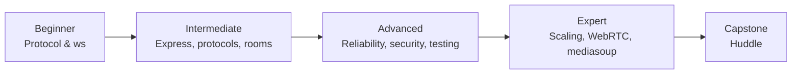
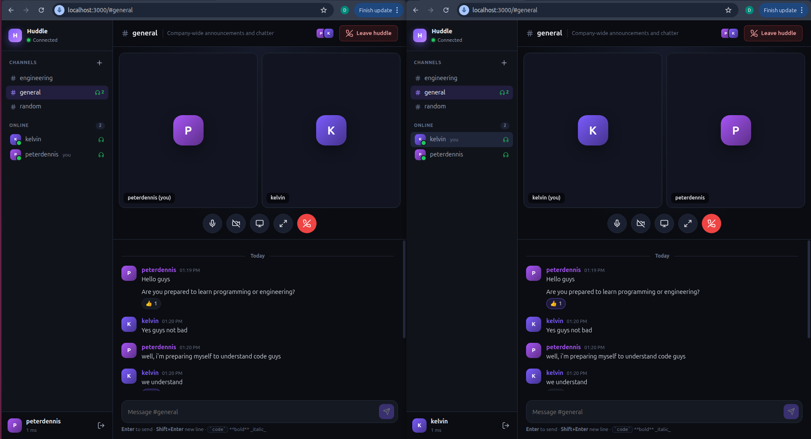

# WebSockets Mastery — Node.js & Express, from Beginner to mediasoup

A hands-on course that takes you from "what is a WebSocket?" to running a production-grade
**SFU video conferencing** stack with **mediasoup**. Every chapter has a deep explanation
(the *why*), annotated code (the *how*), pitfalls, exercises, and a runnable example.
Everything comes together in **Huddle**, a Slack-lite capstone with chat and video huddles.



## Prerequisites

- Node.js **20+** (built with Node 24), npm
- Comfortable with JavaScript (async/await, ES modules) and basic HTTP
- Optional: Docker (Redis & scaling chapter), a webcam (WebRTC/mediasoup chapters)

```bash
npm install          # shared dependencies for examples 01–10
npm run ex:02        # run any chapter example, then open http://localhost:3000
```

## Curriculum

| # | Chapter | Level | Example |
|---|---------|-------|---------|
| 0 | [HTTP & TCP in 10 minutes (primer)](docs/00-http-tcp-primer.md) | Beginner | — |
| 1 | [Fundamentals: HTTP → WebSocket, handshake, frames](docs/01-fundamentals.md) | Beginner | `examples/01-raw-handshake` — a WS server with **zero libraries** |
| 2 | [Your first server with `ws`](docs/02-first-server-ws.md) | Beginner | `examples/02-echo-ws` |
| 3 | [Integrating with Express](docs/03-express-integration.md) | Intermediate | `examples/03-express-ws` |
| 4 | [Messaging patterns: protocols, validation, rooms](docs/04-messaging-patterns.md) | Intermediate | `examples/04-chat-rooms` |
| 5 | [Reliability: heartbeats, reconnects, backpressure](docs/05-reliability.md) | Intermediate → Advanced | `examples/05-reliability` |
| 6 | [Security](docs/06-security.md) | Advanced | `examples/06-security` |
| 7 | [Socket.IO: what it adds and when to use it](docs/07-socketio.md) | Intermediate | `examples/07-socketio` |
| 8 | [Scaling horizontally (Redis, nginx, sticky sessions)](docs/08-scaling.md) | Expert | `examples/08-scaling-redis` |
| 9 | [Testing & debugging](docs/09-testing-debugging.md) | Advanced | `examples/09-testing` |
| 10 | [WebRTC fundamentals: signaling over WebSockets](docs/10-webrtc-fundamentals.md) | Advanced | `examples/10-webrtc-p2p` |
| 11 | [mediasoup: building an SFU](docs/11-mediasoup.md) | Expert | `examples/11-mediasoup-minimal` |
| 12 | [Production: TLS, TURN, deployment, monitoring](docs/12-production.md) | Expert | `examples/12-production` — nginx/Caddy, coturn, Docker, systemd/PM2 configs |
| 13 | [Capstone: building Huddle](docs/13-capstone-huddle.md) | Expert | `project/` |

📖 Stuck on a term? See the [Glossary](docs/glossary.md).

## How to study

1. **Read the chapter first**, then run the example and break it on purpose.
2. **Do the exercises.** Mastery comes from changing the code, not from reading it.
3. **Keep DevTools open** (Network → WS → Messages) so you can watch every frame.
4. For each chapter, try to explain its key takeaways without looking.

## Repository layout

```
docs/        chapters 01–13 (Markdown)
examples/    one runnable example per chapter (shared root package.json;
             11-mediasoup-minimal has its own)
project/     Huddle: capstone app (chat + mediasoup video), own package.json
```

## Capstone: Huddle



*Two browser windows (peterdennis and kelvin) in the same `#general` huddle: video tiles via the mediasoup SFU, live chat with reactions, and presence in the sidebar.*

```bash
cd project && npm install && npm run dev   # → http://localhost:3000
```

Huddle has channels, presence, typing indicators, reactions, ticket-based WebSocket auth,
rate limiting, auto-reconnect with resync, `/metrics`, and **video huddles** powered by
a mediasoup SFU (camera, mic, screen share, active-speaker highlight). See
[project/README.md](project/README.md).
