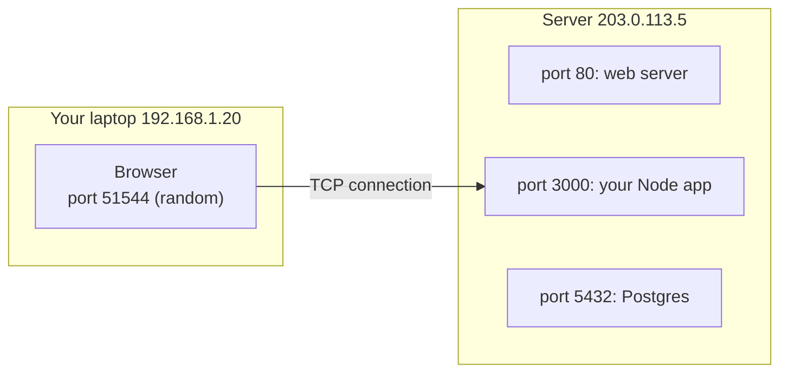
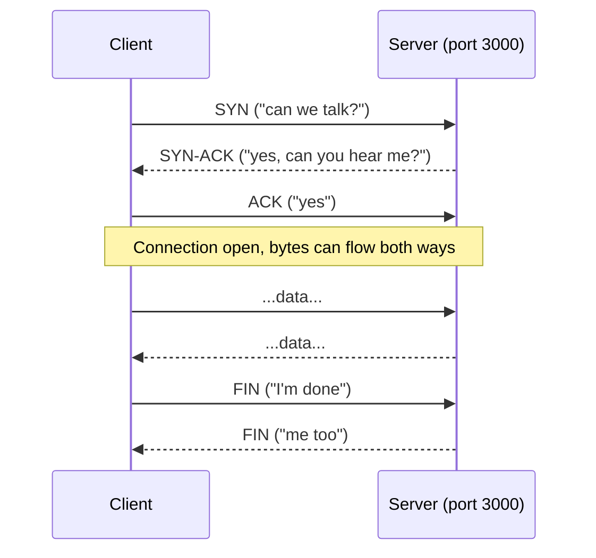
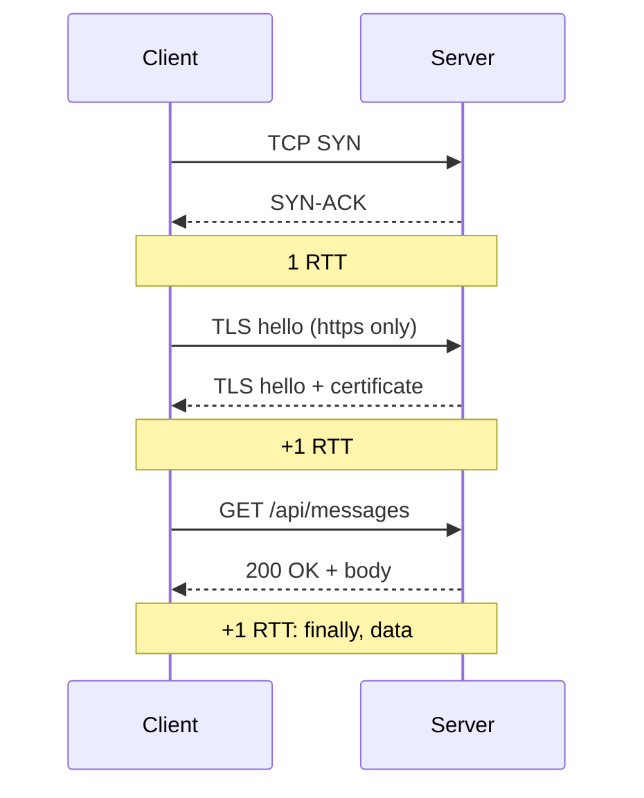
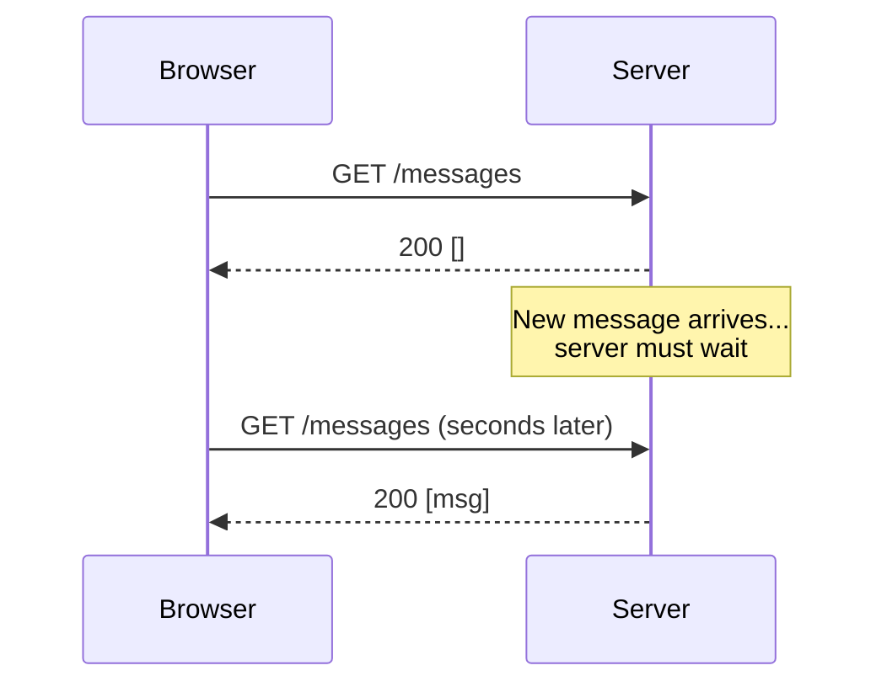
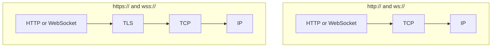
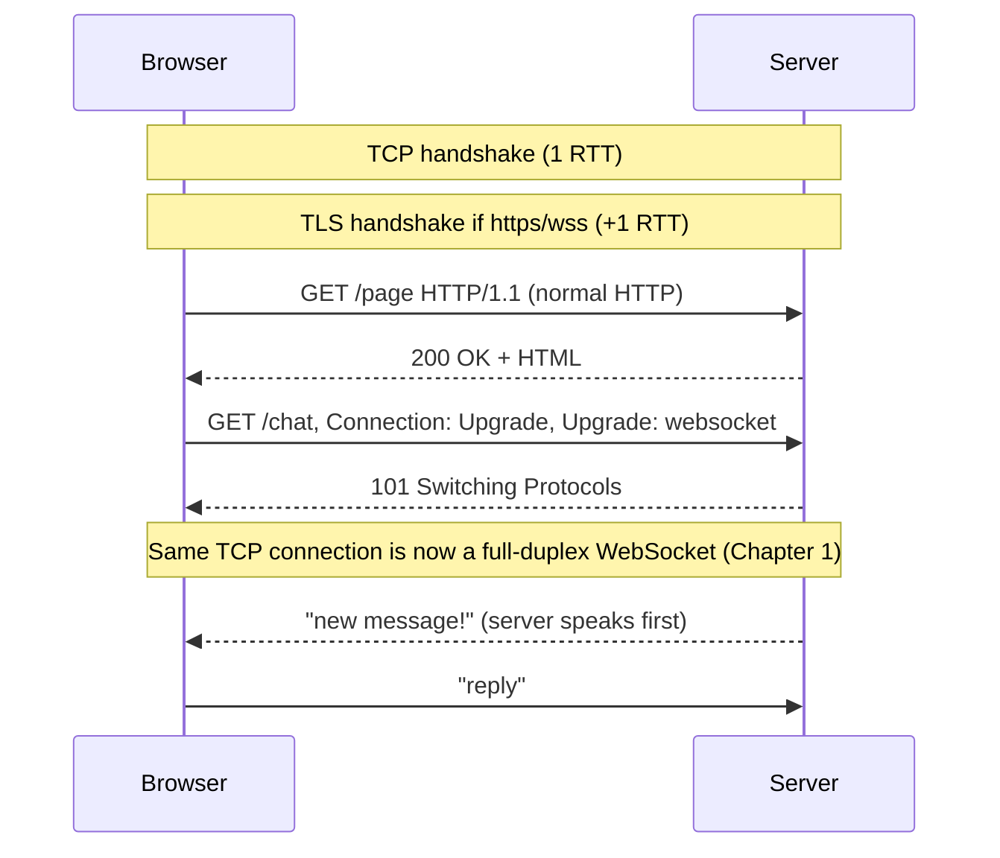

# Chapter 0 — HTTP & TCP in 10 Minutes

**Level:** `Beginner`

**What you'll learn:** Just enough networking to make the rest of the course click. You already call `fetch()` every day; this chapter shows what actually travels over the network when you do. You'll learn what **TCP** is (a reliable, ordered byte stream between two ports), what an **HTTP request and response** really look like as text on the wire, which headers matter for WebSockets (`Connection`, `Upgrade`, `Origin`, `Cookie`), why HTTP is *request/response*, what **latency** and **RTT** mean, the difference between **half duplex** and **full duplex**, and what **TLS** adds (`https`/`wss`). You'll run a 10-line `node:http` server, inspect it with `curl -v`, and a 10-line `node:net` TCP server that shows you raw bytes.

> **In plain English:** TCP is a phone line between two programs: once connected, whatever one side says arrives at the other, complete and in order. HTTP is a polite conversation *rule* on top of that line: "the client asks one question, the server gives one answer." WebSockets (Chapter 1) keep the phone line open and drop the "only answer when asked" rule, so both sides can talk whenever they want.

---

## 0.1 IP addresses and ports: who and which door

Every machine on a network has an **IP address** (e.g. `93.184.216.34`, or `127.0.0.1` a.k.a. `localhost` for "this machine"). One machine runs many programs, so each network program listens on a **port**, a number from 1 to 65535.

- An address is the **building**; a port is the **apartment number**.
- `http://localhost:3000` means "machine `localhost`, port `3000`". Plain `http://` defaults to port **80**, `https://` to **443**.
- A connection is identified by four things: *client IP, client port, server IP, server port*. The client's port is picked randomly by the OS (an **ephemeral port**), which is why one server port can serve thousands of clients at once.



## 0.2 TCP: a reliable, ordered byte stream

The internet itself only moves small **packets**, and it makes no promises: packets can be lost, duplicated, or arrive out of order. **TCP** (Transmission Control Protocol) is the layer your OS provides on top that fixes all of that. It gives two programs:

1. **A connection.** Before any data flows, the two sides agree to talk (the *three-way handshake*).
2. **Reliability.** Lost packets are resent automatically.
3. **Ordering.** Bytes come out in exactly the order they went in.
4. **A stream, not messages.** TCP moves *bytes*. If you write `"hello"` then `"world"`, the other side may read `"hell"`, `"owor"`, `"ld"`. TCP does not keep your message boundaries. (Remember this. It is exactly why WebSockets add *frames*, in Chapter 1.)

**Analogy:** UDP (TCP's simpler sibling, used by video calls in Chapter 10) is like mailing postcards: cheap, fast, but some get lost and they arrive in any order. TCP is a **phone call**: you dial, the other side picks up, and everything you say arrives in order until someone hangs up.

### The three-way handshake



That handshake costs one full trip to the server and back before you can send anything. Which brings us to latency.

## 0.3 Latency and RTT

- **Latency** is how long a single byte takes to get from A to B.
- **RTT (round-trip time)** is the time for a message to go there **and** for the reply to come back. Paris → New York is roughly 70–90 ms RTT; a phone on a bad mobile network can be 200+ ms.
- **Bandwidth** is how *much* data per second fits through. It's a separate thing: a wide pipe can still be a long one.

Every "ask and wait for an answer" step costs at least one RTT. A fresh `https://` request can cost 3 or more RTTs before the first byte of the answer arrives (TCP handshake + TLS handshake + request/response). This is why keeping a connection **open and reusing it** matters so much, and one of the big reasons WebSockets exist.



## 0.4 What an HTTP request really looks like

HTTP/1.1 is just **text sent over a TCP connection**. When you run `fetch('http://localhost:3000/hello?name=Ada')`, these exact bytes go down the wire:

```http
GET /hello?name=Ada HTTP/1.1
Host: localhost:3000
User-Agent: Mozilla/5.0 ...
Accept: */*
Connection: keep-alive
Cookie: sid=abc123

```

- **Request line:** `METHOD path VERSION`. Methods you know: `GET`, `POST`, `PUT`, `DELETE`.
- **Headers:** `Name: value` lines. Metadata about the request.
- **A blank line** (`\r\n\r\n`) marks the end of the headers.
- **Body** (optional): for a `POST`, the JSON or form data comes after the blank line, and `Content-Length` says how many bytes it is.

The server answers with the same shape:

```http
HTTP/1.1 200 OK
Content-Type: text/plain
Content-Length: 9
Connection: keep-alive

Hello Ada
```

- **Status line:** `VERSION code reason`.
- **Status codes** by first digit: `1xx` informational (**`101 Switching Protocols`** is *the* WebSocket one), `2xx` success (`200 OK`), `3xx` redirect, `4xx` client error (`400`, `401 Unauthorized`, `403 Forbidden`, `404 Not Found`), `5xx` server error.

### Headers you'll meet in this course

| Header | Direction | What it does | Where it matters |
|---|---|---|---|
| `Host` | request | Which site you want (one IP can host many). | Everywhere |
| `Connection` | both | What to do with this TCP connection: `keep-alive` (reuse it), `close`, or `Upgrade` (switch protocols). | WebSocket handshake, Ch. 1 |
| `Upgrade` | both | Which protocol to switch to, e.g. `websocket`. | Ch. 1, proxies in Ch. 8 |
| `Origin` | request | Which website (scheme + host + port) the page making the request came from. Browsers set it; pages can't fake it. | Security, Ch. 3 & 6 |
| `Cookie` / `Set-Cookie` | req / resp | The server sets a cookie; the browser sends it back automatically on later requests to the same site. | Auth, Ch. 3 |
| `Authorization` | request | Carries a token (`Bearer eyJ...`). Browsers **can't** set it on a WebSocket. | Ch. 3 & 6 |
| `Content-Type` / `Content-Length` | both | What the body is and how long it is. | REST endpoints |

## 0.5 Keep-alive, and why HTTP is request/response

Opening a TCP connection per request is expensive (see RTT above), so **HTTP/1.1 keep-alive** lets the browser reuse one connection for many requests in a row. But the rule of the conversation never changes:

1. The client sends a request.
2. The server sends **exactly one** response.
3. Repeat.

The server **cannot speak first**. If a new chat message arrives on the server, it has no way to tell the browser until the browser happens to ask. It's like **exchanging letters**: you can only get a reply to a letter you sent.



Chapter 1 walks through the workarounds (polling, long polling, SSE) and then the real fix.

## 0.6 Half duplex vs full duplex

- **Simplex:** one direction only (a radio broadcast). SSE is like this: server → client.
- **Half duplex:** both directions, but **one at a time** (a walkie-talkie: "over"). HTTP/1.1 behaves like this: request, then response, then the next request.
- **Full duplex:** both directions **at the same time** (a phone call). TCP itself is full duplex, and a **WebSocket** exposes that to your code: either side may send whenever it likes, even while the other is sending.

## 0.7 TLS in one paragraph

**TLS** (Transport Layer Security, the "S" in HTTPS) wraps a TCP connection in encryption and proves the server's identity with a certificate. It sits *between* TCP and HTTP, so HTTP itself doesn't change. `http://` is plain text on port 80; `https://` is the same HTTP inside TLS on port 443. WebSockets mirror this exactly: `ws://` is plain, **`wss://`** is WebSocket inside TLS. In production always use `https` + `wss`: without TLS anyone on the Wi-Fi can read and change your messages, and many corporate proxies break plain `ws://`. Browsers also block `ws://` from an `https://` page (mixed content). Chapter 12 sets this up for real.



## 0.8 Try it: an HTTP server in 10 lines

Create `primer-http.js`:

```js
// primer-http.js — run with: node primer-http.js
import http from 'node:http';

const server = http.createServer((req, res) => {
  console.log(req.method, req.url, req.headers);   // the parsed request
  res.writeHead(200, { 'Content-Type': 'text/plain' });
  res.end(`Hello ${new URL(req.url, 'http://x').searchParams.get('name') ?? 'world'}\n`);
});

server.listen(3000, () => console.log('http://localhost:3000'));
```

(`import` needs ESM: either name the file `.mjs` or run it from this repo, whose `package.json` has `"type": "module"`.)

Now look at the raw conversation with `curl -v` (`>` lines are what curl sent, `<` lines are what came back):

```bash
curl -v "http://localhost:3000/hello?name=Ada"
```

```
*   Trying 127.0.0.1:3000...
* Connected to localhost (127.0.0.1) port 3000
> GET /hello?name=Ada HTTP/1.1
> Host: localhost:3000
> User-Agent: curl/8.5.0
> Accept: */*
>
< HTTP/1.1 200 OK
< Content-Type: text/plain
< Date: Mon, 28 Sep 2026 10:00:00 GMT
< Connection: keep-alive
< Keep-Alive: timeout=5
< Transfer-Encoding: chunked
<
Hello Ada
```

Notice "Connected" (that's the TCP handshake), the request line and headers, the blank line, then the status line, headers, blank line, body. That's all HTTP is. Try adding a header yourself: `curl -v -H "Origin: http://evil.example" http://localhost:3000/` and watch it show up in the server log.

## 0.9 Try it: raw TCP bytes in 10 lines

HTTP is built on TCP. Node's `node:net` module gives you TCP directly, with no HTTP parsing at all:

```js
// primer-tcp.js — run with: node primer-tcp.js
import net from 'node:net';

const server = net.createServer((socket) => {
  console.log('client connected from', socket.remoteAddress, socket.remotePort);
  socket.on('data', (chunk) => {
    console.log('got bytes:', chunk);            // a Buffer: raw bytes
    socket.write(`echo: ${chunk}`);              // send bytes back
  });
  socket.on('end', () => console.log('client hung up'));
});
server.listen(4000, () => console.log('TCP echo on port 4000'));
```

Connect with `nc localhost 4000` (netcat; on Windows use `telnet localhost 4000`) and type lines. Each line you type comes back prefixed with `echo:`. Now the fun part: point `curl` at it.

```bash
curl http://localhost:4000/hello
```

The server logs something like:

```
got bytes: <Buffer 47 45 54 20 2f 68 65 6c 6c 6f 20 48 54 54 50 2f 31 2e 31 0d 0a ...>
```

`47 45 54 20` is `G E T space`. Your TCP server just received an HTTP request as **plain bytes**, because that's all an HTTP request is. (curl will complain about the reply, since `echo: GET ...` isn't a valid HTTP response. It proves the point.) In Chapter 1 you'll see a WebSocket server grab one of these raw sockets from Node's HTTP server and start speaking a different protocol on it.

## 0.10 How it all fits together



---

## Common pitfalls

1. **Thinking one `data` event = one message.** TCP is a byte stream; chunks can split or merge your writes. (WebSockets fix this for you.)
2. **Confusing latency and bandwidth.** A fast connection with 200 ms RTT still makes every request/response round trip slow.
3. **Using `ws://` from an `https://` page.** The browser blocks it. Use `wss://`.
4. **Assuming the server can push over plain HTTP.** It can only answer requests.
5. **Port already in use (`EADDRINUSE`).** Another program (often a previous run of yours) is listening on that port. Stop it or pick another port.

## Exercises

1. Run `primer-http.js` and use `curl -v -X POST -H "Content-Type: application/json" -d '{"a":1}' http://localhost:3000/` . Find `Content-Length` in the output. Why is it 7?
2. In Chrome DevTools → Network, open any request and click "Raw" / "view source" on the headers. Match each line to §0.4.
3. Send two `socket.write()` calls back-to-back from a TCP client to `primer-tcp.js`. Do they arrive as one `data` event or two? Try a 1 MB write.
4. Use `curl -v https://example.com` and find the TLS handshake lines (`* SSL connection using ...`).

<details>
<summary>Hints</summary>

- Ex 1: `{"a":1}` is 7 characters, and each is one byte in UTF-8.
- Ex 3: write a tiny client with `net.connect(4000, 'localhost', () => { s.write('a'); s.write('b'); })`. Small writes are often merged; large ones are split.
- Ex 4: lines starting with `*` are curl's own commentary on the connection.

</details>

---

## Check your understanding

1. A client writes `"hi"` and then `"there"` over a TCP connection. What can the server's `data` events contain?
<details><summary>Answer</summary>

Any split of the bytes `hithere`, in order: one event with `hithere`, or `hit` + `here`, or even one byte at a time. TCP guarantees **order and delivery**, not message boundaries. That's why WebSocket adds framing on top.
</details>

2. Why can't a plain HTTP server tell the browser "you have a new message" the moment it arrives?
<details><summary>Answer</summary>

HTTP is request/response: the server may only send a response to a request the client made. With no outstanding request, it has nothing to answer. (Long polling cheats by keeping a request open; WebSockets remove the rule.)
</details>

3. RTT to your server is 100 ms. Roughly how long before the first byte of a response to a brand-new `https://` request, ignoring server time?
<details><summary>Answer</summary>

About **300 ms**: 1 RTT for the TCP handshake, about 1 RTT for TLS (TLS 1.3), and 1 RTT for the request and response. On a reused keep-alive connection it's just 1 RTT. On an already-open WebSocket, a server push takes only half an RTT, since no request is needed.
</details>

4. Is HTTP/1.1 half duplex or full duplex from your code's point of view? What about the TCP connection underneath?
<details><summary>Answer</summary>

HTTP/1.1 behaves as **half duplex**: request, then response, one at a time. TCP underneath is **full duplex**: both sides can send simultaneously. WebSockets give your code that full-duplex ability.
</details>

5. Read the code: in `primer-tcp.js`, what gets logged when `curl http://localhost:4000/` connects, and why does curl then report an error?
<details><summary>Answer</summary>

"client connected from ..." and then `got bytes: <Buffer 47 45 54 ...>`: the raw text of curl's HTTP request (`GET / HTTP/1.1 ...`). The server replies `echo: GET / ...`, which does not start with a valid status line like `HTTP/1.1 200 OK`, so curl can't parse it as an HTTP response.
</details>

---

## Key takeaways

- **IP address + port** identify a program on a machine; `http` defaults to 80, `https` to 443.
- **TCP** = a connection (phone call) that delivers a **reliable, ordered byte stream**, with **no message boundaries**.
- **HTTP/1.1** is text over TCP: request line, headers, blank line, body; response has a status line and a status code (`101`, `200`, `401`, `404`...).
- HTTP is **request/response**: the server can't speak first. **Keep-alive** reuses the connection but doesn't change that rule.
- **RTT** dominates: every ask-and-wait costs a round trip, so long-lived connections are fast.
- **Full duplex** = both sides talk at once. WebSockets give you that.
- **TLS** encrypts: `https`/`wss` in production, always.

📖 Stuck on a term? See the [Glossary](glossary.md).

Next → [Chapter 1 — WebSocket Fundamentals](./01-fundamentals.md)
