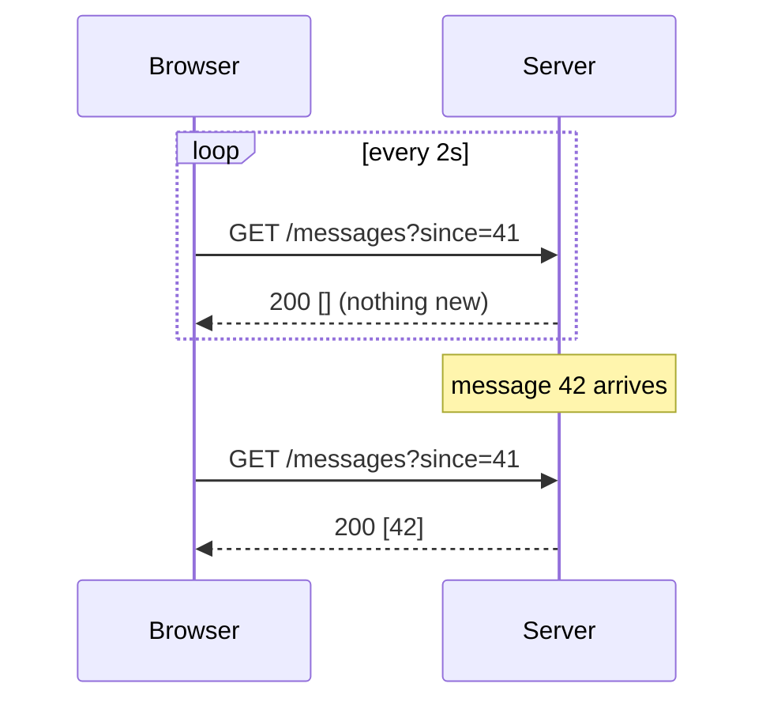
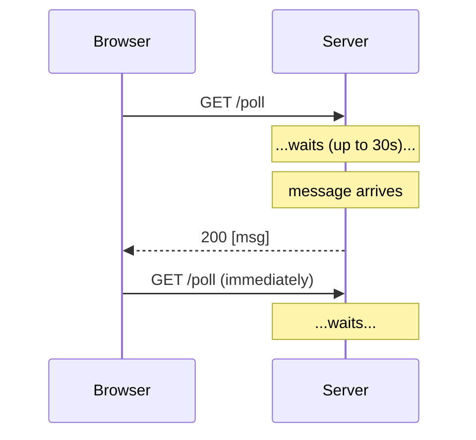
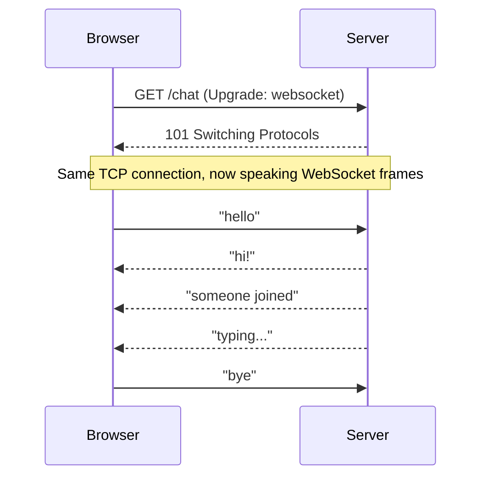
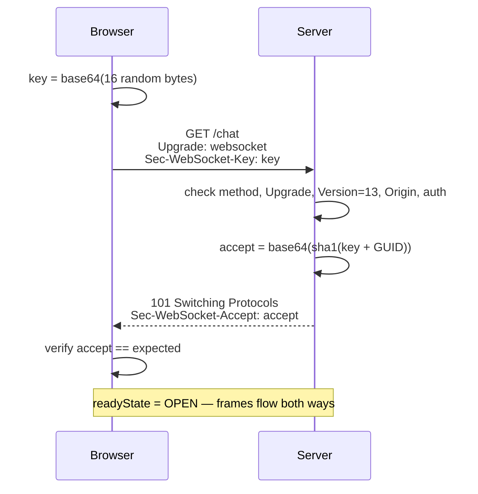
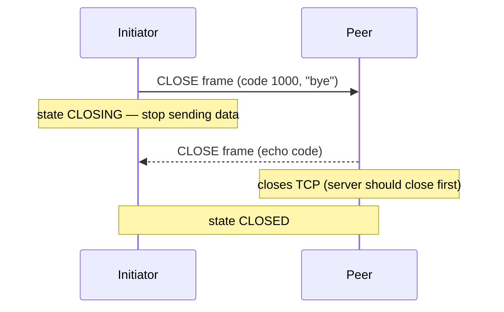

# Chapter 1 — WebSocket Fundamentals: From Polling to RFC 6455

**Level:** `Beginner`

**What you'll learn:** Why WebSockets exist and what problem they solve better than polling, long-polling and Server-Sent Events; exactly what happens on the wire when a browser opens `new WebSocket(...)` — the HTTP/1.1 Upgrade handshake, the `Sec-WebSocket-Key` → SHA-1 → `Sec-WebSocket-Accept` proof, the binary frame format bit by bit, why client frames are masked, control frames (ping, pong, close), close codes, subprotocols and extensions. You will finish by reading and running a WebSocket server written with **nothing but `node:http` and `node:crypto`**, so that every later chapter's library feels like a convenience rather than magic.

> **In plain English:** Normal HTTP is like sending letters: the browser writes, the server replies, and the server can never write first. A WebSocket is like turning that letter exchange into a phone call that stays open: after one special "can we switch to a call?" request, both sides can talk whenever they want. The key idea: **one ordinary HTTP request upgrades into a long-lived, two-way channel** that carries small messages with almost no overhead.

New to HTTP/TCP? Read [Chapter 0](00-http-tcp-primer.md) first.

---

## Quick win: WebSockets in 5 minutes

Before the theory, let's see one work. Save this as `quick-win.js` in the repo root (where `npm install` put the `ws` package) and run `node quick-win.js`:

```js
// quick-win.js — an echo + broadcast WebSocket server
import { WebSocketServer, WebSocket } from 'ws';

const wss = new WebSocketServer({ port: 3000 });

wss.on('connection', (ws) => {
  ws.send(`welcome! ${wss.clients.size} client(s) connected`);
  ws.on('message', (data) => {
    for (const client of wss.clients) {                 // broadcast to everyone
      if (client.readyState === WebSocket.OPEN) client.send(`someone said: ${data}`);
    }
  });
});
console.log('listening on ws://localhost:3000');
```

Now open a browser tab (a blank tab or any `http://localhost` page), open DevTools → **Console**, and paste:

```js
const ws = new WebSocket('ws://localhost:3000');
ws.onopen = () => ws.send('hello from the browser');
ws.onmessage = (event) => console.log('server:', event.data);
ws.onclose = (event) => console.log('closed', event.code);
// Later, type: ws.send('anything you like')
```

You should see `server: welcome! 1 client(s) connected` and then `server: someone said: hello from the browser`. Open a **second tab**, paste the same snippet, and type `ws.send('hi from tab 2')`: the message appears in **both** consoles.

**What just happened?**

1. `new WebSocket(...)` sent one ordinary HTTP `GET` with an `Upgrade: websocket` header ([§1.2](#12-the-opening-handshake-rfc-6455-4)). The `ws` library answered `101 Switching Protocols`, and the [TCP](glossary.md#tcp) connection stayed open.
2. From then on, **either side can send at any time**. The server spoke first (`welcome!`) without being asked, which plain HTTP can't do.
3. `wss.clients` is the set of open connections, so looping over it is a **broadcast**: one tab's message is pushed to every tab instantly, with no polling.
4. Look at DevTools → Network → the `ws://localhost:3000` entry → **Messages**: every line you sent or received is one WebSocket message.

The rest of this chapter explains exactly what those bytes look like, and why. Chapter 2 builds on this server properly.

---

## 1.1 The problem: HTTP is request/response

HTTP (before HTTP/2 push, which never took off) has one shape: the **client asks, the server answers**. The server cannot speak first. That is perfect for documents and fine for most APIs, but many applications need the server to push data the moment it exists:

- chat messages, notifications, "someone is typing…"
- live dashboards, stock tickers, sports scores
- multiplayer games, collaborative editors (cursor positions, operations)
- WebRTC signaling (chapter 10), job progress bars, IoT telemetry

Over the years developers invented four main ways to fake or achieve "server push" in the browser.

### Short polling

The client asks every N seconds: "anything new?"



- **Latency** is up to N seconds (average N/2).
- **Waste**: most requests return nothing, yet each carries full HTTP headers (often 500–2000 bytes with cookies) and costs a [round trip (RTT)](00-http-tcp-primer.md#03-latency-and-rtt) plus server work.
- Trivial to implement and works through every proxy.

### Long polling

The client asks, and the server **holds the request open** until it has something (or a timeout, e.g. 30 s), then the client immediately asks again.



- Near-real-time delivery **server → client**.
- Still one full HTTP request per message burst; messages that arrive between a response and the next request must be buffered server-side.
- Client → server messages are separate POSTs.
- This is what Socket.IO (chapter 7) falls back to when WebSockets are blocked.

### Server-Sent Events (SSE)

A standard browser API (`EventSource`) over a single long-lived HTTP response with `Content-Type: text/event-stream`. The server writes lines like `data: hello\n\n` whenever it wants.

- Genuinely streaming, **one direction only** (server → client).
- Text only (UTF-8), automatic reconnection with `Last-Event-ID` built in.
- Plain HTTP, so it plays well with HTTP/2 multiplexing, proxies and auth middleware.
- Great for notifications, feeds, LLM token streaming. Not enough for chat or games, where the client also sends a lot.

### WebSockets

One HTTP request that **upgrades** the TCP connection into a persistent, **[full-duplex](glossary.md#full-duplex)** (both sides can talk at once), message-oriented channel. After the handshake, either side can send a message at any time with only **2–14 bytes of framing overhead**.



### Comparison table

| | Short polling | Long polling | SSE | WebSocket |
|---|---|---|---|---|
| Direction | client pull | server push (emulated) | server → client | **full duplex** |
| Latency | up to poll interval | ~1 [RTT](glossary.md#rtt) | ~0 | ~0 |
| Per-message overhead | full HTTP req+resp | full HTTP resp + next req | a few bytes | 2–14 bytes |
| Binary data | yes (per request) | yes | **no** (text only) | **yes** |
| Auto reconnect | n/a | manual | **built in** | manual (chapter 5) |
| Works with plain HTTP infra | yes | yes (watch timeouts) | yes | needs Upgrade support |
| Server resources | many short requests | one parked request per client | one open response per client | one open socket per client |
| Browser API | `fetch` | `fetch` | `EventSource` | `WebSocket` |
| Best for | rarely changing data | fallback | feeds, notifications, streaming text | chat, games, collaboration, signaling |

> **Rule of thumb:** If only the server talks, consider SSE first — it's simpler. If both sides talk frequently or you need binary, use WebSockets.

---

## 1.2 The opening handshake (RFC 6455 §4)

A WebSocket connection starts life as a perfectly ordinary HTTP/1.1 `GET` request. This is a deliberate design choice: it lets WebSockets use ports 80/443, pass through existing load balancers, and reuse cookies and authentication.

### The client request

When you run `new WebSocket('ws://localhost:3000/chat', ['echo.v1'])`, the browser sends:

```http
GET /chat HTTP/1.1
Host: localhost:3000
Connection: Upgrade
Upgrade: websocket
Sec-WebSocket-Version: 13
Sec-WebSocket-Key: dGhlIHNhbXBsZSBub25jZQ==
Sec-WebSocket-Protocol: echo.v1
Sec-WebSocket-Extensions: permessage-deflate; client_max_window_bits
Origin: http://localhost:3000
Cookie: sid=abc123
```

Header by header:

| Header | Meaning |
|---|---|
| `Connection: Upgrade` | "This hop-by-hop connection wants to change protocol." Proxies must forward it explicitly (see nginx config in chapter 8). |
| `Upgrade: websocket` | Which protocol we want to switch to. |
| `Sec-WebSocket-Version: 13` | The only version in use today. A server that doesn't speak it answers `426 Upgrade Required` with the versions it supports. |
| `Sec-WebSocket-Key` | 16 random bytes, base64-encoded. **Not** security; it's a nonce to prove the server understood the handshake. |
| `Sec-WebSocket-Protocol` | Optional, comma-separated list of *application* subprotocols the client speaks (e.g. `graphql-transport-ws`, `mqtt`, `echo.v1`). |
| `Sec-WebSocket-Extensions` | Optional *protocol* extensions, practically always `permessage-deflate` (compression). |
| `Origin` | Sent by browsers. The server **must** check it to prevent Cross-Site WebSocket Hijacking (chapter 6). Non-browser clients can put anything here. |
| `Cookie` | Browsers send cookies for the target host, just like any request. This is how session auth works during the upgrade (chapter 3). |

The `Sec-` prefix matters: browsers forbid JavaScript from setting headers starting with `Sec-`, so a page cannot forge a WebSocket handshake with `fetch()`/XHR. That's also why **you cannot add custom headers** (like `Authorization`) to a browser WebSocket — a limitation we'll work around in chapter 3.

### The server response

```http
HTTP/1.1 101 Switching Protocols
Upgrade: websocket
Connection: Upgrade
Sec-WebSocket-Accept: s3pPLMBiTxaQ9kYGzzhZRbK+xOo=
Sec-WebSocket-Protocol: echo.v1
```

`101` means: "from the next byte on, this TCP connection is not HTTP anymore." Any other status (200, 401, 403, 404…) means the handshake failed; the browser fires `error` then `close` (code `1006`) and **does not expose the status code to JavaScript** — another thing to remember when you design auth errors.

### Computing `Sec-WebSocket-Accept`

```
accept = base64( SHA1( Sec-WebSocket-Key + "258EAFA5-E914-47DA-95CA-C5AB0DC85B11" ) )
```

The GUID is a fixed constant from the RFC. Try it:

```js
// node -e (paste into a file or the REPL)
import crypto from 'node:crypto';
const key = 'dGhlIHNhbXBsZSBub25jZQ=='; // the example key from RFC 6455
const accept = crypto
  .createHash('sha1')
  .update(key + '258EAFA5-E914-47DA-95CA-C5AB0DC85B11')
  .digest('base64');
console.log(accept); // s3pPLMBiTxaQ9kYGzzhZRbK+xOo=
```

**Why bother?** Without it, a naive HTTP server or caching proxy that just echoes headers or returns a cached `101` could trick a client into thinking it has a WebSocket. Only a server that *knows the algorithm* can produce the right value for a fresh random key. It is **not** authentication and **not** encryption. For encryption use `wss://` (WebSocket over TLS — same handshake, inside TLS).



### How Node exposes this: the `'upgrade'` event

Node's `http.Server` recognizes a request with `Connection: Upgrade`. Instead of calling your `(req, res)` handler, it emits:

```js
server.on('upgrade', (req, socket, head) => { /* ... */ });
```

- `req` — the parsed `IncomingMessage` (URL, headers, cookies are all there).
- `socket` — the raw `net.Socket` (or `tls.TLSSocket`). There is **no `res`**; you write the HTTP response bytes yourself.
- `head` — the first bytes after the headers, if the client already sent some (usually empty, but you must not drop it).

If you don't listen to `'upgrade'`, Node destroys the socket. Every WebSocket library for Node — `ws`, Socket.IO's engine — is built on exactly this event. In chapter 3 you will use it directly for routing and authentication.

---

## 1.3 The frame format (RFC 6455 §5.2)

> 🔬 **Deep dive — optional on first read.** You can skip to [§1.5](#15-control-frames-ping-pong-close) and come back later; libraries handle this for you.

After `101`, both sides exchange **frames**. A *message* consists of one or more frames. Here is the layout:

```
  0                   1                   2                   3
  0 1 2 3 4 5 6 7 8 9 0 1 2 3 4 5 6 7 8 9 0 1 2 3 4 5 6 7 8 9 0 1
 +-+-+-+-+-------+-+-------------+-------------------------------+
 |F|R|R|R| opcode|M| Payload len |    Extended payload length    |
 |I|S|S|S|  (4)  |A|     (7)     |             (16/64)           |
 |N|V|V|V|       |S|             |   (if payload len==126/127)   |
 | |1|2|3|       |K|             |                               |
 +-+-+-+-+-------+-+-------------+ - - - - - - - - - - - - - - - +
 |     Extended payload length continued, if payload len == 127  |
 + - - - - - - - - - - - - - - - +-------------------------------+
 |                               |Masking-key, if MASK set to 1  |
 +-------------------------------+-------------------------------+
 | Masking-key (continued)       |          Payload Data         |
 +-------------------------------- - - - - - - - - - - - - - - - +
 :                     Payload Data continued ...                :
 +---------------------------------------------------------------+
```

### Byte 0

| Bits | Field | Meaning |
|---|---|---|
| 1 | **FIN** | 1 = this is the final frame of the message. 0 = more fragments follow. |
| 3 | **RSV1–3** | Reserved. Must be 0 unless an extension defines them. `permessage-deflate` uses **RSV1** to mean "this message is compressed". |
| 4 | **opcode** | What kind of frame this is (table below). |

### Opcodes

| Opcode | Name | Kind |
|---|---|---|
| `0x0` | continuation | data (fragment of a previous text/binary frame) |
| `0x1` | text | data — payload is UTF-8 (receivers **must** validate) |
| `0x2` | binary | data — arbitrary bytes |
| `0x3`–`0x7` | reserved | — |
| `0x8` | close | control |
| `0x9` | ping | control |
| `0xA` | pong | control |
| `0xB`–`0xF` | reserved | — |

### Byte 1 and the length encoding

| Bits | Field | Meaning |
|---|---|---|
| 1 | **MASK** | 1 = a 4-byte masking key follows. Client → server: **always 1**. Server → client: **always 0**. |
| 7 | **payload len** | `0–125`: that's the length. `126`: the real length is the next **16-bit** unsigned integer. `127`: the real length is the next **64-bit** unsigned integer (most significant bit must be 0). |

So the header is between 2 and 14 bytes:

| Payload size | Length bytes | Server→client header | Client→server header (+4 mask) |
|---|---|---|---|
| 0–125 B | 0 | 2 bytes | 6 bytes |
| 126 B – 64 KiB | 2 | 4 bytes | 8 bytes |
| > 64 KiB | 8 | 10 bytes | 14 bytes |

### Worked example: decoding a real frame

The browser sends the text `Hi` with masking key `37 fa 21 3d`:

```
81 82 37 fa 21 3d 7f 93
│  │  └─────┬────┘ └─┬─┘
│  │   masking key   masked payload
│  └─ 1000 0010: MASK=1, len=2
└──── 1000 0001: FIN=1, RSV=000, opcode=1 (text)

unmask:  0x7f ^ 0x37 = 0x48 = 'H'
         0x93 ^ 0xfa = 0x69 = 'i'
```

The server replies `Hi` unmasked: `81 02 48 69`. Four bytes on the wire for a whole message — compare with an HTTP response.

### Fragmentation

> 🔬 **Deep dive — optional on first read.** You can skip to [§1.5](#15-control-frames-ping-pong-close) and come back later; libraries handle this for you. The one idea to keep: *TCP is a byte stream, WebSocket delivers whole messages.*

A single message can be split into frames: first frame has the real opcode and `FIN=0`, middle frames have opcode `0x0` and `FIN=0`, the last has opcode `0x0` and `FIN=1`. This lets a sender stream a message whose size it doesn't know upfront. **Control frames may be interleaved** between fragments (so a ping can get through during a huge upload), but control frames themselves can never be fragmented and their payload is at most **125 bytes**.

```
[FIN=0 op=TEXT "Hel"] [FIN=1 op=PING] [FIN=0 op=CONT "lo, "] [FIN=1 op=CONT "world"]
          └──────────────────── one message: "Hello, world" ─────────────────────┘
```

Important consequence: **WebSocket is message-oriented, TCP is stream-oriented.** A single `data` event from the TCP socket may contain half a frame or several frames. Every parser needs a buffer. The browser and `ws` hand you whole *messages*, so you never deal with this — but our raw server below does.

---

## 1.4 Masking: why client→server frames are masked

> 🔬 **Deep dive — optional on first read.** You can skip to [§1.5](#15-control-frames-ping-pong-close) and come back later; libraries handle this for you. Short version: browsers scramble outgoing frames to protect old proxies. It is **not** encryption.

Every frame from a client is XOR'd with a fresh random 4-byte key:

```
masked[i] = original[i] XOR key[i mod 4]
```

The key is sent in the clear right before the payload, so masking is **not encryption** — anyone can unmask it. So why?

The reason is **cache poisoning of transparent proxies** (see RFC 6455 §10.3 and the 2010 paper "Talking to Yourself for Fun and Profit" by Huang, Chen, Barth, Rescorla and Jackson). Some older intercepting proxies did not understand the Upgrade and kept parsing the connection as HTTP. A malicious page could then send bytes *that looked like an HTTP request* (`GET /jquery.js HTTP/1.1 Host: cdn.example.com`) inside a WebSocket frame, followed by a forged "response" from the attacker's server, and the proxy would cache the attacker's JavaScript for everyone behind it.

Masking with a key the **browser** chooses (not page JavaScript) makes the bytes on the wire unpredictable to the attacker, so they can't craft something a proxy will misinterpret. Servers don't need to mask because the attacker controls the *page*, not the server's output in this threat model.

Rules to remember:

- Client → server frames **must** be masked; a server **must** close the connection (1002) if it receives an unmasked frame.
- Server → client frames **must not** be masked.
- `ws` unmasks for you with a fast native/JS routine; in our raw example you'll see the XOR loop.

---

## 1.5 Control frames: ping, pong, close

### Ping / Pong

- Either side may send a **ping** (`0x9`) with up to 125 bytes of data.
- The receiver **must** answer with a **pong** (`0xA`) carrying the *same* data "as soon as practical".
- An unsolicited pong is allowed (a one-way heartbeat).

Why? TCP can't tell you that the other side vanished (laptop lid closed, mobile network switch, NAT entry expired). Without traffic, a dead connection can look alive for hours. The server sends periodic pings; if no pong comes back within an interval, it terminates the socket. This is the **heartbeat** pattern you'll implement in chapter 5.

> Browsers answer pings automatically, but the **browser JavaScript API cannot send pings** or see pongs. For client-side liveness detection you send an application-level `{type:"ping"}` message.

### Close and the closing handshake



The close payload is: optional **2-byte big-endian status code** + optional **UTF-8 reason** (total ≤ 125 bytes, so reason ≤ 123 bytes). After sending a close, an endpoint must not send more data frames. After both have sent close, the TCP connection is closed — ideally by the server, so the `TIME_WAIT` state sits on the server.

### Close codes

| Code | Name | Who uses it / meaning |
|---|---|---|
| **1000** | Normal Closure | Done, all good. |
| **1001** | Going Away | Server shutting down, or browser navigating away from the page. |
| **1002** | Protocol Error | Malformed frame, unmasked client frame, etc. |
| **1003** | Unsupported Data | e.g. binary received by an endpoint that only accepts text. |
| 1004 | reserved | — |
| **1005** | No Status Received | *Never sent on the wire.* Reported locally when a close frame had no code. |
| **1006** | Abnormal Closure | *Never sent on the wire.* Reported locally when TCP dropped without a close frame. **This is what you'll see most in the browser** for network failures and rejected handshakes. |
| **1007** | Invalid Payload Data | e.g. invalid UTF-8 in a text frame. |
| **1008** | Policy Violation | Generic "you broke the rules" (auth expired, bad origin). |
| **1009** | Message Too Big | Exceeded the receiver's max payload (`maxPayload` in `ws`). |
| **1010** | Mandatory Extension | Client expected an extension the server didn't negotiate. |
| **1011** | Internal Error | Server hit an unexpected condition. |
| 1012 / 1013 | Service Restart / Try Again Later | IANA-registered, used by some servers to hint reconnect behavior. |
| 1015 | TLS Handshake failure | *Never sent.* Local only. |
| **3000–3999** | registered for libraries/frameworks | e.g. 3000 "unauthorized" is a common convention. |
| **4000–4999** | **private use** | Your application: `4001` "token expired", `4004` "room not found"… |

In the browser, `ws.close(code, reason)` only accepts `1000` or `3000–4999`; anything else throws `InvalidAccessError`.

---

## 1.6 Subprotocols and extensions

These two negotiation mechanisms are often confused:

| | Subprotocol (`Sec-WebSocket-Protocol`) | Extension (`Sec-WebSocket-Extensions`) |
|---|---|---|
| Layer | **Application**: what the messages *mean* | **Protocol**: how frames are *encoded* |
| Examples | `graphql-transport-ws`, `mqtt`, `wamp.2.json`, `v2.chat.myapp` | `permessage-deflate` |
| Who handles it | your code | the WebSocket library |
| Server picks | **exactly one** of the offered list (or none) | a subset, possibly with parameters |
| Browser API | `new WebSocket(url, ['a','b'])` → `ws.protocol` | automatic → `ws.extensions` |

**Subprotocol rules:** if the client offered protocols and the server responds with one it didn't offer, the browser fails the connection. If the server responds with none, the connection succeeds with `ws.protocol === ''` — so check it if you rely on it. Subprotocols are a good way to **version** your message protocol (`chat.v1`, `chat.v2`). They're also (ab)used to smuggle a token past the no-custom-headers rule; chapter 3 covers that trick and its caveats.

### `permessage-deflate` (RFC 7692)

Compresses each message with DEFLATE and marks it with **RSV1=1**. Negotiation parameters include `server_no_context_takeover`, `client_no_context_takeover`, `server_max_window_bits`, `client_max_window_bits`.

- **Context takeover** keeps the compression dictionary between messages — much better ratios for repetitive JSON, but **each connection keeps ~ hundreds of KB of zlib state**. With 50 000 connections that's gigabytes.
- It costs CPU on both sides and has had memory-fragmentation issues in Node (see the `ws` README).
- `ws` ships it **disabled by default on the server** for these reasons. Enable it deliberately and with `threshold` so tiny messages aren't compressed (chapter 2).
- Security note: compressing secrets together with attacker-controlled data enables CRIME/BREACH-style attacks.

---

## 1.7 The browser `WebSocket` API

The browser API is small. Learn it completely — it's the contract every server you write must satisfy.

```js
const ws = new WebSocket('ws://localhost:3000/', ['echo.v1']); // URL, optional subprotocols
ws.binaryType = 'arraybuffer'; // or 'blob' (default)

ws.addEventListener('open', () => {
  console.log('open; negotiated protocol =', ws.protocol, 'extensions =', ws.extensions);
  ws.send('hello');                        // string -> text frame
  ws.send(new Uint8Array([1, 2, 3]));      // ArrayBuffer / TypedArray / Blob -> binary frame
});

ws.addEventListener('message', (event) => {
  if (typeof event.data === 'string') console.log('text', event.data);
  else console.log('binary', new Uint8Array(event.data)); // ArrayBuffer because of binaryType
});

ws.addEventListener('error', () => {
  // Intentionally vague: no status code, no reason (prevents port scanning / info leaks).
  console.log('error — a close event will follow');
});

ws.addEventListener('close', (event) => {
  console.log('closed', event.code, event.reason, 'clean =', event.wasClean);
});
```

### `readyState`

| Value | Constant | Meaning |
|---|---|---|
| 0 | `WebSocket.CONNECTING` | Handshake in progress. `send()` here **throws** `InvalidStateError`. |
| 1 | `WebSocket.OPEN` | Ready. |
| 2 | `WebSocket.CLOSING` | Close handshake started. `send()` silently discards data. |
| 3 | `WebSocket.CLOSED` | Done. A WebSocket object **cannot be reopened** — create a new one. |

The same constants exist on `ws`'s `WebSocket` class in Node, so `socket.readyState === WebSocket.OPEN` is portable.

### `binaryType`

Controls how *incoming* binary messages are delivered: `'blob'` (default; good for files, needs `await blob.arrayBuffer()` to read) or `'arraybuffer'` (synchronous access; best for protocols). Outgoing, you can send either.

### `bufferedAmount` — backpressure

`send()` never blocks. It queues data and returns immediately. `ws.bufferedAmount` is the number of bytes queued but not yet handed to the network. If you send faster than the network can carry (e.g. streaming video frames or a big file over a slow link), this grows without bound and the tab eventually runs out of memory.

```js
// Simple flow control: don't queue more than 1 MB
function sendWhenReady(ws, data) {
  if (ws.bufferedAmount > 1_000_000) {
    setTimeout(() => sendWhenReady(ws, data), 50);
    return;
  }
  ws.send(data);
}
```

(There is a newer `WebSocketStream` API with real stream-based backpressure, not yet broadly available. On the server, `ws` exposes `socket.bufferedAmount` too — chapter 5 uses it to drop slow consumers.)

### What the browser API does **not** let you do

- Set custom headers (no `Authorization`).
- Send pings or observe pongs.
- See the HTTP status of a failed handshake.
- Reconnect automatically (unlike `EventSource`).

Every one of these limitations shapes the design of later chapters.

---

## 1.8 Build it: a WebSocket server with zero dependencies

> 🔬 **Deep dive — optional on first read.** You can skip to [Common pitfalls](#common-pitfalls) and come back later; libraries handle this for you. The [Quick win](#quick-win-websockets-in-5-minutes) server above is all you need to continue to Chapter 2.

Now let's prove we understand all of the above by writing a server with only Node built-ins. It will:

1. Serve an HTML page over plain HTTP.
2. Perform the handshake on `'upgrade'`, including subprotocol selection.
3. Parse client frames from a TCP byte stream (buffering partial frames), unmask them, handle fragmentation.
4. Echo text (prefixed with `echo: `) and binary messages back in unmasked frames.
5. Answer pings with pongs, and complete the closing handshake.

Project layout:

```
examples/01-raw-handshake/
├── server.js          # the whole server
├── public/index.html  # a tiny browser client
└── README.md
```

### Step 1 — HTTP server and the upgrade hook

The server is an ordinary `http.createServer`. The normal handler serves `index.html`. The interesting part is `server.on('upgrade', ...)`: we validate the request, compute the accept key with `crypto.createHash('sha1')`, choose a subprotocol, and **write the 101 response by hand onto the raw socket**. Notice the response is just text lines separated by `\r\n`, ending with a blank line.

### Step 2 — Parsing frames from a stream

`handleConnection` keeps a `buffer`. Every `'data'` chunk is appended, then we loop: `parseFrame(buffer)` returns `null` if the buffer doesn't contain a complete frame yet (we wait for more bytes), or a frame object plus `totalLength` so we can slice the consumed bytes off. This is the fundamental pattern of every binary stream protocol.

`parseFrame` reads the bits exactly as in the diagram: `b0 & 0x80` for FIN, `b0 & 0x0f` for opcode, `b1 & 0x80` for MASK, `b1 & 0x7f` for the length, then the 16- or 64-bit extended length, then the 4-byte mask, then XORs the payload. It also enforces rules: RSV bits must be 0, clients must mask, control frames must be ≤ 125 bytes and unfragmented, and we cap payloads at 1 MiB (a real server must have a limit — `ws` calls it `maxPayload`).

### Step 3 — Dispatching by opcode

`onFrame` handles fragmentation (collecting continuation frames), answers `PING` with a `PONG` carrying the same bytes, and on `CLOSE` decodes the status code and echoes a close frame back before ending the TCP socket.

### Step 4 — Encoding server frames

`encodeFrame` is the mirror image: FIN=1, the opcode, **no mask bit**, and the smallest length encoding that fits.

### The full server

```js
// examples/01-raw-handshake/server.js
//
// A WebSocket server written with ONLY Node's built-in modules.
// No `ws`, no Express. The point is to see every byte of RFC 6455:
//
//   1. the HTTP/1.1 "Upgrade" handshake (Sec-WebSocket-Key -> Sec-WebSocket-Accept)
//   2. the binary frame format (FIN, opcode, MASK, payload length, masking key)
//   3. control frames: ping -> pong, close -> close
//
// This is for LEARNING. It deliberately skips things a production library
// handles (fragmented messages across many frames are only partly supported,
// no permessage-deflate, no UTF-8 validation, minimal limits). Use `ws` for
// real work (chapter 2).
//
// Run:  npm run ex:01   then open http://localhost:3000

import http from 'node:http';
import crypto from 'node:crypto';
import fs from 'node:fs';
import path from 'node:path';
import { fileURLToPath } from 'node:url';

const PORT = Number(process.env.PORT) || 3000;
const __dirname = path.dirname(fileURLToPath(import.meta.url));

// The "magic" GUID from RFC 6455 §1.3. Every WebSocket server on earth
// concatenates this exact string to the client's key.
const WS_GUID = '258EAFA5-E914-47DA-95CA-C5AB0DC85B11';

// Opcodes (RFC 6455 §5.2)
const OP = {
  CONTINUATION: 0x0,
  TEXT: 0x1,
  BINARY: 0x2,
  CLOSE: 0x8,
  PING: 0x9,
  PONG: 0xa,
};

// Refuse absurdly large frames so a malicious client can't make us allocate GBs.
const MAX_PAYLOAD = 1024 * 1024; // 1 MiB

// ---------------------------------------------------------------------------
// 1. Plain HTTP: serve the demo client page.
// ---------------------------------------------------------------------------
const server = http.createServer((req, res) => {
  if (req.url === '/' || req.url === '/index.html') {
    const html = fs.readFileSync(path.join(__dirname, 'public', 'index.html'));
    res.writeHead(200, { 'Content-Type': 'text/html; charset=utf-8' });
    return res.end(html);
  }
  res.writeHead(404, { 'Content-Type': 'text/plain' });
  res.end('Not found');
});

// ---------------------------------------------------------------------------
// 2. The handshake.
//
// When a request carries `Connection: Upgrade` + `Upgrade: websocket`, Node
// does NOT call the normal request handler. It emits 'upgrade' and hands us
// the raw TCP socket. From here on, WE own the bytes.
// ---------------------------------------------------------------------------
server.on('upgrade', (req, socket, head) => {
  // Validate the request per RFC 6455 §4.2.1.
  const key = req.headers['sec-websocket-key'];
  const version = req.headers['sec-websocket-version'];
  const upgrade = (req.headers.upgrade || '').toLowerCase();

  if (req.method !== 'GET' || upgrade !== 'websocket' || !key) {
    socket.end('HTTP/1.1 400 Bad Request\r\nConnection: close\r\n\r\n');
    return;
  }
  if (version !== '13') {
    // Tell the client which version(s) we speak.
    socket.end(
      'HTTP/1.1 426 Upgrade Required\r\nSec-WebSocket-Version: 13\r\nConnection: close\r\n\r\n',
    );
    return;
  }

  // Accept = base64( SHA-1( key + GUID ) )
  // This proves the server actually understood the WebSocket handshake and
  // isn't some HTTP server/proxy blindly echoing headers back.
  const accept = crypto
    .createHash('sha1')
    .update(key + WS_GUID)
    .digest('base64');

  // Optional subprotocol negotiation: the client offers a comma-separated
  // list; the server picks ONE (or none). We support "echo.v1".
  const offered = (req.headers['sec-websocket-protocol'] || '')
    .split(',')
    .map((s) => s.trim())
    .filter(Boolean);
  const protocol = offered.includes('echo.v1') ? 'echo.v1' : null;

  const responseHeaders = [
    'HTTP/1.1 101 Switching Protocols',
    'Upgrade: websocket',
    'Connection: Upgrade',
    `Sec-WebSocket-Accept: ${accept}`,
  ];
  if (protocol) responseHeaders.push(`Sec-WebSocket-Protocol: ${protocol}`);

  // Headers end with an empty line (\r\n\r\n). After that: WebSocket frames.
  socket.write(responseHeaders.join('\r\n') + '\r\n\r\n');
  console.log(`[handshake] key=${key} -> accept=${accept} protocol=${protocol ?? '(none)'}`);

  // Disable Nagle's algorithm: small frames should go out immediately.
  socket.setNoDelay(true);

  handleConnection(socket, head);
});

// ---------------------------------------------------------------------------
// 3. After the handshake: a per-connection frame parser.
// ---------------------------------------------------------------------------
function handleConnection(socket, head) {
  // TCP is a STREAM, not a sequence of messages. One 'data' event may contain
  // half a frame, exactly one frame, or three frames and a bit. So we keep a
  // buffer and parse as many complete frames as we can each time.
  let buffer = head && head.length ? Buffer.from(head) : Buffer.alloc(0);

  // For fragmented messages (FIN=0 ... continuation ... FIN=1)
  let fragments = [];
  let fragmentOpcode = null;
  let closed = false;

  socket.on('data', (chunk) => {
    buffer = Buffer.concat([buffer, chunk]);
    try {
      let frame;
      while ((frame = parseFrame(buffer)) !== null) {
        buffer = buffer.subarray(frame.totalLength);
        onFrame(frame);
      }
    } catch (err) {
      console.error('[protocol error]', err.message);
      sendClose(1002, err.message.slice(0, 100)); // 1002 = protocol error
    }
  });

  socket.on('close', () => console.log('[socket] TCP connection closed'));
  socket.on('error', (err) => console.error('[socket error]', err.message));

  function onFrame({ fin, opcode, payload }) {
    switch (opcode) {
      case OP.TEXT:
      case OP.BINARY:
        if (fin) return onMessage(opcode, payload);
        // First fragment of a larger message.
        fragmentOpcode = opcode;
        fragments = [payload];
        return;

      case OP.CONTINUATION:
        if (fragmentOpcode === null) throw new Error('Unexpected continuation frame');
        fragments.push(payload);
        if (fin) {
          const full = Buffer.concat(fragments);
          const op = fragmentOpcode;
          fragments = [];
          fragmentOpcode = null;
          onMessage(op, full);
        }
        return;

      case OP.PING:
        // RFC: a pong MUST echo the ping's application data.
        console.log(`[ping] ${payload.length} bytes -> pong`);
        return socket.write(encodeFrame(OP.PONG, payload));

      case OP.PONG:
        console.log('[pong] received');
        return;

      case OP.CLOSE: {
        // Close payload: 2-byte big-endian status code + optional UTF-8 reason.
        const code = payload.length >= 2 ? payload.readUInt16BE(0) : 1005; // 1005 = "no status"
        const reason = payload.length > 2 ? payload.subarray(2).toString('utf8') : '';
        console.log(`[close] client sent code=${code} reason="${reason}"`);
        // Echo the close back (the "closing handshake"), then end TCP.
        // The SERVER should be the one to close TCP first (RFC §7.1.1),
        // so the TIME_WAIT state lands on the server, not the client.
        sendClose(code === 1005 ? 1000 : code, '');
        return;
      }

      default:
        throw new Error(`Unknown opcode 0x${opcode.toString(16)}`);
    }
  }

  function onMessage(opcode, payload) {
    if (opcode === OP.TEXT) {
      const text = payload.toString('utf8');
      const preview = text.length > 60 ? `${text.slice(0, 60)}... (${text.length} chars)` : text;
      console.log(`[message] text: ${JSON.stringify(preview)}`);
      socket.write(encodeFrame(OP.TEXT, Buffer.from(`echo: ${text}`, 'utf8')));
    } else {
      console.log(`[message] binary: ${payload.length} bytes`);
      socket.write(encodeFrame(OP.BINARY, payload));
    }
  }

  function sendClose(code, reason) {
    if (closed) return;
    closed = true;
    const reasonBuf = Buffer.from(reason, 'utf8');
    const body = Buffer.alloc(2 + reasonBuf.length);
    body.writeUInt16BE(code, 0);
    reasonBuf.copy(body, 2);
    socket.end(encodeFrame(OP.CLOSE, body)); // end() = write then FIN the TCP socket
  }

  // Say hello so the client sees a server-initiated message.
  socket.write(encodeFrame(OP.TEXT, Buffer.from('Hello from a hand-written WebSocket server!')));
}

// ---------------------------------------------------------------------------
// 4. Frame decoding (RFC 6455 §5.2)
//
//   0                   1                   2                   3
//   0 1 2 3 4 5 6 7 8 9 0 1 2 3 4 5 6 7 8 9 0 1 2 3 4 5 6 7 8 9 0 1
//  +-+-+-+-+-------+-+-------------+-------------------------------+
//  |F|R|R|R| opcode|M| Payload len |    Extended payload length    |
//  |I|S|S|S|  (4)  |A|     (7)     |             (16/64)           |
//  |N|V|V|V|       |S|             |   (if payload len==126/127)   |
//  | |1|2|3|       |K|             |                               |
//  +-+-+-+-+-------+-+-------------+ - - - - - - - - - - - - - - - +
//  |     Extended payload length continued, if payload len == 127  |
//  + - - - - - - - - - - - - - - - +-------------------------------+
//  |                               |Masking-key, if MASK set to 1  |
//  +-------------------------------+-------------------------------+
//  | Masking-key (continued)       |          Payload Data         |
//  +-------------------------------- - - - - - - - - - - - - - - - +
//
// Returns null if `buf` doesn't yet hold a complete frame.
// ---------------------------------------------------------------------------
function parseFrame(buf) {
  if (buf.length < 2) return null;

  const b0 = buf[0];
  const b1 = buf[1];

  const fin = (b0 & 0b1000_0000) !== 0;
  const rsv = b0 & 0b0111_0000; // must be 0 unless an extension says otherwise
  const opcode = b0 & 0b0000_1111;
  const masked = (b1 & 0b1000_0000) !== 0;
  let payloadLen = b1 & 0b0111_1111;
  let offset = 2;

  if (rsv !== 0) throw new Error('RSV bits set but no extension negotiated');
  // Clients MUST mask every frame they send (RFC §5.1). Servers must reject unmasked.
  if (!masked) throw new Error('Client frames must be masked');

  // Payload length is encoded in 7 bits, OR 7+16 bits, OR 7+64 bits.
  if (payloadLen === 126) {
    if (buf.length < offset + 2) return null;
    payloadLen = buf.readUInt16BE(offset);
    offset += 2;
  } else if (payloadLen === 127) {
    if (buf.length < offset + 8) return null;
    const big = buf.readBigUInt64BE(offset);
    if (big > BigInt(MAX_PAYLOAD)) throw new Error('Frame too large');
    payloadLen = Number(big);
    offset += 8;
  }

  if (payloadLen > MAX_PAYLOAD) throw new Error('Frame too large');

  // Control frames: payload <= 125 and never fragmented (RFC §5.5).
  if (opcode >= 0x8 && (payloadLen > 125 || !fin)) {
    throw new Error('Invalid control frame');
  }

  if (buf.length < offset + 4) return null;
  const mask = buf.subarray(offset, offset + 4);
  offset += 4;

  if (buf.length < offset + payloadLen) return null; // wait for more bytes

  // Unmask: byte i of the payload is XOR'd with mask[i % 4].
  // (Copy first so we don't mutate the shared input buffer.)
  const payload = Buffer.from(buf.subarray(offset, offset + payloadLen));
  for (let i = 0; i < payload.length; i++) {
    payload[i] ^= mask[i & 3];
  }

  return { fin, opcode, payload, totalLength: offset + payloadLen };
}

// ---------------------------------------------------------------------------
// 5. Frame encoding (server -> client). Servers MUST NOT mask.
// ---------------------------------------------------------------------------
function encodeFrame(opcode, payload) {
  const len = payload.length;
  let header;

  if (len < 126) {
    header = Buffer.alloc(2);
    header[1] = len; // MASK bit = 0
  } else if (len < 65536) {
    header = Buffer.alloc(4);
    header[1] = 126;
    header.writeUInt16BE(len, 2);
  } else {
    header = Buffer.alloc(10);
    header[1] = 127;
    header.writeBigUInt64BE(BigInt(len), 2);
  }
  header[0] = 0b1000_0000 | opcode; // FIN=1, single-frame message

  return Buffer.concat([header, payload]);
}

server.listen(PORT, () => {
  console.log(`Raw WebSocket server on http://localhost:${PORT}`);
});

// Exported only so the chapter can reference/test them. Not needed to run.
export { parseFrame, encodeFrame, WS_GUID };
```

### The browser client

The client uses only the standard API from §1.7. It offers the `echo.v1` subprotocol, sets `binaryType = 'arraybuffer'`, and has buttons that exercise each code path in the server: a short text frame (7-bit length), a binary frame, a 70 000-byte message (which forces the **64-bit** length encoding, since 70 000 > 65 535), and a clean close.

```html
<!-- examples/01-raw-handshake/public/index.html -->
<!doctype html>
<html lang="en">
<head>
  <meta charset="utf-8" />
  <meta name="viewport" content="width=device-width, initial-scale=1" />
  <title>Raw WebSocket echo</title>
  <style>
    body { font: 15px/1.5 system-ui, sans-serif; max-width: 720px; margin: 2rem auto; padding: 0 1rem; }
    #log { background: #111; color: #9f9; font: 13px/1.4 ui-monospace, monospace; padding: 1rem;
           height: 320px; overflow-y: auto; border-radius: 8px; white-space: pre-wrap; }
    .row { display: flex; gap: .5rem; margin: .75rem 0; flex-wrap: wrap; }
    input { flex: 1; padding: .5rem; min-width: 12rem; }
    button { padding: .5rem .9rem; cursor: pointer; }
    #state { font-weight: 600; }
  </style>
</head>
<body>
  <h1>Raw WebSocket echo</h1>
  <p>State: <span id="state">-</span></p>
  <div class="row">
    <input id="text" placeholder="Type a message" value="Hi" />
    <button id="send">Send text</button>
    <button id="bin">Send binary [1,2,3]</button>
    <button id="big">Send 70 KB (64-bit length)</button>
  </div>
  <div class="row">
    <button id="close">Close (1000)</button>
    <button id="reconnect">Reconnect</button>
  </div>
  <div id="log"></div>

  <script type="module">
    const $ = (id) => document.getElementById(id);
    const log = (msg) => { $('log').textContent += msg + '\n'; $('log').scrollTop = 1e9; };
    const STATES = ['CONNECTING', 'OPEN', 'CLOSING', 'CLOSED'];
    let ws;

    function connect() {
      // Same host/port as the page. Offer one subprotocol the server knows.
      ws = new WebSocket(`ws://${location.host}/`, ['echo.v1']);
      ws.binaryType = 'arraybuffer'; // binary messages arrive as ArrayBuffer, not Blob
      $('state').textContent = STATES[ws.readyState];

      ws.onopen = () => {
        $('state').textContent = STATES[ws.readyState];
        log(`open (protocol="${ws.protocol}", extensions="${ws.extensions}")`);
      };
      ws.onmessage = (e) => {
        if (typeof e.data === 'string') {
          log(`< text: ${e.data.length > 80 ? e.data.slice(0, 80) + '...' : e.data}`);
        } else {
          log(`< binary: [${[...new Uint8Array(e.data)].slice(0, 16).join(',')}] (${e.data.byteLength} bytes)`);
        }
      };
      ws.onerror = () => log('error (details are hidden from JS; see close event)');
      ws.onclose = (e) => {
        $('state').textContent = STATES[ws.readyState];
        log(`close code=${e.code} reason="${e.reason}" wasClean=${e.wasClean}`);
      };
    }

    function send(data) {
      if (ws.readyState !== WebSocket.OPEN) return log('! not open');
      ws.send(data);
      log(`> sent (bufferedAmount=${ws.bufferedAmount})`);
    }

    $('send').onclick = () => send($('text').value);
    $('bin').onclick = () => send(new Uint8Array([1, 2, 3]));
    $('big').onclick = () => send('x'.repeat(70_000)); // > 65535 => 127 + 64-bit length
    $('close').onclick = () => ws.close(1000, 'user clicked close');
    $('reconnect').onclick = () => { if (ws.readyState === WebSocket.CLOSED) connect(); };
    $('text').onkeydown = (e) => { if (e.key === 'Enter') $('send').click(); };

    connect();
  </script>
</body>
</html>
```

### A byte-level Node client

The browser hides the frames from you. To *see* them, here is an equally dependency-free client built on `node:net`. It performs the handshake, **verifies** the `Sec-WebSocket-Accept` value, then sends a masked text frame, a ping and a close, printing every byte in hex.

```js
// examples/01-raw-handshake/raw-client.js
//
// A byte-level WebSocket CLIENT using only node:net + node:crypto.
// It prints every byte it sends and receives so you can match them against
// the frame diagram. Run the server first (npm run ex:01), then:
//
//   node examples/01-raw-handshake/raw-client.js

import net from 'node:net';
import crypto from 'node:crypto';

const PORT = Number(process.env.PORT) || 3000;
const GUID = '258EAFA5-E914-47DA-95CA-C5AB0DC85B11';
const hex = (buf) => [...buf].map((b) => b.toString(16).padStart(2, '0')).join(' ');

// Build a CLIENT frame: FIN=1, given opcode, MASK=1, random 4-byte key.
// (Kept to payloads < 126 bytes for readability.)
function clientFrame(opcode, payload) {
  const mask = crypto.randomBytes(4);
  const masked = Buffer.from(payload);
  for (let i = 0; i < masked.length; i++) masked[i] ^= mask[i & 3];
  return Buffer.concat([Buffer.from([0x80 | opcode, 0x80 | payload.length]), mask, masked]);
}

const key = crypto.randomBytes(16).toString('base64');
const expectedAccept = crypto.createHash('sha1').update(key + GUID).digest('base64');

const socket = net.connect(PORT, 'localhost', () => {
  socket.write(
    [
      'GET / HTTP/1.1',
      `Host: localhost:${PORT}`,
      'Connection: Upgrade',
      'Upgrade: websocket',
      'Sec-WebSocket-Version: 13',
      `Sec-WebSocket-Key: ${key}`,
      'Sec-WebSocket-Protocol: echo.v1',
      '',
      '',
    ].join('\r\n'),
  );
});

let handshakeDone = false;
let pending = Buffer.alloc(0);

socket.on('data', (chunk) => {
  if (!handshakeDone) {
    pending = Buffer.concat([pending, chunk]);
    const end = pending.indexOf('\r\n\r\n');
    if (end === -1) return; // headers not complete yet
    const headers = pending.subarray(0, end).toString();
    console.log('--- handshake response ---\n' + headers + '\n--------------------------');
    const accept = /sec-websocket-accept:\s*(\S+)/i.exec(headers)?.[1];
    console.log(accept === expectedAccept ? 'Accept key verified OK' : 'Accept key MISMATCH!');
    handshakeDone = true;
    chunk = pending.subarray(end + 4); // anything after headers is already frames
    runScript();
  }
  if (chunk.length) {
    // Server frames are unmasked; for small frames: [b0, len, ...payload]
    console.log(`< ${hex(chunk)}`);
    let off = 0;
    while (off < chunk.length) {
      const op = chunk[off] & 0x0f;
      const len = chunk[off + 1] & 0x7f; // demo assumes < 126
      const body = chunk.subarray(off + 2, off + 2 + len);
      const label = { 1: 'TEXT', 2: 'BINARY', 8: 'CLOSE', 10: 'PONG' }[op] ?? `op ${op}`;
      const text = op === 8 ? `code=${body.readUInt16BE(0)}` : body.toString();
      console.log(`  = ${label}: ${text}`);
      off += 2 + len;
    }
  }
});

function runScript() {
  const steps = [
    () => send(0x1, Buffer.from('Hi')), // text
    () => send(0x9, Buffer.from('are you there?')), // ping
    () => { // close with code 1000 + reason
      const body = Buffer.concat([Buffer.from([0x03, 0xe8]), Buffer.from('bye')]);
      send(0x8, body);
    },
  ];
  steps.forEach((fn, i) => setTimeout(fn, 200 * (i + 1)));
}

function send(opcode, payload) {
  const frame = clientFrame(opcode, payload);
  console.log(`> ${hex(frame)}`);
  socket.write(frame);
}

socket.on('end', () => console.log('server closed the TCP connection'));
socket.on('error', (e) => console.error('socket error:', e.message));
```

### Run it

```bash
npm run ex:01
# Raw WebSocket server on http://localhost:3000
```

1. Open <http://localhost:3000>. Open DevTools → **Network** → filter **WS** → click the connection. The **Headers** tab shows the exact handshake from §1.2; the **Messages** tab shows each frame.
2. In another terminal run the byte-level client:

```bash
node examples/01-raw-handshake/raw-client.js
```

Typical output (your mask bytes will differ — they're random):

```
--- handshake response ---
HTTP/1.1 101 Switching Protocols
Upgrade: websocket
Connection: Upgrade
Sec-WebSocket-Accept: 7m8y0uV3Kx8cfk0sY8b2x5bXwVQ=
Sec-WebSocket-Protocol: echo.v1
--------------------------
Accept key verified OK
< 81 2b 48 65 6c 6c 6f ...
  = TEXT: Hello from a hand-written WebSocket server!
> 81 82 5d 1f a0 33 15 76
< 81 08 65 63 68 6f 3a 20 48 69
  = TEXT: echo: Hi
> 89 8e ...
< 8a 0e 61 72 65 20 79 6f 75 20 74 68 65 72 65 3f
  = PONG: are you there?
> 88 85 ...
< 88 02 03 e8
  = CLOSE: code=1000
server closed the TCP connection
```

Read these bytes against the diagram: `81` = FIN + text; `82` = MASK + length 2; `89` = FIN + ping; `8a` = FIN + pong; `88` = FIN + close; `03 e8` = 1000.

3. You can also probe the handshake with `curl` (it won't speak frames, but you'll see the 101):

```bash
curl -i -N \
  -H "Connection: Upgrade" -H "Upgrade: websocket" \
  -H "Sec-WebSocket-Version: 13" -H "Sec-WebSocket-Key: dGhlIHNhbXBsZSBub25jZQ==" \
  http://localhost:3000/
# HTTP/1.1 101 Switching Protocols
# ...
# Sec-WebSocket-Accept: s3pPLMBiTxaQ9kYGzzhZRbK+xOo=
```

The accept value matches the RFC's example exactly — your SHA-1 math is correct. Try `-H "Sec-WebSocket-Version: 8"` to see the `426`.

### What this server does *not* do (and `ws` does)

- Validate UTF-8 in text frames (must close with 1007 on invalid data).
- Handle close timeouts (if the peer never answers the close, force-destroy after a few seconds).
- `permessage-deflate`, `Origin` checks, backpressure, heartbeats, graceful shutdown.
- Performance: `Buffer.concat` on every chunk is O(n²) for big messages; real parsers keep a list of chunks.

That list is precisely why you use a library in production — but now you know what it's doing.

---

## Common pitfalls

1. **Treating a TCP `data` event as a message.** TCP is a stream. A frame can be split across chunks or several frames can arrive in one chunk. Always buffer and parse incrementally. (Libraries do this; your own binary protocols *on top of* WebSocket don't need it, because WebSocket delivers whole messages.)
2. **Forgetting the `head` buffer in `'upgrade'`.** If the client pipelined bytes right after the headers, they're in `head`, not in the first `'data'` event.
3. **Thinking `Sec-WebSocket-Key` is security.** It's a nonce against confused proxies. Authentication and `Origin` checks are your job (chapters 3 and 6).
4. **Thinking masking is encryption.** The key travels next to the data. Use `wss://` (TLS) for confidentiality — always, in production, also because many corporate proxies break plain `ws://` Upgrade requests on port 80.
5. **Expecting the HTTP status in the browser.** A `401` during the handshake shows up as `error` + `close` with code **1006**. If you need to tell the client *why*, accept the connection and then close it with an application code like `4001`, or expose an HTTP endpoint to check auth first.
6. **Sending before `open`.** `ws.send()` in `CONNECTING` throws. Queue messages until `open`, or wait for it.
7. **Using reserved close codes from JS.** Browser `close()` accepts only `1000` and `3000–4999`.
8. **Ignoring `bufferedAmount`.** A loop that calls `send()` faster than the network drains will consume memory without limit.

---

## Exercises

1. **Accept key by hand.** Write a 5-line script that takes a key on the command line and prints the accept value. Verify it against Chrome DevTools for a real connection.
2. **Origin check.** Make the raw server reject (403) any upgrade whose `Origin` header isn't `http://localhost:3000`. Test with the byte-level client by adding/removing an `Origin` line.
3. **Server-initiated ping.** Every 10 s, send a ping with a timestamp payload from the server. When the pong arrives, log the round-trip time. If no pong arrives within 5 s, destroy the socket.
4. **Fragmented sends.** Modify `raw-client.js` to send `"Hello, world"` as three frames (`TEXT FIN=0`, `CONT FIN=0`, `CONT FIN=1`) with a ping in the middle. Confirm the server reassembles one message and still answers the ping.
5. **UTF-8 validation.** Send a text frame containing the invalid byte `0xff`. Make the server detect it (hint: `new TextDecoder('utf-8', { fatal: true })`) and close with **1007**.

<details>
<summary>Hints</summary>

- Ex 1: `crypto.createHash('sha1').update(process.argv[2] + GUID).digest('base64')`.
- Ex 2: in `'upgrade'`, check `req.headers.origin` before writing the 101; reject with `socket.end('HTTP/1.1 403 Forbidden\r\n\r\n')`.
- Ex 3: `socket.write(encodeFrame(OP.PING, Buffer.from(String(Date.now()))))`; in the `PONG` case, parse the payload and compute `Date.now() - sent`. Keep a timer per connection and clear it on pong.
- Ex 4: `0x01` (not `0x81`) is TEXT without FIN; `0x00` is CONT without FIN; `0x80` is CONT with FIN.
- Ex 5: wrap `decoder.decode(payload)` in `try/catch` and call `sendClose(1007, 'invalid utf-8')`.

</details>

---

## Check your understanding

1. Why does a WebSocket connection start as an HTTP request instead of a brand-new protocol on its own port?
<details><summary>Answer</summary>

So it can reuse ports 80/443, pass through existing proxies and load balancers, and carry cookies and other normal HTTP information. The `Upgrade: websocket` request is ordinary HTTP until the server answers `101 Switching Protocols`.
</details>

2. What happens if your server answers the upgrade request with `401 Unauthorized`? What does browser JavaScript see?
<details><summary>Answer</summary>

The handshake fails. The browser fires `error` and then `close` with code **1006**, and the `401` status is **not** exposed to JavaScript. To show a meaningful error, pre-check auth over HTTP, or accept and then close with an application code such as `4001`.
</details>

3. Is masking a security feature that hides your data? Why do clients mask frames?
<details><summary>Answer</summary>

No. The masking key is sent right next to the payload, so anyone can unmask it. Masking exists to stop malicious pages from crafting bytes that old, confused proxies would misread as HTTP (cache poisoning). Use `wss://` (TLS) for secrecy.
</details>

4. Read the code: in the Quick win server, what happens if you remove the `client.readyState === WebSocket.OPEN` check?
<details><summary>Answer</summary>

Sockets that are closing still sit in `wss.clients` for a moment. Without the check, the server tries to `send()` to them: the data is silently dropped (or an error is passed to the send callback). It's wasteful, and it hides intent, so check `readyState` before sending to *other* sockets.
</details>

5. Only the server needs to push updates (e.g. a live score feed), and the client never sends anything. WebSocket or SSE?
<details><summary>Answer</summary>

Consider **SSE** first: it's one-directional (server → client), plain HTTP, and reconnects automatically. Choose WebSockets when both sides send frequently or you need binary data.
</details>

---

## Key takeaways

- WebSockets give you a **persistent, full-duplex, message-oriented** channel with tiny per-message overhead. Use SSE when only the server talks.
- The connection starts as **HTTP/1.1 GET + Upgrade**; the server answers **101** with `Sec-WebSocket-Accept = base64(sha1(key + GUID))`. Node exposes this via the `'upgrade'` event on `http.Server`.
- Frames: FIN, RSV1-3, opcode, MASK, 7/16/64-bit length, optional 4-byte mask, payload. Messages can be fragmented; control frames can't and are ≤ 125 bytes.
- **Clients mask, servers don't** — to defeat proxy cache poisoning, not for secrecy.
- **Ping/pong** detect dead peers; **close** is a two-way handshake with a status code (1000 normal, 1001 going away, 1006 abnormal/local, 4000–4999 yours).
- **Subprotocols** = application semantics (version your protocol); **extensions** = frame encoding (`permessage-deflate`, off by default in `ws` for memory reasons).
- The browser API is small: `readyState`, four events, `send`, `close`, `binaryType`, `bufferedAmount` — and **no custom headers, no ping, no status codes**.

Next → [Chapter 2 — Your First Server with `ws`](./02-first-server-ws.md)
