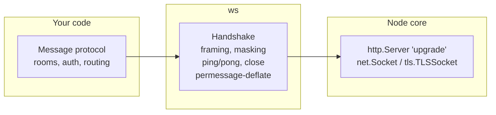
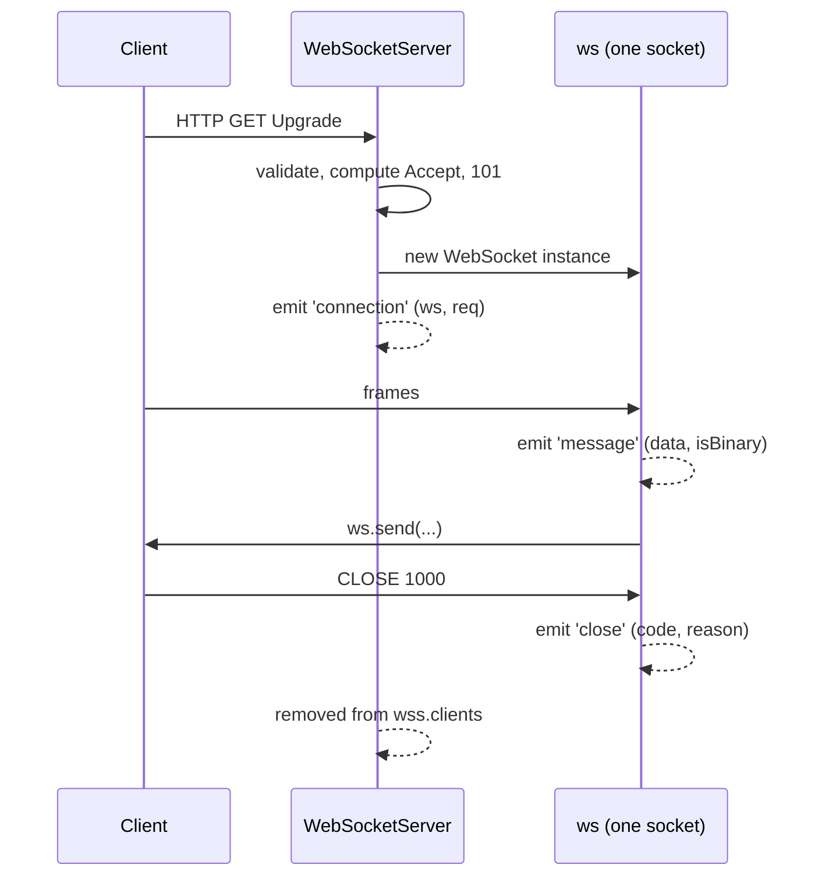
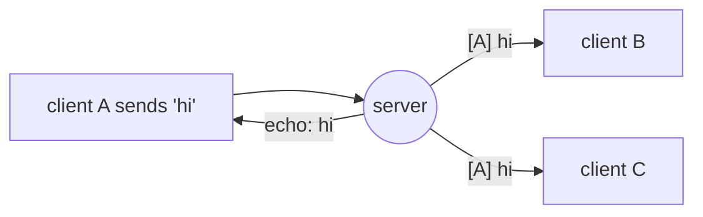

# Chapter 2 — Your First Server with `ws`

**Level:** `Beginner`

**What you'll learn:** How to build real WebSocket servers with [`ws`](https://github.com/websockets/ws), the fastest and most widely used WebSocket library for Node.js (Socket.IO, many GraphQL servers and countless frameworks sit on top of it). You'll learn the `WebSocketServer` options that matter, the `connection` / `message` / `close` / `error` events, the `message(data, isBinary)` signature introduced in `ws@8`, sending text and binary (`Buffer`, `ArrayBuffer`, typed arrays), broadcasting to `wss.clients` with proper `readyState` checks, per-connection state, and writing a **Node.js client** with the same library. The example is an echo + broadcast server with a browser client and an interactive terminal client.

---

## 2.1 Why a library?

In chapter 1 you wrote a server by hand and ended with a list of things it didn't do: UTF-8 validation, close timeouts, compression, limits, fragmentation edge cases, performance. `ws` handles all of that and passes the [Autobahn](https://github.com/crossbario/autobahn-testsuite) conformance test suite. It is deliberately *low-level*: it gives you a spec-compliant socket and nothing more — no rooms, no reconnection, no acknowledgements. That's what makes it a great foundation for learning, and what chapter 7 contrasts with Socket.IO.



`ws` has two main exports:

```js
import { WebSocketServer, WebSocket } from 'ws';
```

- `WebSocketServer` — accepts connections (the server side).
- `WebSocket` — a single connection. On the server you *receive* instances of it in the `connection` event; in a Node client you *create* one with `new WebSocket(url)`. Its API intentionally mirrors the browser's (`readyState`, `send`, `close`, `binaryType`, `bufferedAmount`), plus Node-only extras (`ping()`, `pong()`, `terminate()`, EventEmitter `on(...)`).

> **Note:** Node 22+ ships a built-in global `WebSocket` **client** (browser-compatible, from undici). It has no server. We use `ws` for both sides in this course because it has server support, `ping()`, and EventEmitter ergonomics. Don't confuse `globalThis.WebSocket` with the one you import from `ws`.

---

## 2.2 Creating a server: three modes

`WebSocketServer` can obtain its HTTP layer in three ways. **Exactly one** of `port`, `server`, `noServer` must be given.

```js
import http from 'node:http';
import { WebSocketServer } from 'ws';

// (a) ws creates its own HTTP server. Quick demos only — no HTML, no REST.
const wss1 = new WebSocketServer({ port: 8080 });

// (b) Attach to an existing HTTP server — share the port with your web app.
const server = http.createServer(/* request handler */);
const wss2 = new WebSocketServer({ server, path: '/ws' }); // optional path filter
server.listen(3000);

// (c) Manual: you handle 'upgrade' yourself and call wss.handleUpgrade().
//     Needed for multiple endpoints and auth-before-accept (chapter 3).
const wss3 = new WebSocketServer({ noServer: true });
```

This chapter uses **(b)**: one `http.Server` that serves our HTML *and* accepts WebSocket upgrades on the same port. Under the hood, `ws` simply registers `server.on('upgrade', ...)` — the event you used by hand in chapter 1.

### Options worth knowing

| Option | Default | What it does |
|---|---|---|
| `port` / `server` / `noServer` | — | How to get HTTP (above). |
| `path` | none | Only accept upgrades whose URL pathname equals this. Others get `400`. |
| `maxPayload` | 100 MiB | Max **message** size in bytes. Exceeding it closes with **1009**. Lower it! A chat app rarely needs more than 64 KB. |
| `perMessageDeflate` | `false` | Enable compression (object form lets you tune `threshold`, `zlibDeflateOptions`, `serverNoContextTakeover`, …). |
| `clientTracking` | `true` | Maintain `wss.clients` (a `Set`). Turn off if you track sockets yourself. |
| `verifyClient` | none | Legacy hook to accept/reject handshakes. The docs discourage it; prefer `noServer` + `'upgrade'` (chapter 3). |
| `handleProtocols` | picks first | `(protocols: Set<string>, req) => string | false` to choose a subprotocol. |
| `skipUTF8Validation` | `false` | Don't. Only for trusted, performance-critical links. |
| `autoPong` | `true` | Answer pings automatically. |
| `allowSynchronousEvents` | `true` | Emit several `message` events in the same tick for throughput (ws 8.17+). |

---

## 2.3 The connection lifecycle



The canonical skeleton:

```js
wss.on('connection', (ws, req) => {
  // `ws`  : the WebSocket for this client
  // `req` : the http.IncomingMessage of the UPGRADE request (headers, url, socket.remoteAddress)
  console.log('connected from', req.socket.remoteAddress, req.headers['user-agent']);

  ws.on('message', (data, isBinary) => {
    // data is a Buffer (by default), isBinary tells you the frame opcode
  });

  ws.on('close', (code, reason) => {
    // reason is a Buffer in ws@8 — call reason.toString()
  });

  ws.on('error', (err) => {
    // ALWAYS attach an error listener. Without one, an 'error' event
    // (e.g. invalid frame, 1009 too big) throws and crashes the process.
    console.error(err);
  });
});
```

### `message(data, isBinary)` — the `ws@8` change

In `ws@7` and older, text messages arrived as JavaScript strings. **Since `ws@8`, `data` is always a `Buffer`** (for the default `binaryType = 'nodebuffer'`) and the second argument `isBinary` tells you whether the frame was text or binary:

```js
ws.on('message', (data, isBinary) => {
  if (isBinary) {
    // binary frame: data is a Buffer of raw bytes
    console.log('got', data.length, 'bytes', data);
  } else {
    // text frame: data is a Buffer containing UTF-8 — ws already validated it
    const text = data.toString(); // utf8 is the default encoding
  }
});
```

Why? It avoids a UTF-8 decode you may not need (e.g. forwarding a message verbatim to other clients). If you forward it, **preserve the frame type** with the `binary` option:

```js
client.send(data, { binary: isBinary }); // otherwise a Buffer is sent as a BINARY frame
```

That's the #1 upgrade bug from ws 7 → 8: browsers suddenly receive `Blob`s instead of strings, because a `Buffer` passed to `send()` defaults to a binary frame.

### `binaryType` on the server

`ws.binaryType` controls what `data` is for incoming messages: `'nodebuffer'` (default), `'arraybuffer'`, `'fragments'` (an array of Buffers, no concatenation — useful for zero-copy forwarding), or `'blob'`.

---

## 2.4 Sending

```js
ws.send('a string');                        // text frame
ws.send(JSON.stringify({ hello: 'world' })); // text frame (JSON is just text)
ws.send(Buffer.from([1, 2, 3]));            // binary frame
ws.send(new Uint8Array([4, 5]));            // binary frame
ws.send(new Float32Array([1.5]).buffer);    // ArrayBuffer -> binary frame
ws.send(Buffer.from('hi'), { binary: false }); // force text frame from a Buffer

ws.send(data, (err) => {
  // optional callback: called once the data is written to the socket (or failed)
  if (err) console.error('send failed', err);
});
```

`send()` options: `binary`, `compress` (per-message, when deflate is enabled), `fin` (send a fragment; the next `send` continues it), `mask` (client only).

### Closing

| Method | What it does |
|---|---|
| `ws.close(code?, reason?)` | Starts the **closing handshake** (sends a close frame, waits for the peer's). Graceful. If the peer doesn't answer within 30 s, `ws` destroys the socket. |
| `ws.terminate()` | Destroys the TCP socket **immediately** — no close frame. For dead or abusive peers (the heartbeat in chapter 5 uses it). |

```js
ws.close(1000, 'bye');     // normal
ws.close(4001, 'unauthorized'); // application-specific (4000–4999)
```

### `readyState` — always check before sending to *other* sockets

```js
import { WebSocket } from 'ws';

if (ws.readyState === WebSocket.OPEN) ws.send('...');
```

Constants: `CONNECTING` (0), `OPEN` (1), `CLOSING` (2), `CLOSED` (3) — identical to the browser. In `ws`, calling `send()` while `CONNECTING` **throws**; while `CLOSING`/`CLOSED` it silently drops the data (or passes an error to the callback, if you gave one). Checking `readyState` first is the simple, readable way to make intent explicit.

---

## 2.5 Broadcasting

Because `clientTracking` is on, `wss.clients` is a `Set<WebSocket>` of every connected socket. Broadcasting is a loop:

```js
function broadcast(data, { except } = {}) {
  for (const client of wss.clients) {
    if (client !== except && client.readyState === WebSocket.OPEN) {
      client.send(data);
    }
  }
}
```

Two important details:

1. **The `readyState` check.** A socket stays in `wss.clients` while it is `CLOSING`; sending to it is pointless.
2. **Serialize once.** If you broadcast an object, `JSON.stringify` it **before** the loop, not inside. With 10 000 clients the difference is huge. Even better, `ws` can reuse a single prepared buffer — sending the same string to many clients encodes it each time, so for hot paths you can do `const buf = Buffer.from(json)` once and `client.send(buf, { binary: false })`.



Later chapters replace "all clients" with "clients in a room" (chapter 4) and "clients on all servers" (chapter 8, Redis pub/sub) — but the loop stays the same.

---

## 2.6 Per-connection state

Where do you store "this socket's nickname" or "this socket's user id"? Two common options:

```js
// Option 1: attach properties to the ws object (quick, common in examples)
ws.id = crypto.randomUUID();
ws.name = 'guest-42';

// Option 2: a WeakMap / Map keyed by socket (keeps ws objects clean, easy to type later)
const meta = new Map(); // ws -> { id, name, connectedAt }
meta.set(ws, { id: crypto.randomUUID(), name: 'guest-42', connectedAt: Date.now() });
ws.on('close', () => meta.delete(ws)); // don't leak!
```

We use a `Map` in this chapter's example so the cleanup-on-close discipline is explicit. Whatever you choose: **everything you add on connect, you remove on close.** Leaked per-socket state is the classic WebSocket server memory leak.

---

## 2.7 Build it: echo + broadcast server

Our server:

- serves `public/index.html` from a plain `node:http` server (Express arrives in chapter 3);
- attaches a `WebSocketServer` to the same HTTP server on path `/ws`;
- gives each client a short id and nickname (`guest-xxxx`);
- **text messages**: echoes back to the sender (`kind: 'echo'`) and broadcasts to everyone else (`kind: 'broadcast'`);
- **binary messages**: echoes the bytes back untouched as a binary frame (demonstrates `isBinary`);
- announces joins/leaves and the online count (`kind: 'system'`);
- limits messages to 64 KB (`maxPayload`) and handles errors.

The server→client messages are small JSON objects with a `kind` field. (Chapter 4 formalizes this into a proper protocol with `type`, `id` and `payload`.)

```
examples/02-echo-ws/
├── server.js
├── client.js           # Node terminal client
├── public/index.html   # browser client
└── README.md
```

### server.js

```js
// examples/02-echo-ws/server.js
//
// Echo + broadcast server using the `ws` library.
//   - Plain node:http serves the browser client (public/index.html).
//   - A WebSocketServer shares the SAME http server and port, on path /ws.
//   - Text  -> echoed to sender AND broadcast to everyone else.
//   - Binary -> echoed back to sender as binary (shows isBinary handling).
//
// Run: npm run ex:02   then open http://localhost:3000 in two tabs,
//      and/or: node examples/02-echo-ws/client.js

import http from 'node:http';
import fs from 'node:fs/promises';
import path from 'node:path';
import crypto from 'node:crypto';
import { fileURLToPath } from 'node:url';
import { WebSocketServer, WebSocket } from 'ws';

const PORT = Number(process.env.PORT) || 3000;
const __dirname = path.dirname(fileURLToPath(import.meta.url));

// --- 1. HTTP server: serves the HTML client --------------------------------
const server = http.createServer(async (req, res) => {
  if (req.method === 'GET' && (req.url === '/' || req.url === '/index.html')) {
    const html = await fs.readFile(path.join(__dirname, 'public', 'index.html'));
    res.writeHead(200, { 'Content-Type': 'text/html; charset=utf-8' });
    return res.end(html);
  }
  res.writeHead(404, { 'Content-Type': 'text/plain' }).end('Not found');
});

// --- 2. WebSocket server attached to the same HTTP server -----------------
const wss = new WebSocketServer({
  server,              // share the port with our HTTP handler
  path: '/ws',         // only upgrades to /ws are accepted (others get 400)
  maxPayload: 64 * 1024, // 64 KB per message; larger -> close code 1009
  // perMessageDeflate is false by default; see chapter text for trade-offs.
});

// Per-connection metadata. Everything added on connect is removed on close.
const clients = new Map(); // WebSocket -> { id, name }

// Helper: serialize ONCE, then send the same string to each open client.
function broadcast(message, { except } = {}) {
  const data = JSON.stringify(message);
  for (const client of wss.clients) {
    if (client !== except && client.readyState === WebSocket.OPEN) {
      client.send(data);
    }
  }
}

// Helper: send a JSON object to one client (if it's still open).
function sendJson(ws, message) {
  if (ws.readyState === WebSocket.OPEN) ws.send(JSON.stringify(message));
}

wss.on('connection', (ws, req) => {
  // `req` is the HTTP upgrade request: handy for IP, headers, query string.
  const id = crypto.randomUUID().slice(0, 4);
  const name = `guest-${id}`;
  clients.set(ws, { id, name });

  const ip = req.socket.remoteAddress;
  console.log(`[+] ${name} connected from ${ip} (${wss.clients.size} online)`);

  // Greet the newcomer, tell everyone else.
  sendJson(ws, { kind: 'welcome', you: name, online: wss.clients.size });
  broadcast({ kind: 'system', text: `${name} joined`, online: wss.clients.size }, { except: ws });

  ws.on('message', (data, isBinary) => {
    const me = clients.get(ws);

    if (isBinary) {
      // Binary: `data` is a Buffer. Echo the exact bytes back as a BINARY frame.
      console.log(`[bin] ${me.name}: ${data.length} bytes`, data.subarray(0, 8));
      ws.send(data, { binary: true });
      return;
    }

    // Text: `data` is a Buffer holding UTF-8 (ws 8+). Decode it ourselves.
    const text = data.toString().trim();
    if (!text) return;
    console.log(`[txt] ${me.name}: ${text}`);

    // Tiny command: "/nick <name>" renames you.
    if (text.startsWith('/nick ')) {
      const old = me.name;
      me.name = text.slice(6).trim().slice(0, 20) || old;
      sendJson(ws, { kind: 'system', text: `you are now ${me.name}` });
      broadcast({ kind: 'system', text: `${old} is now ${me.name}` }, { except: ws });
      return;
    }

    sendJson(ws, { kind: 'echo', text });                              // back to sender
    broadcast({ kind: 'broadcast', from: me.name, text }, { except: ws }); // to others
  });

  ws.on('close', (code, reason) => {
    // In ws 8, `reason` is a Buffer.
    const me = clients.get(ws);
    clients.delete(ws); // <- no leaks
    console.log(`[-] ${me.name} left (code=${code} reason="${reason.toString()}")`);
    // By the time 'close' fires, ws is already removed from wss.clients.
    broadcast({ kind: 'system', text: `${me.name} left`, online: wss.clients.size });
  });

  // Without an 'error' listener, errors (e.g. message > maxPayload) crash the process.
  ws.on('error', (err) => console.error(`[!] ${clients.get(ws)?.name}:`, err.message));
});

server.listen(PORT, () => {
  console.log(`HTTP + WS on http://localhost:${PORT}  (WebSocket path: /ws)`);
});

// Graceful shutdown on Ctrl+C: close every socket with 1001 "going away".
process.on('SIGINT', () => {
  for (const ws of wss.clients) ws.close(1001, 'server shutting down');
  wss.close();
  server.close(() => process.exit(0));
  setTimeout(() => process.exit(0), 1000).unref(); // don't hang forever
});
```

Walkthrough of the key decisions:

- **`path: '/ws'`** — the page lives at `/`, the socket at `/ws`. Keeping them apart is a habit that pays off with proxies and when you add more endpoints.
- **`maxPayload`** — the default 100 MiB is a denial-of-service invitation. A client exceeding the limit is disconnected with 1009 and our `error` handler logs `Max payload size exceeded`.
- **`clients` Map** — metadata separate from the socket, deleted in `close`.
- **`broadcast`** — `JSON.stringify` once, `readyState` check, optional `except`.
- **`'close'` ordering** — when `ws` emits `close` on a socket it has already removed it from `wss.clients`, so `wss.clients.size` is the new count.
- **Graceful shutdown** — 1001 tells clients "the server is going away" so a good client (chapter 5) knows to reconnect.

### The browser client

```html
<!-- examples/02-echo-ws/public/index.html -->
<!doctype html>
<html lang="en">
<head>
  <meta charset="utf-8" />
  <meta name="viewport" content="width=device-width, initial-scale=1" />
  <title>Echo + Broadcast (ws)</title>
  <style>
    :root { --bg: #0f172a; --panel: #1e293b; --text: #e2e8f0; --muted: #94a3b8; --accent: #38bdf8; }
    * { box-sizing: border-box; }
    body { margin: 0; font: 15px/1.5 system-ui, sans-serif; background: var(--bg); color: var(--text); }
    main { max-width: 760px; margin: 0 auto; padding: 1.5rem 1rem; }
    header { display: flex; justify-content: space-between; align-items: center; gap: 1rem; flex-wrap: wrap; }
    .pill { padding: .15rem .6rem; border-radius: 999px; background: var(--panel); color: var(--muted); font-size: 13px; }
    .pill.open { color: #4ade80; }
    #log { list-style: none; margin: 1rem 0; padding: .75rem; background: var(--panel); border-radius: 10px;
           height: 55vh; overflow-y: auto; }
    #log li { padding: .2rem 0; word-break: break-word; }
    .echo { color: var(--muted); } .broadcast b { color: var(--accent); } .system { color: #fbbf24; font-style: italic; }
    .binary { color: #c084fc; }
    form { display: flex; gap: .5rem; flex-wrap: wrap; }
    input { flex: 1; min-width: 10rem; padding: .6rem; border-radius: 8px; border: 1px solid #334155; background: #0b1220; color: var(--text); }
    button { padding: .6rem 1rem; border: 0; border-radius: 8px; background: var(--accent); color: #0f172a; font-weight: 600; cursor: pointer; }
    button.secondary { background: #334155; color: var(--text); }
  </style>
</head>
<body>
<main>
  <header>
    <h1>Echo + Broadcast</h1>
    <span><span id="status" class="pill">connecting</span> <span id="online" class="pill">0 online</span></span>
  </header>
  <p style="color:var(--muted)">Open this page in two tabs. Try <code>/nick Alice</code>.</p>
  <ul id="log"></ul>
  <form id="form">
    <input id="input" autocomplete="off" placeholder="Type a message…" />
    <button>Send</button>
    <button type="button" id="bin" class="secondary">Send binary</button>
  </form>
</main>
<script type="module">
  const $ = (id) => document.getElementById(id);

  // Build the ws:// or wss:// URL from the page location (works behind HTTPS too).
  const url = `${location.protocol === 'https:' ? 'wss' : 'ws'}://${location.host}/ws`;
  const ws = new WebSocket(url);
  ws.binaryType = 'arraybuffer';

  function add(cls, html) {
    const li = document.createElement('li');
    li.className = cls;
    li.innerHTML = html;
    $('log').append(li);
    $('log').scrollTop = $('log').scrollHeight;
  }
  // Never inject user text as HTML without escaping (XSS!).
  const esc = (s) => String(s).replace(/[&<>"']/g, (c) => `&#${c.charCodeAt(0)};`);

  ws.addEventListener('open', () => { $('status').textContent = 'open'; $('status').classList.add('open'); });
  ws.addEventListener('close', (e) => {
    $('status').textContent = `closed (${e.code})`; $('status').classList.remove('open');
    add('system', `disconnected: code ${e.code} ${esc(e.reason)}`);
  });

  ws.addEventListener('message', (event) => {
    // Binary frames arrive as ArrayBuffer (because of binaryType).
    if (event.data instanceof ArrayBuffer) {
      const bytes = [...new Uint8Array(event.data)];
      return add('binary', `binary echo: [${bytes.join(', ')}]`);
    }
    const msg = JSON.parse(event.data);
    if (msg.online !== undefined) $('online').textContent = `${msg.online} online`;
    switch (msg.kind) {
      case 'welcome':   return add('system', `welcome, you are <b>${esc(msg.you)}</b>`);
      case 'echo':      return add('echo', `you: ${esc(msg.text)}`);
      case 'broadcast': return add('broadcast', `<b>${esc(msg.from)}</b>: ${esc(msg.text)}`);
      case 'system':    return add('system', esc(msg.text));
    }
  });

  $('form').addEventListener('submit', (e) => {
    e.preventDefault();
    const text = $('input').value.trim();
    if (!text || ws.readyState !== WebSocket.OPEN) return;
    ws.send(text); // string -> text frame
    $('input').value = '';
  });

  $('bin').addEventListener('click', () => {
    if (ws.readyState !== WebSocket.OPEN) return;
    const bytes = crypto.getRandomValues(new Uint8Array(6));
    ws.send(bytes); // typed array -> binary frame
    add('binary', `sent binary: [${[...bytes].join(', ')}]`);
  });
</script>
</body>
</html>
```

Notes:

- The URL is derived from `location`, so the same page works on `http://localhost:3000` and behind an HTTPS reverse proxy (`wss://`).
- `binaryType = 'arraybuffer'` lets us distinguish binary echoes with `instanceof ArrayBuffer`; text frames are always strings.
- **Escaping** — broadcast text comes from *other users*. Inserting it with `innerHTML` unescaped would let anyone run script in everyone's browser. (Chapter 4 uses `textContent` instead.)

### A Node.js client with `ws`

The same `WebSocket` class from `ws` works as a client — useful for bots, load tests, CLI tools, and server-to-server links. Unlike the browser, a Node client **can** set headers and send pings.

```js
// examples/02-echo-ws/client.js
//
// Interactive terminal client using the `ws` library.
//   node examples/02-echo-ws/client.js [ws://localhost:3000/ws]
//
// Type a line and press Enter to send it as text.
//   /bin   -> send 4 random bytes as a binary frame
//   /ping  -> send a WebSocket PING (browsers can't do this!)
//   /quit  -> close cleanly with code 1000

import readline from 'node:readline';
import crypto from 'node:crypto';
import { WebSocket } from 'ws';

const url = process.argv[2] || `ws://localhost:${process.env.PORT || 3000}/ws`;

// Node clients CAN send custom headers (browsers can't). Handy for tokens later.
const ws = new WebSocket(url, { headers: { 'User-Agent': 'ws-course-cli/1.0' } });

const rl = readline.createInterface({ input: process.stdin, output: process.stdout, prompt: '> ' });

ws.on('open', () => {
  console.log(`connected to ${url}`);
  rl.prompt();
});

ws.on('message', (data, isBinary) => {
  // Same (data, isBinary) signature as on the server.
  if (isBinary) {
    console.log(`\n[binary ${data.length}B]`, [...data]);
  } else {
    const msg = JSON.parse(data.toString());
    const line =
      msg.kind === 'broadcast' ? `${msg.from}: ${msg.text}`
      : msg.kind === 'echo' ? `(echo) ${msg.text}`
      : msg.kind === 'welcome' ? `* welcome, you are ${msg.you} (${msg.online} online)`
      : `* ${msg.text}`;
    console.log(`\n${line}`);
  }
  rl.prompt(true);
});

ws.on('pong', (data) => {
  const rtt = Date.now() - Number(data.toString());
  console.log(`\n[pong] round trip ${rtt} ms`);
  rl.prompt(true);
});

ws.on('close', (code, reason) => {
  console.log(`\nclosed: ${code} ${reason.toString()}`);
  process.exit(0);
});

ws.on('error', (err) => {
  // e.g. ECONNREFUSED if the server isn't running, or "Unexpected server response: 404"
  console.error('error:', err.message);
});

rl.on('line', (line) => {
  const text = line.trim();
  if (ws.readyState !== WebSocket.OPEN) return console.log('not connected');

  if (text === '/quit') return ws.close(1000, 'bye');
  if (text === '/bin') ws.send(crypto.randomBytes(4)); // Buffer -> binary frame
  else if (text === '/ping') ws.ping(String(Date.now())); // payload comes back in 'pong'
  else if (text) ws.send(text); // string -> text frame
  rl.prompt();
});

rl.on('close', () => ws.close(1000, 'stdin closed')); // Ctrl+D
```

Observe:

- A handshake failure in Node gives you **more information than in the browser**: `error` carries `Unexpected server response: 404` (and there's an `'unexpected-response'` event with the full HTTP response).
- `ws.ping(data)` sends a real control frame; the server's `ws` auto-replies and you get a `'pong'` event. We used the timestamp payload to measure round-trip time.

---

## 2.8 Run it

```bash
npm run ex:02
# HTTP + WS on http://localhost:3000  (WebSocket path: /ws)
```

1. Open <http://localhost:3000> in two browser tabs. Messages from one show as `you:` (echo) in that tab and `guest-xxxx:` (broadcast) in the other.
2. `node examples/02-echo-ws/client.js` in a terminal — it joins the same conversation. Type `/ping`, `/bin`, `/nick Terminal`.
3. Paste a big message into the browser console to see `maxPayload` in action:

```js
// in DevTools console on the page
const t = new WebSocket(`ws://${location.host}/ws`);
t.onopen = () => t.send('x'.repeat(100_000));
t.onclose = (e) => console.log(e.code); // 1009 — Message Too Big
```

---

## 2.9 A word on compression

Should you turn on `perMessageDeflate`? Measure first. For typical small JSON chat messages (< 1 KB), compression gains little and costs memory per connection. If you enable it, set a threshold and consider disabling context takeover to bound memory:

```js
const wss = new WebSocketServer({
  server,
  perMessageDeflate: {
    threshold: 1024,               // don't compress messages smaller than 1 KB
    serverNoContextTakeover: true, // don't keep the zlib window between messages (saves RAM)
    clientNoContextTakeover: true,
    zlibDeflateOptions: { level: 3 },
    concurrencyLimit: 10,          // limit concurrent zlib operations
  },
});
```

Browsers always *offer* deflate; with the option `false` (default), the server simply doesn't accept it and `ws.extensions` is `''` in the browser.

---

## Common pitfalls

1. **Treating `data` as a string (ws 8).** `data` is a `Buffer`. `JSON.parse(data)` happens to work (it calls `toString()`), but `data === 'hello'` or `data.startsWith(...)` won't. Use `data.toString()`.
2. **Forwarding text as binary.** `client.send(data)` with a `Buffer` sends a **binary** frame. Browsers receive a `Blob`. Use `client.send(data, { binary: isBinary })` when relaying.
3. **No `error` listener on the socket.** An unhandled `'error'` event crashes Node. Always add `ws.on('error', ...)`.
4. **Broadcasting without a `readyState` check** or stringifying inside the loop.
5. **Leaking per-connection state.** Whatever you put in a Map/Set on connect, delete on `close`. `close` fires exactly once per socket, even after `error`.
6. **Keeping the default `maxPayload`.** 100 MiB per message is far too generous for most apps.
7. **Using `port` mode in real apps.** It spins up a second HTTP server on another port — no shared cookies/origin, extra firewall rules. Attach to your app's server (this chapter) or use `noServer` (next chapter).
8. **Confusing `globalThis.WebSocket` with `ws`'s `WebSocket`.** Node's global client has no `.on()`, no `ping()`; import from `ws` explicitly.

---

## Exercises

1. **Server stats endpoint.** Add `GET /stats` to the HTTP handler returning `{ online, names: [...] }` as JSON.
2. **Rate limiting.** Allow at most 5 text messages per second per client; beyond that, send `{kind:'system', text:'slow down'}` and drop the message. After 20 violations, `close(1008, 'rate limit')`.
3. **Private message.** Implement `/msg <name> <text>` that delivers only to the client with that nickname.
4. **Binary protocol.** Make the "Send binary" button send a 9-byte message: 1 byte type (`0x01`), 8 bytes `Float64` timestamp (`DataView.setFloat64`). Have the server decode it with `buf.readDoubleBE(1)` and reply with the latency.
5. **Bot client.** Write `bot.js` with `ws` that connects, sets nickname `bot`, and replies `pong!` whenever someone broadcasts `ping`.

<details>
<summary>Hints</summary>

- Ex 1: in the `http.createServer` handler, `if (req.url === '/stats') res.end(JSON.stringify({ online: wss.clients.size, names: [...clients.values()].map(c => c.name) }))`.
- Ex 2: store `{ count, windowStart, strikes }` in the metadata; reset `count` when `Date.now() - windowStart > 1000`.
- Ex 3: iterate `clients` (the Map) to find the socket whose `name` matches; remember the `readyState` check.
- Ex 4: in the browser, `const b = new ArrayBuffer(9); const v = new DataView(b); v.setUint8(0, 1); v.setFloat64(1, Date.now());` (big-endian by default, matching `readDoubleBE`).
- Ex 5: on `open`, `ws.send('/nick bot')`; in `message`, parse JSON and check `msg.kind === 'broadcast' && msg.text === 'ping'`.

</details>

---

## Key takeaways

- `ws` is a spec-complete, low-level WebSocket implementation. It gives you sockets, not features.
- Create the server with `port`, `server` (share your HTTP port) or `noServer` (manual upgrade routing — next chapter).
- `connection(ws, req)` gives you the socket **and the upgrade request**; `message(data, isBinary)` gives you a `Buffer` plus the frame type (ws 8).
- `send()` picks text vs binary from the argument type: strings are text, Buffers/ArrayBuffers/typed arrays are binary unless you pass `{ binary: false }`.
- Broadcast = loop over `wss.clients` with a `readyState === WebSocket.OPEN` check; serialize once.
- Always: an `error` listener per socket, a sane `maxPayload`, cleanup of per-socket state on `close`.
- The same `WebSocket` class is a capable Node client — with custom headers and `ping()` that browsers lack.

Next → [Chapter 3 — Integrating with Express](./03-express-integration.md)
