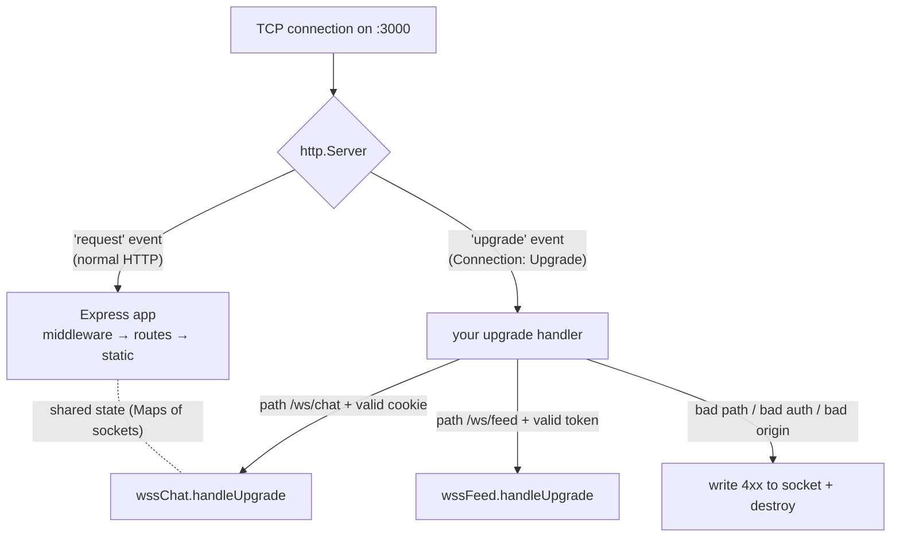
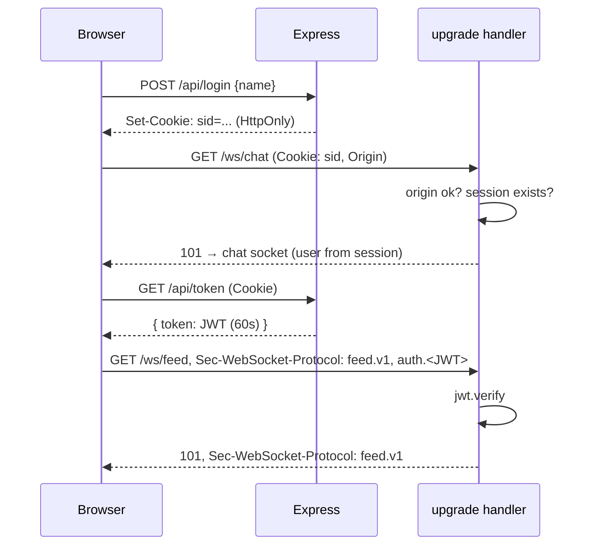

# Chapter 3 — Integrating WebSockets with Express

**Level:** `Intermediate`

**What you'll learn:** How to run Express and `ws` on **one port, one `http.Server`**; why `noServer: true` + `server.on('upgrade')` is the production pattern; how to route upgrades to **multiple WebSocket endpoints** by path; how to **authenticate during the handshake** (session cookie, token in the query string, token in `Sec-WebSocket-Protocol`) and reject unauthenticated clients with a proper `401` written directly to the socket; how to hand the authenticated user to your `connection` handler; how to serve the browser client from Express; and how to make REST and WebSockets cooperate — e.g. `POST /api/broadcast` pushing to connected sockets.

---

## 3.1 The core idea: Express doesn't handle upgrades

An Express `app` is just a function `(req, res) => {...}`. When you call `app.listen(3000)`, Express does:

```js
const server = http.createServer(app);
return server.listen(3000);
```

The WebSocket upgrade never reaches that function — Node emits `'upgrade'` on the **`http.Server`** instead of `'request'` (chapter 1). So "integrating ws with Express" really means: **get hold of the `http.Server` and attach the WebSocket logic to its `'upgrade'` event**. Express middleware (sessions, CORS, `express.json`) does **not** run for upgrade requests. If you need session data during the upgrade, you must parse it yourself (or invoke the session middleware manually — shown in §3.5).



### Option A: `{ server }` — simplest

```js
import express from 'express';
import http from 'node:http';
import { WebSocketServer } from 'ws';

const app = express();
app.use(express.static('public'));

const server = http.createServer(app);           // Express handles 'request'
const wss = new WebSocketServer({ server, path: '/ws' }); // ws handles 'upgrade' on /ws

server.listen(3000);
```

Works fine for one endpoint and no auth. Two limitations:

1. **Multiple `WebSocketServer`s with `{ server, path }` on the same server is fragile.** Each registers its own `'upgrade'` listener; the one whose path doesn't match responds `400` and destroys the socket *before* the other gets a chance. (`ws` has workarounds, but the docs recommend `noServer` for this.)
2. **No hook to authenticate before accepting.** `verifyClient` exists but is discouraged by the `ws` maintainers; it's awkward for async work and error reporting.

### Option B: `{ noServer: true }` — full control (recommended)

```js
const wss = new WebSocketServer({ noServer: true });

server.on('upgrade', (req, socket, head) => {
  // 1. decide: route? authenticate? origin?
  // 2. either reject:  socket.write('HTTP/1.1 401 Unauthorized\r\n\r\n'); socket.destroy();
  // 3. or accept:
  wss.handleUpgrade(req, socket, head, (ws) => {
    wss.emit('connection', ws, req); // re-emit so your normal 'connection' handler runs
  });
});
```

`wss.handleUpgrade()` does the handshake from chapter 1 (validate headers, compute Accept, negotiate subprotocol and extensions, write `101`) and gives you the `WebSocket`. **You** decide whether to call it. Nothing else is different: `wss.clients` still works, `wss.on('connection')` still works — because you emit it.

Note the extra arguments trick: `wss.emit('connection', ws, req, user)` — you can pass anything after `req`, and it arrives as the third parameter of your `connection` handler. That's how the authenticated user travels from upgrade to connection.

---

## 3.2 Rejecting an upgrade properly

When you reject, there's no `res` object. You write raw HTTP on the socket, then destroy it:

```js
function reject(socket, status, message) {
  const body = JSON.stringify({ error: message });
  socket.write(
    `HTTP/1.1 ${status} ${http.STATUS_CODES[status]}\r\n` +
    'Connection: close\r\n' +
    'Content-Type: application/json\r\n' +
    `Content-Length: ${Buffer.byteLength(body)}\r\n` +
    '\r\n' +
    body,
  );
  socket.destroy();
}
```

What the client sees:

| Client | Result of a `401` |
|---|---|
| Browser `WebSocket` | `error` event, then `close` with **code 1006**, empty reason. The status is hidden from JS. |
| `ws` Node client | `error: Unexpected server response: 401`, plus an `'unexpected-response'` event with `(req, res)` so you can read headers/body. |
| curl | the full response. |

Because browsers can't see the status, a good UX strategy is: **check auth over HTTP first** (e.g. `GET /api/me` returns 401 → show login form) and only then open the socket. Alternatively, *accept* the connection and immediately `ws.close(4001, 'unauthorized')` so the browser gets a code it can read — the trade-off is that unauthenticated clients got a full WebSocket for a moment. Rejecting at the handshake is cheaper and safer; we do that, plus the HTTP pre-check.

### Always handle socket errors during the upgrade

Between `'upgrade'` and `handleUpgrade`, especially if you `await` something (a DB lookup, JWT verify), the client may disconnect. An unhandled `error` on that raw socket crashes the process:

```js
server.on('upgrade', async (req, socket, head) => {
  socket.on('error', onSocketError);   // guard the raw socket while we're working
  const user = await authenticate(req); // async work
  if (!user) return reject(socket, 401, 'unauthorized');
  wss.handleUpgrade(req, socket, head, (ws) => {
    socket.removeListener('error', onSocketError); // ws owns error handling now
    wss.emit('connection', ws, req, user);
  });
});
```

---

## 3.3 Routing multiple endpoints by path

Use the WHATWG `URL` to parse the request target (the `req.url` is only the path + query):

```js
const { pathname, searchParams } = new URL(req.url, `http://${req.headers.host}`);

const routes = {
  '/ws/chat': { wss: wssChat, auth: authBySessionCookie },
  '/ws/feed': { wss: wssFeed, auth: authByToken },
};
const route = routes[pathname];
if (!route) return reject(socket, 404, 'no such websocket endpoint');
```

Each endpoint is its own `WebSocketServer` (with `noServer: true`), so each has its own `clients` set, options (`maxPayload`, compression) and `connection` handler. Separate servers keep concerns separate: a chat socket and a metrics socket shouldn't share broadcast lists.

---

## 3.4 Authenticating the handshake: three ways to carry credentials

Remember the browser can't set `Authorization` on a WebSocket. What it *can* send: **cookies**, the **URL** (query string), and the **`Sec-WebSocket-Protocol`** header.

### 1. Session cookie (best for same-site browser apps)

The browser automatically sends cookies for the host on the upgrade request. If your site already has a login session, the WebSocket inherits it — zero client code.

```js
function parseCookies(header = '') {
  return Object.fromEntries(
    header.split(';').map((p) => p.trim()).filter(Boolean).map((p) => {
      const i = p.indexOf('=');
      return [p.slice(0, i), decodeURIComponent(p.slice(i + 1))];
    }),
  );
}
const sid = parseCookies(req.headers.cookie).sid;
const session = sessions.get(sid); // your session store
```

**Must pair with an `Origin` check.** Cookies are sent even when *another website* opens `new WebSocket('wss://your-app/ws')` — the same-origin policy does **not** apply to WebSockets. Without an allow-list on `req.headers.origin`, any site the user visits can open an authenticated socket as them (Cross-Site WebSocket Hijacking, chapter 6). `SameSite=Lax/Strict` cookies help a lot, but check `Origin` anyway.

### 2. Token in the query string (`wss://host/ws?token=...`)

```js
const token = new URL(req.url, 'http://x').searchParams.get('token');
const user = jwt.verify(token, SECRET);
```

- Works from any client, including cross-origin and native apps.
- **Caveat:** URLs end up in server access logs, proxy logs, and browser history. Use **short-lived** tokens (e.g. 60 s, single use) obtained over an authenticated HTTP call just before connecting — a "ticket". Never put a long-lived API key in a URL.

### 3. Token in `Sec-WebSocket-Protocol`

```js
// browser
new WebSocket('wss://host/ws/feed', ['feed.v1', `auth.${token}`]);
```

The server reads the offered list, verifies the token, and **must select a protocol that was offered** — obviously `feed.v1`, never echo the token back:

```js
const wssFeed = new WebSocketServer({
  noServer: true,
  handleProtocols: (protocols /* Set */) => (protocols.has('feed.v1') ? 'feed.v1' : false),
});
```

- Not logged in URLs by most proxies. Used by Kubernetes, some GraphQL servers.
- It's a hack: the header is meant for protocol names, the token must consist of valid token characters (a JWT's base64url + `.` is fine), and some proxies log all headers anyway.

### Comparison

| Method | Browser sends automatically? | Cross-origin | Leaks into logs | CSWSH risk | Typical use |
|---|---|---|---|---|---|
| Cookie | yes | only with `SameSite=None` | no | **yes → check Origin** | same-site web app |
| Query token | no | yes | **yes** (use short-lived tickets) | low | mobile, cross-domain, quick setups |
| Subprotocol token | no | yes | usually no | low | APIs, when you control clients |
| First message auth | no | yes | no | low | when the handshake can't carry it (chapter 6) |

There's a fourth pattern — accept anonymously, then require `{type:'auth', token}` as the first message within N seconds — covered in chapter 6.

### Where does the token come from?

In our example, the logged-in browser calls `GET /api/token` (authenticated by the session cookie) and gets a JWT valid for 60 seconds. That's the "ticket" pattern: the long-lived credential (cookie) never leaves the HTTP layer; the WebSocket gets a short-lived, narrowly-scoped one.



---

## 3.5 Reusing Express session middleware (if you use `express-session`)

If your app uses `express-session` (not installed in this course, shown for reference), you can run the same middleware on the upgrade request to populate `req.session`:

```js
const sessionParser = session({ secret: '...', resave: false, saveUninitialized: false });
app.use(sessionParser);

server.on('upgrade', (req, socket, head) => {
  sessionParser(req, {}, () => {            // fake empty `res`
    if (!req.session.userId) return reject(socket, 401, 'unauthorized');
    wss.handleUpgrade(req, socket, head, (ws) => wss.emit('connection', ws, req));
  });
});
```

Our example uses a tiny in-memory session Map instead, so it stays dependency-free and you can see exactly what happens.

---

## 3.6 REST + WebSocket together

The Express app and the WebSocket servers live in the **same process** and can share state. Two patterns appear constantly:

1. **REST writes, WS notifies.** A client (or another backend, a webhook, a cron job) calls `POST /api/broadcast`; the handler pushes to all connected sockets. This is how you add real-time to an existing CRUD app: keep the REST API as the source of truth, and broadcast "something changed" events.
2. **REST reads live state.** `GET /api/online` returns who is connected, computed from the WebSocket server's bookkeeping.

```js
app.post('/api/broadcast', requireSession, (req, res) => {
  const text = String(req.body?.text ?? '').slice(0, 500);
  if (!text) return res.status(400).json({ error: 'text required' });
  const delivered = broadcastChat({ kind: 'announcement', from: req.user.name, text });
  res.json({ delivered });
});
```

When you scale to multiple processes (chapter 8), `broadcastChat` will publish to Redis instead of looping over local sockets — but the REST handler won't change. Keep that seam (a `broadcast` function) clean from day one.

---

## 3.7 Build it: Express + two authenticated WebSocket endpoints

What the example does:

| Route | Kind | Auth | Purpose |
|---|---|---|---|
| `GET /` | static | — | browser client from `public/` |
| `POST /api/login` | REST | — | `{name}` → creates session, sets `sid` cookie |
| `POST /api/logout` | REST | cookie | destroys session, closes that user's sockets |
| `GET /api/me` | REST | cookie | who am I (pre-check before opening sockets) |
| `GET /api/token` | REST | cookie | 60-second JWT for the feed socket |
| `GET /api/online` | REST | — | list of connected chat users |
| `POST /api/broadcast` | REST | cookie | pushes an announcement to all chat sockets |
| `/ws/chat` | WS | **cookie + Origin** | chat: messages broadcast to all |
| `/ws/feed` | WS | **JWT** in query `?token=` or `Sec-WebSocket-Protocol` | server-push feed: a tick every second |
| anything else | WS | — | `404` written to socket |

```
examples/03-express-ws/
├── server.js
├── public/index.html
└── README.md
```

### server.js

```js
// examples/03-express-ws/server.js
//
// Express 5 + ws on ONE http.Server and ONE port.
//   - noServer WebSocketServers + a single 'upgrade' handler that routes by path
//   - /ws/chat : authenticated by session cookie (+ Origin allow-list)
//   - /ws/feed : authenticated by a short-lived JWT, sent either as ?token=...
//                or inside Sec-WebSocket-Protocol: ["feed.v1", "auth.<jwt>"]
//   - REST endpoints share state with the sockets (POST /api/broadcast pushes to chat)
//
// Run: npm run ex:03   then open http://localhost:3000

import http from 'node:http';
import path from 'node:path';
import crypto from 'node:crypto';
import { fileURLToPath } from 'node:url';
import express from 'express';
import jwt from 'jsonwebtoken';
import { WebSocketServer, WebSocket } from 'ws';

const PORT = Number(process.env.PORT) || 3000;
const JWT_SECRET = process.env.JWT_SECRET || 'dev-only-secret-change-me';
const ALLOWED_ORIGINS = new Set(
  (process.env.ALLOWED_ORIGINS || `http://localhost:${PORT},http://127.0.0.1:${PORT}`).split(','),
);
const __dirname = path.dirname(fileURLToPath(import.meta.url));

// ---------------------------------------------------------------------------
// 1. A toy session store: sid -> { name }. (Use Redis / express-session in real apps.)
// ---------------------------------------------------------------------------
const sessions = new Map();

function parseCookies(header = '') {
  const out = {};
  for (const part of header.split(';')) {
    const i = part.indexOf('=');
    if (i > 0) out[part.slice(0, i).trim()] = decodeURIComponent(part.slice(i + 1).trim());
  }
  return out;
}

// Returns the session user for an HTTP request (works for normal AND upgrade requests,
// since both are http.IncomingMessage with the same headers).
function getSessionUser(req) {
  const sid = parseCookies(req.headers.cookie).sid;
  return sid ? sessions.get(sid) ?? null : null;
}

// ---------------------------------------------------------------------------
// 2. Express app: static files + REST API
// ---------------------------------------------------------------------------
const app = express();
app.use(express.json());
app.use(express.static(path.join(__dirname, 'public')));

// Middleware: require a session for a REST route.
function requireSession(req, res, next) {
  const user = getSessionUser(req);
  if (!user) return res.status(401).json({ error: 'not logged in' });
  req.user = user;
  next();
}

app.post('/api/login', (req, res) => {
  const name = String(req.body?.name ?? '').trim().slice(0, 20);
  if (!name) return res.status(400).json({ error: 'name required' });
  const sid = crypto.randomBytes(18).toString('base64url');
  sessions.set(sid, { name });
  // HttpOnly: JS can't read it. SameSite=Lax: not sent on cross-site subrequests.
  res.cookie('sid', sid, { httpOnly: true, sameSite: 'lax', path: '/' });
  res.json({ name });
});

app.post('/api/logout', requireSession, (req, res) => {
  const { sid } = parseCookies(req.headers.cookie);
  sessions.delete(sid);
  // Kick this session's open sockets — auth state changed.
  for (const ws of wssChat.clients) if (ws.sid === sid) ws.close(4001, 'logged out');
  res.clearCookie('sid', { path: '/' });
  res.json({ ok: true });
});

app.get('/api/me', requireSession, (req, res) => res.json({ name: req.user.name }));

// Short-lived "ticket" for the feed socket. The cookie never leaves HTTP-land.
app.get('/api/token', requireSession, (req, res) => {
  const token = jwt.sign({ sub: req.user.name, scope: 'feed' }, JWT_SECRET, { expiresIn: '60s' });
  res.json({ token });
});

app.get('/api/online', (req, res) => {
  res.json({ chat: [...wssChat.clients].map((ws) => ws.user.name), feed: wssFeed.clients.size });
});

// REST -> WebSocket: anyone logged in can push an announcement to all chat sockets.
app.post('/api/broadcast', requireSession, (req, res) => {
  const text = String(req.body?.text ?? '').trim().slice(0, 500);
  if (!text) return res.status(400).json({ error: 'text required' });
  const delivered = broadcast(wssChat, { kind: 'announcement', from: req.user.name, text });
  res.json({ delivered });
});

// ---------------------------------------------------------------------------
// 3. WebSocket servers — noServer: we decide when/if to accept.
// ---------------------------------------------------------------------------
const wssChat = new WebSocketServer({ noServer: true, maxPayload: 16 * 1024 });

const wssFeed = new WebSocketServer({
  noServer: true,
  maxPayload: 1024, // clients barely send anything on this endpoint
  // If the client offered protocols, pick "feed.v1". NEVER echo back the auth.* entry.
  handleProtocols: (protocols) => (protocols.has('feed.v1') ? 'feed.v1' : false),
});

// Send one JSON message to every OPEN client of a given WebSocketServer.
function broadcast(wss, message) {
  const data = JSON.stringify(message);
  let n = 0;
  for (const ws of wss.clients) {
    if (ws.readyState === WebSocket.OPEN) {
      ws.send(data);
      n++;
    }
  }
  return n;
}

// Authenticators: (req, url) -> user | null. They may be async.
function authChat(req) {
  const user = getSessionUser(req);
  return user ? { ...user, sid: parseCookies(req.headers.cookie).sid } : null;
}

function authFeed(req, url) {
  // Token either in ?token=... or in the subprotocol list as "auth.<jwt>".
  let token = url.searchParams.get('token');
  if (!token) {
    const offered = (req.headers['sec-websocket-protocol'] || '').split(',').map((s) => s.trim());
    token = offered.find((p) => p.startsWith('auth.'))?.slice(5);
  }
  if (!token) return null;
  try {
    const claims = jwt.verify(token, JWT_SECRET);
    return claims.scope === 'feed' ? { name: claims.sub } : null;
  } catch {
    return null; // expired, bad signature, malformed...
  }
}

const routes = {
  '/ws/chat': { wss: wssChat, auth: authChat, checkOrigin: true },
  '/ws/feed': { wss: wssFeed, auth: authFeed, checkOrigin: false }, // token auth => no cookie => no CSWSH
};

// ---------------------------------------------------------------------------
// 4. ONE http.Server shared by Express ('request') and our upgrade router ('upgrade').
// ---------------------------------------------------------------------------
const server = http.createServer(app);

function onSocketError(err) {
  console.error('[upgrade] socket error before handshake:', err.message);
}

// Reject an upgrade: no `res` exists, so write a raw HTTP response and destroy.
function reject(socket, status, message) {
  const body = JSON.stringify({ error: message });
  socket.write(
    `HTTP/1.1 ${status} ${http.STATUS_CODES[status]}\r\n` +
      'Connection: close\r\n' +
      'Content-Type: application/json\r\n' +
      `Content-Length: ${Buffer.byteLength(body)}\r\n` +
      '\r\n' +
      body,
  );
  socket.destroy();
}

server.on('upgrade', async (req, socket, head) => {
  socket.on('error', onSocketError);

  const url = new URL(req.url, `http://${req.headers.host}`);
  const route = routes[url.pathname];
  if (!route) return reject(socket, 404, 'unknown websocket endpoint');

  // Cookie-authenticated endpoints MUST verify Origin (Cross-Site WebSocket Hijacking).
  if (route.checkOrigin && !ALLOWED_ORIGINS.has(req.headers.origin)) {
    console.warn(`[upgrade] rejected origin ${req.headers.origin} for ${url.pathname}`);
    return reject(socket, 403, 'origin not allowed');
  }

  const user = await route.auth(req, url);
  if (!user) {
    console.warn(`[upgrade] 401 for ${url.pathname}`);
    return reject(socket, 401, 'unauthorized');
  }

  // Client might have hung up while we were authenticating.
  if (socket.destroyed) return;

  route.wss.handleUpgrade(req, socket, head, (ws) => {
    socket.removeListener('error', onSocketError); // ws handles errors from here on
    // Extra args after `req` are passed to the 'connection' listeners.
    route.wss.emit('connection', ws, req, user);
  });
});

// ---------------------------------------------------------------------------
// 5. Connection handlers — note the third parameter: the authenticated user.
// ---------------------------------------------------------------------------
wssChat.on('connection', (ws, req, user) => {
  ws.user = user;       // per-socket state (removed automatically with the socket)
  ws.sid = user.sid;    // lets /api/logout find this user's sockets
  console.log(`[chat] + ${user.name} (${wssChat.clients.size} online) ua="${req.headers['user-agent']}"`);

  ws.send(JSON.stringify({ kind: 'welcome', you: user.name }));
  broadcast(wssChat, { kind: 'presence', online: [...wssChat.clients].map((c) => c.user.name) });

  ws.on('message', (data, isBinary) => {
    if (isBinary) return ws.close(1003, 'text only'); // 1003 = unsupported data
    const text = data.toString().trim().slice(0, 1000);
    if (text) broadcast(wssChat, { kind: 'chat', from: user.name, text, at: Date.now() });
  });

  ws.on('close', (code) => {
    console.log(`[chat] - ${user.name} (${code})`);
    broadcast(wssChat, { kind: 'presence', online: [...wssChat.clients].map((c) => c.user.name) });
  });
  ws.on('error', (err) => console.error('[chat] error', err.message));
});

wssFeed.on('connection', (ws, req, user) => {
  console.log(`[feed] + ${user.name} protocol="${ws.protocol}"`);
  ws.send(JSON.stringify({ kind: 'hello', you: user.name, protocol: ws.protocol }));
  ws.on('error', (err) => console.error('[feed] error', err.message));
});

// One timer for the whole feed (not one per socket!) pushes a tick every second.
const tick = setInterval(() => {
  if (wssFeed.clients.size === 0) return;
  broadcast(wssFeed, {
    kind: 'tick',
    time: new Date().toISOString(),
    chatOnline: wssChat.clients.size,
    memoryMB: Math.round(process.memoryUsage().rss / 1e6),
  });
}, 1000);

server.listen(PORT, () => {
  console.log(`Express + ws on http://localhost:${PORT}`);
  console.log('  WS endpoints: /ws/chat (cookie)  /ws/feed (JWT)');
});

process.on('SIGINT', () => {
  clearInterval(tick);
  for (const wss of [wssChat, wssFeed]) for (const ws of wss.clients) ws.close(1001, 'shutting down');
  server.close(() => process.exit(0));
  setTimeout(() => process.exit(0), 1000).unref();
});
```

Things to notice:

- **One `http.createServer(app)`**, and `server.listen` — not `app.listen` — because we need the server object for `'upgrade'`. (In Express 5 `app.listen()` also returns the server, so `const server = app.listen(PORT)` works too.)
- **Route → Origin → auth → `handleUpgrade`**. Cheap checks first. Each failure writes a real HTTP status.
- **`socket.destroyed` check after `await`.** Authentication may be async (a DB call); don't upgrade a socket that's gone.
- **`handleProtocols`** selects `feed.v1` so the token never comes back in the response.
- **Logout closes sockets.** A WebSocket authenticated at handshake time stays authenticated forever unless *you* close it. Logout, password change, role change and token expiry should all close (or re-verify) the affected sockets. Code **4001** is our app's "unauthorized".
- **One interval for the feed**, not one per connection — a classic scaling mistake.

### The browser client

```html
<!-- examples/03-express-ws/public/index.html -->
<!doctype html>
<html lang="en">
<head>
  <meta charset="utf-8" />
  <meta name="viewport" content="width=device-width, initial-scale=1" />
  <title>Express + ws</title>
  <style>
    :root { --bg:#f8fafc; --card:#fff; --text:#0f172a; --muted:#64748b; --accent:#4f46e5; --border:#e2e8f0; }
    * { box-sizing: border-box; }
    body { margin:0; font:15px/1.5 system-ui, sans-serif; background:var(--bg); color:var(--text); }
    main { max-width: 980px; margin: 0 auto; padding: 1.5rem 1rem; }
    .grid { display:grid; grid-template-columns: 1fr 1fr; gap: 1rem; }
    @media (max-width: 760px) { .grid { grid-template-columns: 1fr; } }
    .card { background:var(--card); border:1px solid var(--border); border-radius:12px; padding:1rem; }
    h2 { margin:.2rem 0 .8rem; font-size:1.05rem; display:flex; justify-content:space-between; }
    .log { list-style:none; margin:0; padding:0; height: 280px; overflow-y:auto; font-size:14px; }
    .log li { padding:.2rem 0; border-bottom:1px dashed var(--border); }
    .muted { color: var(--muted); }
    .badge { font-size:12px; padding:.1rem .5rem; border-radius:999px; background:#e2e8f0; color:var(--muted); }
    .badge.on { background:#dcfce7; color:#166534; }
    form { display:flex; gap:.5rem; margin-top:.6rem; }
    input { flex:1; padding:.55rem; border:1px solid var(--border); border-radius:8px; }
    button { padding:.55rem .9rem; border:0; border-radius:8px; background:var(--accent); color:#fff; cursor:pointer; }
    button.ghost { background:#e2e8f0; color:var(--text); }
    .ann { color:#b45309; font-weight:600; }
    #login { max-width: 420px; margin: 3rem auto; }
    [hidden] { display:none !important; }
  </style>
</head>
<body>
<main>
  <section id="login" class="card">
    <h2>Log in</h2>
    <p class="muted">Creates a session cookie. The chat socket authenticates with it.</p>
    <form id="loginForm"><input id="name" placeholder="Your name" required /><button>Log in</button></form>
  </section>

  <section id="app" hidden>
    <p>Logged in as <b id="me"></b> · <button class="ghost" id="logout">Log out</button>
      · <button class="ghost" id="tryBad">Try /ws/feed with a bad token</button></p>
    <div class="grid">
      <div class="card">
        <h2>/ws/chat <span id="chatState" class="badge">closed</span></h2>
        <p class="muted" id="online">online: –</p>
        <ul class="log" id="chatLog"></ul>
        <form id="chatForm"><input id="chatInput" placeholder="Say something" autocomplete="off" /><button>Send</button></form>
        <form id="annForm"><input id="annInput" placeholder="Announcement via POST /api/broadcast" /><button class="ghost">POST</button></form>
      </div>
      <div class="card">
        <h2>/ws/feed <span id="feedState" class="badge">closed</span></h2>
        <p class="muted">JWT from <code>GET /api/token</code>, sent in <code>Sec-WebSocket-Protocol</code>.</p>
        <ul class="log" id="feedLog"></ul>
      </div>
    </div>
  </section>
</main>

<script type="module">
  const $ = (id) => document.getElementById(id);
  const wsBase = `${location.protocol === 'https:' ? 'wss' : 'ws'}://${location.host}`;
  let chat, feed;

  function add(listId, text, cls = '') {
    const li = document.createElement('li');
    li.textContent = text; // textContent = no XSS
    if (cls) li.className = cls;
    const list = $(listId);
    list.append(li);
    if (list.children.length > 200) list.firstChild.remove();
    list.scrollTop = list.scrollHeight;
  }
  function setBadge(id, text, on) { $(id).textContent = text; $(id).classList.toggle('on', on); }

  // 1. Pre-check auth over HTTP: browsers can't see a 401 from a failed WS handshake.
  async function boot() {
    const res = await fetch('/api/me');
    if (!res.ok) { $('login').hidden = false; $('app').hidden = true; return; }
    const { name } = await res.json();
    $('me').textContent = name;
    $('login').hidden = true; $('app').hidden = false;
    connectChat();
    connectFeed();
  }

  // 2. Chat: cookie is sent automatically with the upgrade request.
  function connectChat() {
    chat = new WebSocket(`${wsBase}/ws/chat`);
    chat.onopen = () => setBadge('chatState', 'open', true);
    chat.onclose = (e) => { setBadge('chatState', `closed ${e.code}`, false); add('chatLog', `closed (${e.code}) ${e.reason}`, 'muted'); };
    chat.onmessage = (e) => {
      const m = JSON.parse(e.data);
      if (m.kind === 'welcome') add('chatLog', `welcome ${m.you}`, 'muted');
      if (m.kind === 'presence') $('online').textContent = `online: ${m.online.join(', ')}`;
      if (m.kind === 'chat') add('chatLog', `${m.from}: ${m.text}`);
      if (m.kind === 'announcement') add('chatLog', `[announcement] ${m.from}: ${m.text}`, 'ann');
    };
  }

  // 3. Feed: fetch a 60-second token, pass it as a subprotocol entry.
  async function connectFeed(badToken = false) {
    const { token } = await (await fetch('/api/token')).json();
    const t = badToken ? token.slice(0, -3) + 'xxx' : token;
    const ws = new WebSocket(`${wsBase}/ws/feed`, ['feed.v1', `auth.${t}`]);
    if (!badToken) feed = ws;
    ws.onopen = () => { setBadge('feedState', `open (${ws.protocol})`, true); };
    ws.onerror = () => add('feedLog', 'error event (status code hidden by browser)', 'muted');
    ws.onclose = (e) => {
      if (!badToken) setBadge('feedState', `closed ${e.code}`, false);
      add('feedLog', `${badToken ? 'bad-token socket' : 'feed'} closed: code ${e.code}`, 'muted');
    };
    ws.onmessage = (e) => {
      const m = JSON.parse(e.data);
      if (m.kind === 'hello') add('feedLog', `hello ${m.you}, protocol=${m.protocol}`, 'muted');
      if (m.kind === 'tick') add('feedLog', `${m.time.slice(11, 19)}  chat online: ${m.chatOnline}  rss: ${m.memoryMB} MB`);
    };
  }

  $('loginForm').onsubmit = async (e) => {
    e.preventDefault();
    const res = await fetch('/api/login', {
      method: 'POST', headers: { 'Content-Type': 'application/json' },
      body: JSON.stringify({ name: $('name').value }),
    });
    if (res.ok) boot();
  };

  $('logout').onclick = async () => {
    await fetch('/api/logout', { method: 'POST' }); // server closes our chat socket with 4001
    feed?.close(1000, 'logout');
    boot();
  };

  $('chatForm').onsubmit = (e) => {
    e.preventDefault();
    if (chat?.readyState === WebSocket.OPEN && $('chatInput').value.trim()) chat.send($('chatInput').value);
    $('chatInput').value = '';
  };

  // REST call that results in a WebSocket push to everyone.
  $('annForm').onsubmit = async (e) => {
    e.preventDefault();
    const res = await fetch('/api/broadcast', {
      method: 'POST', headers: { 'Content-Type': 'application/json' },
      body: JSON.stringify({ text: $('annInput').value }),
    });
    const body = await res.json();
    add('chatLog', `POST /api/broadcast → ${res.status} ${JSON.stringify(body)}`, 'muted');
    $('annInput').value = '';
  };

  $('tryBad').onclick = () => connectFeed(true);

  boot();
</script>
</body>
</html>
```

---

## 3.8 Run it and poke it

```bash
npm run ex:03
```

1. Open <http://localhost:3000>, log in as "Alice". Open a private window, log in as "Bob". Chat. Watch the feed tick.
2. Use the announcement box — it's a REST call that ends up as WebSocket messages in both windows.
3. Click **Try /ws/feed with a bad token**: the browser reports only `error` + close **1006**. The server log shows the 401.
4. From a terminal, see the real status codes:

```bash
# Unknown endpoint -> 404
curl -i -H "Connection: Upgrade" -H "Upgrade: websocket" -H "Sec-WebSocket-Version: 13" \
     -H "Sec-WebSocket-Key: dGhlIHNhbXBsZSBub25jZQ==" http://localhost:3000/ws/nope

# Chat without cookie but with good origin -> 401
curl -i -H "Connection: Upgrade" -H "Upgrade: websocket" -H "Sec-WebSocket-Version: 13" \
     -H "Sec-WebSocket-Key: dGhlIHNhbXBsZSBub25jZQ==" -H "Origin: http://localhost:3000" \
     http://localhost:3000/ws/chat

# Chat from an evil origin -> 403
curl -i -H "Connection: Upgrade" -H "Upgrade: websocket" -H "Sec-WebSocket-Version: 13" \
     -H "Sec-WebSocket-Key: dGhlIHNhbXBsZSBub25jZQ==" -H "Origin: https://evil.example" \
     http://localhost:3000/ws/chat

# Full flow with curl: login, get a token, push an announcement
curl -s -c jar.txt -H 'Content-Type: application/json' -d '{"name":"curl"}' http://localhost:3000/api/login
curl -s -b jar.txt http://localhost:3000/api/token
curl -s -b jar.txt -H 'Content-Type: application/json' -d '{"text":"hello from curl"}' \
     http://localhost:3000/api/broadcast
```

5. From Node, connect to the feed with the query-string variant (the token printed by `/api/token`):

```js
// save as feed-client.mjs anywhere under the repo and run: node feed-client.mjs <token>
import { WebSocket } from 'ws';
const ws = new WebSocket(`ws://localhost:3000/ws/feed?token=${process.argv[2]}`);
ws.on('message', (d) => console.log(d.toString()));
ws.on('unexpected-response', (req, res) => console.log('rejected with HTTP', res.statusCode));
ws.on('error', (e) => console.log(e.message));
```

Wait 61 seconds and try the same token again: `rejected with HTTP 401` — the ticket expired.

---

## Common pitfalls

1. **Calling `app.listen()` and then creating a second server for ws.** You end up with two ports. Create one `http.createServer(app)` (or capture the return of `app.listen`) and attach to it.
2. **Expecting Express middleware to run on upgrades.** It doesn't. `req.session`, `req.user`, `cors()`, `helmet()` — none of it. Parse what you need in the upgrade handler.
3. **Several `new WebSocketServer({ server, path })` on the same server.** The first non-matching one may 400 the socket. Use `noServer` + your own router.
4. **No `Origin` check on cookie-authenticated sockets.** Any website can open a socket as your logged-in user (CSWSH). CORS does not apply to WebSockets.
5. **Rejecting with `socket.end()` and no status line**, or forgetting `socket.destroy()`. Write a full HTTP response; destroy the socket.
6. **Async auth without guarding the raw socket.** Attach an `error` listener before `await`, and check `socket.destroyed` before `handleUpgrade`.
7. **Long-lived tokens in URLs.** They land in logs. Use short-lived tickets.
8. **Echoing the token as the selected subprotocol.** Always return a real protocol name from `handleProtocols`.
9. **Authenticate once, trust forever.** Close sockets on logout / token expiry / permission changes.

---

## Exercises

1. **Token expiry on open sockets.** The feed JWT expires in 60 s, but the socket stays open. Store `exp` on the socket and close it with `4001` when it expires. Make the client fetch a new token and reconnect on `4001`.
2. **Third endpoint.** Add `/ws/admin` that accepts only the user named `admin` (403 otherwise), and lets them send `{ "kick": "<name>" }` to close that user's chat sockets with `4003`.
3. **Per-user connection limit.** Refuse (429) a chat upgrade if that user already has 3 open chat sockets.
4. **Origin from config.** Support a wildcard like `https://*.example.com` in `ALLOWED_ORIGINS` safely (think about `https://evil-example.com`).
5. **REST delivery receipts.** Make `POST /api/broadcast` accept `{ text, to }` where `to` is a user name, deliver only to that user's sockets, and return `404` if they aren't online.

<details>
<summary>Hints</summary>

- Ex 1: `const { exp } = jwt.decode(token)` → `setTimeout(() => ws.close(4001, 'token expired'), exp * 1000 - Date.now())`; clear the timer on `close`.
- Ex 2: new `WebSocketServer({ noServer: true })` in `routes`, with an auth function that returns the session user only if `user.name === 'admin'` — but return a distinct value so you can send 403 instead of 401.
- Ex 3: count `[...wssChat.clients].filter(ws => ws.user.name === user.name).length` in the upgrade handler before `handleUpgrade`.
- Ex 4: parse the origin with `new URL(origin)`, compare `protocol` exactly and check `hostname === 'example.com' || hostname.endsWith('.example.com')`.
- Ex 5: filter `wssChat.clients` by `ws.user.name === to`; `res.status(404)` if the count is 0.

</details>

---

## Key takeaways

- Express handles `'request'`; WebSockets arrive on the **`http.Server`'s `'upgrade'`** event. Share **one** server and port.
- Prefer **`noServer: true`** + your own `'upgrade'` handler: route by path, check Origin, authenticate, then `handleUpgrade` and `emit('connection', ws, req, user)`.
- Reject by **writing a raw HTTP response** (`401`, `403`, `404`) to the socket and destroying it. Browsers only see close code 1006, so pre-check auth over HTTP.
- Browsers can carry credentials via **cookie** (check Origin!), **query string** (short-lived tickets), or **`Sec-WebSocket-Protocol`** (select a real protocol, not the token).
- REST and WebSocket share process state: REST can push through sockets via a `broadcast()` seam you'll later back with Redis.
- Authentication at handshake time must be **revoked explicitly** — close sockets on logout/expiry.

Next → [Chapter 4 — Messaging Patterns](./04-messaging-patterns.md)
