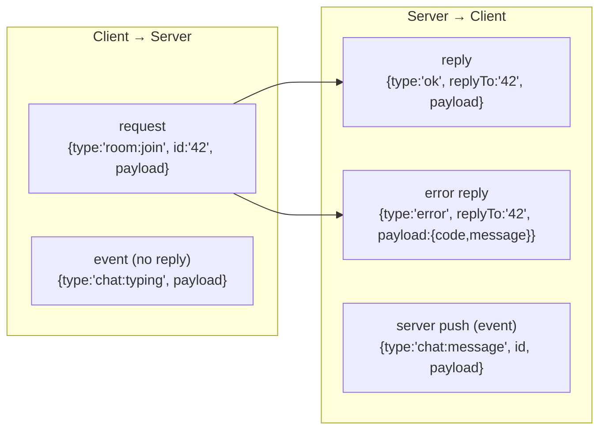
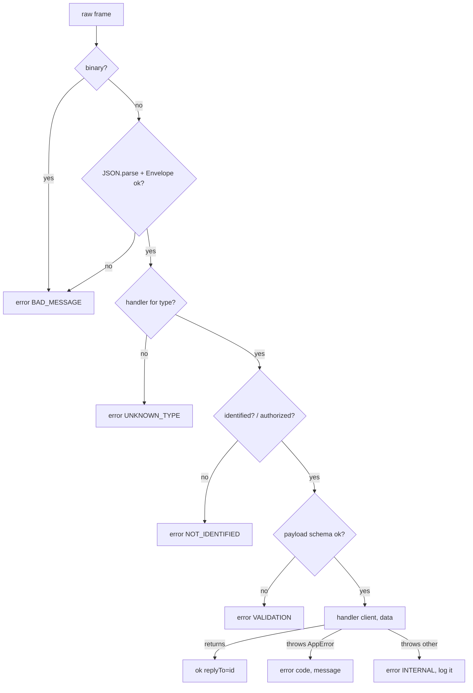
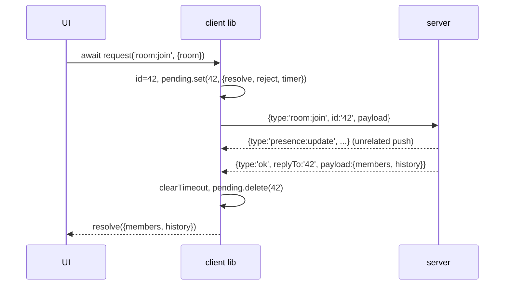
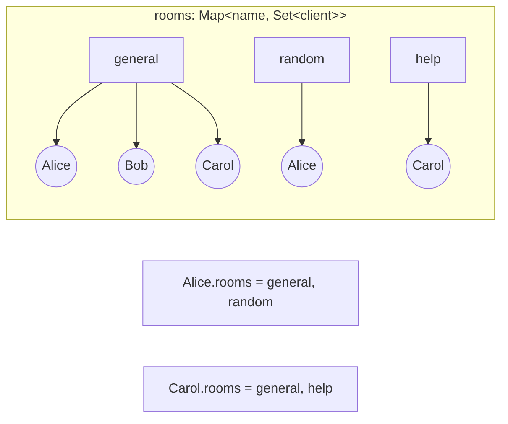
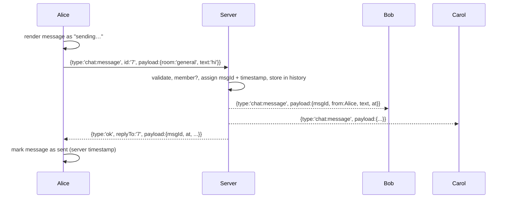
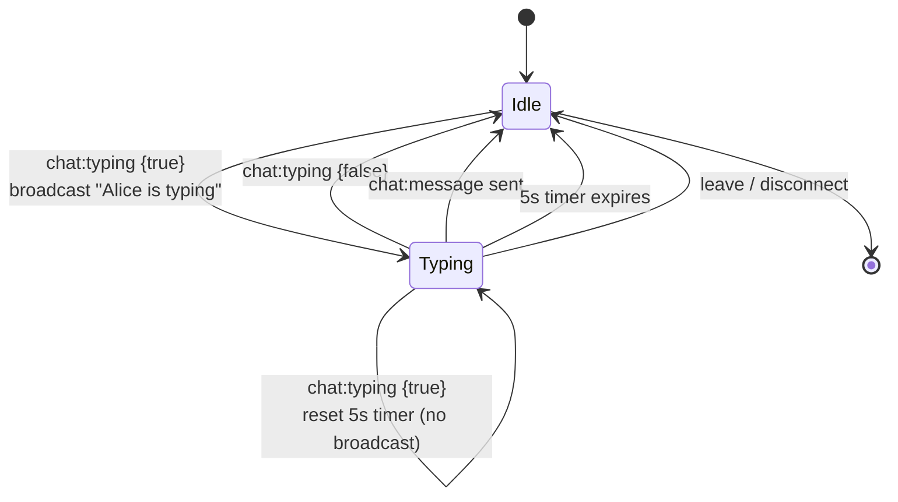

# Chapter 4 — Messaging Patterns: Protocols, Routing, Rooms and Presence

**Level:** `Intermediate`

**What you'll learn:** A WebSocket gives you a pipe that carries *messages*; it says nothing about what those messages mean. This chapter is about designing the layer on top: a **message envelope** (`{ type, id, payload, replyTo }`) used throughout the rest of the course; **validating** every inbound message with `zod`; a **router/dispatcher** that maps message types to handler functions; **request/response** over a socket with correlation ids, a client-side promise map and timeouts; **rooms/channels** with `Map<room, Set<client>>`; **presence**, **typing indicators** and **broadcast-excluding-sender**; structured **error messages**; and when to use **binary** encodings such as MessagePack instead of JSON. You'll build a polished multi-room chat app with Express, `ws` and a vanilla-JS client.

---

## 4.1 Why you need a protocol

In chapters 2–3 we sent ad-hoc JSON like `{ kind: 'chat', text }`. That works for demos and collapses in real apps:

- **Dispatch:** as features grow, a single `on('message')` with nested `if`s becomes unmaintainable.
- **Correlation:** the client sends "join room X" — which of the next 30 messages is the answer? Did it fail?
- **Trust:** every byte from the client is attacker-controlled. `JSON.parse` + `msg.payload.room.toLowerCase()` crashes the process (or worse) the first time someone sends `{"payload":null}`.
- **Evolution:** you'll add fields, rename things, ship mobile clients you can't update instantly.

HTTP gives you methods, paths, status codes and headers for free. Over WebSocket you must invent the equivalent. Keep it small and consistent.

---

## 4.2 The envelope

Every message in this course, in both directions, has this shape:

```json
{
  "type": "chat:message",
  "id": "5b0c6c8e-0d8f-4c2f-9c9e-2b8f8a1f0f3e",
  "payload": { "room": "general", "text": "hello" },
  "replyTo": "a1c2..."
}
```

| Field | Required | Meaning |
|---|---|---|
| `type` | yes | What this message is. Namespaced `domain:action` (`room:join`, `chat:typing`, `presence:update`). This is the "method + path" of your protocol. |
| `id` | for requests | A unique id (UUID). The sender includes it when it **expects an answer**. Fire-and-forget events (typing) may omit it. |
| `payload` | usually | The data. Always an object (easy to extend without breaking clients). |
| `replyTo` | on replies | The `id` of the request this message answers. This is the "correlation id". |

Three kinds of messages flow over one socket:



**Reply convention used here:** success is `type: "ok"`, failure is `type: "error"`, both with `replyTo`. The client's request function doesn't need to know anything about the specific operation to resolve or reject its promise — a big simplification. (An alternative is replying with the same `type` plus `replyTo`; either works, just pick one and be consistent.)

**Why namespaced types?** They let you group handlers into modules (`roomHandlers`, `chatHandlers`), authorize by prefix (`admin:*`), and log/metric by domain.

**Versioning:** additive changes (new optional fields, new types) are safe if both sides ignore unknown fields and unknown types gracefully. For breaking changes, negotiate a version — via the subprotocol (`chat.v2`, chapter 1) or a `session:hello { version }` message.

---

## 4.3 Validate everything with zod

The server must treat inbound messages as hostile. Validation has three layers:

1. **Bytes → JSON.** `JSON.parse` in a `try` (and binary frames rejected if you don't expect them). Also `maxPayload` on the server (chapter 2) so nobody makes you parse 100 MB.
2. **JSON → envelope.** Is it an object with a string `type`, optional string `id`?
3. **Envelope → typed payload.** Per-type schema: `room:join` needs `{ room: string matching /^[a-z0-9-]{1,24}$/ }`.

[zod](https://zod.dev) expresses layers 2 and 3 declaratively and gives you parsed, *normalized* output (trimmed, lower-cased):

```js
import { z } from 'zod';

const Envelope = z.object({
  type: z.string().min(1).max(64),
  id: z.string().min(1).max(64).optional(),
  payload: z.unknown().optional(),
});

const RoomName = z.string().trim().toLowerCase()
  .regex(/^[a-z0-9][a-z0-9-]{0,23}$/, 'room: a-z, 0-9 and dashes, max 24 chars');

const schemas = {
  'room:join': z.object({ room: RoomName }),
  'chat:message': z.object({ room: RoomName, text: z.string().trim().min(1).max(2000) }),
};

const result = schemas['room:join'].safeParse({ room: '  General ' });
// result.success === true, result.data === { room: 'general' }
```

Use `safeParse` (returns `{ success, data | error }`) instead of `parse` (throws) in hot paths, and convert zod's detailed issues into a short, client-safe error message. **Never echo internal exception messages** to clients (they can leak paths, SQL, stack traces).

Also note what zod gives you for free: **unknown keys are stripped** by `z.object()` by default, so a client sending `{ room: 'x', isAdmin: true }` can't smuggle `isAdmin` into your handler.

---

## 4.4 A router / dispatcher

Instead of a giant `switch`, map types to handler functions and write one generic dispatch function:

```js
const handlers = {
  'room:join': (client, payload) => { /* ... */ return { room, members, history }; },
  'room:leave': (client, payload) => { /* ... */ },
  'chat:message': (client, payload) => { /* ... */ },
};

async function dispatch(client, raw) {
  let msg;
  try {
    msg = Envelope.parse(JSON.parse(raw));          // layers 1 + 2
  } catch {
    return client.send(error(null, 'BAD_MESSAGE', 'invalid JSON envelope'));
  }
  const handler = handlers[msg.type];
  if (!handler) return client.send(error(msg.id, 'UNKNOWN_TYPE', msg.type));

  const parsed = schemas[msg.type].safeParse(msg.payload ?? {}); // layer 3
  if (!parsed.success) return client.send(error(msg.id, 'VALIDATION', formatIssues(parsed.error)));

  try {
    const result = await handler(client, parsed.data);
    if (msg.id) client.send(reply(msg.id, result ?? null));  // requests always get an answer
  } catch (err) {
    client.send(error(msg.id, err.code ?? 'INTERNAL', err.expose ? err.message : 'internal error'));
  }
}
```



Benefits: every handler receives **already-validated** data, errors are uniform, cross-cutting concerns (auth, rate limiting in chapter 6, metrics, logging) live in one place — effectively *middleware* for WebSockets.

### Application errors

Define a small error class so handlers can fail with a code the client understands:

```js
class AppError extends Error {
  constructor(code, message) { super(message); this.code = code; this.expose = true; }
}
throw new AppError('NICK_TAKEN', 'that nickname is already in use');
```

Error payload on the wire: `{ type: 'error', replyTo, payload: { code: 'NICK_TAKEN', message: '...' } }`. Clients branch on `code` (stable, machine-readable), show `message` (human-readable). Same idea as HTTP status + body.

---

## 4.5 Request/response over WebSocket

HTTP gives you request/response for free; WebSocket gives you two independent streams. To `await` an answer, the client:

1. generates a unique `id`,
2. stores `{ resolve, reject, timer }` in a `Map` keyed by `id`,
3. sends the request,
4. when a message with `replyTo === id` arrives, resolves/rejects and deletes the entry,
5. if nothing arrives within N ms, rejects with a timeout and deletes the entry,
6. if the socket closes, rejects **all** pending entries.

```js
const pending = new Map(); // id -> { resolve, reject, timer }

function request(type, payload, { timeout = 5000 } = {}) {
  return new Promise((resolve, reject) => {
    if (ws.readyState !== WebSocket.OPEN) return reject(new Error('not connected'));
    const id = crypto.randomUUID();
    const timer = setTimeout(() => {
      pending.delete(id);
      reject(Object.assign(new Error(`${type} timed out`), { code: 'TIMEOUT' }));
    }, timeout);
    pending.set(id, { resolve, reject, timer });
    ws.send(JSON.stringify({ type, id, payload }));
  });
}

ws.addEventListener('message', (e) => {
  const msg = JSON.parse(e.data);
  if (msg.replyTo && pending.has(msg.replyTo)) {
    const { resolve, reject, timer } = pending.get(msg.replyTo);
    clearTimeout(timer);
    pending.delete(msg.replyTo);
    return msg.type === 'error'
      ? reject(Object.assign(new Error(msg.payload.message), { code: msg.payload.code }))
      : resolve(msg.payload);
  }
  // ...otherwise it's a server push: route by msg.type
});

ws.addEventListener('close', () => {
  for (const [id, p] of pending) { clearTimeout(p.timer); p.reject(new Error('connection closed')); }
  pending.clear();
});

// Usage reads like an HTTP call:
const { members, history } = await request('room:join', { room: 'general' });
```



Subtleties:

- **A timeout doesn't mean the server didn't do it.** The join might have succeeded and the reply got lost in a disconnect. Design operations to be **idempotent** (joining a room twice is harmless), or dedupe by `id` on the server. Chapter 5 revisits this for delivery guarantees.
- **Always clean up** the map — on reply, timeout and close. A leaked entry per lost reply is a slow memory leak.
- The **server** can use the same pattern to ask the client something (e.g. "confirm you still have unsaved changes"). The envelope is symmetric.
- Socket.IO calls this *acknowledgements* and builds it in (chapter 7). Now you know how it works.

---

## 4.6 Rooms (channels)

A room is a named group of connections that receive the same broadcasts. The data structure is exactly what you'd guess:

```js
const rooms = new Map(); // roomName -> Set<client>
```

plus the **reverse index** on each client, so disconnect cleanup is O(rooms-of-this-client) instead of scanning every room:

```js
client.rooms = new Set(); // roomNames this client joined
```



Operations and their invariants:

| Operation | Must do |
|---|---|
| `join(room, client)` | create the Set if missing; add client; add room to `client.rooms`; notify room (presence). |
| `leave(room, client)` | remove from both sides; **delete the room if empty** (unless it's a permanent room) — otherwise room names are a memory leak; notify room. |
| `disconnect(client)` | `leave` every room in `client.rooms`. Runs in `ws.on('close')`. |
| `broadcast(room, msg, { except })` | stringify once; send to every member whose socket is OPEN, skipping `except`. |

**Broadcast excluding sender** is how most chat apps work: the sender renders its own message immediately (optimistically) and receives confirmation via the *reply* to its request — so it doesn't need the broadcast copy. Everyone else gets the broadcast. Benefit: no duplicate rendering, and the sender learns about failures (validation, not a member) through the reply.



**History on join:** keep the last N messages per room in memory (a ring buffer) and include them in the join reply, so a newcomer sees context. Real apps store history in a database and paginate (`room:history { before: msgId }`).

---

## 4.7 Presence

*Presence* = who is here right now. With rooms it's just the members of the room's Set, mapped to public user info. Two design choices:

- **Full snapshot vs. deltas.** Sending the whole member list on every change is simple and self-healing (a missed message is fixed by the next one) but O(n²) traffic for big rooms: n members each receive n names on every join. Deltas (`{ joined: 'Bob' }`) are cheap but a missed delta leaves a client wrong forever, so you still need snapshots on join/reconnect. Our example sends a snapshot plus a `change` field describing what happened; for rooms of hundreds+ you'd switch to deltas.
- **Per-connection vs. per-user.** If Alice has two tabs open, she has two connections. Presence should be about *users*: count connections per user and only announce "Alice left" when the last one closes. (Our example keeps it simple — one nickname per connection — and exercise 3 asks you to fix that.)

**Coalescing:** on a busy server, many joins/leaves per second each trigger a "room list changed" broadcast to everyone. Instead, mark the list dirty and broadcast at most once per 100–250 ms. The example does this for the global room list.

---

## 4.8 Typing indicators

Typing is **ephemeral, lossy-OK, high-frequency** data — the opposite of chat messages. Rules of thumb:

- **Fire-and-forget:** no `id`, no reply, never stored.
- **Throttle on the client:** send `typing: true` at most every ~2.5 s while keys are being pressed, and `typing: false` after ~3 s of inactivity or when the message is sent.
- **Expire on the server:** if a client crashes mid-typing, nobody will ever send `false`. The server keeps a timer per (client, room) and auto-clears after ~5 s without a refresh.
- **Broadcast only transitions** (not typing → typing, typing → not typing), excluding the typer.
- **Clear on send, leave and disconnect.**



---

## 4.9 JSON vs binary

JSON is the default for good reasons: human-readable in DevTools, universally supported, easy to validate. Its costs: verbose (field names repeated in every message), numbers as text, binary data must be base64-encoded (+33%), and parse/stringify CPU.

Alternatives:

| Format | Size | Schema needed | Binary blobs | Notes |
|---|---|---|---|---|
| JSON | baseline | no | base64 (+33%) | readable, universal |
| **MessagePack** | ~15–40% smaller | no | native | "binary JSON": same data model; `@msgpack/msgpack` in browser and Node |
| CBOR | similar to MessagePack | no | native | IETF standard (RFC 8949) |
| Protobuf / FlatBuffers | smallest | **yes** (.proto) | native | best for high-volume, strongly-typed protocols; code generation |
| Hand-rolled `DataView` | minimal | implicit | native | games, telemetry: `[u8 type][f32 x][f32 y]` |

With MessagePack the envelope stays identical — only encoding changes, and frames become binary:

```js
// npm i @msgpack/msgpack   (not installed in this course — illustration only)
import { encode, decode } from '@msgpack/msgpack';

// server
ws.send(encode({ type: 'chat:message', id, payload }));          // Uint8Array -> binary frame
ws.on('message', (data, isBinary) => { if (isBinary) dispatch(client, decode(data)); });

// browser
ws.binaryType = 'arraybuffer';
ws.onmessage = (e) => handle(decode(new Uint8Array(e.data)));
```

For many apps a better first step is **permessage-deflate** (chapter 2): repetitive JSON compresses extremely well with no code change. And a hybrid is common: JSON for control messages, raw binary frames for bulk data (file chunks, audio), distinguished by `isBinary`.

A tiny example of the hand-rolled approach — a cursor-position message in 9 bytes instead of ~60 of JSON:

```js
// encode: [type=1][x float32][y float32]
const buf = new ArrayBuffer(9);
const v = new DataView(buf);
v.setUint8(0, 1); v.setFloat32(1, x); v.setFloat32(5, y);
ws.send(buf);

// decode on the server (Buffer)
if (data[0] === 1) { const x = data.readFloatBE(1), y = data.readFloatBE(5); }
```

---

## 4.10 Build it: a multi-room chat

Features:

- nicknames (unique, validated), persisted in `localStorage` on the client;
- permanent rooms `general`, `random`, `help`, plus rooms created on the fly by joining a new name (deleted when empty);
- a client can be in several rooms at once; the UI shows unread counts for background rooms;
- message history (last 50 per room) delivered on join;
- presence (member list per room, "Alice joined/left" lines);
- typing indicators with client throttling and server expiry;
- request/response with timeouts for every command; optimistic rendering of your own messages;
- structured error messages; simple reconnect (proper backoff arrives in chapter 5).

Layout:

```
examples/04-chat-rooms/
├── server.js       # Express + ws wiring, connection lifecycle, handlers
├── protocol.js     # envelope, zod schemas, message builders, AppError
├── rooms.js        # RoomManager: Map<room, Set<client>> + history
├── public/
│   ├── index.html  # layout + styles
│   └── app.js      # WS client (request/response, events) + UI
└── README.md
```

### Message catalogue

| Direction | `type` | Payload | Reply payload |
|---|---|---|---|
| C→S req | `session:hello` | `{ nick }` | `{ userId, nick, rooms }` |
| C→S req | `user:nick` | `{ nick }` | `{ nick }` |
| C→S req | `room:list` | `{}` | `{ rooms: [{name, count, permanent}] }` |
| C→S req | `room:join` | `{ room }` | `{ room, members, history }` |
| C→S req | `room:leave` | `{ room }` | `{ room }` |
| C→S req | `chat:message` | `{ room, text }` | the stored message `{ msgId, room, from, text, at }` |
| C→S event | `chat:typing` | `{ room, typing }` | — |
| S→C reply | `ok` / `error` | result / `{ code, message }` | — |
| S→C push | `chat:message` | `{ msgId, room, from, text, at }` | — |
| S→C push | `chat:typing` | `{ room, user, typing }` | — |
| S→C push | `presence:update` | `{ room, members, change? }` | — |
| S→C push | `room:list` | `{ rooms }` | — |

### protocol.js

```js
// examples/04-chat-rooms/protocol.js
//
// The wire protocol, in one place:
//   - Envelope: { type, id?, payload?, replyTo? }
//   - zod schemas for every client -> server message type
//   - builders for server -> client messages (event, reply, error)
//   - AppError: an error whose code+message are safe to show the client

import crypto from 'node:crypto';
import { z } from 'zod';

// ---- Envelope (layer 2 validation) ----------------------------------------
export const Envelope = z.object({
  type: z.string().min(1).max(64),
  id: z.string().min(1).max(64).optional(), // present => client expects a reply
  payload: z.unknown().optional(),
});

// ---- Reusable field schemas ------------------------------------------------
export const RoomName = z
  .string()
  .trim()
  .toLowerCase()
  .regex(/^[a-z0-9][a-z0-9-]{0,23}$/, 'room names use a-z, 0-9 and dashes (max 24)');

export const Nick = z
  .string()
  .trim()
  .min(2, 'nickname must be at least 2 characters')
  .max(20, 'nickname must be at most 20 characters')
  .regex(/^[\p{L}\p{N}_.-]+$/u, 'nickname may contain letters, digits, _ . -');

// ---- Payload schemas per message type (layer 3 validation) ----------------
// z.object() strips unknown keys, so clients can't smuggle extra fields.
export const schemas = {
  'session:hello': z.object({ nick: Nick }),
  'user:nick': z.object({ nick: Nick }),
  'room:list': z.object({}),
  'room:join': z.object({ room: RoomName }),
  'room:leave': z.object({ room: RoomName }),
  'chat:message': z.object({ room: RoomName, text: z.string().trim().min(1).max(2000) }),
  'chat:typing': z.object({ room: RoomName, typing: z.boolean() }),
};

// ---- Errors ----------------------------------------------------------------
export class AppError extends Error {
  constructor(code, message) {
    super(message);
    this.code = code;
    this.expose = true; // safe to send to the client
  }
}

// Turn zod issues into one short, human-readable line.
export function formatIssues(zodError) {
  return zodError.issues
    .map((i) => (i.path.length ? `${i.path.join('.')}: ${i.message}` : i.message))
    .join('; ');
}

// ---- Server -> client builders --------------------------------------------
export function event(type, payload) {
  return { type, id: crypto.randomUUID(), payload };
}

export function reply(replyTo, payload) {
  return { type: 'ok', id: crypto.randomUUID(), replyTo, payload };
}

export function errorMessage(replyTo, code, message) {
  const msg = { type: 'error', id: crypto.randomUUID(), payload: { code, message } };
  if (replyTo) msg.replyTo = replyTo;
  return msg;
}
```

### rooms.js

```js
// examples/04-chat-rooms/rooms.js
//
// RoomManager: the classic Map<roomName, Set<client>> with a reverse index
// (client.rooms) and a small in-memory history per room.
//
// A "client" here is our per-connection object (see server.js):
//   { id, nick, ws, rooms: Set<string>, typing: Map<string, Timeout>, send(msg) }

import { WebSocket } from 'ws';

const HISTORY_LIMIT = 50;

export class RoomManager {
  /** @type {Map<string, { name: string, members: Set<object>, history: object[], permanent: boolean }>} */
  #rooms = new Map();

  constructor(permanentRooms = []) {
    for (const name of permanentRooms) this.#create(name, true);
  }

  #create(name, permanent = false) {
    const room = { name, members: new Set(), history: [], permanent };
    this.#rooms.set(name, room);
    return room;
  }

  has(name) {
    return this.#rooms.has(name);
  }

  /** Add client to room (creating it if needed). Returns the room. */
  join(name, client) {
    const room = this.#rooms.get(name) ?? this.#create(name);
    room.members.add(client);
    client.rooms.add(name); // reverse index
    return room;
  }

  /** Remove client from room. Deletes non-permanent empty rooms. Returns true if room was deleted. */
  leave(name, client) {
    const room = this.#rooms.get(name);
    client.rooms.delete(name);
    if (!room) return false;
    room.members.delete(client);
    if (room.members.size === 0 && !room.permanent) {
      this.#rooms.delete(name); // don't leak empty rooms
      return true;
    }
    return false;
  }

  isMember(name, client) {
    return this.#rooms.get(name)?.members.has(client) ?? false;
  }

  /** Public member info, sorted by nick. */
  members(name) {
    const room = this.#rooms.get(name);
    if (!room) return [];
    return [...room.members]
      .map((c) => ({ id: c.id, nick: c.nick }))
      .sort((a, b) => a.nick.localeCompare(b.nick));
  }

  addToHistory(name, message) {
    const room = this.#rooms.get(name);
    if (!room) return;
    room.history.push(message);
    if (room.history.length > HISTORY_LIMIT) room.history.shift(); // simple ring buffer
  }

  history(name) {
    return [...(this.#rooms.get(name)?.history ?? [])];
  }

  /** Summary for the room list sidebar. */
  list() {
    return [...this.#rooms.values()]
      .map((r) => ({ name: r.name, count: r.members.size, permanent: r.permanent }))
      .sort((a, b) => Number(b.permanent) - Number(a.permanent) || a.name.localeCompare(b.name));
  }

  /**
   * Send `message` to every member of `name`, optionally excluding one client.
   * Serializes ONCE, skips sockets that aren't OPEN.
   */
  broadcast(name, message, { except } = {}) {
    const room = this.#rooms.get(name);
    if (!room) return 0;
    const data = JSON.stringify(message);
    let sent = 0;
    for (const client of room.members) {
      if (client !== except && client.ws.readyState === WebSocket.OPEN) {
        client.ws.send(data);
        sent++;
      }
    }
    return sent;
  }
}
```

Design notes: private fields (`#rooms`) keep callers from mutating internals; `leave()` both deletes empty rooms and maintains the reverse index; `broadcast()` is the *only* place that loops over members — in chapter 8 it's the function that gets a Redis-backed twin.

### server.js

```js
// examples/04-chat-rooms/server.js
//
// Multi-room chat: Express (static + tiny REST) + ws, with
//   - an envelope protocol {type, id, payload, replyTo} validated by zod
//   - a handler map + one dispatch() function (WebSocket "router")
//   - request/response (every request with an id gets an ok/error reply)
//   - rooms, presence, typing indicators, broadcast-excluding-sender
//
// Run: npm run ex:04   then open http://localhost:3000 in a few tabs

import http from 'node:http';
import path from 'node:path';
import crypto from 'node:crypto';
import { fileURLToPath } from 'node:url';
import express from 'express';
import { WebSocketServer, WebSocket } from 'ws';
import { Envelope, schemas, AppError, formatIssues, event, reply, errorMessage } from './protocol.js';
import { RoomManager } from './rooms.js';

const PORT = Number(process.env.PORT) || 3000;
const __dirname = path.dirname(fileURLToPath(import.meta.url));

const MAX_ROOMS_PER_CLIENT = 10;
const TYPING_TTL_MS = 5000; // server-side expiry if the client never sends typing:false

const rooms = new RoomManager(['general', 'random', 'help']);
const clients = new Set(); // all connected client objects
const nicks = new Map(); // lower-cased nick -> client (uniqueness)

// ---------------------------------------------------------------------------
// Express: static client + a REST view of the same state
// ---------------------------------------------------------------------------
const app = express();
app.use(express.static(path.join(__dirname, 'public')));
app.get('/api/rooms', (req, res) => res.json({ rooms: rooms.list(), online: clients.size }));

const server = http.createServer(app);
const wss = new WebSocketServer({ server, path: '/ws', maxPayload: 16 * 1024 });

// ---------------------------------------------------------------------------
// Helpers
// ---------------------------------------------------------------------------
function requireMember(client, room) {
  if (!rooms.isMember(room, client)) throw new AppError('NOT_IN_ROOM', `you are not in #${room}`);
}

function claimNick(client, nick) {
  const key = nick.toLowerCase();
  const owner = nicks.get(key);
  if (owner && owner !== client) throw new AppError('NICK_TAKEN', `"${nick}" is already taken`);
  if (client.nick) nicks.delete(client.nick.toLowerCase());
  nicks.set(key, client);
  client.nick = nick;
}

function publicUser(client) {
  return { id: client.id, nick: client.nick };
}

function sendPresence(room, change) {
  rooms.broadcast(room, event('presence:update', { room, members: rooms.members(room), change }));
}

// Coalesce room-list broadcasts: many joins/leaves in a burst -> one message.
let roomListTimer = null;
function scheduleRoomListBroadcast() {
  if (roomListTimer) return;
  roomListTimer = setTimeout(() => {
    roomListTimer = null;
    const data = JSON.stringify(event('room:list', { rooms: rooms.list() }));
    for (const c of clients) if (c.nick && c.ws.readyState === WebSocket.OPEN) c.ws.send(data);
  }, 150);
}

// Typing state: client.typing is Map<room, Timeout>. Broadcast only on transitions.
function setTyping(client, room, typing) {
  const timer = client.typing.get(room);
  if (typing) {
    if (timer) clearTimeout(timer); // already typing: just refresh the expiry
    else rooms.broadcast(room, event('chat:typing', { room, user: publicUser(client), typing: true }), { except: client });
    client.typing.set(room, setTimeout(() => setTyping(client, room, false), TYPING_TTL_MS));
  } else if (timer) {
    clearTimeout(timer);
    client.typing.delete(room);
    rooms.broadcast(room, event('chat:typing', { room, user: publicUser(client), typing: false }), { except: client });
  }
}

function leaveRoom(client, room) {
  setTyping(client, room, false);
  rooms.leave(room, client);
  sendPresence(room, { kind: 'leave', user: publicUser(client) });
  scheduleRoomListBroadcast();
}

// ---------------------------------------------------------------------------
// Handlers: (client, validatedPayload) => replyPayload | undefined
// Throw AppError for expected failures.
// ---------------------------------------------------------------------------
const handlers = {
  'session:hello'(client, { nick }) {
    claimNick(client, nick);
    return { userId: client.id, nick: client.nick, rooms: rooms.list() };
  },

  'user:nick'(client, { nick }) {
    const old = client.nick;
    claimNick(client, nick);
    for (const room of client.rooms) {
      sendPresence(room, { kind: 'rename', user: publicUser(client), from: old });
    }
    return { nick: client.nick };
  },

  'room:list'() {
    return { rooms: rooms.list() };
  },

  'room:join'(client, { room }) {
    if (!rooms.isMember(room, client)) {
      if (client.rooms.size >= MAX_ROOMS_PER_CLIENT) {
        throw new AppError('TOO_MANY_ROOMS', `you can join at most ${MAX_ROOMS_PER_CLIENT} rooms`);
      }
      rooms.join(room, client);
      sendPresence(room, { kind: 'join', user: publicUser(client) });
      scheduleRoomListBroadcast();
    }
    // Idempotent: joining twice just returns the snapshot again (safe to retry after a timeout).
    return { room, members: rooms.members(room), history: rooms.history(room) };
  },

  'room:leave'(client, { room }) {
    requireMember(client, room);
    leaveRoom(client, room);
    return { room };
  },

  'chat:message'(client, { room, text }) {
    requireMember(client, room);
    setTyping(client, room, false); // sending a message ends "typing"
    const message = { msgId: crypto.randomUUID(), room, from: publicUser(client), text, at: Date.now() };
    rooms.addToHistory(room, message);
    // Everyone else gets a push; the sender gets the same object as the reply (its "ack").
    rooms.broadcast(room, event('chat:message', message), { except: client });
    return message;
  },

  'chat:typing'(client, { room, typing }) {
    if (!rooms.isMember(room, client)) return; // ephemeral: silently ignore
    setTyping(client, room, typing);
  },
};

// ---------------------------------------------------------------------------
// The dispatcher: bytes -> envelope -> handler -> reply
// ---------------------------------------------------------------------------
async function dispatch(client, data, isBinary) {
  if (isBinary) return client.send(errorMessage(null, 'BAD_MESSAGE', 'binary frames are not supported'));

  let msg;
  try {
    msg = Envelope.parse(JSON.parse(data.toString()));
  } catch {
    return client.send(errorMessage(null, 'BAD_MESSAGE', 'expected a JSON envelope {type, id?, payload?}'));
  }

  const { type, id } = msg;
  const handler = Object.hasOwn(handlers, type) ? handlers[type] : null; // no prototype keys!
  if (!handler) return client.send(errorMessage(id, 'UNKNOWN_TYPE', `unknown message type "${type}"`));

  if (type !== 'session:hello' && !client.nick) {
    return client.send(errorMessage(id, 'NOT_IDENTIFIED', 'send session:hello first'));
  }

  const parsed = schemas[type].safeParse(msg.payload ?? {});
  if (!parsed.success) return client.send(errorMessage(id, 'VALIDATION', formatIssues(parsed.error)));

  try {
    const result = await handler(client, parsed.data);
    if (id) client.send(reply(id, result ?? null)); // every request with an id gets an answer
  } catch (err) {
    if (!err.expose) console.error(`[handler ${type}]`, err); // unexpected: log, don't leak
    client.send(errorMessage(id, err.expose ? err.code : 'INTERNAL', err.expose ? err.message : 'internal error'));
  }
}

// ---------------------------------------------------------------------------
// Connection lifecycle
// ---------------------------------------------------------------------------
wss.on('connection', (ws) => {
  const client = {
    id: crypto.randomUUID(),
    nick: null,           // set by session:hello
    ws,
    rooms: new Set(),     // reverse index: rooms this client is in
    typing: new Map(),    // room -> expiry timer
    send(message) {
      if (ws.readyState === WebSocket.OPEN) ws.send(JSON.stringify(message));
    },
  };
  clients.add(client);

  ws.on('message', (data, isBinary) => {
    dispatch(client, data, isBinary).catch((err) => console.error('[dispatch]', err));
  });

  ws.on('close', () => {
    // Undo EVERYTHING this client added: rooms, typing timers, nick, client set.
    for (const room of [...client.rooms]) leaveRoom(client, room);
    if (client.nick && nicks.get(client.nick.toLowerCase()) === client) nicks.delete(client.nick.toLowerCase());
    clients.delete(client);
    console.log(`[-] ${client.nick ?? client.id} (${clients.size} online)`);
  });

  ws.on('error', (err) => console.error('[ws error]', err.message));
});

server.listen(PORT, () => console.log(`Chat rooms on http://localhost:${PORT}`));

process.on('SIGINT', () => {
  for (const c of clients) c.ws.close(1001, 'server restarting');
  server.close(() => process.exit(0));
  setTimeout(() => process.exit(0), 1000).unref();
});
```

Walkthrough:

- **`client` object** wraps the socket with our state (`nick`, `rooms`, `typing`) and a safe `send`. Rooms contain *clients*, not raw sockets — `Map<room, Set<client>>` — so handlers never need a side-table lookup.
- **`dispatch`** is the entire router: binary check → JSON + envelope → handler lookup (`Object.hasOwn` so `type: "constructor"` or `"__proto__"` can't reach `Object.prototype`) → identification gate → payload schema → handler → `ok`/`error`. Handlers stay tiny and trusting because the dispatcher is paranoid.
- **`chat:message`** assigns the server-authoritative `msgId` and timestamp, stores history, broadcasts **excluding the sender**, and returns the message as the sender's reply.
- **`room:join` is idempotent**, so a client that timed out can safely retry.
- **`setTyping`** broadcasts only on transitions and uses a per-(client, room) expiry timer.
- **`close`** reverses everything done during the connection's life. Walk through it and check each Map/Set/timer is cleaned: rooms (and via `leaveRoom`, typing timers), nick, `clients`.

### public/index.html

```html
<!-- examples/04-chat-rooms/public/index.html -->
<!doctype html>
<html lang="en">
<head>
  <meta charset="utf-8" />
  <meta name="viewport" content="width=device-width, initial-scale=1" />
  <title>Rooms — WebSocket chat</title>
  <style>
    :root {
      --bg: #0b1020; --panel: #121a2f; --panel-2: #18223d; --border: #25304f;
      --text: #e6e9f2; --muted: #8a94b3; --accent: #7c9cff; --accent-2: #5eead4;
      --danger: #f87171; --mine: #26356a;
    }
    * { box-sizing: border-box; }
    html, body { height: 100%; }
    body { margin: 0; font: 15px/1.45 Inter, system-ui, -apple-system, sans-serif; background: var(--bg); color: var(--text); }
    button, input { font: inherit; color: inherit; }
    .app { display: grid; grid-template-columns: 240px 1fr 220px; height: 100vh; }
    aside, .members { background: var(--panel); border-right: 1px solid var(--border); display: flex; flex-direction: column; min-height: 0; }
    .members { border-right: 0; border-left: 1px solid var(--border); }
    .brand { padding: 1rem; font-weight: 700; letter-spacing: .3px; display: flex; align-items: center; gap: .5rem; }
    .dot { width: 9px; height: 9px; border-radius: 50%; background: var(--danger); }
    .dot.on { background: #4ade80; box-shadow: 0 0 8px #4ade80; }
    .section { padding: .25rem 1rem; color: var(--muted); font-size: 12px; text-transform: uppercase; letter-spacing: .08em; }
    #rooms { list-style: none; margin: 0; padding: .25rem .5rem; overflow-y: auto; flex: 1; }
    #rooms li { display: flex; align-items: center; gap: .4rem; padding: .4rem .6rem; border-radius: 8px; cursor: pointer; color: var(--muted); }
    #rooms li:hover { background: var(--panel-2); color: var(--text); }
    #rooms li.active { background: var(--panel-2); color: var(--text); }
    #rooms li.joined { color: var(--text); }
    #rooms .name { flex: 1; overflow: hidden; text-overflow: ellipsis; }
    #rooms .count { font-size: 12px; color: var(--muted); }
    #rooms .unread { font-size: 11px; background: var(--accent); color: #0b1020; border-radius: 999px; padding: 0 .45rem; font-weight: 700; }
    .join { display: flex; gap: .4rem; padding: .75rem; border-top: 1px solid var(--border); }
    .join input { flex: 1; min-width: 0; }
    input { background: var(--bg); border: 1px solid var(--border); border-radius: 8px; padding: .55rem .7rem; outline: none; }
    input:focus { border-color: var(--accent); }
    button { background: var(--accent); color: #0b1020; border: 0; border-radius: 8px; padding: .55rem .8rem; font-weight: 600; cursor: pointer; }
    button.ghost { background: transparent; color: var(--muted); border: 1px solid var(--border); }
    button:disabled { opacity: .5; cursor: default; }
    .me { padding: .75rem 1rem; border-top: 1px solid var(--border); display: flex; align-items: center; gap: .5rem; font-size: 14px; }
    .me b { flex: 1; overflow: hidden; text-overflow: ellipsis; }
    main { display: flex; flex-direction: column; min-width: 0; min-height: 0; }
    .topbar { display: flex; align-items: center; gap: .75rem; padding: .8rem 1.2rem; border-bottom: 1px solid var(--border); }
    .topbar h1 { margin: 0; font-size: 1.1rem; flex: 1; }
    #messages { flex: 1; overflow-y: auto; padding: 1rem 1.2rem; display: flex; flex-direction: column; gap: .35rem; }
    .msg { max-width: 72%; padding: .45rem .75rem; border-radius: 12px; background: var(--panel-2); align-self: flex-start; word-wrap: break-word; white-space: pre-wrap; }
    .msg.mine { background: var(--mine); align-self: flex-end; }
    .msg.pending { opacity: .55; }
    .msg.failed { outline: 1px solid var(--danger); }
    .msg .meta { font-size: 12px; color: var(--muted); margin-bottom: .1rem; }
    .msg .meta b { color: var(--accent-2); font-weight: 600; }
    .sys { align-self: center; color: var(--muted); font-size: 13px; font-style: italic; }
    #typing { height: 1.4rem; padding: 0 1.2rem; color: var(--muted); font-size: 13px; font-style: italic; }
    .composer { display: flex; gap: .5rem; padding: .8rem 1.2rem 1.1rem; }
    .composer input { flex: 1; }
    #memberList { list-style: none; margin: 0; padding: .25rem 1rem; overflow-y: auto; }
    #memberList li { padding: .3rem 0; display: flex; gap: .5rem; align-items: center; }
    #memberList li::before { content: ''; width: 8px; height: 8px; border-radius: 50%; background: #4ade80; }
    #toast { position: fixed; bottom: 1rem; left: 50%; transform: translateX(-50%); background: var(--danger); color: #1b0b0b; padding: .5rem 1rem; border-radius: 8px; font-weight: 600; opacity: 0; transition: opacity .2s; pointer-events: none; }
    #toast.show { opacity: 1; }
    #banner { display: none; background: #3b2a0a; color: #fcd34d; padding: .4rem 1.2rem; font-size: 13px; }
    #banner.show { display: block; }
    dialog { background: var(--panel); color: var(--text); border: 1px solid var(--border); border-radius: 14px; padding: 1.5rem; width: min(360px, 90vw); }
    dialog::backdrop { background: rgba(0,0,0,.6); }
    dialog form { display: flex; flex-direction: column; gap: .75rem; }
    .err { color: var(--danger); font-size: 13px; min-height: 1.1em; }
    @media (max-width: 860px) { .app { grid-template-columns: 180px 1fr; } .members { display: none; } }
    @media (max-width: 560px) { .app { grid-template-columns: 1fr; } aside { display: none; } }
  </style>
</head>
<body>
  <div class="app">
    <aside>
      <div class="brand"><span id="status" class="dot"></span> Rooms</div>
      <div class="section">Channels</div>
      <ul id="rooms"></ul>
      <form class="join" id="joinForm">
        <input id="joinInput" placeholder="join or create…" maxlength="24" autocomplete="off" />
        <button>+</button>
      </form>
      <div class="me">You: <b id="myNick">–</b> <button class="ghost" id="renameBtn">rename</button></div>
    </aside>

    <main>
      <div id="banner">Disconnected — reconnecting…</div>
      <div class="topbar">
        <h1 id="roomTitle"># –</h1>
        <button class="ghost" id="leaveBtn">Leave</button>
      </div>
      <div id="messages"></div>
      <div id="typing"></div>
      <form class="composer" id="composer">
        <input id="input" placeholder="Message" maxlength="2000" autocomplete="off" />
        <button id="sendBtn">Send</button>
      </form>
    </main>

    <div class="members">
      <div class="brand" style="font-size:14px">Members</div>
      <ul id="memberList"></ul>
    </div>
  </div>

  <dialog id="nickDialog">
    <form id="nickForm" method="dialog">
      <h2 style="margin:0">Pick a nickname</h2>
      <input id="nickInput" placeholder="e.g. ada" maxlength="20" required autocomplete="off" />
      <div class="err" id="nickErr"></div>
      <button>Continue</button>
    </form>
  </dialog>

  <div id="toast"></div>
  <script type="module" src="/app.js"></script>
</body>
</html>
```

### public/app.js

The client has two layers: a reusable **`ChatSocket`** (connection, request/response map with timeouts, event subscriptions, simple reconnect) and the **UI** code that uses it.

```js
// examples/04-chat-rooms/public/app.js
//
// Browser client for the multi-room chat.
//   Part 1: ChatSocket — envelope protocol, request/response with timeouts, events.
//   Part 2: UI state + rendering (vanilla DOM, textContent only => no XSS).

// ===========================================================================
// Part 1: ChatSocket
// ===========================================================================
class ChatSocket {
  #url;
  #ws = null;
  #pending = new Map(); // id -> { resolve, reject, timer }
  #listeners = new Map(); // type -> Set<fn>

  constructor(url) {
    this.#url = url;
  }

  connect() {
    const ws = new WebSocket(this.#url);
    this.#ws = ws;
    ws.addEventListener('open', () => this.#emit('open'));
    ws.addEventListener('message', (e) => this.#onMessage(e.data));
    ws.addEventListener('close', (e) => {
      // Reject every in-flight request: their replies will never come.
      for (const { reject, timer } of this.#pending.values()) {
        clearTimeout(timer);
        reject(Object.assign(new Error('connection closed'), { code: 'CLOSED' }));
      }
      this.#pending.clear();
      this.#emit('close', { code: e.code, reason: e.reason });
    });
  }

  get connected() {
    return this.#ws?.readyState === WebSocket.OPEN;
  }

  /** Request/response: resolves with the reply payload, rejects with {code, message}. */
  request(type, payload = {}, { timeout = 5000 } = {}) {
    return new Promise((resolve, reject) => {
      if (!this.connected) return reject(Object.assign(new Error('not connected'), { code: 'CLOSED' }));
      const id = crypto.randomUUID();
      const timer = setTimeout(() => {
        this.#pending.delete(id);
        reject(Object.assign(new Error(`${type} timed out`), { code: 'TIMEOUT' }));
      }, timeout);
      this.#pending.set(id, { resolve, reject, timer });
      this.#ws.send(JSON.stringify({ type, id, payload }));
    });
  }

  /** Fire-and-forget event (no id => server won't reply). */
  emit(type, payload = {}) {
    if (this.connected) this.#ws.send(JSON.stringify({ type, payload }));
  }

  on(type, fn) {
    if (!this.#listeners.has(type)) this.#listeners.set(type, new Set());
    this.#listeners.get(type).add(fn);
    return () => this.#listeners.get(type).delete(fn); // unsubscribe
  }

  #emit(type, payload) {
    for (const fn of this.#listeners.get(type) ?? []) fn(payload);
  }

  #onMessage(raw) {
    let msg;
    try { msg = JSON.parse(raw); } catch { return console.warn('bad JSON from server', raw); }

    // 1. A reply to one of our requests?
    if (msg.replyTo && this.#pending.has(msg.replyTo)) {
      const { resolve, reject, timer } = this.#pending.get(msg.replyTo);
      clearTimeout(timer);
      this.#pending.delete(msg.replyTo);
      if (msg.type === 'error') reject(Object.assign(new Error(msg.payload.message), { code: msg.payload.code }));
      else resolve(msg.payload);
      return;
    }
    // 2. An error not tied to a request (e.g. malformed message).
    if (msg.type === 'error') return this.#emit('error', msg.payload);
    // 3. A server push: route by type.
    this.#emit(msg.type, msg.payload);
  }
}

// ===========================================================================
// Part 2: UI
// ===========================================================================
const $ = (id) => document.getElementById(id);
const wsUrl = `${location.protocol === 'https:' ? 'wss' : 'ws'}://${location.host}/ws`;
const socket = new ChatSocket(wsUrl);

const state = {
  me: null, // { userId, nick }
  roomList: [], // [{ name, count, permanent }]
  joined: new Map(), // room -> { messages: [], members: [], typing: Map<userId, nick>, unread }
  active: null,
};

// ---- small helpers ---------------------------------------------------------
function el(tag, props = {}, ...children) {
  const node = Object.assign(document.createElement(tag), props);
  node.append(...children); // strings become text nodes => safe from XSS
  return node;
}
let toastTimer;
function toast(text) {
  $('toast').textContent = text;
  $('toast').classList.add('show');
  clearTimeout(toastTimer);
  toastTimer = setTimeout(() => $('toast').classList.remove('show'), 3000);
}
const fmtTime = (ts) => new Date(ts).toLocaleTimeString([], { hour: '2-digit', minute: '2-digit' });
const saveRooms = () => localStorage.setItem('rooms', JSON.stringify([...state.joined.keys()]));

// ---- rendering ---------------------------------------------------------------
function renderRooms() {
  // Show all known rooms, plus any we're in that the list hasn't caught up with yet.
  const names = new Set([...state.roomList.map((r) => r.name), ...state.joined.keys()]);
  const counts = Object.fromEntries(state.roomList.map((r) => [r.name, r.count]));
  $('rooms').replaceChildren(
    ...[...names].map((name) => {
      const joined = state.joined.get(name);
      const li = el('li', { className: [name === state.active && 'active', joined && 'joined'].filter(Boolean).join(' ') },
        el('span', { className: 'name', textContent: `# ${name}` }),
      );
      if (joined?.unread) li.append(el('span', { className: 'unread', textContent: joined.unread }));
      li.append(el('span', { className: 'count', textContent: counts[name] ?? '' }));
      li.onclick = () => openRoom(name);
      return li;
    }),
  );
}

function messageNode(m) {
  if (m.system) return el('div', { className: 'sys', textContent: m.text });
  const mine = m.from.id === state.me?.userId;
  return el('div', { className: `msg${mine ? ' mine' : ''}${m.pending ? ' pending' : ''}${m.failed ? ' failed' : ''}` },
    el('div', { className: 'meta' }, el('b', { textContent: mine ? 'you' : m.from.nick }), ` · ${m.failed ? 'failed' : m.pending ? 'sending…' : fmtTime(m.at)}`),
    m.text,
  );
}

function renderMessages() {
  const room = state.joined.get(state.active);
  const box = $('messages');
  const nearBottom = box.scrollHeight - box.scrollTop - box.clientHeight < 80;
  box.replaceChildren(...(room?.messages ?? []).map(messageNode));
  if (nearBottom) box.scrollTop = box.scrollHeight;
}

function renderMembers() {
  const room = state.joined.get(state.active);
  $('memberList').replaceChildren(...(room?.members ?? []).map((u) =>
    el('li', { textContent: u.id === state.me?.userId ? `${u.nick} (you)` : u.nick })));
}

function renderTyping() {
  const names = [...(state.joined.get(state.active)?.typing.values() ?? [])];
  $('typing').textContent =
    names.length === 0 ? '' :
    names.length === 1 ? `${names[0]} is typing…` :
    names.length === 2 ? `${names[0]} and ${names[1]} are typing…` :
    'Several people are typing…';
}

function renderHeader() {
  $('roomTitle').textContent = state.active ? `# ${state.active}` : '# –';
  $('leaveBtn').disabled = !state.active;
  $('sendBtn').disabled = !state.active || !socket.connected;
  $('myNick').textContent = state.me?.nick ?? '–';
}

function renderAll() { renderRooms(); renderMessages(); renderMembers(); renderTyping(); renderHeader(); }

// ---- actions -----------------------------------------------------------------
async function joinRoom(name) {
  try {
    const { room, members, history } = await socket.request('room:join', { room: name });
    state.joined.set(room, { messages: history, members, typing: new Map(), unread: 0 });
    saveRooms();
    return room;
  } catch (err) {
    toast(`${err.code}: ${err.message}`);
    return null;
  }
}

async function openRoom(name) {
  if (!state.joined.has(name)) {
    const room = await joinRoom(name);
    if (!room) return;
    name = room; // server-normalized name (e.g. lower-cased)
  }
  state.active = name;
  state.joined.get(name).unread = 0;
  localStorage.setItem('active', name);
  renderAll();
  $('input').focus();
}

async function leaveActiveRoom() {
  const name = state.active;
  if (!name) return;
  try {
    await socket.request('room:leave', { room: name });
  } catch (err) {
    if (err.code !== 'NOT_IN_ROOM') return toast(err.message);
  }
  state.joined.delete(name);
  saveRooms();
  state.active = state.joined.keys().next().value ?? null;
  renderAll();
}

async function sendMessage(text) {
  const room = state.active;
  const r = state.joined.get(room);
  // Optimistic UI: show immediately as "sending…", then replace with the server's version.
  const temp = { from: { id: state.me.userId, nick: state.me.nick }, text, pending: true };
  r.messages.push(temp);
  renderMessages();
  stopTyping();
  try {
    const saved = await socket.request('chat:message', { room, text });
    Object.assign(temp, saved, { pending: false });
  } catch (err) {
    temp.pending = false;
    temp.failed = true;
    toast(`Not sent: ${err.message}`);
  }
  if (state.active === room) renderMessages();
}

// ---- typing (client-side throttle + idle timeout) -------------------------
let typingRoom = null, lastTypingSent = 0, idleTimer = null;
function onKeystroke() {
  if (!state.active) return;
  const now = Date.now();
  if (typingRoom !== state.active || now - lastTypingSent > 2500) {
    if (typingRoom && typingRoom !== state.active) socket.emit('chat:typing', { room: typingRoom, typing: false });
    typingRoom = state.active;
    lastTypingSent = now;
    socket.emit('chat:typing', { room: typingRoom, typing: true });
  }
  clearTimeout(idleTimer);
  idleTimer = setTimeout(stopTyping, 3000);
}
function stopTyping() {
  clearTimeout(idleTimer);
  if (typingRoom) socket.emit('chat:typing', { room: typingRoom, typing: false });
  typingRoom = null;
  lastTypingSent = 0;
}

// ---- server pushes -------------------------------------------------------------
socket.on('chat:message', (m) => {
  const r = state.joined.get(m.room);
  if (!r) return;
  r.messages.push(m);
  r.typing.delete(m.from.id);
  if (m.room === state.active) { renderMessages(); renderTyping(); }
  else { r.unread++; renderRooms(); }
});

socket.on('chat:typing', ({ room, user, typing }) => {
  const r = state.joined.get(room);
  if (!r) return;
  if (typing) r.typing.set(user.id, user.nick); else r.typing.delete(user.id);
  if (room === state.active) renderTyping();
});

socket.on('presence:update', ({ room, members, change }) => {
  const r = state.joined.get(room);
  if (!r) return;
  r.members = members;
  if (change && change.user.id !== state.me?.userId) {
    const text =
      change.kind === 'join' ? `${change.user.nick} joined` :
      change.kind === 'leave' ? `${change.user.nick} left` :
      `${change.from} is now ${change.user.nick}`;
    r.messages.push({ system: true, text });
    if (change.kind === 'leave') r.typing.delete(change.user.id);
  }
  if (room === state.active) { renderMessages(); renderMembers(); renderTyping(); }
});

socket.on('room:list', ({ rooms }) => { state.roomList = rooms; renderRooms(); });
socket.on('error', (e) => toast(`${e.code}: ${e.message}`));

// ---- connection lifecycle ---------------------------------------------------
function askNick(errorText = '') {
  return new Promise((resolve) => {
    $('nickErr').textContent = errorText;
    $('nickInput').value = localStorage.getItem('nick') ?? '';
    $('nickDialog').showModal();
    $('nickForm').onsubmit = () => resolve($('nickInput').value.trim());
  });
}

async function hello() {
  let nick = localStorage.getItem('nick') || (await askNick());
  for (;;) {
    try {
      const me = await socket.request('session:hello', { nick });
      localStorage.setItem('nick', me.nick);
      return me;
    } catch (err) {
      if (err.code === 'CLOSED') throw err;
      nick = await askNick(err.message); // NICK_TAKEN / VALIDATION -> ask again
    }
  }
}

socket.on('open', async () => {
  $('status').classList.add('on');
  $('banner').classList.remove('show');
  try {
    state.me = await hello();
    state.roomList = state.me.rooms;
    // Re-join everything we were in (also after a reconnect). room:join is idempotent.
    const wanted = JSON.parse(localStorage.getItem('rooms') ?? '["general"]');
    state.joined.clear();
    for (const name of wanted.length ? wanted : ['general']) await joinRoom(name);
    const active = localStorage.getItem('active');
    state.active = state.joined.has(active) ? active : state.joined.keys().next().value ?? null;
    renderAll();
  } catch (err) {
    console.warn('session setup failed', err);
  }
});

socket.on('close', () => {
  $('status').classList.remove('on');
  $('banner').classList.add('show');
  renderHeader();
  // Naive fixed-delay reconnect. Chapter 5 replaces this with exponential backoff + jitter.
  setTimeout(() => socket.connect(), 2000);
});

// ---- DOM events ----------------------------------------------------------------
$('composer').addEventListener('submit', (e) => {
  e.preventDefault();
  const text = $('input').value.trim();
  if (!text || !state.active || !socket.connected) return;
  $('input').value = '';
  sendMessage(text);
});
$('input').addEventListener('input', onKeystroke);
$('joinForm').addEventListener('submit', (e) => {
  e.preventDefault();
  const name = $('joinInput').value.trim().toLowerCase();
  if (name) openRoom(name);
  $('joinInput').value = '';
});
$('leaveBtn').addEventListener('click', leaveActiveRoom);
$('renameBtn').addEventListener('click', async () => {
  const nick = await askNick();
  try {
    const { nick: newNick } = await socket.request('user:nick', { nick });
    state.me.nick = newNick;
    localStorage.setItem('nick', newNick);
    renderAll();
  } catch (err) {
    toast(err.message);
  }
});

socket.connect();
```

Things to study in the client:

- **`ChatSocket.#onMessage`** has exactly three branches: reply to a pending request, un-correlated error, server push. That's the whole client-side router.
- **Optimistic send**: the message is rendered with `pending: true`, then `Object.assign(temp, saved)` swaps in the server's `msgId`/timestamp; on failure it's marked red. Because the server excludes the sender from the broadcast, no duplicate appears.
- **Reconnect re-establishes session state**: `session:hello` again, then re-join rooms. On the server, a reconnect is a brand-new client — **the server remembers nothing about the old socket**. Everything the client needs must be re-requested. (Chapter 5 adds resume tokens and missed-message recovery.)
- **All text is inserted with `textContent` / text nodes** (`el()` appends strings as text) — immune to XSS from other users' messages and nicknames.

---

## 4.11 Run it

```bash
npm run ex:04
# Chat rooms on http://localhost:3000
```

Open three tabs (or a normal + private window for different nicknames, since the nick is in `localStorage`):

1. Pick nicknames; try taking an existing one → the dialog shows `"ada" is already taken` (`NICK_TAKEN`).
2. Chat in `#general`; open `#random` in one tab and see the **unread badge** grow in another.
3. Start typing: the other tabs show *"ada is typing…"*; stop for 3 s, it disappears.
4. Type `project-x` in "join or create" → a new room appears in everyone's sidebar with a member count; leave it and it's deleted.
5. Stop the server (Ctrl+C): tabs show the reconnect banner; start it again — they re-hello and re-join.
6. Poke the protocol from DevTools on the page:

```js
const t = new WebSocket(`ws://${location.host}/ws`);
t.onmessage = (e) => console.log(JSON.parse(e.data));
t.onopen = () => {
  t.send('not json');                                               // BAD_MESSAGE
  t.send(JSON.stringify({ type: 'room:join', id: '1', payload: { room: 'general' } })); // NOT_IDENTIFIED
  t.send(JSON.stringify({ type: 'session:hello', id: '2', payload: { nick: 'x' } }));   // VALIDATION (too short)
  t.send(JSON.stringify({ type: 'session:hello', id: '3', payload: { nick: 'probe' } })); // ok
  t.send(JSON.stringify({ type: 'room:join', id: '4', payload: { room: 'Bad Name!' } })); // VALIDATION
  t.send(JSON.stringify({ type: 'nope:nope', id: '5' }));                               // UNKNOWN_TYPE
};
```

Also: `curl localhost:3000/api/rooms` shows the same room state over REST.

---

## Common pitfalls

1. **Trusting client JSON.** Validate shape *and* content of every inbound message; the dispatcher is your firewall. Never `handlers[msg.type]` without an own-property check.
2. **Leaking internal errors.** Return stable codes and safe messages; log the details server-side.
3. **Requests without timeouts** (or timeouts without cleanup). Every pending entry must be removed on reply, timeout and close.
4. **Assuming a timeout means "not done".** Make operations idempotent or dedupe by id.
5. **Not cleaning up on disconnect.** Every room membership, typing timer, nickname claim and Map entry must be undone in `close`. Test it: connect/disconnect 10 000 times and watch memory.
6. **Empty rooms that are never deleted.** Room names are user input — an attacker can create millions.
7. **Broadcasting typing on every keystroke** (without client throttle and server transition detection). It's often the busiest message type in a chat app.
8. **O(n²) presence** in big rooms. Snapshots are fine for tens of members; use deltas beyond that.
9. **Rendering user content with `innerHTML`.** Use `textContent`.
10. **Forgetting that a reconnect is a new connection.** Server-side state tied to the old socket is gone; the client must re-establish it.

---

## Exercises

1. **Message history pagination.** Add `room:history { room, before: msgId, limit }` returning older messages; load more when the user scrolls to the top.
2. **Direct messages.** Add `dm:send { to: userId, text }` that delivers only to that user (and replies to the sender), plus a "Direct messages" section in the sidebar.
3. **Per-user presence.** Allow the same nickname from multiple tabs (identify users by a `userId` stored in `localStorage` and sent in `session:hello`). Only broadcast "left" when the user's **last** connection leaves a room.
4. **Server-to-client request.** Implement the reverse: the server sends `{type:'client:ping', id}` every 30 s and expects `{type:'ok', replyTo}` within 5 s, otherwise it closes the socket with `4008`. (This is an application-level heartbeat; chapter 5 does it with protocol pings.)
5. **Binary cursor channel.** Add a "live cursors" feature in a room: the client sends 9-byte binary messages `[u8 roomIndex][f32 x][f32 y]` on mousemove (throttled to 20/s) and the server relays them (excluding the sender) as binary. Keep JSON for everything else.

<details>
<summary>Hints</summary>

- Ex 1: history is an array ordered by time; `findIndex(m => m.msgId === before)` then `slice(Math.max(0, i - limit), i)`. Preserve scroll position after prepending by adding the height difference to `scrollTop`.
- Ex 2: keep `Map<userId, client>`; add a schema `z.object({ to: z.string().uuid(), text: ... })`; reply `NOT_FOUND` if offline.
- Ex 3: `Map<userId, Set<client>>`; on room leave, check if any other client of the same user is still a member before sending `change: leave`.
- Ex 4: give the server its own `pending` map. In `dispatch`, a message of type `ok` with a known `replyTo` resolves it — handle that before the handler lookup.
- Ex 5: in `dispatch`, route `isBinary` frames to a separate function instead of rejecting; relay with `client.ws.send(data, { binary: true })` to each room member except the sender. Keep a per-client room index array so a u8 can identify the room.

</details>

---

## Key takeaways

- Put a **protocol** on top of the socket: an envelope `{ type, id, payload, replyTo }` with namespaced types, used consistently in both directions.
- **Validate everything** at the boundary (JSON → envelope → per-type payload) with zod; strip unknown fields; return stable error **codes**.
- A **handler map + one dispatcher** gives you routing and a single place for cross-cutting concerns — middleware for WebSockets.
- **Request/response** = unique id + promise map + timeout + cleanup on close. Timeouts are ambiguous, so make operations idempotent.
- **Rooms** = `Map<room, Set<client>>` + a reverse index per client; delete empty rooms; clean up on disconnect.
- **Broadcast excluding sender** + reply-as-ack gives you optimistic UI without duplicates.
- **Presence** and **typing** are ephemeral: throttle on the client, expire on the server, broadcast transitions, coalesce bursts.
- JSON first; reach for permessage-deflate, MessagePack or hand-rolled binary when measurement says so.

Next → [Chapter 5 — Reliability: Heartbeats, Reconnection, Replay, Backpressure & Shutdown](./05-reliability.md)
