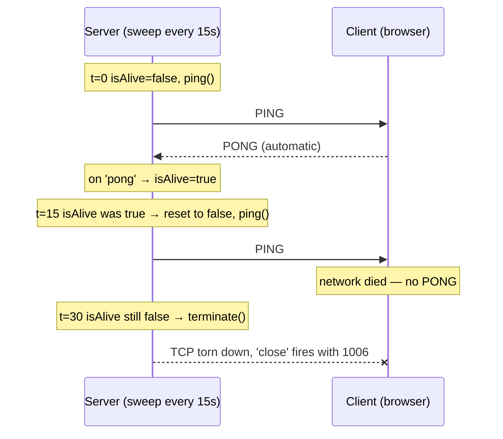
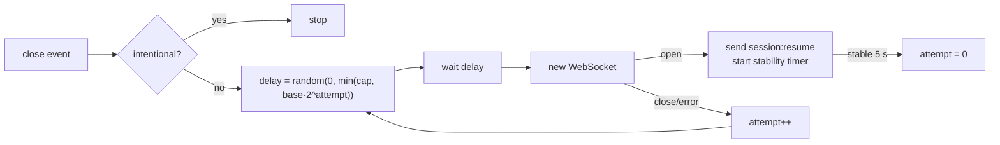
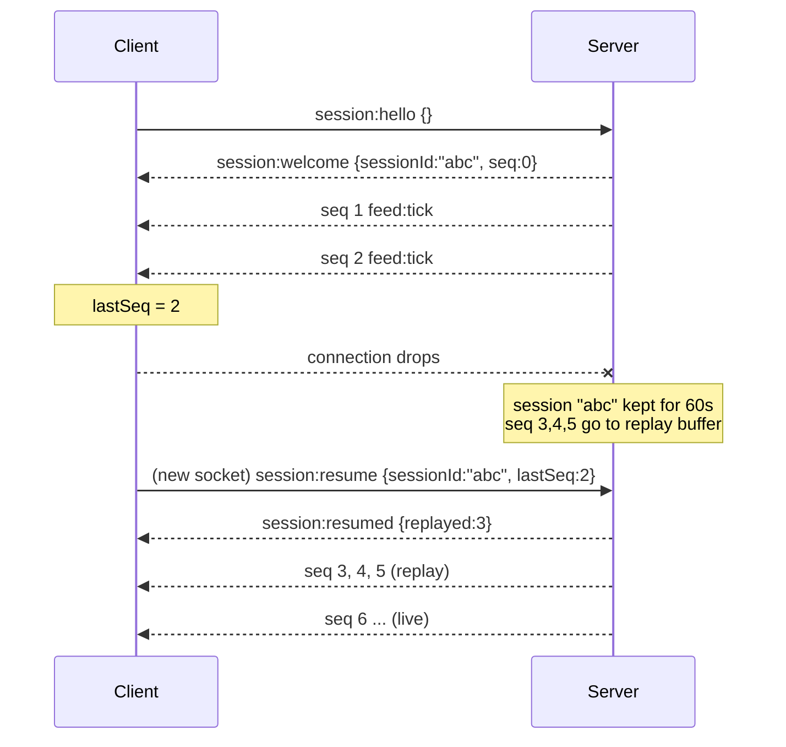
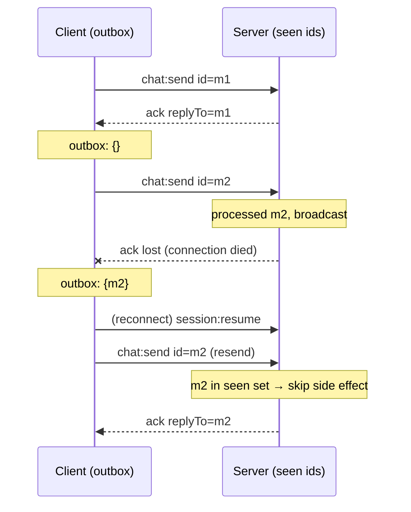
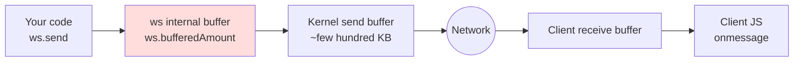
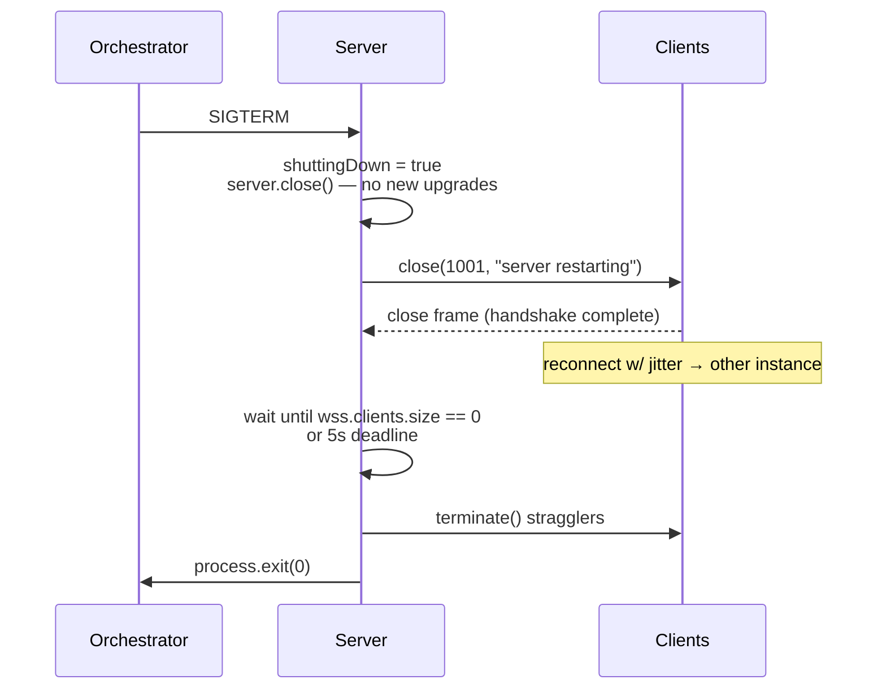

# Chapter 5 — Reliability: Heartbeats, Reconnection, Replay, Backpressure & Shutdown

**Level:** Intermediate → Advanced

**What you'll learn.** A WebSocket that works on your laptop is easy. A WebSocket that keeps working on a train going through a tunnel, behind a corporate proxy that kills idle connections after 60 seconds, across a server deploy, and with one client on a 2G phone that can't keep up is hard. In this chapter you'll learn to detect dead connections with heartbeats (and why TCP keepalive doesn't do it for you), reconnect clients with exponential backoff and jitter, resume sessions without losing messages using sequence numbers and a replay buffer, handle slow consumers with backpressure, get at-least-once delivery with acks and idempotency, and shut a server down gracefully with close code `1001`. By the end you'll have one server and one browser client that show all of these together.

> Prerequisites: [Chapter 2](./02-first-server-ws.md) (the `ws` API), [Chapter 3](./03-express-integration.md) (Express + `noServer` + the `upgrade` event), and [Chapter 4](./04-messaging-patterns.md) (the `{ type, id, payload, replyTo }` envelope and zod validation). Everything here builds on that protocol.

> **In plain English:** Imagine a phone call where the line goes dead but you never hear a click, so you keep talking into silence. Network connections fail the same way, and this chapter is about noticing the silence fast (a [heartbeat](glossary.md#heartbeat)), redialling without everyone calling back at the same instant (backoff with [jitter](glossary.md#jitter)), and picking up the conversation exactly where it stopped (sequence numbers, replay, acks and [idempotency](glossary.md#idempotency)). It also covers not drowning a listener who can't keep up ([backpressure](glossary.md#backpressure)) and hanging up politely when the server restarts.

---

## 1. The core problem: connections fail silently

The most important sentence in this chapter is this one:

> **A TCP connection can be dead for minutes without either side knowing.**

When a phone loses signal, a laptop lid closes, a NAT box reboots, or a cable is pulled, *no packet is sent*. There's no FIN and no RST, just silence. The server's `ws` object stays in `readyState === OPEN`, your room still lists the user as "online", and every `ws.send()` succeeds from JavaScript's point of view: the bytes go into the kernel send buffer and wait. Eventually the kernel gives up retransmitting. On Linux, with default `tcp_retries2 = 15`, that takes **about 15 minutes**. Only then does `close` fire, with code `1006`.

There are also failures where the connection is *killed* but you are not told nicely:

| Failure | What the server sees | What the client sees |
|---|---|---|
| Client's network vanishes (tunnel, Wi-Fi drop) | Nothing, until TCP retries expire (~15 min) or a heartbeat fails | Nothing, until its own send fails or a heartbeat times out |
| Proxy/LB idle timeout (nginx default `proxy_read_timeout 60s`, AWS ALB 60 s, Cloudflare ~100 s) | TCP FIN/RST from proxy → `close` with `1006` | `close` with `1006` |
| Server process crashes | — | `close` with `1006` |
| Server restarts gracefully | You send `1001 Going Away` | `close` with `1001` |
| Client tab closed | `close` with `1001` (usually) | — |
| Client machine sleeps | Nothing (see row 1) | On wake: stale socket, `readyState` may still say OPEN |

Code `1006` is not a code that goes over the wire. It is a *local* code meaning "the connection closed without a close frame". You will see it a lot. It means "something between us broke", not "the peer said something".

### Why TCP keepalive isn't enough

TCP has its own keepalive (`socket.setKeepAlive(true, ms)`). Why not use it?

1. **The defaults are useless.** Linux starts probing after `tcp_keepalive_time = 7200` seconds, which is two hours.
2. **Proxies don't forward it.** TCP keepalive is hop-by-hop. If a client talks to nginx and nginx talks to Node, your keepalive probes only reach nginx. nginx's *application-level* idle timer (`proxy_read_timeout`) counts **data** traffic, and TCP keepalive probes carry no data. The proxy still closes your "idle" socket at 60 s.
3. **Browsers give you no control.** JavaScript in a browser can't set socket options at all.
4. **It doesn't prove the application is alive.** A peer whose event loop is stuck in a 30-second synchronous loop still ACKs keepalives, because the kernel does that, not your code.

What you need is an **application-level heartbeat** that (a) goes through every proxy as real WebSocket frames, (b) runs often enough to beat the shortest idle timeout on the path, and (c) proves the peer's process is responsive.

---

## 2. Heartbeats: ping/pong and the isAlive sweep

The WebSocket protocol (RFC 6455 §5.5.2) has control frames made for this: **ping** (opcode `0x9`) and **pong** (opcode `0xA`). A compliant endpoint *must* answer a ping with a pong carrying the same payload. Browsers do this automatically. **Browsers can't send pings from JavaScript**, and there's no `ws.ping()` in the browser API, so the *server* drives the heartbeat.



The standard pattern from the `ws` README:

```js
const HEARTBEAT_MS = 15_000;

wss.on('connection', (ws) => {
  ws.isAlive = true;
  ws.on('pong', () => { ws.isAlive = true; });   // any pong proves liveness
});

const sweep = setInterval(() => {
  for (const ws of wss.clients) {
    if (ws.isAlive === false) {       // missed a whole interval
      ws.terminate();                 // NOT close(): peer can't do a closing handshake
      continue;
    }
    ws.isAlive = false;
    ws.ping();                        // pong will flip it back to true
  }
}, HEARTBEAT_MS);

wss.on('close', () => clearInterval(sweep));
```

Details that matter:

- **`terminate()`, not `close()`.** `close()` starts the closing handshake: it sends a close frame and waits (30 s by default in `ws`) for the peer's close frame. A dead peer never replies. `terminate()` destroys the socket at once.
- **Dead-detection latency is between 1× and 2× the interval.** With 15 s you find dead peers within 15–30 s. Pick an interval **well below** the shortest idle timeout on the path (nginx's 60 s, for example). 15–30 s is a good default.
- **Pings also keep proxies happy.** A ping frame is real data to nginx, so it resets `proxy_read_timeout`. One mechanism does both jobs.
- **Cost.** A ping is 2–6 bytes. With 100k connections at 15 s, that's ~6,700 frames/s, which is fine. Avoid 1-second heartbeats "to be safe".
- **Any inbound message also proves liveness.** You can set `ws.isAlive = true` in your `message` handler too. That helps on busy connections where a pong might be queued behind a large message.

### The client side: detecting a dead *server*

The server now finds dead clients. But the browser also needs to know when the *server* is gone. Otherwise a sleeping laptop wakes up with a socket that says `OPEN` but is actually dead. Browser JavaScript can't see ping frames, so there are two options:

1. **App-level heartbeat.** The server sends a small `{ type: "sys:heartbeat" }` message (or the client sends `ping` and expects `pong` messages). The client keeps a timer: "if I've heard *nothing* for `2.5 × interval`, assume dead, close, and reconnect."
2. **Piggyback on traffic.** Any message resets the watchdog timer, so heartbeats are only needed when the connection is idle.

Our example does both. The server sends `sys:heartbeat` every 15 s, and the client's watchdog resets on every inbound message.

```js
// client
let watchdog;
function armWatchdog() {
  clearTimeout(watchdog);
  watchdog = setTimeout(() => ws.close(4000, 'heartbeat timeout'), 40_000);
}
ws.addEventListener('message', armWatchdog);
ws.addEventListener('open', armWatchdog);
```

Also listen to the browser's hints: `window.addEventListener('online', reconnectNow)` and `document.addEventListener('visibilitychange', …)`. When the tab comes back or the network returns, check the connection right away instead of waiting for timers.

---

## 3. Reconnection: exponential backoff with jitter

When a connection drops, the client should reconnect. Doing this *naively* causes outages.

### The thundering herd

Suppose your server restarts with 50,000 clients connected. If each one reconnects after exactly 1 second, the new process gets 50,000 TLS handshakes + HTTP upgrades + auth lookups in the same 100 ms, falls over, and the cycle repeats. That is a **thundering herd**, and a fixed retry delay makes it happen *in sync*.

The fix has two parts:

1. **Exponential backoff.** Each failed attempt doubles the delay, up to a cap: `base × 2^attempt`, capped at e.g. 30 s.
2. **Jitter.** Randomise the delay so clients spread out. The AWS Architecture Blog's analysis ("Exponential Backoff and Jitter") shows **full jitter** does best in practice:

```
delay = random(0, min(cap, base × 2^attempt))
```



| attempt | ceiling (base=500 ms, cap=30 s) | actual delay (full jitter) |
|---|---|---|
| 0 | 500 ms | 0–500 ms |
| 1 | 1 s | 0–1 s |
| 2 | 2 s | 0–2 s |
| 3 | 4 s | 0–4 s |
| 5 | 16 s | 0–16 s |
| 6+ | 30 s | 0–30 s |

Rules for a good reconnect loop:

- **Reset `attempt` only after the connection has been *stable* for a while** (e.g. 5 s), not on `open`. A server that accepts the upgrade and then crashes would otherwise pull clients into a tight loop.
- **Don't reconnect on "don't come back" closes.** If the server closes with `1008` (policy violation) or a custom `4401 unauthorized`, retrying won't help. Show the user an error or refresh the token first. Our client treats codes `4400–4499` as fatal.
- **Treat `1001` / `1012` (Service Restart) / `1013` (Try Again Later) as "come back soon".** A server can use `1013` to shed load.
- **Honour browser signals.** Reconnect immediately (attempt reset) on `online`. Don't burn battery retrying while `navigator.onLine === false`.
- **Server-side protection is still required.** Clients may be buggy or malicious. Rate-limit upgrades per IP ([Chapter 6](./06-security.md)).

---

## 4. Resuming sessions: sequence numbers and a replay buffer

Reconnecting gives you a *new socket*. It doesn't give you the messages that were sent while you were disconnected. For a chat, a trading ticker, or a collaborative editor, silently losing messages isn't acceptable.

The standard solution is the one TCP itself uses, one layer up:

1. The server assigns every outbound message on a **session** a monotonically increasing **sequence number** (`seq`).
2. The server keeps the last *N* messages (or last *T* seconds) per session in a **replay buffer**.
3. The client remembers the **highest `seq` it has processed** (`lastSeq`).
4. On reconnect the client sends `session:resume { sessionId, lastSeq }`.
5. The server replays everything with `seq > lastSeq` from the buffer, then continues live.
6. If the buffer no longer has `lastSeq + 1` (the gap is too old) or the session expired, the server replies `session:reset`. The client throws away local state and refetches a snapshot (e.g. "last 50 chat messages" via HTTP).



We extend the [Chapter 4](./04-messaging-patterns.md) envelope with one optional top-level field for server→client messages:

```json
{ "type": "feed:tick", "id": "5b1c…", "seq": 42, "payload": { "n": 17 } }
```

### Key design decisions

- **Session ≠ socket.** A session is a logical conversation that *outlives* sockets. The server keeps `sessions: Map<sessionId, Session>`. Each `Session` holds `nextSeq`, a buffer, the current `ws` (or `null`), and an expiry timer. Messages are sent **to sessions**. If the socket is down, the message just goes into the buffer.
- **The sessionId is a capability.** Anyone who has it can resume and read the backlog. Generate it with `crypto.randomUUID()` (122 bits of randomness). In production, also bind it to the authenticated user from [Chapter 6](./06-security.md) and reject resumes from a different user.
- **Bounded buffers.** Memory per session = `N × avg message size`. With 10k sessions × 500 messages × 200 bytes = 1 GB. Choose *N* (or a time window) deliberately, and expire disconnected sessions (60 s in our example).
- **Client dedup.** Replay can overlap with what the client already processed (e.g. the client received seq 5 but crashed before saving `lastSeq`). The client *must* ignore any `seq <= lastSeq`. That makes replay **idempotent**.
- **Gap detection.** If the client ever sees `seq > lastSeq + 1` it has missed something. In a correct implementation this shouldn't happen on one socket, but check anyway and force a resume or reset.
- **Multi-node.** In a cluster, the buffer can't live in one process's memory. You'd use Redis Streams (`XADD`/`XRANGE` with the stream ID as `seq`). See [Chapter 8](./08-scaling.md). Socket.IO's *connection state recovery* is this same pattern built in ([Chapter 7](./07-socketio.md)).

---

## 5. Client → server: at-least-once delivery with acks and idempotency

Sequence numbers protect server→client traffic. For client→server (the user presses *Send*), the question is: **did the server get my message?** `ws.send()` returning without error only means the bytes reached the *browser's* buffer.

The three delivery guarantees:

| Guarantee | How | Risk |
|---|---|---|
| **At-most-once** | Send and forget | Lost on disconnect |
| **At-least-once** | Keep in an *outbox* until acked; resend on reconnect | **Duplicates** if the ack was lost |
| **Exactly-once** | Not achievable over an unreliable network in general. You *simulate* it with at-least-once + **idempotent processing** on the receiver | — |

So the pattern is:

1. The client generates the message `id` (UUID) **once**, when the user acts, and stores the message in an `outbox` Map.
2. The client sends it. It stays in the outbox.
3. The server processes it **idempotently**: it keeps a set of recently seen ids per session. For a duplicate it skips the side effect but **still acks**.
4. The server replies `{ type: "ack", replyTo: id }` (the `replyTo` from [Chapter 4](./04-messaging-patterns.md)).
5. On ack, the client removes it from the outbox.
6. On reconnect (after resume), the client resends everything still in the outbox, **in original order**.



### Ordering

Within **one** WebSocket connection, messages arrive in the order they were sent, because TCP guarantees it. Ordering breaks at these points:

- **Across reconnects.** The server may see `m3` (sent on the new socket) before resent `m2` if you're careless. Always flush the outbox in insertion order *before* sending anything new. `Map` iterates in insertion order.
- **Across servers.** With multiple nodes, two clients' messages hit different processes, so global order needs a single sequencer (a Redis `INCR`, a Kafka partition, a DB sequence).
- **Async handlers.** If your `message` handler does `await db.save(msg)`, two messages can be *processed* out of order even though they *arrived* in order. Serialise per-connection work with a promise chain when order matters:

```js
ws.queue = Promise.resolve();
ws.on('message', (raw) => {
  ws.queue = ws.queue.then(() => handle(ws, raw)).catch(console.error);
});
```

---

## 6. Backpressure: when the client can't keep up

`ws.send()` never blocks. If you send faster than the network (or the client) can take data, the bytes pile up in memory, first in the `ws` library's queue and then in the kernel socket buffer. One slow phone on a bad connection subscribed to a busy feed can grow your process's memory without limit until the OOM killer steps in.



`ws.bufferedAmount` (available both in `ws` and in the browser) tells you how many bytes are queued but not yet handed to the OS. That's your pressure gauge.

Strategies, from gentlest to harshest:

1. **Drop what doesn't matter.** For *volatile* data (cursor positions, live prices where only the latest matters), skip the send when `bufferedAmount > HIGH_WATER`. Socket.IO calls this `volatile`.
2. **Conflate.** Keep only the *latest* value per key (e.g. per ticker symbol) and flush when the buffer drains. The client gets fewer but always current updates.
3. **Pause the producer.** If the data comes from a stream (a file, a DB cursor), stop reading until the buffer drains. `ws.send(data, cb)` calls `cb` once the data is written to the OS, which you can use as a "drain" signal.
4. **Disconnect the slow consumer.** Above a hard limit, close with **`1013 Try Again Later`** (or terminate). With session resume, the client reconnects and replays from the buffer, and the replay buffer is bounded, so memory stays bounded too.

```js
const SOFT_LIMIT = 64 * 1024;       // skip volatile messages above this
const HARD_LIMIT = 1 * 1024 * 1024; // kill the connection above this

function safeSend(ws, obj, { volatile = false } = {}) {
  if (ws.readyState !== ws.OPEN) return false;
  if (ws.bufferedAmount > HARD_LIMIT) {
    ws.close(1013, 'slow consumer');   // client will reconnect + resume
    return false;
  }
  if (volatile && ws.bufferedAmount > SOFT_LIMIT) return false; // drop it
  ws.send(JSON.stringify(obj));
  return true;
}
```

Also in the browser: before sending a big upload over WebSocket, check `ws.bufferedAmount` there too, and wait for it to drop before queuing more.

> Tip: `ws.bufferedAmount` only counts bytes still in `ws`'s own queue. Once data enters the kernel buffer it no longer counts, so a slow reader first fills ~200–400 KB of kernel buffer before `bufferedAmount` rises. Choose limits with that in mind.

---

## 7. Graceful shutdown: close code 1001 and draining

Deploys happen many times a day. A deploy shouldn't look like a crash to users. Graceful shutdown means:

1. **Stop accepting new connections.** Call `server.close()` (stops listening), and reject upgrades that are already in progress with `503`.
2. **Tell clients to go away politely.** Send each client close code **`1001 Going Away`** (or `1012 Service Restart`). A clean close frame lets the client tell "planned restart" from "crash", and lets it reconnect right away. Its jittered backoff will land it on another instance behind the load balancer.
3. **Drain.** Give in-flight work time to finish: pending acks, DB writes, buffered sends. `ws.close()` flushes queued data before sending the close frame.
4. **Force after a deadline.** After *N* seconds, `terminate()` whatever is left and exit. Orchestrators (Kubernetes `terminationGracePeriodSeconds` defaults to 30 s) will `SIGKILL` you anyway.



Two subtleties:

- **Don't replay into a dying process.** With in-memory sessions, a restart loses the replay buffers. Clients will get `session:reset` and refetch a snapshot. Durable resume across restarts requires external storage (Redis, [Chapter 8](./08-scaling.md)).
- **Spread the reconnect.** 10k clients all getting `1001` at the same instant is a thundering herd pointed at your *other* instances. Jitter on the client helps. You can also close clients in batches over a few seconds on the server.

---

## 8. Putting it together: the example

Layout of `examples/05-reliability/`:

```
examples/05-reliability/
├── server.js          # Express 5 + ws (noServer), sessions, replay, acks, heartbeats, shutdown
├── public/index.html  # ReconnectingSocket client with backoff+jitter, resume, outbox
└── README.md
```

What it does:

- The server publishes a `feed:tick` to **every session** once per second. This gives us a steady sequenced stream, so you can *see* whether any message is lost.
- Clients can send `chat:send`. The server acks it and broadcasts `chat:message` to every session.
- `POST /debug/kill-all` **terminates** every socket abruptly (simulates a network blip → `1006`). `POST /debug/slow/:on` makes the server flood a volatile `feed:noise` stream so you can watch backpressure.
- The client shows its connection state, current backoff delay, `lastSeq`, number of replayed messages, and outbox size.

### 8.1 Server: `server.js`

Read it top to bottom. Each numbered section matches a concept above.

```js
// examples/05-reliability/server.js
// Chapter 5 — Reliability: heartbeats, sessions + replay, acks, backpressure, graceful shutdown.
import http from 'node:http';
import crypto from 'node:crypto';
import path from 'node:path';
import { fileURLToPath } from 'node:url';
import express from 'express';
import { WebSocketServer } from 'ws';
import { z } from 'zod';

const __dirname = path.dirname(fileURLToPath(import.meta.url));
const PORT = Number(process.env.PORT) || 3000;

// ---- Tunables -------------------------------------------------------------
const HEARTBEAT_MS = 15_000;          // ping sweep interval (well under proxy idle timeouts)
const SESSION_TTL_MS = 60_000;        // keep a disconnected session this long
const REPLAY_LIMIT = 500;             // messages kept per session for replay
const SEEN_IDS_LIMIT = 1_000;         // recent client message ids kept for dedup
const SOFT_LIMIT = 64 * 1024;         // drop volatile sends above this bufferedAmount
const HARD_LIMIT = 1024 * 1024;       // disconnect slow consumer above this
const SHUTDOWN_GRACE_MS = 5_000;      // drain time before terminating stragglers

// ---- 1. Validation (Chapter 4 envelope) -----------------------------------
const Envelope = z.object({
  type: z.string().min(1).max(64),
  id: z.string().uuid(),
  payload: z.unknown().optional(),
  replyTo: z.string().optional(),
});
const HelloPayload = z.object({}).passthrough();
const ResumePayload = z.object({
  sessionId: z.string().uuid(),
  lastSeq: z.number().int().min(0),
});
const ChatPayload = z.object({ text: z.string().min(1).max(500) });

// ---- 2. Sessions: a session outlives any single socket --------------------
/**
 * @typedef {object} Session
 * @property {string} id
 * @property {number} nextSeq          next sequence number to assign
 * @property {Array<object>} buffer    last REPLAY_LIMIT sequenced messages
 * @property {Set<string>} seen        recently processed client message ids
 * @property {import('ws').WebSocket|null} ws
 * @property {NodeJS.Timeout|null} expiry
 */
/** @type {Map<string, Session>} */
const sessions = new Map();

function createSession() {
  const s = { id: crypto.randomUUID(), nextSeq: 1, buffer: [], seen: new Set(), ws: null, expiry: null };
  sessions.set(s.id, s);
  return s;
}

function attach(session, ws) {
  if (session.ws && session.ws !== ws) session.ws.close(4409, 'session taken over');
  clearTimeout(session.expiry);
  session.expiry = null;
  session.ws = ws;
  ws.session = session;
}

function detach(ws) {
  const s = ws.session;
  if (!s || s.ws !== ws) return;
  s.ws = null;
  // Keep the session (and keep buffering!) for a while so the client can resume.
  s.expiry = setTimeout(() => sessions.delete(s.id), SESSION_TTL_MS);
  s.expiry.unref();
}

// ---- 3. Sending: raw, sequenced (replayable), and backpressure-aware -------
function envelope(type, payload, extra = {}) {
  return { type, id: crypto.randomUUID(), payload, ...extra };
}

/** Low-level send with backpressure policy. Returns true if the frame was queued. */
function safeSend(ws, msg, { volatile = false } = {}) {
  if (!ws || ws.readyState !== ws.OPEN) return false;
  if (ws.bufferedAmount > HARD_LIMIT) {
    console.warn(`[backpressure] slow consumer ${ws.session?.id} (${ws.bufferedAmount} B) → 1013`);
    ws.close(1013, 'slow consumer');     // client reconnects and resumes from replay buffer
    return false;
  }
  if (volatile && ws.bufferedAmount > SOFT_LIMIT) return false; // drop, it's only noise
  ws.send(JSON.stringify(msg));
  return true;
}

/** Sequenced send: stamped with seq, stored for replay, delivered if connected. */
function sendToSession(session, type, payload) {
  const msg = envelope(type, payload, { seq: session.nextSeq++ });
  session.buffer.push(msg);
  if (session.buffer.length > REPLAY_LIMIT) session.buffer.shift();
  safeSend(session.ws, msg);           // if offline, it simply waits in the buffer
}

function broadcast(type, payload) {
  for (const s of sessions.values()) sendToSession(s, type, payload);
}

// ---- 4. Message handling ---------------------------------------------------
function handleMessage(ws, raw) {
  let msg;
  try {
    msg = Envelope.parse(JSON.parse(raw.toString()));
  } catch {
    return safeSend(ws, envelope('error', { message: 'invalid envelope' }));
  }

  // The first message on every socket must be hello or resume.
  if (!ws.session && msg.type !== 'session:hello' && msg.type !== 'session:resume') {
    return safeSend(ws, envelope('error', { message: 'send session:hello first' }, { replyTo: msg.id }));
  }

  switch (msg.type) {
    case 'session:hello': {
      HelloPayload.parse(msg.payload ?? {});
      const s = createSession();
      attach(s, ws);
      return safeSend(ws, envelope('session:welcome', { sessionId: s.id, seq: s.nextSeq - 1 }, { replyTo: msg.id }));
    }

    case 'session:resume': {
      const parsed = ResumePayload.safeParse(msg.payload);
      const s = parsed.success ? sessions.get(parsed.data.sessionId) : undefined;
      const lastSeq = parsed.success ? parsed.data.lastSeq : 0;
      const oldest = s?.buffer[0]?.seq ?? s?.nextSeq;
      // Can we fill the gap? We need every message from lastSeq+1 onwards.
      if (!s || lastSeq + 1 < oldest || lastSeq >= s.nextSeq) {
        const fresh = createSession();
        attach(fresh, ws);
        return safeSend(ws, envelope('session:reset',
          { sessionId: fresh.id, seq: 0, reason: s ? 'gap too old' : 'unknown or expired session' },
          { replyTo: msg.id }));
      }
      attach(s, ws);
      const missed = s.buffer.filter((m) => m.seq > lastSeq);
      safeSend(ws, envelope('session:resumed', { sessionId: s.id, replayed: missed.length }, { replyTo: msg.id }));
      for (const m of missed) safeSend(ws, m); // same id + seq as the original → client dedups
      return;
    }

    case 'chat:send': {
      const { text } = ChatPayload.parse(msg.payload);
      const s = ws.session;
      // Idempotency: a resent message (lost ack) must not be broadcast twice.
      if (!s.seen.has(msg.id)) {
        s.seen.add(msg.id);
        if (s.seen.size > SEEN_IDS_LIMIT) s.seen.delete(s.seen.values().next().value);
        broadcast('chat:message', { from: s.id.slice(0, 8), text, clientMsgId: msg.id });
      }
      // Always ack, even duplicates: the client just needs to know "server has it".
      return safeSend(ws, envelope('ack', { ok: true }, { replyTo: msg.id }));
    }

    default:
      return safeSend(ws, envelope('error', { message: `unknown type ${msg.type}` }, { replyTo: msg.id }));
  }
}

// ---- 5. HTTP + WebSocket wiring (Chapter 3 pattern) ------------------------
const app = express();
app.use(express.static(path.join(__dirname, 'public')));

// Debug: simulate a network blip — abrupt kill, no close frame → client sees 1006.
app.post('/debug/kill-all', (_req, res) => {
  let n = 0;
  for (const ws of wss.clients) { ws.terminate(); n++; }
  res.json({ terminated: n });
});

// Debug: flood a volatile stream to demonstrate backpressure dropping.
let noiseTimer = null;
app.post('/debug/noise/:on', (req, res) => {
  clearInterval(noiseTimer);
  noiseTimer = null;
  if (req.params.on === 'on') {
    const blob = 'x'.repeat(16 * 1024);
    noiseTimer = setInterval(() => {
      for (const ws of wss.clients) safeSend(ws, envelope('feed:noise', { blob }), { volatile: true });
    }, 5);
  }
  res.json({ noise: Boolean(noiseTimer) });
});

app.get('/stats', (_req, res) => {
  res.json({
    sockets: wss.clients.size,
    sessions: sessions.size,
    connected: [...sessions.values()].filter((s) => s.ws).length,
  });
});

const server = http.createServer(app);
const wss = new WebSocketServer({ noServer: true, maxPayload: 64 * 1024 });
let shuttingDown = false;

server.on('upgrade', (req, socket, head) => {
  if (shuttingDown || req.url !== '/ws') {
    socket.write(`HTTP/1.1 ${shuttingDown ? '503 Service Unavailable' : '404 Not Found'}\r\nConnection: close\r\n\r\n`);
    return socket.destroy();
  }
  wss.handleUpgrade(req, socket, head, (ws) => wss.emit('connection', ws, req));
});

wss.on('connection', (ws) => {
  ws.isAlive = true;
  ws.on('pong', () => { ws.isAlive = true; });

  // Serialise handling per connection so async work can't reorder messages.
  ws.queue = Promise.resolve();
  ws.on('message', (raw) => {
    ws.isAlive = true; // any traffic proves liveness
    ws.queue = ws.queue.then(() => handleMessage(ws, raw)).catch((err) => {
      safeSend(ws, envelope('error', { message: err.message }));
    });
  });

  ws.on('close', (code) => {
    console.log(`[close] session=${ws.session?.id?.slice(0, 8) ?? '-'} code=${code}`);
    detach(ws);
  });
  ws.on('error', (err) => console.error('[ws error]', err.message));
});

// ---- 6. Heartbeats ---------------------------------------------------------
const heartbeat = setInterval(() => {
  for (const ws of wss.clients) {
    if (ws.isAlive === false) { ws.terminate(); continue; } // missed a full interval
    ws.isAlive = false;
    ws.ping();
    // App-level heartbeat so *browser* code can detect a dead server too.
    safeSend(ws, envelope('sys:heartbeat', { t: Date.now() }), { volatile: true });
  }
}, HEARTBEAT_MS);

// A steady sequenced stream so you can verify nothing is lost across reconnects.
let tick = 0;
const ticker = setInterval(() => broadcast('feed:tick', { n: ++tick, at: Date.now() }), 1000);

// ---- 7. Graceful shutdown --------------------------------------------------
async function shutdown(signal) {
  if (shuttingDown) return;
  shuttingDown = true;
  console.log(`[shutdown] ${signal}: closing ${wss.clients.size} client(s) with 1001`);
  clearInterval(ticker);
  clearInterval(heartbeat);
  clearInterval(noiseTimer);
  server.close(); // stop accepting new HTTP connections

  for (const ws of wss.clients) ws.close(1001, 'server restarting');

  const deadline = Date.now() + SHUTDOWN_GRACE_MS;
  while (wss.clients.size > 0 && Date.now() < deadline) {
    await new Promise((r) => setTimeout(r, 100));
  }
  for (const ws of wss.clients) ws.terminate(); // stragglers
  server.closeAllConnections?.();               // idle keep-alive HTTP sockets
  console.log('[shutdown] done');
  process.exit(0);
}
process.on('SIGINT', shutdown);
process.on('SIGTERM', shutdown);

server.listen(PORT, () => console.log(`Chapter 5 reliability demo → http://localhost:${PORT}`));
```

Walkthrough:

- **Section 2** separates *sessions* from *sockets*. `detach()` doesn't delete the session. It starts a 60-second expiry timer, and `broadcast()` keeps adding to the session's buffer while it's offline. `expiry.unref()` means a pending expiry timer won't keep the process alive by itself.
- **Section 3** has the three levels of sending. `safeSend` is the only function that touches `ws.send`, so the backpressure policy lives in one place. `sendToSession` stamps `seq`, buffers, and delivers.
- **`session:resume`** checks whether the buffer covers `lastSeq + 1`. The test `lastSeq >= s.nextSeq` catches a client claiming a future seq (a bug or a forged value). Replayed messages are re-sent **exactly as stored**, with the same `id` and `seq`, so the client's dedup works.
- **`chat:send`** shows idempotent processing. The `seen` Set is bounded: when it grows past the limit, we delete the oldest entry (Sets iterate in insertion order).
- **Section 5** is the [Chapter 3](./03-express-integration.md) `noServer` pattern, with one addition: during shutdown the upgrade gets a raw `503` response.
- **The per-connection `ws.queue` promise chain** keeps message handling in order even if `handleMessage` becomes async later (e.g. DB writes).
- **Section 7**: `ws.close(1001)` starts a clean handshake per client. We poll until everyone is gone or the deadline passes, then terminate the rest.

### 8.2 Client: `public/index.html`

The client wraps the native `WebSocket` in a `ReconnectingSocket` class that owns: backoff with full jitter, a stability timer, a watchdog, session resume with `lastSeq`, dedup, and the at-least-once outbox.

```html
<!doctype html>
<html lang="en">
<head>
  <meta charset="utf-8" />
  <meta name="viewport" content="width=device-width, initial-scale=1" />
  <title>Ch.5 — Reliability</title>
  <style>
    body { font: 14px/1.4 system-ui, sans-serif; max-width: 900px; margin: 1.5rem auto; padding: 0 1rem; }
    .grid { display: grid; grid-template-columns: repeat(auto-fit, minmax(140px, 1fr)); gap: .5rem; }
    .card { border: 1px solid #ccc; border-radius: 6px; padding: .5rem .75rem; }
    .card b { display: block; font-size: 1.3em; }
    .state-open { color: #0a7d32; } .state-connecting { color: #b36b00; } .state-closed { color: #b00020; }
    #log { height: 260px; overflow: auto; background: #111; color: #ddd; padding: .5rem; font: 12px monospace; border-radius: 6px; }
    #log .replay { color: #7fd1ff; } #log .warn { color: #ffb86b; } #log .chat { color: #9f9; }
    form, .buttons { display: flex; gap: .5rem; margin: .75rem 0; flex-wrap: wrap; }
    input { flex: 1; min-width: 0; padding: .4rem; }
  </style>
</head>
<body>
  <h1>Chapter 5 — Reliability demo</h1>
  <div class="grid">
    <div class="card">State <b id="state">–</b></div>
    <div class="card">Attempt / next delay <b id="backoff">–</b></div>
    <div class="card">lastSeq <b id="seq">0</b></div>
    <div class="card">Last tick <b id="tick">–</b></div>
    <div class="card">Replayed (total) <b id="replayed">0</b></div>
    <div class="card">Outbox (unacked) <b id="outbox">0</b></div>
  </div>

  <div class="buttons">
    <button id="kill">Server: kill all sockets (1006)</button>
    <button id="drop">Client: drop connection</button>
    <button id="offline">Client: go offline 8 s</button>
    <button id="noiseOn">Noise flood ON</button>
    <button id="noiseOff">Noise OFF</button>
  </div>

  <form id="chat">
    <input id="text" placeholder="Type a message — try it while offline!" autocomplete="off" />
    <button>Send</button>
  </form>
  <div id="log"></div>

<script type="module">
// ---------------------------------------------------------------------------
// ReconnectingSocket: backoff + jitter, watchdog, resume, dedup, outbox.
// ---------------------------------------------------------------------------
class ReconnectingSocket extends EventTarget {
  constructor(url, {
    baseDelay = 500, maxDelay = 30_000, stableAfter = 5_000, watchdogMs = 40_000,
  } = {}) {
    super();
    Object.assign(this, { url, baseDelay, maxDelay, stableAfter, watchdogMs });
    this.attempt = 0;
    this.ws = null;
    this.stopped = false;
    this.paused = false;                 // simulated offline mode
    // Resume state — persisted so even a page reload can resume.
    this.sessionId = sessionStorage.getItem('sessionId');
    this.lastSeq = Number(sessionStorage.getItem('lastSeq') ?? 0);
    this.outbox = new Map();             // id -> envelope, insertion-ordered
    this.#connect();
    addEventListener('online', () => this.reconnectNow());
  }

  // ---- public API ----
  send(type, payload) {
    const msg = { type, id: crypto.randomUUID(), payload };
    this.outbox.set(msg.id, msg);                 // keep until acked
    if (this.ready) this.ws.send(JSON.stringify(msg));
    this.#emit('outbox', this.outbox.size);
    return msg.id;
  }
  reconnectNow() { this.attempt = 0; this.ws?.close(4000, 'reconnect now'); }
  goOffline(ms) {
    this.paused = true;
    this.ws?.close(4000, 'simulated offline');
    setTimeout(() => { this.paused = false; this.reconnectNow(); this.#connect(); }, ms);
  }

  // ---- internals ----
  get ready() { return this.ws?.readyState === WebSocket.OPEN && this.sessionReady; }

  #emit(type, detail) { this.dispatchEvent(new CustomEvent(type, { detail })); }

  #connect() {
    if (this.stopped || this.paused || this.ws) return;
    this.sessionReady = false;
    this.#emit('state', 'connecting');
    const ws = new WebSocket(this.url);
    this.ws = ws;

    ws.onopen = () => {
      this.#armWatchdog();
      // First message: resume if we have a session, else hello.
      const hello = this.sessionId
        ? { type: 'session:resume', id: crypto.randomUUID(), payload: { sessionId: this.sessionId, lastSeq: this.lastSeq } }
        : { type: 'session:hello', id: crypto.randomUUID(), payload: {} };
      ws.send(JSON.stringify(hello));
      // Only reset backoff once the connection has proven stable.
      this.stableTimer = setTimeout(() => { this.attempt = 0; this.#emit('backoff', null); }, this.stableAfter);
    };

    ws.onmessage = (ev) => {
      this.#armWatchdog();
      const msg = JSON.parse(ev.data);
      this.#handle(msg);
    };

    ws.onclose = (ev) => {
      clearTimeout(this.watchdog);
      clearTimeout(this.stableTimer);
      this.ws = null;
      this.sessionReady = false;
      this.#emit('state', `closed (${ev.code}${ev.reason ? ' ' + ev.reason : ''})`);
      if (ev.code >= 4400 && ev.code < 4500) { this.stopped = true; return; } // fatal: don't retry
      this.#scheduleReconnect();
    };
    ws.onerror = () => { /* 'close' always follows; handle there */ };
  }

  #scheduleReconnect() {
    if (this.stopped || this.paused) return;
    // Full jitter: random(0, min(cap, base * 2^attempt))
    const ceiling = Math.min(this.maxDelay, this.baseDelay * 2 ** this.attempt);
    const delay = Math.floor(Math.random() * ceiling);
    this.attempt++;
    this.#emit('backoff', { attempt: this.attempt, delay });
    setTimeout(() => this.#connect(), delay);
  }

  #armWatchdog() {
    clearTimeout(this.watchdog);
    this.watchdog = setTimeout(() => this.ws?.close(4000, 'heartbeat timeout'), this.watchdogMs);
  }

  #setSession(id, seq) {
    this.sessionId = id;
    this.lastSeq = seq;
    sessionStorage.setItem('sessionId', id);
    sessionStorage.setItem('lastSeq', String(seq));
  }

  #onSessionReady() {
    this.sessionReady = true;
    this.#emit('state', 'open');
    // At-least-once: resend everything unacked, in original order.
    for (const msg of this.outbox.values()) this.ws.send(JSON.stringify(msg));
  }

  #handle(msg) {
    switch (msg.type) {
      case 'session:welcome':
        this.#setSession(msg.payload.sessionId, msg.payload.seq);
        this.#onSessionReady();
        return;
      case 'session:resumed':
        this.#emit('resumed', msg.payload.replayed);
        this.#onSessionReady();
        return;
      case 'session:reset':
        // Server couldn't fill the gap: drop local state, refetch a snapshot in a real app.
        this.#setSession(msg.payload.sessionId, msg.payload.seq);
        this.#emit('reset', msg.payload.reason);
        this.#onSessionReady();
        return;
      case 'ack':
        this.outbox.delete(msg.replyTo);
        this.#emit('outbox', this.outbox.size);
        return;
    }
    if (typeof msg.seq === 'number') {
      if (msg.seq <= this.lastSeq) return;              // duplicate from replay: ignore
      if (msg.seq > this.lastSeq + 1) {                 // gap: should never happen
        console.warn('gap detected', this.lastSeq, msg.seq);
        this.ws.close(4000, 'gap');                     // force a resume
        return;
      }
      this.lastSeq = msg.seq;
      sessionStorage.setItem('lastSeq', String(msg.seq));
    }
    this.#emit('message', msg);
  }
}

// ---------------------------------------------------------------------------
// UI wiring
// ---------------------------------------------------------------------------
const $ = (id) => document.getElementById(id);
const log = (text, cls = '') => {
  const div = document.createElement('div');
  div.textContent = `${new Date().toLocaleTimeString()}  ${text}`;
  div.className = cls;
  $('log').prepend(div);
  while ($('log').childElementCount > 300) $('log').lastChild.remove();
};

const url = `${location.protocol === 'https:' ? 'wss' : 'ws'}://${location.host}/ws`;
const sock = new ReconnectingSocket(url);
let replayedTotal = 0;
let replayRemaining = 0;

sock.addEventListener('state', (e) => {
  const s = e.detail;
  $('state').textContent = s;
  $('state').className = s === 'open' ? 'state-open' : s === 'connecting' ? 'state-connecting' : 'state-closed';
  log(`state → ${s}`, s === 'open' ? '' : 'warn');
});
sock.addEventListener('backoff', (e) => {
  $('backoff').textContent = e.detail ? `#${e.detail.attempt} / ${e.detail.delay} ms` : 'stable (reset)';
  if (e.detail) log(`reconnect attempt #${e.detail.attempt} in ${e.detail.delay} ms`, 'warn');
});
sock.addEventListener('resumed', (e) => {
  replayRemaining = e.detail;
  replayedTotal += e.detail;
  $('replayed').textContent = replayedTotal;
  log(`resumed session, server replaying ${e.detail} message(s)`, 'replay');
});
sock.addEventListener('reset', (e) => log(`session reset: ${e.detail} (would refetch snapshot)`, 'warn'));
sock.addEventListener('outbox', (e) => { $('outbox').textContent = e.detail; });
sock.addEventListener('message', (e) => {
  const msg = e.detail;
  $('seq').textContent = sock.lastSeq;
  const replay = replayRemaining > 0 && msg.seq !== undefined ? (replayRemaining--, true) : false;
  if (msg.type === 'feed:tick') {
    $('tick').textContent = msg.payload.n;
    if (replay) log(`[replay] seq ${msg.seq} tick ${msg.payload.n}`, 'replay');
  } else if (msg.type === 'chat:message') {
    log(`${replay ? '[replay] ' : ''}seq ${msg.seq} ${msg.payload.from}: ${msg.payload.text}`, 'chat');
  } else if (msg.type === 'feed:noise' || msg.type === 'sys:heartbeat') {
    // ignore
  } else {
    log(`${msg.type} ${JSON.stringify(msg.payload)}`);
  }
});

$('chat').addEventListener('submit', (e) => {
  e.preventDefault();
  const text = $('text').value.trim();
  if (!text) return;
  sock.send('chat:send', { text });
  $('text').value = '';
});
$('kill').onclick = () => fetch('/debug/kill-all', { method: 'POST' });
$('drop').onclick = () => sock.ws?.close(4000, 'manual drop');
$('offline').onclick = () => sock.goOffline(8000);
$('noiseOn').onclick = () => fetch('/debug/noise/on', { method: 'POST' });
$('noiseOff').onclick = () => fetch('/debug/noise/off', { method: 'POST' });
</script>
</body>
</html>
```

Walkthrough:

- **`#connect()` is guarded by `this.ws`**, so two timers can never open two sockets at once. This is a classic reconnect bug.
- **`onerror` does nothing.** In browsers, `error` is always followed by `close`, and `error` events carry no useful information on purpose (for security). Put all recovery logic in `onclose`.
- **Backoff reset uses `stableTimer`**, which is cleared if the socket closes within 5 s, so flapping servers keep backing off.
- **`sessionStorage`** keeps `sessionId`/`lastSeq` across page reloads in the same tab. Reload during a disconnect and you'll still resume. (Use `sessionStorage`, not `localStorage`: two tabs sharing one session would steal it from each other. See code `4409` on the server.)
- **`#onSessionReady()` flushes the outbox** only *after* `session:welcome/resumed`. Sending chat before the session is attached would hit the "send session:hello first" error.
- **The `seq` dedup + gap check** in `#handle` is the part that makes replay correct.
- **`4400–4499` closes are fatal.** This is where you'd handle auth failures from [Chapter 6](./06-security.md).

### 8.3 Run it

```bash
npm run ex:05
# open http://localhost:3000 in two tabs
```

Try these experiments:

1. **Network blip.** Click *Server: kill all sockets*. Both tabs show `closed (1006)`, a jittered reconnect delay, then `resumed … replaying 0–2 message(s)`. The tick counter never skips a number.
2. **Long offline.** Click *Client: go offline 8 s* in one tab and send chat from the other. When it comes back you'll see `resumed, server replaying ~8 message(s)` with the chat line tagged `[replay]`.
3. **Outbox.** Go offline, type three messages, and watch *Outbox* go to 3. When it reconnects, they're sent in order and acked, and the other tab sees each one **exactly once**.
4. **Graceful restart.** Press `Ctrl+C` in the server terminal. Tabs show `closed (1001 server restarting)`. Restart within 60 s. The sessions are gone (they were in memory), so you get `session reset: unknown or expired session`, which is the right, honest result.
5. **Backpressure.** Click *Noise flood ON*. The server tries to push 16 KB every 5 ms (~3 MB/s) of volatile data. In DevTools → Network, throttle to "Slow 3G": the tick stream keeps working while noise frames are dropped. At extreme throttling, watch the server log for `slow consumer → 1013`, and the client resumes from its replay buffer.
6. **Watch the frames.** DevTools → Network → WS → Messages shows every envelope, with `seq` values in order. (More in [Chapter 9](./09-testing-debugging.md).)

---

## 9. Common pitfalls

- **Using `ws.close()` on a dead peer.** It waits 30 s for a close frame that never comes, holding memory. Use `terminate()` in the heartbeat sweep.
- **Heartbeat interval ≥ proxy idle timeout.** nginx closes at 60 s and your ping runs every 60 s, so connections die randomly. Keep heartbeats at ≤ half the smallest idle timeout on the path.
- **Resetting backoff on `open`.** A server that accepts and immediately crashes produces a reconnect storm. Reset only after a stability period.
- **No jitter.** Pure exponential backoff still syncs all clients disconnected by the same event. Always randomise.
- **Reconnecting in both `onerror` and `onclose`.** You get two sockets per failure, doubling each time. Reconnect only in `onclose`.
- **Treating `ws.send()` success as delivery.** It only means "queued locally". Use acks for anything that matters.
- **Generating the message id at *send* time instead of *create* time.** A resend then gets a new id, the server's dedup can't catch it, and you get duplicates.
- **Unbounded replay buffers / seen-id sets.** These are memory leaks that grow with every idle session. Bound by count *and* expire by time.
- **Ignoring `bufferedAmount`.** One slow client on a high-rate feed causes an OOM. Have a policy for every stream: drop, conflate, pause, or disconnect.
- **Replaying into the wrong user.** A sessionId is a bearer token. Bind it to the authenticated identity.
- **`process.exit()` immediately on SIGTERM.** Every client sees `1006`, looks like a crash, and in-flight writes are lost. Close with `1001`, drain, then exit.
- **Async handlers reordering messages.** If processing awaits I/O, chain handling per connection.

---

## 10. Exercises

1. **Conflation.** Add a `price:update` stream (random symbol + price, 200/s). Instead of dropping under pressure, keep a `Map<symbol, latestPrice>` per socket and flush it whenever `bufferedAmount` drops below `SOFT_LIMIT` (check on a 50 ms timer, or use the `send` callback).
2. **Time-window replay.** Change the replay buffer from "last 500 messages" to "last 30 seconds". What's the worst-case memory for 10k sessions if the tick rate is 10/s?
3. **Batched graceful shutdown.** Instead of closing all clients at once, close them in batches of 10% every 300 ms. Measure (log timestamps) how the reconnect load spreads out.
4. **Client heartbeat RTT.** Have the client send `sys:ping` every 10 s with `performance.now()`. The server replies with `sys:pong` and `replyTo`. Display RTT in the UI, and use "3 missed pongs" instead of the silence watchdog.
5. **Snapshot on reset.** Keep the last 50 chat messages server-side and expose `GET /api/chat/recent`. On `session:reset`, the client fetches it and rebuilds its view.

<details>
<summary>Hints</summary>

- (1) `ws.send(data, cb)` calls `cb` once the data is written to the kernel, which is a natural moment to check `bufferedAmount` and flush.
- (2) Store `{ msg, at: Date.now() }` and trim from the front while `buffer[0].at < Date.now() - 30_000`. Memory ≈ sessions × rate × window × size = 10k × 10 × 30 × ~150 B ≈ 450 MB. That's why real systems use shared storage (Redis Streams) or a per-*topic* buffer instead of per-*session*.
- (3) `const all = [...wss.clients]; for (let i = 0; i < all.length; i += step) { … await sleep(300) }`.
- (4) Browsers can't send WS ping frames, so it has to be an app-level message. Remember to count it as traffic for `isAlive` on the server.
- (5) Guard against the race: the snapshot and the new live stream can overlap. Include each message's server id and dedup when merging.
</details>

---

## Check your understanding

1. A user's phone goes into a tunnel and loses signal. No FIN or RST packet is sent. **Without** any heartbeat, roughly how long until the server's `close` event fires on Linux, and why doesn't TCP keepalive fix this?

<details><summary>Answer</summary>

About **15 minutes**: the kernel keeps retransmitting until `tcp_retries2` is exhausted, and only then does `close` fire with `1006`. TCP keepalive doesn't help because its default idle time is 2 hours, its probes carry no data (so proxies like nginx still close the "idle" socket at 60 s), browsers can't configure it, and the kernel answers probes even when your app's event loop is stuck. You need an application-level heartbeat. See §1, "Why TCP keepalive isn't enough".

</details>

2. Spot the bug in this heartbeat sweep (assume `ws.on('pong', () => { ws.isAlive = true; })` is already wired up):

   ```js
   setInterval(() => {
     for (const ws of wss.clients) {
       if (ws.isAlive === false) { ws.close(); continue; }
       ws.isAlive = false;
       ws.ping();
     }
   }, 15_000);
   ```

<details><summary>Answer</summary>

It calls `ws.close()` on a peer it has just decided is **dead**. `close()` starts the closing handshake and waits (30 s by default in `ws`) for a close frame the dead peer will never send, so the socket and its memory stay around. Use `ws.terminate()`, which destroys the socket right away. See §2, "Details that matter", and §9.

</details>

3. Your server restarts and 50,000 clients were connected. Each client reconnects with pure exponential backoff (`500 ms × 2^attempt`) but **no randomness**. What goes wrong, and what is the fix?

<details><summary>Answer</summary>

Every client was disconnected by the same event, so they all compute the same delays and retry **in sync**. The new process gets 50,000 TLS handshakes, upgrades and auth lookups in the same instant, falls over, and the cycle repeats (a *thundering herd*). The fix is **full jitter**: `delay = random(0, min(cap, base × 2^attempt))`. Also reset `attempt` only after the connection has been stable for a few seconds, not on `open`. See §3.

</details>

4. Read this client code. Why does the server's duplicate detection fail to catch resent messages?

   ```js
   function send(type, payload) {
     const msg = { type, id: crypto.randomUUID(), payload };
     ws.send(JSON.stringify(msg));
     return msg;
   }
   function flushOutbox() {                    // called after reconnect
     for (const { type, payload } of outbox.values()) send(type, payload);
   }
   ```

<details><summary>Answer</summary>

The message `id` is generated at **send** time, so every resend gets a **new** id. The server's seen-id set has never seen that id and processes the message again, so you get duplicates. Generate the id **once**, when the user acts, store the whole message (id included) in the outbox, and resend it unchanged. The server then skips the side effect for a known id but still acks. See §5 and the pitfall "Generating the message id at *send* time".

</details>

5. A client on a slow 2G connection subscribes to a feed that sends 100 messages per second, and your server just calls `ws.send()` for each one. What happens to the **server**, and what are your options?

<details><summary>Answer</summary>

`ws.send()` never blocks, so the unsent bytes pile up in memory: first the kernel buffer fills, then `ws.bufferedAmount` keeps growing. One slow client can grow your process's memory until it is OOM-killed. Watch `ws.bufferedAmount` and choose a policy per stream: **drop** volatile data above a soft limit, **conflate** to the latest value per key, **pause** the producer, or **disconnect** above a hard limit with `1013` (the client resumes from the replay buffer). See §6.

</details>

---

## 11. Key takeaways

- **Dead connections are silent.** Only an application-level heartbeat (server `ping()` + `isAlive` sweep + `terminate()`) finds them quickly and keeps proxies from closing idle sockets. TCP keepalive doesn't.
- Browsers can't send ping frames. Use an **app-level heartbeat/watchdog** so the client can detect a dead server.
- Reconnect with **exponential backoff + full jitter**, reset only after a **stable** period, and don't retry fatal close codes.
- A **session outlives a socket**. Sequence numbers + a bounded replay buffer + client-side dedup (`seq <= lastSeq` → ignore) give you gap-free resume.
- **At-least-once + idempotent receiver ≈ exactly-once.** Client-generated ids, an outbox, acks via `replyTo`, and a server-side seen-set.
- **Backpressure is your job.** Watch `ws.bufferedAmount`. Drop, conflate, pause, or disconnect (`1013`) slow consumers.
- **Graceful shutdown** = stop upgrades, `close(1001)`, drain with a deadline, terminate stragglers, exit.

Next → [Chapter 6 — Security](./06-security.md)
