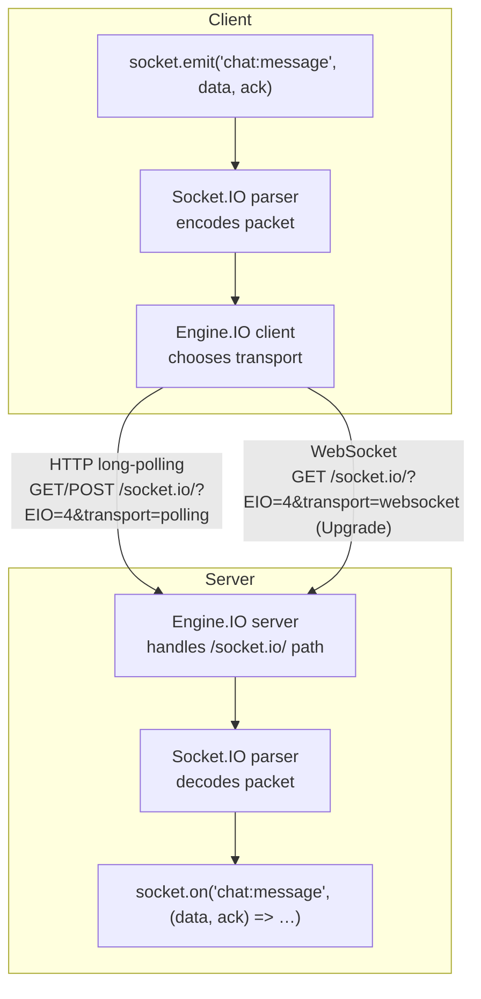
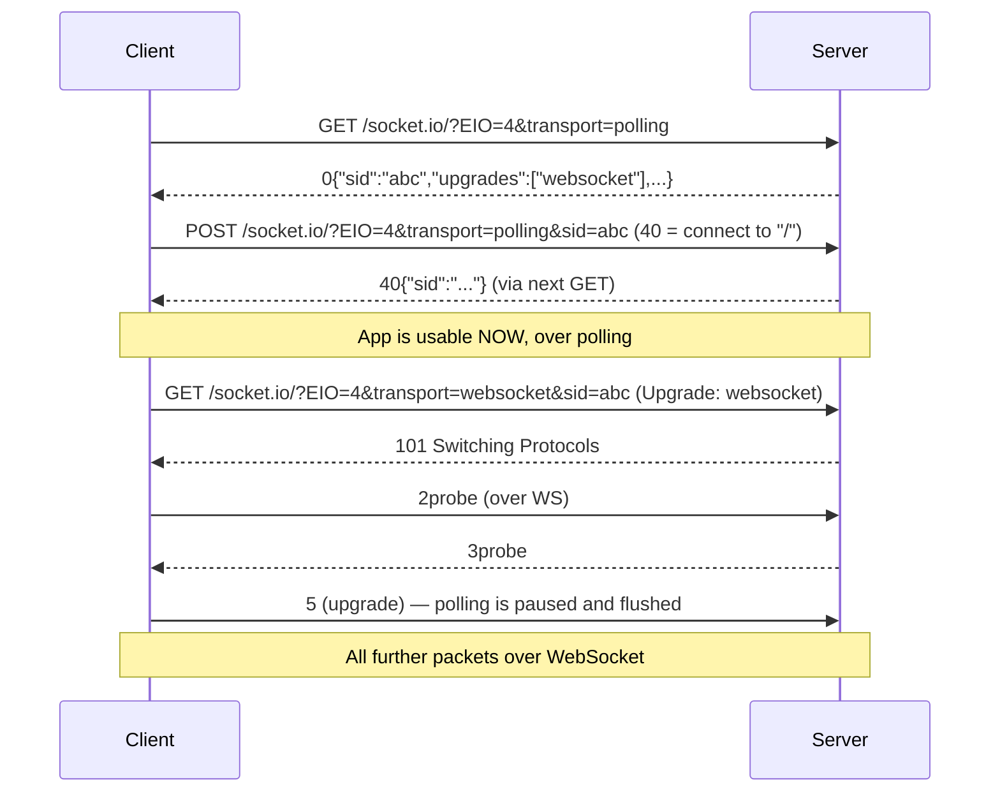
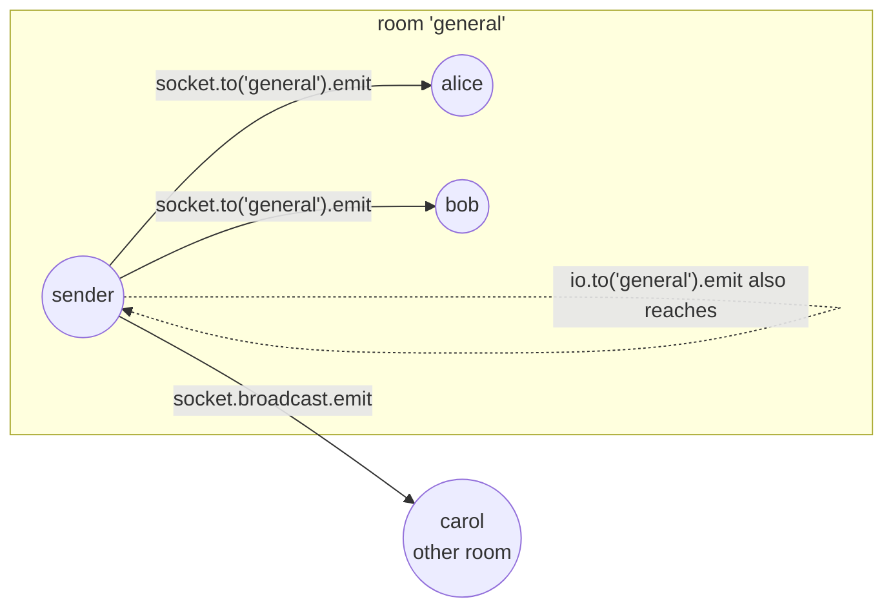
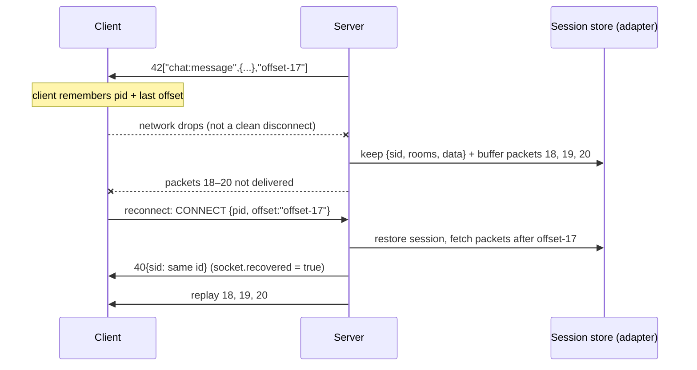
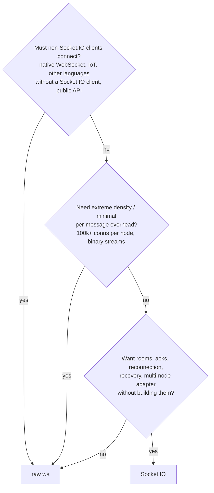

# Chapter 7 — Socket.IO: What It Adds on Top of WebSockets

**Level:** Intermediate

**What you'll learn:** Up to now you have built everything yourself on top of `ws`: heartbeats, reconnection, a message envelope with `type`/`id`/`replyTo`, rooms, acks, and replay buffers. Socket.IO is a library that ships *all of that* (and more) out of the box — but it does so with its **own protocol** that runs *over* WebSocket (or HTTP long-polling), which means a Socket.IO server is **not** a WebSocket server and a plain `new WebSocket()` cannot talk to it. In this chapter you will learn exactly what Socket.IO is on the wire (Engine.IO transports and packets), how its features — events, acknowledgements, rooms, namespaces, middleware, broadcasting, volatile emits, and connection state recovery — map onto the patterns you built by hand in chapters 4 and 5, and how to decide when to reach for Socket.IO and when raw `ws` is the better tool. You will finish with a complete Express 5 + Socket.IO chat you can copy, run, and extend.

> Prerequisites: [Chapter 3 — Express integration](./03-express-integration.md) (sharing one `http.Server`), [Chapter 4 — Messaging patterns](./04-messaging-patterns.md) (envelope, request/response, rooms), [Chapter 5 — Reliability](./05-reliability.md) (heartbeats, reconnect, replay).

> **In plain English:** If a raw WebSocket is a phone line, Socket.IO is a whole call-centre system built on top of it: named call types (events), "call me back with the answer" (acks), conference rooms, automatic redialling, and a fallback to passing notes (HTTP long-polling) when the line won't connect. It's very convenient, but it speaks its own language, so both ends must use a Socket.IO library and a plain `new WebSocket()` can't join. Almost everything it offers is a polished version of what you built by hand in chapters 4 and 5, including [namespaces](glossary.md#namespace) and a pluggable [adapter](glossary.md#adapter) for scaling.

---

## 1. Socket.IO is *not* a WebSocket implementation

This is the single most important fact in the chapter, and the source of endless Stack Overflow questions:

```js
// ❌ This will NEVER connect to a Socket.IO server
const ws = new WebSocket('ws://localhost:3000');

// ❌ Neither will this
import WebSocket from 'ws';
new WebSocket('ws://localhost:3000/socket.io/');

// ✅ You must use the Socket.IO client (browser or Node)
import { io } from 'socket.io-client';
const socket = io('http://localhost:3000');
```

Socket.IO is two layered protocols:

| Layer | Package | Responsibility |
|---|---|---|
| **Engine.IO** | `engine.io` / `engine.io-client` | The *transport* layer: opens a low-level connection using HTTP long-polling, WebSocket, or WebTransport; upgrades between them; heartbeats; framing of raw packets. |
| **Socket.IO** | `socket.io` / `socket.io-client` | The *application* layer on top: named events, acknowledgements, namespaces (multiplexing), rooms, broadcasting, binary attachments, reconnection, connection state recovery. |



Compare that to what you built in [Chapter 4](./04-messaging-patterns.md): a JSON envelope `{ type, id, payload, replyTo }` over a raw WebSocket. Socket.IO is essentially a battle-tested, standardized version of that idea — with its own envelope format — plus a transport abstraction underneath.

### 1.1 What's on the wire

Open DevTools → Network → the `websocket` request → **Messages** for a Socket.IO page and you will see frames like these:

```text
0{"sid":"lv_VI97HAXpY6yYWAAAC","upgrades":[],"pingInterval":25000,"pingTimeout":20000,"maxPayload":1000000}
40
40{"sid":"zd5AX-gYyOCjDQBRAAAO","pid":"f7Kc..."}   <- namespace connected (pid = private session id for recovery)
42["room:join","general"]            <- no ack
421["room:join","general"]           <- ack id 1 requested
431[{"ok":true,"room":"general"}]    <- ack reply for id 1
2
3
41
```

Decoding the first digits:

| Engine.IO packet type (1st digit) | Meaning |
|---|---|
| `0` open | Handshake: session id, ping settings, max payload |
| `1` close | Close the transport |
| `2` ping | Heartbeat (server → client in EIO v4) |
| `3` pong | Heartbeat reply |
| `4` message | Carries a Socket.IO packet (next digit) |
| `5` upgrade | Transport switched (e.g. polling → websocket) |
| `6` noop | Used during upgrade to flush polling |

| Socket.IO packet type (2nd digit, inside `4`) | Meaning |
|---|---|
| `0` CONNECT | Join a namespace (`40` = connect to `/`, `40/admin,` = connect to `/admin`) |
| `1` DISCONNECT | Leave a namespace |
| `2` EVENT | `42["event", ...args]` — optional ack id between `2` and `[` |
| `3` ACK | `43<id>[...args]` — the reply to an event |
| `4` CONNECT_ERROR | Middleware rejected the connection |
| `5` BINARY_EVENT | Event with binary attachments (sent as separate frames) |
| `6` BINARY_ACK | Ack with binary attachments |

So `421["room:join","general"]` reads as: *Engine.IO message (4), Socket.IO event (2), ack id 1, event name `room:join`, argument `"general"`*. That is literally the `{ type, id, payload }` envelope from chapter 4, just packed tighter.

### 1.2 The transport dance: polling first, then upgrade

By default a Socket.IO client connects with **HTTP long-polling first**, then tries to **upgrade** to WebSocket:



Why start with polling? Historically, many corporate proxies and antivirus products broke WebSocket connections silently. Polling always works where HTTP works, so the user gets a connection *immediately* and upgrades opportunistically. The cost:

- **Extra round-trips** at connect time.
- **Sticky sessions required** when you run more than one server: the polling requests (`GET`, `POST`, `GET`...) are *separate HTTP requests* that must all land on the same process that holds session `sid=abc`. You'll deal with this in [Chapter 8](./08-scaling.md).
- **CORS applies** to the polling transport (it's plain XHR/fetch), unlike a raw WebSocket upgrade — that's why Socket.IO has a `cors` option.

In 2026, almost every network supports WebSocket, so many production apps skip polling:

```js
const socket = io({ transports: ['websocket'] }); // WebSocket only, no sticky sessions needed for the transport
// or: try WebSocket first, fall back to polling if it fails
const socket = io({ transports: ['websocket', 'polling'], tryAllTransports: true });
```

---

## 2. Feature map: your hand-rolled `ws` code vs Socket.IO

| You built it by hand (ch. 4–5) | Socket.IO equivalent |
|---|---|
| JSON envelope `{type, payload}` + `switch (msg.type)` router | `socket.emit('type', ...args)` / `socket.on('type', handler)` |
| `id` + `replyTo` request/response with pending-map and timeouts | **Acknowledgements**: last argument is a callback, or `emitWithAck()` returning a Promise; `socket.timeout(ms)` |
| `Map<room, Set<ws>>` room registry, cleanup on close | `socket.join(room)`, `socket.leave(room)`, auto-leave on disconnect |
| Loop over clients, `if (c !== sender && c.readyState === OPEN) c.send()` | `socket.to(room).emit()`, `io.to(room).emit()`, `socket.broadcast.emit()`, `.except()` |
| `ping`/`pong` + `isAlive` sweep ([ch.5](./05-reliability.md)) | Built-in Engine.IO heartbeat (`pingInterval`, `pingTimeout`) |
| Exponential backoff + jitter reconnection | Built-in (`reconnectionDelay`, `reconnectionDelayMax`, `randomizationFactor`) |
| Buffering sends while offline | Built-in client-side send buffer (emits queued while disconnected) |
| Sequence numbers + replay buffer for resume | **Connection state recovery** (server-side, opt-in) |
| Separate `path`s or `type` prefixes for sub-apps | **Namespaces**: `io.of('/admin')` multiplexed over one connection |
| Auth on `upgrade` event before `handleUpgrade` ([ch.3](./03-express-integration.md)) | **Middleware**: `io.use((socket, next) => …)` with `socket.handshake.auth` |
| Redis pub/sub fan-out across nodes ([ch.8](./08-scaling.md)) | **Adapters**: `@socket.io/redis-adapter` — same API, cluster-wide |
| Binary via `ArrayBuffer` + manual framing | Binary anywhere in the args (Buffers, ArrayBuffers, Blobs) — auto-extracted |

What you *don't* get for free: per-message schema validation, authorization per event, rate limiting, and backpressure control — those are still your job (see [Chapter 6](./06-security.md)).

---

## 3. Setting up Socket.IO on Express 5

Socket.IO attaches to the **same `http.Server`** as Express, exactly like `ws` did in [Chapter 3](./03-express-integration.md). It registers a handler for requests under `/socket.io/` (both the polling HTTP requests and the WebSocket `upgrade`), and everything else falls through to Express.

```js
import http from 'node:http';
import express from 'express';
import { Server } from 'socket.io';

const app = express();
const server = http.createServer(app);  // ⚠️ NOT app.listen() — we need the server object
const io = new Server(server, { /* options */ });

server.listen(3000);
```

> **Pitfall:** `app.listen()` returns an `http.Server` too, so `const server = app.listen(3000); new Server(server)` also works. What does *not* work is `new Server(app)` — an Express app is a request handler function, not a server.

A few server options worth knowing from day one:

```js
const io = new Server(server, {
  path: '/socket.io',              // default; must match the client's `path`
  serveClient: true,               // default; serves /socket.io/socket.io(.esm).min.js
  cors: { origin: ['https://app.example.com'] }, // polling transport is subject to CORS
  maxHttpBufferSize: 1e6,          // max message size in bytes (default 1 MB) — like ws maxPayload
  pingInterval: 25000,             // heartbeat every 25 s ...
  pingTimeout: 20000,              // ... drop if no pong within 20 s
  transports: ['polling', 'websocket'], // allowed transports
  connectionStateRecovery: { /* see §9 */ },
});
```

The server automatically **serves its own browser client**. In a plain `<script type="module">` page (no bundler, per the course conventions):

```html
<script type="module">
  import { io } from '/socket.io/socket.io.esm.min.js';
  const socket = io(); // same origin, default path
</script>
```

Alternatively from a CDN: `import { io } from 'https://cdn.socket.io/4.8.1/socket.io.esm.min.js';` — but serving it from your own server guarantees the client and server versions match.

---

## 4. Events: the core API

```js
// server
io.on('connection', (socket) => {
  socket.on('chat:message', (payload) => { /* ... */ });
  socket.emit('welcome', { text: 'hi' }, 42, [1, 2, 3]); // any number of args
});

// client
socket.on('welcome', (obj, num, arr) => console.log(obj, num, arr));
socket.emit('chat:message', { room: 'general', text: 'hello' });
```

Things to internalize:

- **Arguments are serialized with JSON** (plus binary extraction). `Date` becomes a string, `Map`/`Set` become `{}`, functions are dropped (except a trailing ack callback), `undefined` in arrays becomes `null`. Send plain data.
- **Reserved event names** you must not emit yourself: `connect`, `connect_error`, `disconnect`, `disconnecting`, `newListener`, `removeListener`.
- `socket.onAny((event, ...args) => …)` catches every incoming event — perfect for logging or a generic rate limiter. `socket.onAnyOutgoing()` does the same for outgoing.
- Event names are strings; use a `domain:action` convention (`chat:message`, `room:join`) — the same one this course has used since chapter 4.

### Server-side emit cheat sheet

```js
socket.emit('e', data);                  // only this client
socket.broadcast.emit('e', data);        // everyone in the namespace except this client
socket.to('room').emit('e', data);       // everyone in room except this client
io.to('room').emit('e', data);           // everyone in room, INCLUDING the sender
io.to('a').to('b').emit('e', data);      // union of rooms a and b (each socket once)
io.except('room').emit('e', data);       // everyone except members of room
io.to(socketId).emit('e', data);         // private message: each socket is in a room named by its id
io.emit('e', data);                      // everyone on the main namespace
io.of('/admin').emit('e', data);         // everyone on /admin
socket.volatile.emit('e', data);         // may be dropped if not writable (see §8)
socket.compress(false).emit('e', data);  // per-emit compression flag
```



---

## 5. Acknowledgements: request/response built in

In [Chapter 4](./04-messaging-patterns.md) you implemented request/response by generating an `id`, storing a pending Promise in a `Map`, and resolving it when a message with a matching `replyTo` arrived — plus a timeout to avoid leaking entries. Socket.IO does exactly that internally. You pass a **function as the last argument**:

```js
// client — callback style
socket.emit('room:join', 'general', (res) => console.log(res));

// client — Promise style (v4.6+) with a timeout (strongly recommended)
try {
  const res = await socket.timeout(3000).emitWithAck('room:join', 'general');
} catch (err) {
  // no ack within 3 s
}

// server
socket.on('room:join', (room, ack) => {
  // ... do work ...
  ack({ ok: true, room });
});
```

On the wire this is `421["room:join","general"]` → `431[{"ok":true,"room":"general"}]`: the `1` is the ack id — exactly your `id`/`replyTo` pair.

It works in **both directions**. The server can ask a client something and await the answer:

```js
// server
const clientTime = await socket.timeout(2000).emitWithAck('whattime');

// client
socket.on('whattime', (ack) => ack(Date.now()));
```

You can even broadcast with acks — the callback receives an array of responses from every recipient:

```js
const responses = await io.timeout(5000).to('general').emitWithAck('poll', 'Pizza?');
```

**Ack rules:**

1. Always **validate** that the last argument is actually a function before calling it (`typeof ack === 'function'`). A malicious client can send `42["room:join","x"]` without an ack id; calling `undefined()` would throw inside your handler.
2. Always use **`timeout()`** on the side that waits. Without it, a callback for a client that disconnected (or never answers) is kept until... forever. With `timeout()`, the callback gets an error as first argument / the Promise rejects.
3. An ack is called **at most once**. It gives you *at-most-once* request/response — for at-least-once delivery you still need the retry + dedupe pattern from [Chapter 5](./05-reliability.md).

---

## 6. Rooms

A room is a **server-side only** grouping of sockets. The client has no API to join a room directly — it has to *ask* (via an event), and the server decides. That makes rooms a natural authorization boundary.

```js
socket.join('general');           // idempotent; also accepts an array
socket.leave('general');
socket.rooms;                     // Set { '<socket.id>', 'general' }
io.in('general').fetchSockets();  // Promise<RemoteSocket[]> — works across nodes with an adapter
io.in('general').socketsJoin('announcements'); // bulk operations
io.in('general').disconnectSockets();
```

Key facts:

- Every socket automatically joins a room equal to its own `socket.id`. That's how `io.to(socketId).emit()` delivers private messages.
- Rooms are **cleaned up automatically** on disconnect — no more leaked `Set`s like in a hand-rolled registry.
- Listen to `disconnecting` (not `disconnect`) if you need to know which rooms the socket was in — by the time `disconnect` fires, `socket.rooms` is empty.
- Rooms live in the **adapter** (`io.of('/').adapter.rooms` is a `Map<string, Set<string>>`). The default in-memory adapter only knows about sockets in *this* process; swap in the Redis adapter to make rooms cluster-wide ([Chapter 8](./08-scaling.md)).
- The adapter emits lifecycle events you can use for presence: `io.of('/').adapter.on('join-room', (room, id) => …)`, `leave-room`, `create-room`, `delete-room`.

---

## 7. Namespaces and middleware

### 7.1 Namespaces: multiplexing over one connection

A namespace is a separate "channel" with its own event handlers, rooms, and middleware. The default namespace is `/`.

```js
const admin = io.of('/admin');
admin.on('connection', (socket) => { /* only /admin events here */ });

// client
const main  = io();          // "/"
const adm   = io('/admin');  // "/admin" — reuses the SAME underlying Engine.IO connection
```

Both client sockets share **one** TCP/WebSocket connection (one Manager); the Socket.IO CONNECT packet (`40/admin,`) tells the server which namespace each packet belongs to. Use namespaces to separate concerns with different auth requirements (a public chat vs an admin console), not as a substitute for rooms. A rule of thumb: **namespaces are static and chosen by the client; rooms are dynamic and assigned by the server.**

Dynamic namespaces are possible with a regex or function: `io.of(/^\/team-\w+$/)` — each matching name becomes its own namespace, and `socket.nsp.name` tells you which.

### 7.2 Middleware: authentication at connect time

Middleware runs **once per connection, per namespace**, before the `connection` event. It is Socket.IO's equivalent of checking a token in the `upgrade` handler before calling `wss.handleUpgrade()` in [Chapter 3](./03-express-integration.md).

```js
io.use((socket, next) => {
  const token = socket.handshake.auth?.token;   // from io({ auth: { token } })
  try {
    socket.data.user = jwt.verify(token, SECRET); // socket.data = per-socket storage
    next();
  } catch {
    const err = new Error('unauthorized');
    err.data = { reason: 'invalid or expired token' }; // delivered to the client
    next(err);
  }
});
```

On the client:

```js
const socket = io({ auth: { token: localStorage.getItem('token') } });
// auth can also be a function, re-evaluated on every (re)connection attempt:
const socket = io({ auth: (cb) => cb({ token: getFreshToken() }) });

socket.on('connect_error', (err) => {
  console.log(err.message, err.data);    // "unauthorized", { reason: ... }
  if (!socket.active) {
    // Rejected by middleware: the client will NOT auto-retry.
    // Refresh the token, then: socket.connect()
  }
});
```

Where the credentials can come from, in order of preference:

| Source | Notes |
|---|---|
| `socket.handshake.auth` | Sent in the Socket.IO CONNECT packet, **not** in the URL — not logged by proxies. ✅ Preferred. |
| `socket.handshake.headers.cookie` | Session cookies work (same-site), check `Origin` too (CSWSH — see [Chapter 6](./06-security.md)). |
| `socket.handshake.query` | Ends up in the URL → access logs. ❌ Avoid for secrets. |
| `extraHeaders` | Only works with polling in browsers (browsers can't set WS headers). |

> **Important:** middleware authenticates the **connection**, not each event. A token that expires mid-session remains "valid" for that socket until you check it again. For per-event authorization, check `socket.data.user` inside handlers, or use `socket.use(([event, ...args], next) => …)` — a per-socket middleware that runs for every **incoming packet**.

```js
io.on('connection', (socket) => {
  socket.use(([event], next) => {
    if (event.startsWith('admin:') && !socket.data.user?.isAdmin) return next(new Error('forbidden'));
    next();
  });
  socket.on('error', (err) => socket.emit('app:error', err.message)); // errors from socket.use land here
});
```

For Express-style middleware (e.g. `express-session`, `passport`), use `io.engine.use(middleware)` — it runs on the raw HTTP request of the handshake.

---

## 8. Volatile events

A **volatile** emit may be dropped if the underlying transport isn't writable at that moment (client disconnected, polling request not open, or buffer still busy):

```js
socket.volatile.emit('cursor', { x, y });
io.volatile.emit('tick', Date.now());
```

Without `volatile`, the server-side socket buffers packets while the transport is busy — and the *client* buffers emits while disconnected, flushing them all on reconnect. That is great for chat messages and terrible for:

- cursor positions, typing indicators, "user is online" pings
- real-time game state (only the latest snapshot matters)
- periodic ticks / metrics

Buffering those means a reconnecting client gets a burst of stale data. It is the Socket.IO spelling of the "drop for slow consumers" strategy from the backpressure section of [Chapter 5](./05-reliability.md).

> **Pitfall:** the client-side send buffer is *unbounded*. If a user is offline for ten minutes typing furiously, every emit is queued. For non-critical events on the client, check `socket.connected` first or use `socket.volatile.emit()` (supported on the client since v4.6).

---

## 9. Connection state recovery

In [Chapter 5](./05-reliability.md) you implemented session resume: the server keeps a per-session buffer of sequence-numbered messages, the client reconnects with its last seen sequence number, and the server replays what was missed. Socket.IO v4.6+ has this built in:

```js
const io = new Server(server, {
  connectionStateRecovery: {
    maxDisconnectionDuration: 2 * 60 * 1000, // how long the session is kept after a disconnect
    skipMiddlewares: true,                   // don't re-run io.use() on successful recovery
  },
});

io.on('connection', (socket) => {
  if (socket.recovered) {
    // socket.id, socket.rooms, socket.data restored; missed packets are being replayed
  } else {
    // brand-new session (or recovery failed) — do full initialization
  }
});
```



How it works: every packet sent via a **broadcast** (`io.emit`, `io.to(room).emit`, `socket.to(...).emit`) gets an offset appended. The client stores its private session id (`pid`) and the last offset received. On reconnect it sends both; if the server still has the session, it restores `id`, `rooms`, and `data` and replays everything broadcast to those rooms since that offset.

Know its limits — they matter:

- **Only broadcasts are buffered.** A direct `socket.emit()` to one socket is *not* stored and will not be replayed. (If you need that, emit to `io.to(socket.id)` which is a broadcast to the private room.)
- **It only triggers on unclean disconnects** (network errors, transport close). A deliberate `socket.disconnect()` ends the session.
- **Not every adapter supports it.** The default in-memory adapter does; with multiple nodes you need the Redis *Streams* adapter (`@socket.io/redis-streams-adapter`) or the MongoDB adapter — the classic pub/sub `@socket.io/redis-adapter` does **not** store packets.
- **It's best-effort.** After `maxDisconnectionDuration`, or if the server restarts, `socket.recovered` is `false` and the client must resync from your database (e.g. "fetch messages since `lastSeenId`"). Always write that fallback path.
- The client must have received at least one broadcast (an offset) for recovery to be attempted.

---

## 10. Built-in reliability you no longer write yourself

**Heartbeats.** Engine.IO pings every `pingInterval` ms; if no pong arrives within `pingTimeout`, the connection is closed with reason `ping timeout`. This covers the half-open TCP problem from chapter 5. Keep `pingInterval` below your proxy's idle timeout (nginx `proxy_read_timeout` default: 60 s).

**Reconnection.** The client reconnects automatically with exponential backoff and jitter:

```js
io({
  reconnection: true,           // default
  reconnectionAttempts: Infinity,
  reconnectionDelay: 1000,      // initial delay
  reconnectionDelayMax: 5000,   // cap
  randomizationFactor: 0.5,     // jitter: delay * (1 ± 0.5)
});
socket.io.on('reconnect_attempt', (n) => console.log('attempt', n));
socket.io.on('reconnect', (n) => console.log('reconnected after', n));
```

Note the split: `socket` (the namespace socket) emits `connect`/`disconnect`/`connect_error`; `socket.io` (the Manager, which owns the underlying connection) emits `reconnect*` events.

**Disconnect reasons** tell you who closed what:

| Reason | Side | Auto-reconnect? |
|---|---|---|
| `io server disconnect` | server called `socket.disconnect()` | ❌ (call `socket.connect()` yourself) |
| `io client disconnect` | client called `socket.disconnect()` | ❌ |
| `ping timeout` | no heartbeat reply | ✅ |
| `transport close` | connection closed (user lost network, server restarted) | ✅ |
| `transport error` | transport error (e.g. server killed mid-request) | ✅ |
| `parse error` | invalid packet received | ✅ |

`socket.active` is `true` whenever the client will retry on its own — the easiest way to tell a temporary outage from a final one.

---

## 11. The complete example: Express 5 + Socket.IO chat

The example in `examples/07-socketio/` exercises every feature of this chapter:

- `io.use()` middleware auth using `handshake.auth.name` (validated with zod)
- `room:join` request/response with an ack, returning the member list via `fetchSockets()`
- `chat:message` validated, authorized (must be in the room) and broadcast with `io.to(room)`
- `chat:typing` via `socket.volatile.to(room)`
- a **server → client** ack (`whattime`) with `timeout().emitWithAck()`
- presence (`joined` / `left`) using `socket.to()` and the `disconnecting` event
- an `/admin` namespace with its own token middleware, a `stats` ack and an `announce` broadcast
- a volatile `tick` broadcast every 10 s
- connection state recovery with a "Simulate network drop" button
- graceful shutdown with `io.close()`

### 11.1 Walking through the server

**Step 1 — Express and Socket.IO share one HTTP server.** Express serves `public/` and a `/health` route; Socket.IO claims `/socket.io/*`. `cors` restricts the polling transport to our own origin; `maxHttpBufferSize` is the Socket.IO counterpart of `ws`'s `maxPayload`.

**Step 2 — Validation.** Socket.IO gives us the event name (our old `type`) and acks (our old `replyTo`), so zod only validates *payloads*. Room names are restricted to `[a-z0-9-]` so they can never collide with a socket id room.

**Step 3 — Namespace middleware.** `io.use()` reads `socket.handshake.auth.name`. On failure we call `next(err)` with `err.data` — the client receives a `connect_error` and `socket.active` becomes `false` (no retry loop hammering the server). On success, identity goes into `socket.data`, which survives connection state recovery and is visible to `fetchSockets()` (even across nodes with an adapter).

**Step 4 — `connection` handler.** We check `socket.recovered` and log the transport; `socket.conn.once('upgrade')` shows the polling → websocket switch.

**Step 5 — Handlers.** Each handler validates input, checks authorization (`socket.rooms.has(room)`), and replies through the ack if one was provided. Note `typeof ack === 'function'` everywhere — never trust the client to send an ack.

**Step 6 — `disconnecting`.** We announce `left` to each room while `socket.rooms` is still populated.

**Step 7 — `/admin` namespace.** Separate middleware (token check), separate events. It reads `io.of('/').adapter.rooms` and filters out private id-rooms (a room whose `Set` contains its own name is a socket's private room).

**Step 8 — Volatile ticker and graceful shutdown.** `io.close()` disconnects every socket (clients see `io server disconnect`) and closes the HTTP server.

Full `examples/07-socketio/server.js`:

```js
// Chapter 7 — Socket.IO on Express 5
// Demonstrates: events, acknowledgements, rooms, namespaces, middleware auth,
// broadcasting, volatile emits, and connection state recovery.
//
// Run:  npm run ex:07   then open http://localhost:3000 in two tabs.

import http from 'node:http';
import path from 'node:path';
import { fileURLToPath } from 'node:url';
import express from 'express';
import { Server } from 'socket.io';
import { z } from 'zod';

const __dirname = path.dirname(fileURLToPath(import.meta.url));
const PORT = Number(process.env.PORT) || 3000;
const ADMIN_TOKEN = process.env.ADMIN_TOKEN || 'let-me-in'; // demo only

const app = express();
app.use(express.static(path.join(__dirname, 'public')));
app.get('/health', (_req, res) => res.json({ ok: true, clients: io.engine.clientsCount }));

const server = http.createServer(app);

// ---------------------------------------------------------------------------
// The Socket.IO server attaches to the same http.Server as Express.
// It serves its own client bundle at /socket.io/socket.io.esm.min.js
// (serveClient: true is the default).
// ---------------------------------------------------------------------------
const io = new Server(server, {
  // Only allow the page we serve. Socket.IO's HTTP long-polling transport IS
  // subject to CORS (unlike a raw WebSocket upgrade), so this option matters.
  cors: { origin: [`http://localhost:${PORT}`, `http://127.0.0.1:${PORT}`] },
  maxHttpBufferSize: 64 * 1024, // like ws maxPayload: reject messages > 64 KiB
  pingInterval: 25_000,         // Engine.IO heartbeat (built in — no manual sweep)
  pingTimeout: 20_000,
  // Connection state recovery: after a short disconnect the client gets its
  // old socket.id, its rooms, and the packets it missed (server-side buffer).
  connectionStateRecovery: {
    maxDisconnectionDuration: 2 * 60 * 1000,
    skipMiddlewares: true, // a recovered session skips auth middleware again
  },
});

// ---------------------------------------------------------------------------
// Validation schemas (same spirit as the ch.4 envelope, but Socket.IO already
// gives us "type" (event name) and "replyTo" (acks), so we only validate payloads)
// ---------------------------------------------------------------------------
const Name = z.string().trim().min(1).max(32).regex(/^[\w\- ]+$/);
const Room = z.string().trim().min(1).max(32).regex(/^[a-z0-9\-]+$/);
const ChatMessage = z.object({ room: Room, text: z.string().trim().min(1).max(500) });

// ---------------------------------------------------------------------------
// Namespace middleware — runs once per connection, before "connection".
// Calling next(err) rejects the connection; the client receives a
// "connect_error" event with err.message and err.data.
// ---------------------------------------------------------------------------
io.use((socket, next) => {
  const parsed = Name.safeParse(socket.handshake.auth?.name);
  if (!parsed.success) {
    const err = new Error('unauthorized');
    err.data = { reason: 'handshake.auth.name must be 1–32 word characters' };
    return next(err);
  }
  socket.data.name = parsed.data; // socket.data is per-socket storage (and survives recovery)
  next();
});

io.on('connection', (socket) => {
  if (socket.recovered) {
    // Rooms, socket.id and socket.data were restored; missed events are replayed.
    console.log(`[recovered] ${socket.data.name} (${socket.id}) rooms=`, [...socket.rooms]);
  } else {
    console.log(`[connect] ${socket.data.name} (${socket.id}) via ${socket.conn.transport.name}`);
  }

  // Engine.IO starts on HTTP long-polling and upgrades to WebSocket.
  socket.conn.once('upgrade', () => {
    console.log(`[upgrade] ${socket.data.name} -> ${socket.conn.transport.name}`);
  });

  // --- Request/response with an acknowledgement callback -------------------
  socket.on('room:join', async (rawRoom, ack) => {
    if (typeof ack !== 'function') return; // defensive: clients must pass an ack
    const room = Room.safeParse(rawRoom);
    if (!room.success) return ack({ ok: false, error: 'invalid room name' });

    // Leave all previous chat rooms (every socket is also in a room named by its id)
    for (const r of socket.rooms) if (r !== socket.id) socket.leave(r);
    socket.join(room.data);

    const members = (await io.in(room.data).fetchSockets()).map((s) => s.data.name);
    // Broadcast to everyone in the room EXCEPT the sender
    socket.to(room.data).emit('room:presence', { room: room.data, event: 'joined', name: socket.data.name });
    ack({ ok: true, room: room.data, members });
  });

  // --- Chat message: validate, broadcast to room INCLUDING the sender -------
  socket.on('chat:message', (raw, ack) => {
    const msg = ChatMessage.safeParse(raw);
    const reply = typeof ack === 'function' ? ack : () => {};
    if (!msg.success) return reply({ ok: false, error: 'invalid message' });
    if (!socket.rooms.has(msg.data.room)) return reply({ ok: false, error: 'not in room' });

    const out = { id: crypto.randomUUID(), room: msg.data.room, from: socket.data.name, text: msg.data.text, ts: Date.now() };
    io.to(msg.data.room).emit('chat:message', out);
    reply({ ok: true, id: out.id });
  });

  // --- Typing indicator: volatile = OK to drop if the client isn't ready ----
  socket.on('chat:typing', (rawRoom) => {
    const room = Room.safeParse(rawRoom);
    if (!room.success || !socket.rooms.has(room.data)) return;
    socket.volatile.to(room.data).emit('chat:typing', { name: socket.data.name });
  });

  // --- Server-initiated request with an ack and a timeout --------------------
  socket.on('ping:server', async (ack) => {
    try {
      // Ask the client something and wait (max 2 s) for its ack.
      const clientTime = await socket.timeout(2000).emitWithAck('whattime');
      if (typeof ack === 'function') ack({ serverTime: Date.now(), clientTime });
    } catch {
      if (typeof ack === 'function') ack({ error: 'client did not answer in time' });
    }
  });

  // "disconnecting" fires while socket.rooms is still populated.
  socket.on('disconnecting', (reason) => {
    for (const r of socket.rooms) {
      if (r !== socket.id) socket.to(r).emit('room:presence', { room: r, event: 'left', name: socket.data.name });
    }
    console.log(`[disconnect] ${socket.data.name}: ${reason}`);
  });
});

// ---------------------------------------------------------------------------
// A second namespace: /admin — separate middleware, separate event space,
// multiplexed over the SAME underlying connection as "/".
// ---------------------------------------------------------------------------
const admin = io.of('/admin');
admin.use((socket, next) => {
  if (socket.handshake.auth?.token === ADMIN_TOKEN) return next();
  next(new Error('forbidden'));
});
admin.on('connection', (socket) => {
  socket.on('stats', (ack) => {
    const rooms = {};
    // io.of('/').adapter.rooms: Map<room, Set<socketId>> (includes private id-rooms)
    for (const [room, ids] of io.of('/').adapter.rooms) {
      if (!ids.has(room)) rooms[room] = ids.size; // skip each socket's own id-room
    }
    ack({ clients: io.engine.clientsCount, rooms });
  });
  socket.on('announce', (text) => {
    if (typeof text === 'string' && text.length <= 200) io.of('/').emit('system', { text });
  });
});

// Every 10 s broadcast server time to everyone on "/" as volatile — a missed
// tick doesn't matter, so don't buffer it for disconnected/slow clients.
const ticker = setInterval(() => io.volatile.emit('tick', Date.now()), 10_000);

server.listen(PORT, () => console.log(`Socket.IO demo on http://localhost:${PORT}`));

// Graceful shutdown: io.close() disconnects all sockets and closes the http server.
for (const sig of ['SIGINT', 'SIGTERM']) {
  process.on(sig, () => {
    clearInterval(ticker);
    io.close(() => process.exit(0));
    setTimeout(() => process.exit(1), 3000).unref();
  });
}
```

### 11.2 Walking through the client

**Step 1 — Import.** The ESM build is served by the Socket.IO server at `/socket.io/socket.io.esm.min.js` — no bundler, no CDN, guaranteed version match.

**Step 2 — Connect with `auth`.** `io({ auth: { name } })` connects to the page's own origin. The `auth` object travels in the CONNECT packet.

**Step 3 — Lifecycle events.** `connect` checks `socket.recovered`; if the session was *not* recovered we rejoin our room ourselves (the server-side state is gone). `connect_error` + `socket.active` distinguishes "server rejected me" from "server unreachable, retrying". `socket.io.engine.transport.name` shows `polling` then `websocket`.

**Step 4 — Acks as Promises.** `socket.timeout(3000).emitWithAck(...)` for `room:join` and `chat:message`; a plain `emitWithAck` for `ping:server`, which itself triggers a server → client ack (`whattime`).

**Step 5 — Simulating a network failure.** `socket.io.engine.close()` closes the transport *without* telling Socket.IO it was intentional — the client sees `transport close`, reconnects, and the server restores the session. Messages broadcast to the room meanwhile are replayed. Compare with the **Disconnect** button (`socket.disconnect()`), which ends the session for good.

Full `examples/07-socketio/public/index.html`:

```html
<!doctype html>
<html lang="en">
<head>
  <meta charset="utf-8" />
  <meta name="viewport" content="width=device-width, initial-scale=1" />
  <title>Ch.7 — Socket.IO chat</title>
  <style>
    body { font: 15px/1.4 system-ui, sans-serif; max-width: 760px; margin: 2rem auto; padding: 0 1rem; }
    fieldset { margin-bottom: 1rem; }
    #log { border: 1px solid #ccc; height: 320px; overflow-y: auto; padding: .5rem; background: #fafafa; }
    #log div { margin: 2px 0; }
    .sys { color: #777; font-style: italic; }
    .err { color: #b00; }
    #status { font-weight: bold; }
    #typing { height: 1.2em; color: #777; font-size: 13px; }
    input { padding: 4px 6px; }
  </style>
</head>
<body>
  <h1>Socket.IO chat (chapter 7)</h1>
  <p>Status: <span id="status">disconnected</span> · transport: <span id="transport">–</span> · id: <code id="sid">–</code></p>

  <fieldset>
    <legend>1. Connect (middleware auth)</legend>
    <input id="name" placeholder="your name" value="" />
    <button id="connect">Connect</button>
    <button id="drop" title="Close the underlying transport to test connection state recovery">Simulate network drop</button>
    <button id="disconnect">Disconnect</button>
  </fieldset>

  <fieldset>
    <legend>2. Join a room (ack)</legend>
    <input id="room" value="general" />
    <button id="join">Join</button>
    <button id="ping">Ping server (server→client ack)</button>
  </fieldset>

  <div id="log"></div>
  <div id="typing"></div>
  <form id="form">
    <input id="text" placeholder="message" autocomplete="off" style="width:70%" />
    <button>Send</button>
  </form>

  <script type="module">
    // The server serves the ESM client build automatically.
    import { io } from '/socket.io/socket.io.esm.min.js';

    const $ = (id) => document.getElementById(id);
    const log = (text, cls = '') => {
      const d = document.createElement('div');
      d.textContent = text; d.className = cls;
      $('log').append(d); $('log').scrollTop = $('log').scrollHeight;
    };
    $('name').value = 'user-' + Math.floor(Math.random() * 1000);

    let socket = null;
    let currentRoom = null;

    $('connect').onclick = () => {
      if (socket) socket.disconnect();
      socket = io({
        auth: { name: $('name').value },   // read by io.use() on the server
        // transports: ['websocket'],       // uncomment to skip long-polling
      });

      socket.on('connect', () => {
        $('status').textContent = 'connected';
        $('sid').textContent = socket.id;
        $('transport').textContent = socket.io.engine.transport.name;
        socket.io.engine.once('upgrade', (t) => ($('transport').textContent = t.name));
        log(socket.recovered
          ? 'Reconnected — session RECOVERED (rooms + missed messages restored)'
          : 'Connected (new session)', 'sys');
        // If the session was NOT recovered, rejoin the room ourselves.
        if (!socket.recovered && currentRoom) join(currentRoom);
      });

      socket.on('connect_error', (err) => {
        log(`connect_error: ${err.message} ${err.data ? JSON.stringify(err.data) : ''}`, 'err');
        // A middleware rejection is NOT auto-retried: socket.active === false.
        if (!socket.active) $('status').textContent = 'rejected';
      });

      socket.on('disconnect', (reason) => {
        $('status').textContent = socket.active ? 'reconnecting…' : 'disconnected';
        log(`disconnect: ${reason}`, 'sys');
      });

      socket.on('chat:message', (m) => log(`[${m.room}] ${m.from}: ${m.text}`));
      socket.on('room:presence', (p) => log(`${p.name} ${p.event} ${p.room}`, 'sys'));
      socket.on('system', (p) => log(`SYSTEM: ${p.text}`, 'sys'));
      socket.on('tick', (t) => console.debug('tick', new Date(t).toISOString()));

      // Server asks us something and awaits our ack
      socket.on('whattime', (ack) => ack(Date.now()));

      let typingTimer;
      socket.on('chat:typing', ({ name }) => {
        $('typing').textContent = `${name} is typing…`;
        clearTimeout(typingTimer);
        typingTimer = setTimeout(() => ($('typing').textContent = ''), 1500);
      });
    };

    async function join(room) {
      try {
        // emitWithAck + timeout: Promise-based request/response
        const res = await socket.timeout(3000).emitWithAck('room:join', room);
        if (!res.ok) return log(`join failed: ${res.error}`, 'err');
        currentRoom = res.room;
        log(`joined ${res.room}; members: ${res.members.join(', ')}`, 'sys');
      } catch {
        log('join timed out', 'err');
      }
    }

    $('join').onclick = () => socket && join($('room').value);

    $('ping').onclick = async () => {
      if (!socket) return;
      const t0 = performance.now();
      const res = await socket.emitWithAck('ping:server');
      log(`ping: ${Math.round(performance.now() - t0)} ms round-trip; ${JSON.stringify(res)}`, 'sys');
    };

    $('form').onsubmit = async (e) => {
      e.preventDefault();
      if (!socket || !currentRoom || !$('text').value) return;
      const text = $('text').value; $('text').value = '';
      // If disconnected, Socket.IO BUFFERS this emit and sends it on reconnect.
      const res = await socket.timeout(5000).emitWithAck('chat:message', { room: currentRoom, text }).catch(() => ({ ok: false, error: 'timeout' }));
      if (!res.ok) log(`send failed: ${res.error}`, 'err');
    };

    $('text').oninput = () => socket?.connected && currentRoom && socket.emit('chat:typing', currentRoom);

    // Closing the engine (not calling socket.disconnect()) looks like a network
    // failure, so the client auto-reconnects and the server can recover state.
    $('drop').onclick = () => socket?.io.engine.close();
    $('disconnect').onclick = () => socket?.disconnect();
  </script>
</body>
</html>
```

### 11.3 Run it

```bash
npm run ex:07
# open http://localhost:3000 in two browser tabs
```

1. Connect both tabs (different names), join `general`, chat. Watch the transport go `polling → websocket`.
2. Clear the name field and click **Connect** → `connect_error: unauthorized` and no retry.
3. In tab A click **Simulate network drop**, then quickly send a message from tab B. Tab A reconnects with the *same* id, logs "session RECOVERED", and shows the message it missed.
4. Open DevTools → Network → WS → the `/socket.io/?EIO=4&transport=websocket` request → Messages, and decode the `42…`, `43…`, `2`/`3` frames using the tables in §1.1.
5. Try the admin namespace from the DevTools console:

```js
const { io } = await import('/socket.io/socket.io.esm.min.js');
const admin = io('/admin', { auth: { token: 'let-me-in' } });
console.log(await admin.emitWithAck('stats'));
admin.emit('announce', 'Maintenance in 5 minutes');
```

### 11.4 A Node.js client (for scripts and tests)

The same API works in Node with `socket.io-client` (already in the root `package.json`):

```js
import { io } from 'socket.io-client';

const socket = io('http://localhost:3000', { auth: { name: 'bot' }, transports: ['websocket'] });
socket.on('whattime', (ack) => ack(Date.now()));
socket.on('chat:message', (m) => console.log(`[${m.room}] ${m.from}: ${m.text}`));

socket.on('connect', async () => {
  const joined = await socket.timeout(3000).emitWithAck('room:join', 'general');
  console.log('members:', joined.members);
  await socket.emitWithAck('chat:message', { room: 'general', text: 'beep boop' });
});
```

You'll use exactly this pattern to write automated tests in [Chapter 9](./09-testing-debugging.md).

---

## 12. Socket.IO or raw `ws`? Choosing deliberately



| Choose **Socket.IO** when… | Choose **raw `ws`** when… |
|---|---|
| You control both client and server (browser app + Node) | You expose a public/standard WebSocket API (any client, any language) |
| You want rooms, acks, reconnection, recovery *today* | You need a specific subprotocol (GraphQL-WS, STOMP, MQTT-over-WS, JSON-RPC) |
| Clients may be behind networks that block WebSocket | You need maximum performance, minimal memory per connection |
| You'll scale out and want a drop-in adapter (Redis, Postgres, Mongo…) | You want full control of framing, backpressure, and the protocol |
| Team velocity matters more than protocol purity | You're talking to hardware / other servers that speak plain WS |

Costs of Socket.IO to keep in mind: a bigger client (~14 KB min+gzip vs 0 for native `WebSocket`), a few bytes of overhead per packet, vendor lock-in to its protocol (both ends must use Socket.IO libraries — ports exist for Java, Swift, Python, Go, C++, Rust...), and sticky sessions if you keep polling enabled.

Many large systems use **both**: Socket.IO for the browser app, raw WebSocket for a public streaming API. In this course's capstone (Huddle) we use raw `ws` with our own envelope so you see every moving part — but everything you learn maps 1:1 onto Socket.IO.

---

## Common pitfalls

1. **Connecting with `new WebSocket()` to a Socket.IO server.** It will fail (or connect to `/socket.io/` and then get closed). Use the Socket.IO client on both sides.
2. **Client/server major version mismatch.** Socket.IO v2 clients cannot talk to v3/v4 servers (EIO protocol v3 vs v4). Serve the client from your server (`/socket.io/socket.io.esm.min.js`) to stay in sync. `allowEIO3: true` exists for migrations only.
3. **CORS errors.** They come from the **polling** transport. Configure `cors: { origin: [...] }` (never `origin: '*'` together with `credentials: true`), or use `transports: ['websocket']`. Remember CORS does not protect WebSocket upgrades — you still need an Origin check or token auth ([Chapter 6](./06-security.md)).
4. **Multiple nodes without sticky sessions** → `400 Bad Request` / "Session ID unknown" errors, endless reconnect loops. Enable sticky sessions or disable polling ([Chapter 8](./08-scaling.md)).
5. **Registering handlers outside `connection`** or registering `socket.on(...)` inside another event handler, so every call adds another listener (memory leak and duplicate processing). Register per-socket handlers once, at the top of `connection`. On the client, register handlers once — not inside `connect`, which fires again on every reconnect.
6. **Calling an ack that doesn't exist**, or never calling it. Check `typeof ack === 'function'`; always reply (success or error); always wait with `timeout()`.
7. **Expecting `socket.rooms` in `disconnect`.** It's already empty — use `disconnecting`.
8. **Trusting the client for identity per event** (`socket.on('msg', ({ userId, text }) => …)`). Identity comes from `socket.data` set by the middleware, never from the payload.
9. **Relying on connection state recovery as your persistence layer.** It is best-effort, in-memory (by default), broadcasts-only, and time-limited. Store messages in a database and let clients resync.
10. **Using `socket.handshake.query` for tokens** — ends up in URLs and access logs. Use `auth`.
11. **Assuming `io.emit()` inside a namespace handler targets that namespace.** `io.emit` is the main namespace `/`. Use `socket.nsp.emit()` or `io.of('/admin').emit()`.
12. **Unbounded client-side buffering** of high-frequency events during outages → a flood on reconnect. Use `volatile` for ephemeral events.

---

## Exercises

1. **Private messages.** Add a `dm:send` event `{ to: name, text }`. Look up the target via `io.fetchSockets()` and `socket.data.name`, deliver with `io.to(target.id).emit('dm:message', …)`, and ack `{ ok:false, error:'offline' }` when the user isn't connected. Why does emitting to `io.to(id)` (instead of `target.emit`) matter for connection state recovery?
2. **Per-socket rate limiting.** Use `socket.use()` to implement a token bucket (from [Chapter 6](./06-security.md)): 10 events burst, 2/s refill. When exceeded, reject with `next(new Error('rate_limited'))` and surface it on the client via the `error` event → a UI message.
3. **JWT auth with refresh.** Replace the `name` auth with a JWT (`jsonwebtoken`) issued by `POST /api/login`. Use the function form `auth: (cb) => …` on the client so every reconnection attempt fetches a fresh token. What happens with `skipMiddlewares: true` when a recovered session's token has since expired? Decide whether you accept that.
4. **Resync fallback.** Keep the last 100 messages per room in memory on the server with increasing ids. When `socket.recovered === false` on reconnect, have the client call `room:history` with its last seen id and render only the missing messages. (This is the [Chapter 5](./05-reliability.md) replay buffer, applied where recovery gives up.)
5. **Protocol spelunking.** Using only DevTools, capture the frames for: a join with ack, a volatile typing event, a server-initiated `whattime` ack, and a heartbeat. Write down each frame and decode it field by field. Then force `transports: ['polling']` and observe the same events as HTTP requests in the Network tab.

<details>
<summary>Hints</summary>

- Ex. 1: `const target = (await io.fetchSockets()).find(s => s.data.name === to)`. Only broadcasts get recovery offsets — `io.to(id)` is a broadcast to the private room.
- Ex. 2: store `{ tokens, last }` in a closure inside `connection`; refill `tokens = Math.min(cap, tokens + (now - last) / 1000 * rate)`. Errors passed to `next()` in `socket.use()` are emitted as the server-side socket's `error` event — forward them to the client with `socket.emit`.
- Ex. 3: with `skipMiddlewares: true`, `io.use()` does not run on recovery, so an expired token keeps working. Either set it to `false` or store `exp` in `socket.data` and check it in a `socket.use()` middleware.
- Ex. 4: return `history.filter(m => m.seq > lastSeen)` in the ack; dedupe on the client by `id` in case recovery and history overlap.
- Ex. 5: a volatile event looks identical on the wire (`42[...]`) — "volatile" is a server-side decision about *whether* to write, not a packet flag.

</details>

---

## Check your understanding

1. A teammate's browser code does `new WebSocket('ws://localhost:3000/socket.io/?EIO=4&transport=websocket')` against your Socket.IO server and then sends `JSON.stringify({ type: 'chat:message', text: 'hi' })`. Why does this not work?

<details><summary>Answer</summary>

Socket.IO is **not** a WebSocket server. It is its own protocol (Engine.IO packets carrying Socket.IO packets) that happens to run *over* WebSocket or HTTP long-polling. A plain WebSocket might get as far as the transport, but it doesn't speak the handshake or the `4`/`42[...]` packet format, so the server closes it or ignores it. Use `socket.io-client` on the other end, or use raw `ws` on the server if you need plain-WebSocket clients. See §1 and pitfall 1.

</details>

2. Decode these two frames from DevTools: `421["room:join","general"]` and `431[{"ok":true}]`.

<details><summary>Answer</summary>

`4` = Engine.IO *message*; `2` = Socket.IO *EVENT*; `1` = ack id 1; then the event name `room:join` with argument `"general"`. The reply `431[...]` is: Engine.IO message (`4`), Socket.IO *ACK* (`3`), for ack id `1`, with argument `{ ok: true }`. It is the `id`/`replyTo` pair from Chapter 4, packed tighter. See §1.1 and §5.

</details>

3. Spot the problems in this acknowledgement code:

   ```js
   // server
   socket.on('room:join', (room, ack) => {
     socket.join(room);
     ack({ ok: true });
   });
   // client
   const res = await socket.emitWithAck('room:join', 'general');
   ```

<details><summary>Answer</summary>

- **Server:** it calls `ack` without checking `typeof ack === 'function'`. A malicious client can send the event without an ack id, and `undefined()` throws in your handler. It also joins **any** room name without validation or authorization, and rooms are your authorization boundary.
- **Client:** there's no `timeout()`. If the server never answers (or the connection drops), the promise can wait forever. Use `await socket.timeout(3000).emitWithAck(...)` inside `try/catch`.

See §5, "Ack rules", and §6.

</details>

4. You're adding an admin console with a different login requirement, plus one chat channel per project. Which should be a **namespace** and which a **room**, and why?

<details><summary>Answer</summary>

The admin console should be a **namespace** (`io.of('/admin')`). Namespaces are static, chosen by the client, and each has its own middleware, so it can have its own auth, while still sharing the same underlying connection. Per-project channels should be **rooms**. Rooms are dynamic and assigned by the server (the client can only *ask* to join), which makes them the right place for authorization. Rule of thumb: *namespaces are static and client-chosen; rooms are dynamic and server-assigned*. See §7.1 and §6.

</details>

5. Connection state recovery is enabled. During a 10-second network drop the server sends one user a private notice with `socket.emit('notice', …)` and broadcasts `io.to('general').emit('chat:message', …)`. After the client reconnects, which of these does it receive, and when would it receive **neither**?

<details><summary>Answer</summary>

Only the **broadcast** to `general` is replayed. Recovery buffers only broadcasts, which get offsets. A direct `socket.emit()` is not stored (send it as `io.to(socket.id).emit(...)` if it must survive). The client gets **neither** if recovery fails: the drop lasted longer than `maxDisconnectionDuration`, the server restarted, the disconnect was deliberate (`socket.disconnect()`), the adapter doesn't support recovery, or the client had not yet received any broadcast offset. Then `socket.recovered === false` and you need a resync-from-database path. See §9.

</details>

---

## Key takeaways

- **Socket.IO is a protocol on top of transports**, not a WebSocket library: Engine.IO (polling / WebSocket / WebTransport, heartbeats, upgrade) + Socket.IO (events, acks, namespaces, rooms). Native `WebSocket` clients can't connect to it.
- Its features are production-grade versions of what you built by hand: **events** = typed envelope, **acks** = `id`/`replyTo` request/response, **rooms** = server-side groups, **reconnection + heartbeats** built in, **connection state recovery** = replay buffer.
- **Middleware** (`io.use`) authenticates the *connection*; you still authorize every *event*, validate every payload, and rate-limit.
- **Rooms are server-controlled**, namespaces are client-chosen; both live in the adapter, which you swap for Redis to scale out.
- Use **`volatile`** for ephemeral data and **`timeout()` + `emitWithAck()`** for every request/response.
- Connection state recovery is **best-effort** — always have a resync-from-database path.
- Polling fallback implies **CORS config** and **sticky sessions**; `transports: ['websocket']` removes both at the cost of the fallback.
- Pick Socket.IO for velocity when you own both ends; pick raw `ws` for open protocols, interop, and maximum efficiency.

---

Next → [Chapter 8 — Scaling WebSockets horizontally](./08-scaling.md)
