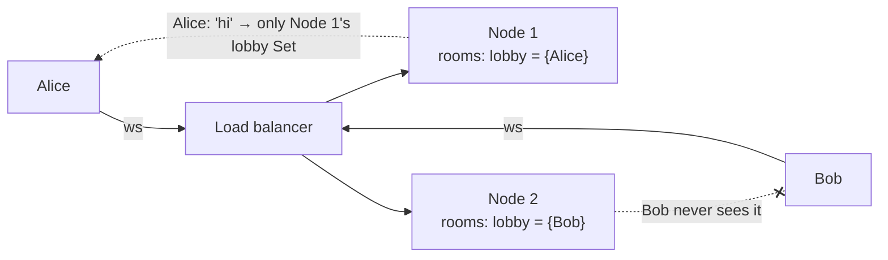
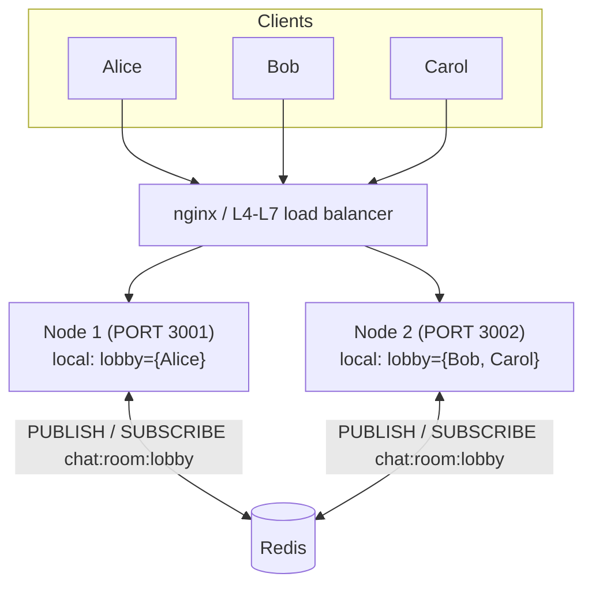
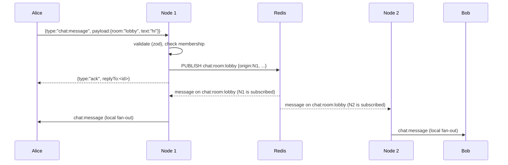
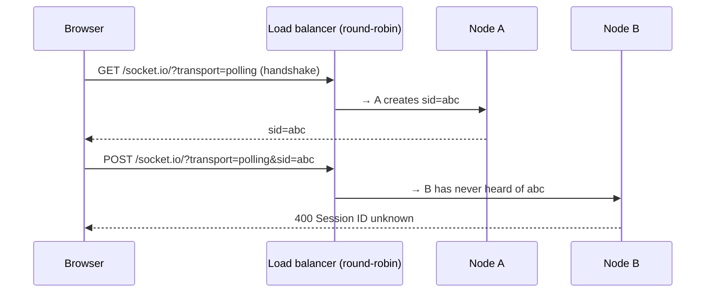

# Chapter 8 — Scaling WebSockets Horizontally

**Level:** Expert

**What you'll learn:** Why a single Node.js process eventually stops being enough, what a WebSocket connection *actually* costs (memory, file descriptors, ports, CPU per fan-out), and why "just add another server" breaks real-time apps: clients in the same room end up on different machines. You'll fix that with a **Redis pub/sub backplane** for raw `ws` (built from scratch, with cross-node presence), see the one-liner equivalent for Socket.IO (`@socket.io/redis-adapter`), learn when **sticky sessions** are mandatory and when they are not, write a correct **nginx** WebSocket proxy config, use `node:cluster`, tune the Linux kernel for hundreds of thousands of sockets, and load-test the whole thing with k6, Artillery and a custom flood script. Everything is shown in full in this chapter; the same files live in [`examples/08-scaling-redis/`](../examples/08-scaling-redis/).

> Prerequisites: the `noServer` + `upgrade` pattern from [Chapter 3](03-express-integration.md), the `{type,id,payload,replyTo}` envelope and rooms from [Chapter 4](04-messaging-patterns.md), heartbeats / backoff / graceful shutdown from [Chapter 5](05-reliability.md), and Socket.IO basics from [Chapter 7](07-socketio.md).

---

## 1. Why one process is not enough

A Node.js process is one event loop on one CPU core. For WebSockets that is surprisingly far — a well-written `ws` server can hold **tens of thousands to a few hundred thousand idle connections** in a single process. Idle connections are cheap. What limits you is usually one of these:

| Limit | What it is | Typical symptom |
|---|---|---|
| **CPU (one core)** | JSON parse/stringify, zod validation, `send()` loops during fan-out, TLS encryption | event-loop lag climbs, heartbeats time out, *everyone* gets disconnected at once |
| **Memory** | per-socket buffers + your per-connection state | RSS grows linearly; GC pauses get long; OOM kill |
| **File descriptors** | every TCP socket is an fd | `EMFILE: too many open files` on accept |
| **Availability** | one process = one point of failure; every deploy disconnects everybody | reconnect storms at each release |
| **Network / NIC** | bytes/sec on one box | send buffers fill up, `bufferedAmount` grows |

Even if a single process could hold all your users, you still want **at least two** for zero-downtime deploys and fault tolerance. So sooner or later you are running N processes, and that is where the real problem starts.

### The C10K problem, briefly

In 1999 Dan Kegel asked how to serve 10,000 concurrent clients on one machine. The answer — non-blocking sockets plus an event notification API (`epoll` on Linux, `kqueue` on BSD/macOS) instead of one thread per connection — is exactly what libuv gives Node. So Node "solved" C10K by design; today's question is C1M (a million), which is about kernel tuning, memory per connection and fan-out cost rather than the programming model.

### What does one connection cost?

Rough, order-of-magnitude numbers for `ws@8` on Node 24 (measure your own — see §9):

```
Kernel (per TCP socket)
  socket struct + TCP control block      ~ 2–4 KB
  receive/send buffers (tcp_rmem/wmem)   ~ 4 KB min, grows under load (default up to MBs!)
Node / ws (per connection)
  net.Socket + WebSocket objects          ~ 5–15 KB
  permessage-deflate zlib context         ~ 300 KB+ (!) when enabled   <- disable at scale
Your code
  user object, room Sets, timers          ~ whatever you store
---------------------------------------------------------------
Idle, compression off:                    ~ 10–30 KB  -> 100k conns ≈ 1–3 GB
```

Two lessons:

1. **Turn off `perMessageDeflate`** (or configure it tightly) when you have many connections. Each compressed connection keeps a zlib context alive; memory explodes, and compression is CPU on your single core. (It is also a DoS vector — see [Chapter 6](06-security.md).)
2. **Fan-out, not connection count, is usually the CPU killer.** A message to a 10,000-member room is 10,000 `send()` calls. Serialize once (`JSON.stringify` outside the loop), send the same string/Buffer to every socket.

```js
// BAD: stringify per recipient — O(members) JSON work
for (const ws of room) ws.send(JSON.stringify(msg));

// GOOD: stringify once — ws reuses the same data for each frame
const data = JSON.stringify(msg);
for (const ws of room) ws.send(data);
```

---

## 2. The horizontal scaling problem

In chapter 4 a room was a `Map<string, Set<WebSocket>>` in memory. That works perfectly — as long as there is exactly one process. Put two processes behind a load balancer and this happens:



Each process only knows about **its own** sockets. A WebSocket is a TCP connection terminated on one specific machine — Node 1 physically *cannot* write to Bob's socket; only Node 2 can. So we need a way for Node 1 to say "anyone holding members of `lobby`, please deliver this", which is exactly what a **message bus / backplane** does.

Options for the backplane:

| Backplane | Good for | Notes |
|---|---|---|
| **Redis pub/sub** | most apps; simplest | fire-and-forget, at-most-once; no persistence; very fast |
| **Redis Streams** | need replay / at-least-once between nodes | consumer groups, `XADD`/`XREAD`, trimming |
| **NATS** | very high fan-out, many subjects | subject wildcards, JetStream for persistence |
| **Kafka** | event sourcing, analytics, huge throughput | heavy; partitions not ideal for millions of tiny rooms |
| **Postgres LISTEN/NOTIFY** | you already have Postgres, low volume | 8 KB payload limit, all nodes get all notifications |

We'll use Redis pub/sub. The architecture:



And the flow of a single message:



Key design decisions (all implemented below):

1. **Every node keeps only its own sockets in memory.** No node ever tries to track remote sockets.
2. **One Redis channel per room** (`chat:room:<name>`). A node `SUBSCRIBE`s only while it has ≥ 1 local member in that room, and `UNSUBSCRIBE`s when the last one leaves. Redis then only sends a node the rooms it cares about. (Alternative: one global channel that every node receives in full — simpler, but every node processes every message; fine for small apps, wasteful at scale.)
3. **All delivery goes through Redis — even to local recipients.** The publishing node does *not* deliver locally first; it waits for its own subscription to echo the message back. That costs ~0.1–1 ms, but gives one single code path and the **same ordering on every node** (Redis delivers messages on one channel in the order it received them). If you deliver locally first and remotely via Redis, local and remote users can observe different orders.
4. **Two Redis connections.** A connection that has issued `SUBSCRIBE` enters *subscriber mode* and can only run (P)SUBSCRIBE / (P)UNSUBSCRIBE / PING / QUIT. So we `duplicate()` one for subscriptions and keep one for normal commands and `PUBLISH`.
5. **Presence in Redis, with node liveness.** Room membership for "who's here" is a Redis SET per room. If a node crashes (kill -9, OOM) it never cleans up its entries, so each member string includes the node id, and each node refreshes a `chat:node:<id>` key with a 15 s TTL. When listing, entries of dead nodes are filtered out and lazily deleted.

> **Pub/sub is at-most-once.** If a node is disconnected from Redis for a moment, messages published during that gap are simply gone for that node's clients. Combine with the sequence numbers + replay buffer from [Chapter 5](05-reliability.md) (store the buffer in Redis — e.g. a capped list or a Stream per room) if you need gap-free delivery across nodes.

---

## 3. Building it: the raw `ws` + Redis server, step by step

The complete file is at the end of this section; first, the important parts.

### 3.1 Configuration and Redis connections

```js
const PORT = Number(process.env.PORT ?? 3000);
const REDIS_URL = process.env.REDIS_URL ?? 'redis://127.0.0.1:6379';
const NODE_ID = process.env.NODE_ID ?? `${os.hostname()}:${PORT}:${randomUUID().slice(0, 6)}`;

const pub = new Redis(REDIS_URL, { lazyConnect: false, maxRetriesPerRequest: 3 });
const sub = pub.duplicate();
```

- `NODE_ID` identifies this process. It's added to every published event (`origin`) and to presence entries, and it's shown to the browser so you can *see* which node you landed on.
- `pub.duplicate()` creates a second connection with identical options. `ioredis` automatically reconnects both and — importantly — **re-subscribes** the `sub` connection's channels after a reconnect.
- `maxRetriesPerRequest: 3` makes commands fail fast while Redis is down instead of queuing forever (so a WebSocket handler awaiting `publish` gets an error it can report).

### 3.2 Publish and receive

```js
async function publishToRoom(room, type, payload) {
  await pub.publish(roomChannel(room), JSON.stringify({ origin: NODE_ID, type, payload }));
}

sub.on('message', (channel, raw) => {
  const room = channel.slice('chat:room:'.length);
  const members = localRooms.get(room);
  if (!members) return;
  const evt = JSON.parse(raw);
  const data = JSON.stringify({ type: evt.type, id: randomUUID(), payload: { ...evt.payload, via: evt.origin } });
  for (const ws of members) {
    if (ws.readyState === ws.OPEN && ws.bufferedAmount < 1 << 20) ws.send(data);
  }
});
```

- The Redis payload is an *internal* event (`origin`, `type`, `payload`), not the client envelope. Each node wraps it into our standard `{type,id,payload}` envelope for its own clients. Keeping the bus format separate lets you evolve either side independently.
- `via` is added purely for teaching: the browser shows which node relayed each message.
- Serialize once, send many. Skip clients whose `bufferedAmount` exceeds 1 MiB — a slow consumer must never be allowed to grow memory without bound ([Chapter 5](05-reliability.md), backpressure).

### 3.3 Lazy subscribe / unsubscribe

```js
async function joinRoom(ws, room) {
  let members = localRooms.get(room);
  if (!members) {
    members = new Set();
    localRooms.set(room, members);
    await sub.subscribe(roomChannel(room));  // first local member
  }
  members.add(ws);
  ws.rooms.add(room);
  await pub.sadd(presenceKey(room), memberId(ws));
}
```

Notice the `Set` is created *before* awaiting `subscribe`. If two clients join the same room at the same instant, the second sees the existing Set and doesn't subscribe twice. (Redis would tolerate a duplicate SUBSCRIBE, but a duplicate *UNSUBSCRIBE* race in `leaveRoom` could cut off a room that still has members — keep state transitions synchronous and only `await` the side effects.)

There is one unavoidable race: a message published between "Set created" and "SUBSCRIBE acknowledged" is missed by the newly joined client. For chat that's acceptable (the user joined "just now"); if it isn't for you, fetch recent history from Redis *after* the subscribe resolves.

### 3.4 Presence across nodes

```js
const memberId = (ws) => `${NODE_ID}|${ws.connId}|${ws.user}`;

async function listPresence(room) {
  const raw = await pub.smembers(presenceKey(room));
  const nodes = [...new Set(raw.map((m) => m.split('|')[0]))];
  const flags = await pub.mget(nodes.map(nodeKey));   // which nodes are alive?
  // ...keep members of live nodes, SREM the rest
}
```

Presence is the classic distributed-systems trap. Things to get right:

- **Crashed nodes.** Graceful shutdown removes this node's entries, but a `kill -9` doesn't. The liveness key (`SET chat:node:<id> <ts> EX 15`, refreshed every 5 s) is the source of truth for "is this node still here"; entries of dead nodes are ignored and garbage-collected on read.
- **Multiple tabs.** The member id includes `connId`, so one user with two tabs is two entries. De-duplicate by user when displaying, and only broadcast `presence:left` when a user's *last* connection leaves (exercise 3).
- **Big rooms.** `SMEMBERS` on a 100k-member set on every join is expensive. Use `SCARD` for counts, paginate with `SSCAN`, or maintain per-node counts in a HASH (`HINCRBY presence:lobby node1 1`).

### 3.5 HTTP, upgrade, heartbeats, metrics, shutdown

The rest is the pattern from chapters 3 and 5:

- Express serves `public/`, `GET /healthz` (for the load balancer's health checks) and `GET /metrics` (Prometheus text format: connections, local rooms, published/received/delivered counters, RSS — scrape each node separately and sum in Grafana).
- `WebSocketServer({ noServer: true, maxPayload: 16 * 1024, perMessageDeflate: false })` with an explicit `upgrade` handler that only accepts `/ws`.
- A 5 s interval pings every socket and terminates those that didn't `pong` (and refreshes the node liveness key). **5 s is well below nginx's `proxy_read_timeout`**, so idle sockets are never cut by the proxy.
- On `SIGTERM`: stop accepting, close every client with **1001 "going away"**, remove this node's presence entries, delete the liveness key, exit. The clients' backoff-with-jitter reconnect lands them on the remaining nodes — that's what makes rolling deploys painless. Jitter matters: 50,000 clients reconnecting in the same 100 ms is a self-inflicted DDoS (the *thundering herd*).

### 3.6 Full listing — `examples/08-scaling-redis/server.js`

```js
// Chapter 8 — Horizontally scaled raw `ws` chat using Redis pub/sub.
//
// Run several copies (PORT=3001, PORT=3002, ...) against the same Redis and
// clients connected to *different* processes can still chat in the same room.
//
//   REDIS_URL=redis://127.0.0.1:6379 PORT=3001 node examples/08-scaling-redis/server.js
//   REDIS_URL=redis://127.0.0.1:6379 PORT=3002 node examples/08-scaling-redis/server.js
//
// Design:
//   * Each process keeps only its OWN sockets in memory (localRooms).
//   * Every room message is PUBLISHed to Redis channel `chat:room:<name>`.
//   * A process SUBSCRIBEs to a room channel only while it has at least one
//     local member in that room (lazy subscribe / unsubscribe).
//   * ALL delivery goes through Redis — even to sockets on the publishing
//     node — so every node follows one code path and ordering per channel is
//     the same everywhere.
//   * Presence lives in Redis: a SET per room + a per-node liveness key with a
//     TTL, so members of a crashed node disappear automatically.

import http from 'node:http';
import path from 'node:path';
import os from 'node:os';
import { randomUUID } from 'node:crypto';
import { fileURLToPath } from 'node:url';
import express from 'express';
import { WebSocketServer } from 'ws';
import Redis from 'ioredis';
import { z } from 'zod';

const __dirname = path.dirname(fileURLToPath(import.meta.url));
const PORT = Number(process.env.PORT ?? 3000);
const REDIS_URL = process.env.REDIS_URL ?? 'redis://127.0.0.1:6379';
// A stable-ish, human-readable node id: host + port + random suffix.
const NODE_ID = process.env.NODE_ID ?? `${os.hostname()}:${PORT}:${randomUUID().slice(0, 6)}`;
const NODE_TTL_SEC = 15; // liveness key expiry
const HEARTBEAT_MS = 5_000; // refresh liveness + ws ping sweep

// ---------------------------------------------------------------------------
// Redis: one connection for commands/PUBLISH, one dedicated to SUBSCRIBE.
// A connection in subscriber mode can only run (P)SUBSCRIBE/(P)UNSUBSCRIBE/PING.
// ---------------------------------------------------------------------------
const pub = new Redis(REDIS_URL, { lazyConnect: false, maxRetriesPerRequest: 3 });
const sub = pub.duplicate();
for (const [name, c] of [['pub', pub], ['sub', sub]]) {
  c.on('error', (err) => console.error(`[redis:${name}]`, err.message));
}

const roomChannel = (room) => `chat:room:${room}`;
const presenceKey = (room) => `chat:presence:${room}`;
const nodeKey = (id) => `chat:node:${id}`;

// ---------------------------------------------------------------------------
// Local state (this process only)
// ---------------------------------------------------------------------------
/** @type {Map<string, Set<import('ws').WebSocket>>} room -> local sockets */
const localRooms = new Map();
const stats = { published: 0, delivered: 0, received: 0 };

// ---------------------------------------------------------------------------
// Protocol (same envelope as chapter 4): { type, id, payload, replyTo? }
// ---------------------------------------------------------------------------
const roomName = z.string().min(1).max(40).regex(/^[\w-]+$/);
const Envelope = z.discriminatedUnion('type', [
  z.object({ type: z.literal('room:join'), id: z.string(), payload: z.object({ room: roomName, user: z.string().min(1).max(30) }) }),
  z.object({ type: z.literal('room:leave'), id: z.string(), payload: z.object({ room: roomName }) }),
  z.object({ type: z.literal('chat:message'), id: z.string(), payload: z.object({ room: roomName, text: z.string().min(1).max(2000) }) }),
  z.object({ type: z.literal('presence:list'), id: z.string(), payload: z.object({ room: roomName }) }),
]);

function send(ws, type, payload, replyTo) {
  if (ws.readyState !== ws.OPEN) return;
  // Crude slow-consumer protection (see chapter 5): skip if >1 MiB queued.
  if (ws.bufferedAmount > 1 << 20) return;
  const msg = { type, id: randomUUID(), payload };
  if (replyTo) msg.replyTo = replyTo;
  ws.send(JSON.stringify(msg));
}

// ---------------------------------------------------------------------------
// Fan-out: publish to Redis; the subscriber below delivers to local sockets.
// ---------------------------------------------------------------------------
async function publishToRoom(room, type, payload) {
  stats.published++;
  // Wrap with origin info so receivers can tell where it came from (debugging,
  // or to skip local echo if you choose to deliver locally first).
  await pub.publish(roomChannel(room), JSON.stringify({ origin: NODE_ID, type, payload }));
}

sub.on('message', (channel, raw) => {
  stats.received++;
  const room = channel.slice('chat:room:'.length);
  const members = localRooms.get(room);
  if (!members) return; // raced with an unsubscribe — harmless
  let evt;
  try { evt = JSON.parse(raw); } catch { return; }
  // Serialize ONCE, send many times (important at high fan-out).
  const data = JSON.stringify({ type: evt.type, id: randomUUID(), payload: { ...evt.payload, via: evt.origin } });
  for (const ws of members) {
    if (ws.readyState === ws.OPEN && ws.bufferedAmount < 1 << 20) {
      ws.send(data);
      stats.delivered++;
    }
  }
});

async function joinRoom(ws, room) {
  let members = localRooms.get(room);
  if (!members) {
    members = new Set();
    localRooms.set(room, members);
    await sub.subscribe(roomChannel(room)); // first local member -> subscribe
  }
  members.add(ws);
  ws.rooms.add(room);
  await pub.sadd(presenceKey(room), memberId(ws));
}

async function leaveRoom(ws, room) {
  const members = localRooms.get(room);
  ws.rooms.delete(room);
  await pub.srem(presenceKey(room), memberId(ws));
  if (!members) return;
  members.delete(ws);
  if (members.size === 0) {
    localRooms.delete(room);
    await sub.unsubscribe(roomChannel(room)); // last local member -> unsubscribe
  }
}

// Presence member = "<nodeId>|<connId>|<user>" — the node id lets us filter out
// members whose node has died (its liveness key expired).
const memberId = (ws) => `${NODE_ID}|${ws.connId}|${ws.user}`;

async function listPresence(room) {
  const raw = await pub.smembers(presenceKey(room));
  const nodes = [...new Set(raw.map((m) => m.split('|')[0]))];
  const alive = new Set();
  if (nodes.length) {
    const flags = await pub.mget(nodes.map(nodeKey));
    nodes.forEach((n, i) => flags[i] && alive.add(n));
  }
  const users = [];
  const stale = [];
  for (const m of raw) {
    const [node, , user] = m.split('|');
    if (alive.has(node)) users.push({ user, node });
    else stale.push(m);
  }
  if (stale.length) await pub.srem(presenceKey(room), ...stale); // lazy GC
  return users;
}

// ---------------------------------------------------------------------------
// HTTP + WebSocket (noServer + upgrade, as in chapter 3)
// ---------------------------------------------------------------------------
const app = express();
app.use(express.static(path.join(__dirname, 'public')));
app.get('/healthz', (_req, res) => res.json({ ok: pub.status === 'ready', node: NODE_ID }));
app.get('/metrics', (_req, res) => {
  res.type('text/plain').send(
    [
      `# TYPE ws_connections gauge`,
      `ws_connections{node="${NODE_ID}"} ${wss.clients.size}`,
      `# TYPE ws_local_rooms gauge`,
      `ws_local_rooms{node="${NODE_ID}"} ${localRooms.size}`,
      `# TYPE ws_published_total counter`,
      `ws_published_total{node="${NODE_ID}"} ${stats.published}`,
      `# TYPE ws_redis_received_total counter`,
      `ws_redis_received_total{node="${NODE_ID}"} ${stats.received}`,
      `# TYPE ws_delivered_total counter`,
      `ws_delivered_total{node="${NODE_ID}"} ${stats.delivered}`,
      `# TYPE process_resident_memory_bytes gauge`,
      `process_resident_memory_bytes ${process.memoryUsage().rss}`,
      '',
    ].join('\n'),
  );
});

const server = http.createServer(app);
const wss = new WebSocketServer({ noServer: true, maxPayload: 16 * 1024, perMessageDeflate: false });

server.on('upgrade', (req, socket, head) => {
  if (req.url !== '/ws' && !req.url.startsWith('/ws?')) {
    socket.write('HTTP/1.1 404 Not Found\r\nConnection: close\r\n\r\n');
    return socket.destroy();
  }
  wss.handleUpgrade(req, socket, head, (ws) => wss.emit('connection', ws, req));
});

wss.on('connection', (ws, req) => {
  ws.connId = randomUUID().slice(0, 8);
  ws.user = 'anon';
  ws.rooms = new Set();
  ws.isAlive = true;
  ws.on('pong', () => { ws.isAlive = true; });

  send(ws, 'hello', { node: NODE_ID, connId: ws.connId, forwardedFor: req.headers['x-forwarded-for'] ?? null });

  ws.on('message', async (data, isBinary) => {
    if (isBinary) return;
    let msg;
    try {
      msg = Envelope.parse(JSON.parse(data.toString()));
    } catch {
      return send(ws, 'error', { message: 'invalid message' });
    }
    try {
      switch (msg.type) {
        case 'room:join': {
          ws.user = msg.payload.user;
          await joinRoom(ws, msg.payload.room);
          send(ws, 'room:joined', { room: msg.payload.room, node: NODE_ID }, msg.id);
          await publishToRoom(msg.payload.room, 'presence:joined', { room: msg.payload.room, user: ws.user });
          break;
        }
        case 'room:leave': {
          await leaveRoom(ws, msg.payload.room);
          send(ws, 'room:left', { room: msg.payload.room }, msg.id);
          await publishToRoom(msg.payload.room, 'presence:left', { room: msg.payload.room, user: ws.user });
          break;
        }
        case 'chat:message': {
          if (!ws.rooms.has(msg.payload.room)) return send(ws, 'error', { message: 'join the room first' }, msg.id);
          await publishToRoom(msg.payload.room, 'chat:message', {
            room: msg.payload.room, user: ws.user, text: msg.payload.text, ts: Date.now(),
          });
          send(ws, 'ack', { ok: true }, msg.id);
          break;
        }
        case 'presence:list': {
          send(ws, 'presence:list', { room: msg.payload.room, users: await listPresence(msg.payload.room) }, msg.id);
          break;
        }
      }
    } catch (err) {
      console.error('handler error', err);
      send(ws, 'error', { message: 'server error' }, msg.id);
    }
  });

  ws.on('close', async () => {
    for (const room of [...ws.rooms]) {
      try {
        await leaveRoom(ws, room);
        await publishToRoom(room, 'presence:left', { room, user: ws.user });
      } catch { /* redis down — liveness TTL will clean up */ }
    }
  });
});

// Heartbeat: terminate dead sockets (chapter 5) + refresh node liveness key.
async function beat() {
  await pub.set(nodeKey(NODE_ID), String(Date.now()), 'EX', NODE_TTL_SEC).catch(() => {});
}
const timer = setInterval(() => {
  for (const ws of wss.clients) {
    if (!ws.isAlive) { ws.terminate(); continue; }
    ws.isAlive = false;
    ws.ping();
  }
  beat();
}, HEARTBEAT_MS);
await beat();

server.listen(PORT, () => {
  console.log(`[${NODE_ID}] listening on http://localhost:${PORT}  (redis ${REDIS_URL})`);
});

// Graceful shutdown: tell clients to go elsewhere (1001), clean presence.
let shuttingDown = false;
async function shutdown(signal) {
  if (shuttingDown) return;
  shuttingDown = true;
  console.log(`[${NODE_ID}] ${signal} — draining ${wss.clients.size} clients`);
  clearInterval(timer);
  server.close();
  for (const ws of wss.clients) ws.close(1001, 'server shutting down');
  // Remove this node's presence entries eagerly (TTL would do it eventually).
  await Promise.allSettled(
    [...localRooms.keys()].map(async (room) => {
      const raw = await pub.smembers(presenceKey(room));
      const mine = raw.filter((m) => m.startsWith(`${NODE_ID}|`));
      if (mine.length) await pub.srem(presenceKey(room), ...mine);
    }),
  );
  await pub.del(nodeKey(NODE_ID)).catch(() => {});
  setTimeout(() => {
    for (const ws of wss.clients) ws.terminate();
    sub.disconnect();
    pub.disconnect();
    process.exit(0);
  }, 1000).unref();
}
process.on('SIGINT', () => shutdown('SIGINT'));
process.on('SIGTERM', () => shutdown('SIGTERM'));
```

### 3.7 Full listing — `examples/08-scaling-redis/public/index.html`

The browser client shows which node it's connected to, and the `via` node of every message. On reconnect (which may land on a *different* node) it re-joins its room — **the server has no memory of this socket, so the client owns its subscriptions**. This is a crucial property of scalable real-time clients: any node must be able to serve any reconnect.

```html
<!doctype html>
<html lang="en">
<head>
  <meta charset="utf-8" />
  <meta name="viewport" content="width=device-width, initial-scale=1" />
  <title>Ch.8 — Scaled chat</title>
  <style>
    body { font: 15px/1.4 system-ui, sans-serif; max-width: 720px; margin: 2rem auto; padding: 0 1rem; }
    #log { border: 1px solid #ccc; height: 320px; overflow-y: auto; padding: .5rem; background: #fafafa; }
    .via { color: #888; font-size: 12px; }
    .sys { color: #06c; }
    form { display: flex; gap: .5rem; margin-top: .5rem; }
    input[name=text] { flex: 1; }
    #node { font-weight: bold; }
  </style>
</head>
<body>
  <h1>Scaled chat</h1>
  <p>Connected to node: <span id="node">…</span></p>
  <form id="join">
    <input name="user" placeholder="your name" required value="guest" />
    <input name="room" placeholder="room" required value="lobby" />
    <button>Join</button>
    <button type="button" id="who">Who's here?</button>
  </form>
  <div id="log"></div>
  <form id="chat">
    <input name="text" placeholder="message" autocomplete="off" />
    <button>Send</button>
  </form>

  <script type="module">
    const $ = (s) => document.querySelector(s);
    const log = (html, cls = '') => {
      const div = document.createElement('div');
      div.className = cls;
      div.innerHTML = html;
      $('#log').append(div);
      $('#log').scrollTop = $('#log').scrollHeight;
    };
    const esc = (s) => String(s).replace(/[&<>"']/g, (c) => `&#${c.charCodeAt(0)};`);

    let ws;
    let room = null;
    let attempt = 0;

    function connect() {
      // Same origin: works directly (localhost:3001) or behind nginx (localhost:8080).
      const proto = location.protocol === 'https:' ? 'wss' : 'ws';
      ws = new WebSocket(`${proto}://${location.host}/ws`);

      ws.onopen = () => {
        attempt = 0;
        // After a reconnect (maybe to a DIFFERENT node) re-join our room.
        if (room) send('room:join', { room, user: $('#join').user.value });
      };
      ws.onmessage = (e) => {
        const msg = JSON.parse(e.data);
        const p = msg.payload;
        switch (msg.type) {
          case 'hello': $('#node').textContent = p.node; break;
          case 'room:joined': log(`joined <b>${esc(p.room)}</b> on ${esc(p.node)}`, 'sys'); break;
          case 'chat:message':
            log(`<b>${esc(p.user)}</b>: ${esc(p.text)} <span class="via">via ${esc(p.via)}</span>`);
            break;
          case 'presence:joined': log(`${esc(p.user)} joined <span class="via">via ${esc(p.via)}</span>`, 'sys'); break;
          case 'presence:left': log(`${esc(p.user)} left <span class="via">via ${esc(p.via)}</span>`, 'sys'); break;
          case 'presence:list':
            log(`here: ${p.users.map((u) => `${esc(u.user)} (${esc(u.node)})`).join(', ') || 'nobody'}`, 'sys');
            break;
          case 'error': log(`error: ${esc(p.message)}`, 'sys'); break;
        }
      };
      ws.onclose = (e) => {
        // 1001 = server going away (deploy / scale-in). Reconnect with backoff + jitter (chapter 5).
        const delay = Math.min(10_000, 500 * 2 ** attempt++) * (0.5 + Math.random() / 2);
        log(`disconnected (${e.code}); reconnecting in ${Math.round(delay)} ms`, 'sys');
        setTimeout(connect, delay);
      };
    }

    function send(type, payload) {
      if (ws?.readyState === WebSocket.OPEN) ws.send(JSON.stringify({ type, id: crypto.randomUUID(), payload }));
    }

    $('#join').onsubmit = (e) => {
      e.preventDefault();
      if (room) send('room:leave', { room });
      room = e.target.room.value;
      send('room:join', { room, user: e.target.user.value });
    };
    $('#who').onclick = () => room && send('presence:list', { room });
    $('#chat').onsubmit = (e) => {
      e.preventDefault();
      const text = e.target.text.value.trim();
      if (text && room) send('chat:message', { room, text });
      e.target.text.value = '';
    };

    connect();
  </script>
</body>
</html>
```

### 3.8 Run it: two instances, one room

```bash
# 1. Redis (skip if you already have one on 6379)
docker run -d --name redis -p 6379:6379 redis:7-alpine

# 2. Two app instances (two terminals)
PORT=3001 npm run ex:08
PORT=3002 npm run ex:08

# 3. Open http://localhost:3001 in one tab and http://localhost:3002 in another,
#    join "lobby" in both and chat. Each message shows "via <node>".

# 4. Watch the bus directly:
redis-cli PSUBSCRIBE 'chat:room:*'
redis-cli PUBSUB CHANNELS 'chat:*'        # which rooms have subscribers
redis-cli SMEMBERS chat:presence:lobby
```

Now kill one instance with `Ctrl+C`: its tab gets close code 1001, backs off, and reconnects — to the same port in this setup (there's no load balancer yet). With the docker-compose setup in §6 it lands on the surviving node.

---

## 4. Socket.IO: `@socket.io/redis-adapter`

Socket.IO has the same problem and ships the solution as an **adapter**. The default in-memory adapter keeps `room -> Set<socketId>`; the Redis adapter additionally publishes every broadcast to Redis so other nodes deliver to *their* members.

```js
// socketio-scaled.js — the Socket.IO equivalent of section 3
import http from 'node:http';
import express from 'express';
import { Server } from 'socket.io';
import { createAdapter } from '@socket.io/redis-adapter';
import Redis from 'ioredis';

const pubClient = new Redis(process.env.REDIS_URL ?? 'redis://127.0.0.1:6379');
const subClient = pubClient.duplicate();

const app = express();
const server = http.createServer(app);
const io = new Server(server, {
  adapter: createAdapter(pubClient, subClient),
  // Optional: skip long-polling entirely -> no sticky sessions required (see §5).
  // transports: ['websocket'],
});

io.on('connection', (socket) => {
  socket.on('join', (room) => socket.join(room));
  socket.on('chat', ({ room, text }) => io.to(room).emit('chat', { text, from: socket.id }));
});

// Works cluster-wide thanks to the adapter:
//   io.to('lobby').emit(...)                 broadcast to room on all nodes
//   await io.in('lobby').fetchSockets()      sockets on ALL nodes (RemoteSocket objects)
//   io.in(socketId).socketsJoin('vip')       make a socket (anywhere) join a room
//   io.serverSideEmit('ping')                node-to-node messages
server.listen(Number(process.env.PORT ?? 3000));
```

What the adapter gives you for free vs. what you built in §3:

| Feature | Raw ws + our code | Socket.IO + redis-adapter |
|---|---|---|
| Room broadcast across nodes | `PUBLISH chat:room:x` | `io.to('x').emit()` |
| Per-room subscriptions | lazy SUBSCRIBE per room | classic adapter: one `PSUBSCRIBE socket.io#/<nsp>#*` pattern, so every node receives every broadcast; the sharded adapter (`createShardedAdapter`, `subscriptionMode: "dynamic"` default) subscribes per room |
| Cross-node queries | build your own (presence SET) | `fetchSockets()`, `serverSideEmit()` with acks (request/response over Redis, with timeouts) |
| Acks on broadcast | build your own | `io.timeout(5000).to(room).emit('x', cb)` — collects acks from all nodes |
| Connection-state recovery | chapter 5 replay buffer | *not* supported by the plain Redis pub/sub adapter; use `@socket.io/redis-streams-adapter` |

Other official adapters: `@socket.io/redis-streams-adapter` (survives temporary Redis disconnects and supports connection state recovery), `@socket.io/postgres-adapter`, `@socket.io/mongo-adapter`, `@socket.io/cluster-adapter` (for `node:cluster` without Redis). For Redis Cluster use `createShardedAdapter` (sharded pub/sub, Redis 7+; documented with the `redis` client package — check the adapter README for your client).

---

## 5. Sticky sessions: when you need them and when you don't

A **sticky session** means the load balancer sends every request from one client to the same backend.

**Raw `ws`: not needed.** A WebSocket is one long-lived TCP connection. Once the upgrade is done, every frame travels on that connection to that one node by definition. On reconnect the client may land anywhere — which is fine because (a) all shared state is in Redis and (b) the client re-joins its rooms.

**Socket.IO with HTTP long-polling: required.** Engine.IO (see [Chapter 7](07-socketio.md)) starts with (or falls back to) HTTP long-polling: a *series* of separate HTTP requests — `GET /socket.io/?EIO=4&transport=polling&sid=abc` — that all belong to one session `sid`, which only exists in the memory of the node that created it. If request #2 hits another node you get:

```
HTTP 400 {"code":1,"message":"Session ID unknown"}
```



Solutions, from simplest:

1. **Disable polling:** `transports: ['websocket']` on the client (and optionally server). No more stickiness needed — but you lose the fallback for networks that block WebSockets (rare in 2026, but corporate proxies still exist).
2. **Sticky load balancing:**
   - nginx: `ip_hash;` or `hash $remote_addr consistent;` in the `upstream` block. Simple, but everyone behind one corporate NAT goes to the same node.
   - Cookie-based: HAProxy `cookie SERVERID insert`, AWS ALB "stickiness" (cookie `AWSALB`), Traefik `sticky.cookie`. Better distribution. With Socket.IO also set `cookie: true` on the server if your LB needs an app cookie, and make sure the client sends credentials (`withCredentials: true`) cross-origin.
   - Inside one machine with `node:cluster`: `@socket.io/sticky` routes connections to workers by `sid`.

---

## 6. nginx as a WebSocket reverse proxy

Why does nginx need special config? Because `Upgrade` and `Connection` are **hop-by-hop headers**: HTTP says proxies must not forward them. By default nginx also speaks HTTP/1.0 to upstreams, and HTTP/1.0 has no Upgrade mechanism. Result: your server receives a plain GET without `Upgrade: websocket` and answers 404/400/426, and the browser reports close code **1006**. The fix is three lines, plus timeouts.

```nginx
# Chapter 8 — nginx in front of N WebSocket app instances.
# Used by docker-compose.yml (mounted as /etc/nginx/nginx.conf).

worker_processes auto;

events {
  # Each proxied WebSocket costs nginx TWO connections (client side + upstream).
  worker_connections 20000;
}

# Raise the per-worker fd limit to match (needs a matching ulimit on the host/container).
worker_rlimit_nofile 50000;

http {
  # Map the client's Upgrade header to the Connection header we send upstream.
  # If the client sent "Upgrade: websocket" -> "Connection: upgrade";
  # plain HTTP requests -> "Connection: close" (or "" to allow upstream keepalive).
  map $http_upgrade $connection_upgrade {
    default upgrade;
    ''      close;
  }

  upstream chat_backend {
    # Raw ws has no polling fallback, so ANY node can serve ANY connection:
    # least_conn keeps long-lived connections balanced.
    least_conn;
    server app1:3000 max_fails=3 fail_timeout=10s;
    server app2:3000 max_fails=3 fail_timeout=10s;

    # For Socket.IO with HTTP long-polling you would need stickiness instead:
    #   hash $remote_addr consistent;   # or ip_hash;
  }

  server {
    listen 80;

    # Everything (static files, /healthz, /metrics) goes to the app...
    location / {
      proxy_pass http://chat_backend;
      proxy_set_header Host $host;
      proxy_set_header X-Forwarded-For $proxy_add_x_forwarded_for;
      proxy_set_header X-Forwarded-Proto $scheme;
    }

    # ...and the WebSocket endpoint gets the upgrade treatment.
    location /ws {
      proxy_pass http://chat_backend;

      # 1) WebSocket needs HTTP/1.1 upstream (nginx defaults to 1.0).
      proxy_http_version 1.1;

      # 2) Hop-by-hop headers are NOT forwarded by default — pass them explicitly.
      proxy_set_header Upgrade $http_upgrade;
      proxy_set_header Connection $connection_upgrade;

      proxy_set_header Host $host;
      proxy_set_header X-Real-IP $remote_addr;
      proxy_set_header X-Forwarded-For $proxy_add_x_forwarded_for;
      proxy_set_header X-Forwarded-Proto $scheme;

      # 3) Idle timeouts. Default is 60s: a quiet socket gets cut at 60s unless
      #    something (our 5s ping) crosses the wire. Keep heartbeat < this value.
      proxy_read_timeout 120s;
      proxy_send_timeout 120s;

      # 4) Don't buffer a streaming protocol.
      proxy_buffering off;
    }
  }
}
```

Line by line, what matters:

- `map $http_upgrade $connection_upgrade` — sets `Connection: upgrade` only for requests that asked to upgrade, so the same `location` could also serve regular HTTP correctly.
- `proxy_http_version 1.1` + `Upgrade`/`Connection` headers — the actual upgrade forwarding.
- `proxy_read_timeout` — nginx closes a proxied connection if **nothing is read from upstream** for this long (default **60 s**). Your server-side ping every 5–30 s keeps it alive; raising the timeout alone is not a substitute for heartbeats, since other middleboxes have their own idle timers.
- `X-Forwarded-For` — behind a proxy `req.socket.remoteAddress` is nginx's IP. Read the client IP from the header (and only trust it when it came from your proxy) for per-IP connection limits ([Chapter 6](06-security.md)).
- `worker_connections` — each proxied WebSocket uses **two** connections in nginx (downstream + upstream), so 20,000 → at most ~10,000 WebSockets per worker.
- `least_conn` — round-robin balances *new connections*, but WebSockets live for hours; `least_conn` sends new ones to the node with the fewest open connections, which self-corrects after a node restart (otherwise the restarted node sits nearly empty).

### Rolling deploys and nginx reloads

`nginx -s reload` starts new workers; old workers keep serving their existing WebSockets until they close (or `worker_shutdown_timeout` expires). Set `worker_shutdown_timeout 30s;` or old workers can linger for days holding sockets. For app deploys, drain one node at a time: fail its `/healthz` (or remove it from the upstream), send 1001 to its clients, wait, stop it.

### docker-compose: Redis + 2 app instances + nginx

```dockerfile
# Chapter 8 — image for the scaled chat server.
# Build context is the REPO ROOT (see docker-compose.yml) so we can reuse the
# root package.json / lockfile.
FROM node:24-alpine
WORKDIR /app
COPY package*.json ./
RUN npm ci --omit=dev || npm install --omit=dev
COPY examples/08-scaling-redis ./examples/08-scaling-redis
ENV NODE_ENV=production PORT=3000
EXPOSE 3000
# Run node directly (not via npm) so SIGTERM reaches our graceful-shutdown handler.
CMD ["node", "examples/08-scaling-redis/server.js"]
```

```yaml
# Chapter 8 — Redis + 2 app instances + nginx load balancer.
#
#   docker compose -f examples/08-scaling-redis/docker-compose.yml up --build
#   open http://localhost:8080  (in two tabs — reload until the "node" differs)
#
services:
  redis:
    image: redis:7-alpine
    healthcheck:
      test: ["CMD", "redis-cli", "ping"]
      interval: 2s
      timeout: 2s
      retries: 10

  app1:
    build:
      context: ../..
      dockerfile: examples/08-scaling-redis/Dockerfile
    environment:
      PORT: "3000"
      REDIS_URL: redis://redis:6379
      NODE_ID: app1
    depends_on:
      redis:
        condition: service_healthy
    ulimits:
      nofile: { soft: 65535, hard: 65535 }
    stop_grace_period: 10s

  app2:
    build:
      context: ../..
      dockerfile: examples/08-scaling-redis/Dockerfile
    environment:
      PORT: "3000"
      REDIS_URL: redis://redis:6379
      NODE_ID: app2
    depends_on:
      redis:
        condition: service_healthy
    ulimits:
      nofile: { soft: 65535, hard: 65535 }
    stop_grace_period: 10s

  nginx:
    image: nginx:1.27-alpine
    ports:
      - "8080:80"
    volumes:
      - ./nginx.conf:/etc/nginx/nginx.conf:ro
    ulimits:
      nofile: { soft: 65535, hard: 65535 }
    depends_on:
      - app1
      - app2
```

```bash
docker compose -f examples/08-scaling-redis/docker-compose.yml up --build
# open http://localhost:8080 in several tabs: "Connected to node" shows app1 / app2
docker compose -f examples/08-scaling-redis/docker-compose.yml stop app1
# app1's tabs get 1001, reconnect through nginx, land on app2, re-join, keep chatting
```

Note the Dockerfile runs `node` directly: with `npm run` as PID 1, `SIGTERM` often doesn't reach your process and the container is SIGKILLed after the grace period — no 1001, no presence cleanup.

### Cloud load balancer notes

- **AWS ALB** supports WebSockets natively; idle timeout default **60 s** (configurable up to 4000 s). NLB (L4) passes TCP through; its idle timeout is 350 s and not always visible to you — heartbeat anyway.
- **GCP HTTP(S) LB**: the *backend service timeout* (default 30 s) is the **maximum lifetime** of a WebSocket, not an idle timeout — set it to hours or your sockets die every 30 s.
- **Cloudflare**: WebSockets are proxied; idle connections are closed after ~100 s without traffic. Connections are also dropped when Cloudflare restarts edge servers — your reconnect logic will be exercised.
- **Azure App Service / Heroku**: must enable WebSockets explicitly (Azure); Heroku routers kill connections idle for 55 s.
- **Kubernetes ingress-nginx**: annotations `nginx.ingress.kubernetes.io/proxy-read-timeout: "3600"` and `proxy-send-timeout`; upgrade headers are handled for you. Set `terminationGracePeriodSeconds` > your drain time, and a `preStop` sleep so the endpoint is removed from the Service before your process starts closing sockets.
- **TLS termination** at the LB means the node speaks plain `ws://` internally while the browser uses `wss://`. Check `X-Forwarded-Proto`, not `req.socket.encrypted`.

---

## 7. `node:cluster` — using all cores on one machine

Before adding machines, use the cores you have. `node:cluster` forks N workers that **share the listening port**: the primary accepts connections and hands them to workers round-robin (default on Linux). Workers don't share memory, so this is the same problem as multiple machines — you still need the Redis backplane.

```js
// Chapter 8 — run server.js on every CPU core with node:cluster.
//
//   WORKERS=4 PORT=3001 node examples/08-scaling-redis/cluster.js
//   kill -HUP <primary pid>    # rolling restart, one worker at a time
//
// Workers share the listening port (the primary accepts and hands sockets out
// round-robin). They do NOT share memory, so the Redis backplane in server.js
// is still what makes rooms work across workers.
import cluster from 'node:cluster';
import os from 'node:os';

if (cluster.isPrimary) {
  const n = Number(process.env.WORKERS ?? os.availableParallelism());
  const retiring = new Set(); // workers we stopped on purpose
  let seq = 0;
  const fork = () => cluster.fork({ NODE_ID: `${os.hostname()}:${process.env.PORT ?? 3000}:w${seq++}` });

  console.log(`primary ${process.pid}: forking ${n} workers`);
  for (let i = 0; i < n; i++) fork();

  cluster.on('exit', (worker, code, signal) => {
    if (retiring.delete(worker.id)) return; // planned exit during rolling restart
    console.warn(`worker ${worker.process.pid} died (${signal ?? code}); restarting`);
    fork();
  });

  // Rolling restart: start a replacement, wait until it listens, then SIGTERM
  // the old one (server.js closes its clients with 1001 and they reconnect).
  process.on('SIGHUP', async () => {
    for (const old of Object.values(cluster.workers)) {
      const replacement = fork();
      await new Promise((resolve) => replacement.once('listening', resolve));
      retiring.add(old.id);
      old.process.kill('SIGTERM');
    }
  });

  // Ctrl+C / SIGTERM on the primary: stop everyone gracefully.
  for (const sig of ['SIGINT', 'SIGTERM']) {
    process.on(sig, () => {
      for (const w of Object.values(cluster.workers)) {
        retiring.add(w.id);
        w.process.kill('SIGTERM');
      }
      cluster.on('exit', () => Object.keys(cluster.workers).length === 0 && process.exit(0));
    });
  }
} else {
  await import('./server.js'); // every worker runs the same server on the same PORT
}
```

Why it works for raw `ws` without stickiness: the upgrade request *is* the connection, so whichever worker receives it owns it for its lifetime. For Socket.IO with polling you'd need `@socket.io/sticky` + `@socket.io/cluster-adapter` instead.

Cluster vs. several containers: cluster is convenient on a VM; in Kubernetes prefer **one process per container** and let the orchestrator scale replicas (simpler metrics, memory limits, and restarts).

---

## 8. Kernel and OS tuning for many connections

Out of the box Linux is tuned for a desktop, not for 200,000 sockets.

### File descriptors

Every socket is a file descriptor. The default soft limit is often **1024**.

```bash
ulimit -n                  # current soft limit for this shell
ulimit -n 1048576          # raise for this shell (up to hard limit)
cat /proc/sys/fs/file-max  # system-wide max

# persistent: /etc/security/limits.conf
*  soft  nofile  1048576
*  hard  nofile  1048576

# systemd services ignore limits.conf — set it in the unit:
[Service]
LimitNOFILE=1048576

# docker: --ulimit nofile=1048576:1048576  (or `ulimits:` in compose, as above)
```

Symptom when exhausted: `Error: accept EMFILE` in the server, or `connect EMFILE` in your load generator.

### Ephemeral ports (the load-generator / proxy problem)

A TCP connection is identified by the 4-tuple (src IP, src port, dst IP, dst port). A **client** machine connecting to one server IP:port can only open as many connections as it has source ports — by default `32768–60999`, about **28,000**. This bites:

- your **load-test machine** (can't open more than ~28k connections to one target), and
- **nginx → upstream** (nginx is the client of your Node servers!).

```bash
sysctl net.ipv4.ip_local_port_range                   # 32768 60999
sudo sysctl -w net.ipv4.ip_local_port_range="1024 65000"
```

Other remedies: more destination ip:port pairs (several upstream ports/instances), multiple source IPs on the load generator (`proxy_bind` in nginx, or `localAddress` in the `ws` client), more load-generator machines.

### Other useful sysctls

```bash
# /etc/sysctl.d/99-websockets.conf
fs.file-max = 2097152
fs.nr_open = 2097152
net.core.somaxconn = 65535              # accept queue (also pass backlog to server.listen)
net.ipv4.tcp_max_syn_backlog = 65535    # half-open connections during reconnect storms
net.ipv4.ip_local_port_range = 1024 65000
net.ipv4.tcp_tw_reuse = 1               # reuse TIME_WAIT sockets for outgoing connections
net.core.netdev_max_backlog = 65535
# Shrink default per-socket buffers so 100k idle sockets don't reserve GBs:
net.ipv4.tcp_rmem = 4096 16384 4194304
net.ipv4.tcp_wmem = 4096 16384 4194304
net.ipv4.tcp_mem = 786432 1048576 1572864   # pages; total TCP memory
```

Apply with `sudo sysctl --system`. Don't copy these blindly into production — understand each one and measure.

### Node-level

- `--max-old-space-size=4096` if a process will legitimately hold many connections (default heap limit depends on system memory).
- Monitor **event-loop lag** (`perf_hooks.monitorEventLoopDelay()`); when p99 lag exceeds your heartbeat interval, clients get mass-terminated — scale out before that.
- Stagger timers: one `setInterval` sweeping all sockets (as we do) is far cheaper than one timer per socket.

---

## 9. Load testing

Never guess capacity — measure. What to measure: **max concurrent connections per node** (memory/fd bound), **messages/sec at acceptable p99 latency** (CPU bound), and **behavior during a reconnect storm** (kill a node with 50k clients — does the rest survive?).

Rules of thumb:
- Run the load generator on a **different machine** than the server (otherwise they fight for CPU).
- **Ramp up** connections (e.g. 500/s) — opening 50k at once measures your SYN backlog, not your app.
- Watch server-side metrics while testing: `/metrics`, RSS, event-loop lag, `ss -s`.

### k6

```js
// k6-chat.js — run: k6 run --vus 1000 --duration 60s k6-chat.js
import ws from 'k6/ws';
import { check } from 'k6';

export default function () {
  const url = __ENV.URL || 'ws://localhost:3001/ws';
  const res = ws.connect(url, {}, (socket) => {
    socket.on('open', () => {
      socket.send(JSON.stringify({ type: 'room:join', id: `j${__VU}`, payload: { room: `load-${__VU % 10}`, user: `vu${__VU}` } }));
      socket.setInterval(() => {
        socket.send(JSON.stringify({ type: 'chat:message', id: `${__VU}-${Date.now()}`, payload: { room: `load-${__VU % 10}`, text: 'hi' } }));
      }, 5000);
    });
    socket.setTimeout(() => socket.close(), 55000);
  });
  check(res, { 'status is 101': (r) => r && r.status === 101 });
}
```

(Newer k6 versions also ship `k6/experimental/websockets`, a browser-like `WebSocket` API.)

### Artillery

```yaml
# artillery-chat.yml — run: npx artillery run artillery-chat.yml
config:
  target: "ws://localhost:3001/ws"
  phases:
    - duration: 60
      arrivalRate: 50        # 50 new connections/sec for 60 s
  engines:
    ws: {}
scenarios:
  - engine: ws
    flow:
      - send: '{"type":"room:join","id":"j1","payload":{"room":"lobby","user":"art"}}'
      - loop:
          - send: '{"type":"chat:message","id":"m1","payload":{"room":"lobby","text":"hello"}}'
          - think: 2
        count: 20
```

Artillery also has a `socketio` engine for Socket.IO servers.

### A custom flood script

Generic tools rarely measure what you care about (end-to-end fan-out latency through Redis across nodes). A 100-line script with `ws` does:

```js
// Chapter 8 — tiny WebSocket load generator (no extra deps).
//
//   node examples/08-scaling-redis/flood.js --urls ws://localhost:3001/ws,ws://localhost:3002/ws \
//        --clients 2000 --rate 200 --rooms 20 --msgs 1 --duration 30
//
//   --urls      comma-separated targets; clients are spread round-robin
//   --clients   total connections to open
//   --rate      new connections per second (ramp-up; never open all at once)
//   --rooms     number of rooms to spread clients over
//   --msgs      chat messages per client per second (can be fractional, e.g. 0.1)
//   --duration  seconds to run after ramp-up completes
//
// Latency is measured end-to-end: the sender embeds Date.now() in the text and
// every receiver computes now - sentAt. Sender and receivers are the same
// process, so there's no clock skew.
import { WebSocket } from 'ws';
import { parseArgs } from 'node:util';

const { values: o } = parseArgs({
  options: {
    urls: { type: 'string', default: 'ws://localhost:3000/ws' },
    clients: { type: 'string', default: '500' },
    rate: { type: 'string', default: '100' },
    rooms: { type: 'string', default: '10' },
    msgs: { type: 'string', default: '0.2' },
    duration: { type: 'string', default: '20' },
  },
});
const urls = o.urls.split(',');
const N = Number(o.clients), RATE = Number(o.rate), ROOMS = Number(o.rooms);
const MSGS = Number(o.msgs), DURATION = Number(o.duration);

const s = { open: 0, failed: 0, closed: 0, sent: 0, recv: 0, lat: [] };
const sockets = [];

function openOne(i) {
  const ws = new WebSocket(urls[i % urls.length]);
  const room = `load-${i % ROOMS}`;
  let timer;
  ws.on('open', () => {
    s.open++;
    ws.send(JSON.stringify({ type: 'room:join', id: `j${i}`, payload: { room, user: `bot${i}` } }));
    if (MSGS > 0) {
      // Randomize phase so clients don't all fire in the same millisecond.
      const every = 1000 / MSGS;
      setTimeout(() => {
        timer = setInterval(() => {
          if (ws.readyState !== ws.OPEN) return;
          ws.send(JSON.stringify({ type: 'chat:message', id: `m${i}-${s.sent}`, payload: { room, text: `t=${Date.now()}` } }));
          s.sent++;
        }, every);
      }, Math.random() * every);
    }
  });
  ws.on('message', (data) => {
    const msg = JSON.parse(data);
    if (msg.type !== 'chat:message') return;
    s.recv++;
    const t = Number(msg.payload.text.slice(2));
    if (t) s.lat.push(Date.now() - t);
  });
  ws.on('error', () => { s.failed++; });
  ws.on('close', () => { s.closed++; clearInterval(timer); });
  sockets.push(ws);
}

// Ramp up at RATE connections/sec.
let next = 0;
const ramp = setInterval(() => {
  for (let k = 0; k < RATE / 10 && next < N; k++) openOne(next++);
  if (next >= N) clearInterval(ramp);
}, 100);

const pct = (arr, p) => (arr.length ? arr[Math.min(arr.length - 1, Math.floor((p / 100) * arr.length))] : 0);
let lastRecv = 0;
const report = setInterval(() => {
  const lat = s.lat.sort((a, b) => a - b);
  console.log(
    `open=${s.open - s.closed} failed=${s.failed} sent=${s.sent} recv/s=${s.recv - lastRecv} ` +
      `p50=${pct(lat, 50)}ms p99=${pct(lat, 99)}ms max=${lat.at(-1) ?? 0}ms`,
  );
  lastRecv = s.recv;
  s.lat = [];
}, 1000);

const total = N / RATE + DURATION;
setTimeout(() => {
  clearInterval(report);
  for (const ws of sockets) ws.terminate();
  console.log(`done: opened=${s.open} failed=${s.failed} sent=${s.sent} received=${s.recv}`);
  process.exit(0);
}, total * 1000);
```

```bash
# terminal 1+2: two instances (see §3.8); terminal 3:
ulimit -n 65535
node examples/08-scaling-redis/flood.js \
  --urls ws://localhost:3001/ws,ws://localhost:3002/ws \
  --clients 2000 --rate 200 --rooms 20 --msgs 0.5 --duration 20

# sample output (laptop, both nodes + redis + flooder on one machine):
# open=2000 failed=0 sent=1003 recv/s=100141 p50=4ms p99=31ms max=58ms
```

Read it like this: 2,000 clients in 20 rooms = 100 per room. 1,000 messages/s in, each fanned out to 100 members = **100,000 deliveries/s**. That multiplication (msgs × room size) is the number to plan capacity around. Increase `--msgs` until p99 exceeds your budget; that's your ceiling. Then double the nodes and check that the ceiling roughly doubles — if it doesn't, Redis (single-threaded!) or the load generator is the bottleneck.

### Watching the server

```bash
ss -s                                   # socket summary: estab, timewait
ss -tn state established '( sport = :3001 )' | wc -l
cat /proc/$(pgrep -f 'server.js' | head -1)/status | grep -E 'VmRSS|Threads'
ls /proc/<pid>/fd | wc -l               # open fds
curl -s localhost:3001/metrics
redis-cli INFO stats | grep -E 'instantaneous_ops|pubsub'
redis-cli --latency
```

---

## 10. Scaling Redis itself

Redis pub/sub is fast (hundreds of thousands of messages/s on one core), but it is one thread, and **every published message is sent to every subscribed node**. Strategies as you grow:

- **Per-room channels** (as we did) so nodes only receive rooms they host. Combine with a smart LB (route users of the same room/tenant to the same subset of nodes) to cut cross-node traffic.
- **Redis Cluster + sharded pub/sub** (`SPUBLISH`/`SSUBSCRIBE`, Redis 7): channels are distributed over shards by hash slot. Classic `PUBLISH` in a cluster is broadcast to *all* shards, which doesn't scale.
- **Batching**: coalesce high-frequency updates (cursor positions, typing indicators) into one publish every 50 ms.
- **Separate buses** for different traffic classes (chat vs. presence vs. telemetry).

---

## Common pitfalls

1. **Using one Redis connection for both SUBSCRIBE and commands.** `ERR Connection in subscriber mode, only (P|S)SUBSCRIBE / (P|S)UNSUBSCRIBE / PING / QUIT / RESET are allowed`. Always `duplicate()`.
2. **Delivering locally *and* via Redis.** Every local user receives each message twice. Pick one: deliver everything via Redis (our approach), or deliver locally and have subscribers skip messages whose `origin === NODE_ID`.
3. **Storing session state in process memory.** After a reconnect to another node it's gone. Anything that must survive a reconnect belongs in Redis/DB or must be re-sent by the client (rooms, cursor positions).
4. **Forgetting `proxy_http_version 1.1` / `Upgrade` / `Connection` in nginx** → HTTP 400/404/426 on upgrade, 1006 in the browser. And forgetting `proxy_read_timeout` → every idle socket dies after exactly 60 s.
5. **Socket.IO behind a round-robin LB without stickiness** → `400 Session ID unknown`, endless reconnects. Either sticky sessions or `transports: ['websocket']`.
6. **No jitter in reconnects.** A deploy disconnects 100k clients; they all reconnect in the same second and knock over the remaining nodes (and your auth service). Exponential backoff with random jitter, plus server-side accept rate limiting.
7. **Presence without liveness.** A crashed node leaves ghosts in the "online" list forever. Use TTLs / heartbeats per node (or per connection).
8. **`perMessageDeflate` on at high connection counts** → hundreds of KB per connection and CPU burn. Off by default in `ws@8` — keep it that way unless you measure a win.
9. **Load-testing from the same box, or without ramp-up**, then drawing conclusions. You're measuring your test, not your server. And hitting the ~28k ephemeral port limit looks exactly like a server bug.
10. **Round-robin for long-lived connections.** After a restart one node is empty while the others are full. Use least-connections, and consider periodically asking clients on hot nodes to reconnect (close 1012 "service restart" or 1013 "try again later").

---

## Exercises

1. **Cluster it.** Run `WORKERS=4 PORT=3001 node examples/08-scaling-redis/cluster.js`, and confirm with the browser client (the `node` label) and `/metrics` that connections spread across workers while chat still works across all of them.
2. **Gap-free history.** When a client joins a room, send it the last 50 messages. Store them per room in Redis (`LPUSH` + `LTRIM`, or `XADD ... MAXLEN ~ 50` on a Stream) and read them *after* `SUBSCRIBE` resolves. Think about the duplicate you might see at the boundary and de-duplicate by message id.
3. **Correct presence events.** Only broadcast `presence:left` when a user's *last* connection (across all nodes!) leaves a room. Hint: keep a per-room HASH `user -> connection count` with `HINCRBY`, atomically, and act on the value returned.
4. **Drain a node.** Add `POST /admin/drain` that makes `/healthz` return 503 (so nginx/LB stops sending new connections), then closes existing clients in batches of 500 per second with code 1012. Test it with the docker-compose setup and the flood script: no failed messages beyond the reconnect window.
5. **Find your ceiling.** Using `flood.js`, find the highest `--msgs` at which p99 < 100 ms with 2,000 clients in 20 rooms on one node, then on two nodes. Record CPU of each node and of Redis. Which component saturates first?

<details>
<summary>Hints</summary>

- Ex 1: `os.availableParallelism()`; each worker gets its own `NODE_ID` via the `env` argument of `cluster.fork()`. The primary does not import `server.js`.
- Ex 2: Assign each message a `msgId` in the published event and keep a small `Set` of recently seen ids on the client.
- Ex 3: `const n = await pub.hincrby(key, user, -1); if (n <= 0) { await pub.hdel(key, user); publish left }`. Crashed nodes again — decrement their counts when you detect a dead node, or store per-node counts.
- Ex 4: A module-level `let draining = false`; in the upgrade handler reject with `503` when draining; `setInterval` that closes `[...wss.clients].slice(0, 500)`.
- Ex 5: `pidstat -p <pid> 1` or `top -p`; `redis-cli INFO cpu`. Usually the node's JSON/send loop saturates first; with many nodes, Redis's single core eventually does.

</details>

---

## Key takeaways

- One process holds a lot of *idle* connections; **fan-out CPU, memory per connection and availability** are what force you to scale out.
- With N processes, each node can only write to its own sockets; you need a **backplane** (Redis pub/sub here) so a message published anywhere reaches every node that hosts members of the room.
- Keep **per-node state local, shared state in Redis**, and make clients **re-join after reconnect** so any node can serve any client.
- Use **two Redis connections** (subscriber mode), **per-room channels** with lazy subscribe, **serialize once / send many**, and **node liveness TTLs** for presence.
- **Raw ws needs no sticky sessions; Socket.IO with polling does** (or disable polling). `@socket.io/redis-adapter` gives Socket.IO the backplane in one line.
- nginx needs `proxy_http_version 1.1`, `Upgrade`/`Connection` headers and a `proxy_read_timeout` longer than your heartbeat interval; every cloud LB has its own idle/lifetime timeout.
- Tune **fds (`ulimit -n`), ephemeral ports, somaxconn, TCP buffers**, and disable `perMessageDeflate` at scale.
- **Load-test** with ramp-up from a separate machine; plan capacity on **messages × room size** deliveries per second, not on connection count.

---

Next → [Chapter 9 — Testing & Debugging](09-testing-debugging.md)
