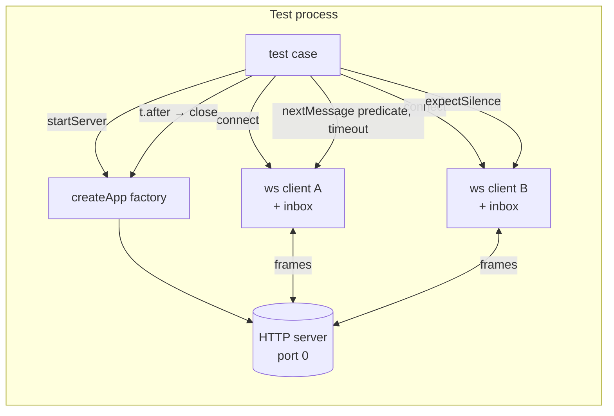
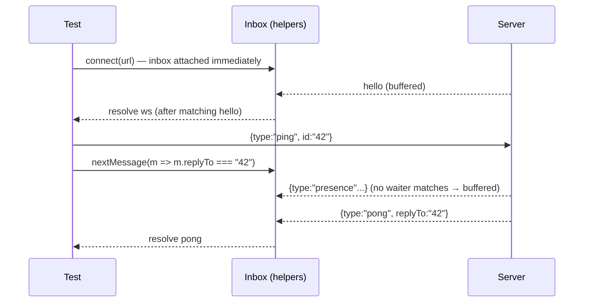
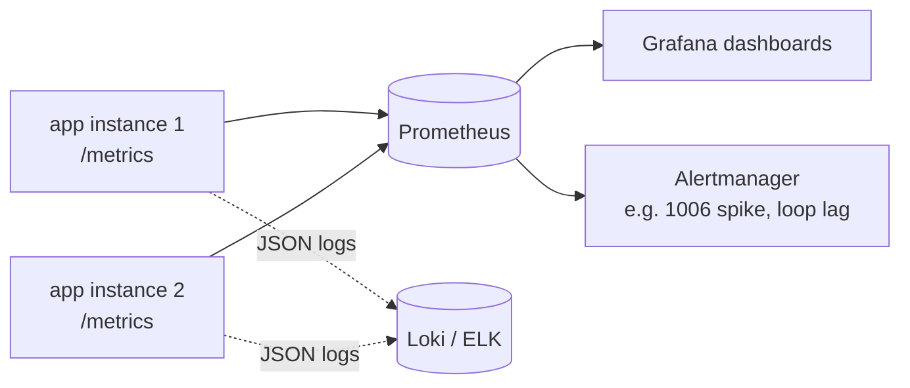
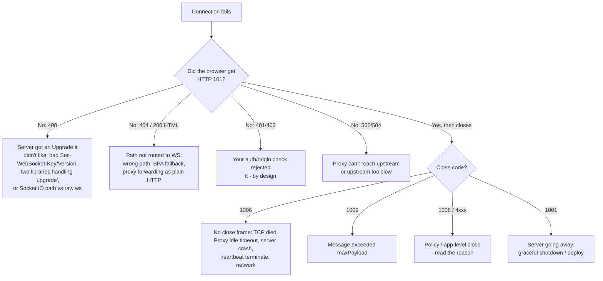

# Chapter 9 — Testing, Debugging & Observability

**Level:** 

**What you'll learn:** how to write fast, deterministic automated tests for WebSocket servers with nothing but `node:test` and the `ws` client — starting servers on port 0, awaiting messages without races, asserting *absence* of messages, testing close codes, heartbeats and payload limits — and how to test a Socket.IO server the same way. Then we leave the test runner and go into production-style debugging: reading frames in Chrome DevTools, poking servers with `wscat`/`websocat`, structured logging, Prometheus-style metrics, and a field guide to the errors you *will* meet (`1006`, `400`/`404` on upgrade, proxies eating your `Upgrade` header, idle timeouts).

> Prerequisites: the envelope protocol and rooms from [Chapter 4](./04-messaging-patterns.md), heartbeats from [Chapter 5](./05-reliability.md), `noServer` + `upgrade` from [Chapter 3](./03-express-integration.md). Socket.IO basics from [Chapter 7](./07-socketio.md) help for §6.

> **In plain English:** Testing a WebSocket server is less like testing a vending machine (coin in, snack out) and more like testing a group chat. Messages go to *other* people, they arrive in any order, and sometimes the correct result is that nothing happens at all. The trick is to run the real server on a random port, give every test client an "inbox" that catches each message from the very first moment, and always wait with a timeout instead of sleeping. When something breaks in production, you look at the wire (DevTools, `wscat`, `curl`) and at the numbers (logs with close codes, metrics).

---

## 1. Why WebSocket code is hard to test (and why that's fixable)

HTTP handlers are easy to test: one request in, one response out, done. A WebSocket server violates every assumption that makes that easy:

| HTTP handler | WebSocket server |
|---|---|
| One request → one response | Many messages, both directions, any order |
| Stateless between requests | Long-lived state: rooms, presence, sequence numbers |
| Response is the *return value* | Output is a side-effect on **other** sockets |
| Finishes when the handler returns | Lives until someone closes it — timers, sockets, intervals |
| Failure = status code | Failure = close code, silent drop, or *nothing happening* |

These differences produce the three classic failure modes of WebSocket test suites:

1. **Races** — the server sends `hello` the instant the connection opens; your test attaches `on('message')` one tick too late and waits forever.
2. **Hangs** — a forgotten `setInterval` (heartbeat!), an unclosed client, or an HTTP keep-alive socket keeps the event loop alive and `node --test` never exits.
3. **Flakes from shared state** — two tests reuse one server; the first test's room members receive the second test's broadcasts.

Every technique in this chapter exists to kill one of those three. The recipe:

- **Design for testability**: export a *factory* (`createApp()`), don't `listen()` at import time, inject timings (`heartbeatMs`) and the logger.
- **Port 0**: let the OS pick a free port so tests can run in parallel and never collide with your dev server on 3000.
- **An inbox per client**: buffer every message from the moment the socket exists; tests *pull* from the inbox with a predicate and a timeout.
- **Deterministic teardown**: `close()` clears timers, terminates sockets, closes the WSS and the HTTP server — and every timer is `unref()`ed as a safety net.



No mocks. We run the **real** server and **real** clients over real loopback TCP. It's fast (the whole suite below runs in ~0.6 s), and it catches bugs mocks never would: framing, close codes, `maxPayload`, upgrade routing.

---

## 2. The app under test: designed for testability

The example is a compact version of the chapter-4 chat server: Express 5 for HTTP, `ws` in `noServer` mode, the `{type,id,payload,replyTo}` envelope validated with zod, rooms, a heartbeat sweep, and a `/metrics` endpoint.

Look for these testability decisions as you read:

- `createApp(opts)` **returns** `{ server, wss, rooms, metrics, listen, close }` — tests can inspect internal state (`srv.rooms.has('tmp')`) without HTTP round-trips.
- `listen(0)` resolves with the actual port and ready-made URLs.
- `heartbeatMs`, `maxPayload` and `log` are **injected**. Tests use `heartbeatMs: 50` to test the sweep in milliseconds instead of waiting 30 s, and a silent logger to keep output clean.
- `sweep.unref()` — even if a test forgets `close()`, the interval won't keep the process alive.
- `close()` is thorough: `clearInterval`, `terminate()` every client, `wss.close()`, `server.closeAllConnections()` (kills idle keep-alive sockets left by `fetch`), then `server.close()`.
- Metrics are plain counters on an object, rendered in the Prometheus text format — no dependency needed.

```js
// examples/09-testing/app.js
// A small, *testable* WebSocket app: Express 5 + ws (noServer) + the course envelope.
// The key design choice: this module does NOT listen on a port by itself.
// It exports a factory so tests can create many isolated instances on port 0.
import http from 'node:http';
import { randomUUID } from 'node:crypto';
import express from 'express';
import { WebSocketServer, WebSocket } from 'ws';
import { z } from 'zod';

// ---- Protocol (same envelope as chapter 4) --------------------------------
const Envelope = z.object({
  type: z.string().min(1).max(64),
  id: z.string().min(1).max(64),
  payload: z.unknown().optional(),
  replyTo: z.string().optional(),
});
const JoinPayload = z.object({ room: z.string().min(1).max(32) });
const ChatPayload = z.object({ room: z.string().min(1).max(32), text: z.string().min(1).max(2000) });

// ---- Metrics: a tiny Prometheus-style registry -----------------------------
export function createMetrics() {
  const m = {
    connections: 0,          // gauge   (goes up and down)
    connectionsTotal: 0,     // counter (only goes up)
    messagesIn: 0,           // counter
    messagesOut: 0,          // counter
    errors: 0,               // counter (protocol errors sent to clients)
    terminated: 0,           // counter (heartbeat kills)
  };
  m.render = () => [
    '# HELP ws_connections Currently open WebSocket connections',
    '# TYPE ws_connections gauge',
    `ws_connections ${m.connections}`,
    '# HELP ws_connections_total WebSocket connections accepted since start',
    '# TYPE ws_connections_total counter',
    `ws_connections_total ${m.connectionsTotal}`,
    '# TYPE ws_messages_received_total counter',
    `ws_messages_received_total ${m.messagesIn}`,
    '# TYPE ws_messages_sent_total counter',
    `ws_messages_sent_total ${m.messagesOut}`,
    '# TYPE ws_protocol_errors_total counter',
    `ws_protocol_errors_total ${m.errors}`,
    '# TYPE ws_heartbeat_terminations_total counter',
    `ws_heartbeat_terminations_total ${m.terminated}`,
    '',
  ].join('\n');
  return m;
}

/**
 * Build (but do not start) the app.
 * @param {object} [opts]
 * @param {number} [opts.heartbeatMs=30000] ping interval; tests pass something tiny
 * @param {number} [opts.maxPayload=64*1024] bytes
 * @param {(msg:string, meta?:object)=>void} [opts.log] injectable logger (silent in tests)
 */
export function createApp({ heartbeatMs = 30_000, maxPayload = 64 * 1024, log = () => {} } = {}) {
  const metrics = createMetrics();
  const app = express();
  app.get('/healthz', (_req, res) => res.json({ ok: true, connections: metrics.connections }));
  app.get('/metrics', (_req, res) => res.type('text/plain; version=0.0.4').send(metrics.render()));

  const server = http.createServer(app);
  const wss = new WebSocketServer({ noServer: true, maxPayload });
  /** @type {Map<string, Set<WebSocket>>} */
  const rooms = new Map();

  // --- Upgrade routing: only /ws is a WebSocket endpoint ---
  server.on('upgrade', (req, socket, head) => {
    const { pathname } = new URL(req.url, 'http://localhost');
    if (pathname !== '/ws') {
      // Answer with a real HTTP response so clients see "Unexpected server response: 404"
      socket.write('HTTP/1.1 404 Not Found\r\nConnection: close\r\nContent-Length: 0\r\n\r\n');
      socket.destroy();
      return;
    }
    wss.handleUpgrade(req, socket, head, (ws) => wss.emit('connection', ws, req));
  });

  const send = (ws, msg) => {
    if (ws.readyState !== WebSocket.OPEN) return;
    ws.send(JSON.stringify(msg));
    metrics.messagesOut++;
  };
  const reply = (ws, req, type, payload) => send(ws, { type, id: randomUUID(), replyTo: req.id, payload });
  const error = (ws, code, message, replyTo) => {
    metrics.errors++;
    send(ws, { type: 'error', id: randomUUID(), ...(replyTo && { replyTo }), payload: { code, message } });
  };

  wss.on('connection', (ws, req) => {
    ws.id = randomUUID();
    ws.rooms = new Set();
    ws.isAlive = true;
    metrics.connections++;
    metrics.connectionsTotal++;
    log('connect', { id: ws.id, ip: req.socket.remoteAddress });

    ws.on('pong', () => { ws.isAlive = true; });
    send(ws, { type: 'hello', id: randomUUID(), payload: { clientId: ws.id } });

    ws.on('message', (data, isBinary) => {
      metrics.messagesIn++;
      if (isBinary) return error(ws, 'BINARY_UNSUPPORTED', 'send JSON text frames');
      let raw;
      try { raw = JSON.parse(data.toString()); } catch { return error(ws, 'BAD_JSON', 'invalid JSON'); }
      const env = Envelope.safeParse(raw);
      if (!env.success) return error(ws, 'BAD_ENVELOPE', env.error.issues[0].message);
      const msg = env.data;

      switch (msg.type) {
        case 'ping':
          return reply(ws, msg, 'pong', { t: Date.now() });
        case 'room:join': {
          const p = JoinPayload.safeParse(msg.payload);
          if (!p.success) return error(ws, 'BAD_PAYLOAD', p.error.issues[0].message, msg.id);
          const { room } = p.data;
          if (!rooms.has(room)) rooms.set(room, new Set());
          rooms.get(room).add(ws);
          ws.rooms.add(room);
          return reply(ws, msg, 'room:joined', { room, members: rooms.get(room).size });
        }
        case 'chat:message': {
          const p = ChatPayload.safeParse(msg.payload);
          if (!p.success) return error(ws, 'BAD_PAYLOAD', p.error.issues[0].message, msg.id);
          const { room, text } = p.data;
          if (!ws.rooms.has(room)) return error(ws, 'NOT_IN_ROOM', `join ${room} first`, msg.id);
          const out = { type: 'chat:message', id: randomUUID(), payload: { room, text, from: ws.id } };
          for (const peer of rooms.get(room)) send(peer, out);
          return reply(ws, msg, 'ack', { delivered: rooms.get(room).size });
        }
        default:
          return error(ws, 'UNKNOWN_TYPE', `unknown type ${msg.type}`, msg.id);
      }
    });

    ws.on('close', (code) => {
      metrics.connections--;
      for (const room of ws.rooms) {
        const set = rooms.get(room);
        set?.delete(ws);
        if (set?.size === 0) rooms.delete(room);
      }
      log('close', { id: ws.id, code });
    });
    ws.on('error', (err) => log('ws error', { id: ws.id, err: err.message }));
  });

  // --- Heartbeat sweep (chapter 5) ---
  const sweep = setInterval(() => {
    for (const ws of wss.clients) {
      if (!ws.isAlive) { metrics.terminated++; ws.terminate(); continue; }
      ws.isAlive = false;
      ws.ping();
    }
  }, heartbeatMs);
  sweep.unref(); // never keep the process (or the test runner) alive on its own

  /** Start listening. Pass port 0 to get a random free port (what tests do). */
  function listen(port = 0, host = '127.0.0.1') {
    return new Promise((resolve, reject) => {
      server.once('error', reject);
      server.listen(port, host, () => {
        const { port: p } = server.address();
        resolve({ port: p, httpUrl: `http://${host}:${p}`, wsUrl: `ws://${host}:${p}/ws` });
      });
    });
  }

  /** Stop everything: sweep timer, every socket, the WSS, the HTTP server. */
  async function close() {
    clearInterval(sweep);
    for (const ws of wss.clients) ws.terminate();
    await new Promise((r) => wss.close(() => r()));
    server.closeAllConnections?.(); // drop idle keep-alive HTTP sockets (fetch in tests)
    await new Promise((r) => server.close(() => r()));
  }

  return { app, server, wss, rooms, metrics, listen, close };
}
```

A few details worth calling out:

- **Unknown paths get a real HTTP response.** In the `upgrade` handler, a non-`/ws` path writes `HTTP/1.1 404` before destroying the socket. If you only `socket.destroy()`, clients see a confusing `socket hang up` / `1006` instead of `Unexpected server response: 404`. A clear failure is a *testable* failure.
- **Errors carry `replyTo`** when we know the request id, so a client's `request()` helper resolves with the error instead of timing out. Your tests (and your frontend) get a fast, precise failure.
- **The `close` handler decrements the gauge and cleans rooms.** This is exactly the kind of code that leaks in production (a room map that grows forever), so we'll test it.

And a tiny launcher for manual debugging — tests never import it:

```js
// examples/09-testing/server.js — run the testable app for manual poking
// (wscat, websocat, Chrome DevTools). Tests do NOT use this file.
import { createApp } from './app.js';

const port = Number(process.env.PORT) || 3000;
const verbose = process.env.DEBUG_WS === '1';
const log = (msg, meta = {}) =>
  console.log(JSON.stringify({ t: new Date().toISOString(), msg, ...meta }));

const { listen, close } = createApp({ log: verbose ? log : (m, meta) => m !== 'ws error' || log(m, meta) });
const { httpUrl, wsUrl } = await listen(port, '0.0.0.0');
console.log(`HTTP ${httpUrl.replace('0.0.0.0', 'localhost')}  (/healthz, /metrics)`);
console.log(`WS   ${wsUrl.replace('0.0.0.0', 'localhost')}`);
console.log('Try:  npx wscat -c ws://localhost:' + port + '/ws');

for (const sig of ['SIGINT', 'SIGTERM']) {
  process.on(sig, async () => { await close(); process.exit(0); });
}
```

---

## 3. Test helpers: awaiting messages without races

This is the heart of the chapter. Copy this file into every WebSocket project you own.

```js
// examples/09-testing/helpers.js — reusable test utilities for WebSocket servers.
// Not a test file: its name doesn't match *.test.js, so the runner never executes it.
import { WebSocket } from 'ws';
import { randomUUID } from 'node:crypto';
import { createApp } from './app.js';

/** Start an isolated app on a random port. Returns urls + a close() for t.after(). */
export async function startServer(opts = {}) {
  const instance = createApp(opts);
  const urls = await instance.listen(0);
  return { ...instance, ...urls };
}

/**
 * Open a client and resolve once it's OPEN *and* has received the server's `hello`.
 * Installing the message queue BEFORE 'open' fires means we can never miss a frame
 * the server sends immediately on connect — the #1 source of flaky WS tests.
 */
export function connect(url, options = {}) {
  return new Promise((resolve, reject) => {
    const ws = new WebSocket(url, options);
    attachInbox(ws);
    ws.once('error', reject);
    ws.once('unexpected-response', (_req, res) =>
      reject(Object.assign(new Error(`Unexpected server response: ${res.statusCode}`), { statusCode: res.statusCode })));
    ws.once('open', async () => {
      try {
        const hello = await nextMessage(ws, (m) => m.type === 'hello');
        ws.clientId = hello.payload.clientId;
        resolve(ws);
      } catch (e) { reject(e); }
    });
  });
}

/** Buffer every incoming JSON message so tests can await them in any order. */
function attachInbox(ws) {
  ws.inbox = [];
  ws.waiters = [];
  ws.on('message', (data) => {
    const msg = JSON.parse(data.toString());
    const i = ws.waiters.findIndex((w) => w.predicate(msg));
    if (i >= 0) ws.waiters.splice(i, 1)[0].resolve(msg);
    else ws.inbox.push(msg);
  });
}

/**
 * Await the next message matching `predicate` (default: any). Checks already-buffered
 * messages first; rejects after `timeout` ms with a helpful error instead of hanging.
 */
export function nextMessage(ws, predicate = () => true, timeout = 1000) {
  const i = ws.inbox.findIndex(predicate);
  if (i >= 0) return Promise.resolve(ws.inbox.splice(i, 1)[0]);
  return new Promise((resolve, reject) => {
    const waiter = { predicate, resolve: (m) => { clearTimeout(timer); resolve(m); } };
    const timer = setTimeout(() => {
      ws.waiters.splice(ws.waiters.indexOf(waiter), 1);
      reject(new Error(`nextMessage: timed out after ${timeout}ms (inbox: ${JSON.stringify(ws.inbox)})`));
    }, timeout);
    ws.waiters.push(waiter);
  });
}

/** Send an envelope and await the reply whose replyTo matches its id. */
export async function request(ws, type, payload, timeout) {
  const id = randomUUID();
  ws.send(JSON.stringify({ type, id, payload }));
  return nextMessage(ws, (m) => m.replyTo === id, timeout);
}

/** Assert that NO matching message arrives within `ms` (for negative tests). */
export async function expectSilence(ws, predicate = () => true, ms = 100) {
  try {
    const m = await nextMessage(ws, predicate, ms);
    throw Object.assign(new Error(`expected silence, got ${JSON.stringify(m)}`), { unexpected: true });
  } catch (e) {
    if (e.unexpected) throw e; // timeout = success
  }
}

/** Resolve with { code, reason } when the socket closes. */
export function waitForClose(ws, timeout = 2000) {
  return new Promise((resolve, reject) => {
    if (ws.readyState === WebSocket.CLOSED) return resolve({ code: ws._closeCode, reason: '' });
    const timer = setTimeout(() => reject(new Error('waitForClose timed out')), timeout);
    ws.once('close', (code, reason) => { clearTimeout(timer); resolve({ code, reason: reason.toString() }); });
  });
}

/** Poll until fn() is truthy (e.g. a metrics gauge catching up after a close). */
export async function eventually(fn, { timeout = 1000, interval = 10 } = {}) {
  const deadline = Date.now() + timeout;
  for (;;) {
    try { if (await fn()) return; } catch { /* retry */ }
    if (Date.now() > deadline) throw new Error('eventually: condition not met in time');
    await new Promise((r) => setTimeout(r, interval));
  }
}
```

### 3.1 Why an inbox instead of `once('message')`?

The naïve helper is:

```js
// ❌ racy
const next = (ws) => new Promise((r) => ws.once('message', (d) => r(JSON.parse(d))));
```

Two problems:

1. **Lost messages.** If the message arrived *before* you called `next()`, it's gone — the event already fired. With `hello`-on-connect servers this happens on nearly every run.
2. **Wrong message.** `once` resolves with *whatever* arrives next. In a room test, Bob might get a presence update before the chat message you expected.

The inbox fixes both: `attachInbox` runs synchronously inside `connect()` — **before** the `open` event can fire — so every frame is captured. `nextMessage(ws, predicate)` first searches the already-received messages, then registers a waiter. Messages that match no waiter stay in the inbox for later assertions.



### 3.2 Every wait has a timeout — with a useful message

A test that hangs forever is the worst kind of failure: CI kills it after 10 minutes with no information. `nextMessage` rejects after `timeout` ms and **prints the inbox** in the error — you immediately see "I was waiting for `chat:message` but got an `error` with `NOT_IN_ROOM`". Keep timeouts small (≈1 s) on loopback; if a message takes longer than that locally, something is wrong.

### 3.3 Proving a negative: `expectSilence`

"Carol, who is in another room, must **not** get the message" is a critical security/isolation property, and you can't `await` something that never happens. `expectSilence` waits a short window (100 ms) and fails if a matching message shows up. It's inherently a time-bounded check — keep the window short, and **send the triggering message first, then wait** so the server has had a chance to (wrongly) deliver.

> Tip: make negative tests stronger by pairing them with a positive in the same test: "Bob in `general` DID get it **and** Carol in `random` did NOT". If Bob got it, the server definitely processed the broadcast before your silence window closed.

### 3.4 `eventually`: state converges asynchronously

When the client calls `ws.close()`, the server's `close` handler runs *later* (after the closing handshake travels over TCP). Asserting `srv.metrics.connections === 0` immediately after `a.close()` is a flake. `eventually(fn)` polls until the condition holds or a deadline passes. Use it for server-side state; use `nextMessage` for anything the server *sends*.

---

## 4. Writing the tests with `node:test`

Node's built-in runner is all you need: `describe`/`test`, `before`/`after`/`beforeEach`/`afterEach`, `t.after()` for per-test cleanup, and `node:assert/strict`. No Jest, no Mocha, no transpiler.

### 4.1 Protocol tests (one shared server per suite)

For stateless request/response behaviour it's fine to share one server and one client across a `describe` block (`before`/`after`). It's faster, and these tests don't interfere.

```js
// examples/09-testing/protocol.test.js — request/response and validation.
import { test, describe, before, after } from 'node:test';
import assert from 'node:assert/strict';
import { startServer, connect, request, nextMessage } from './helpers.js';

describe('protocol', () => {
  let srv, ws;
  before(async () => {
    srv = await startServer();
    ws = await connect(srv.wsUrl);
  });
  after(async () => {
    ws.close();
    await srv.close();
  });

  test('server greets with hello + clientId', () => {
    assert.match(ws.clientId, /^[0-9a-f-]{36}$/);
  });

  test('ping gets a pong correlated by replyTo', async () => {
    const res = await request(ws, 'ping', {});
    assert.equal(res.type, 'pong');
    assert.equal(typeof res.payload.t, 'number');
  });

  test('invalid JSON yields BAD_JSON error (and the socket survives)', async () => {
    ws.send('{not json');
    const err = await nextMessage(ws, (m) => m.type === 'error');
    assert.equal(err.payload.code, 'BAD_JSON');
    // still usable afterwards
    assert.equal((await request(ws, 'ping', {})).type, 'pong');
  });

  test('missing envelope fields yields BAD_ENVELOPE', async () => {
    ws.send(JSON.stringify({ type: 'ping' })); // no id
    const err = await nextMessage(ws, (m) => m.type === 'error');
    assert.equal(err.payload.code, 'BAD_ENVELOPE');
  });

  test('unknown types are rejected with replyTo set', async () => {
    const err = await request(ws, 'does:not:exist', {});
    assert.equal(err.type, 'error');
    assert.equal(err.payload.code, 'UNKNOWN_TYPE');
  });

  test('payload validation (zod) rejects bad room names', async () => {
    const err = await request(ws, 'room:join', { room: '' });
    assert.equal(err.payload.code, 'BAD_PAYLOAD');
  });
});
```

Notice the "socket survives" assertion: after sending garbage, we prove the connection still works. A common production bug is throwing inside the `message` handler — in `ws` that becomes an uncaught exception that can crash the **whole process** and disconnect every user. Test your error paths.

### 4.2 Multi-client tests (fresh server per test)

Room tests mutate shared state, so each test gets its own server via `beforeEach`. Starting a server on port 0 takes about a millisecond — isolation is cheap; debugging cross-test pollution is not.

```js
// examples/09-testing/rooms.test.js — multi-client scenarios: fan-out and isolation.
import { test, beforeEach, afterEach } from 'node:test';
import assert from 'node:assert/strict';
import { startServer, connect, request, nextMessage, expectSilence, eventually } from './helpers.js';

let srv, clients;
beforeEach(async () => {
  srv = await startServer();        // a FRESH server per test: no shared room state
  clients = [];
});
afterEach(async () => {
  for (const c of clients) c.close();
  await srv.close();
});
const client = async () => { const c = await connect(srv.wsUrl); clients.push(c); return c; };

test('a message reaches every member of the room, including the sender', async () => {
  const [alice, bob] = await Promise.all([client(), client()]);
  await request(alice, 'room:join', { room: 'general' });
  const joined = await request(bob, 'room:join', { room: 'general' });
  assert.equal(joined.payload.members, 2);

  const bobGets = nextMessage(bob, (m) => m.type === 'chat:message');   // subscribe FIRST
  const ack = await request(alice, 'chat:message', { room: 'general', text: 'hi bob' });
  assert.equal(ack.type, 'ack');
  assert.equal(ack.payload.delivered, 2);

  const msg = await bobGets;
  assert.deepEqual(msg.payload, { room: 'general', text: 'hi bob', from: alice.clientId });
  // the sender gets its own copy too (echo)
  const echo = await nextMessage(alice, (m) => m.type === 'chat:message');
  assert.equal(echo.payload.text, 'hi bob');
});

test('clients in other rooms do not receive the message', async () => {
  const [alice, carol] = await Promise.all([client(), client()]);
  await request(alice, 'room:join', { room: 'general' });
  await request(carol, 'room:join', { room: 'random' });
  await request(alice, 'chat:message', { room: 'general', text: 'secret' });
  await expectSilence(carol, (m) => m.type === 'chat:message', 100);
});

test('you cannot post to a room you have not joined', async () => {
  const mallory = await client();
  const err = await request(mallory, 'chat:message', { room: 'general', text: 'x' });
  assert.equal(err.payload.code, 'NOT_IN_ROOM');
});

test('rooms are cleaned up when the last member disconnects', async () => {
  const a = await client();
  await request(a, 'room:join', { room: 'tmp' });
  assert.ok(srv.rooms.has('tmp'));
  a.close();
  // The server's 'close' handler runs asynchronously after the client's close —
  // never assert immediately; poll until the state converges.
  await eventually(() => !srv.rooms.has('tmp'));
});

test('fan-out works at a (small) scale: 50 clients', async () => {
  const many = await Promise.all(Array.from({ length: 50 }, client));
  await Promise.all(many.map((c) => request(c, 'room:join', { room: 'big' })));
  const all = Promise.all(many.map((c) => nextMessage(c, (m) => m.type === 'chat:message')));
  await request(many[0], 'chat:message', { room: 'big', text: 'hello everyone' });
  const got = await all;
  assert.equal(got.length, 50);
  assert.ok(got.every((m) => m.payload.text === 'hello everyone'));
});
```

The ordering rule that makes these tests deterministic:

> **Subscribe before you trigger.** `const bobGets = nextMessage(bob, ...)` is created *before* Alice sends. Thanks to the inbox it would work the other way round too — but writing it this way makes the causality obvious to readers, and it's mandatory if you ever use plain event listeners.

The 50-client test is not a load test (see [Chapter 8](./08-scaling.md) for that) — it's a cheap regression guard against accidentally O(n²) or "send to first member only" bugs.

### 4.3 Lifecycle tests: handshakes, limits, heartbeats, metrics

The edge of the connection is where production incidents live. Test it explicitly.

```js
// examples/09-testing/lifecycle.test.js — handshake failures, limits, heartbeats, metrics.
import { test } from 'node:test';
import assert from 'node:assert/strict';
import { WebSocket } from 'ws';
import { startServer, connect, waitForClose, eventually } from './helpers.js';

test('upgrade on the wrong path is refused with an HTTP status (not a hang)', async (t) => {
  const srv = await startServer();
  t.after(() => srv.close());
  await assert.rejects(connect(`ws://127.0.0.1:${srv.port}/nope`), { statusCode: 404 });
});

test('a plain HTTP GET to /ws (no Upgrade header) is just a normal 404', async (t) => {
  const srv = await startServer();
  t.after(() => srv.close());
  const res = await fetch(`${srv.httpUrl}/ws`);
  // Express has no /ws route, so a normal GET falls through to 404 — the WS endpoint
  // is only reachable via the 'upgrade' event.
  assert.equal(res.status, 404);
});

test('frames larger than maxPayload close the socket with 1009', async (t) => {
  const srv = await startServer({ maxPayload: 1024 });
  t.after(() => srv.close());
  const ws = await connect(srv.wsUrl);
  const closed = waitForClose(ws);
  ws.send('x'.repeat(2048));
  const { code } = await closed;
  assert.equal(code, 1009); // Message Too Big
});

test('connections gauge tracks open/close', async (t) => {
  const srv = await startServer();
  t.after(() => srv.close());
  const a = await connect(srv.wsUrl);
  const b = await connect(srv.wsUrl);
  assert.equal(srv.metrics.connections, 2);
  a.close();
  b.close();
  await eventually(() => srv.metrics.connections === 0);
  assert.equal(srv.metrics.connectionsTotal, 2);
});

test('heartbeat terminates a client that stops answering pings', async (t) => {
  const srv = await startServer({ heartbeatMs: 50 });
  t.after(() => srv.close());
  // autoPong:false (ws >= 8.17) simulates a dead peer / half-open TCP connection
  const zombie = await connect(srv.wsUrl, { autoPong: false });
  const healthy = await connect(srv.wsUrl);
  const { code } = await waitForClose(zombie, 1000);
  assert.equal(code, 1006);               // abnormal closure: server terminate()d the TCP socket
  assert.equal(healthy.readyState, WebSocket.OPEN);
  assert.ok(srv.metrics.terminated >= 1);
  healthy.close();
});

test('/metrics exposes Prometheus text format', async (t) => {
  const srv = await startServer();
  t.after(() => srv.close());
  const ws = await connect(srv.wsUrl);
  t.after(() => ws.close());
  const res = await fetch(`${srv.httpUrl}/metrics`);
  assert.equal(res.status, 200);
  assert.match(res.headers.get('content-type'), /text\/plain/);
  const body = await res.text();
  assert.match(body, /^# TYPE ws_connections gauge$/m);
  assert.match(body, /^ws_connections 1$/m);
  assert.match(body, /^ws_messages_sent_total \d+$/m);
});
```

What each one pins down:

- **Wrong path → 404.** `ws` emits `unexpected-response` when the server answers the upgrade with a non-101 status; our `connect()` turns that into an error with `statusCode`. Without the explicit HTTP response in `app.js` this test would get a vague `socket hang up`.
- **maxPayload → 1009.** `ws` enforces `maxPayload` in the receiver and closes with **1009 Message Too Big**. If someone "temporarily" bumps the limit to 100 MB, this test (with a small injected limit) keeps the behaviour honest.
- **Heartbeat.** The `ws` client has an `autoPong: false` option (ws ≥ 8.17) — perfect for simulating a dead peer: TCP is up, but nothing answers pings. With `heartbeatMs: 50` the sweep marks it not-alive on the first tick and `terminate()`s it on the second; the client sees **1006** (no close frame — the TCP socket just died). Meanwhile the healthy client must still be `OPEN`.
- **Metrics.** Assert on the *text format* — it's an API your Prometheus scraper depends on.

### 4.4 Controlling time: real timers vs. mock timers

We tested the heartbeat by *shrinking* the interval. The alternative is `node:test`'s mock timers:

```js
import { test } from 'node:test';

test('sweep logic with fake time', (t) => {
  t.mock.timers.enable({ apis: ['setInterval'] });
  const srv = createApp({ heartbeatMs: 30_000 });
  // ... fake a ws in srv.wss.clients, then:
  t.mock.timers.tick(30_000); // first sweep: isAlive=false + ping
  t.mock.timers.tick(30_000); // second sweep: terminate
});
```

Mock timers are great for **pure logic** (backoff calculators from [Chapter 5](./05-reliability.md), token buckets from [Chapter 6](./06-security.md)). But they don't mix well with real sockets: I/O still happens in real time while your timers are frozen. Rule of thumb: **unit-test time math with mock timers; integration-test sockets with injected short intervals.**

Example — testing a backoff function with no sockets at all:

```js
import { test } from 'node:test';
import assert from 'node:assert/strict';

const backoff = (attempt, base = 500, cap = 30_000, rand = Math.random) =>
  Math.round(rand() * Math.min(cap, base * 2 ** attempt)); // "full jitter"

test('backoff grows exponentially and is capped', () => {
  const max = () => 1; // inject randomness → deterministic
  assert.equal(backoff(0, 500, 30_000, max), 500);
  assert.equal(backoff(3, 500, 30_000, max), 4000);
  assert.equal(backoff(20, 500, 30_000, max), 30_000);
});
```

Inject randomness the same way you inject time.

### 4.5 Running the suite

```bash
# from the repo root
node --test "examples/09-testing/*.test.js"

# watch mode while developing
node --test --watch "examples/09-testing/*.test.js"

# only tests whose name matches
node --test --test-name-pattern="heartbeat" "examples/09-testing/*.test.js"

# coverage (built-in, experimental but useful)
node --test --experimental-test-coverage "examples/09-testing/*.test.js"
```

> **Gotcha:** `node --test some/dir/` does **not** mean "run tests in this directory" on current Node — the argument is treated as a file/glob and a bare directory fails with `Cannot find module`. Pass a glob (quoted, so Node — not your shell — expands it). Only files matching `*.test.js` run, which is why `helpers.js`, `app.js` and `server.js` are never executed as tests.

Each test **file** runs in its own child process by default, so files are isolated from each other and run in parallel. Within a file, tests run sequentially unless you opt in to concurrency.

### 4.6 "My test run never exits"

If `node --test` prints all green and then just sits there, something is holding the event loop:

| Culprit | Fix |
|---|---|
| `setInterval` (heartbeat, metrics flush) | `clearInterval` in `close()`, and `.unref()` it |
| Open client sockets | `ws.close()` in `after`/`t.after` |
| `wss.close()` alone | In ws 8 it **doesn't** close existing clients — `terminate()` them first |
| `server.close()` waiting on keep-alive sockets from `fetch` | `server.closeAllConnections()` (Node ≥ 18.2) |
| Socket.IO server | `await io.close()` (closes the HTTP server too) |

Diagnose with `node --test --test-timeout=5000 ...` (fails the hanging test instead of waiting forever), or run the file directly with `node --trace-exit`/`why-is-node-running` to list live handles.

---

## 5. Testing reconnection & other client behaviour

The tests above are **server** tests with a scripted client. To test a **client** (e.g. the reconnecting client from Chapter 5), flip it: run a real server you control, and kill it mid-test. A sketch (assuming your client module exports `createReconnectingClient` with an `opened()` promise):

```js
test('client reconnects after the server restarts', async () => {
  let srv = await startServer();
  const { port } = srv;
  const client = createReconnectingClient(`ws://127.0.0.1:${port}/ws`, { baseMs: 20 });
  await client.opened();

  await srv.close();                       // server "crashes" → client sees 1006
  srv = createApp(); await srv.listen(port); // same port comes back
  await client.opened();                   // resolves when reconnected
  await srv.close(); client.stop();
});
```

Key ideas: inject small backoff constants, reuse the port explicitly (a restarted server gets a *new* random port unless you pass the old one), and expose promises like `opened()` from your client so tests don't sleep. For the browser client you can run the same logic in Node since Node 22+ ships a global `WebSocket` (WHATWG API — `addEventListener`, no `ping()`), or drive a real browser with Playwright, which can also inspect frames via `page.on('websocket', ws => ws.on('framereceived', ...))`.

---

## 6. Testing Socket.IO

Socket.IO testing follows the same shape — real server on port 0, real client — with a few specifics:

- Use `socket.io-client` in Node with `transports: ['websocket']`. This skips the HTTP long-polling phase, making tests faster and removing a whole class of timing noise. (Keep at least one test *with* polling if you rely on the fallback in production.)
- `reconnection: false` so a failed connection rejects instead of retrying forever, and `forceNew: true` so every client gets its own Manager and its own Engine.IO connection (the client caches Managers per URL and multiplexes *different namespaces* over one connection — `forceNew` removes any doubt about what a "client" is in your test).
- Acknowledgements make assertions trivial: `await socket.timeout(1000).emitWithAck('event', data)` is an RPC with a timeout built in.
- Middleware auth failures surface as `connect_error` with the `Error` message you passed to `next()`.
- `await io.close()` closes all sockets **and** the underlying HTTP server.

```js
// examples/09-testing/socketio.test.js — testing a Socket.IO server with socket.io-client.
import { test, before, after } from 'node:test';
import assert from 'node:assert/strict';
import http from 'node:http';
import { Server } from 'socket.io';
import { io as ioClient } from 'socket.io-client';

let httpServer, io, url;

before(async () => {
  httpServer = http.createServer();
  io = new Server(httpServer);
  // middleware auth: reject handshakes without the right token
  io.use((socket, next) => {
    if (socket.handshake.auth?.token === 'good') return next();
    next(new Error('unauthorized'));
  });
  io.on('connection', (socket) => {
    socket.on('sum', (nums, ack) => ack(nums.reduce((a, b) => a + b, 0)));
    socket.on('join', (room, ack) => { socket.join(room); ack('ok'); });
    socket.on('say', ({ room, text }) => socket.to(room).emit('said', { text }));
  });
  await new Promise((r) => httpServer.listen(0, '127.0.0.1', r));
  url = `http://127.0.0.1:${httpServer.address().port}`;
});

after(async () => {
  await io.close(); // also closes httpServer
});

/** Connect with websocket-only transport (skips long-polling → faster, deterministic). */
function client(token = 'good') {
  const s = ioClient(url, { auth: { token }, transports: ['websocket'], reconnection: false, forceNew: true });
  return new Promise((resolve, reject) => {
    s.once('connect', () => resolve(s));
    s.once('connect_error', (err) => { s.close(); reject(err); });
  });
}

test('middleware rejects a bad token with connect_error', async () => {
  await assert.rejects(client('bad'), { message: 'unauthorized' });
});

test('acknowledgements work like RPC (emitWithAck)', async (t) => {
  const s = await client();
  t.after(() => s.close());
  const total = await s.timeout(1000).emitWithAck('sum', [1, 2, 3]);
  assert.equal(total, 6);
});

test('room broadcast excludes the sender and non-members', async (t) => {
  const [a, b, c] = await Promise.all([client(), client(), client()]);
  t.after(() => { a.close(); b.close(); c.close(); });
  await a.emitWithAck('join', 'r1');
  await b.emitWithAck('join', 'r1');

  const got = new Promise((r) => b.once('said', r));
  let leaked = false;
  a.on('said', () => { leaked = true; });
  c.on('said', () => { leaked = true; });

  a.emit('say', { room: 'r1', text: 'yo' });
  assert.deepEqual(await got, { text: 'yo' });
  await new Promise((r) => setTimeout(r, 50));
  assert.equal(leaked, false);
});
```

---

## 7. Interactive debugging tools

Tests tell you *that* something broke. These tools tell you *what's on the wire*.

### 7.1 Chrome / Edge DevTools — the frames inspector

1. Open DevTools → **Network** tab, then load or reload the page (connections opened before DevTools was open aren't captured).
2. Filter by **Socket** (called **WS** in older versions).
3. Click the connection. Tabs:
   - **Headers** — the upgrade request/response. Check `Status Code: 101 Switching Protocols`, `Upgrade: websocket`, `Sec-WebSocket-Accept`, and any `Sec-WebSocket-Extensions: permessage-deflate` negotiation.
   - **Messages** — every frame: ⬆ green = sent, ⬇ white/red = received, with timestamp and length. Filter box accepts text or regex (e.g. `"type":"error"`). Binary frames show as `Binary Message` with a hex view.
   - **Timing / Initiator** — which script opened the socket.
4. Close frames show the code and reason at the bottom — the fastest way to see `1008 policy violation` vs `1006`.

Firefox has an equivalent under **Network → WS → Response**. Note: **pings/pongs are control frames and browsers do not show them** (and the browser API can't send them) — use server logs or Wireshark for heartbeat debugging.

From the DevTools console you can also open a scratch connection:

```js
const s = new WebSocket('ws://localhost:3000/ws');
s.onmessage = (e) => console.log(JSON.parse(e.data));
s.onclose = (e) => console.log('closed', e.code, e.reason, e.wasClean);
s.send(JSON.stringify({ type: 'ping', id: '1' }));
```

### 7.2 wscat (Node) and websocat (Rust)

```bash
# wscat — the curl of WebSockets
npx wscat -c ws://localhost:3000/ws
> {"type":"ping","id":"1"}
< {"type":"pong","id":"…","replyTo":"1","payload":{"t":1727...}}

# with headers (auth, origin checks from chapter 6)
npx wscat -c ws://localhost:3000/ws -H "Origin: http://localhost:3000" -H "Authorization: Bearer xyz"
# --no-check to accept self-signed wss:// certs in dev; -P to show ping/pong
npx wscat -c wss://localhost:8443/ws --no-check -P

# websocat — scriptable, pipe-friendly
echo '{"type":"ping","id":"1"}' | websocat -n1 ws://localhost:3000/ws
websocat -v ws://localhost:3000/ws          # verbose: shows handshake
websocat -s 9000                            # tiny echo *server* for testing clients
```

`websocat` is fantastic in shell scripts and CI smoke tests (`-n1` = send stdin, print one reply, exit).

### 7.3 curl for the handshake itself

When the question is "does the upgrade even work through this proxy?", skip WebSocket clients and look at raw HTTP:

```bash
curl -i -N --http1.1 \
  -H "Connection: Upgrade" -H "Upgrade: websocket" \
  -H "Sec-WebSocket-Version: 13" -H "Sec-WebSocket-Key: dGhlIHNhbXBsZSBub25jZQ==" \
  http://localhost:3000/ws
# Expect: HTTP/1.1 101 Switching Protocols … then the connection stays open (Ctrl-C).
```

A `400`, `404`, `426` or a `200` with HTML tells you exactly which layer rejected the upgrade (see §9).

### 7.4 Node-side introspection

- An env switch for your own verbose logs: `DEBUG_WS=1 node examples/09-testing/server.js` prints every connect/close as JSON.
- Socket.IO has built-in debug logs: `DEBUG=socket.io*,engine* node server.js` (server) and `localStorage.debug = 'socket.io-client:*'` (browser).
- `node --inspect server.js` + `chrome://inspect` → set breakpoints in your `message` handler. Beware: pausing in a breakpoint stops the event loop, heartbeats stop, and clients get terminated or time out — extend `heartbeatMs` while debugging.
- Wireshark with the `websocket` display filter decodes frames on `ws://` (not `wss://` unless you feed it TLS keys via `SSLKEYLOGFILE`), including pings, pongs, masking and fragmentation.

---

## 8. Observability: logs and metrics

In production you can't attach DevTools to 50,000 users. You need **logs** for individual stories and **metrics** for the aggregate.

### 8.1 Structured logging

Log one JSON object per event. Minimum useful fields for WebSocket servers:

| Event | Fields |
|---|---|
| `connect` | `connId`, `userId`, `ip` (from `X-Forwarded-For` behind a proxy), `userAgent`, `node` (which instance) |
| `close` | `connId`, `code`, `reason`, `durationMs`, `msgsIn`, `msgsOut`, `closedBy` (server/client/heartbeat) |
| `error` | `connId`, `type` (message type), `code`, `err.message` |
| `upgrade_rejected` | `ip`, `path`, `status`, `why` (origin, auth, rate-limit) |

Rules:

- **Don't log every message** at info level — at 10k msg/s that's your disk and your log bill. Sample, or log only errors and lifecycle.
- **Never log tokens.** If you authenticate with `?token=...` (don't — see [Chapter 6](./06-security.md)), `req.url` in your access logs *is* a credential leak. Redact query strings.
- Use a fast logger (`pino`) in real apps; our `log` injection point makes swapping trivial and keeps tests silent.
- `close` codes in logs are gold: a spike of `1006` after a deploy means proxies/timeouts; a spike of `1009` means a client started sending big payloads; `4001`-style app codes mean auth expiry.

### 8.2 Metrics that matter

Our `/metrics` endpoint emits the Prometheus text exposition format by hand:

```text
# HELP ws_connections Currently open WebSocket connections
# TYPE ws_connections gauge
ws_connections 1834
# TYPE ws_messages_received_total counter
ws_messages_received_total 9912383
...
```

**Gauge** = a value that goes up and down (open connections). **Counter** = monotonically increasing total (messages); Prometheus derives rates: `rate(ws_messages_received_total[1m])` = messages/sec. Never expose "messages per second" as a gauge you compute yourself — counters survive scrape gaps and aggregate across instances correctly.

A production-grade dashboard for a WebSocket service:

| Metric | Type | Why |
|---|---|---|
| `ws_connections` (by instance) | gauge | Capacity, imbalance between nodes after deploys (see ch. 8) |
| `ws_connections_total`, `ws_disconnects_total{code}` | counter | Churn; reconnect storms show as a spike in both |
| `ws_messages_received_total{type}` / `sent_total{type}` | counter | Throughput per message type |
| `ws_message_handle_seconds` | histogram | Handler latency (p99 matters: a slow handler blocks everyone) |
| `ws_buffered_bytes` / slow consumers dropped | gauge/counter | Backpressure (ch. 5) |
| `ws_heartbeat_terminations_total` | counter | Dead connections / network trouble |
| `ws_upgrade_rejected_total{reason}` | counter | Auth/origin/rate-limit failures (ch. 6) |
| `nodejs_eventloop_lag_seconds` | gauge | If the loop lags, *every* socket suffers |

For real projects use [`prom-client`](https://github.com/siimon/prom-client) (it adds histograms, labels and default Node metrics like event-loop lag and heap). Keep label cardinality low: label by message *type*, never by user or room id.



> Security note: `/metrics` leaks operational information. In production, bind it to an internal port or protect it; don't expose it through your public load balancer.

---

## 9. Field guide: common errors and what they really mean



### `1006 Abnormal Closure`

1006 is **never sent on the wire**. It's what the client *reports* when the TCP connection vanished without a close frame. It's a symptom, not a diagnosis. Browsers also deliberately report 1006 for many handshake failures (for security they don't expose the HTTP status to JS) — check DevTools Network for the real status.

Common causes, in order of likelihood:

1. **Proxy idle timeout.** nginx's default `proxy_read_timeout` is **60 s**; AWS ALB idle timeout is 60 s; Cloudflare ~100 s. A quiet connection gets cut at exactly that interval. Signature: disconnects at suspiciously round durations. Fix: heartbeat more often than the shortest timeout (e.g. 25–30 s) and/or raise the timeout (see [Chapter 8](./08-scaling.md) nginx config).
2. **Server process crashed or restarted** without a graceful close (no `1001`). Check for uncaught exceptions in `message` handlers.
3. **Your own heartbeat** `terminate()`d the client (our test in §4.3 does exactly this on purpose). Count it with a metric.
4. **Handshake rejected** (see below) — the browser just says 1006.
5. Laptop sleep, Wi-Fi switch, mobile network change.

### `400 Bad Request` on upgrade

- **Two WebSocket servers attached to the same HTTP server.** E.g. `new WebSocketServer({ server })` *and* Socket.IO, or two `ws` servers with `server:` — both handle every `upgrade`, one succeeds, the other writes 400 onto the same socket (`Invalid frame header` / `RSV1 must be clear` errors are the side effect). Fix: `noServer: true` and route by path in one `upgrade` handler ([Chapter 3](./03-express-integration.md)).
- Missing/invalid `Sec-WebSocket-Key` or `Sec-WebSocket-Version: 13` — usually a proxy rewrote headers.
- Connecting a **raw WebSocket client to a Socket.IO server** (or vice versa). Socket.IO expects `/socket.io/?EIO=4&transport=websocket` and speaks its own packet format on top — a plain `new WebSocket('ws://host/')` gets `400` or an immediate close. Socket.IO is not a WebSocket server ([Chapter 7](./07-socketio.md)).
- `ws` with `verifyClient`/your own checks writing 400 deliberately.

### `404` / `200 text/html` on upgrade

The request reached something that isn't your WebSocket handler: wrong path, an SPA catch-all route, a static file server, or a proxy that forwarded it as plain HTTP.

### Proxies stripping `Upgrade` / `Connection`

`Upgrade` and `Connection` are **hop-by-hop headers**: HTTP proxies are *required* to drop them unless explicitly configured to pass them. nginx needs:

```nginx
proxy_http_version 1.1;                     # upgrade doesn't exist in HTTP/1.0
proxy_set_header Upgrade $http_upgrade;
proxy_set_header Connection "upgrade";      # or a map on $http_upgrade
proxy_read_timeout 3600s;
```

Symptom without it: the backend sees a normal GET → 404/426/400; the browser gets no 101. Debug with the `curl` handshake from §7.3, first directly against the app (should be 101), then through the proxy (if it's not 101, the proxy is the culprit). Also check corporate proxies/antivirus doing TLS interception — they're a common reason `ws://` fails where `wss://` works (use `wss://` in production; encrypted traffic can't be "helpfully" modified).

### `Error: Invalid WebSocket frame: ...` / `RSV1 must be clear`

Frame-level protocol errors. Causes: two libraries writing to the same socket (see the 400 section), a buggy client, or `permessage-deflate` negotiated by one side but not the other through a misbehaving proxy. The connection closes with 1002.

### `WebSocket is not open: readyState 3 (CLOSED)`

You called `send()` on a closed socket. In broadcasts always guard with `if (ws.readyState === WebSocket.OPEN)` (our `send()` helper does), and in clients, queue messages while reconnecting ([Chapter 5](./05-reliability.md)).

### Connection works locally, fails in production

Checklist: `wss://` on an HTTPS page (mixed content blocks `ws://`), Origin check allow-list includes the production domain ([Chapter 6](./06-security.md)), proxy upgrade headers, load balancer idle timeout, sticky sessions for Socket.IO polling ([Chapter 8](./08-scaling.md)), and that TLS terminates where you think it does.

### `EADDRINUSE` in tests

You hard-coded a port. Use `listen(0)`. Also shows up when a previous test run is still alive because of a hanging handle (§4.6).

---

## 10. Try it

```bash
# run the whole suite (from repo root)
node --test "examples/09-testing/*.test.js"

# run the app for manual debugging, then poke it
PORT=3000 node examples/09-testing/server.js
npx wscat -c ws://localhost:3000/ws
curl -s localhost:3000/metrics
```

Expected test output ends with:

```text
ℹ tests 20
ℹ pass 20
ℹ fail 0
```

---

## Common pitfalls

- **Attaching the message listener after `open`.** The server's first frame can arrive before your listener exists. Attach the inbox synchronously when constructing the socket.
- **`setTimeout(…, 500)` instead of awaiting a condition.** Sleeps make suites slow *and* flaky. Await a message, or poll with `eventually`.
- **Sharing one server across stateful tests.** Room membership leaks between tests. Fresh server per test is ~1 ms.
- **Hard-coded ports.** Parallel test files collide; your dev server collides. Always port 0.
- **Forgetting that `wss.close()` doesn't close clients** (ws 8) and that `server.close()` waits for keep-alive sockets. Result: tests pass, process never exits.
- **Un-`unref()`ed intervals** in library code (heartbeats, metric flushers) holding the process open.
- **Asserting the exact close code for handshake failures in browser tests.** Browsers report 1006 regardless; assert in Node or use DevTools/Playwright's network events.
- **Testing Socket.IO without `forceNew: true`** across namespaces: sockets on different namespaces of the same URL share one Manager/connection, so a disconnect test can take down "other" clients and room tests pass or fail for the wrong reasons.
- **Logging full `req.url`** when tokens are in the query string.
- **High-cardinality metric labels** (`{userId="…"}`) — they'll take down your Prometheus before your WebSocket server has a problem.
- **Assuming 1006 means "the server closed it".** It means *nobody* sent a close frame — look at proxies and timeouts first.

---

## Exercises

1. **Backpressure test.** Add a `stream:flood` message type that sends 10,000 messages. Write a test where a client pauses reading (`ws._socket.pause()`), and assert the server detects `ws.bufferedAmount` above a threshold and drops/closes the slow consumer (tie-in with [Chapter 5](./05-reliability.md)).
2. **Replay test.** Extend the app with sequence numbers and a replay buffer; write a test that disconnects a client, sends 3 room messages, reconnects with `lastSeq`, and asserts exactly the 3 missed messages arrive in order.
3. **Latency histogram.** Add a `ws_message_handle_seconds` histogram (buckets: 1 ms, 5 ms, 25 ms, 100 ms, 500 ms) to `createMetrics()`, render `_bucket`, `_sum` and `_count` lines, and test the output format.
4. **Origin check test.** Add an `allowedOrigins` option; test that a connection with `Origin: https://evil.example` receives `403` via the `unexpected-response` path, while the allowed origin connects.
5. **Proxy smoke test.** Using the nginx config from [Chapter 8](./08-scaling.md), write a shell script with `websocat -n1` that verifies a ping/pong round-trip through the proxy, and then remove `proxy_set_header Upgrade` to observe the failure mode.

<details>
<summary>Hints</summary>

- (1) `bufferedAmount` only grows when the *kernel* send buffer is full; pausing the client socket makes the server's TCP window fill. Send large-ish messages (e.g. 16 KB) so it happens quickly. Use `eventually()` on a metric rather than sleeping.
- (2) Keep the replay buffer per room as a ring buffer; the reconnect message can be `{type:"session:resume", payload:{room, lastSeq}}`. Collect messages with a loop of `nextMessage` and compare `seq` arrays.
- (3) Histograms are cumulative: each `le` bucket counts all observations ≤ its bound, plus a `le="+Inf"` bucket equal to `_count`. Time handlers with `process.hrtime.bigint()`.
- (4) Pass headers via the client options: `connect(url, { headers: { Origin: '…' } })`. In the `upgrade` handler, write `HTTP/1.1 403 Forbidden` before `socket.destroy()`.
- (5) `websocat -n1` exits non-zero if the handshake fails; `curl -i` through the proxy shows whether you get `101`.

</details>

---

## Check your understanding

1. This test sometimes hangs forever against a server that sends `hello` as soon as a client connects. Why?

   ```js
   const ws = new WebSocket(url);
   await new Promise((r) => ws.once('open', r));
   const hello = await new Promise((r) => ws.once('message', (d) => r(JSON.parse(d))));
   ```

<details><summary>Answer</summary>

The `message` listener is attached *after* `open`. If `hello` arrives before that line runs, the event has already fired and is lost, so the promise waits forever (there is no timeout either). `once('message')` also resolves with *whatever* comes next, which may not be the message you wanted. Attach an **inbox** synchronously when you create the socket, then pull from it with `nextMessage(ws, predicate, timeout)`. See §3.1.

</details>

2. Why does the example export a `createApp()` factory and call `listen(0)` in tests, instead of having `server.js` call `app.listen(3000)` when imported?

<details><summary>Answer</summary>

Port **0** makes the OS pick a free port, so test files can run in parallel and never collide with each other or with your dev server on 3000 (no `EADDRINUSE`). A factory that doesn't listen at import time lets each test create its own **isolated** instance, with injected settings (`heartbeatMs: 50`, a small `maxPayload`, a silent logger), and tear it down with `close()`. That avoids flakes from shared room state. See §1 and §2.

</details>

3. All tests pass, but `node --test` never exits. Name three likely culprits.

<details><summary>Answer</summary>

Any of: an un-cleared or un-`unref()`ed `setInterval` (the heartbeat sweep or a metrics flush); client sockets that were never closed; relying on `wss.close()`, which in `ws@8` does **not** close existing clients (`terminate()` them first); `server.close()` waiting on keep-alive sockets left by `fetch` (use `server.closeAllConnections()`); a Socket.IO server that wasn't `await io.close()`d. Diagnose with `--test-timeout` or `why-is-node-running`. See §4.6.

</details>

4. How do you write a reliable test that Carol, who is in room `random`, does **not** receive a message sent to `general`?

<details><summary>Answer</summary>

You can't `await` something that never happens, so use a time-bounded negative check: send the triggering message **first**, then `expectSilence(carol, predicate, 100)`, which fails if a matching message arrives within the window. Make it stronger by pairing it with a positive in the same test: wait until Bob in `general` **did** receive it. That proves the server processed the broadcast before the silence window closed. See §3.3.

</details>

5. Users report that idle connections drop after almost exactly 60 seconds, with close code `1006`, only in production. What's the most likely cause, and how do you confirm and fix it?

<details><summary>Answer</summary>

A **proxy or load-balancer idle timeout**. nginx's default `proxy_read_timeout` is 60 s and AWS ALB's idle timeout is also 60 s. `1006` means no close frame was received: the TCP connection was just cut, and the suspiciously round duration is the signature. Confirm by checking close codes and durations in your structured `close` logs. Fix it by sending heartbeats well within the shortest timeout on the path (e.g. every 25–30 s) and/or raising the proxy timeout. See §9, "`1006 Abnormal Closure`", and §8.1.

</details>

---

## Key takeaways

- Test WebSocket servers **for real**: real server on **port 0**, real `ws` clients over loopback. It's fast and catches protocol-level bugs mocks can't.
- Design the server as a **factory** with injected timings, limits and logger, and a `close()` that tears down timers, clients, the WSS and the HTTP server.
- Use an **inbox + predicate + timeout** helper (`nextMessage`) to avoid races; `request()` correlates replies by `replyTo`; `expectSilence` proves isolation; `eventually` waits for server-side state.
- Test the edges: bad input, wrong paths, `maxPayload` (1009), heartbeat termination (1006), metrics format, room cleanup.
- Socket.IO tests: `socket.io-client` with `transports: ['websocket']`, `forceNew`, `reconnection: false`, `emitWithAck` with `timeout`.
- Debug with DevTools **Network → Socket → Messages**, `wscat`/`websocat`, and a raw `curl` upgrade to find which layer rejects the handshake.
- Observe with structured lifecycle logs (with close codes!) and Prometheus counters/gauges; derive rates from counters.
- **1006** = no close frame (proxies, timeouts, crashes); **400 on upgrade** = conflicting upgrade handlers or protocol mismatch; missing `Upgrade`/`Connection` forwarding = proxy misconfiguration.

---

Next → [Chapter 10 — WebRTC fundamentals (P2P)](./10-webrtc-fundamentals.md)
