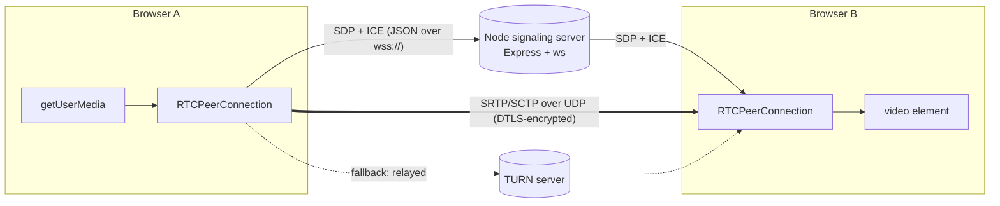
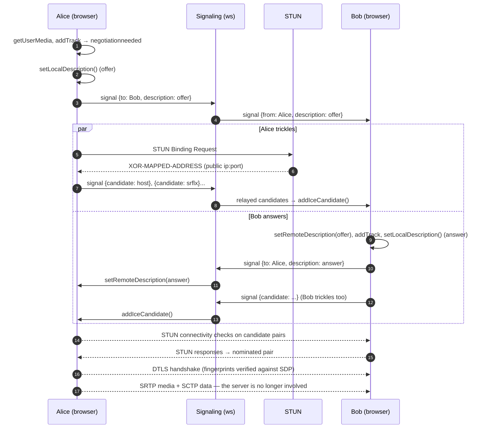
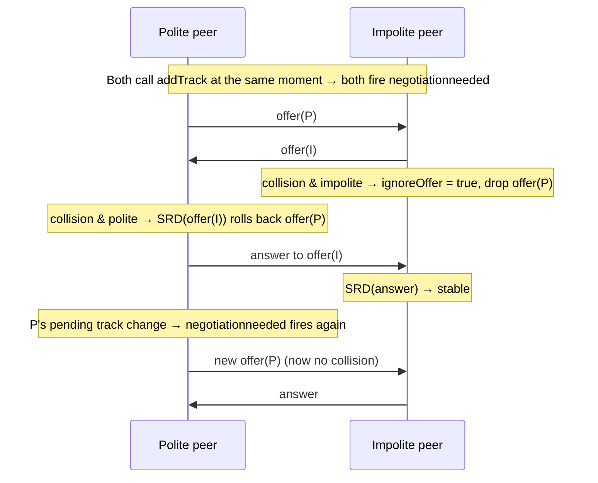

# Chapter 10 — WebRTC Fundamentals: WebSockets as the Signaling Plane

> **Level:** 

**What you'll learn.** Everything so far has moved *messages* over a WebSocket. Audio and video are different: they need sub-150 ms latency, they tolerate loss better than delay, and they are heavy (hundreds of kbit/s to several Mbit/s per stream). In this chapter you will learn why a WebSocket is the wrong pipe for media but the *right* pipe for **signaling**, and you will learn the pieces of WebRTC that do carry the media: `getUserMedia`, `RTCPeerConnection`, SDP offer/answer, ICE candidates and trickle ICE, STUN/TURN (including a working `coturn` config), NAT types, DTLS-SRTP, and data channels. You will implement the **perfect negotiation** pattern, which makes renegotiation glare-proof, and build a 1:1 / small-mesh video call with an Express + `ws` signaling server. Finally you will do the bandwidth math that shows why mesh stops working at around 4 peers. That result leads into Chapter 11 (mediasoup).

> **In plain English:** Two browsers want to send video straight to each other, without your server carrying it. They can't find each other on their own, so your WebSocket server acts as a **matchmaker**: it passes a few small notes back and forth ("here's what I can send", "here's an address you might reach me at"). Once the browsers have swapped those notes, they connect directly and the video flows peer-to-peer. The server only carries the notes. That note-passing is called [signaling](glossary.md#signaling), and it is just the WebSocket messaging you already know from chapters 3–5. The hard part is the vocabulary: [SDP](glossary.md#sdp) is the "what", [ICE](glossary.md#ice) is the "where", and [STUN](glossary.md#stun)/[TURN](glossary.md#turn) help browsers stuck behind home routers and firewalls.

---

## 1. Why not just send video over the WebSocket?

You *can* push encoded frames through a WebSocket. People have tried it, with MediaRecorder chunks and WebCodecs over WS. It works on a LAN and falls apart on real networks:

| Concern | WebSocket (TCP) | WebRTC media (SRTP over UDP) |
|---|---|---|
| Loss handling | TCP retransmits **everything**, in order. One lost packet stalls every packet behind it (**head-of-line blocking**) | Late packets are dropped. The jitter buffer, NACK, FEC and PLC (packet-loss concealment) hide the gap |
| Latency under loss | Grows without limit. Frames arrive seconds late and then all at once | Bounded (about 100–300 ms), because the stream degrades instead of stalling |
| Congestion control | TCP Cubic/BBR, tuned for throughput | GCC / transport-cc, tuned for *real-time*: it changes the **encoder bitrate** as bandwidth changes |
| Path | Always through your server | Direct peer-to-peer where NAT allows, relayed (TURN) only when needed |
| Server cost | Every byte of every stream crosses your Node process | 0 bytes in P2P. With an SFU (ch.11), a C++ worker forwards packets, not Node |
| Codec pipeline | Up to you (WebCodecs, MSE, ...) | Built in: capture → encode → packetize → jitter buffer → decode → render, with echo cancellation, AGC and noise suppression |

So the division of labour is:

- **Signaling plane (WebSocket).** Small, reliable, ordered messages: "I want to call you", "here is my SDP", "here is an ICE candidate", "Bob left". This is the request/response and pub/sub work you already know from chapters 3–5.
- **Media plane (WebRTC).** UDP (TCP/TLS as a fallback), encrypted, congestion-controlled, with no application server in the path.

> WebRTC **deliberately does not specify signaling.** The browser gives you opaque blobs (SDP, candidates) and it is your job to get them to the other side. People have used HTTP polling, SIP, XMPP, MQTT and copy-paste. WebSockets are the common choice because they are bidirectional and low latency, and you already run them.



---

## 2. The building blocks

### 2.1 `getUserMedia`: capture

```js
const stream = await navigator.mediaDevices.getUserMedia({
  audio: { echoCancellation: true, noiseSuppression: true, autoGainControl: true },
  video: { width: { ideal: 1280 }, height: { ideal: 720 }, frameRate: { max: 30 } },
});
// stream.getAudioTracks()[0], stream.getVideoTracks()[0] are MediaStreamTrack objects
```

- It only works in a **secure context**: `https://` or `http://localhost`. On `http://192.168.1.10:3000`, `navigator.mediaDevices` is **`undefined`**. This is the most common "it works on my laptop but not on my phone" bug. Chapter 12 covers TLS.
- Browsers ask for permission. Errors to handle: `NotAllowedError` (the user denied), `NotFoundError` (no device), `NotReadableError` (another app holds the camera), `OverconstrainedError` (you asked for `exact` values the device cannot give).
- Screen sharing is `navigator.mediaDevices.getDisplayMedia()` and needs a user gesture.
- Muting: `track.enabled = false` sends black frames or silence and keeps the connection alive. `track.stop()` releases the device, so the camera light goes off.

### 2.2 `RTCPeerConnection`: the engine

One `RTCPeerConnection` (PC) is one encrypted, congestion-controlled session to **one** remote endpoint. Inside it:

- **Transceivers** (`pc.getTransceivers()`). Each one pairs an `RTCRtpSender` with an `RTCRtpReceiver` and maps to one `m=` line in the SDP. `pc.addTrack(track, stream)` creates a transceiver, or reuses a compatible idle one.
- **ICE agent.** Gathers candidates and runs connectivity checks.
- **DTLS transport.** Key exchange. **SCTP transport.** Data channels.
- Events you will use: `negotiationneeded`, `icecandidate`, `track`, `connectionstatechange`, `iceconnectionstatechange`, `datachannel`.

### 2.3 SDP offer/answer: agreeing on *what*

SDP (Session Description Protocol, RFC 8866) is a text blob that says "here are the media sections I want, the codecs I support, my ICE credentials and my DTLS fingerprint". One side creates an **offer** and the other replies with an **answer**. Here is a trimmed offer with comments:

> 🔬 **Deep dive — optional on first read.** You will never write SDP by hand, and after this chapter mediasoup-client writes it for you. Skim the annotated offer below, then read the two rules underneath it. Those two rules are the part you need.


```text
v=0
o=- 4611731400430051336 2 IN IP4 127.0.0.1
s=-
t=0 0
a=group:BUNDLE 0 1 2                 ← all m-sections share ONE transport (one ICE/DTLS 5-tuple)
m=audio 9 UDP/TLS/RTP/SAVPF 111 63   ← media section #0: audio, payload types 111 (opus), 63 (red)
c=IN IP4 0.0.0.0
a=mid:0
a=ice-ufrag:EsAw                     ← ICE credentials (short-term auth for STUN checks)
a=ice-pwd:bP+XJMM09aR8AiX1jdukzR6Y
a=fingerprint:sha-256 7B:8B:...:A1   ← hash of my DTLS certificate — the peer MUST see this cert
a=setup:actpass                      ← DTLS role negotiation (answerer picks active/passive)
a=sendrecv
a=rtpmap:111 opus/48000/2
a=fmtp:111 minptime=10;useinbandfec=1
m=video 9 UDP/TLS/RTP/SAVPF 96 97 98 ← media section #1: video, VP8/rtx/VP9 ...
a=mid:1
a=rtpmap:96 VP8/90000
a=rtcp-fb:96 nack pli                ← feedback: NACK retransmit, picture loss indication
a=rtcp-fb:96 transport-cc            ← congestion control feedback
a=sendrecv
m=application 9 UDP/DTLS/SCTP webrtc-datachannel   ← section #2: data channels (SCTP)
a=mid:2
a=sctp-port:5000
```

Two details matter for signaling design:

1. **Treat SDP as opaque.** Relay it exactly as you got it. Editing it ("SDP munging") is fragile and mostly unnecessary now. Use `RTCRtpTransceiver.setCodecPreferences()` and `RTCRtpSender.setParameters()` instead.
2. The **fingerprint** ties the encrypted media to the signaling. An attacker who can change your signaling messages can swap in their own fingerprint and sit in the middle. **Your signaling channel must be `wss://` and authenticated** (chapter 6).

### 2.4 ICE and trickle ICE: agreeing on *where*

ICE (Interactive Connectivity Establishment, RFC 8445) finds a working network path. Each side gathers **candidates** (IP:port pairs it might be reachable at):

| Candidate type | Where it comes from | Works when |
|---|---|---|
| `host` | Local interface addresses (often hidden behind an mDNS `xxxx.local` name for privacy) | Same LAN |
| `srflx` (server-reflexive) | Your public IP:port as seen by a **STUN** server | Most home NATs |
| `prflx` (peer-reflexive) | Found during connectivity checks | Found automatically |
| `relay` | An allocation on a **TURN** server | Always, as a last resort (costs you bandwidth) |

Both sides pair local and remote candidates, send STUN binding requests on every pair (**connectivity checks**), and *nominate* the best pair that works.

**Trickle ICE**: you do not wait for gathering to finish (TURN allocation can take seconds). Each candidate is sent over the WebSocket as soon as the `icecandidate` event fires, and the remote side calls `addIceCandidate()` for each one. This is why a signaling server sees many small `candidate` messages right after each description.



### 2.5 NAT types, STUN and TURN

NAT behaviour decides whether STUN is enough:

| NAT behaviour (RFC 4787 terms) | Old name | P2P via STUN? |
|---|---|---|
| Endpoint-independent mapping *and* filtering | Full cone | Yes |
| Endpoint-independent mapping, address-dependent filtering | (Address-)restricted cone | Yes (hole punching) |
| Endpoint-independent mapping, address+port-dependent filtering | Port-restricted cone | Usually |
| **Address/port-dependent mapping** | **Symmetric** (common with carrier-grade NAT and mobile) | **No.** The public port STUN saw is not the one the peer will reach, so you need **TURN** |
| UDP blocked entirely (corporate firewalls) | — | Only **TURN over TCP/TLS on 443** |

As a rule of thumb, 10–20 % of real-world sessions need TURN. If you ship without TURN, those users see "connecting..." forever.

- **STUN** is cheap and stateless: "what is my public address?". Public ones exist (`stun:stun.l.google.com:19302`).
- **TURN** relays every media byte, so it costs bandwidth, which is why you run it yourself and require credentials.

#### coturn: a production-ish `turnserver.conf`

> 🔬 **Deep dive — optional on first read.** You only need this when you actually deploy a TURN server. On a first read, remember that TURN exists, that it relays media, and that it needs short-lived credentials. Then skip ahead to §2.6.

```ini
# /etc/turnserver.conf — coturn 4.6+
listening-port=3478            # STUN/TURN over UDP+TCP
tls-listening-port=5349        # TURN over TLS (use 443 if you can dedicate an IP: passes most firewalls)
listening-ip=0.0.0.0
external-ip=203.0.113.10       # public IP (on cloud VMs: external-ip=PUBLIC/PRIVATE)
relay-ip=10.0.0.5              # private IP of this VM
min-port=49160                 # relay port range — open it in the firewall (UDP)
max-port=49200

realm=turn.example.com
fingerprint
use-auth-secret                # "TURN REST API": time-limited HMAC credentials
static-auth-secret=CHANGE_ME_LONG_RANDOM_SECRET

cert=/etc/letsencrypt/live/turn.example.com/fullchain.pem
pkey=/etc/letsencrypt/live/turn.example.com/privkey.pem

no-multicast-peers
denied-peer-ip=10.0.0.0-10.255.255.255      # don't let clients relay INTO your private network (SSRF!)
denied-peer-ip=172.16.0.0-172.31.255.255
denied-peer-ip=192.168.0.0-192.168.255.255
allowed-peer-ip=10.0.0.5                    # ...except the relay itself if needed
total-quota=1200               # max concurrent allocations
user-quota=12
no-cli
```

With `use-auth-secret`, your Node server gives out short-lived credentials. coturn checks them using the shared secret, so no user database is needed:

```js
import { createHmac } from 'node:crypto';

export function turnCredentials(userId, secret, ttlSeconds = 3600) {
  const username = `${Math.floor(Date.now() / 1000) + ttlSeconds}:${userId}`; // expiry:user
  const credential = createHmac('sha1', secret).update(username).digest('base64');
  return {
    urls: ['turn:turn.example.com:3478?transport=udp', 'turns:turn.example.com:5349?transport=tcp'],
    username,
    credential,
  };
}
```

Test it at <https://webrtc.github.io/samples/src/content/peerconnection/trickle-ice/>: a working TURN setup shows `relay` candidates. To force relay-only in your app while testing, use `new RTCPeerConnection({ iceServers, iceTransportPolicy: 'relay' })`.

### 2.6 DTLS-SRTP: encryption is mandatory

WebRTC has **no unencrypted mode**. Once ICE has a path:

1. A **DTLS** handshake (TLS over UDP) runs over it. Each side checks that the peer's certificate hash matches the `a=fingerprint` in the SDP it received through signaling.
2. Keys exported from DTLS set up **SRTP** (encrypted RTP) for media. Data channels run **SCTP over DTLS**.

This is hop-by-hop encryption. In P2P the hops *are* the endpoints, so it is end-to-end. With an SFU (ch.11) the SFU terminates DTLS and could see the media. True E2EE through an SFU needs *Insertable Streams / SFrame* on top.

### 2.7 Data channels vs WebSocket

`pc.createDataChannel('chat', { ordered, maxRetransmits, maxPacketLifeTime })` gives you a WebSocket-like API (`send`, `onmessage`) that runs **peer-to-peer over SCTP/DTLS**.

| | WebSocket | RTCDataChannel |
|---|---|---|
| Path | Client ↔ server | Peer ↔ peer (or peer ↔ SFU) |
| Reliability | Always reliable and ordered | Configurable: reliable/ordered, or **unordered + unreliable** (`maxRetransmits: 0`), which suits game state and cursors |
| Setup | One HTTP upgrade | Needs a PeerConnection, which needs signaling (a WebSocket!) |
| Server fan-out, auth, persistence | Natural | You have none. Every peer must be trusted |
| Firewalls/proxies | Passes almost everything on 443 | Needs ICE, may need TURN |
| Best for | Chat history, presence, commands, signaling | Low-latency peer data: file transfer, game input, live cursors |

Keep the WebSocket for anything the server must see or store. Use data channels when latency matters and the server should not be in the path.

---

## 3. Perfect negotiation

Negotiation has to happen again every time you add or remove tracks, turn on screen share, or restart ICE. If **both** sides create an offer at the same moment (**glare**), each one gets an offer while in `have-local-offer`, and `setRemoteDescription` throws `InvalidStateError`.

The W3C **perfect negotiation** pattern fixes this by giving each side a role:

- **Polite** peer: on collision it **rolls back** its own offer and accepts the incoming one. (`setRemoteDescription` performs the rollback implicitly.)
- **Impolite** peer: on collision it **ignores** the incoming offer. Its own offer wins.

Both sides then run *the same code*. They never need to know who "called" whom, and adding a track anywhere, at any time, is safe.



The core, per remote peer:

```js
// state per peer: makingOffer, ignoreOffer, isSettingRemoteAnswerPending, polite
pc.onnegotiationneeded = async () => {
  try {
    makingOffer = true;
    await pc.setLocalDescription();          // no args = "create the right description for my state"
    signal({ description: pc.localDescription });
  } finally {
    makingOffer = false;
  }
};

pc.onicecandidate = ({ candidate }) => signal({ candidate });

async function onSignal({ description, candidate }) {
  if (description) {
    const readyForOffer =
      !makingOffer && (pc.signalingState === 'stable' || isSettingRemoteAnswerPending);
    const offerCollision = description.type === 'offer' && !readyForOffer;

    ignoreOffer = !polite && offerCollision;
    if (ignoreOffer) return;                 // impolite: my offer wins

    isSettingRemoteAnswerPending = description.type === 'answer';
    await pc.setRemoteDescription(description); // polite + collision → implicit rollback
    isSettingRemoteAnswerPending = false;

    if (description.type === 'offer') {
      await pc.setLocalDescription();        // creates the answer
      signal({ description: pc.localDescription });
    }
  } else if (candidate !== undefined) {
    try {
      await pc.addIceCandidate(candidate);
    } catch (err) {
      if (!ignoreOffer) throw err;           // candidates for an offer we ignored are expected to fail
    }
  }
}
```

How to pick the polite side: any rule **both sides compute the same way**. In our app, "the peer with the lexicographically greater id is polite".

---

## 4. Mesh topology and the ~4-peer wall

In a **mesh**, every participant has a PeerConnection to every other participant. With *N* participants:

- Connections per client: **N − 1**. Total media streams on the network: **N(N − 1)** per media type.
- Each client **encodes and uploads its video N − 1 times** (each PC has its own congestion controller and encoder instance).
- Each client downloads and decodes N − 1 streams (every mesh topology does this; an SFU helps with *upload*).

Take 720p30 at about **1.5 Mbit/s** and audio at about 40 kbit/s, and look at **uplink per client**:

| Participants N | PCs per client | Uplink per client | Downlink per client | Encoders per client |
|---|---|---|---|---|
| 2 | 1 | 1.5 Mbit/s | 1.5 Mbit/s | 1 |
| 3 | 2 | 3.1 Mbit/s | 3.1 Mbit/s | 2 |
| 4 | 3 | **4.6 Mbit/s** | 4.6 Mbit/s | 3 |
| 6 | 5 | 7.7 Mbit/s | 7.7 Mbit/s | 5 |
| 10 | 9 | **13.9 Mbit/s** | 13.9 Mbit/s | 9 |

Typical home **uplink** is 5–20 Mbit/s and mobile uplink is often 2–10 Mbit/s, and a laptop CPU struggles to run 3 or more concurrent 720p encoders. Around **4 peers** the congestion controllers start lowering bitrate, fans spin up, and quality falls apart for *everyone*, because each client is limited by its worst link. You can lower resolution per peer to push mesh a bit further, but the growth is still O(N) upload and O(N) encodes, and it cannot be fixed on the client.

The fix is to **upload once** to a server that forwards copies: a **Selective Forwarding Unit (SFU)**. That is the next chapter. Our example server enforces `MAX_PEERS = 4` so you can feel the limit.

---

## 5. Building it: `examples/10-webrtc-p2p/`

```
examples/10-webrtc-p2p/
├── server.js          # Express static + /config + ws signaling on /ws
├── test-signaling.js  # Node ws client test: join, relay, room_full, peer:left
├── README.md
└── public/
    ├── index.html
    └── app.js         # getUserMedia + perfect negotiation mesh + data-channel chat + stats
```

### 5.1 The signaling protocol

We reuse the chapter 4 envelope `{ type, id, payload, replyTo? }`. The server is a **dumb router**. It checks *who may talk to whom* (same room) but never reads SDP.

| Direction | `type` | `payload` |
|---|---|---|
| C → S (request) | `room:join` | `{ room, name }` |
| S → C (reply, `replyTo`) | `room:joined` | `{ selfId, peers: [{ id, name }] }` |
| S → others | `peer:joined` | `{ id, name }` |
| C → S | `signal` | `{ to, data }` where `data` is `{ description }` or `{ candidate }` |
| S → C | `signal` | `{ from, data }` |
| S → others | `peer:left` | `{ id }` |
| S → C | `error` | `{ code, message }` (`room_full`, `unknown_peer`, ...) |

**Who initiates?** The **newcomer** creates a PC for each existing peer and adds its tracks, which fires `negotiationneeded` and sends an offer. Existing peers create their PC lazily when the first `signal` from that peer arrives. Perfect negotiation stays in place underneath, so later renegotiations (screen share, ICE restarts) from either side are safe.

### 5.2 The server

```js
// examples/10-webrtc-p2p/server.js
import http from 'node:http';
import path from 'node:path';
import { randomUUID } from 'node:crypto';
import { fileURLToPath } from 'node:url';
import express from 'express';
import { WebSocketServer } from 'ws';

const __dirname = path.dirname(fileURLToPath(import.meta.url));
const PORT = Number(process.env.PORT ?? 3000);
const MAX_PEERS_PER_ROOM = Number(process.env.MAX_PEERS ?? 4); // mesh ceiling (section 4)

const app = express();
app.use(express.static(path.join(__dirname, 'public')));

// ICE servers come from the backend so TURN credentials can rotate without
// redeploying the client. In production, mint them per user with turnCredentials().
app.get('/config', (_req, res) => {
  const iceServers = [{ urls: process.env.STUN_URL ?? 'stun:stun.l.google.com:19302' }];
  if (process.env.TURN_URL) {
    iceServers.push({
      urls: process.env.TURN_URL.split(','),
      username: process.env.TURN_USERNAME,
      credential: process.env.TURN_CREDENTIAL,
    });
  }
  res.json({ iceServers, maxPeers: MAX_PEERS_PER_ROOM });
});

const server = http.createServer(app);
const wss = new WebSocketServer({ noServer: true, maxPayload: 64 * 1024 }); // SDP is a few KB

server.on('upgrade', (req, socket, head) => {
  const { pathname } = new URL(req.url, 'http://localhost');
  if (pathname !== '/ws') return socket.destroy();
  // In production: authenticate here (ch.6) — a forged signaling peer can MITM via fingerprints.
  wss.handleUpgrade(req, socket, head, (ws) => wss.emit('connection', ws, req));
});

/** room name -> Map(peerId -> { ws, name }) */
const rooms = new Map();

const send = (ws, type, payload, replyTo) => {
  if (ws.readyState !== ws.OPEN) return;
  ws.send(JSON.stringify({ type, id: randomUUID(), payload, ...(replyTo && { replyTo }) }));
};

wss.on('connection', (ws) => {
  const peerId = randomUUID();   // server-assigned: clients can't spoof "from"
  let roomName = null;

  ws.isAlive = true;
  ws.on('pong', () => (ws.isAlive = true));

  ws.on('message', (raw) => {
    let msg;
    try {
      msg = JSON.parse(raw);
    } catch {
      return send(ws, 'error', { code: 'bad_json', message: 'Invalid JSON' });
    }
    const { type, id, payload = {} } = msg;

    switch (type) {
      case 'room:join': {
        if (roomName) return send(ws, 'error', { code: 'already_joined', message: roomName }, id);
        const name = String(payload.room ?? '').slice(0, 64);
        if (!name) return send(ws, 'error', { code: 'bad_room', message: 'room required' }, id);
        const room = rooms.get(name) ?? new Map();
        if (room.size >= MAX_PEERS_PER_ROOM) {
          return send(ws, 'error', { code: 'room_full', message: `mesh limit ${MAX_PEERS_PER_ROOM}` }, id);
        }
        const displayName = String(payload.name ?? 'anon').slice(0, 32);
        const peers = [...room].map(([pid, p]) => ({ id: pid, name: p.name }));
        room.set(peerId, { ws, name: displayName });
        rooms.set(name, room);
        roomName = name;
        send(ws, 'room:joined', { selfId: peerId, peers }, id);
        for (const [pid, p] of room) if (pid !== peerId) send(p.ws, 'peer:joined', { id: peerId, name: displayName });
        break;
      }

      case 'signal': {
        // Pure relay. We validate the *routing* (same room), not the SDP itself.
        const target = roomName && rooms.get(roomName)?.get(payload.to);
        if (!target) return send(ws, 'error', { code: 'unknown_peer', message: String(payload.to) }, id);
        send(target.ws, 'signal', { from: peerId, data: payload.data });
        break;
      }

      default:
        send(ws, 'error', { code: 'unknown_type', message: String(type) }, id);
    }
  });

  ws.on('close', () => {
    if (!roomName) return;
    const room = rooms.get(roomName);
    room?.delete(peerId);
    if (room?.size === 0) rooms.delete(roomName);
    else for (const p of room?.values() ?? []) send(p.ws, 'peer:left', { id: peerId });
  });
});

// Heartbeat (ch.5): drop half-open sockets so "peer:left" fires promptly.
const heartbeat = setInterval(() => {
  for (const ws of wss.clients) {
    if (!ws.isAlive) { ws.terminate(); continue; }
    ws.isAlive = false;
    ws.ping();
  }
}, 30_000);
wss.on('close', () => clearInterval(heartbeat));

server.listen(PORT, () => {
  console.log(`[ex10] signaling on http://localhost:${server.address().port}  (ws path /ws)`);
});
```

Design notes:

- **The server assigns the `from`.** Clients never say who they are in a `signal`, so they cannot pose as another peer.
- **`maxPayload: 64 KiB`.** An SDP with many codecs is about 5–10 KB. Anything much bigger is abuse.
- `peer:left` is also the way to **hang up**. Closing the WebSocket tears down every PC for that peer. The PCs would also notice on their own (ICE `disconnected` → `failed` after about 30 s), but signaling is much faster.
- **Media never touches this process.** You could host a thousand 1:1 calls on a tiny VM, because only about 20 small messages cross it per call setup.

### 5.3 The page

```html
<!doctype html>
<!-- examples/10-webrtc-p2p/public/index.html -->
<html lang="en">
<head>
  <meta charset="utf-8" />
  <meta name="viewport" content="width=device-width, initial-scale=1" />
  <title>Ch.10 — WebRTC P2P mesh</title>
  <style>
    body { font-family: system-ui, sans-serif; margin: 0; background: #111; color: #eee; }
    header { display: flex; gap: .5rem; align-items: center; padding: .75rem 1rem; background: #1b1b1b; flex-wrap: wrap; }
    #grid { display: grid; grid-template-columns: repeat(auto-fill, minmax(280px, 1fr)); gap: .5rem; padding: .5rem; }
    figure { margin: 0; position: relative; background: #000; border-radius: 8px; overflow: hidden; aspect-ratio: 16/9; }
    video { width: 100%; height: 100%; object-fit: cover; }
    figcaption { position: absolute; left: .5rem; bottom: .5rem; background: #0009; padding: .1rem .4rem; border-radius: 4px; font-size: .8rem; }
    #chat { padding: .5rem 1rem; font-size: .9rem; }
    #log { height: 7rem; overflow: auto; background: #1b1b1b; padding: .5rem; border-radius: 6px; }
    button, input { font: inherit; }
  </style>
</head>
<body>
  <header>
    <strong>Room:</strong> <span id="room"></span>
    <button id="join">Join call</button>
    <button id="mic" disabled>Mute mic</button>
    <button id="cam" disabled>Stop cam</button>
    <span id="status">idle</span>
  </header>
  <main id="grid">
    <figure><video id="local" autoplay playsinline muted></video><figcaption>you</figcaption></figure>
  </main>
  <section id="chat">
    <div id="log"></div>
    <form id="chat-form"><input id="chat-input" placeholder="data-channel chat (P2P, not via server)" size="40" /> <button>Send</button></form>
  </section>
  <script type="module" src="./app.js"></script>
</body>
</html>
```

The local `<video>` is `muted`, so you do not hear yourself, and `playsinline`, so iOS does not open fullscreen. The **Join** button is there because browsers only allow audible autoplay and camera prompts reliably after a **user gesture**.

### 5.4 The client: signaling + perfect negotiation mesh

```js
// examples/10-webrtc-p2p/public/app.js
const $ = (sel) => document.querySelector(sel);
const params = new URLSearchParams(location.search);
const roomName = params.get('room') ?? 'demo';
const displayName = params.get('name') ?? `guest-${Math.random().toString(36).slice(2, 6)}`;
$('#room').textContent = roomName;

let selfId = null;
let localStream = null;
let iceServers = [];
/** peerId -> { id, pc, name, polite, makingOffer, ignoreOffer, isSettingRemoteAnswerPending, mediaAttached, dc, tile, queue } */
const peers = new Map();
const names = new Map();

// ---------------------------------------------------------------- signaling (ch.4 envelope)
let ws;
const pending = new Map(); // request id -> { resolve, reject }

function send(type, payload) {
  const id = crypto.randomUUID();
  ws.send(JSON.stringify({ type, id, payload }));
  return id;
}

function request(type, payload, timeoutMs = 10_000) {
  return new Promise((resolve, reject) => {
    const id = send(type, payload);
    pending.set(id, { resolve, reject });
    setTimeout(() => pending.delete(id) && reject(new Error(`${type} timed out`)), timeoutMs);
  });
}

const signal = (to, data) => send('signal', { to, data });

function connectSignaling() {
  return new Promise((resolve, reject) => {
    ws = new WebSocket(`${location.protocol === 'https:' ? 'wss' : 'ws'}://${location.host}/ws`);
    ws.onopen = resolve;
    ws.onerror = reject;
    ws.onclose = () => setStatus('signaling closed');
    ws.onmessage = ({ data }) => {
      const msg = JSON.parse(data);
      if (msg.replyTo && pending.has(msg.replyTo)) {
        const { resolve, reject } = pending.get(msg.replyTo);
        pending.delete(msg.replyTo);
        return msg.type === 'error' ? reject(new Error(msg.payload.code)) : resolve(msg.payload);
      }
      switch (msg.type) {
        case 'peer:joined': names.set(msg.payload.id, msg.payload.name); break; // they will call us
        case 'peer:left': closePeer(msg.payload.id); break;
        case 'signal': enqueue(msg.payload.from, msg.payload.data); break;
        case 'error': console.warn('server error', msg.payload); break;
      }
    };
  });
}

// ---------------------------------------------------------------- peers
function createPeer(id, { initiator }) {
  const pc = new RTCPeerConnection({ iceServers });
  const peer = {
    id, pc, name: names.get(id) ?? id.slice(0, 6),
    polite: selfId > id,            // any rule both sides agree on
    makingOffer: false, ignoreOffer: false, isSettingRemoteAnswerPending: false,
    mediaAttached: false, dc: null, tile: addTile(id), queue: Promise.resolve(),
  };
  peers.set(id, peer);

  pc.onnegotiationneeded = async () => {
    try {
      peer.makingOffer = true;
      await pc.setLocalDescription();
      signal(id, { description: pc.localDescription });
    } catch (err) {
      console.error('negotiation failed', err);
    } finally {
      peer.makingOffer = false;
    }
  };
  pc.onicecandidate = ({ candidate }) => signal(id, { candidate }); // null = end-of-candidates
  pc.ontrack = ({ streams: [stream] }) => { peer.tile.video.srcObject = stream; };
  pc.oniceconnectionstatechange = () => {
    if (pc.iceConnectionState === 'failed') pc.restartIce(); // triggers negotiationneeded with ICE restart
  };
  pc.onconnectionstatechange = () => {
    peer.tile.caption.textContent = `${peer.name} · ${pc.connectionState}`;
  };

  if (initiator) attachLocalMedia(peer); // → negotiationneeded → offer
  return peer;
}

// Add our tracks + a pre-negotiated data channel. Called up-front by the initiator,
// or by the answerer right AFTER setRemoteDescription(offer), so addTrack reuses the
// transceivers the offer created instead of adding extra m-lines.
function attachLocalMedia(peer) {
  if (peer.mediaAttached) return;
  peer.mediaAttached = true;
  for (const track of localStream.getTracks()) peer.pc.addTrack(track, localStream);
  // negotiated:true + same id on both sides → no 'datachannel' event / extra round trip
  peer.dc = peer.pc.createDataChannel('chat', { negotiated: true, id: 0 });
  peer.dc.onmessage = ({ data }) => log(`${peer.name}: ${data}`);
}

// Serialize signal handling per peer: each message waits for the previous one.
function enqueue(from, data) {
  const peer = peers.get(from) ?? createPeer(from, { initiator: false });
  peer.queue = peer.queue.then(() => handleSignal(peer, data)).catch((err) => console.error(err));
}

async function handleSignal(peer, { description, candidate }) {
  const { pc } = peer;
  if (description) {
    const readyForOffer =
      !peer.makingOffer && (pc.signalingState === 'stable' || peer.isSettingRemoteAnswerPending);
    const offerCollision = description.type === 'offer' && !readyForOffer;
    peer.ignoreOffer = !peer.polite && offerCollision;
    if (peer.ignoreOffer) return;

    peer.isSettingRemoteAnswerPending = description.type === 'answer';
    await pc.setRemoteDescription(description);
    peer.isSettingRemoteAnswerPending = false;

    if (description.type === 'offer') {
      attachLocalMedia(peer);            // no-op if already attached
      await pc.setLocalDescription();    // answer
      signal(peer.id, { description: pc.localDescription });
    }
  } else if (candidate !== undefined) {
    try {
      await pc.addIceCandidate(candidate);
    } catch (err) {
      if (!peer.ignoreOffer) throw err;
    }
  }
}

function closePeer(id) {
  const peer = peers.get(id);
  if (!peer) return;
  peer.pc.close();
  peer.tile.figure.remove();
  peers.delete(id);
  log(`${peer.name} left`);
}

// ---------------------------------------------------------------- UI helpers
function addTile(id) {
  const figure = document.createElement('figure');
  const video = Object.assign(document.createElement('video'), { autoplay: true, playsInline: true });
  const caption = document.createElement('figcaption');
  caption.textContent = names.get(id) ?? id.slice(0, 6);
  figure.append(video, caption);
  $('#grid').append(figure);
  return { figure, video, caption };
}
const setStatus = (text) => ($('#status').textContent = text);
const log = (line) => { $('#log').append(Object.assign(document.createElement('div'), { textContent: line })); $('#log').scrollTop = 1e9; };

// ---------------------------------------------------------------- stats: which path did ICE pick?
setInterval(async () => {
  for (const peer of peers.values()) {
    const stats = await peer.pc.getStats();
    let pair, local, outVideo;
    stats.forEach((r) => {
      if (r.type === 'transport' && r.selectedCandidatePairId) pair = stats.get(r.selectedCandidatePairId);
      if (r.type === 'outbound-rtp' && r.kind === 'video') outVideo = r;
    });
    if (pair) local = stats.get(pair.localCandidateId);
    const kbps = outVideo && peer.lastBytes != null ? Math.round(((outVideo.bytesSent - peer.lastBytes) * 8) / 2000) : 0;
    peer.lastBytes = outVideo?.bytesSent;
    peer.tile.caption.textContent =
      `${peer.name} · ${peer.pc.connectionState} · ${local?.candidateType ?? '?'} · ↑${kbps} kbps · rtt ${pair?.currentRoundTripTime ? Math.round(pair.currentRoundTripTime * 1000) : '?'} ms`;
  }
}, 2000);

// ---------------------------------------------------------------- controls
$('#join').onclick = async () => {
  $('#join').disabled = true;
  try {
    setStatus('getting media…');
    ({ iceServers } = await (await fetch('/config')).json());
    localStream = await navigator.mediaDevices.getUserMedia({
      audio: true,
      video: { width: { ideal: 640 }, height: { ideal: 360 }, frameRate: { max: 24 } }, // mesh-friendly
    });
    $('#local').srcObject = localStream;

    setStatus('connecting…');
    await connectSignaling();
    const joined = await request('room:join', { room: roomName, name: displayName });
    selfId = joined.selfId;
    for (const p of joined.peers) {
      names.set(p.id, p.name);
      createPeer(p.id, { initiator: true }); // newcomer calls everyone already here
    }
    setStatus(`in room as ${displayName} (${joined.peers.length} other peer(s))`);
    $('#mic').disabled = $('#cam').disabled = false;
  } catch (err) {
    setStatus(`error: ${err.message}`);
    $('#join').disabled = false;
  }
};

$('#mic').onclick = () => {
  const t = localStream.getAudioTracks()[0];
  t.enabled = !t.enabled;
  $('#mic').textContent = t.enabled ? 'Mute mic' : 'Unmute mic';
};
$('#cam').onclick = () => {
  const t = localStream.getVideoTracks()[0];
  t.enabled = !t.enabled;
  $('#cam').textContent = t.enabled ? 'Stop cam' : 'Start cam';
};
$('#chat-form').onsubmit = (e) => {
  e.preventDefault();
  const text = $('#chat-input').value.trim();
  if (!text) return;
  for (const p of peers.values()) if (p.dc?.readyState === 'open') p.dc.send(text);
  log(`me: ${text}`);
  $('#chat-input').value = '';
};
```

What to notice:

1. **The per-peer promise queue (`enqueue`).** WebSocket messages arrive in order, but an `async` handler can interleave: a `candidate` could start processing while `setRemoteDescription(offer)` is still pending. `RTCPeerConnection` runs its own operations chain, so this mostly works anyway, but explicit serialization makes the perfect-negotiation flags (`makingOffer`, `isSettingRemoteAnswerPending`) easy to reason about.
2. **`attachLocalMedia` after `setRemoteDescription(offer)` on the answerer.** If you `addTrack` *before* applying the remote offer, the browser creates **new** transceivers, the answer ends up with extra `m=` lines, and a second round of negotiation follows. Adding afterwards **reuses** the transceivers the offer created.
3. **`negotiated: true, id: 0` data channel.** Both sides create the channel with the same id, so there is no `ondatachannel` dance. The initiator creates it *before* its first offer, so it is covered by that single negotiation.
4. **`pc.restartIce()`** on `failed`. This generates new ICE credentials and re-runs gathering through the normal `negotiationneeded` path, which works because perfect negotiation is in place.
5. **The stats loop** shows the selected candidate type. `host` means LAN, `srflx` means NAT traversal with STUN, and `relay` means your TURN server is carrying the call.

### 5.5 Run it

```bash
npm run ex:10
# open http://localhost:3000/?room=demo&name=alice  in one tab
# open http://localhost:3000/?room=demo&name=bob    in another tab (or another browser)
# To test from a phone on your LAN you need HTTPS (secure context) — see ch.12, or use a tunnel.
```

Open `chrome://webrtc-internals` (Chrome) or `about:webrtc` (Firefox) during the call. You will see every `setLocalDescription`/`setRemoteDescription`, the candidate pairs and bitrate graphs. It is the most useful WebRTC debugging tool there is.

### 5.6 Testing the signaling server without a browser

The signaling server is plain WebSocket JSON, so the Node `ws` client from chapter 9 can test it without any WebRTC. The script starts the server on a random port and checks join → relay → room full → leave:

```js
// examples/10-webrtc-p2p/test-signaling.js   —  run: node examples/10-webrtc-p2p/test-signaling.js
import { spawn } from 'node:child_process';
import { once } from 'node:events';
import assert from 'node:assert/strict';
import { fileURLToPath } from 'node:url';
import WebSocket from 'ws';

const serverPath = fileURLToPath(new URL('./server.js', import.meta.url));
const proc = spawn(process.execPath, [serverPath], { env: { ...process.env, PORT: '0', MAX_PEERS: '2' } });
const [chunk] = await once(proc.stdout, 'data');
const port = Number(/localhost:(\d+)/.exec(String(chunk))[1]);

// Tiny client: buffers messages so we can `await next(type)` without races.
function client() {
  const ws = new WebSocket(`ws://localhost:${port}/ws`);
  const inbox = [];
  const waiters = [];
  ws.on('message', (raw) => {
    const msg = JSON.parse(raw);
    const i = waiters.findIndex((w) => w.type === msg.type);
    if (i >= 0) waiters.splice(i, 1)[0].resolve(msg);
    else inbox.push(msg);
  });
  return {
    ws,
    open: () => once(ws, 'open'),
    send: (type, payload, id = crypto.randomUUID()) => (ws.send(JSON.stringify({ type, id, payload })), id),
    next: (type) => {
      const i = inbox.findIndex((m) => m.type === type);
      if (i >= 0) return Promise.resolve(inbox.splice(i, 1)[0]);
      return new Promise((resolve) => waiters.push({ type, resolve }));
    },
  };
}

try {
  const cfg = await (await fetch(`http://localhost:${port}/config`)).json();
  assert.ok(cfg.iceServers.length >= 1, '/config returns iceServers');

  const alice = client(); const bob = client(); const carol = client();
  await Promise.all([alice.open(), bob.open(), carol.open()]);

  const joinId = alice.send('room:join', { room: 't', name: 'alice' });
  const aJoined = await alice.next('room:joined');
  assert.equal(aJoined.replyTo, joinId, 'reply correlates with request id');
  assert.deepEqual(aJoined.payload.peers, []);

  bob.send('room:join', { room: 't', name: 'bob' });
  const bJoined = await bob.next('room:joined');
  assert.equal(bJoined.payload.peers[0].name, 'alice');
  const pj = await alice.next('peer:joined');
  assert.equal(pj.payload.id, bJoined.payload.selfId);

  // Relay: bob -> alice, "from" is stamped by the server
  const fakeOffer = { description: { type: 'offer', sdp: 'v=0\r\n...' } };
  bob.send('signal', { to: aJoined.payload.selfId, data: fakeOffer });
  const sig = await alice.next('signal');
  assert.equal(sig.payload.from, bJoined.payload.selfId);
  assert.deepEqual(sig.payload.data, fakeOffer);

  // Relay to unknown peer → error
  bob.send('signal', { to: 'nobody', data: {} });
  assert.equal((await bob.next('error')).payload.code, 'unknown_peer');

  // Mesh limit (MAX_PEERS=2)
  carol.send('room:join', { room: 't', name: 'carol' });
  assert.equal((await carol.next('error')).payload.code, 'room_full');

  // Leaving
  bob.ws.close();
  assert.equal((await alice.next('peer:left')).payload.id, bJoined.payload.selfId);

  alice.ws.close(); carol.ws.close();
  console.log('✔ signaling relay tests passed');
} catch (err) {
  console.error('✘', err);
  process.exitCode = 1;
} finally {
  proc.kill();
}
```

---

## Common pitfalls

1. **`navigator.mediaDevices` is undefined.** You are not in a secure context. Use HTTPS or `localhost`.
2. **Sending candidates before the description.** Trickle ordering matters. Candidates that arrive before `setRemoteDescription` either throw or are dropped, depending on timing. Keep the signaling channel ordered (a WebSocket is) and serialize handling per peer.
3. **No TURN in production.** Everything works in the office, then 10–20 % of customers on mobile or corporate networks never connect. Deploy coturn with TLS on 443.
4. **TURN as an open relay / SSRF.** Without `denied-peer-ip` rules, anyone with credentials can reach your private network through your TURN server. Use short-lived HMAC credentials, never static ones in client JS.
5. **Glare without perfect negotiation.** Two `negotiationneeded` events at once lead to `InvalidStateError: Called in wrong state: have-local-offer`.
6. **`addTrack` on the answerer before `setRemoteDescription`.** You get duplicate transceivers and a surprise second negotiation.
7. **Editing SDP with regexes.** It breaks on the next browser release. Use `setCodecPreferences` and `sender.setParameters({ encodings })` instead.
8. **Unauthenticated signaling.** Whoever controls signaling controls the DTLS fingerprints, which means they can do a man-in-the-middle attack. Use `wss://` + auth (ch.6).
9. **Scaling mesh by "just lowering resolution".** It buys you one or two more peers, and the O(N) uplink and encoder growth is still there.
10. **Forgetting `playsinline` / `muted`.** iOS opens fullscreen, autoplay is blocked, or you hear an echo of yourself.

## Exercises

1. **Screen share.** Add a "Share screen" button that calls `getDisplayMedia()` and `sender.replaceTrack()` on every PC's video sender. Then do it again with `addTrack` (a second video) and watch perfect negotiation renegotiate from *either* side.
2. **Force TURN.** Run coturn locally in Docker, add `iceTransportPolicy: 'relay'` behind a `?relay=1` query flag, and confirm the stats caption shows `relay`.
3. **Glare test.** Make both peers `addTrack` a canvas stream (`canvas.captureStream()`) at the same moment (triggered by a `signal` from one side) and check in `chrome://webrtc-internals` that one offer was rolled back.
4. **Unreliable channel.** Add a second data channel `{ negotiated: true, id: 1, ordered: false, maxRetransmits: 0 }` that streams your mouse position at 60 Hz, and draw other peers' cursors.
5. **Bandwidth cap.** Use `sender.setParameters()` to set `encodings[0].maxBitrate` to 300 kbps when the room has 4 or more peers, and measure uplink in the stats loop.

<details><summary>Hints</summary>

- (1) `pc.getSenders().find(s => s.track?.kind === 'video').replaceTrack(screenTrack)`: `replaceTrack` does **not** need renegotiation. Listen for `screenTrack.onended` to switch back.
- (2) `docker run --network host coturn/coturn -n --lt-cred-mech --user=u:p --realm=local --listening-port=3478`, then `TURN_URL=turn:127.0.0.1:3478 TURN_USERNAME=u TURN_CREDENTIAL=p npm run ex:10`.
- (3) Look for `setRemoteDescription(offer)` while in `have-local-offer` on the polite side. Its log shows an implicit `rollback`.
- (4) Unordered + `maxRetransmits: 0` behaves like UDP. Send only the latest state, never deltas.
- (5) `const p = sender.getParameters(); p.encodings[0].maxBitrate = 300_000; await sender.setParameters(p);`
</details>

## Check your understanding

1. **Conceptual.** Why is a WebSocket a good pipe for signaling but a poor pipe for live video?

   <details><summary>Answer</summary>

   A WebSocket runs over TCP, which retransmits every lost packet in order. One lost packet holds up everything behind it (head-of-line blocking), so under loss the video arrives late and then all at once. Live media would rather drop a late packet and move on, which WebRTC's SRTP-over-UDP does. Signaling is the opposite: a few small messages that must all arrive, in order. That is exactly what TCP and a WebSocket are good at.
   </details>

2. **What happens if…** you ship with only a STUN server configured, and a user is on a mobile network behind symmetric NAT (or a corporate firewall that blocks UDP)?

   <details><summary>Answer</summary>

   Signaling works: the WebSocket connects and offers and answers are exchanged. But ICE never finds a working candidate pair, so the call sits on "connecting..." forever. Symmetric NAT gives the peer a different public port from the one STUN saw, and a UDP-blocking firewall stops everything that isn't TCP/TLS. Only a **TURN** relay, ideally reachable over TLS on 443, rescues these users. That is 10–20 % of real sessions.
   </details>

3. **Read the code.** In the perfect negotiation `onSignal` from §3, the **impolite** peer receives an `offer` while `makingOffer` is `true`. Trace what happens. Why is `addIceCandidate` wrapped in a `try/catch` that re-throws only when `!ignoreOffer`?

   <details><summary>Answer</summary>

   `readyForOffer` is `false` because `makingOffer` is true, so `offerCollision` is `true`. The peer is impolite, so `ignoreOffer = true` and the function returns: the incoming offer is dropped and the impolite peer's own offer wins. The remote side keeps trickling candidates that belong to the offer that was dropped. Adding them fails, and that failure is expected, so it is swallowed. Any *other* candidate error is a real bug and is re-thrown.
   </details>

4. **What happens if…** an attacker can modify your signaling messages in transit (plain `ws://`, no auth)? DTLS encrypts the media, so why does this matter?

   <details><summary>Answer</summary>

   The SDP carries the `a=fingerprint` of each side's DTLS certificate, and DTLS only checks that the peer's certificate matches the fingerprint *it received through signaling*. An attacker who can rewrite signaling can swap in their own fingerprint and ICE candidates and sit in the middle, decrypting and re-encrypting everything. The encryption is only as trustworthy as the signaling channel, so use `wss://` plus authentication (ch.6).
   </details>

5. **Do the math.** Five people are in a mesh call, each sending 720p video at about 1.5 Mbit/s. How many PeerConnections does each browser hold, what is each browser's video uplink, and how many video encoders is each laptop running? What would the uplink be with an SFU?

   <details><summary>Answer</summary>

   Each browser holds N − 1 = **4** PeerConnections, uploads 4 × 1.5 = **6 Mbit/s** of video and runs **4** encoders. Across the network that is 5 × 4 = 20 video streams. With an SFU each browser uploads its video **once** (about 1.5 Mbit/s, a bit more with simulcast) and the server forwards the copies. That is where Chapter 11 starts.
   </details>

## Key takeaways

- WebSockets carry **signaling**: small, reliable, ordered JSON. WebRTC carries **media** over UDP with real-time congestion control and mandatory DTLS-SRTP encryption.
- A session is **SDP offer/answer** (what) + **ICE candidates** (where) + **DTLS** (who, via the fingerprints). Signaling moves all three, so secure it.
- STUN is enough for most NATs. **Symmetric NAT and UDP-blocking firewalls need TURN**, so deploy coturn with time-limited credentials.
- **Perfect negotiation** (polite/impolite, `makingOffer`, `ignoreOffer`, implicit rollback) makes renegotiation safe from both sides with identical code.
- Data channels are P2P, configurable-reliability sockets. Keep server-visible state on the WebSocket.
- Mesh costs **O(N) uplink and O(N) encoders per client** and falls apart at about 4 peers. The answer is an SFU.

---

## Before chapter 11

Chapter 11 replaces the mesh with a server that forwards media: an [SFU](glossary.md#sfu). It is the steepest chapter in the course, so check that the ideas below feel solid first. For each one you should be able to explain it out loud to a colleague in two or three sentences.

- [ ] **Signaling vs media.** The WebSocket carries small JSON "notes". Audio and video travel on a separate, UDP-based, encrypted path. (§1)
- [ ] **One `RTCPeerConnection` = one encrypted session to one other endpoint.** Tracks you add become senders, and tracks you receive arrive in the `track` event. (§2.2)
- [ ] **SDP offer/answer is the "what".** It lists codecs, media sections, ICE credentials and the DTLS fingerprint. You relay it as an opaque blob. (§2.3)
- [ ] **ICE candidates are the "where".** You know `host` vs `srflx` vs `relay`, and why candidates *trickle* in as separate messages. (§2.4)
- [ ] **STUN vs TURN.** STUN tells you your public address. TURN relays your media when nothing else works. (§2.5)
- [ ] **DTLS fingerprints tie the media encryption to the signaling**, which is why signaling must be `wss://` and authenticated. (§2.6)
- [ ] **The mesh math.** Each client pays O(N) uplink and O(N) encoders, which is why mesh stops at about 4 peers. (§4)
- [ ] **Request/response over a WebSocket** (ch.4 envelope: `id` + `replyTo`), wrapped in a promise-returning `request(type, payload)` helper. Chapter 11 uses it for *every* step.
- [ ] **Callbacks as a "reply later" handle.** You're comfortable with an event handler that receives `callback`/`errback` functions and must call exactly one of them when an async operation finishes.

**Good news: what you can let go of.** In chapter 11 you will *not* write offers, answers or perfect negotiation yourself. The `mediasoup-client` library generates and applies all the SDP inside the browser. Knowing what it does for you (this chapter) is what lets you debug it when it goes wrong.

Next → [Chapter 11 — mediasoup: Building an SFU](./11-mediasoup.md)
