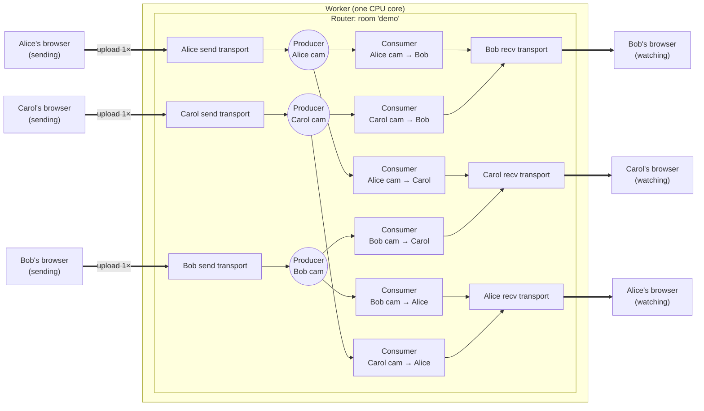
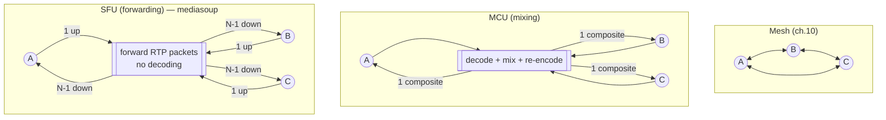
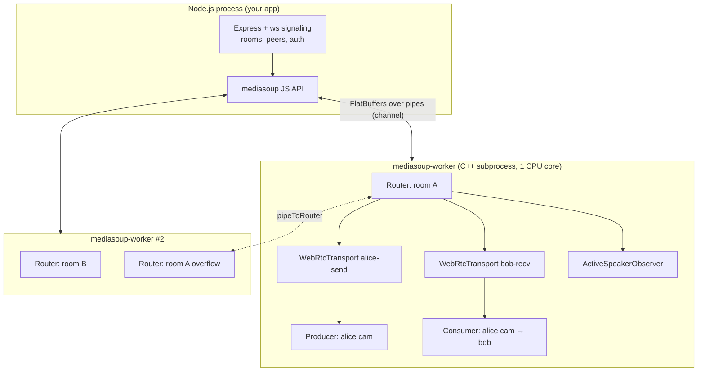
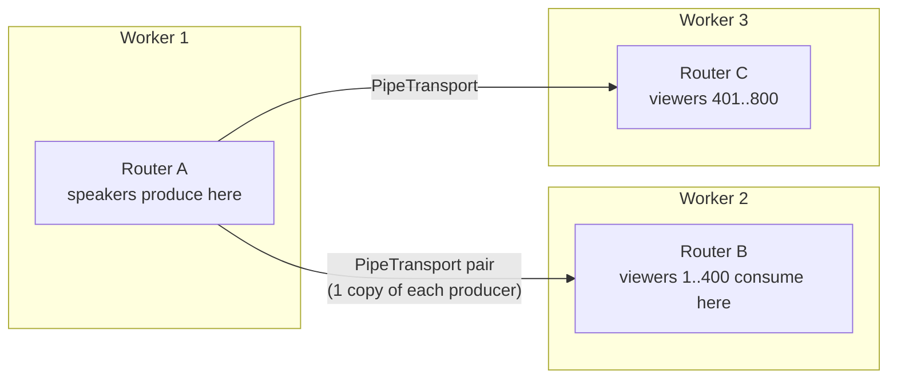

# Chapter 11 — mediasoup: Building an SFU with WebSocket Signaling

> **Level:** 

**What you'll learn.** Chapter 10 ended at the mesh wall: every participant uploads its video N − 1 times. In this chapter you replace the mesh with a **Selective Forwarding Unit** built on **mediasoup v3**. You will learn the three multiparty topologies (Mesh, MCU, SFU) and their costs. You will learn mediasoup's object model (**Worker → Router → Transport → Producer/Consumer**, plus DataProducer/DataConsumer), how the browser side (`mediasoup-client`'s **Device**) maps its `connect` / `produce` events to WebSocket request/response messages, and the complete signaling flow, step by step. Then you will go past the basics: **simulcast & SVC** with `setPreferredLayers`, **active speaker detection**, **stats**, **`pipeToRouter`** for rooms bigger than one CPU core, and **recording** with a `PlainTransport` feeding FFmpeg/GStreamer. The full server and client of `examples/11-mediasoup-minimal/` are printed and explained here, so you can learn everything from this page.

> **In plain English:** In chapter 10 every browser sent its video to every other browser, and that broke down at about 4 people. Now every browser sends its video **once**, to your server. The server makes copies and hands one copy to each person who wants to watch. It never opens or re-encodes the video, it just forwards packets. That kind of server is called an [SFU](glossary.md#sfu), and **mediasoup** is a Node library that gives you one. mediasoup does the heavy media work in C++. Everything else, including rooms, users and the conversation with the browser, is your WebSocket code, exactly like chapters 3–9.

---

## Bridge: from peer-to-peer to an SFU, in plain English

Read this section before any mediasoup code. It has no new APIs, only the mental model the rest of the chapter hangs on.

### Where chapter 10 left you

In chapter 10 you built a video call where:

- An Express + `ws` server relayed **signaling** messages (SDP descriptions and ICE candidates) between browsers in a room.
- Each browser held **one `RTCPeerConnection` per other participant** and used perfect negotiation to create and answer offers.
- Media flowed **directly between browsers**. Your server never saw a video packet.

That design hits a wall: **mesh bandwidth**. With N people, each browser encodes and uploads its video N − 1 times. At 4 peers that is about 4.6 Mbit/s of uplink and 3 simultaneous encoders per laptop, and quality collapses for everyone. You cannot fix that on the client. The fix is to upload **once** to something that makes the copies.

### The analogy: a post office for video

Think of the SFU as a **post office**. Each participant mails *one* copy of their video to the post office. The post office photocopies it for every subscriber and delivers it. It never opens the envelopes, which is like an SFU that never decodes the video. It can pick the smallest envelope that fits through each subscriber's letterbox, which is what simulcast does.

| Real-world thing | mediasoup object | What it does | Ch.10 equivalent |
|---|---|---|---|
| The **post office building** and its staff (one per CPU core) | **Worker** | A C++ subprocess that does all the packet handling on one CPU core. You start one per core. | None. No server was in the media path. |
| A **sorting desk for one neighbourhood** | **Router** | One "room" inside a worker: which codecs are allowed, and the table of who receives what. | The `room` in your signaling server, but now it handles media too. |
| A **collection van** (house → post office) | **Transport, send side** (`WebRtcTransport`) | One encrypted ICE + DTLS connection from one browser *to* the server, carrying everything that browser publishes. | Half of an `RTCPeerConnection`. **Send + recv transport pair ≈ one `RTCPeerConnection`**, but now there is one pair per person, to the server, no matter how big the room is. |
| A **delivery van** (post office → house) | **Transport, recv side** (`WebRtcTransport`) | One connection from the server *to* one browser, carrying everything that browser watches. | The other half of that `RTCPeerConnection`. |
| A **publication** someone mails in (Alice's camera magazine) | **Producer** | One incoming track (audio *or* video) arriving on a send transport. | `pc.addTrack(track)` / an `RTCRtpSender` on the sender. |
| **One subscriber's copy** of that publication | **Consumer** | One outgoing copy of a Producer, sent to one recv transport. | The `track` event / an `RTCRtpReceiver` on the receiver. |
| **Postcards** instead of magazines | **DataProducer / DataConsumer** | The same publish/subscribe idea for data-channel messages (SCTP) instead of audio and video. | `pc.createDataChannel()` / the `datachannel` event. |
| The **household's mail kit**, which knows what fits its letterbox and fills in the forms | **Device** (`mediasoup-client`, in the browser) | Learns the router's codecs, creates the browser-side transports, and writes and applies all the SDP for you. | The SDP work you did yourself: `setLocalDescription`, `setRemoteDescription`, perfect negotiation. |
| The **phone line to the front desk**, where you arrange deliveries | *(not mediasoup)* your **WebSocket** | Carries the requests: "open me a van", "I'm publishing a camera", "send me Bob's camera". | The same signaling WebSocket as chapter 10. |

### What exists on the server when 3 people are in a room

Alice, Bob and Carol each publish a camera. (Add microphones and every Producer and Consumer below doubles.)



Count them: **1** worker, **1** router, **6** transports (2 per person), **3** producers (1 per published track) and **6** consumers (each producer × each *other* person). Each browser uploads once, whatever the room size.

### The whole flow in 7 plain-English steps

Section 4 has the detailed sequence diagram. Here is the same story without the API names:

1. **"What do you speak?"** The browser asks the server which codecs the room uses, then loads its **Device** with that answer.
2. **"Open me two vans."** The browser asks the server for a **send transport** and a **recv transport**. The server creates them and replies with their connection details. The Device builds the matching browser-side transports.
3. **"I'm here."** The browser joins the room and says what it can *receive*. The server replies with who is already there and what they are publishing.
4. **"I'm publishing my camera."** The browser calls `produce()` with its camera track. mediasoup-client fires a `connect` event the first time (to finish the encrypted handshake) and a `produce` event. You forward each one as a WebSocket request, the server creates a **Producer**, and you hand its id back to the library.
5. **"Hey everyone, new video!"** The server notifies every other peer that a new producer exists.
6. **"Send me that one."** Each other peer asks to consume it. The server creates a **Consumer** (paused), returns its parameters, and the browser turns them into a `MediaStreamTrack` for a `<video>` element.
7. **"Ready, go."** The browser says it has set up its end. The server resumes the consumer and asks the sender for a fresh keyframe, and the video appears. When someone leaves, closing their transports cascades to their producers and consumers, and the server tells everyone else.

### Same vs different, compared with chapter 10

**The same:**

- Signaling still goes over **your WebSocket**, as JSON request/response and notifications (the ch.4 envelope).
- Media is still **WebRTC**: ICE, DTLS-SRTP, UDP with TCP fallback, and TURN for locked-down clients.
- `getUserMedia`, `MediaStreamTrack`, `<video playsinline muted>`, secure contexts and `chrome://webrtc-internals` all work as before.

**Different:**

- **You no longer handle offers and answers.** mediasoup-client generates and applies the SDP inside the browser. What you ship over the WebSocket are *parameters* objects (`rtpCapabilities`, `dtlsParameters`, `rtpParameters`).
- **No perfect negotiation.** The server is always one side of every connection, so there is no glare to resolve.
- **The server is now in the media path.** Every packet goes browser → server → browser. Your server needs a public IP, open UDP ports and CPU for forwarding, and it can see (and record) the media.
- **Connections are per person, not per pair.** Each browser holds 2 transports to the server instead of N − 1 PeerConnections.
- **Publish/subscribe replaces "call someone".** You *produce* a track once, and anyone can *consume* it. The server decides who gets what, and at which quality layer.

With this map in your head, the rest of the chapter fills in each box with real code.

---

## 1. Topologies: Mesh vs MCU vs SFU



| | Mesh | MCU | SFU |
|---|---|---|---|
| Client uplink | (N − 1) × bitrate | 1 × bitrate | **1 × bitrate** (× simulcast layers) |
| Client downlink | (N − 1) streams | 1 composite stream | (N − 1) streams, *each at a layer the SFU picks for that receiver* |
| Client encoders | N − 1 | 1 | 1 |
| Server CPU | none | **very high** (decode + composite + encode for every layout) | low: packet routing, SRTP re-encryption, RTCP |
| Added latency | lowest | +50–200 ms (transcoding) | a few ms |
| Layout flexibility | full (client-side) | fixed by server | full (client-side) |
| E2EE possible | yes | no (server decodes) | yes, with Insertable Streams/SFrame |
| Sweet spot | 2–4 peers | legacy SIP/H.323 interop, very weak clients | **everything from 3 to thousands** |

An SFU never decodes video. It receives each sender's RTP once and **forwards** selected packets to every subscriber, rewriting SSRCs, sequence numbers and timestamps, and handling RTCP (NACK, PLI, REMB/transport-cc) per receiver. Paired with **simulcast** (section 6), it can send the 1080p layer to a desktop on fibre and the 180p layer to a phone on 3G, *from the same upload*.

---

## 2. mediasoup architecture

mediasoup is **a library, not a server**. It gives you media objects and nothing else: no rooms, users, auth or signaling. All of that is your Node code, which is why the WebSocket skills from chapters 1–9 matter.



| Object | What it is | Created by |
|---|---|---|
| **Worker** | A C++ subprocess (`mediasoup-worker`) running an event loop on **one CPU core**. All RTP handling happens here. Start **one per core**. | `mediasoup.createWorker(settings)` |
| **WebRtcServer** *(optional)* | Lets many WebRtcTransports of one worker **share a single UDP/TCP port** (ICE demuxes by ufrag). | `worker.createWebRtcServer({ listenInfos })` |
| **Router** | A "room" inside a worker: a media codec set + the forwarding table. Producers and Consumers must be on the same router, or piped (section 9). | `worker.createRouter({ mediaCodecs })` |
| **WebRtcTransport** | One ICE + DTLS + SRTP (+ SCTP) connection to one browser. Usually **2 per peer**: *send* and *recv*. | `router.createWebRtcTransport(opts)` |
| **PlainTransport** | Plain RTP (optional SRTP) to or from FFmpeg, GStreamer, SIP gateways. | `router.createPlainTransport(opts)` |
| **PipeTransport** | Router-to-router RTP (same host or another host). | `router.createPipeTransport()` / `pipeToRouter()` |
| **Producer** | One incoming track (audio *or* video) on a transport. | `transport.produce({ kind, rtpParameters })` |
| **Consumer** | One outgoing copy of a Producer toward one transport. | `transport.consume({ producerId, rtpCapabilities })` |
| **DataProducer / DataConsumer** | The same idea for SCTP data channels. | `transport.produceData()` / `consumeData()` |
| **RtpObserver** | `AudioLevelObserver`, `ActiveSpeakerObserver`: they watch audio producers. | `router.createAudioLevelObserver()` ... |

Closing cascades downwards: closing a Worker closes its Routers, closing a Router closes its Transports, closing a Transport closes its Producers/Consumers, and closing a Producer closes every Consumer of it, which emits **`producerclose`** on each one. Your cleanup code depends on this cascade.

### 2.1 Workers: one per core, and handle `died`

```js
import os from 'node:os';
import * as mediasoup from 'mediasoup';

const workers = [];
for (let i = 0; i < os.availableParallelism(); i++) {
  const worker = await mediasoup.createWorker({
    logLevel: 'warn',                     // 'debug' | 'warn' | 'error' | 'none'
    logTags: ['ice', 'dtls', 'rtp', 'srtp', 'rtcp'],
    // rtcMinPort / rtcMaxPort still exist but are DEPRECATED — use listenInfos[].portRange.
  });
  worker.on('died', (err) => {
    // The C++ process crashed or was killed (OOM, SIGKILL). Everything on it is gone.
    console.error('mediasoup worker died', worker.pid, err);
    process.exit(1); // let the supervisor restart the whole node (see ch.12 for smarter options)
  });
  workers.push(worker);
}
```

A worker is single-threaded, so a room that grows past one core has to be **split across routers** on several workers (section 9). The usual assignment is "least-loaded worker" or plain round-robin.

### 2.2 Router: codecs and `rtpCapabilities`

```js
const mediaCodecs = [
  { kind: 'audio', mimeType: 'audio/opus', clockRate: 48000, channels: 2 },
  { kind: 'video', mimeType: 'video/VP8', clockRate: 90000, parameters: { 'x-google-start-bitrate': 1000 } },
  { kind: 'video', mimeType: 'video/VP9', clockRate: 90000, parameters: { 'profile-id': 2 } },
  { kind: 'video', mimeType: 'video/H264', clockRate: 90000,
    parameters: { 'packetization-mode': 1, 'profile-level-id': '42e01f', 'level-asymmetry-allowed': 1 } },
];
const router = await worker.createRouter({ mediaCodecs });
router.rtpCapabilities; // what the router can receive/send: codecs + payload types + RTP header extensions
```

`router.rtpCapabilities` is the first thing a client asks for. The client's `Device` intersects it with what the browser supports. Because the SFU **does not transcode**, a consumer can only receive a codec the producer actually sends. `router.canConsume({ producerId, rtpCapabilities })` checks exactly that. Keep VP8 or H264 in the list for Safari and old devices.

### 2.3 WebRtcTransport: listen IPs, announced address, ports

```js
const transport = await router.createWebRtcTransport({
  listenInfos: [
    { protocol: 'udp', ip: '0.0.0.0', announcedAddress: '203.0.113.10', portRange: { min: 40000, max: 49999 } },
    { protocol: 'tcp', ip: '0.0.0.0', announcedAddress: '203.0.113.10', portRange: { min: 40000, max: 49999 } },
  ],
  preferUdp: true,
  initialAvailableOutgoingBitrate: 1_000_000,  // starting BWE toward this client
  enableSctp: true,                            // needed for DataProducer/DataConsumer
  numSctpStreams: { OS: 1024, MIS: 1024 },
  appData: { peerId, direction: 'send' },      // your own metadata — handy in event handlers
});
await transport.setMaxIncomingBitrate(1_500_000); // cap what one sender may push to us
```

- **`ip`** is the address the socket binds to. **`announcedAddress`** is the address the server *advertises* in its ICE candidates. On a cloud VM with a private NIC (AWS, GCP, Hetzner with a floating IP...) you bind `0.0.0.0` or the private IP and **announce the public IP**. If you forget, clients receive `10.x.x.x` candidates and ICE fails silently. This is the most common mediasoup deployment bug (ch.12).
- **`portRange`** is the UDP/TCP range to open in your firewall. Each transport takes **one** port, so peers × 2 is roughly how many you need. The older `rtcMinPort`/`rtcMaxPort` worker settings are deprecated.
- **mediasoup is ICE-Lite.** The server only offers `host` candidates and never gathers STUN/TURN candidates of its own. The *client* can still use TURN (`iceServers` in `createSendTransport`) when it sits behind a strict firewall.
- **WebRtcServer** is the alternative to one port per transport: every transport of a worker shares, say, UDP 44444 and TCP 44444. Firewall rules become trivial and there is no port exhaustion:

```js
const webRtcServer = await worker.createWebRtcServer({
  listenInfos: [
    { protocol: 'udp', ip: '0.0.0.0', announcedAddress: PUBLIC_IP, port: 44444 + workerIndex },
    { protocol: 'tcp', ip: '0.0.0.0', announcedAddress: PUBLIC_IP, port: 44444 + workerIndex },
  ],
});
const t = await router.createWebRtcTransport({ webRtcServer, enableUdp: true, enableTcp: true, preferUdp: true });
```

### 2.4 Producer and Consumer: why consumers start **paused**

A **Producer** is created when the client's send transport emits `produce`. A **Consumer** is created by *your* server when a client asks to receive a producer:

```js
const consumer = await recvTransport.consume({
  producerId,
  rtpCapabilities: peer.rtpCapabilities, // the RECEIVING device's caps
  paused: true,                          // ← important
});
```

The mediasoup docs recommend creating video consumers **paused** and resuming them only after the client says "I've set up my local consumer". Here is why:

1. Media can start flowing the moment the server consumer exists. If the client has not called `recvTransport.consume()` yet, the browser has no transceiver for that SSRC and **drops the packets**, *including the first keyframe*. The result is a black tile until the next keyframe, which may be seconds away.
2. When a paused consumer is resumed, mediasoup **requests a keyframe** (PLI/FIR) from the producer, so video appears immediately.

So the sequence is always **`consume` (server, paused) → `recvTransport.consume` (client) → `resumeConsumer` (server)**.

### 2.5 DataProducer / DataConsumer

This is the same pattern for SCTP. The client calls `sendTransport.produceData({ label: 'chat', ordered: true })`, which fires a `producedata` event, which maps to a server call to `transport.produceData({ sctpStreamParameters, label, protocol })`. Other peers get `recvTransport.consumeData(...)`. It is useful for low-latency data that should follow the media path (live cursors, reactions, game input). Chat you want to *persist* belongs on the WebSocket.

```js
// server
const dataProducer = await transport.produceData({ sctpStreamParameters, label, protocol, appData });
const dataConsumer = await otherRecvTransport.consumeData({ dataProducerId: dataProducer.id });
// → send {id, dataProducerId, sctpStreamParameters, label, protocol} to that client
// client
const dc = await recvTransport.consumeData({ id, dataProducerId, sctpStreamParameters, label, protocol });
dc.on('message', (msg) => ...);
```

---

## 3. The browser side: `mediasoup-client` Device

`mediasoup-client` hides all the SDP. You never see an offer or an answer. Instead you work with *parameters* objects that you ship over your WebSocket.

```js
import { Device } from 'mediasoup-client';

const device = await Device.factory();                  // detects Chrome/Firefox/Safari handler
await device.load({ routerRtpCapabilities });           // from the server
device.canProduce('video');                             // false e.g. if no common video codec
device.recvRtpCapabilities;                             // send this to the server (used for canConsume)
device.sctpCapabilities;                                // send if you want data channels

const sendTransport = device.createSendTransport(paramsFromServer); // {id, iceParameters, iceCandidates, dtlsParameters, sctpParameters}
const recvTransport = device.createRecvTransport(paramsFromServer);
```

Two transport events are the bridge between mediasoup-client and **your signaling**. Each one gives you a `callback` / `errback` pair, and you **must** call exactly one of them, or the local operation hangs forever:

| Client event | Fires when | You send (WS request) | Server does | You call |
|---|---|---|---|---|
| `transport.on('connect', ({ dtlsParameters }, cb, eb))` | The first `produce()` / `consume()` on that transport | `connectTransport { transportId, dtlsParameters }` | `transport.connect({ dtlsParameters })` | `cb()` on success, `eb(err)` on failure |
| `sendTransport.on('produce', ({ kind, rtpParameters, appData }, cb, eb))` | Every `sendTransport.produce({ track })` | `produce { transportId, kind, rtpParameters, appData }` | `transport.produce(...)` → `producer.id` | `cb({ id: producer.id })` |
| `sendTransport.on('producedata', ...)` | Every `produceData()` | `produceData { ... }` | `transport.produceData(...)` | `cb({ id })` |
| `transport.on('connectionstatechange', state)` | ICE/DTLS state change | (optionally `restartIce`) | `transport.restartIce()` → new `iceParameters` | `transport.restartIce({ iceParameters })` |

With a promise-based `request()` helper (ch.4 envelope), each bridge fits on one line:

```js
transport.on('connect', ({ dtlsParameters }, callback, errback) =>
  request('connectTransport', { transportId: transport.id, dtlsParameters }).then(callback, errback));
```

---

## 4. The complete signaling flow

Here is Alice joining a room where Bob is already publishing. Every arrow to or from **Server** is a JSON message on the WebSocket, and every **Worker** line is a mediasoup API call inside the server process.

```mermaid
sequenceDiagram
  autonumber
  participant A as Alice browser<br/>(mediasoup-client)
  participant S as Node server<br/>(ws signaling)
  participant W as mediasoup Worker/Router
  participant B as Bob browser

  A->>S: getRouterRtpCapabilities
  S-->>A: { rtpCapabilities } (router.rtpCapabilities)
  A->>A: device = Device.factory(); device.load({routerRtpCapabilities})

  A->>S: createWebRtcTransport {direction:'send', sctpCapabilities}
  S->>W: router.createWebRtcTransport(listenInfos…)
  S-->>A: {id, iceParameters, iceCandidates, dtlsParameters, sctpParameters}
  A->>A: sendTransport = device.createSendTransport(params)
  A->>S: createWebRtcTransport {direction:'recv'}
  S-->>A: {id, …} → recvTransport = device.createRecvTransport(params)

  A->>S: join {name, rtpCapabilities: device.recvRtpCapabilities}
  S-->>A: {peerId, peers:[Bob], producers:[{producerId: bobCam, peerId: Bob, kind}]}
  S--)B: peerJoined {Alice}

  Note over A,W: consume Bob's existing producers
  A->>S: consume {transportId: recv, producerId: bobCam}
  S->>W: router.canConsume() ✓, recvTransport.consume({paused:true})
  S-->>A: {id, producerId, kind, rtpParameters}
  A->>A: recvTransport.consume(...) → fires 'connect' (first use)
  A->>S: connectTransport {transportId: recv, dtlsParameters}
  S->>W: transport.connect({dtlsParameters})
  S-->>A: {} → callback()
  A-->>W: ICE (STUN) + DTLS handshake on recv transport
  A->>S: resumeConsumer {consumerId}
  S->>W: consumer.resume() → PLI to Bob's producer
  W-->>A: SRTP: Bob's video/audio 🎥

  Note over A,W: publish Alice's camera + mic
  A->>A: getUserMedia(); sendTransport.produce({track, encodings})
  A->>S: connectTransport {transportId: send, dtlsParameters} ('connect' event)
  S-->>A: {} → callback()
  A->>S: produce {transportId: send, kind:'video', rtpParameters, appData}
  S->>W: sendTransport.produce() → Producer
  S-->>A: {id} → callback({id})
  A-->>W: SRTP: Alice's simulcast video
  S--)B: newProducer {producerId: aliceCam, peerId: Alice, kind:'video'}
  B->>S: consume {producerId: aliceCam} … resumeConsumer (same as steps above)
  W-->>B: SRTP: Alice's video

  Note over A,B: Alice closes the tab
  A--xS: WebSocket close
  S->>W: close Alice's transports → producers close
  W-->>S: Bob's consumer 'producerclose'
  S--)B: consumerClosed {consumerId}, peerLeft {Alice}
```

The protocol, as a table (envelope `{ type, id, payload }`; replies carry `replyTo` and the same `type`, or `type: "error"`):

| Request (C → S) | Payload | Reply payload |
|---|---|---|
| `getRouterRtpCapabilities` | – | `{ rtpCapabilities }` |
| `createWebRtcTransport` | `{ direction: 'send'\|'recv', sctpCapabilities? }` | `{ id, iceParameters, iceCandidates, dtlsParameters, sctpParameters }` |
| `connectTransport` | `{ transportId, dtlsParameters }` | `{}` |
| `restartIce` | `{ transportId }` | `{ iceParameters }` |
| `join` | `{ name, rtpCapabilities }` | `{ peerId, peers[], producers[] }` |
| `produce` | `{ transportId, kind, rtpParameters, appData }` | `{ id }` |
| `consume` | `{ transportId, producerId }` | `{ id, producerId, kind, rtpParameters, peerId }` |
| `resumeConsumer` | `{ consumerId }` | `{}` |
| `pauseProducer` / `resumeProducer` | `{ producerId }` | `{}` |
| `setConsumerPreferredLayers` | `{ consumerId, spatialLayer, temporalLayer? }` | `{}` |

| Notification (S → C) | Payload |
|---|---|
| `peerJoined` / `peerLeft` | `{ peerId, name? }` |
| `newProducer` | `{ producerId, peerId, kind }` |
| `consumerClosed` | `{ consumerId }` |
| `activeSpeaker` | `{ peerId }` |

---

## 5. The minimal SFU: `examples/11-mediasoup-minimal/`

This example is **its own package**, because mediasoup ships a native C++ worker binary and `mediasoup-client` has to be bundled for the browser:

```
examples/11-mediasoup-minimal/
├── package.json
├── config.js            # workers, codecs, listenInfos (env-overridable)
├── server.js            # Express + ws signaling + mediasoup
├── test-signaling.js    # Node ws client test of the whole signaling flow (fake Opus producer)
├── README.md
└── public/
    ├── index.html
    ├── bundle.js        # generated by esbuild (npm run build:client)
    └── src/client.js    # mediasoup-client app
```

### 5.1 `package.json`

```json
{
  "name": "ex-11-mediasoup-minimal",
  "version": "1.0.0",
  "private": true,
  "type": "module",
  "engines": { "node": ">=20" },
  "scripts": {
    "build:client": "esbuild public/src/client.js --bundle --format=esm --target=es2020 --sourcemap --outfile=public/bundle.js",
    "start": "node server.js",
    "test": "node test-signaling.js",
    "dev": "npm run build:client && npm start"
  },
  "dependencies": {
    "express": "^5.1.0",
    "mediasoup": "^3.14.0",
    "mediasoup-client": "^3.7.0",
    "ws": "^8.18.0"
  },
  "devDependencies": { "esbuild": "^0.24.0" }
}
```

`npm install` downloads a **prebuilt `mediasoup-worker`** for your OS/arch/Node ABI when one exists (Linux x64/arm64, macOS, Windows). Otherwise it compiles from source, which needs Python 3 + pip, `make` and a C++20 compiler. Set `MEDIASOUP_FORCE_WORKER_PREBUILT_DOWNLOAD=true` or `MEDIASOUP_SKIP_WORKER_PREBUILT_DOWNLOAD=true` to control this. The rest of the course needs no build step, but `mediasoup-client` is an npm package with dependencies, so we bundle it once with esbuild. If you want to skip bundling, an import map pointing to `https://esm.sh/mediasoup-client@3` works for experiments.

### 5.2 `config.js`

```js
// examples/11-mediasoup-minimal/config.js
import os from 'node:os';

// On a laptop: announce your LAN IP so other devices can reach you.
// On a cloud VM: set MEDIASOUP_ANNOUNCED_ADDRESS to the PUBLIC IP (ch.12).
function firstLanIPv4() {
  for (const addrs of Object.values(os.networkInterfaces())) {
    for (const a of addrs ?? []) if (a.family === 'IPv4' && !a.internal) return a.address;
  }
  return '127.0.0.1';
}

const env = process.env;
const listenIp = env.MEDIASOUP_LISTEN_IP ?? '0.0.0.0';
const announcedAddress = env.MEDIASOUP_ANNOUNCED_ADDRESS ?? firstLanIPv4();
const portRange = { min: Number(env.MEDIASOUP_MIN_PORT ?? 40000), max: Number(env.MEDIASOUP_MAX_PORT ?? 40100) };

export const config = {
  httpPort: Number(env.PORT ?? 3000),
  // Optional HTTPS so phones on the LAN get a secure context (getUserMedia).
  tls: env.TLS_CERT && env.TLS_KEY ? { cert: env.TLS_CERT, key: env.TLS_KEY } : null,

  // One worker per core in production; 1 is plenty for a single demo room.
  numWorkers: Number(env.MEDIASOUP_NUM_WORKERS ?? 1),
  worker: {
    logLevel: env.MEDIASOUP_LOG_LEVEL ?? 'warn',
    logTags: ['info', 'ice', 'dtls', 'rtp', 'srtp', 'rtcp'],
  },

  router: {
    mediaCodecs: [
      { kind: 'audio', mimeType: 'audio/opus', clockRate: 48000, channels: 2 },
      { kind: 'video', mimeType: 'video/VP8', clockRate: 90000, parameters: { 'x-google-start-bitrate': 1000 } },
      { kind: 'video', mimeType: 'video/VP9', clockRate: 90000, parameters: { 'profile-id': 2, 'x-google-start-bitrate': 1000 } },
      {
        kind: 'video', mimeType: 'video/H264', clockRate: 90000,
        parameters: { 'packetization-mode': 1, 'profile-level-id': '42e01f', 'level-asymmetry-allowed': 1, 'x-google-start-bitrate': 1000 },
      },
    ],
  },

  webRtcTransport: {
    listenInfos: [
      { protocol: 'udp', ip: listenIp, announcedAddress, portRange },
      { protocol: 'tcp', ip: listenIp, announcedAddress, portRange },
    ],
    initialAvailableOutgoingBitrate: 1_000_000,
    maxIncomingBitrate: 1_500_000,
  },
};
```

### 5.3 `server.js`

The server does four things: start workers, create the room's router (plus an active speaker observer), expose HTTP (`/` static and `/stats`), and run a **request handler table** over the WebSocket.

```js
// examples/11-mediasoup-minimal/server.js
import http from 'node:http';
import https from 'node:https';
import fs from 'node:fs';
import path from 'node:path';
import { randomUUID } from 'node:crypto';
import { fileURLToPath } from 'node:url';
import express from 'express';
import { WebSocketServer } from 'ws';
import * as mediasoup from 'mediasoup';
import { config } from './config.js';

const __dirname = path.dirname(fileURLToPath(import.meta.url));

// ---------------------------------------------------------------- 1. workers
const workers = [];
let nextWorkerIdx = 0;

async function startWorkers() {
  for (let i = 0; i < config.numWorkers; i++) {
    const worker = await mediasoup.createWorker(config.worker);
    worker.on('died', (error) => {
      // A dead worker takes its routers/transports with it. Fail fast; the supervisor restarts us.
      console.error(`[mediasoup] worker pid=${worker.pid} died:`, error);
      setTimeout(() => process.exit(1), 2000);
    });
    workers.push(worker);
    console.log(`[mediasoup] worker #${i} pid=${worker.pid} started (mediasoup ${mediasoup.version})`);
  }
}
const getNextWorker = () => workers[nextWorkerIdx++ % workers.length];

// ---------------------------------------------------------------- 2. the (single) room
/** peer = { id, ws, name, joined, rtpCapabilities, transports: Map, producers: Map, consumers: Map } */
const room = { router: null, activeSpeaker: null, peers: new Map() };

async function createRoom() {
  room.router = await getNextWorker().createRouter({ mediaCodecs: config.router.mediaCodecs });
  room.activeSpeaker = await room.router.createActiveSpeakerObserver({ interval: 300 });
  room.activeSpeaker.on('dominantspeaker', ({ producer }) => {
    broadcast('activeSpeaker', { peerId: producer.appData.peerId });
  });
}

// ---------------------------------------------------------------- 3. helpers
function send(ws, type, payload, replyTo) {
  if (ws.readyState !== ws.OPEN) return;
  ws.send(JSON.stringify({ type, id: randomUUID(), payload, ...(replyTo && { replyTo }) }));
}
function broadcast(type, payload, except) {
  for (const peer of room.peers.values()) if (peer.joined && peer !== except) send(peer.ws, type, payload);
}
function getTransport(peer, transportId) {
  const transport = peer.transports.get(transportId); // ownership check: only YOUR transports
  if (!transport) throw new Error(`transport ${transportId} not found`);
  return transport;
}
function findProducer(producerId) {
  for (const peer of room.peers.values()) {
    const producer = peer.producers.get(producerId);
    if (producer) return producer;
  }
  return null;
}

// ---------------------------------------------------------------- 4. request handlers
const PRE_JOIN = new Set(['getRouterRtpCapabilities', 'createWebRtcTransport', 'connectTransport', 'restartIce', 'join']);

const handlers = {
  getRouterRtpCapabilities: () => ({ rtpCapabilities: room.router.rtpCapabilities }),

  async createWebRtcTransport(peer, { direction, sctpCapabilities }) {
    if (direction !== 'send' && direction !== 'recv') throw new Error('direction must be send|recv');
    const { listenInfos, initialAvailableOutgoingBitrate, maxIncomingBitrate } = config.webRtcTransport;
    const transport = await room.router.createWebRtcTransport({
      listenInfos,
      preferUdp: true,
      initialAvailableOutgoingBitrate,
      enableSctp: Boolean(sctpCapabilities),
      numSctpStreams: sctpCapabilities?.numStreams,
      appData: { peerId: peer.id, direction },
    });
    if (direction === 'send') await transport.setMaxIncomingBitrate(maxIncomingBitrate);
    transport.on('dtlsstatechange', (state) => {
      if (state === 'failed' || state === 'closed') transport.close();
    });
    transport.observer.on('close', () => peer.transports.delete(transport.id));
    peer.transports.set(transport.id, transport);
    return {
      id: transport.id,
      iceParameters: transport.iceParameters,
      iceCandidates: transport.iceCandidates,
      dtlsParameters: transport.dtlsParameters,
      sctpParameters: transport.sctpParameters,
    };
  },

  async connectTransport(peer, { transportId, dtlsParameters }) {
    await getTransport(peer, transportId).connect({ dtlsParameters });
    return {};
  },

  async restartIce(peer, { transportId }) {
    return { iceParameters: await getTransport(peer, transportId).restartIce() };
  },

  join(peer, { name, rtpCapabilities }) {
    if (peer.joined) throw new Error('already joined');
    peer.name = String(name ?? 'anon').slice(0, 32);
    peer.rtpCapabilities = rtpCapabilities; // needed for canConsume/consume
    peer.joined = true;

    const others = [...room.peers.values()].filter((p) => p.joined && p !== peer);
    broadcast('peerJoined', { peerId: peer.id, name: peer.name }, peer);
    return {
      peerId: peer.id,
      peers: others.map((p) => ({ peerId: p.id, name: p.name })),
      producers: others.flatMap((p) =>
        [...p.producers.values()].map((pr) => ({ producerId: pr.id, peerId: p.id, kind: pr.kind }))),
    };
  },

  async produce(peer, { transportId, kind, rtpParameters, appData = {} }) {
    if (kind !== 'audio' && kind !== 'video') throw new Error('bad kind');
    const producer = await getTransport(peer, transportId).produce({
      kind, rtpParameters, appData: { ...appData, peerId: peer.id },
    });
    peer.producers.set(producer.id, producer);
    producer.observer.on('close', () => peer.producers.delete(producer.id));
    if (kind === 'audio') await room.activeSpeaker.addProducer({ producerId: producer.id });
    broadcast('newProducer', { producerId: producer.id, peerId: peer.id, kind }, peer);
    return { id: producer.id };
  },

  async consume(peer, { transportId, producerId }) {
    const producer = findProducer(producerId);
    if (!producer) throw new Error('producer not found');
    if (!room.router.canConsume({ producerId, rtpCapabilities: peer.rtpCapabilities })) {
      throw new Error('cannot consume: no common codec');
    }
    const consumer = await getTransport(peer, transportId).consume({
      producerId,
      rtpCapabilities: peer.rtpCapabilities,
      paused: true, // resume after the client has set up its side (section 2.4)
      appData: { peerId: producer.appData.peerId },
    });
    peer.consumers.set(consumer.id, consumer);
    consumer.observer.on('close', () => peer.consumers.delete(consumer.id));
    consumer.on('producerclose', () => send(peer.ws, 'consumerClosed', { consumerId: consumer.id }));
    return {
      id: consumer.id,
      producerId,
      kind: consumer.kind,
      rtpParameters: consumer.rtpParameters,
      peerId: producer.appData.peerId,
    };
  },

  async resumeConsumer(peer, { consumerId }) {
    const consumer = peer.consumers.get(consumerId);
    if (!consumer) throw new Error('consumer not found');
    await consumer.resume(); // → mediasoup asks the producer for a keyframe
    return {};
  },

  async pauseProducer(peer, { producerId }) {
    await peer.producers.get(producerId)?.pause();
    return {};
  },

  async resumeProducer(peer, { producerId }) {
    await peer.producers.get(producerId)?.resume();
    return {};
  },

  async setConsumerPreferredLayers(peer, { consumerId, spatialLayer, temporalLayer }) {
    const consumer = peer.consumers.get(consumerId);
    if (consumer?.type !== 'simulcast' && consumer?.type !== 'svc') return {};
    await consumer.setPreferredLayers({ spatialLayer, temporalLayer });
    return {};
  },
};

// ---------------------------------------------------------------- 5. HTTP + WebSocket
const app = express();
app.use(express.static(path.join(__dirname, 'public')));

// Tiny monitoring endpoint (ch.12): worker CPU + object counts.
app.get('/stats', async (_req, res) => {
  const peers = [...room.peers.values()];
  res.json({
    peers: peers.length,
    producers: peers.reduce((n, p) => n + p.producers.size, 0),
    consumers: peers.reduce((n, p) => n + p.consumers.size, 0),
    workers: await Promise.all(workers.map(async (w) => {
      const u = await w.getResourceUsage();
      return { pid: w.pid, cpuUserMs: u.ru_utime, cpuSystemMs: u.ru_stime, maxRssKb: u.ru_maxrss };
    })),
  });
});

const server = config.tls
  ? https.createServer({ cert: fs.readFileSync(config.tls.cert), key: fs.readFileSync(config.tls.key) }, app)
  : http.createServer(app);

const wss = new WebSocketServer({ noServer: true, maxPayload: 256 * 1024 });
server.on('upgrade', (req, socket, head) => {
  if (new URL(req.url, 'http://x').pathname !== '/ws') return socket.destroy();
  // Production: authenticate here (ch.6) before handing the socket over.
  wss.handleUpgrade(req, socket, head, (ws) => wss.emit('connection', ws, req));
});

wss.on('connection', (ws) => {
  const peer = {
    id: randomUUID(), ws, name: 'anon', joined: false, rtpCapabilities: null,
    transports: new Map(), producers: new Map(), consumers: new Map(),
  };
  room.peers.set(peer.id, peer);

  ws.on('message', async (raw) => {
    let msg;
    try { msg = JSON.parse(raw); } catch { return send(ws, 'error', { message: 'bad json' }); }
    const { type, id, payload = {} } = msg;
    try {
      const handler = Object.hasOwn(handlers, type) ? handlers[type] : null;
      if (!handler) throw new Error(`unknown request "${type}"`);
      if (!peer.joined && !PRE_JOIN.has(type)) throw new Error('join first');
      const result = await handler(peer, payload);
      send(ws, type, result, id);
    } catch (err) {
      send(ws, 'error', { message: err.message }, id);
    }
  });

  ws.on('close', () => {
    room.peers.delete(peer.id);
    // Cascade: transport.close() → its producers/consumers close → other peers'
    // consumers of our producers emit 'producerclose' → they get consumerClosed.
    for (const transport of peer.transports.values()) transport.close();
    if (peer.joined) broadcast('peerLeft', { peerId: peer.id });
  });
});

// ---------------------------------------------------------------- 6. boot + graceful shutdown
await startWorkers();
await createRoom();
server.listen(config.httpPort, () => {
  const { listenInfos } = config.webRtcTransport;
  console.log(`[ex11] http${config.tls ? 's' : ''}://localhost:${config.httpPort}  ` +
    `(announcing ${listenInfos[0].announcedAddress}, rtc ports ${listenInfos[0].portRange.min}-${listenInfos[0].portRange.max})`);
});

for (const sig of ['SIGINT', 'SIGTERM']) {
  process.on(sig, () => {
    for (const w of workers) w.close();
    server.close();
    process.exit(0);
  });
}
```

A walkthrough of the design decisions:

- **Handler table + `PRE_JOIN` gate.** Every request goes through one `try/catch`. A thrown error becomes `{ type: 'error', replyTo }`, which rejects the client's promise and so reaches the mediasoup-client `errback`. Peers cannot produce or consume before `join`, because the server needs their `rtpCapabilities` first.
- **Ownership checks.** `getTransport(peer, id)` only looks in *this peer's* map, so a malicious client cannot connect or produce on somebody else's transport by guessing ids.
- **`appData.peerId`** on producers, which is what the `dominantspeaker` event and `consume` use to say *whose* media this is.
- **`observer.on('close')`** removes objects from our maps however they were closed (explicitly, through the cascade, or because the transport died).
- **`producerclose` → `consumerClosed`.** The server-side consumer is already closed at that point. The client closes its local consumer and removes the track.

### 5.4 `public/index.html`

```html
<!doctype html>
<!-- examples/11-mediasoup-minimal/public/index.html -->
<html lang="en">
<head>
  <meta charset="utf-8" />
  <meta name="viewport" content="width=device-width, initial-scale=1" />
  <title>Ch.11 — mediasoup minimal SFU</title>
  <style>
    body { font-family: system-ui, sans-serif; margin: 0; background: #111; color: #eee; }
    header { display: flex; gap: .5rem; align-items: center; padding: .75rem 1rem; background: #1b1b1b; flex-wrap: wrap; }
    #grid { display: grid; grid-template-columns: repeat(auto-fill, minmax(280px, 1fr)); gap: .5rem; padding: .5rem; }
    figure { margin: 0; position: relative; background: #000; border-radius: 8px; overflow: hidden; aspect-ratio: 16/9; outline: 3px solid transparent; transition: outline-color .2s; }
    figure.speaking { outline-color: #3fb950; }
    video { width: 100%; height: 100%; object-fit: cover; }
    figcaption { position: absolute; left: .5rem; bottom: .5rem; background: #0009; padding: .1rem .4rem; border-radius: 4px; font-size: .8rem; }
    button, select { font: inherit; }
  </style>
</head>
<body>
  <header>
    <button id="join">Join room</button>
    <button id="mic" disabled>Mute mic</button>
    <button id="cam" disabled>Stop cam</button>
    <label>Receive quality
      <select id="quality" disabled>
        <option value="2" selected>high</option><option value="1">medium</option><option value="0">low</option>
      </select>
    </label>
    <span id="status">idle</span>
  </header>
  <main id="grid">
    <figure id="local-tile"><video id="local" autoplay playsinline muted></video><figcaption>you</figcaption></figure>
  </main>
  <script type="module" src="./bundle.js"></script>
</body>
</html>
```

### 5.5 `public/src/client.js`

```js
// examples/11-mediasoup-minimal/public/src/client.js
import { Device } from 'mediasoup-client';

const $ = (sel) => document.querySelector(sel);
const params = new URLSearchParams(location.search);
const displayName = params.get('name') ?? `guest-${Math.random().toString(36).slice(2, 6)}`;

// ---------------------------------------------------------------- signaling (ch.4 request/response)
let ws;
const pending = new Map(); // request id -> { resolve, reject }
const notifications = {};  // type -> handler

function connect() {
  return new Promise((resolve, reject) => {
    ws = new WebSocket(`${location.protocol === 'https:' ? 'wss' : 'ws'}://${location.host}/ws`);
    ws.onopen = resolve;
    ws.onerror = reject;
    ws.onclose = () => setStatus('disconnected — reload to rejoin');
    ws.onmessage = ({ data }) => {
      const msg = JSON.parse(data);
      if (msg.replyTo) {
        const p = pending.get(msg.replyTo);
        if (!p) return;
        pending.delete(msg.replyTo);
        return msg.type === 'error' ? p.reject(new Error(msg.payload.message)) : p.resolve(msg.payload);
      }
      notifications[msg.type]?.(msg.payload);
    };
  });
}

function request(type, payload = {}, timeoutMs = 10_000) {
  const id = crypto.randomUUID();
  ws.send(JSON.stringify({ type, id, payload }));
  return new Promise((resolve, reject) => {
    pending.set(id, { resolve, reject });
    setTimeout(() => { if (pending.delete(id)) reject(new Error(`${type} timed out`)); }, timeoutMs);
  });
}

// ---------------------------------------------------------------- mediasoup-client state
let device, sendTransport, recvTransport;
const producers = new Map(); // kind -> Producer
const consumers = new Map(); // consumerId -> { consumer, peerId }
const tiles = new Map();     // peerId -> { figure, video, caption, stream }
const names = new Map();     // peerId -> display name

async function createTransport(direction) {
  const params = await request('createWebRtcTransport', { direction, sctpCapabilities: device.sctpCapabilities });
  const transport = direction === 'send' ? device.createSendTransport(params) : device.createRecvTransport(params);

  // Fired once, on first produce()/consume(): hand our DTLS parameters to the server.
  transport.on('connect', ({ dtlsParameters }, callback, errback) => {
    request('connectTransport', { transportId: transport.id, dtlsParameters }).then(callback, errback);
  });

  if (direction === 'send') {
    // Fired on every produce(): server creates the Producer and tells us its id.
    transport.on('produce', ({ kind, rtpParameters, appData }, callback, errback) => {
      request('produce', { transportId: transport.id, kind, rtpParameters, appData })
        .then(({ id }) => callback({ id }), errback);
    });
  }

  transport.on('connectionstatechange', async (state) => {
    console.log(`[${direction}] ${state}`);
    if (state === 'failed') {
      const { iceParameters } = await request('restartIce', { transportId: transport.id });
      await transport.restartIce({ iceParameters });
    }
  });
  return transport;
}

async function consume({ producerId, peerId }) {
  const { id, kind, rtpParameters } = await request('consume', { transportId: recvTransport.id, producerId });
  const consumer = await recvTransport.consume({ id, producerId, kind, rtpParameters });
  consumers.set(consumer.id, { consumer, peerId });

  const tile = ensureTile(peerId);
  tile.stream.addTrack(consumer.track);
  tile.video.srcObject = tile.stream;

  await request('resumeConsumer', { consumerId: consumer.id }); // server was holding it paused
  if (kind === 'video') await applyQuality(consumer.id);
}

async function publish() {
  const stream = await navigator.mediaDevices.getUserMedia({
    audio: true,
    video: { width: { ideal: 1280 }, height: { ideal: 720 }, frameRate: { max: 30 } },
  });
  $('#local').srcObject = stream;

  if (device.canProduce('audio')) {
    producers.set('audio', await sendTransport.produce({
      track: stream.getAudioTracks()[0],
      codecOptions: { opusDtx: true, opusFec: true },
      appData: { source: 'mic' },
    }));
  }
  if (device.canProduce('video')) {
    producers.set('video', await sendTransport.produce({
      track: stream.getVideoTracks()[0],
      // Simulcast: 3 spatial layers (180p/360p/720p), each with 3 temporal layers.
      encodings: [
        { scaleResolutionDownBy: 4, maxBitrate: 150_000, scalabilityMode: 'L1T3' },
        { scaleResolutionDownBy: 2, maxBitrate: 500_000, scalabilityMode: 'L1T3' },
        { scaleResolutionDownBy: 1, maxBitrate: 1_200_000, scalabilityMode: 'L1T3' },
      ],
      codecOptions: { videoGoogleStartBitrate: 1000 },
      appData: { source: 'cam' },
    }));
  }
}

async function toggleProducer(kind, button, [onLabel, offLabel]) {
  const producer = producers.get(kind);
  if (!producer) return;
  if (producer.paused) {
    producer.resume();
    await request('resumeProducer', { producerId: producer.id });
    button.textContent = onLabel;
  } else {
    producer.pause();
    await request('pauseProducer', { producerId: producer.id }); // server stops forwarding too
    button.textContent = offLabel;
  }
}

async function applyQuality(consumerId) {
  await request('setConsumerPreferredLayers', { consumerId, spatialLayer: Number($('#quality').value) });
}

// ---------------------------------------------------------------- server notifications
Object.assign(notifications, {
  peerJoined: ({ peerId, name }) => { names.set(peerId, name); ensureTile(peerId); },
  peerLeft: ({ peerId }) => { tiles.get(peerId)?.figure.remove(); tiles.delete(peerId); },
  newProducer: (p) => consume(p).catch((err) => console.error('consume failed', err)),
  consumerClosed: ({ consumerId }) => {
    const entry = consumers.get(consumerId);
    if (!entry) return;
    entry.consumer.close();
    tiles.get(entry.peerId)?.stream.removeTrack(entry.consumer.track);
    consumers.delete(consumerId);
  },
  activeSpeaker: ({ peerId }) => {
    for (const [id, tile] of tiles) tile.figure.classList.toggle('speaking', id === peerId);
  },
});

// ---------------------------------------------------------------- UI
function ensureTile(peerId) {
  if (tiles.has(peerId)) return tiles.get(peerId);
  const figure = document.createElement('figure');
  const video = Object.assign(document.createElement('video'), { autoplay: true, playsInline: true });
  const caption = Object.assign(document.createElement('figcaption'), { textContent: names.get(peerId) ?? peerId.slice(0, 6) });
  figure.append(video, caption);
  $('#grid').append(figure);
  const tile = { figure, video, caption, stream: new MediaStream() };
  tiles.set(peerId, tile);
  return tile;
}
const setStatus = (text) => ($('#status').textContent = text);

$('#join').onclick = async () => {
  $('#join').disabled = true;
  try {
    setStatus('connecting…');
    await connect();

    // 1. Router capabilities → load the Device
    const { rtpCapabilities } = await request('getRouterRtpCapabilities');
    device = await Device.factory();
    await device.load({ routerRtpCapabilities: rtpCapabilities });

    // 2. One transport per direction
    sendTransport = await createTransport('send');
    recvTransport = await createTransport('recv');

    // 3. Join: tell the server what we can receive, learn who's here
    const joined = await request('join', { name: displayName, rtpCapabilities: device.recvRtpCapabilities });
    tiles.set(joined.peerId, { figure: $('#local-tile'), stream: new MediaStream() }); // for speaker highlight
    for (const p of joined.peers) { names.set(p.peerId, p.name); ensureTile(p.peerId); }

    // 4. Consume everything already being produced, then 5. publish our own tracks
    await Promise.all(joined.producers.map(consume));
    await publish();

    setStatus(`joined as ${displayName}`);
    for (const id of ['#mic', '#cam', '#quality']) $(id).disabled = false;
  } catch (err) {
    console.error(err);
    setStatus(`error: ${err.message}`);
  }
};

$('#mic').onclick = () => toggleProducer('audio', $('#mic'), ['Mute mic', 'Unmute mic']);
$('#cam').onclick = () => toggleProducer('video', $('#cam'), ['Stop cam', 'Start cam']);
$('#quality').onchange = () => {
  for (const [id, { consumer }] of consumers) if (consumer.kind === 'video') applyQuality(id);
};
```

### 5.6 Run it

```bash
cd examples/11-mediasoup-minimal
npm install                 # downloads the prebuilt mediasoup-worker
npm run build:client        # esbuild → public/bundle.js
npm start                   # [mediasoup] worker #0 pid=… started
# open http://localhost:3000/?name=alice and http://localhost:3000/?name=bob
curl localhost:3000/stats   # {"peers":2,"producers":4,"consumers":4,"workers":[…]}
npm test                    # headless: ws clients drive caps → transports → join → produce → consume → leave
```

Open three tabs and watch `/stats`: with N peers you get **N × 2 producers** and **N × (N − 1) × 2 consumers**, but each browser still uploads *one* simulcast video. Try "Receive quality: low" and watch the incoming bitrate fall in `chrome://webrtc-internals`. That is `setPreferredLayers` at work.

---

## 6. Simulcast and SVC

> 🔬 **Deep dive — optional on first read.** The minimal example already sends simulcast and lets you pick a receive quality. This section explains the layer internals. Come back to it when you tune quality for real rooms.

**Simulcast**: the sender encodes the *same* track several times at different resolutions and bitrates (e.g. 180p/360p/720p, one SSRC or RID each). The SFU forwards exactly one of those streams to each consumer and can switch between them on a keyframe.

**SVC (Scalable Video Coding)**: *one* stream with nested layers. VP9 and AV1 support spatial + temporal SVC. `L3T3_KEY` means 3 spatial × 3 temporal layers, with inter-layer prediction only on keyframes. The SFU drops layers by filtering packets.

```js
// VP9 SVC instead of simulcast: ONE encoding with a scalabilityMode
const vp9 = device.sendRtpCapabilities.codecs.find((c) => c.mimeType.toLowerCase() === 'video/vp9');
await sendTransport.produce({ track, codec: vp9, encodings: [{ scalabilityMode: 'L3T3_KEY', maxBitrate: 1_500_000 }] });
```

`scalabilityMode` syntax: `L<spatial>T<temporal>`. On a simulcast encoding, `L1T3` gives each simulcast stream 3 temporal layers (30/15/7.5 fps).

On the server, each **Consumer** has:

| API | Meaning |
|---|---|
| `consumer.type` | `'simple' \| 'simulcast' \| 'svc' \| 'pipe'` |
| `consumer.setPreferredLayers({ spatialLayer, temporalLayer })` | The *maximum* layer you want. mediasoup forwards the best layer ≤ preferred **that bandwidth estimation allows** |
| `consumer.currentLayers` + `'layerschange'` event | What is actually being sent right now (it drops under congestion) |
| `consumer.setPriority(n)` | When downlink bandwidth is short, higher-priority consumers get layers first (e.g. the active speaker) |
| `consumer.requestKeyFrame()` | Force a keyframe (e.g. after a UI glitch) |

A good production policy: **large tile = spatial 2, thumbnails = spatial 0**, driven by the client telling the server about its layout. Pause the consumers of off-screen tiles entirely (`consumer.pause()`), which saves the most bandwidth of any single trick. Combine this with the active speaker (section 7) to raise priority on whoever is talking.

---

## 7. Active speaker and audio levels

mediasoup has two `RtpObserver`s that work on audio producers **without decoding**. They read the `ssrc-audio-level` RTP header extension.

```js
// 1) Dominant speaker (Dominant Speaker Identification algorithm — stable, no flicker)
const speaker = await router.createActiveSpeakerObserver({ interval: 300 });
await speaker.addProducer({ producerId: audioProducer.id });
speaker.on('dominantspeaker', ({ producer }) => broadcast('activeSpeaker', { peerId: producer.appData.peerId }));

// 2) Raw volume levels for "talking" indicators / VU meters
const levels = await router.createAudioLevelObserver({ maxEntries: 3, threshold: -70, interval: 800 });
await levels.addProducer({ producerId: audioProducer.id });
levels.on('volumes', (volumes) => {           // sorted loudest first; volume in dBov (-127..0)
  broadcast('audioLevels', volumes.map(({ producer, volume }) => ({ peerId: producer.appData.peerId, volume })));
});
levels.on('silence', () => broadcast('audioLevels', []));
```

Use `ActiveSpeakerObserver` for layout decisions ("who is on the big tile") and `AudioLevelObserver` for per-tile volume indicators. Throttle what you broadcast: a 100-person room with an 800 ms interval is already about 125 notifications per second.

---

## 8. Stats

Every object has `getStats()`. It returns an array of RTCStats-like objects (server side) or an `RTCStatsReport` (client side):

```js
// server
const [inbound] = await producer.getStats();        // type 'inbound-rtp': bitrate, packetsLost, jitter, score…
const stats = await consumer.getStats();            // outbound-rtp toward the client + the producer's inbound
const tStats = await transport.getStats();          // bytesReceived/Sent, availableOutgoingBitrate (BWE!), iceSelectedTuple…

producer.on('score', (score) => {});                // [{ ssrc, rid, score 0–10 }] per encoding: sender link quality
consumer.on('score', ({ score, producerScore }) => {}); // receiver side quality
await transport.enableTraceEvent(['bwe']);
transport.on('trace', (t) => t.type === 'bwe' && console.log(t.info)); // bandwidth estimation over time

// client
const report = await consumer.getStats();           // mediasoup-client Consumer → RTCStatsReport
report.forEach((s) => s.type === 'inbound-rtp' && console.log(s.framesPerSecond, s.frameHeight));
```

The two numbers most worth watching in production are **producer/consumer `score`** (0–10; push it to the client as a "poor connection" indicator) and **`availableOutgoingBitrate`** on recv transports (how much the SFU thinks it can send to that viewer).

---

## 9. Scaling one room past one core: `pipeToRouter`

> 🔬 **Deep dive — optional on first read.** You only need this once a single room outgrows one CPU core, which means hundreds of consumers. Rooms of up to a few dozen people fit on one router.

A worker is one thread. A rough figure is **~500 consumers per worker**, fewer with high-bitrate video. A 100-person room where everyone has video is 100 × 99 ≈ 10 000 video consumers, which no single core can handle. Rooms like that also tend to be "few speakers, many viewers", which works nicely with piping:



```js
// A producer lives on routerA; a viewer's recv transport lives on routerB (another worker).
// pipeToRouter creates (or reuses) a PipeTransport pair and a "pipe producer" on routerB
// with the SAME id (keepId: true default), so the viewer consumes it exactly as usual.
const { pipeConsumer, pipeProducer } = await routerA.pipeToRouter({ producerId, router: routerB });
const consumer = await viewerRecvTransport.consume({ producerId, rtpCapabilities, paused: true });
```

Things to know:

- Each producer is piped **once per destination router**, however many consumers it has there. The pipe costs one extra copy per router, not per viewer.
- `pipeToRouter` handles same-host routers. For **other hosts**, create the `PipeTransport`s yourself (`router.createPipeTransport({ listenInfo })`), exchange `{ ip, port, srtpParameters }` over your server-to-server channel (a WebSocket or Redis, as in ch.8), `connect()` both ends, then `pipeTransport.consume()` on the origin and `pipeTransport.produce({ id, kind, rtpParameters, paused })` on the destination. Chapter 12 covers the architecture.
- Pick a load strategy. Either "fill a router until N consumers, then open the next one on the least-loaded worker", or "producers on router 0, consumers spread round-robin".
- `pipeToRouter` also pipes DataProducers (`dataProducerId`).

---

## 10. Recording: PlainTransport → FFmpeg / GStreamer

> 🔬 **Deep dive — optional on first read.** Recording pulls in FFmpeg/GStreamer, RTP ports and hand-written SDP. On a first read, remember the idea: a PlainTransport consumes a producer and hands plain RTP to an external tool.

mediasoup does not write files. It hands plain RTP to a tool that does. The recipe:

1. Create a **PlainTransport** on the router, bound to localhost.
2. Start FFmpeg (or GStreamer) listening on RTP ports, described by an **SDP file** you generate from the consumer's `rtpParameters`.
3. `plainTransport.connect({ ip, port, rtcpPort })` points it at FFmpeg.
4. `plainTransport.consume({ producerId, paused: true })`, then resume and **request a keyframe**, or the recording starts grey.

```js
import { spawn } from 'node:child_process';
import fs from 'node:fs';

export async function recordVideo(router, producerId, outFile = `rec-${Date.now()}.webm`) {
  const RTP_PORT = 5004, RTCP_PORT = 5005;       // FFmpeg's receive ports (allocate per recording!)
  const transport = await router.createPlainTransport({
    listenInfo: { protocol: 'udp', ip: '127.0.0.1' },
    rtcpMux: false,          // FFmpeg expects separate RTP and RTCP ports
    comedia: false,          // we tell mediasoup where to send (connect below)
  });
  await transport.connect({ ip: '127.0.0.1', port: RTP_PORT, rtcpPort: RTCP_PORT });

  const consumer = await transport.consume({ producerId, rtpCapabilities: router.rtpCapabilities, paused: true });
  const codec = consumer.rtpParameters.codecs[0];          // e.g. VP8 / 90000, payloadType 101
  const sdp = [
    'v=0', 'o=- 0 0 IN IP4 127.0.0.1', 's=mediasoup', 'c=IN IP4 127.0.0.1', 't=0 0',
    `m=video ${RTP_PORT} RTP/AVP ${codec.payloadType}`,
    `a=rtcp:${RTCP_PORT}`,
    `a=rtpmap:${codec.payloadType} ${codec.mimeType.split('/')[1]}/${codec.clockRate}`,
    'a=recvonly',
  ].join('\n') + '\n';
  const sdpFile = `${outFile}.sdp`;
  fs.writeFileSync(sdpFile, sdp);

  const ffmpeg = spawn('ffmpeg', [
    '-loglevel', 'warning', '-protocol_whitelist', 'file,udp,rtp',
    '-fflags', '+genpts', '-i', sdpFile,
    '-map', '0:v:0', '-c:v', 'copy',                         // no transcoding: just remux VP8 into WebM
    '-y', outFile,
  ]);
  ffmpeg.stderr.on('data', (d) => process.stdout.write(`[ffmpeg] ${d}`));

  // Give FFmpeg ~1 s to bind its ports, then start the flow with a fresh keyframe.
  setTimeout(async () => { await consumer.resume(); await consumer.requestKeyFrame(); }, 1000);

  return async function stop() {
    consumer.close(); transport.close();
    ffmpeg.kill('SIGINT');                                   // SIGINT lets FFmpeg finalize the container
  };
}
```

Notes for real recorders:

- **Audio + video in one file**: add a second `m=audio` section (Opus/48000/2) on other ports with a second consumer. For lip-sync, `ffmpeg` uses the RTCP sender reports, which is why `rtcpMux: false` + `a=rtcp` matter.
- The **GStreamer** equivalent: `gst-launch-1.0 udpsrc port=5004 caps="application/x-rtp,media=video,encoding-name=VP8,clock-rate=90000,payload=101" ! rtpvp8depay ! webmmux ! filesink location=out.webm`. GStreamer copes with packet loss and dynamic layers better for long recordings.
- Simulcast producers are consumed at one layer. Call `consumer.setPreferredLayers({ spatialLayer: 2 })` for the best quality.
- Periodic `requestKeyFrame()` (every ~5 s) makes the file seekable and repairs corrupted parts.
- The same PlainTransport, in the other direction (`comedia: true` + `produce`), is how you **inject** media (a video file, a SIP call, an RTMP ingest) into a room.

---

## Common pitfalls

1. **Wrong or missing `announcedAddress`.** Server ICE candidates contain a private IP, ICE never completes, and there is no error. Look at `iceCandidates` in the `createWebRtcTransport` reply.
2. **UDP port range not opened.** Signaling works and media does not. Every transport needs a port from `portRange` (or use a `WebRtcServer`).
3. **Never calling `callback`/`errback` in `connect`/`produce`.** `produce()` awaits forever. Always `.then(callback, errback)`.
4. **Consumers not created paused.** You get black video until the next keyframe, and lost first audio.
5. **Using `router.rtpCapabilities` instead of the *device's* capabilities in `consume`.** The server must use what the **receiving** browser supports (`device.recvRtpCapabilities`).
6. **Forgetting `canConsume`.** Safari without VP8, or H264-only devices, throw an obscure error from `consume`.
7. **Not cleaning up on WebSocket close.** Transports and ports leak, and ghost producers remain in the room. Rely on the close cascade + `observer.on('close')`.
8. **Ignoring `worker.on('died')`.** Every room on that worker silently stops forwarding media.
9. **Bundling pain.** `mediasoup-client` needs a bundler (esbuild/Vite) or an ESM CDN. Importing it straight from `node_modules` in a `<script type=module>` fails.
10. **One router for a huge room.** A single core saturates, and packet loss appears for *everyone* in that room. Split it with `pipeToRouter`.
11. **`getUserMedia` on plain HTTP from a phone.** No secure context means no camera. Use HTTPS (ch.12) or `TLS_CERT/TLS_KEY` with a local certificate (mkcert).

## Exercises

1. **Multiple rooms.** Turn the single `room` into `Map<roomName, Room>`, created lazily on the least-loaded worker (`worker.getResourceUsage()` or a consumer count). Read the room from `?room=`.
2. **Screen share as a second producer.** Add a button that produces a `getDisplayMedia` track with `appData: { source: 'screen' }`, and show it as a large tile on the receivers.
3. **Layout-driven layers.** Put the active speaker on a big tile and request `spatialLayer: 2` for them and `0` for everyone else. Pause consumers whose tiles scroll out of view (`IntersectionObserver`).
4. **Data channel chat.** Implement `produceData` / `consumeData` end to end (the transports already have SCTP enabled) and compare latency with WebSocket chat.
5. **Record the room.** Add a `startRecording` request that runs `recordVideo()` from section 10 for every video producer, and a `stopRecording` request.

<details><summary>Hints</summary>

- (1) Keep `peer.room` and replace `room.` with `peer.room.` in the handlers. Close the router when the last peer leaves.
- (2) Listen for `track.onended` (the user pressed "Stop sharing") → `producer.close()` + a `closeProducer` request on the server. Clients decide the layout from `appData.source`, which the server can forward in `newProducer`.
- (3) Call `consumer.setPriority(255)` for the speaker as well. Watch `consumer.on('layerschange')` to see the effect of bandwidth limits.
- (4) The server needs a `produceData` handler, plus a `newDataProducer` notification → `consumeData` on each peer's recv transport. The client uses `sendTransport.on('producedata', ...)`.
- (5) Allocate distinct RTP ports per recording (keep a port pool). Always `SIGINT` FFmpeg, never `SIGKILL`, or the WebM has no cues.
</details>

## Check your understanding

1. **Conceptual.** Five people are in a room, each publishing a camera **and** a microphone. How many transports, producers and consumers exist on the server? How many times does each browser upload its video?

   <details><summary>Answer</summary>

   Transports: 5 × 2 = **10** (one send and one recv per person). Producers: 5 × 2 = **10**. Consumers: each of the 10 producers is consumed by the 4 *other* people, so 10 × 4 = **40** (20 video + 20 audio). Each browser uploads its video **once**, possibly as several simulcast layers of the same track. Compare that with 4 uploads in a mesh.
   </details>

2. **What happens if…** the server creates video consumers with `paused: false` instead of `paused: true`?

   <details><summary>Answer</summary>

   Media can start flowing before the browser has called `recvTransport.consume()`, so the browser has nowhere to put those packets and drops them, *including the first keyframe*. Video decoders can't start without a keyframe, so the tile stays black until the sender happens to send the next one, which can take seconds. With `paused: true`, the client calls `resumeConsumer` once it is ready, and mediasoup requests a fresh keyframe at that moment.
   </details>

3. **Read the code.** What is wrong with this client code, and what does the user see?

   ```js
   sendTransport.on('connect', async ({ dtlsParameters }, callback, errback) => {
     await request('connectTransport', { transportId: sendTransport.id, dtlsParameters });
   });
   ```

   <details><summary>Answer</summary>

   It never calls `callback()` (or `errback()` on failure). mediasoup-client waits for one of them before it continues, so the `sendTransport.produce()` that triggered `connect` **hangs forever**. There is no error and no video. The fix is `request(...).then(callback, errback)` (or `try { await ...; callback(); } catch (e) { errback(e); }`).
   </details>

4. **Read the code.** A server `consume` handler does this. What's the bug?

   ```js
   const consumer = await peer.recvTransport.consume({
     producerId, rtpCapabilities: room.router.rtpCapabilities, paused: true,
   });
   ```

   <details><summary>Answer</summary>

   It passes the **router's** capabilities instead of the **receiving browser's** (`peer.rtpCapabilities`, which came from `device.recvRtpCapabilities` in `join`). mediasoup might then pick a codec or header extension the receiving browser can't handle, and that browser gets a track it can't decode. Use the peer's capabilities, and check `router.canConsume({ producerId, rtpCapabilities })` first.
   </details>

5. **What happens if…** you deploy on a cloud VM (private NIC `10.0.0.5`, public IP `203.0.113.10`) and leave `announcedAddress` unset?

   <details><summary>Answer</summary>

   Everything on the WebSocket works: capabilities, transports, join, produce, consume. But the ICE candidates the server sends contain `10.0.0.5`, which browsers on the internet can't reach, so ICE never completes. Every tile stays black and nothing shows up in the logs. Look at `iceCandidates` in the `createWebRtcTransport` reply to spot it, and set `announcedAddress` to the public IP (ch.12 §4.2).
   </details>

## Key takeaways

- An **SFU** uploads once and forwards selectively, so it scales where mesh (upload O(N)) and MCU (server transcoding) cannot.
- mediasoup = **Worker** (C++ process per core) → **Router** (room, codecs) → **WebRtcTransport** (per peer per direction) → **Producer** / **Consumer**. Closing cascades downward.
- mediasoup gives you **no signaling**. The WebSocket carries a small request/response protocol, and mediasoup-client's `connect` / `produce` events map one-to-one onto requests via `callback`/`errback`.
- The canonical flow is **rtpCapabilities → load Device → create transports → join → consume (paused) → resume → produce → newProducer broadcast**.
- `announcedAddress` + open UDP ports decide whether media flows at all.
- Simulcast/SVC + `setPreferredLayers` + priorities let one upload serve very different downlinks. The active speaker observer drives layout.
- Large rooms span workers with **`pipeToRouter`**, recording is **PlainTransport → FFmpeg/GStreamer**, and `getStats`/`score` events are your quality telemetry.

Next → [Chapter 12 — Production: Deploying WebSockets and mediasoup](./12-production.md)
