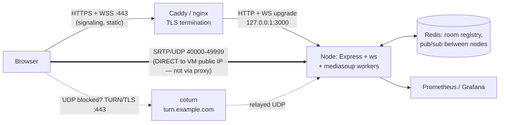
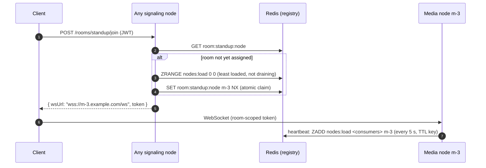
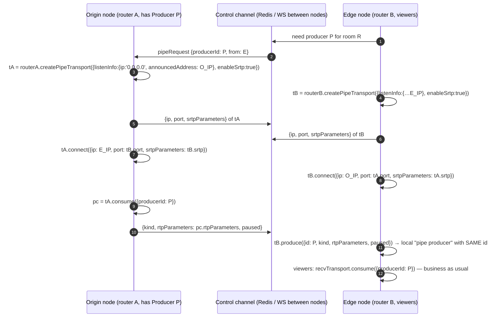

# Chapter 12 — Production: Deploying WebSockets and mediasoup

> **Level:** 

**What you'll learn.** A WebSocket app and an SFU fail in production in different ways. WebSockets break at proxies, load balancers and idle timeouts. mediasoup breaks at **NAT, firewalls and UDP**, usually silently: signaling works, the UI says "connected", and every tile is black. This chapter is the deployment guide for both. It covers TLS and secure contexts (Let's Encrypt), nginx/Caddy for `wss://`, UDP port ranges and firewalls, `announcedAddress` on cloud VMs, TURN for locked-down networks, Docker networking (why mediasoup wants `network_mode: host`), process management with systemd or PM2, **horizontal scaling of the SFU** (room → server assignment, pipe transports across hosts), monitoring (connections, worker CPU, `died` handling), and capacity planning. It ends with a production checklist, a mastery checklist for the whole course, and where to go next. All config files shown here are also in `examples/12-production/`.

---

## 1. The production topology



The rule that matters most: **reverse proxies carry the WebSocket, not the media.** nginx and Caddy cannot proxy WebRTC UDP. Media goes straight from the browser to the IP:port that mediasoup puts in its ICE candidates, so that IP must be reachable and those ports must be open.

---

## 2. TLS and secure contexts

`getUserMedia`, `getDisplayMedia` and several other APIs need a **secure context**. Outside `localhost`, your page has to be served over `https://`, and a page on HTTPS can only open `wss://` (mixed content is blocked). DTLS encrypts the media on its own. TLS protects the page and the signaling, which carries the DTLS fingerprints (ch.10 §2.6).

Options:

| Approach | When |
|---|---|
| **Caddy** (automatic Let's Encrypt/ZeroSSL, renewals, HTTP→HTTPS) | Simplest. Pick this unless you have a reason not to |
| **nginx + certbot** (`certbot --nginx -d app.example.com`) | You already run nginx |
| Cloud load balancer (ALB, GCP LB, Cloudflare) terminating TLS | Managed platforms. Check the WS idle timeouts |
| Node `https.createServer` directly (ch.11's `TLS_CERT/TLS_KEY`) | Small single-box deployments, LAN demos with `mkcert` |

For local phone testing, `mkcert -install && mkcert 192.168.1.10` gives you a cert your own devices trust. Run `TLS_CERT=./192.168.1.10.pem TLS_KEY=./192.168.1.10-key.pem npm start`.

---

## 3. Reverse proxy for WebSockets

### 3.1 Caddy

```caddyfile
# examples/12-production/Caddyfile
app.example.com {
	encode zstd gzip

	# WebSocket signaling — Caddy handles Upgrade automatically; just don't buffer/timeout it.
	@ws path /ws
	reverse_proxy @ws 127.0.0.1:3000 {
		stream_timeout 24h          # max lifetime of a WS connection
		stream_close_delay 5m       # on config reload, keep old WS alive for 5 min (no mass reconnect)
	}

	reverse_proxy 127.0.0.1:3000
	header Strict-Transport-Security "max-age=31536000; includeSubDomains"
}
```

### 3.2 nginx

```nginx
# examples/12-production/nginx.conf  (include in http { })
map $http_upgrade $connection_upgrade {
    default upgrade;
    ''      close;
}

upstream huddle_app {
    server 127.0.0.1:3000;
    # multiple signaling nodes? use sticky routing by room (see §7), not round-robin:
    # hash $arg_room consistent;
}

server {
    listen 80;
    server_name app.example.com;
    return 301 https://$host$request_uri;
}

server {
    listen 443 ssl;
    http2 on;
    server_name app.example.com;

    ssl_certificate     /etc/letsencrypt/live/app.example.com/fullchain.pem;
    ssl_certificate_key /etc/letsencrypt/live/app.example.com/privkey.pem;

    location /ws {
        proxy_pass http://huddle_app;
        proxy_http_version 1.1;                       # required for Upgrade
        proxy_set_header Upgrade $http_upgrade;
        proxy_set_header Connection $connection_upgrade;
        proxy_set_header Host $host;
        proxy_set_header X-Forwarded-For $proxy_add_x_forwarded_for;
        proxy_set_header X-Forwarded-Proto $scheme;
        proxy_read_timeout 3600s;                     # default 60s kills idle sockets!
        proxy_send_timeout 3600s;
        proxy_buffering off;
    }

    location / {
        proxy_pass http://huddle_app;
        proxy_set_header Host $host;
        proxy_set_header X-Forwarded-For $proxy_add_x_forwarded_for;
        proxy_set_header X-Forwarded-Proto $scheme;
    }
}
```

Keep sending application heartbeats (ch.5: ping every 25–30 s). They keep proxy and NAT idle timers from firing, and they detect half-open sockets. If you read client IPs for rate limiting, set `app.set('trust proxy', 'loopback')` in Express and read `X-Forwarded-For` in the `upgrade` handler.

---

## 4. The media network: UDP, firewalls, `announcedAddress`

### 4.1 Open the ports

Whatever you put in `listenInfos[].portRange` (or the `WebRtcServer` ports) must be open **inbound on UDP, and on TCP for the fallback**:

```bash
# ufw (Ubuntu)
ufw allow 80,443/tcp                  # HTTP(S) + WSS
ufw allow 40000:49999/udp             # mediasoup RTC (UDP)
ufw allow 40000:49999/tcp             # mediasoup RTC (TCP fallback)
ufw allow 3478/udp && ufw allow 3478/tcp && ufw allow 5349/tcp   # coturn (if co-located)
ufw allow 49160:49200/udp             # coturn relay range
```

Cloud firewalls (AWS Security Groups, GCP firewall rules, Hetzner Cloud Firewall) need **the same rules**, on top of the host firewall.

**How many ports?** Each WebRtcTransport takes one port per protocol, and each peer has 2 transports. 10 000 ports ≈ 5 000 concurrent peers per host, which is more than enough. Or switch to a **`WebRtcServer`**: one UDP + one TCP port *per worker* (e.g. 44444–44447 on a 4-core box). Firewall rules become trivial, and it is the best choice behind Docker bridge networking or strict corporate policies.

```js
// one WebRtcServer per worker, ports 44444 + i
const webRtcServer = await worker.createWebRtcServer({
  listenInfos: [
    { protocol: 'udp', ip: '0.0.0.0', announcedAddress: PUBLIC_IP, port: 44444 + i },
    { protocol: 'tcp', ip: '0.0.0.0', announcedAddress: PUBLIC_IP, port: 44444 + i },
  ],
});
worker.appData.webRtcServer = webRtcServer;
// later:
router.createWebRtcTransport({ webRtcServer: worker.appData.webRtcServer, enableUdp: true, enableTcp: true, preferUdp: true });
```

### 4.2 `announcedAddress` on cloud VMs

On AWS, GCP, Azure and most clouds, the VM's NIC only has a **private** IP (`10.x`, `172.31.x`). The public IP is 1:1 NAT done by the provider. mediasoup has to **bind** the private IP (or `0.0.0.0`) and **announce** the public one:

```js
// Resolve the public IP at boot: env var first, then cloud metadata.
async function resolvePublicIp() {
  if (process.env.MEDIASOUP_ANNOUNCED_ADDRESS) return process.env.MEDIASOUP_ANNOUNCED_ADDRESS;
  try { // AWS IMDSv2
    const token = await (await fetch('http://169.254.169.254/latest/api/token', {
      method: 'PUT', headers: { 'X-aws-ec2-metadata-token-ttl-seconds': '60' }, signal: AbortSignal.timeout(1000),
    })).text();
    return (await (await fetch('http://169.254.169.254/latest/meta-data/public-ipv4', {
      headers: { 'X-aws-ec2-metadata-token': token }, signal: AbortSignal.timeout(1000),
    })).text()).trim();
  } catch {}
  try { // GCP
    return (await (await fetch(
      'http://metadata.google.internal/computeMetadata/v1/instance/network-interfaces/0/access-configs/0/external-ip',
      { headers: { 'Metadata-Flavor': 'Google' }, signal: AbortSignal.timeout(1000) })).text()).trim();
  } catch {}
  throw new Error('Set MEDIASOUP_ANNOUNCED_ADDRESS to this host\'s public IP');
}
```

- `announcedAddress` may be a **hostname** (e.g. `media-3.example.com`). That is handy with dynamic IPs, but the browser then needs DNS for it, and Firefox handles hostname candidates less gracefully than Chrome. An IP is safer.
- **Dual stack**: add IPv6 `listenInfos` entries (`ip: '::'`) so IPv6-only mobile networks connect without going through NAT64.
- **Verify it**: the `iceCandidates` in your `createWebRtcTransport` reply must show the public IP. In `chrome://webrtc-internals`, a transport that sits in `checking` and then goes to `failed` almost always means a wrong announced address or a closed port.

### 4.3 TURN for restrictive networks

mediasoup is ICE-Lite and reachable on public ports, so *most* clients connect directly, including many behind symmetric NATs. Corporate networks that **block all outbound UDP** and only allow TCP 443 through an HTTP proxy are different. For those clients you need:

1. mediasoup's own **TCP** listen infos (already set up), which help when TCP to high ports is allowed, and
2. **TURN over TLS on port 443** (coturn, ch.10 §2.5), ideally on a *separate IP or host* so 443 does not clash with your web server. It looks like ordinary HTTPS to middleboxes.

Give clients TURN credentials when you create their transports:

```js
// server: include iceServers in the createWebRtcTransport reply
return { id, iceParameters, iceCandidates, dtlsParameters, sctpParameters,
         iceServers: [turnCredentials(peer.userId, process.env.TURN_SECRET)] }; // HMAC creds (ch.10)

// client: mediasoup-client accepts iceServers (and iceTransportPolicy) per transport
const transport = device.createSendTransport({ ...params, iceServers: params.iceServers });
// Retry path: if 'connectionstatechange' → 'failed' on first attempt, recreate with iceTransportPolicy: 'relay'.
```

TURN relay bandwidth counts against coturn's host. Size it for about 10–20 % of your media traffic.

---

## 5. Docker

mediasoup needs a large UDP port range, and Docker's userland proxy (`docker-proxy`) creates **one process or iptables rule per published port**. Publishing `40000-49999/udp` is slow to start and can exhaust memory. There is also a second NAT layer, so `announcedAddress` has to be the *host's* public IP anyway.

**Use host networking** (Linux only):

```dockerfile
# examples/12-production/Dockerfile — for examples/11-mediasoup-minimal (or the capstone)
FROM node:24-bookworm-slim AS build
WORKDIR /app
# Prebuilt mediasoup-worker is downloaded during npm ci. If your platform has no prebuilt,
# add: RUN apt-get update && apt-get install -y python3 python3-pip build-essential
COPY package*.json ./
RUN npm ci
COPY . .
RUN npm run build:client && npm prune --omit=dev

FROM node:24-bookworm-slim
ENV NODE_ENV=production
WORKDIR /app
COPY --from=build /app /app
USER node
CMD ["node", "server.js"]
```

```yaml
# examples/12-production/docker-compose.yml
services:
  sfu:
    build:
      context: ../11-mediasoup-minimal   # add a .dockerignore with node_modules/ there
      dockerfile: ../12-production/Dockerfile
    network_mode: host                 # ← no port publishing, no docker-proxy, no extra NAT
    restart: unless-stopped
    environment:
      PORT: "3000"
      MEDIASOUP_NUM_WORKERS: "4"
      MEDIASOUP_LISTEN_IP: "0.0.0.0"
      MEDIASOUP_ANNOUNCED_ADDRESS: "${PUBLIC_IP:?set PUBLIC_IP}"
      MEDIASOUP_MIN_PORT: "40000"
      MEDIASOUP_MAX_PORT: "49999"
    ulimits:
      nofile: { soft: 65536, hard: 65536 }
    stop_grace_period: 60s             # time to drain rooms on SIGTERM (§6.3)

  coturn:
    image: coturn/coturn:4.6
    network_mode: host
    restart: unless-stopped
    volumes:
      - ./turnserver.conf:/etc/coturn/turnserver.conf:ro
      - /etc/letsencrypt:/etc/letsencrypt:ro

  redis:
    image: redis:7-alpine
    restart: unless-stopped
    ports: ["127.0.0.1:6379:6379"]
```

If you cannot use host mode (Docker Desktop on macOS/Windows, some PaaS), publish a **small** range with `--userland-proxy=false` in `daemon.json`, or better, use **`WebRtcServer`** with only 1–2 ports per worker: `ports: ["44444-44447:44444-44447/udp", "44444-44447:44444-44447/tcp"]`. On **Kubernetes** you use `hostNetwork: true` with one SFU pod per node (a DaemonSet or pod anti-affinity), and the announced address comes from the node's external IP (`status.hostIP` + a lookup, or a per-node env var).

---

## 6. Process management

### 6.1 systemd

```ini
# examples/12-production/huddle-sfu.service   → /etc/systemd/system/huddle-sfu.service
[Unit]
Description=Huddle SFU (Node + mediasoup)
After=network-online.target
Wants=network-online.target

[Service]
Type=simple
User=huddle
WorkingDirectory=/opt/huddle
EnvironmentFile=/etc/huddle/env           # MEDIASOUP_ANNOUNCED_ADDRESS=..., TURN_SECRET=...
ExecStart=/usr/bin/node server.js
Restart=always
RestartSec=2
KillSignal=SIGTERM
TimeoutStopSec=60                          # graceful drain window
LimitNOFILE=65536                          # each WS + each RTC socket is an fd
# Hardening
NoNewPrivileges=true
ProtectSystem=strict
ReadWritePaths=/opt/huddle/recordings
PrivateTmp=true

[Install]
WantedBy=multi-user.target
```

### 6.2 PM2: use **fork** mode, not cluster mode

```js
// examples/12-production/ecosystem.config.cjs
module.exports = {
  apps: [{
    name: 'huddle-sfu',
    script: 'server.js',
    cwd: '/opt/huddle',
    exec_mode: 'fork',       // NOT 'cluster': each mediasoup Node process owns its workers & rooms;
    instances: 1,            // PM2 cluster round-robins connections → peers of one room land in different processes.
    kill_timeout: 60000,     // give SIGTERM drain time
    max_memory_restart: '2G',
    env: { NODE_ENV: 'production', MEDIASOUP_NUM_WORKERS: '4' },
  }],
};
```

One Node process with *N* mediasoup workers already uses every core. The Node thread itself only does signaling and control. To run several Node processes on one box (e.g. to isolate tenants), give each its own port range and route rooms to processes explicitly, as you would across hosts (§7).

### 6.3 Graceful shutdown and deploys

An SFU restart **drops every call on that box**, and clients have to rebuild transports. Deploy with draining:

```js
let draining = false;
process.on('SIGTERM', async () => {
  draining = true;                                   // 1. stop accepting new rooms
  await registry.markDraining(NODE_ID);              //    (the room assigner skips this node, §7)
  broadcastAll('serverDraining', { reconnectInMs: 0 }); // 2. optional: ask clients to migrate
  const deadline = Date.now() + 55_000;
  while (rooms.size && Date.now() < deadline) await new Promise((r) => setTimeout(r, 1000)); // 3. wait
  for (const w of workers) w.close();                // 4. then exit
  process.exit(0);
});
```

Blue/green at the room level ("new rooms go to new nodes, old nodes drain") is the standard way to deploy SFUs without dropping calls.

---

## 7. Horizontal scaling of the SFU

### 7.1 Separate "which server hosts this room" from "which server holds the WebSocket"

With chat (ch.8) any node can serve any client, because Redis pub/sub fans messages out. **Media is different.** Every participant of a room must send media to the *same* router, or you have to pipe between hosts. So the first scaling mechanism is **room → media server assignment**:



```js
// Room assignment with Redis (ioredis). Load = consumer count (or CPU) reported by media nodes.
export async function assignRoom(redis, roomId) {
  const key = `room:${roomId}:node`;
  const existing = await redis.get(key);
  if (existing && (await redis.exists(`node:${existing}:alive`))) return existing;

  const [candidate] = await redis.zrange('nodes:load', 0, 0);     // least loaded
  if (!candidate) throw new Error('no media nodes available');
  const ok = await redis.set(key, candidate, 'EX', 86400, 'NX');  // first writer wins
  return ok ? candidate : redis.get(key);
}

// On each media node:
setInterval(async () => {
  if (draining) return redis.zrem('nodes:load', NODE_ID);
  await redis.multi()
    .set(`node:${NODE_ID}:alive`, '1', 'EX', 15)
    .zadd('nodes:load', totalConsumers(), NODE_ID)
    .exec();
}, 5000);
```

Give every media node **its own public hostname** (`m-3.example.com`) with a TLS cert, and have clients connect their WebSocket *directly* to it. Signaling then lives on the same box as the router, which avoids a cross-node hop per request. The alternative is a proxy that routes `/ws?room=` to the right node (nginx `hash $arg_room consistent`, or an HAProxy map). That works too, but a plain hash ignores load.

### 7.2 Rooms bigger than one host: pipe transports across hosts

A 1 000-viewer webinar or a 300-person all-hands does not fit on one box. In **cascading**, the room spans hosts: producers live on an origin node, and each edge node gets **one** copy of each producer over a `PipeTransport` and fans it out locally.



```js
// Origin side (simplified). Reuse one PipeTransport pair per (origin router, edge router).
async function pipeOut(routerA, producerId, remote /* {ip, port, srtpParameters} */) {
  const tA = await routerA.createPipeTransport({
    listenInfo: { protocol: 'udp', ip: '0.0.0.0', announcedAddress: PUBLIC_IP }, enableSrtp: true, enableRtx: true,
  });
  await tA.connect(remote);
  const pipeConsumer = await tA.consume({ producerId });
  return { local: { ip: PUBLIC_IP, port: tA.tuple.localPort, srtpParameters: tA.srtpParameters },
           kind: pipeConsumer.kind, rtpParameters: pipeConsumer.rtpParameters, paused: pipeConsumer.producerPaused };
}
// Edge side
async function pipeIn(routerB, tB, { producerId, kind, rtpParameters, paused }) {
  return tB.produce({ id: producerId, kind, rtpParameters, paused }); // same id → consumers don't care it's piped
}
```

Operational notes:

- Pipe traffic is host-to-host UDP. Open the range between nodes, put nodes in the same region or VPC, and use `enableSrtp: true` across untrusted networks.
- Carry `pause`/`resume`/`close` of the origin producer across (the `pipeConsumer` events `producerpause`, `producerresume`, `producerclose` → mirror them on the edge pipe producer).
- For **global** audiences, put edges in each region. A viewer in Singapore connects to the Singapore edge, and only one copy per producer crosses the ocean.

---

## 8. Monitoring and failure handling

### 8.1 What to measure

| Metric | Source | Alert when |
|---|---|---|
| WS connections, messages/s, send buffer (`ws.bufferedAmount`) | `ws` server | sudden drops (proxy/deploy), buffers growing (slow consumers, ch.5) |
| Event-loop lag | `perf_hooks.monitorEventLoopDelay()` | p99 > 100 ms: signaling is starving |
| Rooms, peers, producers, consumers | your maps / `mediasoup.observer` | capacity planning (§9) |
| **Worker CPU %** | `worker.getResourceUsage()` delta of `ru_utime + ru_stime` over wall time | > 80 % on any worker |
| Producer/consumer **score** (0–10) | `'score'` events | many consumers < 5: network or CPU trouble |
| Transport ICE/DTLS failures | `'icestatechange'`, `'dtlsstatechange'` | spikes: firewall, cert or announcedAddress regressions |
| Egress bandwidth | NIC counters / cloud metrics | close to the NIC or plan limit |
| TURN allocations & bandwidth | coturn `prometheus` option | cost |

```js
// Worker CPU sampling → Prometheus gauge (prom-client)
import client from 'prom-client';
const workerCpu = new client.Gauge({ name: 'mediasoup_worker_cpu_ratio', help: 'CPU per worker', labelNames: ['pid'] });
const consumersG = new client.Gauge({ name: 'mediasoup_consumers', help: 'consumers' });
const last = new Map();

setInterval(async () => {
  for (const w of workers) {
    const u = await w.getResourceUsage();            // ru_utime / ru_stime in ms
    const cpuMs = u.ru_utime + u.ru_stime, now = Date.now();
    const prev = last.get(w.pid);
    if (prev) workerCpu.set({ pid: String(w.pid) }, (cpuMs - prev.cpuMs) / (now - prev.at));
    last.set(w.pid, { cpuMs, at: now });
  }
  consumersG.set(totalConsumers());
}, 5000);

app.get('/metrics', async (_req, res) => {
  res.set('Content-Type', client.register.contentType);
  res.end(await client.register.metrics());
});

// Global mediasoup observer: count objects without touching room code
mediasoup.observer.on('newworker', (worker) => {
  worker.observer.on('newrouter', (router) => {
    router.observer.on('newtransport', (t) => {
      t.observer.on('newconsumer', () => consumersCreated.inc());
    });
  });
});
```

Chapter 11's `/stats` endpoint is the minimal version of this.

### 8.2 Handling a dead worker

`worker.on('died')` fires when the C++ process crashes or is OOM-killed. Everything on it is gone: routers, transports, producers. You have two options:

1. **Fail fast** (ch.11): `process.exit(1)`, and the supervisor restarts the node. Simple, but it drops *every* room on the host.
2. **Contain it**: replace the worker, and tell only the affected rooms to rebuild.

```js
function watchWorker(worker, index) {
  worker.on('died', async (err) => {
    log.error({ pid: worker.pid, err }, 'mediasoup worker died');
    metrics.workerDeaths.inc();
    workers[index] = await mediasoup.createWorker(config.worker);   // replace in pool
    watchWorker(workers[index], index);

    for (const room of rooms.values()) {
      if (room.worker !== worker) continue;
      room.router = await workers[index].createRouter({ mediaCodecs });   // fresh router
      room.worker = workers[index];
      for (const peer of room.peers.values()) {
        peer.transports.clear(); peer.producers.clear(); peer.consumers.clear();
        send(peer.ws, 'mediaReset', {});   // client: close transports, re-run load → transports → produce/consume
      }
    }
  });
}
```

The client side of `mediaReset` is the same code path as a **network change or ICE failure you cannot recover from**: throw away both transports and run the join flow again over the *existing* WebSocket. Build that path once and it handles worker deaths, server migrations and Wi-Fi → 4G switches.

---

## 9. Capacity planning

Rough numbers (they vary with CPU generation, bitrate, simulcast and packet sizes, so **load test your own workload**):

| Resource | Rule of thumb |
|---|---|
| Consumers per worker (one core) | **~500** mixed audio+video consumers at typical bitrates (the mediasoup docs cite this order of magnitude) |
| Audio-only consumers per worker | several thousand |
| Node signaling | thousands of WS connections; not the bottleneck unless you do heavy JSON work per packet-rate event |
| Egress bandwidth | Σ over consumers of forwarded bitrate. **Usually the real limit** |
| Memory | modest: ~a few MB per transport at most; 2–4 GB per host is plenty |

Worked example: 50 rooms × 8 participants, cam + mic, simulcast, 720p max, a grid layout, and viewers receiving the ~500 kbps middle layer:

- Video consumers: 50 × 8 × 7 = **2 800**. Audio consumers: another 2 800 (cheap).
- CPU: 2 800 video consumers / ~500 per core ≈ **6 cores** (so an 8-core box with 8 workers, ~75 % loaded).
- Egress: 2 800 × 0.5 Mbit/s + 2 800 × 0.04 ≈ **1.5 Gbit/s**. You need a 2 Gbit+ NIC, and **cloud egress is billed**: 1.5 Gbit/s sustained is about 16 TB/day.
- Ingress: 400 senders × (150 + 500 + 1 200 kbps simulcast) ≈ 0.75 Gbit/s.

Two levers do most of the work: **downscale the layers viewers receive** (thumbnails at 180p) and **pause off-screen consumers**. Together they often cut egress by 3–5×.

Tune the kernel for many UDP flows:

```bash
# /etc/sysctl.d/99-sfu.conf
net.core.rmem_max = 26214400
net.core.wmem_max = 26214400
net.core.rmem_default = 1048576
net.core.wmem_default = 1048576
net.core.netdev_max_backlog = 5000
fs.file-max = 1000000
```

To load test, use a headless Chrome farm (Puppeteer/Playwright with `--use-fake-device-for-media-stream --use-fake-ui-for-media-stream`) or a native bot (mediasoup-client with a Node handler, or `mediasoup-client-aiortc`). Watch worker CPU, scores and egress while you add bots.

---

## 10. Production checklist

**Signaling (WebSocket)**
- [ ] `wss://` only. Authenticate on `upgrade` (ch.6) and bind the socket to a user + room
- [ ] Heartbeats (25–30 s) and proxy `read_timeout` greater than the heartbeat interval
- [ ] `maxPayload` set. Schema validation (zod) on every request. Rate limits per socket
- [ ] Per-peer limits: max transports (2–4), producers (e.g. 3), consumers; validate `appData`
- [ ] Reconnect with backoff (ch.5), and a client "rejoin media" path that rebuilds transports

**Media (mediasoup)**
- [ ] `announcedAddress` = public IP (verified in `iceCandidates`)
- [ ] UDP + TCP port range open in **both** host and cloud firewalls (or a `WebRtcServer`)
- [ ] One worker per core. `worker.on('died')` handled. Rooms spread by load
- [ ] Consumers created paused. Close cascade handled with `observer.on('close')`
- [ ] Simulcast on, preferred layers driven by layout, off-screen consumers paused
- [ ] `setMaxIncomingBitrate` on send transports

**Network**
- [ ] HTTPS everywhere (secure context), with automatic certificate renewal
- [ ] coturn with TLS on 443 (separate IP), `use-auth-secret`, `denied-peer-ip` for private ranges
- [ ] Docker `network_mode: host` (or a WebRtcServer with a few published ports)
- [ ] Kernel UDP buffers and `LimitNOFILE` raised

**Operations**
- [ ] systemd/PM2 (fork mode) with restart, graceful SIGTERM drain, room-level blue/green deploys
- [ ] Metrics: WS connections, event-loop lag, worker CPU, consumers, scores, egress, ICE failures
- [ ] Structured logs with `roomId`/`peerId`/`transportId` correlation
- [ ] Load test before launch. A capacity model for CPU **and egress cost**

---

## Common pitfalls

1. **Media through nginx.** It cannot proxy WebRTC UDP. Only signaling goes through the proxy.
2. **Private IP announced** on a cloud VM. Signaling works, the tiles stay black, and nothing appears in the logs.
3. **Cloud firewall forgotten.** `ufw` is open but the Security Group is not, or the other way round.
4. **nginx's default 60 s `proxy_read_timeout`** combined with a 90 s heartbeat means disconnects every minute.
5. **Docker bridge + a 10 000-port publish.** Containers take minutes to start and there is a double NAT. Use host mode.
6. **PM2 cluster mode.** Peers of one room land in different processes and routers, and nobody can see anyone.
7. **Restarting the SFU to deploy** drops every call. Drain first.
8. **Sizing only for CPU.** Egress bandwidth, and the bill for it, is usually the binding constraint.
9. **No TURN/TLS 443.** Corporate users behind UDP-blocking firewalls can never connect.
10. **Treating worker death as impossible.** It happens (OOM, bugs, `kill -9`). Test it: `kill -9 <worker pid>` in staging.

## Exercises

1. **Deploy ch.11 for real.** Put it on a VM behind Caddy with the Dockerfile and compose file above, then call someone on a different network. Confirm in `chrome://webrtc-internals` that the selected candidate pair uses the VM's public IP.
2. **WebRtcServer migration.** Change ch.11 to use one `WebRtcServer` per worker, shrink the firewall to 2 ports per worker, and run it with Docker **bridge** networking.
3. **Kill a worker.** Implement §8.2's containment strategy plus a client `mediaReset` handler, then `kill -9` a worker PID during a call and measure how long recovery takes.
4. **Two-node cascade.** Run two instances of the server on different ports/port ranges on one machine. Implement `pipeOut`/`pipeIn` over a WebSocket between them so a viewer on node B can watch a producer on node A.
5. **Capacity test.** Use Playwright with fake media to add bots to one room until worker CPU hits 80 %, and record consumers per core on your hardware.

<details><summary>Hints</summary>

- (1) Set `MEDIASOUP_ANNOUNCED_ADDRESS=$(curl -s ifconfig.me)` and open UDP/TCP 40000–40100 in the cloud firewall.
- (2) `createWebRtcTransport({ webRtcServer, enableUdp: true, enableTcp: true, preferUdp: true })`. Drop `listenInfos` from the transport options.
- (3) Find worker PIDs in `/stats`. On the client, close both transports, create a new `Device` load, new transports, and re-`produce` the existing tracks.
- (4) Use different `NODE_ID`s. Node B asks A with `{ producerId, ip, port, srtpParameters }` and A replies with its tuple + `rtpParameters`.
- (5) Chrome flags: `--use-fake-device-for-media-stream --use-fake-ui-for-media-stream --autoplay-policy=no-user-gesture-required`. Each headless tab costs about 1 core, so spread bots across machines.
</details>

## Key takeaways

- The proxy carries **HTTPS + WSS**. Media goes **directly** to the SFU's public IP on UDP (TCP as a fallback), so `announcedAddress` and open ports decide whether anything works.
- A secure context (HTTPS) is required for camera and mic. TURN over TLS on 443 rescues locked-down networks.
- mediasoup in Docker means **host networking** (or a `WebRtcServer` with a handful of ports). Under PM2 it means **fork mode**, and every deploy should **drain** first.
- Scale with **room → node assignment** (a Redis registry keyed by load) and **cascade** big rooms with pipe transports across hosts.
- Monitor worker CPU, consumer counts, scores, ICE failures and **egress**, and plan for worker death.
- Capacity is roughly ~500 consumers per core, but **bandwidth is usually the real limit**. Layer selection and pausing off-screen video are the biggest wins.

---

## Where to go next

- **The capstone: [Huddle](../project/)**. Every technique from this course in one app: Slack-lite chat over `ws` with the ch.4 envelope, auth, reconnection, Redis fan-out, and mediasoup video rooms.
- **mediasoup's own demo** (`versatica/mediasoup-demo`): a full production-grade reference with broadcasters, data channels, stats and the `protoo` signaling library.
- **Standards and deeper internals**: RFC 8825–8835 (the WebRTC overview family), RFC 8445 (ICE), RFC 8656 (TURN), draft *transport-cc* / GCC for congestion control, the W3C WebRTC and *Encoded Transform* (E2EE) specs.
- **Newer transports**: **WebTransport** (HTTP/3, unreliable datagrams + streams; a candidate successor to WebSockets for some workloads), **WHIP/WHEP** (HTTP-based ingest/egress signaling for WebRTC), and **Media over QUIC (MoQ)**.
- **Alternatives to compare**: LiveKit (Go SFU with SDKs), Janus, Jitsi Videobridge, Pion (a Go WebRTC library), Cloudflare Calls.
- **Books and sites**: *High Performance Browser Networking* (Ilya Grigorik, free online), webrtcforthecurious.com, webrtcHacks.

## Mastery checklist: the whole course

You have mastered WebSockets in Node.js/Express, up to SFU video, if you can:

- [ ] Explain the HTTP/1.1 Upgrade handshake, `Sec-WebSocket-Key`/`Accept`, frames, masking, ping/pong and close codes (ch.1–2)
- [ ] Run `ws` on an Express 5 server with `noServer` + `upgrade`, several paths, and auth at upgrade time (ch.3, 6)
- [ ] Design a typed message envelope with request/response (`id`/`replyTo`), rooms and broadcast (ch.4)
- [ ] Build reliable clients: heartbeats, reconnection with jittered backoff, resume/replay, backpressure via `bufferedAmount` (ch.5)
- [ ] Secure it: `wss://`, Origin checks, token auth, rate limits, `maxPayload`, input validation (ch.6)
- [ ] Say when Socket.IO's features (rooms, acks, fallbacks) are worth its protocol and when they are not (ch.7)
- [ ] Scale horizontally with Redis pub/sub and understand sticky sessions (ch.8)
- [ ] Test WS servers with real clients, fake timers and deterministic message waits (ch.9)
- [ ] Explain SDP offer/answer, ICE/trickle, STUN vs TURN, DTLS-SRTP, and implement perfect negotiation (ch.10)
- [ ] Do the mesh vs MCU vs SFU bandwidth math and justify an SFU (ch.10–11)
- [ ] Build a mediasoup SFU end to end: workers, router, transports, produce/consume with paused consumers, and signaling via `connect`/`produce` callbacks (ch.11)
- [ ] Use simulcast/SVC layers, active speaker detection, stats, `pipeToRouter`, and PlainTransport recording (ch.11)
- [ ] Deploy it: TLS, proxy config, UDP firewalling, `announcedAddress`, TURN, Docker host networking, drains, monitoring, capacity plan (ch.12)

Next → [Capstone project: Huddle](../project/)
