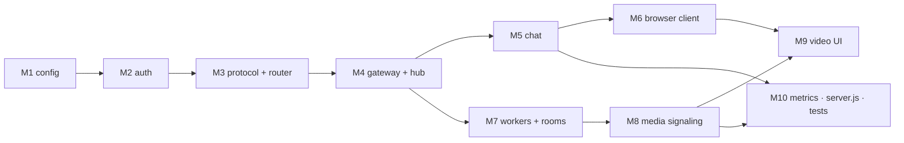
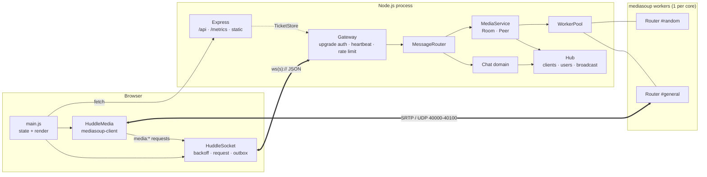
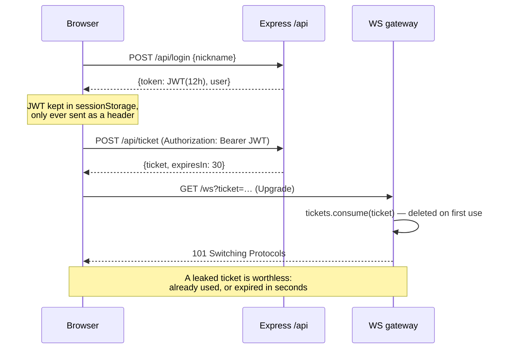
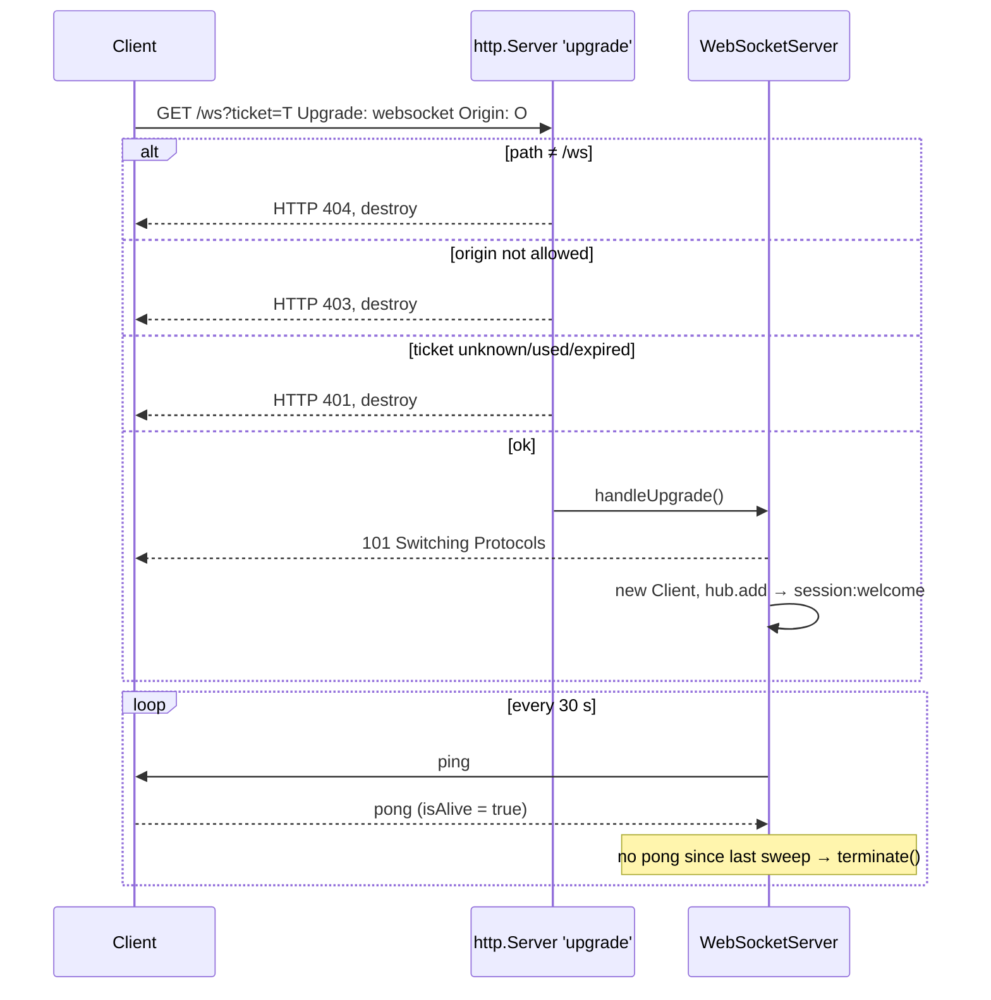
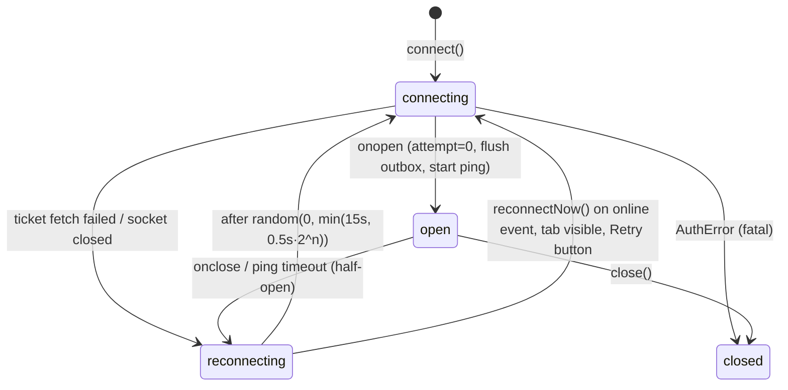
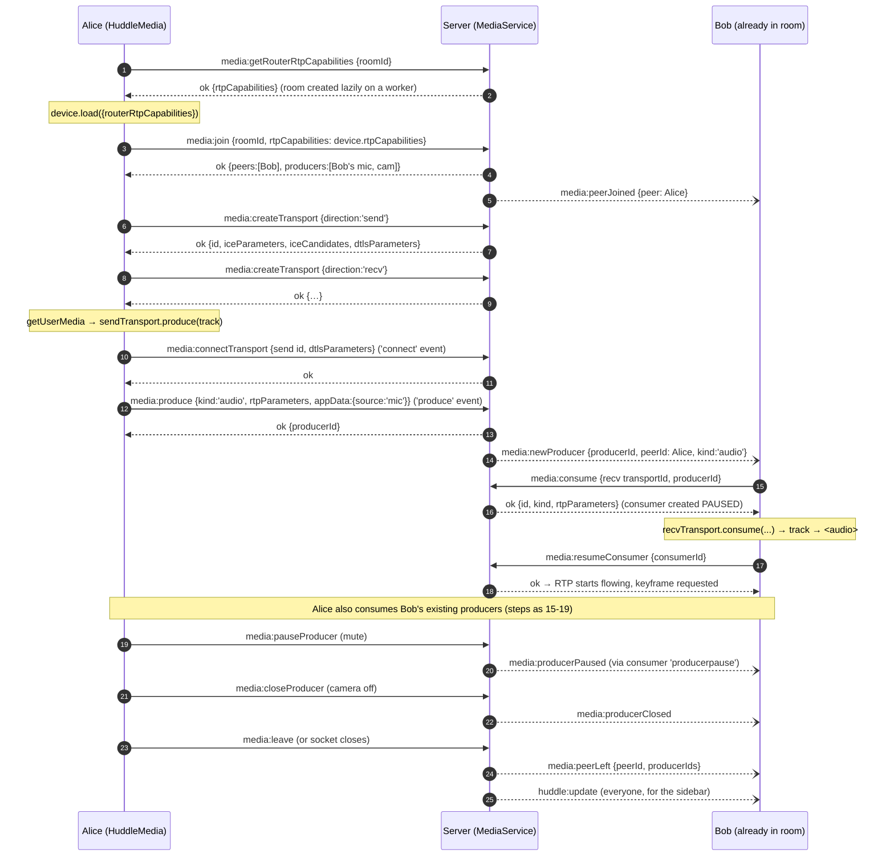
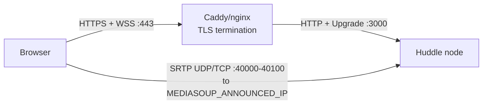

# Chapter 13 — Capstone: Building Huddle

> **Level:** 

**What you'll learn.** In this chapter you build **Huddle**, a Slack-lite app with channels, presence, typing indicators, reactions and mediasoup video huddles. Every piece of the course fits into one codebase. You build it file by file, in the order you would write it yourself: config, auth tickets, the zod-validated protocol, a router, a connection hub, the WebSocket gateway (origin, tickets, heartbeats, rate limits), the chat domain (ring-buffer history with `seq` cursors, idempotent sends, TTL'd typing), and the mediasoup layer (worker pool with `died` recovery, `Room`/`Peer`, the full signaling protocol, active speaker). On the browser side you build a resilient `HuddleSocket` (backoff with jitter, promise requests, outbox, half-open detection), `HuddleMedia` on `mediasoup-client`, and one-round-trip resync after reconnects. The chapter ends with tests that run the real browser classes in Node, including full mediasoup signaling on a fake WebRTC handler. **Every important file appears in full below**, so the chapter alone is enough to rebuild Huddle. The finished code lives in [`project/`](../project/).

> **In plain English:** Huddle is a small Slack: people log in with a nickname, chat in channels, see who is online and who is typing, and can start a video call in any channel. You build it in ten milestones. Each one adds a layer, and each ends with a command you run to prove the layer works before you stack the next one on top. Nothing here is new: every milestone applies one or two earlier chapters. What's new is seeing all of them cooperate in one process, and learning which small decisions (a sequence number, an idempotency key, a paused consumer) make the difference between a demo and something that survives flaky Wi-Fi.

> **How to use this chapter**
>
> - **Two ways to follow along.** *Read-along:* the finished code is in [`project/`](../project/), so you can read each milestone and run its checkpoint against the real files. *Build-along:* create an empty folder, type (or copy) each file as its milestone introduces it, and run the same checkpoints there. Every code block labelled **`project/…`** is the complete file, identical to the one in `project/`.
> - **Run everything from `project/`** after `npm install` (Node 22 or newer, because the Node-side probes use the global `WebSocket`). Commands that start a server use two terminals: **Terminal A** runs the server, **Terminal B** runs the probe. Stop a server with `Ctrl+C`.
> - **Throwaway harnesses.** The real entry point, `src/server.js`, imports every layer, so it only runs at the end (M10). Until then, each checkpoint uses a 20-line harness that wires up only the layers built so far. Put them in `project/scratch/` (create the folder, and delete it when you're done; it is not part of Huddle). Harnesses listen on port **3001** so they never clash with a real Huddle on 3000.
> - **Honest checkpoints.** Where a milestone can't run on its own yet, the checkpoint says so and gives you the next-best check instead: a script that exercises only the new files, a single test file, or (for code that can't run alone) `node --check <file>` to catch syntax errors.
> - **Budget about 10 hours** in total. The times below assume you read the prose and run each checkpoint; typing everything in yourself takes longer.

### Milestone roadmap

| # | Milestone | Files you write | Course chapter it applies | Est. time |
|---|---|---|---|---|
| [M1](#133-m1--skeleton-and-config) | Skeleton & config | `package.json`, `src/config.js`, `src/logger.js` | 3 (one server, one port), 12 (env-driven config) | 30 min |
| [M2](#134-m2--login-and-tickets) | Login + tickets | `src/auth.js` | 6 (JWTs, one-time tickets) | 45 min |
| [M3](#135-m3--protocol-and-router) | Protocol & router | `src/ws/protocol.js`, `src/ws/router.js` | 4 (envelope, dispatch, `replyTo`), 6 (validation) | 45 min |
| [M4](#136-m4--the-websocket-gateway-auth-heartbeat-rate-limit) | WS gateway: auth, heartbeat, rate limit | `src/ws/rateLimit.js`, `src/ws/hub.js`, `src/ws/gateway.js` | 2 (`ws` events), 3 (`noServer` + `upgrade`), 5 (heartbeats, backpressure), 6 (origin, rate limits) | 60 min |
| [M5](#137-m5--chat-channels-history-presence-typing-reactions) | Chat: channels, history, presence, typing, reactions | `src/chat/ringBuffer.js`, `channels.js`, `typing.js`, `presence.js`, `handlers.js` | 4 (rooms, presence), 5 (replay with `seq`, idempotency) | 90 min |
| [M6](#138-m6--browser-client-reconnect-and-resync) | Browser client & reconnect/resync | `public/src/api.js`, `ws-client.js`, `main.js` (chat parts), `dom.js` | 4 (request/response), 5 (backoff, resync), 6 (escaping output) | 90 min |
| [M7](#139-m7--mediasoup-worker-pool-room-and-peer) | mediasoup worker pool, Room, Peer | `src/media/codecs.js`, `workerPool.js`, `Peer.js`, `Room.js` | 11 (Workers, Routers, AudioLevelObserver), 12 (one worker per core) | 45 min |
| [M8](#1310-m8--media-signaling-handlers) | Media signaling handlers | `src/media/handlers.js`, `src/media/index.js` | 10 (WebSocket as the signaling plane), 11 (transports, produce/consume) | 75 min |
| [M9](#1311-m9--video-ui) | Video UI | `public/src/media-client.js`, `main.js` (huddle parts), `huddle-view.js` | 10 (`getUserMedia`, tracks), 11 (`mediasoup-client`) | 60 min |
| [M10](#1312-m10--metrics-composition-root-tests-hardening) | Metrics, tests, hardening | `src/metrics.js`, `src/server.js`, `test/*.test.js` | 9 (testing, observability), 12 (shutdown, headers, deployment) | 60 min |



---

## 13.1 What we're building

A single Node process serves:

- **HTTP (Express 5):** `POST /api/login` returns a JWT. `POST /api/ticket` turns the JWT into a one-time WebSocket ticket. There are also `GET /metrics`, `GET /api/config`, and the static client.
- **One WebSocket per tab** at `/ws?ticket=…`. Every chat message, presence change, typing notice, reaction and all **media signaling** travel over it as `{type,id,payload,replyTo}` envelopes.
- **mediasoup workers** (C++ subprocesses) forward audio and video between browsers over UDP. The WebSocket only negotiates. It never carries media.

A user types a nickname, lands in `#general`, sees who's online, chats with live typing dots and emoji reactions, and clicks **Start huddle** to open a video grid with mic, camera and screen-share toggles. The person talking gets a green ring. If the Wi-Fi drops, a banner counts down to the next reconnect attempt. Messages typed while offline show as *sending…* and are delivered exactly once when the connection returns.

```bash
cd project && npm install && npm run dev     # → http://localhost:3000, open two windows
npm test                                     # 27 tests incl. full mediasoup signaling
```

### Design goals (and the chapter each one comes from)

| Goal | How Huddle meets it | Ch. |
|---|---|---|
| One socket, many features | Namespaced `type` (`chat:send`, `media:produce`), one router | 4 |
| Never trust the client | zod `.strict()` schemas for every type; server fills `user` | 4, 6 |
| No credentials in URLs | JWT stays in `Authorization` headers; the URL only carries a 30 s single-use ticket | 6 |
| Survive flaky networks | Heartbeats server-side, app ping client-side, backoff+jitter, seq-cursor resync, idempotent sends | 5 |
| Bounded memory | Ring-buffer history, `maxPayload`, `bufferedAmount` cut-off, token bucket | 5, 6 |
| Media that scales per core | Worker pool, one Router per huddle, round-robin | 11, 12 |
| Crash-tolerant media | Worker `died` → close affected rooms → clients auto-rejoin → respawn | 11, 12 |
| Testable | Composition root with overrides, port 0, the real client classes run in Node | 9 |

---

## 13.2 Architecture



**Layering rule:** the gateway knows about sockets, and nothing below it does. Handlers receive `{ client, payload }` and either return a value or throw a `ProtocolError`. They never call `JSON.stringify`, never check `readyState`, and never validate shapes. That's why every feature file stays short.

```
project/
├── src/  server.js config.js logger.js auth.js metrics.js
│   ├── ws/     gateway.js protocol.js router.js hub.js rateLimit.js
│   ├── chat/   handlers.js channels.js ringBuffer.js typing.js presence.js
│   └── media/  index.js workerPool.js Room.js Peer.js handlers.js codecs.js
├── public/ index.html styles.css bundle.js(built)
│   └── src/  main.js ws-client.js media-client.js huddle-view.js api.js dom.js icons.js
└── test/  protocol.test.js auth.test.js integration.test.js media.test.js
```

---

## 13.3 M1 — Skeleton and config

**Goal:** a package that installs, and a single `loadConfig()` that every other file will receive as an argument instead of reading `process.env` itself.

**Files you'll write:** `project/package.json`, `project/src/config.js`, `project/src/logger.js`.

Huddle has its own `package.json`, separate from the course root, because it has a build step (esbuild bundles `mediasoup-client` for the browser) and a native dependency (`mediasoup` downloads or compiles a C++ worker).

**`project/package.json`**

```json
{
  "name": "huddle",
  "version": "1.0.0",
  "private": true,
  "description": "Huddle — a Slack-lite real-time collaboration app: channels, presence, typing, reactions and mediasoup video huddles. Capstone of the WebSockets mastery course.",
  "type": "module",
  "main": "src/server.js",
  "engines": {
    "node": ">=20"
  },
  "scripts": {
    "build": "esbuild public/src/main.js --bundle --format=esm --target=es2022 --minify --sourcemap --outfile=public/bundle.js",
    "watch": "npm run build -- --watch",
    "start": "node src/server.js",
    "dev": "npm run build && node --watch-path=src src/server.js",
    "test": "NODE_ENV=test node --test --test-concurrency=1 \"test/**/*.test.js\""
  },
  "dependencies": {
    "express": "^5.1.0",
    "jsonwebtoken": "^9.0.2",
    "mediasoup": "^3.27.0",
    "mediasoup-client": "^3.24.0",
    "ws": "^8.18.0",
    "zod": "^3.23.0"
  },
  "devDependencies": {
    "esbuild": "^0.25.0",
    "fake-mediastreamtrack": "^2.2.1"
  }
}
```

> **Why a bundler here when the examples have none?** `mediasoup-client` ships as CommonJS with dependencies, so a bare `<script type="module">` can't import it. esbuild takes about 30 ms and adds no config file. Everything else in `public/src/` is plain ESM you could serve directly.

All tunables come from the environment, and `loadConfig(overrides)` lets tests change one knob without touching `process.env`:

**`project/src/config.js`**

```js
// Centralised, validated configuration. Everything tunable comes from the
// environment so the same build runs on a laptop, a LAN box or a cloud VM.
import os from 'node:os';
import crypto from 'node:crypto';

const num = (v, d) => (v === undefined || v === '' ? d : Number(v));
const bool = (v, d) => (v === undefined || v === '' ? d : /^(1|true|yes|on)$/i.test(v));
const list = (v) => (v ? v.split(',').map((s) => s.trim()).filter(Boolean) : []);

/**
 * Listening on 0.0.0.0 means ICE candidates need a *reachable* address.
 * Default to the first LAN IPv4 (works for localhost and same-network
 * testing); set MEDIASOUP_ANNOUNCED_IP explicitly for cloud/public use.
 */
export function detectLocalIp() {
  for (const addrs of Object.values(os.networkInterfaces())) {
    for (const a of addrs ?? []) if (a.family === 'IPv4' && !a.internal) return a.address;
  }
  return '127.0.0.1';
}

/**
 * Build a config object. `overrides` lets tests inject values without
 * touching process.env.
 */
export function loadConfig(overrides = {}, env = process.env) {
  const isProd = env.NODE_ENV === 'production';

  let jwtSecret = env.JWT_SECRET;
  if (!jwtSecret) {
    if (isProd) throw new Error('JWT_SECRET must be set in production');
    // Dev/test fallback. Stable so browser sessions survive `npm run dev`
    // restarts (and you get to watch reconnect + resync work).
    jwtSecret = env.NODE_ENV === 'test' ? crypto.randomBytes(32).toString('hex') : 'huddle-dev-secret-change-me';
  }

  const config = {
    env: env.NODE_ENV ?? 'development',
    port: num(env.PORT, 3000),
    host: env.HOST ?? '0.0.0.0',
    jwtSecret,
    jwtTtl: env.JWT_TTL ?? '12h',
    ticketTtlMs: num(env.TICKET_TTL_MS, 30_000),

    // Origins allowed to open a WebSocket. Empty = "same host as the page"
    // plus localhost variants (see gateway.isOriginAllowed).
    allowedOrigins: list(env.ALLOWED_ORIGINS),
    // Non-browser clients (CLI, tests) usually send no Origin header.
    allowNoOrigin: bool(env.ALLOW_NO_ORIGIN, true),

    ws: {
      path: '/ws',
      maxPayload: num(env.WS_MAX_PAYLOAD, 64 * 1024),
      heartbeatMs: num(env.HEARTBEAT_MS, 30_000),
      // Token bucket: `burst` tokens, refilled at `ratePerSec`.
      rateBurst: num(env.RATE_BURST, 40),
      ratePerSec: num(env.RATE_PER_SEC, 15),
      maxViolations: num(env.RATE_MAX_VIOLATIONS, 50),
      maxBufferedBytes: num(env.WS_MAX_BUFFERED, 4 * 1024 * 1024),
    },

    chat: {
      historySize: num(env.HISTORY_SIZE, 500),
      historyPage: 50,
      maxChannels: num(env.MAX_CHANNELS, 50),
      typingTtlMs: 6_000,
    },

    media: {
      enabled: bool(env.MEDIA_ENABLED, true),
      numWorkers: num(env.MEDIASOUP_WORKERS, Math.min(os.availableParallelism?.() ?? os.cpus().length, 4)),
      announcedIp: env.MEDIASOUP_ANNOUNCED_IP || detectLocalIp(),
      listenIp: env.MEDIASOUP_LISTEN_IP ?? '0.0.0.0',
      rtcMinPort: num(env.RTC_MIN_PORT, 40000),
      rtcMaxPort: num(env.RTC_MAX_PORT, 40100),
      logLevel: env.MEDIASOUP_LOG_LEVEL ?? 'warn',
      maxPeersPerRoom: num(env.MAX_PEERS_PER_ROOM, 12),
      initialOutgoingBitrate: 1_000_000,
    },
  };

  // Shallow-merge overrides per section: { ws: { heartbeatMs: 50 } } keeps the other ws.* values.
  for (const [key, value] of Object.entries(overrides)) {
    const isSection = value && typeof value === 'object' && !Array.isArray(value) && typeof config[key] === 'object';
    config[key] = isSection ? { ...config[key], ...value } : value;
  }

  if (config.media.rtcMinPort > config.media.rtcMaxPort) {
    throw new Error('RTC_MIN_PORT must be <= RTC_MAX_PORT');
  }
  return config;
}
```

Four decisions matter here:

1. **Refuse to boot in production without `JWT_SECRET`.** A random fallback would log everyone out on every deploy. A constant fallback in production would be a security hole.
2. **Port range, not a single port.** Each WebRTC transport binds its own UDP/TCP port from `RTC_MIN_PORT..RTC_MAX_PORT`. That's the range you open in the firewall. (Chapter 11 also covers `WebRtcServer`, which uses one port per worker, as an alternative.)
3. **Per-section merge of overrides.** `{ ws: { heartbeatMs: 50 } }` keeps every other `ws.*` default.
4. **A reachable announced IP by default.** Transports listen on `0.0.0.0`, but an ICE candidate of `0.0.0.0` can't be reached by anyone. `detectLocalIp()` picks the first LAN IPv4, which works for localhost and for testing on the same network. In the cloud, set `MEDIASOUP_ANNOUNCED_IP` to the public IP. (During development of this chapter, leaving it unset was exactly what produced connected-but-black video tiles.)

A 20-line logger keeps output readable in development and parseable (JSON lines) in production:

**`project/src/logger.js`**

```js
// Tiny structured logger: one JSON line per event in production, pretty in dev.
const LEVELS = { debug: 10, info: 20, warn: 30, error: 40, silent: 100 };
const threshold = LEVELS[process.env.LOG_LEVEL ?? (process.env.NODE_ENV === 'test' ? 'silent' : 'info')] ?? 20;
const json = process.env.NODE_ENV === 'production';

function log(level, msg, extra) {
  if (LEVELS[level] < threshold) return;
  if (json) {
    console.log(JSON.stringify({ t: new Date().toISOString(), level, msg, ...extra }));
  } else {
    const tail = extra && Object.keys(extra).length ? ' ' + JSON.stringify(extra) : '';
    console.log(`${new Date().toISOString().slice(11, 23)} ${level.toUpperCase().padEnd(5)} ${msg}${tail}`);
  }
}

export const logger = {
  debug: (m, e) => log('debug', m, e),
  info: (m, e) => log('info', m, e),
  warn: (m, e) => log('warn', m, e),
  error: (m, e) => log('error', m, e),
};
```

### ✅ Checkpoint: run this and you should see…

Run from `project/` (after `npm install`):

```bash
node -e "import('./src/config.js').then(({ loadConfig }) => { const c = loadConfig({ ws: { heartbeatMs: 50 } }); console.log({ port: c.port, heartbeatMs: c.ws.heartbeatMs, maxPayload: c.ws.maxPayload, announcedIp: c.media.announcedIp }); })"
NODE_ENV=production node -e "import('./src/config.js').then((m) => m.loadConfig())" 2>&1 | grep '^Error'
node -e "import('./src/logger.js').then(({ logger }) => logger.info('hello from logger', { milestone: 1 }))"
NODE_ENV=production node -e "import('./src/logger.js').then(({ logger }) => logger.info('hello from logger', { milestone: 1 }))"
```

You should see, in order: the override applied while the other `ws.*` defaults survive (`heartbeatMs: 50`, `maxPayload: 65536`) plus your LAN IP as `announcedIp`; the production guard firing; then the same log line pretty-printed and as JSON:

```
{ port: 3000, heartbeatMs: 50, maxPayload: 65536, announcedIp: '192.168.1.68' }
Error: JWT_SECRET must be set in production
09:41:07.438 INFO  hello from logger {"milestone":1}
{"t":"2026-09-28T09:41:07.461Z","level":"info","msg":"hello from logger","milestone":1}
```

**If it doesn't work**

- *`SyntaxError: Cannot use import statement outside a module`*: `package.json` is missing `"type": "module"`, or you ran the command outside `project/`.
- *`npm install` fails while building mediasoup*: there was no prebuilt worker for your platform, so it tried to compile one. Install `python3`, `make` and a C++ compiler, or carry on: chat (M1–M6) doesn't need mediasoup, and M8 shows how Huddle runs without it.
- *`announcedIp: '127.0.0.1'`*: the machine has no non-internal IPv4 interface. That's fine for localhost-only testing. For other devices, set `MEDIASOUP_ANNOUNCED_IP`.

---

## 13.4 M2 — Login and tickets

**Goal:** two HTTP endpoints. `POST /api/login` trades a nickname for a long-lived JWT, and `POST /api/ticket` trades that JWT for a 30-second, single-use WebSocket ticket.

**Files you'll write:** `project/src/auth.js`.

The browser's `new WebSocket(url)` **cannot set headers**, so the credential has to go in the URL, and URLs end up in proxy logs, browser history and `Referer` headers. Chapter 6's answer is a two-credential design:



**`project/src/auth.js`**

```js
// Authentication: HTTP issues credentials, the WebSocket only accepts tickets.
//
//   POST /api/login   { nickname }        -> { token, user }      (JWT, hours)
//   POST /api/ticket  Authorization: JWT  -> { ticket, expiresIn } (one-time, seconds)
//
// Why two credentials? Browsers cannot set headers on `new WebSocket()`, so the
// credential must travel in the URL — where it can leak into logs and history.
// A ticket is useless after one use and expires in seconds, so leaking it is
// harmless. The long-lived JWT never touches a URL.
import crypto from 'node:crypto';
import express from 'express';
import jwt from 'jsonwebtoken';
import { z } from 'zod';

const LoginBody = z.object({
  nickname: z
    .string()
    .trim()
    .min(2, 'Nickname must be at least 2 characters')
    .max(24, 'Nickname must be at most 24 characters')
    .regex(/^[\p{L}\p{N}_.\- ]+$/u, 'Letters, numbers, space, _ . - only'),
});

const COLORS = ['#7c5cff', '#22c55e', '#f97316', '#06b6d4', '#ec4899', '#eab308', '#ef4444', '#3b82f6', '#14b8a6', '#a855f7'];

export function colorFor(id) {
  let h = 0;
  for (const ch of id) h = (h * 31 + ch.charCodeAt(0)) >>> 0;
  return COLORS[h % COLORS.length];
}

/** One-time, short-lived tickets kept in memory (use Redis when scaling out). */
export class TicketStore {
  #tickets = new Map(); // ticket -> { user, expiresAt }
  #ttlMs;
  #timer;

  constructor({ ttlMs = 30_000, sweepMs = 10_000 } = {}) {
    this.#ttlMs = ttlMs;
    this.#timer = setInterval(() => this.sweep(), sweepMs);
    this.#timer.unref();
  }

  issue(user) {
    const ticket = crypto.randomBytes(24).toString('base64url');
    this.#tickets.set(ticket, { user, expiresAt: Date.now() + this.#ttlMs });
    return { ticket, expiresIn: Math.floor(this.#ttlMs / 1000) };
  }

  /** Returns the user and deletes the ticket, or null. Never usable twice. */
  consume(ticket) {
    if (typeof ticket !== 'string') return null;
    const entry = this.#tickets.get(ticket);
    if (!entry) return null;
    this.#tickets.delete(ticket);
    return entry.expiresAt >= Date.now() ? entry.user : null;
  }

  sweep(now = Date.now()) {
    for (const [t, e] of this.#tickets) if (e.expiresAt < now) this.#tickets.delete(t);
  }

  get size() {
    return this.#tickets.size;
  }

  close() {
    clearInterval(this.#timer);
    this.#tickets.clear();
  }
}

export function createAuth(config) {
  const tickets = new TicketStore({ ttlMs: config.ticketTtlMs });

  const signToken = (user) =>
    jwt.sign({ name: user.name, color: user.color }, config.jwtSecret, {
      subject: user.id,
      expiresIn: config.jwtTtl,
      algorithm: 'HS256',
    });

  const verifyToken = (token) => {
    const claims = jwt.verify(token, config.jwtSecret, { algorithms: ['HS256'] });
    return { id: claims.sub, name: claims.name, color: claims.color };
  };

  /** Express middleware: requires `Authorization: Bearer <jwt>`. */
  const requireUser = (req, res, next) => {
    const [scheme, token] = (req.get('authorization') ?? '').split(' ');
    if (scheme !== 'Bearer' || !token) return res.status(401).json({ error: 'missing_token' });
    try {
      req.user = verifyToken(token);
      next();
    } catch {
      res.status(401).json({ error: 'invalid_token' });
    }
  };

  const router = express.Router();

  router.post('/login', (req, res) => {
    const parsed = LoginBody.safeParse(req.body ?? {});
    if (!parsed.success) {
      return res.status(400).json({ error: 'invalid_nickname', message: parsed.error.issues[0].message });
    }
    // Demo identity: nickname-only. Swap this block for a real IdP / password check.
    const id = `u_${crypto.randomUUID().slice(0, 8)}`;
    const user = { id, name: parsed.data.nickname, color: colorFor(id) };
    res.json({ token: signToken(user), user });
  });

  router.post('/ticket', requireUser, (req, res) => {
    res.set('Cache-Control', 'no-store');
    res.json(tickets.issue(req.user));
  });

  router.get('/me', requireUser, (req, res) => res.json({ user: req.user }));

  return { router, tickets, signToken, verifyToken, requireUser, close: () => tickets.close() };
}
```

Notes:

- `consume()` **deletes before checking expiry**, so a ticket is never usable twice, even in a race.
- `jwt.verify(..., { algorithms: ['HS256'] })` pins the algorithm. Without the pin, a token with `alg: none` or an alg-confusion trick could get through.
- The nickname regex uses Unicode classes (`\p{L}`), so `José` and `Zoë` work but `<script>` doesn't. Output escaping still matters (see `dom.js`). Validate input and escape output: do both, not one.
- `TicketStore` is a `Map` with a sweeper. When you scale out (Exercise 2), the same interface maps to Redis `SET ticket user EX 30` plus `GETDEL`.

### ✅ Checkpoint: run this and you should see…

First, the ticket store on its own. A ticket works exactly once:

```bash
node -e "import('./src/auth.js').then(({ TicketStore }) => { const s = new TicketStore(); const { ticket } = s.issue({ id: 'u_1', name: 'ada' }); console.log(s.consume(ticket), s.consume(ticket)); s.close(); })"
# { id: 'u_1', name: 'ada' } null
```

Then the HTTP side. There's no `server.js` yet, so mount the auth router on a bare Express app:

**`scratch/m2-auth.mjs`** *(throwaway harness, not part of Huddle)*

```js
// Throwaway harness for M2: only Express + the auth router.
import express from 'express';
import { loadConfig } from '../src/config.js';
import { createAuth } from '../src/auth.js';

const auth = createAuth(loadConfig());
const app = express();
app.use(express.json({ limit: '8kb' }));
app.use('/api', auth.router);
app.listen(3001, () => console.log('M2 auth harness on http://localhost:3001'));
```

```bash
# Terminal A
node scratch/m2-auth.mjs

# Terminal B
curl -s -XPOST localhost:3001/api/login -H 'content-type: application/json' -d '{"nickname":"ada"}'
curl -s -XPOST localhost:3001/api/login -H 'content-type: application/json' -d '{"nickname":"<script>"}'
TOKEN=$(curl -s -XPOST localhost:3001/api/login -H 'content-type: application/json' -d '{"nickname":"ada"}' | node -pe 'JSON.parse(require("fs").readFileSync(0, "utf8")).token')
curl -s -XPOST localhost:3001/api/ticket -H "authorization: Bearer $TOKEN"
curl -si -XPOST localhost:3001/api/ticket | head -1
```

You should see a `{"token":"eyJ…","user":{…}}` for `ada`, `{"error":"invalid_nickname",…}` for `<script>`, a `{"ticket":"…","expiresIn":30}`, and `HTTP/1.1 401 Unauthorized` when the `Authorization` header is missing.

**If it doesn't work**

- *Login always answers `400 invalid_nickname`*: the body didn't parse. Check the `content-type: application/json` header and that the harness has `app.use(express.json())` **before** the router.
- *`/api/ticket` answers `invalid_token` for a token you just got*: under `NODE_ENV=test` the secret is random per process, so a token from one run is invalid in the next. Log in again (or unset `NODE_ENV`).
- *`EADDRINUSE :::3001`*: an older harness is still running. Stop it with `Ctrl+C` in its terminal, or find it with `lsof -i :3001`.

---

## 13.5 M3 — Protocol and router

**Goal:** turn "some bytes arrived" into "a validated `chat:send` with a trimmed `text`", and turn a handler's return value (or thrown error) into exactly one reply frame. After this milestone, no feature code ever touches JSON.

**Files you'll write:** `project/src/ws/protocol.js`, `project/src/ws/router.js`.

Everything on the wire is one envelope (Chapter 4): `{ type, id, payload, replyTo? }`. Client-to-server frames are **requests**: every one gets exactly one `ok` or `error` frame back with `replyTo = id`, except notifications like `typing:start`, which only get a reply on error. Server-to-client frames without `replyTo` are **events**.

**`project/src/ws/protocol.js`**

```js
// The Huddle wire protocol. Every frame, both directions, is one JSON envelope:
//
//   { type: "chat:send", id: "<unique>", payload: { ... }, replyTo?: "<id>" }
//
// * Client -> server frames are validated twice: envelope first, then the
//   payload against the schema registered for its `type`.
// * A request is answered with `type: "ok"` (success) or `type: "error"`
//   (the ch.4 convention), carrying `replyTo: <request id>` so the client
//   can resolve or reject the matching promise.
// * Server -> client pushes ("events") have no replyTo.
import crypto from 'node:crypto';
import { z } from 'zod';

const id = z.string().min(1).max(64);
const channelId = z.string().regex(/^[a-z0-9][a-z0-9-]{0,31}$/, 'invalid channel id');
const mediaId = z.string().uuid();
const opaque = z.record(z.string(), z.unknown()); // SDP-ish blobs owned by mediasoup

export const Envelope = z.object({
  type: z.string().min(1).max(64).regex(/^[a-z]+:[a-zA-Z]+$/, 'type must look like "domain:action"'),
  id,
  payload: z.unknown().optional().default({}),
  replyTo: id.optional(),
});

/** Payload schema per client -> server message type. Unknown types are rejected. */
export const ClientMessages = {
  // --- system -------------------------------------------------------------
  'sys:ping': z.object({ t: z.number().optional() }).strict(),
  'sys:resync': z.object({ channels: z.record(channelId, z.number().int().min(0)).default({}) }).strict(),

  // --- channels & chat ----------------------------------------------------
  'channel:list': z.object({}).strict(),
  'channel:create': z
    .object({
      name: z.string().trim().toLowerCase().min(2).max(32).regex(/^[a-z0-9][a-z0-9-]*$/, 'lowercase letters, digits and dashes'),
      topic: z.string().trim().max(120).optional(),
    })
    .strict(),
  'channel:join': z.object({ channelId, since: z.number().int().min(0).optional() }).strict(),
  'channel:leave': z.object({ channelId }).strict(),
  'chat:send': z
    .object({
      channelId,
      text: z.string().trim().min(1, 'empty message').max(4000),
      clientMsgId: z.string().min(1).max(64).optional(), // idempotency key for retries
    })
    .strict(),
  'chat:history': z.object({ channelId, before: z.number().int().min(1).optional(), limit: z.number().int().min(1).max(100).optional() }).strict(),
  'chat:react': z.object({ channelId, messageId: id, emoji: z.string().min(1).max(16) }).strict(),
  'typing:start': z.object({ channelId }).strict(),
  'typing:stop': z.object({ channelId }).strict(),
  'presence:list': z.object({}).strict(),

  // --- media signaling (mediasoup) ---------------------------------------
  'media:getRouterRtpCapabilities': z.object({ roomId: channelId }).strict(),
  'media:join': z.object({ roomId: channelId, rtpCapabilities: opaque }).strict(),
  'media:leave': z.object({}).strict(),
  'media:createTransport': z.object({ direction: z.enum(['send', 'recv']) }).strict(),
  'media:connectTransport': z.object({ transportId: mediaId, dtlsParameters: opaque }).strict(),
  'media:produce': z
    .object({
      transportId: mediaId,
      kind: z.enum(['audio', 'video']),
      rtpParameters: opaque,
      appData: z.object({ source: z.enum(['mic', 'cam', 'screen']) }).passthrough(),
    })
    .strict(),
  'media:consume': z.object({ transportId: mediaId, producerId: mediaId }).strict(),
  'media:resumeConsumer': z.object({ consumerId: mediaId }).strict(),
  'media:closeProducer': z.object({ producerId: mediaId }).strict(),
  'media:pauseProducer': z.object({ producerId: mediaId }).strict(),
  'media:resumeProducer': z.object({ producerId: mediaId }).strict(),
};

/** Server -> client event types (documentation + used by tests). */
export const ServerEvents = [
  'session:welcome',
  'channel:created',
  'chat:message',
  'chat:reaction',
  'typing:update',
  'presence:update',
  'huddle:update',
  'media:peerJoined',
  'media:peerLeft',
  'media:newProducer',
  'media:producerClosed',
  'media:producerPaused',
  'media:producerResumed',
  'media:activeSpeaker',
  'media:roomClosed',
];

export class ProtocolError extends Error {
  constructor(code, message, details) {
    super(message);
    this.code = code;
    this.details = details;
  }
}

const formatIssues = (err) => err.issues.map((i) => `${i.path.join('.') || '(root)'}: ${i.message}`).join('; ');

/**
 * Parse a raw frame into `{ type, id, payload }` with a validated payload.
 * Throws ProtocolError with a stable `code` the client can switch on.
 */
export function parseClientMessage(raw) {
  let json;
  try {
    json = JSON.parse(typeof raw === 'string' ? raw : raw.toString('utf8'));
  } catch {
    throw new ProtocolError('bad_json', 'Frame is not valid JSON');
  }
  const env = Envelope.safeParse(json);
  if (!env.success) throw new ProtocolError('bad_envelope', formatIssues(env.error), { id: json?.id });

  const schema = ClientMessages[env.data.type];
  if (!schema) throw new ProtocolError('unknown_type', `Unknown message type "${env.data.type}"`, { id: env.data.id });

  const payload = schema.safeParse(env.data.payload ?? {});
  if (!payload.success) throw new ProtocolError('bad_payload', formatIssues(payload.error), { id: env.data.id });

  return { type: env.data.type, id: env.data.id, payload: payload.data };
}

export const newId = () => crypto.randomUUID();

/** Build an outbound envelope. */
export const envelope = (type, payload = {}, replyTo) => (replyTo ? { type, id: newId(), payload, replyTo } : { type, id: newId(), payload });
export const reply = (requestId, payload = {}) => envelope('ok', payload, requestId);
export const errorReply = (requestId, code, message) => envelope('error', { code, message }, requestId);
```

Design decisions:

- **Two-stage validation.** First the envelope, then the payload schema for that `type`. Unknown types are rejected with `unknown_type` instead of being silently ignored. The registry `ClientMessages` also serves as the **allow-list** of what a client may do.
- **`.strict()` everywhere.** Extra keys are an error, not a pass-through. A client sending `{ text, user: { id: 'admin' } }` gets `bad_payload`, so mass-assignment bugs can't happen.
- **Transformations in the schema.** `.trim()`, `.toLowerCase()` and `.default({})` mean handlers receive normalized data.
- **Opaque media blobs.** `rtpParameters`, `dtlsParameters` and `rtpCapabilities` are mediasoup's formats. We check that they are objects and leave the deep validation to mediasoup, which throws on nonsense. The ids around them (`transportId`, `producerId`) must be UUIDs, because mediasoup generates them that way.
- **Stable error `code`s** (`bad_json`, `bad_envelope`, `unknown_type`, `bad_payload`, `rate_limited`, `not_member`, `not_found`, `media_unavailable`, …). The client switches on `code` and shows `message` to the user.

### The complete message table

**Client → server (requests).** The reply is `{type:'ok', replyTo, payload}` or `{type:'error', replyTo, payload:{code,message}}`.

| `type` | `payload` | `ok` payload | Notes |
|---|---|---|---|
| `sys:ping` | `{t?}` | `{t, serverTime}` | App-level liveness and latency (client every 15 s) |
| `sys:resync` | `{channels: {id: lastSeq}}` | `{channels, presence, huddles, missed: {id: {messages, gap, typing, channel}}}` | One round-trip catch-up after reconnect |
| `channel:list` | `{}` | `{channels}` | |
| `channel:create` | `{name, topic?}` | `{channel}` | Broadcasts `channel:created` |
| `channel:join` | `{channelId, since?}` | `{channel, messages, gap, typing}` | Subscribes this connection |
| `channel:leave` | `{channelId}` | `{}` | |
| `chat:send` | `{channelId, text, clientMsgId?}` | `{message, duplicate}` | Idempotent per `clientMsgId`. Broadcasts `chat:message` |
| `chat:history` | `{channelId, before?, limit?}` | `{channelId, messages, hasMore}` | Paginate backwards by `seq` |
| `chat:react` | `{channelId, messageId, emoji}` | `{channelId, messageId, reactions}` | Toggle. Broadcasts `chat:reaction` |
| `typing:start` / `typing:stop` | `{channelId}` | *(none; notification)* | Broadcasts `typing:update` on change |
| `presence:list` | `{}` | `{presence}` | |
| `media:getRouterRtpCapabilities` | `{roomId}` | `{rtpCapabilities}` | Creates the room lazily |
| `media:join` | `{roomId, rtpCapabilities}` | `{roomId, peerId, peers, producers, activeSpeakerId}` | `rtpCapabilities` are the **device's** |
| `media:leave` | `{}` | `{}` | |
| `media:createTransport` | `{direction: 'send'\|'recv'}` | `{id, iceParameters, iceCandidates, dtlsParameters, sctpParameters}` | |
| `media:connectTransport` | `{transportId, dtlsParameters}` | `{}` | From transport `'connect'` event |
| `media:produce` | `{transportId, kind, rtpParameters, appData:{source}}` | `{producerId}` | From transport `'produce'` event. Broadcasts `media:newProducer` |
| `media:consume` | `{transportId, producerId}` | `{id, producerId, kind, rtpParameters, appData, peerId, producerPaused}` | Consumer starts **paused** |
| `media:resumeConsumer` | `{consumerId}` | `{}` | After the client has wired up the track |
| `media:pauseProducer` / `media:resumeProducer` | `{producerId}` | `{}` | Mute and unmute |
| `media:closeProducer` | `{producerId}` | `{}` | Camera or screen off. Broadcasts `media:producerClosed` |

**Server → client (events, no `replyTo`).**

| `type` | `payload` | Sent to |
|---|---|---|
| `session:welcome` | `{user, clientId, epoch, serverTime, channels, presence, huddles}` | The new connection (first frame) |
| `channel:created` | `{channel, by}` | Everyone |
| `chat:message` | `{message, clientMsgId?}` | Channel members (including the sender's other tabs) |
| `chat:reaction` | `{channelId, messageId, reactions}` | Channel members |
| `typing:update` | `{channelId, users}` | Channel members |
| `presence:update` | `{user, status: 'online'\|'offline'}` | Everyone (first connect or last disconnect only) |
| `huddle:update` | `{roomId, participants}` | Everyone (sidebar indicators) |
| `media:peerJoined` / `media:peerLeft` | `{peer}` / `{peerId, producerIds}` | Room peers |
| `media:newProducer` | `{producerId, peerId, kind, appData, paused}` | Room peers except the producer |
| `media:producerClosed` | `{producerId, peerId}` | Room peers except the producer |
| `media:producerPaused` / `media:producerResumed` | `{producerId}` | Each consumer of that producer |
| `media:activeSpeaker` | `{peerId\|null, volume?}` | Room peers |
| `media:roomClosed` | `{roomId, reason}` | Room peers (for example `worker_died`) |

### The router

The router is where "a validated message" becomes "a feature". Handlers return data or throw. The router turns that into exactly one reply:

**`project/src/ws/router.js`**

```js
// Message router: maps `type` -> async handler, turns return values into
// replies and thrown errors into error frames. Handlers never touch JSON.
import { ProtocolError, reply, errorReply } from './protocol.js';
import { logger } from '../logger.js';

export class MessageRouter {
  #handlers = new Map();

  /**
   * Register a handler. `handler(ctx)` receives { client, payload, id, type }
   * and may return a value (sent as the reply payload) or throw a
   * ProtocolError (sent as an error frame).
   * `{ notify: true }` marks fire-and-forget messages (typing): no success
   * reply is sent, only errors.
   */
  on(type, handler, { notify = false } = {}) {
    if (this.#handlers.has(type)) throw new Error(`Handler for ${type} already registered`);
    this.#handlers.set(type, { handler, notify });
    return this;
  }

  has(type) {
    return this.#handlers.has(type);
  }

  get types() {
    return [...this.#handlers.keys()];
  }

  async dispatch(client, msg) {
    const entry = this.#handlers.get(msg.type);
    if (!entry) {
      client.send(errorReply(msg.id, 'not_implemented', `No handler for ${msg.type}`));
      return;
    }
    try {
      const result = await entry.handler({ client, payload: msg.payload, id: msg.id, type: msg.type });
      // Every request gets exactly one answer; notifications only on failure.
      if (!entry.notify) client.send(reply(msg.id, result ?? {}));
    } catch (err) {
      if (err instanceof ProtocolError) {
        client.send(errorReply(msg.id, err.code, err.message));
      } else {
        logger.error('handler crashed', { type: msg.type, err: err.stack ?? String(err) });
        client.send(errorReply(msg.id, 'internal', 'Internal server error'));
      }
    }
  }
}
```

A `ProtocolError` is an expected failure (such as "channel not found"), and its message is shown to the user. Any other exception is a bug: it gets logged with the stack trace, and the client only sees `internal`, so no stack traces leak to users.

### ✅ Checkpoint: run this and you should see…

There are no sockets yet, but you don't need them: the router only calls `client.send(envelope)`, so a fake client that prints is enough.

**`scratch/m3-router.mjs`** *(throwaway harness, not part of Huddle)*

```js
// Throwaway harness for M3: feed raw frames through parse -> router, no sockets.
import { parseClientMessage, ProtocolError, errorReply } from '../src/ws/protocol.js';
import { MessageRouter } from '../src/ws/router.js';

const router = new MessageRouter()
  .on('channel:join', ({ payload }) => ({ joined: payload.channelId }))
  .on('channel:leave', () => {
    throw new ProtocolError('not_found', 'No channel #nope');
  })
  .on('typing:start', () => {}, { notify: true });

// A fake Client: the router only ever calls client.send(envelope).
const client = { send: (msg) => console.log('->', JSON.stringify(msg)) };

const frames = [
  '{"type":"channel:join","id":"1","payload":{"channelId":"general"}}',
  '{"type":"channel:leave","id":"2","payload":{"channelId":"nope"}}',
  '{"type":"typing:start","id":"3","payload":{"channelId":"general"}}',
  '{"type":"chat:send","id":"4","payload":{"channelId":"general","text":"hi","user":"admin"}}',
  '{"type":"admin:nuke","id":"5"}',
  'not json',
];
for (const raw of frames) {
  console.log('<-', raw);
  try {
    await router.dispatch(client, parseClientMessage(raw));
  } catch (err) {
    // In the real server the gateway does this (M4).
    client.send(errorReply(err.details?.id, err.code, err.message));
  }
}
```

```bash
node scratch/m3-router.mjs
```

You should see one reply per request (ids and UUIDs differ):

```
<- {"type":"channel:join","id":"1","payload":{"channelId":"general"}}
-> {"type":"ok","id":"8bb8…","payload":{"joined":"general"},"replyTo":"1"}
<- {"type":"channel:leave","id":"2","payload":{"channelId":"nope"}}
-> {"type":"error","id":"b697…","payload":{"code":"not_found","message":"No channel #nope"},"replyTo":"2"}
<- {"type":"typing:start","id":"3","payload":{"channelId":"general"}}
<- {"type":"chat:send","id":"4","payload":{"channelId":"general","text":"hi","user":"admin"}}
-> {"type":"error","id":"c0bf…","payload":{"code":"bad_payload","message":"(root): Unrecognized key(s) in object: 'user'"},"replyTo":"4"}
<- {"type":"admin:nuke","id":"5"}
-> {"type":"error","id":"3e99…","payload":{"code":"unknown_type","message":"Unknown message type \"admin:nuke\""},"replyTo":"5"}
<- not json
-> {"type":"error","id":"27a3…","payload":{"code":"bad_json","message":"Frame is not valid JSON"}}
```

Notice the three behaviours: `typing:start` (a notification) gets **no** reply, the smuggled `user` field is refused by `.strict()`, and garbage gets an error without a `replyTo` because there's no id to echo.

**If it doesn't work**

- *A new message type you added comes back `unknown_type`*: add its schema to `ClientMessages`. The registry is the allow-list; a handler without a schema is unreachable.
- *A request never gets a reply*: it was registered with `{ notify: true }`, or the handler returned a promise that never settles.
- *`Error: Handler for … already registered`*: two `router.on()` calls for the same type. Each type has exactly one owner.

The unit tests for this layer live in `test/protocol.test.js`. That file also imports `RingBuffer` (M5) and `TokenBucket` (M4), so in a build-along it runs from M5 on.

---

## 13.6 M4 — The WebSocket gateway: auth, heartbeat, rate limit

**Goal:** the only door into the real-time side. The HTTP `upgrade` is checked (path, origin, ticket) **before** the handshake, and every accepted socket gets a heartbeat, a token bucket and a slow-consumer cut-off. The hub keeps track of who is connected.

**Files you'll write:** `project/src/ws/rateLimit.js`, `project/src/ws/hub.js`, `project/src/ws/gateway.js`.

### The rate limiter

The rate limiter is a textbook token bucket (Chapter 6). Joining a huddle fires about 8 requests in 100 ms, so a fixed-window limiter tuned for chat would block that. A bucket with `burst=40, rate=15/s` lets the burst through and still caps a flood:

**`project/src/ws/rateLimit.js`**

```js
// Token bucket: `capacity` tokens, refilled continuously at `refillPerSec`.
// Allows short bursts (typing fast, joining a huddle = ~8 requests at once)
// while capping the sustained rate.
export class TokenBucket {
  constructor({ capacity, refillPerSec, now = () => performance.now() }) {
    this.capacity = capacity;
    this.refillPerSec = refillPerSec;
    this.tokens = capacity;
    this.now = now;
    this.last = now();
  }

  take(cost = 1) {
    const t = this.now();
    this.tokens = Math.min(this.capacity, this.tokens + ((t - this.last) / 1000) * this.refillPerSec);
    this.last = t;
    if (this.tokens < cost) return false;
    this.tokens -= cost;
    return true;
  }
}
```

Injecting `now` makes it deterministic in tests (see `protocol.test.js`).

### The hub: connections, users, broadcast, backpressure

**`project/src/ws/hub.js`**

```js
// Connection registry. A `Client` is one WebSocket; a user may have several
// (two tabs, phone + laptop). The hub knows both views.
import { EventEmitter } from 'node:events';
import WebSocket from 'ws';
import { envelope } from './protocol.js';
import { logger } from '../logger.js';

export class Client {
  constructor({ id, ws, user, bucket, maxBufferedBytes, metrics }) {
    this.id = id;
    this.ws = ws;
    this.user = user;
    this.bucket = bucket;
    this.isAlive = true;
    this.violations = 0;
    this.channels = new Set(); // channel ids this connection is subscribed to
    this.connectedAt = Date.now();
    this.maxBufferedBytes = maxBufferedBytes;
    this.metrics = metrics;
  }

  /** Send an envelope. Slow consumers are cut off instead of eating RAM. */
  send(msg) {
    if (this.ws.readyState !== WebSocket.OPEN) return false;
    if (this.ws.bufferedAmount > this.maxBufferedBytes) {
      logger.warn('slow consumer, terminating', { client: this.id, buffered: this.ws.bufferedAmount });
      this.ws.terminate();
      return false;
    }
    this.ws.send(JSON.stringify(msg));
    this.metrics?.countOut();
    return true;
  }

  event(type, payload) {
    return this.send(envelope(type, payload));
  }

  close(code, reason) {
    this.ws.close(code, reason);
  }
}

export class Hub extends EventEmitter {
  clients = new Map(); // clientId -> Client
  #byUser = new Map(); // userId -> Set<Client>

  add(client) {
    this.clients.set(client.id, client);
    let set = this.#byUser.get(client.user.id);
    const firstForUser = !set;
    if (!set) this.#byUser.set(client.user.id, (set = new Set()));
    set.add(client);
    this.emit('connect', client, { firstForUser });
  }

  remove(client) {
    if (!this.clients.delete(client.id)) return;
    const set = this.#byUser.get(client.user.id);
    set?.delete(client);
    const lastForUser = !set || set.size === 0;
    if (lastForUser) this.#byUser.delete(client.user.id);
    this.emit('disconnect', client, { lastForUser });
  }

  connectionsOf(userId) {
    return this.#byUser.get(userId) ?? new Set();
  }

  get users() {
    return [...this.#byUser.values()].map((set) => set.values().next().value.user);
  }

  /** Push an event to every client matching `filter` (default: everyone). */
  broadcast(type, payload, filter = () => true) {
    const msg = envelope(type, payload);
    // Serialise once, fan out many: the hot path of any chat server.
    const data = JSON.stringify(msg);
    let n = 0;
    for (const c of this.clients.values()) {
      if (!filter(c) || c.ws.readyState !== WebSocket.OPEN) continue;
      if (c.ws.bufferedAmount > c.maxBufferedBytes) {
        c.ws.terminate();
        continue;
      }
      c.ws.send(data);
      c.metrics?.countOut();
      n++;
    }
    return n;
  }
}
```

- **Client vs. user.** Presence is about users, and delivery is about connections. `connect` and `disconnect` events carry `firstForUser` and `lastForUser`, so opening a second tab doesn't broadcast "ada came online" twice.
- **Serialize once.** `broadcast()` calls `JSON.stringify` once, then sends the same string to N sockets. In a 500-member channel that's 1 stringify instead of 500.
- **Slow consumers get cut off.** If a client's `bufferedAmount` passes 4 MB (a stalled mobile connection, a frozen tab), we `terminate()` it instead of letting Node buffer without limit. It reconnects and resyncs, which is cheaper than an OOM (Chapter 5).

### The gateway

This is the most security-sensitive file. It runs `ws` in `noServer` mode (Chapter 3) so that **we** decide, before the handshake, whether a socket gets upgraded at all:



**`project/src/ws/gateway.js`**

```js
// The WebSocket gateway: the only door into the real-time side of Huddle.
//
//  HTTP upgrade ──► origin check ──► ticket check ──► handleUpgrade ──► Client
//                        │403             │401
//                        ▼                ▼
//                 raw HTTP error written to the socket, then destroyed
//
// After the handshake it owns: heartbeats, rate limiting, parse/validate,
// and handing valid messages to the router.
import crypto from 'node:crypto';
import { WebSocketServer } from 'ws';
import { Client } from './hub.js';
import { TokenBucket } from './rateLimit.js';
import { parseClientMessage, ProtocolError, errorReply } from './protocol.js';
import { logger } from '../logger.js';

export const CLOSE = {
  GOING_AWAY: 1001,
  POLICY: 1008,
  TOO_BIG: 1009,
  RESTARTING: 1012,
};

function rejectUpgrade(socket, status, reason) {
  const text = { 400: 'Bad Request', 401: 'Unauthorized', 403: 'Forbidden', 404: 'Not Found' }[status] ?? 'Error';
  socket.write(`HTTP/1.1 ${status} ${text}\r\nConnection: close\r\nContent-Type: text/plain\r\nContent-Length: ${Buffer.byteLength(reason)}\r\n\r\n${reason}`);
  socket.destroy();
}

/** Same-host pages are always allowed; ALLOWED_ORIGINS adds more (or '*'). */
export function isOriginAllowed(origin, host, config) {
  if (!origin) return config.allowNoOrigin;
  if (config.allowedOrigins.includes('*') || config.allowedOrigins.includes(origin)) return true;
  try {
    const u = new URL(origin);
    if (u.host === host) return true;
    return config.allowedOrigins.length === 0 && ['localhost', '127.0.0.1', '[::1]'].includes(u.hostname);
  } catch {
    return false;
  }
}

export function createGateway({ server, config, tickets, router, hub, metrics }) {
  const wss = new WebSocketServer({
    noServer: true,
    maxPayload: config.ws.maxPayload,
    perMessageDeflate: false, // CPU + memory cost rarely worth it for small JSON
    clientTracking: false, // the Hub tracks clients
  });

  server.on('upgrade', (req, socket, head) => {
    socket.on('error', () => socket.destroy());
    const url = new URL(req.url, 'http://placeholder');
    if (url.pathname !== config.ws.path) return rejectUpgrade(socket, 404, 'Unknown WebSocket path');

    if (!isOriginAllowed(req.headers.origin, req.headers.host, config)) {
      logger.warn('ws origin rejected', { origin: req.headers.origin });
      metrics.countRejected('origin');
      return rejectUpgrade(socket, 403, 'Origin not allowed');
    }

    const user = tickets.consume(url.searchParams.get('ticket'));
    if (!user) {
      metrics.countRejected('ticket');
      return rejectUpgrade(socket, 401, 'Invalid or expired ticket');
    }

    wss.handleUpgrade(req, socket, head, (ws) => onConnection(ws, user, req));
  });

  function onConnection(ws, user, req) {
    const client = new Client({
      id: `c_${crypto.randomUUID().slice(0, 8)}`,
      ws,
      user,
      bucket: new TokenBucket({ capacity: config.ws.rateBurst, refillPerSec: config.ws.ratePerSec }),
      maxBufferedBytes: config.ws.maxBufferedBytes,
      metrics,
    });
    logger.info('ws connected', { client: client.id, user: user.name, ip: req.socket.remoteAddress });

    ws.on('pong', () => (client.isAlive = true));

    ws.on('message', (data, isBinary) => {
      client.isAlive = true; // any traffic proves liveness
      metrics.countIn();

      if (!client.bucket.take()) {
        client.violations++;
        metrics.countRejected('rate');
        if (client.violations >= config.ws.maxViolations) return client.close(CLOSE.POLICY, 'Rate limit exceeded');
        return client.send(errorReply(peekId(data), 'rate_limited', 'Slow down'));
      }
      if (isBinary) return client.send(errorReply(undefined, 'bad_frame', 'Binary frames are not supported'));

      let msg;
      try {
        msg = parseClientMessage(data);
      } catch (err) {
        if (err instanceof ProtocolError) {
          metrics.countRejected('invalid');
          return client.send(errorReply(err.details?.id, err.code, err.message));
        }
        throw err;
      }
      router.dispatch(client, msg);
    });

    ws.on('close', (code) => {
      logger.info('ws closed', { client: client.id, code });
      hub.remove(client);
    });
    ws.on('error', (err) => logger.warn('ws error', { client: client.id, err: err.message }));

    hub.add(client);
  }

  // Heartbeat sweep: ping everyone; whoever didn't answer the last ping is dead.
  const sweep = setInterval(() => {
    for (const client of hub.clients.values()) {
      if (!client.isAlive) {
        logger.info('heartbeat timeout', { client: client.id });
        client.ws.terminate(); // triggers 'close' -> hub.remove
        continue;
      }
      client.isAlive = false;
      client.ws.ping();
    }
  }, config.ws.heartbeatMs);
  sweep.unref();

  return {
    wss,
    /** Tell clients to reconnect elsewhere, then stop. */
    close() {
      clearInterval(sweep);
      for (const client of hub.clients.values()) client.close(CLOSE.GOING_AWAY, 'Server shutting down');
      wss.close();
    },
  };
}

function peekId(data) {
  // Best-effort: echo the request id so the client can reject the right promise.
  const m = /"id"\s*:\s*"([^"]{1,64})"/.exec(data.toString('utf8', 0, 256));
  return m?.[1];
}
```

Points worth studying:

- **Reject with real HTTP responses.** A browser only sees "WebSocket connection failed", but `curl -i`, tests and load balancers see `401`/`403`. `integration.test.js` asserts these codes.
- **Origin policy.** Same host as the page is always allowed. With no `ALLOWED_ORIGINS` set, `localhost` variants are allowed for development. A missing `Origin` (CLI tools, tests) is configurable. Origin checks stop *cross-site WebSocket hijacking*. They don't authenticate: the ticket does that.
- **`perMessageDeflate: false`.** For small JSON frames, compression costs more CPU and per-socket memory (zlib contexts) than it saves in bandwidth (Chapters 2 and 12).
- **Any inbound message counts as liveness**, not only pongs. That's cheap, and it helps clients behind proxies that delay control frames.
- **Rate-limited replies still correlate.** `peekId` pulls the `id` out of the raw frame with a regex, without parsing it, so the client's pending promise rejects with `rate_limited` instead of timing out. After `maxViolations`, the socket is closed with 1008 (policy violation).

### ✅ Checkpoint: run this and you should see…

This harness is the real gateway, hub and router, with a stand-in `session:welcome` (chat adds the real one in M5) and a metrics stub that prints each rejection. The heartbeat is shortened to 5 s so you can watch it.

**`scratch/m4-gateway.mjs`** *(throwaway harness, not part of Huddle)*

```js
// Throwaway harness for M4: HTTP auth + the real gateway, hub and router.
// No chat yet, so we register a single sys:ping handler and a stand-in welcome.
import http from 'node:http';
import express from 'express';
import { loadConfig } from '../src/config.js';
import { createAuth } from '../src/auth.js';
import { Hub } from '../src/ws/hub.js';
import { MessageRouter } from '../src/ws/router.js';
import { createGateway } from '../src/ws/gateway.js';

const config = loadConfig({ ws: { heartbeatMs: 5_000 } });
const app = express();
const server = http.createServer(app);
const auth = createAuth(config);
const hub = new Hub();
const router = new MessageRouter();
const metrics = { countIn() {}, countOut() {}, countRejected: (why) => console.log('rejected:', why) };

app.use(express.json({ limit: '8kb' }));
app.use('/api', auth.router);
router.on('sys:ping', ({ payload }) => ({ t: payload.t, serverTime: Date.now() }));
hub.on('connect', (client) => client.event('session:welcome', { user: client.user, clientId: client.id }));
hub.on('disconnect', (client) => console.log('disconnect', client.id));

createGateway({ server, config, tickets: auth.tickets, router, hub, metrics });
server.listen(3001, () => console.log('M4 gateway harness on http://localhost:3001'));
```

The probe logs in, fetches a ticket and opens a real WebSocket. You'll reuse it later.

**`scratch/probe.mjs`** *(throwaway probe client)*

```js
// Log in, get a ticket, open a WebSocket and print every frame.
// Usage: node scratch/probe.mjs [nickname] [flood]
const base = 'http://localhost:3001';
const [nickname = 'ada', mode] = process.argv.slice(2);
const post = (path, body, token) =>
  fetch(base + path, {
    method: 'POST',
    headers: { 'content-type': 'application/json', ...(token && { authorization: `Bearer ${token}` }) },
    body: JSON.stringify(body ?? {}),
  }).then((r) => r.json());

const { token } = await post('/api/login', { nickname });
const { ticket } = await post('/api/ticket', {}, token);
const ws = new WebSocket(`${base.replace('http', 'ws')}/ws?ticket=${ticket}`);
const send = (type, payload = {}, id = crypto.randomUUID()) => ws.send(JSON.stringify({ type, id, payload }));
const counts = {};

ws.onmessage = (e) => {
  const msg = JSON.parse(e.data);
  if (mode === 'flood') counts[msg.payload.code ?? msg.type] = (counts[msg.payload.code ?? msg.type] ?? 0) + 1;
  else console.log('<-', e.data.slice(0, 160));
};
ws.onopen = () => {
  if (mode === 'flood') for (let i = 0; i < 60; i++) send('sys:ping', { t: i });
  else {
    send('sys:ping', { t: Date.now() }, 'ping-1');
    ws.send('this is not json');
  }
  setTimeout(() => {
    if (mode === 'flood') console.log(counts);
    ws.close();
  }, 500);
};
ws.onclose = (e) => console.log('closed', e.code);
```

```bash
# Terminal A
node scratch/m4-gateway.mjs

# Terminal B
node scratch/probe.mjs ada            # welcome, a ping reply, a bad_json error
node scratch/probe.mjs ada flood      # 60 pings at once against a 40-token bucket
H='-H Connection:Upgrade -H Upgrade:websocket -H Sec-WebSocket-Version:13 -H Sec-WebSocket-Key:dGhlIHNhbXBsZSBub25jZQ=='
curl -si $H 'localhost:3001/ws?ticket=nope' | head -1
curl -si $H 'localhost:3001/nope' | head -1
curl -si $H -H 'Origin: https://evil.example' 'localhost:3001/ws?ticket=nope' | head -1
```

You should see, in Terminal B:

```
<- {"type":"session:welcome",…}
<- {"type":"ok",…,"payload":{"t":…,"serverTime":…},"replyTo":"ping-1"}
<- {"type":"error",…,"payload":{"code":"bad_json","message":"Frame is not valid JSON"}}
closed 1005
{ 'session:welcome': 1, ok: 40, rate_limited: 20 }
closed 1005
HTTP/1.1 401 Unauthorized
HTTP/1.1 404 Not Found
HTTP/1.1 403 Forbidden
```

and in Terminal A, `ws connected` / `ws closed` lines plus `rejected: invalid`, twenty `rejected: rate`, `rejected: ticket` and `rejected: origin`. The flood result is the token bucket at work: exactly `rateBurst` (40) requests go through, and the rest are answered with `rate_limited` rather than silently dropped. To see the heartbeat, run `LOG_LEVEL=debug`, leave a probe connected, and notice it survives: the `ws` client answers pings automatically, so only a truly dead peer gets `heartbeat timeout`.

**If it doesn't work**

- *The probe gets `401` on the upgrade*: tickets are single-use and last 30 s. Fetch a new one for every connection attempt; never reuse the one from a previous run.
- *A browser on another machine gets `403`*: its `Origin` is neither the page's host nor localhost. Add it to `ALLOWED_ORIGINS`.
- *No `rate_limited` in the flood*: you probably have `RATE_BURST` or `RATE_PER_SEC` set in your environment. Run `env | grep RATE`.

---

## 13.7 M5 — Chat: channels, history, presence, typing, reactions

**Goal:** the first real feature. Channels keep a bounded history in which every message has a per-channel `seq` (the resync cursor for M6). Sends are idempotent, typing expires on its own, and presence is derived from the hub.

**Files you'll write:** `project/src/chat/ringBuffer.js`, `project/src/chat/channels.js`, `project/src/chat/typing.js`, `project/src/chat/presence.js`, `project/src/chat/handlers.js`.

### History: a ring buffer with sequence numbers

Each channel keeps its last `HISTORY_SIZE` messages in a fixed-size ring, which gives O(1) append and bounded memory:

**`project/src/chat/ringBuffer.js`**

```js
// Fixed-size history: O(1) push, oldest entries fall off. Memory per channel
// is bounded no matter how chatty it gets.
export class RingBuffer {
  #items;
  #start = 0;
  #size = 0;

  constructor(capacity) {
    this.capacity = capacity;
    this.#items = new Array(capacity);
  }

  push(item) {
    const end = (this.#start + this.#size) % this.capacity;
    this.#items[end] = item;
    if (this.#size < this.capacity) this.#size++;
    else this.#start = (this.#start + 1) % this.capacity; // overwrite oldest
  }

  get size() {
    return this.#size;
  }

  at(i) {
    if (i < 0 || i >= this.#size) return undefined;
    return this.#items[(this.#start + i) % this.capacity];
  }

  toArray() {
    return Array.from({ length: this.#size }, (_, i) => this.at(i));
  }

  /** Last `n` items (in order). */
  last(n) {
    const from = Math.max(0, this.#size - n);
    return Array.from({ length: this.#size - from }, (_, i) => this.at(from + i));
  }

  find(pred) {
    for (let i = this.#size - 1; i >= 0; i--) {
      const it = this.at(i);
      if (pred(it)) return it;
    }
    return undefined;
  }
}
```

The important field is `seq`, a **per-channel, gap-free, increasing counter**. It powers two things:

1. **Resync.** The client remembers the highest `seq` it has seen per channel. After a reconnect it sends `sys:resync {channels: {general: 41}}` and gets back exactly the messages with `seq > 41` (Chapter 5, "replay").
2. **Gap detection.** If the ring has already evicted `seq 42`, the response says `gap: true` and the UI offers "Load earlier messages".

**`project/src/chat/channels.js`**

```js
// Channels own their history. Messages get a per-channel, monotonically
// increasing `seq` — the cursor clients use to resync after a reconnect.
import crypto from 'node:crypto';
import { RingBuffer } from './ringBuffer.js';
import { ProtocolError } from '../ws/protocol.js';

export class Channel {
  seq = 0;
  members = new Set(); // Client objects currently subscribed
  #recentClientIds = new Map(); // clientMsgId -> message (idempotency)

  constructor({ id, name, topic = '', createdBy = null, historySize }) {
    this.id = id;
    this.name = name;
    this.topic = topic;
    this.createdBy = createdBy;
    this.createdAt = Date.now();
    this.history = new RingBuffer(historySize);
  }

  append({ user, text, clientMsgId }) {
    const dedupKey = clientMsgId && `${user.id}:${clientMsgId}`;
    if (dedupKey && this.#recentClientIds.has(dedupKey)) {
      return { message: this.#recentClientIds.get(dedupKey), duplicate: true };
    }
    const message = {
      id: crypto.randomUUID(),
      seq: ++this.seq,
      channelId: this.id,
      user: { id: user.id, name: user.name, color: user.color },
      text,
      ts: Date.now(),
      reactions: {}, // emoji -> [userId]
    };
    this.history.push(message);
    if (dedupKey) {
      this.#recentClientIds.set(dedupKey, message);
      if (this.#recentClientIds.size > 1000) this.#recentClientIds.delete(this.#recentClientIds.keys().next().value);
    }
    return { message, duplicate: false };
  }

  /** Messages with seq > since. `gap` = some were already evicted. */
  since(since, max) {
    const all = this.history.toArray().filter((m) => m.seq > since);
    const oldest = this.history.at(0)?.seq ?? this.seq + 1;
    return { messages: all.slice(-max), gap: since + 1 < oldest || all.length > max };
  }

  before(beforeSeq, limit) {
    const all = this.history.toArray().filter((m) => m.seq < beforeSeq);
    return all.slice(-limit);
  }

  toggleReaction(messageId, emoji, userId) {
    const msg = this.history.find((m) => m.id === messageId);
    if (!msg) throw new ProtocolError('not_found', 'Message not found (maybe too old)');
    const users = (msg.reactions[emoji] ??= []);
    const i = users.indexOf(userId);
    if (i >= 0) users.splice(i, 1);
    else users.push(userId);
    if (users.length === 0) delete msg.reactions[emoji];
    return msg;
  }

  toJSON() {
    return { id: this.id, name: this.name, topic: this.topic, createdAt: this.createdAt, lastSeq: this.seq };
  }
}

export class ChannelStore {
  #channels = new Map();

  constructor({ historySize, maxChannels }) {
    this.historySize = historySize;
    this.maxChannels = maxChannels;
    this.create({ name: 'general', topic: 'Company-wide announcements and chatter' });
    this.create({ name: 'random', topic: 'Non-work banter and water-cooler talk' });
    this.create({ name: 'engineering', topic: 'Ship it. WebSockets, WebRTC, and friends' });
  }

  create({ name, topic, createdBy }) {
    if (this.#channels.has(name)) throw new ProtocolError('exists', `#${name} already exists`);
    if (this.#channels.size >= this.maxChannels) throw new ProtocolError('limit', 'Too many channels');
    const ch = new Channel({ id: name, name, topic, createdBy, historySize: this.historySize });
    this.#channels.set(ch.id, ch);
    return ch;
  }

  get(id) {
    const ch = this.#channels.get(id);
    if (!ch) throw new ProtocolError('not_found', `No channel #${id}`);
    return ch;
  }

  list() {
    return [...this.#channels.values()];
  }
}
```

**Idempotent sends.** The client generates `clientMsgId` before the first attempt and **reuses it on every retry**. If the first `chat:send` did reach the server but the reply got lost when the connection dropped, the retry returns the *original* message with `duplicate: true` and doesn't broadcast again. The key is scoped to `user.id`, so one user can't collide with another user's ids.

### Typing indicators and presence

Typing is **ephemeral and lossy by design**. The client sends `typing:start` at most every 3 s while typing, and the server expires each entry after 6 s. A crashed tab can't leave "ada is typing…" stuck, and only changes are broadcast:

**`project/src/chat/typing.js`**

```js
// Typing indicators are ephemeral and lossy by design: never stored, expire on
// their own (clients may crash mid-sentence), and only changes are broadcast.
export class TypingTracker {
  #state = new Map(); // channelId -> Map<userId, { user, timer }>

  constructor({ ttlMs, onChange }) {
    this.ttlMs = ttlMs;
    this.onChange = onChange; // (channelId, users[]) => void
  }

  start(channelId, user) {
    let ch = this.#state.get(channelId);
    if (!ch) this.#state.set(channelId, (ch = new Map()));
    const existing = ch.get(user.id);
    if (existing) clearTimeout(existing.timer);
    const timer = setTimeout(() => this.stop(channelId, user.id), this.ttlMs);
    timer.unref();
    ch.set(user.id, { user, timer });
    if (!existing) this.#emit(channelId);
  }

  stop(channelId, userId) {
    const ch = this.#state.get(channelId);
    const entry = ch?.get(userId);
    if (!entry) return;
    clearTimeout(entry.timer);
    ch.delete(userId);
    if (ch.size === 0) this.#state.delete(channelId);
    this.#emit(channelId);
  }

  stopEverywhere(userId) {
    for (const channelId of [...this.#state.keys()]) this.stop(channelId, userId);
  }

  users(channelId) {
    return [...(this.#state.get(channelId)?.values() ?? [])].map((e) => e.user);
  }

  #emit(channelId) {
    this.onChange(channelId, this.users(channelId));
  }
}
```

Presence falls out of the hub's `firstForUser`/`lastForUser` flags:

**`project/src/chat/presence.js`**

```js
// Presence is derived from the hub: a user is online while they have at least
// one open connection. Only the first connect / last disconnect is broadcast,
// so opening a second tab doesn't spam everyone.
export function wirePresence(hub) {
  hub.on('connect', (client, { firstForUser }) => {
    if (firstForUser) hub.broadcast('presence:update', { user: client.user, status: 'online' }, (c) => c !== client);
  });
  hub.on('disconnect', (client, { lastForUser }) => {
    if (lastForUser) hub.broadcast('presence:update', { user: client.user, status: 'offline' });
  });
  return {
    list: () => hub.users.map((user) => ({ user, status: 'online' })),
  };
}
```

### The chat handlers

**`project/src/chat/handlers.js`**

```js
// Chat feature: channels, messages, history, reactions, typing, presence.
// Each handler is small because validation already happened in the gateway
// and error formatting happens in the router.
import crypto from 'node:crypto';
import { ChannelStore } from './channels.js';
import { TypingTracker } from './typing.js';
import { wirePresence } from './presence.js';
import { ProtocolError } from '../ws/protocol.js';

export function registerChat({ router, hub, config, getHuddles = () => [] }) {
  const channels = new ChannelStore(config.chat);
  // Identifies this server's in-memory history. If it changes between two
  // welcomes, the server restarted: seq cursors are meaningless, refetch all.
  const epoch = crypto.randomUUID().slice(0, 8);
  const presence = wirePresence(hub);
  const toMembers = (channel) => (c) => channel.members.has(c);

  const typing = new TypingTracker({
    ttlMs: config.chat.typingTtlMs,
    onChange: (channelId, users) => {
      const ch = channels.list().find((c) => c.id === channelId);
      if (ch) hub.broadcast('typing:update', { channelId, users }, toMembers(ch));
    },
  });

  const snapshot = () => ({
    channels: channels.list().map((c) => c.toJSON()),
    presence: presence.list(),
    huddles: getHuddles(),
  });

  // First frame on every connection: who you are + the world as of now.
  hub.on('connect', (client) => {
    client.event('session:welcome', { user: client.user, clientId: client.id, epoch, serverTime: Date.now(), ...snapshot() });
  });

  hub.on('disconnect', (client, { lastForUser }) => {
    for (const ch of channels.list()) ch.members.delete(client);
    if (lastForUser) typing.stopEverywhere(client.user.id);
  });

  const join = (client, channelId, since) => {
    const ch = channels.get(channelId);
    ch.members.add(client);
    client.channels.add(ch.id);
    const { messages, gap } = since === undefined
      ? { messages: ch.history.last(config.chat.historyPage), gap: ch.history.size > config.chat.historyPage || (ch.history.at(0)?.seq ?? 1) > 1 }
      : ch.since(since, config.chat.historyPage * 4);
    return { channel: ch.toJSON(), messages, gap, typing: typing.users(ch.id) };
  };

  router
    .on('sys:ping', ({ payload }) => ({ t: payload.t, serverTime: Date.now() }))

    // One round-trip after reconnect: fresh world snapshot + every message
    // missed in every channel the client had open.
    .on('sys:resync', ({ client, payload }) => {
      const missed = {};
      for (const [channelId, since] of Object.entries(payload.channels)) {
        try {
          missed[channelId] = join(client, channelId, since);
        } catch {
          /* channel vanished; the snapshot tells the client */
        }
      }
      return { ...snapshot(), missed };
    })

    .on('channel:list', () => ({ channels: channels.list().map((c) => c.toJSON()) }))

    .on('channel:create', ({ client, payload }) => {
      const ch = channels.create({ ...payload, createdBy: client.user.id });
      hub.broadcast('channel:created', { channel: ch.toJSON(), by: client.user });
      return { channel: ch.toJSON() };
    })

    .on('channel:join', ({ client, payload }) => join(client, payload.channelId, payload.since))

    .on('channel:leave', ({ client, payload }) => {
      const ch = channels.get(payload.channelId);
      ch.members.delete(client);
      client.channels.delete(ch.id);
      return {};
    })

    .on('chat:send', ({ client, payload }) => {
      const ch = channels.get(payload.channelId);
      if (!ch.members.has(client)) throw new ProtocolError('not_member', `Join #${ch.id} first`);
      const { message, duplicate } = ch.append({ user: client.user, text: payload.text, clientMsgId: payload.clientMsgId });
      if (!duplicate) {
        typing.stop(ch.id, client.user.id);
        // Everyone in the channel, including the sender's *other* tabs.
        hub.broadcast('chat:message', { message, clientMsgId: payload.clientMsgId }, toMembers(ch));
      }
      return { message, duplicate };
    })

    .on('chat:history', ({ payload }) => {
      const ch = channels.get(payload.channelId);
      const messages = ch.before(payload.before ?? ch.seq + 1, payload.limit ?? config.chat.historyPage);
      return { channelId: ch.id, messages, hasMore: (messages[0]?.seq ?? 1) > (ch.history.at(0)?.seq ?? 1) };
    })

    .on('chat:react', ({ client, payload }) => {
      const ch = channels.get(payload.channelId);
      const msg = ch.toggleReaction(payload.messageId, payload.emoji, client.user.id);
      const event = { channelId: ch.id, messageId: msg.id, reactions: msg.reactions };
      hub.broadcast('chat:reaction', event, toMembers(ch));
      return event;
    })

    .on('typing:start', ({ client, payload }) => {
      if (channels.get(payload.channelId).members.has(client)) typing.start(payload.channelId, client.user);
    }, { notify: true })
    .on('typing:stop', ({ client, payload }) => typing.stop(payload.channelId, client.user.id), { notify: true })

    .on('presence:list', () => ({ presence: presence.list() }));

  return { channels, typing, presence, snapshot };
}
```

Things to notice:

- **`session:welcome` is a full snapshot.** Channels, presence, huddles, plus an `epoch`. When the client sees a *different* epoch on a later welcome, the server restarted and lost its in-memory history, so seq cursors are meaningless and the client re-fetches everything (M6, section 13.8).
- **`sys:resync` batches the catch-up.** A client in 10 channels makes one request instead of 10 `channel:join`s.
- **The sender gets the message twice**: in the `ok` reply and in the `chat:message` broadcast (for their *other* tabs). The client de-duplicates by `clientMsgId` and then by `id`.
- **Membership is checked** before `chat:send` and `typing:start`. Validation proves the shape is right. Authorization is a separate question.

### ✅ Checkpoint: run this and you should see…

Two checks. First, all of `test/protocol.test.js`'s imports now exist:

```bash
NODE_ENV=test node --test test/protocol.test.js      # ℹ tests 10 · ℹ pass 10
```

Second, swap the stand-ins in the M4 harness for the real chat domain:

**`scratch/m5-chat.mjs`** *(throwaway harness, not part of Huddle)*

```js
// Throwaway harness for M5: the M4 harness plus the real chat domain.
import http from 'node:http';
import express from 'express';
import { loadConfig } from '../src/config.js';
import { createAuth } from '../src/auth.js';
import { Hub } from '../src/ws/hub.js';
import { MessageRouter } from '../src/ws/router.js';
import { createGateway } from '../src/ws/gateway.js';
import { registerChat } from '../src/chat/handlers.js';

const config = loadConfig();
const app = express();
const server = http.createServer(app);
const auth = createAuth(config);
const hub = new Hub();
const router = new MessageRouter();
const metrics = { countIn() {}, countOut() {}, countRejected() {} };

app.use(express.json({ limit: '8kb' }));
app.use('/api', auth.router);
registerChat({ router, hub, config }); // registers sys:ping, sys:resync, channel:*, chat:*, typing:*, presence:*

createGateway({ server, config, tickets: auth.tickets, router, hub, metrics });
server.listen(3001, () => console.log('M5 chat harness on http://localhost:3001'));
```

The chat probe connects two users. Bob listens while Alice types, sends one message **twice** with the same `clientMsgId` (a simulated retry), reacts to it, and then tries a channel she never joined:

**`scratch/chat-probe.mjs`** *(throwaway probe client)*

```js
// Two users in #general. Bob prints every event he receives while Alice
// types, sends the same message twice (same clientMsgId) and reacts to it.
const base = 'http://localhost:3001';
const post = (path, body, token) =>
  fetch(base + path, {
    method: 'POST',
    headers: { 'content-type': 'application/json', ...(token && { authorization: `Bearer ${token}` }) },
    body: JSON.stringify(body ?? {}),
  }).then((r) => r.json());

async function connect(nickname, onEvent) {
  const { token } = await post('/api/login', { nickname });
  const { ticket } = await post('/api/ticket', {}, token);
  const ws = new WebSocket(`ws://localhost:3001/ws?ticket=${ticket}`);
  const pending = new Map();
  ws.onmessage = (e) => {
    const msg = JSON.parse(e.data);
    if (msg.replyTo) return pending.get(msg.replyTo)?.(msg);
    onEvent?.(msg);
  };
  await new Promise((r) => (ws.onopen = r));
  const request = (type, payload = {}) =>
    new Promise((resolve) => {
      const id = crypto.randomUUID();
      pending.set(id, resolve);
      ws.send(JSON.stringify({ type, id, payload }));
    });
  return { ws, request };
}

const bob = await connect('bob', (m) => console.log('bob <-', m.type, JSON.stringify(m.payload).slice(0, 110)));
await bob.request('channel:join', { channelId: 'general' });
const alice = await connect('alice');
await alice.request('channel:join', { channelId: 'general' });

alice.ws.send(JSON.stringify({ type: 'typing:start', id: 't1', payload: { channelId: 'general' } }));
const first = await alice.request('chat:send', { channelId: 'general', text: 'hello **bob**', clientMsgId: 'm-1' });
const retry = await alice.request('chat:send', { channelId: 'general', text: 'hello **bob**', clientMsgId: 'm-1' });
console.log('alice: seq', first.payload.message.seq, 'retry duplicate =', retry.payload.duplicate);
await alice.request('chat:react', { channelId: 'general', messageId: first.payload.message.id, emoji: '👍' });
const notMember = await alice.request('chat:send', { channelId: 'random', text: 'hi' });
console.log('alice -> #random without joining:', notMember.payload.code);

setTimeout(() => {
  alice.ws.close();
  setTimeout(() => bob.ws.close(), 200);
}, 200);
```

```bash
# Terminal A
node scratch/m5-chat.mjs

# Terminal B
node scratch/chat-probe.mjs
```

You should see:

```
bob <- session:welcome {"user":{…,"name":"bob",…},"clientId":"c_…","epoch":"626c2c7b","serverT…
bob <- presence:update {"user":{…,"name":"alice",…},"status":"online"}
bob <- typing:update {"channelId":"general","users":[{…,"name":"alice",…}]}
bob <- typing:update {"channelId":"general","users":[]}
bob <- chat:message {"message":{"id":"…","seq":1,"channelId":"general",…
alice: seq 1 retry duplicate = true
bob <- chat:reaction {"channelId":"general","messageId":"…","reactions":{"👍":["u_…"]}}
alice -> #random without joining: not_member
bob <- presence:update {"user":{…,"name":"alice",…},"status":"offline"}
```

The line that matters most is the one that is **missing**: Bob gets exactly one `chat:message` even though Alice sent twice. The typing indicator clears on its own because sending a message stops typing. Run the probe again without restarting the harness and you'll see `seq 2`, which is the counter M6 uses to resync.

**If it doesn't work**

- *`not_member` on `chat:send`*: every connection must `channel:join` first. Validation proves the shape is right, and membership is a separate authorization check.
- *Bob sees no `typing:update`*: Bob has to join `#general` **before** Alice types. Typing and chat events go to channel members only.
- *`protocol.test.js` fails with `Cannot find module …/ringBuffer.js`*: that's a missing file from this milestone, not a test bug.

---

## 13.8 M6 — Browser client, reconnect and resync

**Goal:** the browser half of chat. `api.js` handles HTTP credentials, `HuddleSocket` stays connected through anything the network does, and `main.js` makes the UI *correct* after a reconnect: no lost messages, no duplicates, no stale history.

**Files you'll write:** `project/public/src/api.js`, `project/public/src/ws-client.js`, the chat parts of `project/public/src/main.js`, and `project/public/src/dom.js`. (`index.html`, `styles.css` and `icons.js` are plain layout; copy them from `project/public/`.)

### `api.js`: login and tickets

**`project/public/src/api.js`**

```js
// HTTP side of auth. The JWT lives in sessionStorage (per tab) and is only
// ever sent in an Authorization header — never in a WebSocket URL.
const KEY = 'huddle.session';

export class AuthError extends Error {
  fatal = true;
}

export function loadSession() {
  try {
    return JSON.parse(sessionStorage.getItem(KEY));
  } catch {
    return null;
  }
}

export function saveSession(session) {
  try {
    if (session) sessionStorage.setItem(KEY, JSON.stringify(session));
    else sessionStorage.removeItem(KEY);
  } catch {
    /* private mode: session lives in memory only */
  }
}

async function post(path, body, token) {
  const res = await fetch(path, {
    method: 'POST',
    headers: { 'Content-Type': 'application/json', ...(token && { Authorization: `Bearer ${token}` }) },
    body: JSON.stringify(body ?? {}),
  });
  const data = await res.json().catch(() => ({}));
  if (res.status === 401) throw new AuthError(data.error ?? 'unauthorized');
  if (!res.ok) throw new Error(data.message ?? data.error ?? `HTTP ${res.status}`);
  return data;
}

export const login = (nickname) => post('/api/login', { nickname });

/** Build the WebSocket URL with a fresh one-time ticket. */
export async function wsUrl(token, path = '/ws') {
  const { ticket } = await post('/api/ticket', {}, token);
  const proto = location.protocol === 'https:' ? 'wss:' : 'ws:';
  return `${proto}//${location.host}${path}?ticket=${encodeURIComponent(ticket)}`;
}

export async function serverConfig() {
  const res = await fetch('/api/config');
  return res.json();
}
```

`wsUrl()` is called **before every connection attempt**. The previous ticket was consumed, and even an unused one would have expired during a long backoff. An `AuthError` (HTTP 401 from `/api/ticket`, which means the JWT expired) is marked `fatal`, so the socket stops retrying and the app returns to the login screen.

### `ws-client.js`: the resilient socket

This class applies Chapters 4 and 5. It runs unchanged in the browser **and in Node 22+** (which has a global `WebSocket`), so the integration tests use it too.

**`project/public/src/ws-client.js`**

```js
// HuddleSocket — a resilient WebSocket client.
//
//  * reconnects forever with exponential backoff + full jitter
//  * fetches a fresh one-time ticket before every (re)connect
//  * request(type, payload) -> Promise resolved by the matching `replyTo`
//  * queues requests while offline, rejects them on timeout
//  * app-level ping detects dead connections the browser hasn't noticed
//  * emits 'open' with { reconnected } so the app can resync
//
// Events (EventTarget): state, open, close, message, reconnecting, fatal,
// latency, and one event per server message type (e.g. 'chat:message').

export class RequestError extends Error {
  constructor(code, message) {
    super(message);
    this.code = code;
  }
}

const uid = () => (crypto.randomUUID ? crypto.randomUUID() : Math.random().toString(36).slice(2) + Date.now().toString(36));

export class HuddleSocket extends EventTarget {
  #ws = null;
  #pending = new Map(); // id -> { resolve, reject, timer, frame }
  #outbox = []; // frames waiting for an open socket
  #attempt = 0;
  #everOpened = false;
  #stopped = false;
  #reconnectTimer = null;
  #pingTimer = null;

  /**
   * @param {object} opts
   * @param {() => Promise<string>} opts.getUrl  resolves the ws:// URL (with a fresh ticket)
   */
  constructor({ getUrl, requestTimeoutMs = 10_000, baseDelayMs = 500, maxDelayMs = 15_000, pingIntervalMs = 15_000 }) {
    super();
    this.getUrl = getUrl;
    this.requestTimeoutMs = requestTimeoutMs;
    this.baseDelayMs = baseDelayMs;
    this.maxDelayMs = maxDelayMs;
    this.pingIntervalMs = pingIntervalMs;
    this.state = 'idle';

    // Networks come back before backoff timers fire; skip the wait.
    globalThis.addEventListener?.('online', () => this.reconnectNow());
    globalThis.document?.addEventListener('visibilitychange', () => {
      if (document.visibilityState === 'visible') this.reconnectNow();
    });
  }

  // ---- public API ---------------------------------------------------------

  connect() {
    this.#stopped = false;
    if (this.state === 'idle' || this.state === 'closed') this.#open();
    return this;
  }

  close() {
    this.#stopped = true;
    clearTimeout(this.#reconnectTimer);
    this.#stopPing();
    this.#ws?.close(1000, 'bye');
    this.#failPending('closed', 'Socket closed');
    this.#setState('closed');
  }

  /** Skip the backoff delay (e.g. user clicked "Retry now"). */
  reconnectNow() {
    if (this.#stopped || this.state !== 'reconnecting') return;
    clearTimeout(this.#reconnectTimer);
    this.#open();
  }

  /** Send a request and await its reply. Rejects with RequestError. */
  request(type, payload = {}, { timeoutMs = this.requestTimeoutMs } = {}) {
    const frame = { type, id: uid(), payload };
    return new Promise((resolve, reject) => {
      const timer = setTimeout(() => {
        this.#pending.delete(frame.id);
        this.#outbox = this.#outbox.filter((f) => f !== frame);
        reject(new RequestError('timeout', `${type} timed out after ${timeoutMs}ms`));
      }, timeoutMs);
      this.#pending.set(frame.id, { resolve, reject, timer, type });
      this.#send(frame);
    });
  }

  /** Fire-and-forget. Dropped (not queued) when offline — for ephemeral stuff like typing. */
  notify(type, payload = {}) {
    if (this.state !== 'open') return false;
    this.#ws.send(JSON.stringify({ type, id: uid(), payload }));
    return true;
  }

  /** Subscribe to a server event type. Returns an unsubscribe function. */
  on(type, fn) {
    const listener = (e) => fn(e.detail);
    this.addEventListener(type, listener);
    return () => this.removeEventListener(type, listener);
  }

  // ---- internals ------------------------------------------------------------

  #emit(type, detail) {
    this.dispatchEvent(new CustomEvent(type, { detail }));
  }

  #setState(state) {
    if (this.state === state) return;
    this.state = state;
    this.#emit('state', { state });
  }

  #send(frame) {
    if (this.state === 'open' && this.#ws?.readyState === WebSocket.OPEN) this.#ws.send(JSON.stringify(frame));
    else this.#outbox.push(frame);
  }

  async #open() {
    this.#setState(this.#everOpened ? 'reconnecting' : 'connecting');
    let url;
    try {
      url = await this.getUrl(); // fresh one-time ticket every attempt
    } catch (err) {
      if (err.fatal) {
        // e.g. JWT expired: backoff won't fix it, the app must log in again
        this.#stopped = true;
        this.#setState('closed');
        return this.#emit('fatal', { error: err });
      }
      return this.#scheduleReconnect();
    }
    if (this.#stopped) return;

    const ws = new WebSocket(url);
    this.#ws = ws;

    ws.onopen = () => {
      const reconnected = this.#everOpened;
      this.#everOpened = true;
      this.#attempt = 0;
      this.#setState('open');
      const queued = this.#outbox;
      this.#outbox = [];
      for (const f of queued) ws.send(JSON.stringify(f));
      this.#startPing();
      this.#emit('open', { reconnected });
    };

    ws.onmessage = (e) => {
      let msg;
      try {
        msg = JSON.parse(e.data);
      } catch {
        return;
      }
      if (msg.replyTo && this.#pending.has(msg.replyTo)) {
        const p = this.#pending.get(msg.replyTo);
        this.#pending.delete(msg.replyTo);
        clearTimeout(p.timer);
        if (msg.type === 'error') p.reject(new RequestError(msg.payload.code, msg.payload.message));
        else p.resolve(msg.payload);
        return;
      }
      if (msg.type === 'error') return this.#emit('servererror', msg.payload);
      this.#emit('message', msg);
      this.#emit(msg.type, msg.payload);
    };

    ws.onclose = (e) => this.#handleClose(ws, e.code, e.reason);
    ws.onerror = () => {}; // 'close' always follows; handle there
  }

  #handleClose(ws, code, reason) {
    if (ws !== this.#ws) return; // stale socket
    ws.onopen = ws.onmessage = ws.onclose = ws.onerror = null;
    this.#ws = null;
    this.#stopPing();
    // In-flight requests went out on a dead socket and will never be answered.
    this.#failPending('disconnected', 'Connection lost');
    this.#emit('close', { code, reason });
    if (this.#stopped) return this.#setState('closed');
    this.#scheduleReconnect();
  }

  #scheduleReconnect() {
    // Full jitter: random delay in [0, min(max, base * 2^attempt)].
    // Spreads a thundering herd of clients after a server restart.
    const ceiling = Math.min(this.maxDelayMs, this.baseDelayMs * 2 ** this.#attempt);
    const delay = Math.round(Math.random() * ceiling);
    this.#attempt++;
    this.#setState('reconnecting');
    this.#emit('reconnecting', { attempt: this.#attempt, delay, at: Date.now() + delay });
    clearTimeout(this.#reconnectTimer);
    this.#reconnectTimer = setTimeout(() => this.#open(), delay);
    this.#reconnectTimer.unref?.(); // Node (tests/CLI): don't keep the process alive
  }

  #failPending(code, message) {
    for (const [id, p] of this.#pending) {
      clearTimeout(p.timer);
      p.reject(new RequestError(code, message));
      this.#pending.delete(id);
    }
  }

  #startPing() {
    this.#stopPing();
    const ping = async () => {
      const ws = this.#ws;
      const t = performance.now();
      try {
        await this.request('sys:ping', { t: Date.now() }, { timeoutMs: 5000 });
        this.#emit('latency', { ms: Math.round(performance.now() - t) });
      } catch (err) {
        // Half-open TCP: the browser still says OPEN but nothing gets through.
        if (err.code === 'timeout' && ws && ws === this.#ws) {
          ws.close(4000, 'ping timeout');
          this.#handleClose(ws, 4000, 'ping timeout');
        }
      }
    };
    ping();
    this.#pingTimer = setInterval(ping, this.pingIntervalMs);
    this.#pingTimer.unref?.();
  }

  #stopPing() {
    clearInterval(this.#pingTimer);
  }
}
```



Why each piece exists:

- **Full jitter** (`random(0, ceiling)`). When a server restarts, 10,000 tabs reconnect. Plain exponential backoff has them retry in synchronized waves. Full jitter spreads them evenly.
- **In-flight requests reject with `disconnected`** when the socket closes. Their replies will never arrive, and a stuck spinner is worse than an error.
- **The outbox** queues *requests* made while connecting, and they're flushed on open. **Notifications are dropped** instead: typing from 20 seconds ago is noise.
- **App-level ping.** Browsers can't see WebSocket ping frames and may report `OPEN` for minutes on a dead Wi-Fi link. A `sys:ping` request that times out after 5 s forces a reconnect. The round-trip time also feeds the latency readout in the sidebar.
- **`unref?.()`** on timers is a no-op in browsers, and in Node it keeps a test process from hanging on a reconnect loop.

### `main.js`: reconnect, resync, optimistic UI

`main.js` (about 700 lines) is the glue: one `state` object, render functions, and DOM wiring. The full file is in the project. These are the parts that matter for real-time correctness.

**Every connection starts with a welcome.** On the first one we do the initial load. On later ones we resync:

*from `project/public/src/main.js`*

```js
// Every connection starts with a welcome. First one: initial load.
// Later ones: we reconnected, so catch up on what we missed.
socket.on('session:welcome', (w) => {
  const restarted = state.epoch !== null && state.epoch !== w.epoch;
  state.epoch = w.epoch;
  state.clientId = w.clientId;
  applySnapshot(w);
  if (!state.initialised) {
    state.initialised = true;
    initialJoin();
  } else {
    resync({ restarted });
  }
});
```

**Resync:** one request normally, or a full refetch if the server restarted (the epoch changed):

*from `project/public/src/main.js`*

```js
/**
 * After a reconnect: ONE request returns a fresh snapshot plus every message
 * we missed (seq > lastSeq) in each channel. Then flush the outbox (same
 * clientMsgId, so the server de-duplicates anything that did get through)
 * and rejoin the huddle if we were in one.
 */
async function resync({ restarted = false } = {}) {
  try {
    if (restarted) {
      // The server lost its memory: our seq cursors point at nothing. Start
      // over. (Unsent messages survive in the outbox and are re-sent below.)
      for (const ch of state.channels.values()) Object.assign(ch, { messages: [], lastSeq: 0, joined: false });
      await Promise.allSettled([...state.channels.keys()].map((id) => joinChannel(id)));
    } else {
      const cursors = {};
      for (const [id, ch] of state.channels) if (ch.joined) cursors[id] = ch.lastSeq;
      const res = await socket.request('sys:resync', { channels: cursors });
      applySnapshot(res);
      for (const [channelId, r] of Object.entries(res.missed)) {
        for (const m of r.messages) addMessage(m, null, { silent: channelId === state.active });
        state.channels.get(channelId).typing = r.typing.filter((u) => u.id !== state.session.user.id);
      }
      for (const [id, ch] of state.channels) if (!ch.joined) joinChannel(id).catch(() => {});
    }
  } catch (err) {
    console.warn('resync failed', err);
    return;
  }
  for (const [clientMsgId, { channelId, text }] of state.outbox) sendMessage(channelId, text, clientMsgId);
  if (state.rejoinHuddle) {
    const roomId = state.rejoinHuddle;
    state.rejoinHuddle = null;
    joinHuddle(roomId);
  }
  renderMessages({ keepScroll: true });
}
```

**Optimistic send with an idempotency key.** The message appears immediately as *sending…*. While offline it stays in `state.outbox`, which is replayed at the end of `resync()` **after** the channels are re-joined. If it were queued in the transport outbox instead, it would be flushed on `open`, *before* the re-join, and fail with `not_member`:

*from `project/public/src/main.js`*

```js
async function sendMessage(channelId, text, clientMsgId = uid()) {
  const ch = state.channels.get(channelId);
  state.outbox.set(clientMsgId, { channelId, text });
  let pending = ch.messages.find((m) => m.clientMsgId === clientMsgId);
  if (!pending) {
    pending = { id: clientMsgId, clientMsgId, pending: true, user: state.session.user, text, ts: Date.now(), reactions: {} };
    ch.messages.push(pending);
  }
  pending.failed = false;
  if (channelId === state.active) renderMessages({ animateId: pending.id });
  // Offline: don't let the transport queue it — it would be flushed before we
  // re-join channels. The outbox is replayed at the end of resync().
  if (socket.state !== 'open') return;

  try {
    const { message } = await socket.request('chat:send', { channelId, text, clientMsgId });
    addMessage(message, clientMsgId);
  } catch (err) {
    if (err.code === 'disconnected' || err.code === 'timeout') return; // stays in outbox, retried on resync
    state.outbox.delete(clientMsgId);
    pending.failed = true;
    toast(`Message not sent: ${err.message}`, 'error');
    if (channelId === state.active) renderMessages({ keepScroll: true });
  }
}
```

*from `project/public/src/main.js`*

```js
function addMessage(message, clientMsgId, { silent = false } = {}) {
  const ch = state.channels.get(message.channelId);
  if (!ch) return;
  ch.lastSeq = Math.max(ch.lastSeq, message.seq);
  if (clientMsgId) {
    state.outbox.delete(clientMsgId);
    const i = ch.messages.findIndex((m) => m.clientMsgId === clientMsgId);
    if (i >= 0) {
      ch.messages[i] = message; // optimistic -> confirmed
      if (message.channelId === state.active) renderMessages({ keepScroll: true });
      return;
    }
  }
  if (ch.messages.some((m) => m.id === message.id)) return;
  ch.messages.push(message);
  ch.messages.sort((a, b) => (a.seq ?? Infinity) - (b.seq ?? Infinity));
  const mine = message.user.id === state.session.user.id;
  if (message.channelId !== state.active || document.hidden) {
    if (!mine) ch.unread++;
    renderChannels();
    renderTitle();
  }
  if (message.channelId === state.active && !silent) renderMessages({ animateId: message.id });
}
```

**Rendering is XSS-safe by construction.** All user text goes through `escapeHtml` *before* the mini-markdown regexes run, and only `http(s)` links become anchors:

*from `project/public/src/dom.js`*

```js
/** Tiny, safe markdown: escape first, then `code`, **bold**, _italic_, links. */
export function renderText(text) {
  let html = escapeHtml(text);
  const codes = [];
  html = html.replace(/```([\s\S]+?)```/g, (_, c) => `\u0000${codes.push(`<pre><code>${c.replace(/^\n/, '')}</code></pre>`) - 1}\u0000`);
  html = html.replace(/`([^`\n]+)`/g, (_, c) => `\u0000${codes.push(`<code>${c}</code>`) - 1}\u0000`);
  html = html
    .replace(/\*\*([^*\n]+)\*\*/g, '<strong>$1</strong>')
    .replace(/(^|\s)_([^_\n]+)_(?=\s|$)/g, '$1<em>$2</em>')
    .replace(/\bhttps?:\/\/[^\s<]+[^\s<.,:;"')\]]/g, (url) => `<a href="${url}" target="_blank" rel="noopener noreferrer">${url}</a>`)
    .replace(/\n/g, '<br>');
  return html.replace(/\u0000(\d+)\u0000/g, (_, i) => codes[+i]);
}
```

### ✅ Checkpoint: run this and you should see…

**In Node first.** `HuddleSocket` uses only web-standard APIs, so it runs in Node 22+. Add static files and `/api/config` to the harness (media is still off):

**`scratch/m6-web.mjs`** *(throwaway harness, not part of Huddle)*

```js
// Throwaway harness for M6: the M5 harness plus the static client and
// /api/config, so the real browser UI can talk to it (media still off).
import http from 'node:http';
import express from 'express';
import { loadConfig } from '../src/config.js';
import { createAuth } from '../src/auth.js';
import { Hub } from '../src/ws/hub.js';
import { MessageRouter } from '../src/ws/router.js';
import { createGateway } from '../src/ws/gateway.js';
import { registerChat } from '../src/chat/handlers.js';

const config = loadConfig();
const app = express();
const server = http.createServer(app);
const auth = createAuth(config);
const hub = new Hub();
const router = new MessageRouter();
const metrics = { countIn() {}, countOut() {}, countRejected() {} };

app.use(express.json({ limit: '8kb' }));
app.use('/api', auth.router);
app.get('/api/config', (req, res) => res.json({ media: false, wsPath: config.ws.path }));
app.use(express.static(new URL('../public', import.meta.url).pathname, { extensions: ['html'] }));
registerChat({ router, hub, config });

createGateway({ server, config, tickets: auth.tickets, router, hub, metrics });
server.listen(3001, () => console.log('M6 web harness on http://localhost:3001'));
```

**`scratch/socket-probe.mjs`** *(throwaway probe client)*

```js
// Drive the real browser class, HuddleSocket, from Node (22+ has a global WebSocket).
// Leave it running, then stop and restart the harness in the other terminal.
import { HuddleSocket } from '../public/src/ws-client.js';

const base = 'http://localhost:3001';
const post = (path, token) =>
  fetch(base + path, {
    method: 'POST',
    headers: { 'content-type': 'application/json', ...(token && { authorization: `Bearer ${token}` }) },
    body: JSON.stringify(path === '/api/login' ? { nickname: 'probe' } : {}),
  }).then((r) => r.json());

const { token } = await post('/api/login');
const sock = new HuddleSocket({ getUrl: async () => `ws://localhost:3001/ws?ticket=${(await post('/api/ticket', token)).ticket}` });
sock.on('state', ({ state }) => console.log('state     ', state));
sock.on('reconnecting', ({ attempt, delay }) => console.log('retry     ', { attempt, delay }));
sock.on('open', ({ reconnected }) => console.log('open      ', { reconnected }));
sock.on('session:welcome', ({ epoch, clientId }) => console.log('welcome   ', { epoch, clientId }));
sock.on('latency', ({ ms }) => console.log('latency   ', ms, 'ms'));
sock.connect();
// HuddleSocket unref()s its timers so tests can exit; keep this script alive on purpose.
setInterval(() => {}, 60_000);
```

```bash
# Terminal A
node scratch/m6-web.mjs

# Terminal B
node scratch/socket-probe.mjs
# now press Ctrl+C in Terminal A, wait a few seconds, and start it again
```

You should see the full reconnect cycle, with random (jittered) delays under a growing ceiling, and a **different epoch** after the restart. That epoch change is what makes `main.js` throw away its `seq` cursors and refetch:

```
state      connecting
state      open
open       { reconnected: false }
welcome    { epoch: '93437d9c', clientId: 'c_ae67036b' }
latency    2 ms
state      reconnecting
retry      { attempt: 1, delay: 467 }
retry      { attempt: 2, delay: 432 }
retry      { attempt: 3, delay: 208 }
retry      { attempt: 4, delay: 1631 }
state      open
open       { reconnected: true }
welcome    { epoch: 'ce3d0c11', clientId: 'c_e9137c51' }
```

**Then in the browser.** `main.js` touches the DOM, so it can't run in Node; `for f in public/src/*.js; do node --check "$f"; done` at least catches syntax errors (no output means none). It is bundled with esbuild, and it also imports `media-client.js` and `huddle-view.js`, which you write in M9. In a build-along, copy those two files from `project/public/src/` now and revisit them later.

```bash
npm run build            # → public/bundle.js
node scratch/m6-web.mjs  # then open http://localhost:3001 in two windows (one private)
```

Log in as two users and chat. Then stop the harness: both windows show the reconnect banner with a countdown. Type a message in one window while the server is down (it shows *sending…*), restart the harness, and watch it arrive **once** in both windows. The session survives the restart because the dev JWT secret is a constant.

**If it doesn't work**

- *The probe exits right after the first `retry`*: `HuddleSocket` calls `unref()` on its timers so tests can exit. The probe's final `setInterval` line keeps the process alive; make sure you kept it.
- *The browser is stuck on "Connecting…"*: open DevTools → Network. A `401` on `/api/ticket` means the JWT was signed by a different secret (you ran with `NODE_ENV=test` or changed `JWT_SECRET`), so log out and in again. A failed `ws://` request means you opened port 3000 instead of 3001.
- *`npm run build` says `Could not resolve "./media-client.js"`*: see the note above; copy the M9 files in first.

---

## 13.9 M7 — mediasoup worker pool, Room and Peer

**Goal:** the server-side media objects, without any signaling yet: a pool of mediasoup workers that survives a crash, a `Room` (one Router per huddle) with active-speaker detection, and a `Peer` that owns everything one connection creates.

**Files you'll write:** `project/src/media/codecs.js`, `project/src/media/workerPool.js`, `project/src/media/Peer.js`, `project/src/media/Room.js`.

Chapter 11 built a minimal SFU. Huddle turns it into something that holds up in production: multiple workers, rooms created on demand, crash recovery, mute, screen share and active speaker.

### Codecs

**`project/src/media/codecs.js`**

```js
// Codecs every Router supports. The browser picks from these when producing;
// the SFU never transcodes, it only forwards.
export const mediaCodecs = [
  { kind: 'audio', mimeType: 'audio/opus', clockRate: 48000, channels: 2 },
  { kind: 'video', mimeType: 'video/VP8', clockRate: 90000, parameters: { 'x-google-start-bitrate': 1000 } },
  {
    kind: 'video',
    mimeType: 'video/H264',
    clockRate: 90000,
    parameters: { 'packetization-mode': 1, 'profile-level-id': '42e01f', 'level-asymmetry-allowed': 1 },
  },
];
```

### Worker pool

A mediasoup `Worker` is a single-threaded C++ process, so one core serves one worker. We start `min(cores, 4)` of them and place each new room's Router on the next worker, round-robin:

**`project/src/media/workerPool.js`**

```js
// A mediasoup Worker is a C++ subprocess that uses one CPU core. We run N of
// them and hand out Routers round-robin. If one dies (segfault, OOM kill),
// every Router on it is gone: we tell the owner (so rooms can close and
// clients rejoin) and spawn a replacement.
import { EventEmitter } from 'node:events';
import { ProtocolError } from '../ws/protocol.js';
import { logger } from '../logger.js';

export class WorkerPool extends EventEmitter {
  #mediasoup;
  #options;
  #workers = [];
  #next = 0;
  #closed = false;

  constructor(mediasoup, { numWorkers, logLevel }) {
    super();
    this.#mediasoup = mediasoup;
    this.#options = { numWorkers, logLevel };
  }

  async start() {
    await Promise.all(Array.from({ length: this.#options.numWorkers }, () => this.#spawn()));
    logger.info('mediasoup workers ready', { count: this.#workers.length, version: this.#mediasoup.version });
  }

  async #spawn() {
    const worker = await this.#mediasoup.createWorker({
      logLevel: this.#options.logLevel,
      logTags: ['ice', 'dtls', 'rtp', 'srtp', 'rtcp'],
    });
    worker.on('died', (err) => {
      logger.error('mediasoup worker died', { pid: worker.pid, err: err?.message });
      this.#workers = this.#workers.filter((w) => w !== worker);
      this.emit('workerDied', worker);
      if (!this.#closed) {
        setTimeout(() => this.#spawn().catch((e) => logger.error('respawn failed', { err: e.message })), 1000).unref();
      }
    });
    this.#workers.push(worker);
    return worker;
  }

  /** Round-robin: cheap and fair enough when rooms are similar in size. */
  next() {
    if (this.#workers.length === 0) throw new ProtocolError('media_unavailable', 'No media workers available');
    const worker = this.#workers[this.#next++ % this.#workers.length];
    return worker;
  }

  get size() {
    return this.#workers.length;
  }

  async stats() {
    return Promise.all(
      this.#workers.map(async (w) => {
        const u = await w.getResourceUsage().catch(() => null);
        return { pid: w.pid, cpuMs: u ? u.ru_utime + u.ru_stime : null, maxRssKb: u?.ru_maxrss ?? null };
      }),
    );
  }

  close() {
    this.#closed = true;
    for (const w of this.#workers) w.close();
    this.#workers = [];
  }
}
```

When a worker dies, **every Router on it is gone**, along with all transports, producers and consumers. The pool (1) removes the dead worker so no new rooms land on it, (2) emits `workerDied` so `MediaService` can close the affected rooms, which notifies clients with `media:roomClosed {reason:'worker_died'}` so they auto-rejoin on a healthy worker, and (3) respawns a replacement after 1 s. `media.test.js` checks all of this by `SIGKILL`ing a worker mid-huddle.

> Round-robin is fine when rooms are similar in size. For uneven load, pick the worker with the lowest `getResourceUsage()` CPU delta, or the fewest consumers (Exercise 4).

### Peer and Room

A **Peer** is one WebSocket connection inside one room. It owns its transports, and in mediasoup, closing a transport closes its producers and consumers. So `peer.close()` cleans up everything the peer created:

**`project/src/media/Peer.js`**

```js
// A Peer is one WebSocket connection inside one Room. It owns its transports;
// closing a transport closes its producers and consumers, so Peer.close()
// cascades and leaks nothing.
export class Peer {
  transports = new Map(); // id -> WebRtcTransport
  producers = new Map(); // id -> Producer
  consumers = new Map(); // id -> Consumer
  rtpCapabilities = null;

  constructor({ client, room }) {
    this.id = client.id;
    this.user = client.user;
    this.client = client;
    this.room = room;
  }

  getTransport(id, direction) {
    const t = this.transports.get(id);
    if (!t || (direction && t.appData.direction !== direction)) return null;
    return t;
  }

  toJSON() {
    return { id: this.id, user: this.user };
  }

  close() {
    for (const t of this.transports.values()) t.close();
    this.transports.clear();
    this.producers.clear();
    this.consumers.clear();
  }
}
```

A **Room** is one huddle, with one Router and one `AudioLevelObserver` (Chapter 11):

**`project/src/media/Room.js`**

```js
// A Room is one huddle (one per channel) = one mediasoup Router on one Worker.
// It tracks its Peers and runs an AudioLevelObserver for active-speaker.
import { EventEmitter } from 'node:events';
import { mediaCodecs } from './codecs.js';
import { logger } from '../logger.js';

export class Room extends EventEmitter {
  peers = new Map(); // peerId -> Peer
  activeSpeakerId = null;
  closed = false;

  static async create({ id, worker }) {
    const router = await worker.createRouter({ mediaCodecs, appData: { roomId: id } });
    const audioLevelObserver = await router.createAudioLevelObserver({ maxEntries: 1, threshold: -65, interval: 700 });
    return new Room({ id, worker, router, audioLevelObserver });
  }

  constructor({ id, worker, router, audioLevelObserver }) {
    super();
    this.id = id;
    this.worker = worker;
    this.router = router;
    this.audioLevelObserver = audioLevelObserver;
    this.createdAt = Date.now();

    audioLevelObserver.on('volumes', ([{ producer, volume }]) => {
      const peerId = producer.appData.peerId;
      if (peerId === this.activeSpeakerId) return;
      this.activeSpeakerId = peerId;
      this.broadcast('media:activeSpeaker', { peerId, volume });
    });
    audioLevelObserver.on('silence', () => {
      if (this.activeSpeakerId === null) return;
      this.activeSpeakerId = null;
      this.broadcast('media:activeSpeaker', { peerId: null });
    });
  }

  get rtpCapabilities() {
    return this.router.rtpCapabilities;
  }

  /** Every producer in the room except `exceptPeerId`'s own. */
  producersFor(exceptPeerId) {
    const list = [];
    for (const peer of this.peers.values()) {
      if (peer.id === exceptPeerId) continue;
      for (const p of peer.producers.values()) {
        list.push({ producerId: p.id, peerId: peer.id, kind: p.kind, appData: p.appData, paused: p.paused });
      }
    }
    return list;
  }

  broadcast(type, payload, exceptPeerId) {
    for (const peer of this.peers.values()) if (peer.id !== exceptPeerId) peer.client.event(type, payload);
  }

  addPeer(peer) {
    this.peers.set(peer.id, peer);
    this.broadcast('media:peerJoined', { peer: peer.toJSON() }, peer.id);
  }

  removePeer(peerId) {
    const peer = this.peers.get(peerId);
    if (!peer) return;
    const producerIds = [...peer.producers.keys()];
    peer.close();
    this.peers.delete(peerId);
    this.broadcast('media:peerLeft', { peerId, producerIds });
    if (this.activeSpeakerId === peerId) this.activeSpeakerId = null;
    if (this.peers.size === 0) this.close('empty');
  }

  close(reason = 'closed') {
    if (this.closed) return;
    this.closed = true;
    if (reason !== 'empty') this.broadcast('media:roomClosed', { roomId: this.id, reason });
    for (const peer of this.peers.values()) {
      peer.close();
      peer.client.peer = null;
    }
    this.peers.clear();
    this.router.close();
    logger.info('room closed', { room: this.id, reason });
    this.emit('close');
  }

  toJSON() {
    return { roomId: this.id, participants: [...this.peers.values()].map((p) => p.user) };
  }
}
```

The active-speaker logic is deliberately simple. `maxEntries: 1` gives the loudest producer above −65 dBov every 700 ms. We broadcast only when the speaker **changes**, and `silence` clears it. `producer.appData.peerId` (set in `media:produce`) maps a producer back to a person.

### ✅ Checkpoint: run this and you should see…

Start two real workers, put a Room on one of them, then `SIGKILL` that worker and watch the pool recover:

**`scratch/m7-workers.mjs`** *(throwaway harness, not part of Huddle)*

```js
// Throwaway harness for M7: start real mediasoup workers, put a Room on one,
// then SIGKILL that worker and watch the pool notice and respawn it.
import * as mediasoup from 'mediasoup';
import { WorkerPool } from '../src/media/workerPool.js';
import { Room } from '../src/media/Room.js';

const pool = new WorkerPool(mediasoup, { numWorkers: 2, logLevel: 'warn' });
await pool.start();
console.log('workers:', pool.size, (await pool.stats()).map((w) => w.pid));

const room = await Room.create({ id: 'general', worker: pool.next() });
room.on('close', () => console.log('room closed'));
console.log('router codecs:', room.rtpCapabilities.codecs.map((c) => c.mimeType).join(', '));

pool.on('workerDied', (w) => {
  console.log('workerDied pid', w.pid, '-> pool size now', pool.size);
  if (room.worker === w) room.close('worker_died'); // what MediaService does in M8
});
process.kill(room.worker.pid, 'SIGKILL');

setTimeout(async () => {
  console.log('after respawn:', pool.size, (await pool.stats()).map((w) => w.pid));
  pool.close();
}, 1500);
```

```bash
node -e "import('mediasoup').then((m) => console.log(m.version, m.workerBin))"   # the worker binary exists
LOG_LEVEL=silent node scratch/m7-workers.mjs
```

You should see (PIDs differ):

```
workers: 2 [ 58983, 58984 ]
router codecs: audio/opus, video/VP8, video/rtx, video/H264, video/rtx
workerDied pid 58983 -> pool size now 1
room closed
after respawn: 2 [ 58984, 58994 ]
```

Two things to notice: mediasoup adds an `rtx` (retransmission) codec for each video codec you configure, and the replacement worker has a new PID.

**If it doesn't work**

- *`spawn … mediasoup-worker ENOENT`*: the C++ worker was never downloaded or built. Re-run `npm install` in `project/` and check the path printed by the first command exists.
- *`after respawn: 1`*: the respawn happens 1 s after the death. If you shortened the final timeout, the pool hasn't caught up yet.
- *The process doesn't exit*: something still holds a worker. `pool.close()` must run; in the real server, `MediaService.close()` does it.

---

## 13.10 M8 — Media signaling handlers

**Goal:** Huddle's own signaling protocol, as `media:*` handlers on the same router chat uses, plus a fallback so the server still runs (chat only) when mediasoup can't load.

**Files you'll write:** `project/src/media/handlers.js`, `project/src/media/index.js`.

### The signaling handlers

mediasoup doesn't define a signaling protocol, so you write your own. This is Huddle's:



**`project/src/media/handlers.js`**

```js
// Media signaling. mediasoup does not define a signaling protocol; this file
// IS Huddle's. Each handler is one step of the mediasoup-client dance:
//
//  getRouterRtpCapabilities -> device.load()
//  join                     -> learn peers + existing producers
//  createTransport x2       -> device.createSendTransport / createRecvTransport
//  connectTransport         -> transport 'connect' event (DTLS)
//  produce                  -> sendTransport 'produce' event
//  consume + resumeConsumer -> recvTransport.consume() then resume
import { Room } from './Room.js';
import { Peer } from './Peer.js';
import { ProtocolError } from '../ws/protocol.js';
import { logger } from '../logger.js';

const fail = (code, msg) => {
  throw new ProtocolError(code, msg);
};

export class MediaService {
  rooms = new Map(); // roomId -> Room
  #creating = new Map(); // roomId -> Promise<Room> (dedupe concurrent creates)

  constructor({ pool, config, hub, validateRoom }) {
    this.pool = pool;
    this.config = config;
    this.hub = hub;
    this.validateRoom = validateRoom;

    // A dead worker takes its routers with it: close those rooms so clients rejoin.
    pool.on('workerDied', (worker) => {
      for (const room of this.rooms.values()) if (room.worker === worker) room.close('worker_died');
    });
    hub.on('disconnect', (client) => this.leave(client));
  }

  async getOrCreateRoom(roomId) {
    const existing = this.rooms.get(roomId);
    if (existing && !existing.closed) return existing;
    if (this.#creating.has(roomId)) return this.#creating.get(roomId);

    this.validateRoom(roomId);
    const promise = Room.create({ id: roomId, worker: this.pool.next() })
      .then((room) => {
        this.rooms.set(roomId, room);
        room.on('close', () => {
          if (this.rooms.get(roomId) === room) this.rooms.delete(roomId);
          this.#announce(room);
        });
        logger.info('room created', { room: roomId, workerPid: room.worker.pid });
        return room;
      })
      .finally(() => this.#creating.delete(roomId));
    this.#creating.set(roomId, promise);
    return promise;
  }

  /** Everyone (not only huddle members) sees who is in which huddle. */
  #announce(room) {
    this.hub.broadcast('huddle:update', room.closed ? { roomId: room.id, participants: [] } : room.toJSON());
  }

  huddles() {
    return [...this.rooms.values()].filter((r) => r.peers.size > 0).map((r) => r.toJSON());
  }

  leave(client) {
    const peer = client.peer;
    if (!peer) return;
    client.peer = null;
    const room = peer.room;
    room.removePeer(peer.id);
    if (!room.closed) this.#announce(room);
  }

  #peer(client) {
    return client.peer ?? fail('not_in_room', 'Join a huddle first');
  }

  register(router) {
    router
      .on('media:getRouterRtpCapabilities', async ({ payload }) => {
        const room = await this.getOrCreateRoom(payload.roomId);
        return { rtpCapabilities: room.rtpCapabilities };
      })

      .on('media:join', async ({ client, payload }) => {
        if (client.peer) this.leave(client); // one huddle per connection
        const room = await this.getOrCreateRoom(payload.roomId);
        if (room.peers.size >= this.config.media.maxPeersPerRoom) fail('room_full', 'Huddle is full');
        const peer = new Peer({ client, room });
        peer.rtpCapabilities = payload.rtpCapabilities;
        client.peer = peer;
        room.addPeer(peer);
        this.#announce(room);
        return {
          roomId: room.id,
          peerId: peer.id,
          peers: [...room.peers.values()].filter((p) => p !== peer).map((p) => p.toJSON()),
          producers: room.producersFor(peer.id),
          activeSpeakerId: room.activeSpeakerId,
        };
      })

      .on('media:leave', ({ client }) => {
        this.leave(client);
        return {};
      })

      .on('media:createTransport', async ({ client, payload }) => {
        const peer = this.#peer(client);
        const m = this.config.media;
        const listen = (protocol) => ({
          protocol,
          ip: m.listenIp,
          announcedAddress: m.announcedIp,
          portRange: { min: m.rtcMinPort, max: m.rtcMaxPort },
        });
        const transport = await peer.room.router.createWebRtcTransport({
          listenInfos: [listen('udp'), listen('tcp')],
          enableUdp: true,
          enableTcp: true,
          preferUdp: true,
          initialAvailableOutgoingBitrate: m.initialOutgoingBitrate,
          appData: { peerId: peer.id, direction: payload.direction },
        });
        transport.on('dtlsstatechange', (state) => {
          if (state === 'failed' || state === 'closed') transport.close();
        });
        transport.observer.on('close', () => peer.transports.delete(transport.id));
        peer.transports.set(transport.id, transport);
        return {
          id: transport.id,
          iceParameters: transport.iceParameters,
          iceCandidates: transport.iceCandidates,
          dtlsParameters: transport.dtlsParameters,
          sctpParameters: transport.sctpParameters,
        };
      })

      .on('media:connectTransport', async ({ client, payload }) => {
        const transport = this.#peer(client).getTransport(payload.transportId) ?? fail('not_found', 'Unknown transport');
        await transport.connect({ dtlsParameters: payload.dtlsParameters });
        return {};
      })

      .on('media:produce', async ({ client, payload }) => {
        const peer = this.#peer(client);
        const transport = peer.getTransport(payload.transportId, 'send') ?? fail('not_found', 'Unknown send transport');
        const producer = await transport.produce({
          kind: payload.kind,
          rtpParameters: payload.rtpParameters,
          appData: { ...payload.appData, peerId: peer.id },
        });
        peer.producers.set(producer.id, producer);
        producer.observer.on('close', () => peer.producers.delete(producer.id));
        if (producer.kind === 'audio') {
          await peer.room.audioLevelObserver.addProducer({ producerId: producer.id }).catch(() => {});
        }
        peer.room.broadcast(
          'media:newProducer',
          { producerId: producer.id, peerId: peer.id, kind: producer.kind, appData: producer.appData, paused: producer.paused },
          peer.id,
        );
        return { producerId: producer.id };
      })

      .on('media:consume', async ({ client, payload }) => {
        const peer = this.#peer(client);
        const { router } = peer.room;
        const transport = peer.getTransport(payload.transportId, 'recv') ?? fail('not_found', 'Unknown recv transport');
        if (!router.canConsume({ producerId: payload.producerId, rtpCapabilities: peer.rtpCapabilities })) {
          fail('cannot_consume', 'Producer gone or codecs incompatible');
        }
        // Start paused: the client resumes once its track is wired up, so no
        // keyframe is wasted on a consumer nobody is rendering yet.
        const consumer = await transport.consume({
          producerId: payload.producerId,
          rtpCapabilities: peer.rtpCapabilities,
          paused: true,
        });
        peer.consumers.set(consumer.id, consumer);
        consumer.observer.on('close', () => peer.consumers.delete(consumer.id));
        consumer.on('producerclose', () => consumer.close());
        consumer.on('producerpause', () => client.event('media:producerPaused', { producerId: consumer.producerId }));
        consumer.on('producerresume', () => client.event('media:producerResumed', { producerId: consumer.producerId }));
        const owner = [...peer.room.peers.values()].find((p) => p.producers.has(consumer.producerId));
        return {
          id: consumer.id,
          producerId: consumer.producerId,
          kind: consumer.kind,
          rtpParameters: consumer.rtpParameters,
          appData: owner?.producers.get(consumer.producerId)?.appData ?? {},
          peerId: owner?.id,
          producerPaused: consumer.producerPaused,
        };
      })

      .on('media:resumeConsumer', async ({ client, payload }) => {
        const consumer = this.#peer(client).consumers.get(payload.consumerId) ?? fail('not_found', 'Unknown consumer');
        await consumer.resume();
        return {};
      })

      .on('media:pauseProducer', async ({ client, payload }) => {
        const producer = this.#peer(client).producers.get(payload.producerId) ?? fail('not_found', 'Unknown producer');
        await producer.pause();
        return {};
      })

      .on('media:resumeProducer', async ({ client, payload }) => {
        const producer = this.#peer(client).producers.get(payload.producerId) ?? fail('not_found', 'Unknown producer');
        await producer.resume();
        return {};
      })

      .on('media:closeProducer', ({ client, payload }) => {
        const peer = this.#peer(client);
        const producer = peer.producers.get(payload.producerId) ?? fail('not_found', 'Unknown producer');
        producer.close(); // consumers get 'producerclose' and close themselves
        peer.room.broadcast('media:producerClosed', { producerId: producer.id, peerId: peer.id }, peer.id);
        return {};
      });
  }

  stats() {
    let peers = 0;
    let producers = 0;
    let consumers = 0;
    for (const r of this.rooms.values()) {
      for (const p of r.peers.values()) {
        peers++;
        producers += p.producers.size;
        consumers += p.consumers.size;
      }
    }
    return { rooms: this.rooms.size, peers, producers, consumers, workers: this.pool.size };
  }

  close() {
    for (const room of this.rooms.values()) room.close('shutdown');
    this.pool.close();
  }
}
```

Design notes:

- **Room creation is deduplicated.** Two people clicking "Start huddle" at the same moment would otherwise create two Routers for `#general`. `#creating` holds the in-flight promise, so the second caller awaits the same one.
- **The server stores the *device's* `rtpCapabilities`** from `media:join` and checks `router.canConsume()` before every consume. If the client can't decode a codec, we fail early with a clear error instead of sending a black video.
- **Consumers start paused** (the mediasoup recommendation). The client resumes once its track is attached, so the first keyframe isn't sent before anyone renders it.
- **Mute means pause, and camera-off means close.** Pausing keeps the mic's producer and is instant to undo. Closing the camera releases the device, so the camera light goes off, which users expect.
- **Direction is enforced.** `produce` only works on a transport created with `direction: 'send'`, and `consume` only on a `recv` one (stored in `appData`).
- **The socket's lifetime bounds the peer's lifetime.** `hub.on('disconnect')` calls `leave()`, so a closed tab can't leave orphan transports holding ports.

### Making media optional

mediasoup is a native dependency. Some CI boxes can't run it, and some deployments don't want video. `createMedia()` loads it lazily and otherwise registers stub handlers that answer `media_unavailable`, so chat keeps working:

**`project/src/media/index.js`**

```js
// Media is optional: if mediasoup can't load (no prebuilt worker for this
// platform, MEDIA_ENABLED=false in tests), chat keeps working and every
// media:* request answers `media_unavailable`.
import { WorkerPool } from './workerPool.js';
import { MediaService } from './handlers.js';
import { ClientMessages, ProtocolError } from '../ws/protocol.js';
import { logger } from '../logger.js';

export async function createMedia({ config, hub, router, validateRoom }) {
  if (config.media.enabled) {
    try {
      const mediasoup = await import('mediasoup');
      const pool = new WorkerPool(mediasoup, config.media);
      await pool.start();
      const service = new MediaService({ pool, config, hub, validateRoom });
      service.register(router);
      return { available: true, service, huddles: () => service.huddles(), stats: () => service.stats(), workerStats: () => pool.stats(), close: () => service.close() };
    } catch (err) {
      logger.warn('mediasoup unavailable, huddles disabled', { err: err.message });
    }
  }
  for (const type of Object.keys(ClientMessages).filter((t) => t.startsWith('media:'))) {
    router.on(type, () => {
      throw new ProtocolError('media_unavailable', 'Video huddles are disabled on this server');
    });
  }
  return { available: false, service: null, huddles: () => [], stats: () => ({ rooms: 0, peers: 0, producers: 0, consumers: 0, workers: 0 }), workerStats: async () => [], close: () => {} };
}
```

### ✅ Checkpoint: run this and you should see…

Add the media layer to the harness. It now mirrors `server.js` except for metrics and security headers:

**`scratch/m8-media.mjs`** *(throwaway harness, not part of Huddle)*

```js
// Throwaway harness for M8/M9: the M6 harness plus the real media layer.
import http from 'node:http';
import express from 'express';
import { loadConfig } from '../src/config.js';
import { createAuth } from '../src/auth.js';
import { Hub } from '../src/ws/hub.js';
import { MessageRouter } from '../src/ws/router.js';
import { createGateway } from '../src/ws/gateway.js';
import { registerChat } from '../src/chat/handlers.js';
import { createMedia } from '../src/media/index.js';

const config = loadConfig();
const app = express();
const server = http.createServer(app);
const auth = createAuth(config);
const hub = new Hub();
const router = new MessageRouter();
const metrics = { countIn() {}, countOut() {}, countRejected() {} };

let media;
const chat = registerChat({ router, hub, config, getHuddles: () => media?.huddles() ?? [] });
media = await createMedia({ config, hub, router, validateRoom: (id) => chat.channels.get(id) });

app.use(express.json({ limit: '8kb' }));
app.use('/api', auth.router);
app.get('/api/config', (req, res) => res.json({ media: media.available, wsPath: config.ws.path }));
app.use(express.static(new URL('../public', import.meta.url).pathname, { extensions: ['html'] }));

createGateway({ server, config, tickets: auth.tickets, router, hub, metrics });
server.listen(3001, () => console.log('M8 media harness on http://localhost:3001', { media: media.available }));
```

A raw client can't produce real media (that needs `mediasoup-client`, M9), but it can walk the first steps of the protocol and check the error paths:

**`scratch/media-probe.mjs`** *(throwaway probe client)*

```js
// Walk the first steps of the signaling protocol with raw requests.
const base = 'http://localhost:3001';
const post = (path, body, token) =>
  fetch(base + path, {
    method: 'POST',
    headers: { 'content-type': 'application/json', ...(token && { authorization: `Bearer ${token}` }) },
    body: JSON.stringify(body ?? {}),
  }).then((r) => r.json());

const { token } = await post('/api/login', { nickname: 'probe' });
const { ticket } = await post('/api/ticket', {}, token);
const ws = new WebSocket(`ws://localhost:3001/ws?ticket=${ticket}`);
const pending = new Map();
ws.onmessage = (e) => {
  const m = JSON.parse(e.data);
  if (m.replyTo) pending.get(m.replyTo)?.(m);
};
await new Promise((r) => (ws.onopen = r));
const request = (type, payload = {}) =>
  new Promise((resolve) => {
    const id = crypto.randomUUID();
    pending.set(id, resolve);
    ws.send(JSON.stringify({ type, id, payload }));
  });
const show = (label, m) => console.log(label.padEnd(26), m.type, m.type === 'error' ? m.payload.code : '');

const caps = await request('media:getRouterRtpCapabilities', { roomId: 'general' });
show('getRouterRtpCapabilities', caps);
if (caps.type === 'ok') {
  console.log('  codecs:', caps.payload.rtpCapabilities.codecs.map((c) => c.mimeType).join(', '));
  show('createTransport (no join)', await request('media:createTransport', { direction: 'send' }));
  show('join #nope', await request('media:join', { roomId: 'nope', rtpCapabilities: caps.payload.rtpCapabilities }));
  // A real client sends device.rtpCapabilities; the router's are close enough for a smoke test.
  show('join #general', await request('media:join', { roomId: 'general', rtpCapabilities: caps.payload.rtpCapabilities }));
  const t = await request('media:createTransport', { direction: 'send' });
  show('createTransport send', t);
  console.log('  ICE candidates:', t.payload.iceCandidates.map((c) => `${c.protocol} ${c.address}:${c.port}`).join(', '));
  show('leave', await request('media:leave'));
}
ws.close();
```

```bash
# Terminal A
LOG_LEVEL=warn node scratch/m8-media.mjs

# Terminal B
node scratch/media-probe.mjs
```

You should see:

```
getRouterRtpCapabilities   ok
  codecs: audio/opus, video/VP8, video/rtx, video/H264, video/rtx
createTransport (no join)  error not_in_room
join #nope                 error not_found
join #general              ok
createTransport send       ok
  ICE candidates: udp 192.168.1.68:40016, tcp 192.168.1.68:40037
leave                      ok
```

Look at the ICE candidates: they carry `announcedIp`, not `0.0.0.0`. This is the address browsers will send media to. Now stop Terminal A and restart it as `MEDIA_ENABLED=false LOG_LEVEL=warn node scratch/m8-media.mjs`. The same probe prints `getRouterRtpCapabilities   error media_unavailable`, and chat keeps working.

**If it doesn't work**

- *`media_unavailable` even though you wanted media*: look for `mediasoup unavailable, huddles disabled` in Terminal A. The `err` next to it says why (usually the worker binary, see M7).
- *`EADDRINUSE`, or `error internal` with `WorkerClosedError`*: an older harness is still alive. mediasoup installs its own `SIGTERM` handler, so `kill <pid>` closes the workers but leaves the process listening on 3001. Stop harnesses with `Ctrl+C` (SIGINT), and use `lsof -i :3001` to find a stray one.
- *ICE candidates show an IP other devices can't reach*: set `MEDIASOUP_ANNOUNCED_IP` to the LAN or public IP. Signaling will succeed either way; only media fails, so this check is worth doing now.

---

## 13.11 M9 — Video UI

**Goal:** the browser half of the signaling dance (`HuddleMedia` on `mediasoup-client`), the "Start huddle" flow in `main.js`, and a video grid that shows who is talking.

**Files you'll write:** `project/public/src/media-client.js`, the huddle parts of `project/public/src/main.js`, `project/public/src/huddle-view.js`.

### `media-client.js`: mediasoup-client

**`project/public/src/media-client.js`**

```js
// HuddleMedia — the browser half of mediasoup signaling.
//
// One Device, one send transport, one recv transport per huddle. Every
// mediasoup-client callback that needs the server ('connect', 'produce') is
// bridged to a socket.request(). Server notifications drive consume/cleanup.
//
// Events: joined, left, peerJoined, peerLeft, track, trackEnded, trackPaused,
// trackResumed, activeSpeaker, localTrack, localTrackEnded, error.
import { Device } from 'mediasoup-client';

// Simulcast: 3 layers so the SFU can forward a smaller one to weak receivers.
const CAM_ENCODINGS = [
  { rid: 'r0', maxBitrate: 120_000, scaleResolutionDownBy: 4 },
  { rid: 'r1', maxBitrate: 350_000, scaleResolutionDownBy: 2 },
  { rid: 'r2', maxBitrate: 1_000_000, scaleResolutionDownBy: 1 },
];

export class HuddleMedia extends EventTarget {
  device = null;
  roomId = null;
  sendTransport = null;
  recvTransport = null;
  producers = new Map(); // source ('mic'|'cam'|'screen') -> Producer
  consumers = new Map(); // consumerId -> { consumer, peerId, source }
  #unsubs = [];
  #ready = null; // resolves when recv transport exists (consumes wait on it)

  /**
   * @param {HuddleSocket} socket
   * @param {{ createDevice?: () => Device }} [opts] tests inject a Device
   *   built on mediasoup-client's FakeHandler so this runs in Node.
   */
  constructor(socket, { createDevice = () => new Device() } = {}) {
    super();
    this.socket = socket;
    this.createDevice = createDevice;
  }

  #emit(type, detail) {
    this.dispatchEvent(new CustomEvent(type, { detail }));
  }

  get active() {
    return this.roomId !== null;
  }

  async join(roomId) {
    if (this.active) await this.leave();
    this.roomId = roomId;
    const s = this.socket;
    let markReady;
    this.#ready = new Promise((r) => (markReady = r));

    // Listen before joining so no notification slips between join and listen.
    this.#unsubs = [
      s.on('media:newProducer', (p) => this.#consume(p.producerId).catch((e) => this.#emit('error', e))),
      s.on('media:producerClosed', ({ producerId }) => this.#dropConsumer((c) => c.consumer.producerId === producerId)),
      s.on('media:peerJoined', ({ peer }) => this.#emit('peerJoined', peer)),
      s.on('media:peerLeft', ({ peerId }) => {
        this.#dropConsumer((c) => c.peerId === peerId);
        this.#emit('peerLeft', { peerId });
      }),
      s.on('media:producerPaused', ({ producerId }) => this.#emitForProducer('trackPaused', producerId)),
      s.on('media:producerResumed', ({ producerId }) => this.#emitForProducer('trackResumed', producerId)),
      s.on('media:activeSpeaker', ({ peerId }) => this.#emit('activeSpeaker', { peerId })),
      s.on('media:roomClosed', ({ reason }) => this.#teardown(reason)),
    ];

    try {
      // 1. What codecs does the router speak?  2. Load the device with them.
      const { rtpCapabilities } = await s.request('media:getRouterRtpCapabilities', { roomId });
      this.device = this.createDevice();
      await this.device.load({ routerRtpCapabilities: rtpCapabilities });

      // 3. Join, telling the server what *we* can receive.
      const joined = await s.request('media:join', { roomId, rtpCapabilities: this.device.rtpCapabilities });
      this.peerId = joined.peerId;

      // 4. Two transports: one up, one down.
      this.sendTransport = await this.#createTransport('send');
      this.recvTransport = await this.#createTransport('recv');
      markReady();

      this.#emit('joined', { roomId, peerId: joined.peerId, peers: joined.peers });
      for (const peer of joined.peers) this.#emit('peerJoined', peer);
      if (joined.activeSpeakerId) this.#emit('activeSpeaker', { peerId: joined.activeSpeakerId });

      // 5. Consume everything that was already being produced.
      await Promise.allSettled(joined.producers.map((p) => this.#consume(p.producerId)));
    } catch (err) {
      markReady(); // unblock queued consumes; they see no transport and bail
      await this.leave({ silent: true });
      throw err;
    }
  }

  async #createTransport(direction) {
    const params = await this.socket.request('media:createTransport', { direction });
    const transport =
      direction === 'send' ? this.device.createSendTransport(params) : this.device.createRecvTransport(params);

    // Fires on first produce/consume: hand DTLS fingerprints to the server.
    transport.on('connect', ({ dtlsParameters }, callback, errback) => {
      this.socket
        .request('media:connectTransport', { transportId: transport.id, dtlsParameters })
        .then(() => callback(), errback);
    });

    if (direction === 'send') {
      // Fires inside transport.produce(): server creates the Producer, returns its id.
      transport.on('produce', ({ kind, rtpParameters, appData }, callback, errback) => {
        this.socket
          .request('media:produce', { transportId: transport.id, kind, rtpParameters, appData })
          .then(({ producerId }) => callback({ id: producerId }), errback);
      });
    }

    transport.on('connectionstatechange', (state) => {
      if (state === 'failed') this.#emit('error', new Error(`${direction} transport failed (firewall/UDP blocked?)`));
    });
    return transport;
  }

  async #consume(producerId) {
    await this.#ready;
    if (!this.recvTransport) return;
    const data = await this.socket.request('media:consume', { transportId: this.recvTransport.id, producerId });
    const consumer = await this.recvTransport.consume({
      id: data.id,
      producerId: data.producerId,
      kind: data.kind,
      rtpParameters: data.rtpParameters,
    });
    const entry = { consumer, peerId: data.peerId, source: data.appData.source ?? data.kind };
    this.consumers.set(consumer.id, entry);
    consumer.on('trackended', () => this.#dropConsumer((c) => c.consumer === consumer));
    this.#emit('track', { ...entry, track: consumer.track, paused: data.producerPaused });
    // Server created it paused; resume now that we're ready to render.
    await this.socket.request('media:resumeConsumer', { consumerId: consumer.id });
  }

  #dropConsumer(match) {
    for (const [id, entry] of this.consumers) {
      if (!match(entry)) continue;
      entry.consumer.close();
      this.consumers.delete(id);
      this.#emit('trackEnded', { peerId: entry.peerId, source: entry.source, kind: entry.consumer.kind });
    }
  }

  #emitForProducer(type, producerId) {
    for (const entry of this.consumers.values()) {
      if (entry.consumer.producerId === producerId) this.#emit(type, { peerId: entry.peerId, source: entry.source });
    }
  }

  // ---- local media -------------------------------------------------------

  /** Publish a track. `source` tells receivers where to render it. */
  async produce(source, track, options = {}) {
    const producer = await this.sendTransport.produce({ track, appData: { source }, ...options });
    this.producers.set(source, producer);
    producer.on('trackended', () => this.stop(source)); // e.g. "Stop sharing" browser button
    this.#emit('localTrack', { source, track, producer });
    return producer;
  }

  async startMic() {
    if (this.producers.has('mic')) return;
    const stream = await navigator.mediaDevices.getUserMedia({
      audio: { echoCancellation: true, noiseSuppression: true, autoGainControl: true },
    });
    await this.produce('mic', stream.getAudioTracks()[0], { codecOptions: { opusStereo: false, opusDtx: true } });
  }

  async startCam() {
    if (this.producers.has('cam')) return;
    const stream = await navigator.mediaDevices.getUserMedia({ video: { width: { ideal: 1280 }, height: { ideal: 720 }, frameRate: { ideal: 30 } } });
    await this.produce('cam', stream.getVideoTracks()[0], { encodings: CAM_ENCODINGS, codecOptions: { videoGoogleStartBitrate: 1000 } });
  }

  async startScreen() {
    if (this.producers.has('screen')) return;
    const stream = await navigator.mediaDevices.getDisplayMedia({ video: { frameRate: { ideal: 15, max: 30 } }, audio: false });
    await this.produce('screen', stream.getVideoTracks()[0]);
  }

  /** Mute = pause (instant, keeps the mic open). Server pauses forwarding too. */
  async setMicMuted(muted) {
    const p = this.producers.get('mic');
    if (!p) return;
    if (muted) p.pause();
    else p.resume();
    await this.socket.request(muted ? 'media:pauseProducer' : 'media:resumeProducer', { producerId: p.id });
  }

  /** Stop = close the producer and release the device (camera light goes off). */
  async stop(source) {
    const p = this.producers.get(source);
    if (!p) return;
    this.producers.delete(source);
    p.track?.stop();
    p.close();
    this.#emit('localTrackEnded', { source });
    await this.socket.request('media:closeProducer', { producerId: p.id }).catch(() => {});
  }

  async leave({ silent = false } = {}) {
    if (!this.active) return;
    if (this.socket.state === 'open') await this.socket.request('media:leave').catch(() => {});
    this.#teardown(silent ? null : 'left');
  }

  #teardown(reason) {
    if (!this.active) return;
    for (const unsub of this.#unsubs) unsub();
    this.#unsubs = [];
    for (const p of this.producers.values()) {
      p.track?.stop();
      p.close();
    }
    this.producers.clear();
    for (const { consumer } of this.consumers.values()) consumer.close();
    this.consumers.clear();
    this.sendTransport?.close();
    this.recvTransport?.close();
    this.sendTransport = this.recvTransport = this.device = null;
    const roomId = this.roomId;
    this.roomId = null;
    if (reason) this.#emit('left', { roomId, reason });
  }
}
```

- **It subscribes before calling `join`.** A `media:newProducer` that arrives between the join reply and our listener registration would otherwise be lost.
- **`#ready` gates consumes.** Notifications can arrive while the recv transport is still being created, so `#consume` awaits `#ready` first.
- **The `'connect'` and `'produce'` callbacks** are how mediasoup-client asks your app to talk to the server. Bridge them to `socket.request()` and call `callback`/`errback`. Forget the callback and `produce()` hangs forever, one of the most common mediasoup bugs (Chapter 11).
- **Simulcast for the camera** (3 layers). Screen share uses a single layer at a low frame rate, since text stays sharp at 15 fps.
- **`createDevice` injection** lets tests build a `Device` on `FakeHandler`, so the whole class runs in Node.

### `main.js`: joining a huddle and rejoining after a drop

**Joining a huddle.** When the socket drops, the server has already destroyed our Peer, so on `close` we tear down locally and set `state.rejoinHuddle`, and `resync()` rejoins:

*from `project/public/src/main.js`*

```js
async function joinHuddle(roomId = state.active) {
  if (!state.mediaAvailable) return toast('Video huddles are disabled on this server', 'error');
  if (!navigator.mediaDevices) return toast('Huddles need HTTPS (or localhost) for camera/mic access', 'error');
  view.clear();
  view.addPeer(state.clientId, state.session.user, { local: true });
  $('#huddle').hidden = false;
  $('#huddle').dataset.room = roomId;
  renderHeader();
  try {
    await media.join(roomId);
    renderHeader();
    renderControls();
    await media.startMic().catch((err) => toast(`Mic unavailable: ${err.message}`, 'error'));
  } catch (err) {
    hideHuddle();
    toast(`Could not join huddle: ${err.message}`, 'error');
  }
}
```

The video grid (`huddle-view.js`) keeps one tile per peer plus one per screen share. Each tile shows a `<video>` when a video track exists and an avatar otherwise, plus a mic-off badge. The `speaking` class adds the green ring. Remote audio plays through hidden `<audio>` elements, and your own mic is never played back:

*from `project/public/src/huddle-view.js`*

```js
/** Attach a track (local or remote) to the right tile / audio element. */
attach({ peerId, source, track, local = false, paused = false }) {
  if (track.kind === 'audio') {
    const tile = this.#tile(peerId, { local });
    tile.classList.toggle('mic-off', paused);
    if (local) return; // never play your own mic back
    const audio = document.createElement('audio');
    audio.autoplay = true;
    audio.dataset.peer = peerId;
    audio.dataset.source = source;
    audio.srcObject = new MediaStream([track]);
    this.audioSink.append(audio);
    audio.play().catch(() => {}); // autoplay policies: user already clicked "Join"
    return;
  }
  const tile = this.#tile(peerId, { local, screen: source === 'screen' });
  const video = tile.querySelector('video');
  video.srcObject = new MediaStream([track]);
  video.hidden = false;
  tile.querySelector('.avatar').hidden = true;
  video.play().catch(() => {});
}
```

The layout (`index.html`, `styles.css`) is a two-column CSS grid: a 264 px sidebar plus the main column. The huddle panel slides in above the messages. It's dark-only, with system fonts, CSS custom properties, and one breakpoint where the sidebar becomes a drawer. None of it matters for WebSockets, so read those files in the project directly.

### ✅ Checkpoint: run this and you should see…

**In Node, with fake WebRTC.** `mediasoup-client` ships a `FakeHandler` that plays the browser's `RTCPeerConnection` role, so the real `HuddleMedia` class can run the full dance against real workers:

**`scratch/huddle-probe.mjs`** *(throwaway probe client)*

```js
// Two HuddleMedia clients in Node on mediasoup-client's FakeHandler (no real
// WebRTC): Alice joins and turns on mic + cam, Bob joins late and prints what he gets.
import { Device } from 'mediasoup-client';
import { FakeHandler } from 'mediasoup-client/handlers/FakeHandler';
import * as fakeParameters from 'mediasoup-client/fakeParameters';
import { FakeMediaStreamTrack } from 'fake-mediastreamtrack';
import { HuddleSocket } from '../public/src/ws-client.js';
import { HuddleMedia } from '../public/src/media-client.js';

const base = 'http://localhost:3001';
async function participant(nickname) {
  const post = (path, body, token) =>
    fetch(base + path, {
      method: 'POST',
      headers: { 'content-type': 'application/json', ...(token && { authorization: `Bearer ${token}` }) },
      body: JSON.stringify(body ?? {}),
    }).then((r) => r.json());
  const { token } = await post('/api/login', { nickname });
  const socket = new HuddleSocket({ getUrl: async () => `ws://localhost:3001/ws?ticket=${(await post('/api/ticket', {}, token)).ticket}` });
  const opened = new Promise((r) => socket.addEventListener('open', r, { once: true }));
  socket.connect();
  await opened;
  const media = new HuddleMedia(socket, { createDevice: () => new Device({ handlerFactory: FakeHandler.createFactory(fakeParameters) }) });
  for (const type of ['peerJoined', 'peerLeft', 'track', 'trackPaused', 'trackEnded', 'activeSpeaker', 'left']) {
    media.addEventListener(type, (e) => console.log(`${nickname} <- ${type}`, JSON.stringify({ ...e.detail, track: undefined, consumer: undefined }).slice(0, 90)));
  }
  return { socket, media };
}
const pause = (ms) => new Promise((r) => setTimeout(r, ms));

const alice = await participant('alice');
await alice.media.join('general');
await alice.media.produce('mic', new FakeMediaStreamTrack({ kind: 'audio' }));
await alice.media.produce('cam', new FakeMediaStreamTrack({ kind: 'video' }));

const bob = await participant('bob');
await bob.media.join('general'); // late joiner: consumes Alice's two producers
await pause(200);
await alice.media.setMicMuted(true);
await alice.media.stop('cam');
await pause(200);
await alice.media.leave();
await pause(200);
await bob.media.leave();
alice.socket.close();
bob.socket.close();
```

```bash
# Terminal A
LOG_LEVEL=warn node scratch/m8-media.mjs

# Terminal B
node scratch/huddle-probe.mjs
```

You should see Bob, the late joiner, consume both of Alice's existing producers, then follow her mute, camera-off and leave:

```
alice <- peerJoined {"id":"c_…","user":{…,"name":"bob",…}}
bob <- peerJoined {"id":"c_…","user":{…,"name":"alice",…}}
bob <- track {"peerId":"c_…","source":"mic","paused":false}
bob <- track {"peerId":"c_…","source":"cam","paused":false}
bob <- trackPaused {"peerId":"c_…","source":"mic"}
bob <- trackEnded {"peerId":"c_…","source":"cam","kind":"video"}
bob <- trackEnded {"peerId":"c_…","source":"mic","kind":"audio"}
bob <- peerLeft {"peerId":"c_…"}
alice <- left {"roomId":"general","reason":"left"}
bob <- left {"roomId":"general","reason":"left"}
```

**In the browser, with real media.** Rebuild the bundle (`npm run build`), keep the M8 harness running, and open `http://localhost:3001` in two windows. Log in as two users, click **Start huddle** in `#general` in both, and allow the camera and mic. You should see two tiles, a green ring around whoever is speaking, and the mic-off badge when you mute. Stop the harness mid-call: the huddle closes, and when the harness comes back, `resync()` rejoins it automatically.

**If it doesn't work**

- *Tiles stay black but signaling succeeded*: the ICE candidates point at an address the browser can't reach, or UDP 40000–40100 is blocked. Check the candidates with the M8 probe and set `MEDIASOUP_ANNOUNCED_IP`.
- *"Huddles need HTTPS (or localhost)"*: `navigator.mediaDevices` only exists in a secure context. `http://localhost` counts; `http://192.168.x.y` doesn't. Use localhost, or put TLS in front (M10).
- *`produce()` never resolves*: a `'connect'` or `'produce'` listener didn't call `callback()`/`errback()`. There's no error, just a hang (see Common pitfalls).

---

## 13.12 M10 — Metrics, composition root, tests, hardening

**Goal:** replace the harnesses with the real entry point, add the numbers you would alert on, prove the whole thing with tests, and know what changes when it leaves localhost.

**Files you'll write:** `project/src/metrics.js`, `project/src/server.js`, `project/test/*.test.js`. You can now delete `project/scratch/`.

### Metrics and the composition root

`GET /metrics` exposes what you would alert on (Chapter 12): connection count, message rates, rejections by reason (origin, ticket, rate, invalid), rooms, peers, and per-worker CPU and RSS.

**`project/src/metrics.js`**

```js
// In-process metrics. Rates use a 10-slot ring of per-second counters, so
// "messages/sec" is a 10-second moving average, not a lifetime average.
import express from 'express';

class RateWindow {
  #slots = new Array(10).fill(0);
  #slotSecond = Math.floor(Date.now() / 1000);
  total = 0;

  #rotate() {
    const now = Math.floor(Date.now() / 1000);
    const steps = Math.min(now - this.#slotSecond, this.#slots.length);
    for (let i = 0; i < steps; i++) {
      this.#slots.shift();
      this.#slots.push(0);
    }
    this.#slotSecond = now;
  }

  inc(n = 1) {
    this.#rotate();
    this.#slots[this.#slots.length - 1] += n;
    this.total += n;
  }

  perSecond() {
    this.#rotate();
    // exclude the current (partial) second
    const full = this.#slots.slice(0, -1);
    return +(full.reduce((a, b) => a + b, 0) / full.length).toFixed(2);
  }
}

export class Metrics {
  startedAt = Date.now();
  #in = new RateWindow();
  #out = new RateWindow();
  rejected = { origin: 0, ticket: 0, rate: 0, invalid: 0 };

  countIn() {
    this.#in.inc();
  }
  countOut() {
    this.#out.inc();
  }
  countRejected(kind) {
    this.rejected[kind] = (this.rejected[kind] ?? 0) + 1;
  }

  async snapshot({ hub, chat, media }) {
    const mem = process.memoryUsage();
    return {
      uptimeSec: Math.round((Date.now() - this.startedAt) / 1000),
      connections: hub.clients.size,
      usersOnline: hub.users.length,
      messages: {
        inPerSec: this.#in.perSecond(),
        outPerSec: this.#out.perSecond(),
        inTotal: this.#in.total,
        outTotal: this.#out.total,
      },
      rejected: this.rejected,
      channels: chat.channels.list().length,
      media: { available: media.available, ...media.stats(), workerDetails: await media.workerStats() },
      memory: { rssMb: +(mem.rss / 1048576).toFixed(1), heapUsedMb: +(mem.heapUsed / 1048576).toFixed(1) },
    };
  }
}

/** GET /metrics (JSON) and GET /metrics?format=prometheus (text exposition). */
export function metricsRouter(metrics, deps) {
  const router = express.Router();
  router.get('/', async (req, res) => {
    const s = await metrics.snapshot(deps);
    if (req.query.format !== 'prometheus') return res.json(s);
    const lines = [
      ['huddle_ws_connections', 'gauge', s.connections],
      ['huddle_users_online', 'gauge', s.usersOnline],
      ['huddle_ws_messages_in_total', 'counter', s.messages.inTotal],
      ['huddle_ws_messages_out_total', 'counter', s.messages.outTotal],
      ['huddle_media_rooms', 'gauge', s.media.rooms],
      ['huddle_media_peers', 'gauge', s.media.peers],
      ['huddle_media_workers', 'gauge', s.media.workers],
    ].flatMap(([name, type, v]) => [`# TYPE ${name} ${type}`, `${name} ${v}`]);
    for (const [kind, v] of Object.entries(s.rejected)) lines.push(`huddle_ws_rejected_total{reason="${kind}"} ${v}`);
    res.type('text/plain; version=0.0.4').send(lines.join('\n') + '\n');
  });
  return router;
}
```

The "messages/sec" value is a **10-second moving window**, not `total / uptime`, which would flatten every spike into nothing.

`server.js` is the only file that creates things. Everything else receives its dependencies as arguments, which is why a test can start a full Huddle on port 0 with `createHuddleServer({ media: { enabled: false } })`:

**`project/src/server.js`**

```js
// Composition root: builds every piece and wires them together. Nothing else
// imports config or creates singletons, which is what makes it testable —
// tests call createHuddleServer() with overrides and port 0.
import http from 'node:http';
import path from 'node:path';
import { fileURLToPath } from 'node:url';
import express from 'express';
import { loadConfig } from './config.js';
import { createAuth } from './auth.js';
import { Hub } from './ws/hub.js';
import { MessageRouter } from './ws/router.js';
import { createGateway } from './ws/gateway.js';
import { registerChat } from './chat/handlers.js';
import { createMedia } from './media/index.js';
import { Metrics, metricsRouter } from './metrics.js';
import { logger } from './logger.js';

const publicDir = fileURLToPath(new URL('../public', import.meta.url));

export async function createHuddleServer(overrides = {}) {
  const config = loadConfig(overrides);
  const app = express();
  const server = http.createServer(app);
  const hub = new Hub();
  const router = new MessageRouter();
  const metrics = new Metrics();
  const auth = createAuth(config);

  // Media needs chat (to validate room ids) and chat needs media (to list
  // huddles in the welcome snapshot) — break the cycle with a late-bound getter.
  let media;
  const chat = registerChat({ router, hub, config, getHuddles: () => media?.huddles() ?? [] });
  media = await createMedia({ config, hub, router, validateRoom: (id) => chat.channels.get(id) });

  app.disable('x-powered-by');
  app.set('trust proxy', 'loopback');
  app.use((req, res, next) => {
    res.set({
      'X-Content-Type-Options': 'nosniff',
      'Referrer-Policy': 'no-referrer',
      'Content-Security-Policy':
        "default-src 'self'; connect-src 'self' ws: wss:; img-src 'self' data: blob:; media-src 'self' blob:; style-src 'self' 'unsafe-inline'; frame-ancestors 'none'",
    });
    next();
  });
  app.use(express.json({ limit: '8kb' }));
  app.use('/api', auth.router);
  app.get('/api/config', (req, res) => res.json({ media: media.available, wsPath: config.ws.path }));
  app.get('/healthz', (req, res) => res.json({ ok: true }));
  app.use('/metrics', metricsRouter(metrics, { hub, chat, media }));
  app.use(express.static(publicDir, { extensions: ['html'] }));

  const gateway = createGateway({ server, config, tickets: auth.tickets, router, hub, metrics });

  return {
    app,
    server,
    config,
    hub,
    chat,
    media,
    auth,
    listen(port = config.port, host = config.host) {
      return new Promise((resolve) => server.listen(port, host, () => resolve(server.address())));
    },
    async close() {
      gateway.close();
      media.close();
      auth.close();
      server.closeAllConnections?.();
      await new Promise((resolve) => server.close(resolve));
    },
  };
}

// Run directly: `node src/server.js`
if (process.argv[1] && path.resolve(process.argv[1]) === fileURLToPath(import.meta.url)) {
  const huddle = await createHuddleServer();
  const addr = await huddle.listen();
  logger.info(`Huddle listening on http://localhost:${addr.port}`, {
    media: huddle.media.available,
    announcedIp: huddle.config.media.announcedIp,
    rtcPorts: `${huddle.config.media.rtcMinPort}-${huddle.config.media.rtcMaxPort}`,
  });

  let stopping = false;
  const shutdown = async (signal) => {
    if (stopping) return;
    stopping = true;
    logger.info('shutting down', { signal });
    const force = setTimeout(() => process.exit(1), 5000).unref();
    await huddle.close();
    clearTimeout(force);
    process.exit(0);
  };
  process.on('SIGINT', shutdown);
  process.on('SIGTERM', shutdown);
}
```

- **Chat and media depend on each other**: media validates room ids against channels, and the chat welcome lists huddles. A late-bound getter (`() => media?.huddles()`) breaks the cycle without a global.
- **Shutdown order:** close all sockets with **1001 Going Away** (clients reconnect with backoff, ideally to another instance behind the load balancer), close media, then stop the HTTP server. A 5 s watchdog forces exit if something hangs.
- **Security headers** include a CSP that allows `ws:`/`wss:` for `connect-src` and `blob:` for media. `frame-ancestors 'none'` blocks clickjacking.

Try it:

```bash
npm start &
curl -s localhost:3000/metrics | jq .
curl -s -XPOST localhost:3000/api/login -H 'content-type: application/json' -d '{"nickname":"ada"}'
curl -si 'localhost:3000/ws?ticket=nope' -H 'Connection: Upgrade' -H 'Upgrade: websocket' \
     -H 'Sec-WebSocket-Version: 13' -H 'Sec-WebSocket-Key: dGhlIHNhbXBsZSBub25jZQ==' | head -1
# HTTP/1.1 401 Unauthorized
```

### Tests

`npm test` runs four suites (27 tests, about 3 s):

| Suite | Covers |
|---|---|
| `protocol.test.js` | Envelope and payload validation, error codes, strictness, id formats, `RingBuffer`, `TokenBucket` with a fake clock |
| `auth.test.js` | Tickets are single-use and expire; `/api/login` validation; `/api/ticket` requires a valid JWT; `/metrics` JSON and Prometheus output |
| `integration.test.js` | login → ticket → WS → join → send → **broadcast received**; upgrade `401`/`403`/`404`; error correlation; idempotency; reactions; typing; presence; rate limit; **`HuddleSocket` reconnects with a fresh ticket and resyncs missed messages** |
| `media.test.js` | Real server + real `HuddleMedia` on `FakeHandler`: produce → late joiner consumes → new producer → pause → close → leave → room closed; **`SIGKILL` a worker** → `media:roomClosed` → respawn → rejoin |

The integration test drives raw `ws` clients so it can assert exact frames:

*from `project/test/integration.test.js`*

```js
test('login -> ticket -> connect -> join -> send -> broadcast', async () => {
  const alice = await rawClient('alice');
  const bob = await rawClient('bob');
  assert.equal(alice.welcome.payload.user.name, 'alice');
  assert.ok(alice.welcome.payload.channels.some((c) => c.id === 'general'));

  await alice.request('channel:join', { channelId: 'general' });
  const joined = await bob.request('channel:join', { channelId: 'general' });
  assert.ok(Array.isArray(joined.messages));

  const sent = await alice.request('chat:send', { channelId: 'general', text: 'hello **world**' });
  assert.equal(sent.message.text, 'hello **world**');
  assert.ok(sent.message.seq >= 1);

  const got = await bob.waitFor((m) => m.type === 'chat:message' && m.payload.message.id === sent.message.id);
  assert.equal(got.payload.message.user.name, 'alice');
  assert.equal(got.replyTo, undefined, 'events never carry replyTo');

  alice.close();
  bob.close();
});
```

The reconnect test uses **the browser class itself**, kills its socket from the server side, posts a message while it's gone, then checks that the resync returns it:

*from `project/test/integration.test.js`*

```js
test('HuddleSocket (the browser client) reconnects with a fresh ticket and resyncs missed messages', async (t) => {
  const session = await loginAs('judy');
  const getUrl = async () => `${wsBase}?ticket=${await ticketFor(session.token)}`;
  const sock = new HuddleSocket({ getUrl, baseDelayMs: 20, maxDelayMs: 100, pingIntervalMs: 60_000 });
  t.after(() => sock.close()); // never leave a reconnect loop running
  const opened = () => new Promise((r) => sock.addEventListener('open', (e) => r(e.detail), { once: true }));

  let o = opened();
  sock.connect();
  assert.deepEqual(await o, { reconnected: false });

  const joined = await sock.request('channel:join', { channelId: 'general' });
  const lastSeq = joined.messages.at(-1)?.seq ?? 0;

  // Kill judy's socket from the server side, then post while she's away.
  o = opened();
  const reconnecting = new Promise((r) => sock.addEventListener('reconnecting', (e) => r(e.detail), { once: true }));
  for (const c of huddle.hub.clients.values()) if (c.user.id === session.user.id) c.ws.terminate();
  const r = await reconnecting;
  assert.equal(r.attempt, 1);
  assert.ok(r.delay <= 20, 'first retry uses the base delay ceiling');

  const other = await rawClient('ken');
  await other.request('channel:join', { channelId: 'general' });
  const { message } = await other.request('chat:send', { channelId: 'general', text: 'you missed this' });

  assert.deepEqual(await o, { reconnected: true });
  const res = await sock.request('sys:resync', { channels: { general: lastSeq } });
  assert.ok(res.missed.general.messages.some((m) => m.id === message.id));

  // Requests reject with a timeout rather than hanging forever
  // (typing:start is a notification: the server never replies on success).
  await assert.rejects(sock.request('typing:start', { channelId: 'general' }, { timeoutMs: 50 }), { code: 'timeout' });

  sock.close();
  other.close();
});
```

The media test is the most interesting one. mediasoup-client ships a `FakeHandler` (used by its own test suite) that implements the browser's `RTCPeerConnection` role with generated parameters, and `fake-mediastreamtrack` provides tracks. With them, the **exact** production signaling runs in Node against real mediasoup workers:

*from `project/test/media.test.js`*

```js
async function participant(nickname) {
  const res = await fetch(`${base}/api/login`, { method: 'POST', headers: { 'content-type': 'application/json' }, body: JSON.stringify({ nickname }) });
  const { token, user } = await res.json();
  const getUrl = async () => {
    const r = await fetch(`${base}/api/ticket`, { method: 'POST', headers: { authorization: `Bearer ${token}` } });
    return `${base.replace('http', 'ws')}/ws?ticket=${(await r.json()).ticket}`;
  };
  const socket = new HuddleSocket({ getUrl, pingIntervalMs: 60_000 });
  const opened = new Promise((r) => socket.addEventListener('open', r, { once: true }));
  socket.connect();
  await opened;
  const media = new HuddleMedia(socket, {
    createDevice: () => new Device({ handlerFactory: FakeHandler.createFactory(fakeParameters) }),
  });
  const events = [];
  for (const t of ['peerJoined', 'peerLeft', 'track', 'trackEnded', 'trackPaused', 'left']) {
    media.addEventListener(t, (e) => events.push({ type: t, ...e.detail }));
  }
  const waitFor = async (type, pred = () => true, ms = 3000) => {
    const deadline = Date.now() + ms;
    while (Date.now() < deadline) {
      const hit = events.find((e) => e.type === type && pred(e));
      if (hit) return hit;
      await new Promise((r) => setTimeout(r, 10));
    }
    throw new Error(`${nickname}: no ${type} event`);
  };
  return { user, socket, media, events, waitFor, close: () => socket.close() };
}
```

*from `project/test/media.test.js`*

```js
test('a dead worker closes its rooms and is replaced', async (t) => {
  if (skip) return t.skip('mediasoup unavailable');
  const carol = await participant('carol');
  t.after(() => carol.close());
  await carol.media.join('random');
  const room = huddle.media.service.rooms.get('random');
  const workersBefore = huddle.media.service.pool.size;

  process.kill(room.worker.pid, 'SIGKILL');
  const left = await carol.waitFor('left', () => true, 5000);
  assert.equal(left.reason, 'worker_died');
  assert.equal(carol.media.active, false);

  // Respawn happens ~1s later.
  const deadline = Date.now() + 5000;
  while (huddle.media.service.pool.size < workersBefore && Date.now() < deadline) await new Promise((r) => setTimeout(r, 50));
  assert.equal(huddle.media.service.pool.size, workersBefore);

  // And the huddle can be rejoined on a healthy worker.
  await carol.media.join('random');
  assert.ok(carol.media.active);
  await carol.media.leave();
});
```

> **What the fake handler does not test:** real ICE/DTLS connectivity and actual RTP. For that, run a browser E2E test (Exercise 3). During development of this chapter, a Playwright script with Chrome's `--use-fake-device-for-media-stream` confirmed that a remote tile receives a 640 px wide video track.

### Hardening: running beyond localhost



1. `MEDIASOUP_ANNOUNCED_IP` = the address **browsers** can reach: your LAN IP for a demo on the office network, or the VM's public IP in the cloud. If it's wrong, signaling succeeds and every tile stays black (Chapter 12's top pitfall).
2. Open **UDP and TCP `RTC_MIN_PORT`–`RTC_MAX_PORT`** in the firewall or security group. Each transport uses one port, and each huddle participant has two transports.
3. Serve over **HTTPS**. `getUserMedia` refuses to run on insecure origins (except localhost). Proxy `/ws` with `Upgrade`/`Connection` headers and a long `proxy_read_timeout`. The 30 s heartbeat keeps idle connections alive.
4. Set `NODE_ENV=production`, `JWT_SECRET`, and `ALLOWED_ORIGINS=https://your.host`.
5. Watch `/metrics` for `media.workers` dropping below the configured count (a worker died), `rejected.rate` spikes (abuse), and `messages.outPerSec` (fan-out load).

### ✅ Checkpoint: run this and you should see…

```bash
npm test                                             # ℹ tests 27 · ℹ pass 27 (about 3 s)
NODE_ENV=test node --test test/auth.test.js          # one suite: 6 tests
NODE_ENV=test node --test test/integration.test.js   # 9 tests, media disabled
NODE_ENV=test node --test test/media.test.js         # 2 tests, real mediasoup workers
NODE_ENV=test node --test --test-name-pattern="HuddleSocket" test/integration.test.js   # one test
```

Then run the real server (`npm run dev`, or `npm start` after a build) and check the HTTP surface:

```bash
curl -s localhost:3000/healthz                                    # {"ok":true}
curl -s localhost:3000/api/config                                 # {"media":true,"wsPath":"/ws"}
curl -s 'localhost:3000/metrics?format=prometheus' | head -4      # # TYPE huddle_ws_connections gauge …
curl -sI localhost:3000/ | grep -i content-security-policy        # the CSP from server.js
```

Finally, open two browser windows on `http://localhost:3000` and repeat the M6 and M9 browser checks against the real server while `curl -s localhost:3000/metrics | jq .media` shows `rooms`, `peers`, `producers` and `consumers` changing.

**If it doesn't work**

- *`npm test -- test/media.test.js` still runs every suite*: the `test` script already passes a glob, and npm appends your argument to it. Call `node --test <file>` directly, as above.
- *`media.test.js` reports its tests as skipped*: mediasoup couldn't start workers on this machine (see M7). The chat suites still cover everything else.
- *The test run hangs at the end*: something is still open. Every `HuddleSocket` a test creates must be `close()`d (note `t.after(() => sock.close())`), and every server `huddle.close()`d.

---

## Common pitfalls

- **Queuing chat sends in the transport while offline.** The transport flushes on `open`, which is *before* your app re-joins channels, so the send fails with `not_member`, or it succeeds without a resync ordering guarantee. Keep a domain-level outbox and replay it after resync, reusing the idempotency key.
- **Trusting `seq` across restarts.** In-memory `seq` resets to 0 on restart. Without an epoch check, the client asks for `seq > 41`, gets nothing, and silently misses new messages 1–41. Send an epoch (or persist `seq`).
- **Forgetting `callback()` in the transport `'produce'` handler.** `produce()` never resolves, and there's no error, just a hang.
- **Consuming with the router's capabilities instead of the device's.** `canConsume` has to see what *the receiving browser* can decode. Store `device.rtpCapabilities` at join time.
- **Not closing peers on socket close.** Each orphaned transport holds a UDP port. After about 50 refreshes, the port range is exhausted and new joins fail with "no more available ports".
- **Treating a worker as immortal.** Without a `died` handler, rooms on a dead worker stay in your `Map` and every request to them throws. Close the rooms, tell clients, and respawn.
- **Putting the JWT in the WebSocket URL "just for now".** It ends up in logs and stays valid for 12 hours. Use tickets from the first day.
- **Broadcasting typing on every keystroke.** Throttle on the client (3 s) and let a server TTL handle expiry. Broadcast changes only.
- **Rendering chat with `innerHTML` before escaping.** Escape first, then apply formatting to the escaped string, and only allow `https?://` links.

## Check your understanding

1. The browser could simply put its JWT in the WebSocket URL. Why does Huddle add a second credential, and why does `TicketStore.consume()` delete the ticket *before* checking whether it has expired?
<details><summary>Answer</summary>

`new WebSocket(url)` can't set headers, so whatever authenticates the upgrade ends up in the URL, and URLs leak into proxy logs, browser history and `Referer` headers. A leaked 12-hour JWT is a stolen session; a leaked ticket is worthless because it's single-use and expires in 30 s. The JWT only ever travels in an `Authorization` header to `/api/ticket`. Deleting first means a ticket can never be used twice, even if two upgrades race with the same ticket or the ticket turns out to be expired.
</details>

2. Alice sends a message, and her Wi-Fi drops before the `ok` reply arrives. The server *did* receive it. Walk through what happens when she reconnects. Why doesn't Bob see the message twice, and why is the retry sent at the end of `resync()` rather than from `HuddleSocket`'s outbox?
<details><summary>Answer</summary>

The pending request rejects with `disconnected`, so `sendMessage` leaves the message in `state.outbox` (still shown as *sending…*). After reconnect, `resync()` first re-joins channels via `sys:resync`, then replays the outbox with the **same** `clientMsgId`. `Channel.append()` finds `user.id:clientMsgId` in its de-dup map and returns the original message with `duplicate: true` without broadcasting again, so Bob sees it once and Alice's optimistic copy is replaced by the confirmed one. The transport outbox flushes on `open`, *before* the re-join, so the send would fail with `not_member`.
</details>

3. After a reconnect, the `session:welcome` carries a different `epoch` from the previous one. What does that tell the client, and what would silently go wrong if it ignored it?
<details><summary>Answer</summary>

The server restarted and lost its in-memory history, so `seq` counters started again from 0. If the client sent `sys:resync {general: 41}`, the server would return only messages with `seq > 41`, which means the first 41 messages after the restart would never be shown, with no error. On an epoch change, `main.js` resets every channel's cursor and re-joins from scratch (unsent messages survive in the outbox).
</details>

4. Why does `media:consume` create the consumer with `paused: true`, and why does the server store the *device's* `rtpCapabilities` from `media:join` instead of using the router's?
<details><summary>Answer</summary>

A consumer that starts flowing immediately would send the first keyframe before the client has created its local consumer and attached the track, so the video would stay frozen until the next keyframe. The client calls `media:resumeConsumer` once it's ready. The device's capabilities describe what *that receiving browser* can decode, and `router.canConsume()` needs them to reject an incompatible codec with a clear `cannot_consume` error instead of forwarding media the browser can't play.
</details>

5. A mediasoup worker is OOM-killed in the middle of a huddle in `#random`. Trace what happens on the server and in each participant's browser until the call is back.
<details><summary>Answer</summary>

The worker emits `died`. `WorkerPool` removes it (so `next()` never picks it again), emits `workerDied`, and schedules a respawn after 1 s. `MediaService` closes every room whose `worker` is the dead one with reason `worker_died`. `Room.close()` broadcasts `media:roomClosed`, closes its peers and clears `client.peer`, and `huddle:update` tells the sidebar. In the browser, `HuddleMedia` tears down on `media:roomClosed` and emits `left` with that reason. Joining again calls `getOrCreateRoom()`, which creates a fresh Router on a healthy worker. `media.test.js` checks exactly this sequence.
</details>

## Exercises

1. **Recording.** Add `media:startRecording {roomId}`. For each audio and video producer, create a `PlainTransport` + `consume()` and pipe RTP into FFmpeg (write an SDP file per stream). Broadcast `huddle:recording {roomId, on}` and show a red dot in every client's header. Stop and finalize the file when the room closes.
2. **Redis scaling.** Run two Huddle instances behind nginx (Chapter 8). Move tickets to Redis (`SET EX NX` + `GETDEL`), fan `chat:message`/`typing:update`/`presence:update` out through Redis pub/sub, and store history in a Redis Stream per channel so `seq` survives restarts (and the epoch trick is no longer needed). Pin each huddle to one instance with a Redis key `huddle:<roomId> → instanceId` and redirect `media:*` for that room there.
3. **End-to-end browser tests.** Write a Playwright test that opens two browser contexts with `--use-fake-ui-for-media-stream --use-fake-device-for-media-stream`, logs in as two users, exchanges messages, checks the typing indicator, starts a huddle, turns on the camera, and asserts that the other user's tile has `video.videoWidth > 0`. Then add a test that restarts the server mid-session and checks that an offline message is delivered exactly once.
4. **Smarter worker selection.** Replace round-robin with "fewest consumers" (track counts per worker in `MediaService`), and add `/metrics` output for rooms per worker. Test it by creating 6 rooms on 2 workers with uneven peer counts.
5. **Threads and edits.** Add `chat:edit {messageId, text, version}` with optimistic concurrency (reject when `version` is stale), and `chat:send {threadOf}` for threaded replies. Think about how resync by `seq` should handle *edits* of old messages.

<details>
<summary>Hints</summary>

- **1:** mediasoup's `PlainTransport` with `comedia: false`, `rtcpMux: false` → `transport.connect({ ip: '127.0.0.1', port, rtcpPort })`. Consume with `paused: true`, start FFmpeg, then `resume()` and request a keyframe (`consumer.requestKeyFrame()`).
- **2:** Keep `Hub.broadcast` as the only fan-out point, so it's the only function that needs a Redis variant. Include the originating instance id in pub/sub messages to avoid double delivery.
- **3:** `page.waitForSelector('#conn[data-state=open]')` is a reliable readiness signal. `page.$$eval('.tile video', vs => vs.map(v => v.videoWidth))` reads the video size.
- **4:** `consumer.observer.on('close')` is the right place to decrement a per-worker counter.
- **5:** Give edits their own `seq` (an edit is an event). Clients then replay events, not snapshots, which is event sourcing in miniature.

</details>

## Key takeaways

- **One envelope, one router, strict schemas.** Every feature becomes a small handler that returns data or throws a coded error.
- **Authenticate the upgrade, not the messages.** A short-lived single-use ticket, checked before `handleUpgrade`, keeps long-lived credentials out of URLs.
- **Reliability is a protocol feature, not a transport feature.** Backoff with jitter gets you reconnected. `seq` cursors, idempotency keys, an app-level outbox and an epoch get you *correct* after reconnecting.
- **Bound everything:** payload size, history, send buffers, request rates, room sizes, typing TTLs.
- **The WebSocket is the SFU's control plane.** mediasoup handles media, and your signaling handles lifetimes. Tie peers to sockets, and rooms to workers, and handle `died`.
- **Design for tests from the start:** a composition root, injected clocks and devices, and port 0. They let you run a whole video-conferencing backend in `node --test`.

**Congratulations: you've finished the course.** You started with a raw HTTP upgrade in Chapter 1 and ended with a real-time collaboration app with SFU video. Go build something.

← Previous: [Chapter 12 — Production](12-production.md) · Project: [`project/README.md`](../project/README.md)
